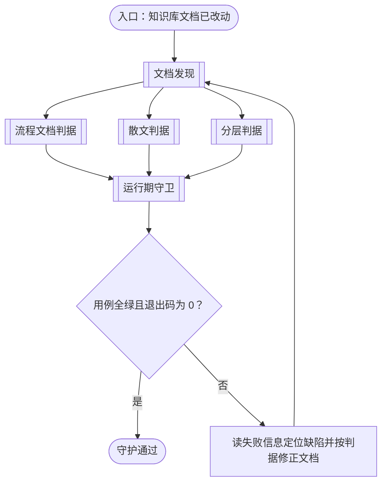
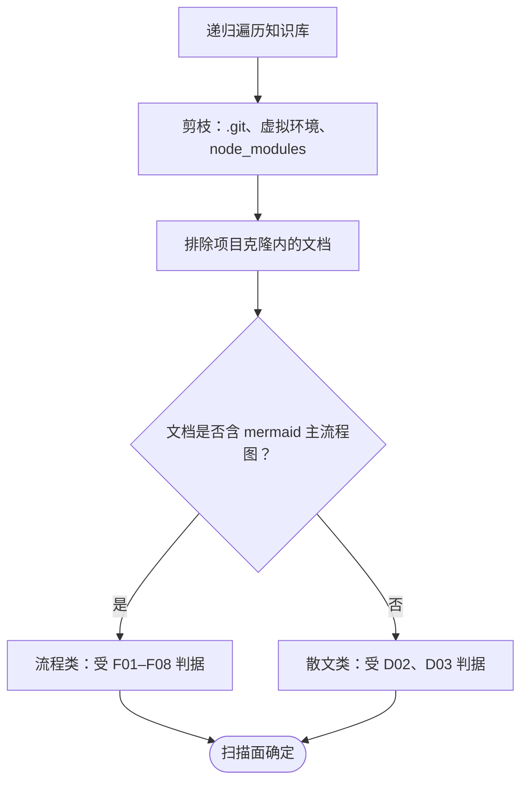
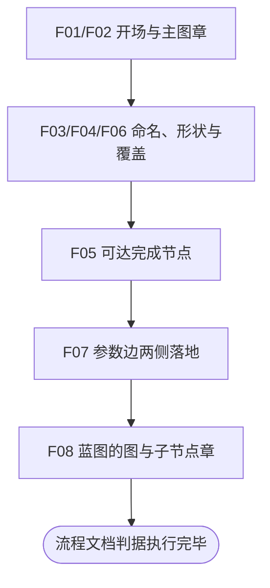
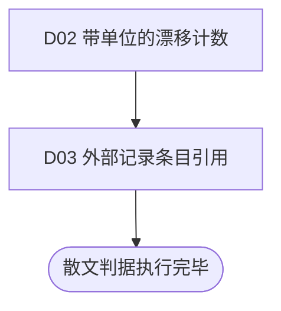
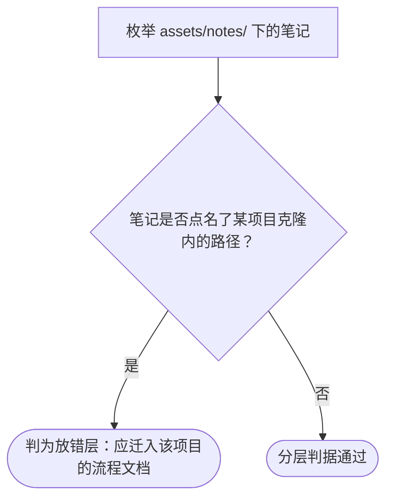
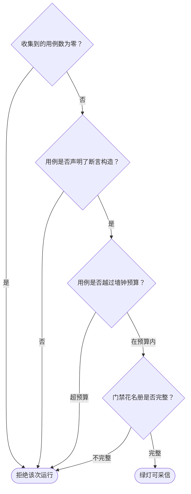

# 知识库文档守护

本目录把[文档撰写规范](../.agents/skills/doc-writing/reference/doc-writing-constraints.md)与[流程类文档撰写规范](../.agents/skills/process-doc-writing/reference/process-doc-writing-constraints.md)中**可机械判定**的那部分落成可执行的检查。规范说应当怎么写，这里判定是否真的这么写了；两者分开存放，改判据不动用例，改用例也不悄悄重定义判据。

## 主流程图



## START_LINT

本节点是流程入口，确认这次改动的对象是本知识库自己的文档。本节点不出分支，唯一出边通向 `DISCOVER`。

**输入**

- `CHANGE_READY`：改动状态；来源为知识库的编辑动作。

**输出**

- `LINT_TARGET`：待守护的文档集合；去向为 `DISCOVER`。

## DISCOVER

本节点承载文档发现的子流程：按扫描面递归找出受守护的文档，并按是否含主流程图分成两类。本节点不出分支，唯一出边通向 `FLOW_GATES` 与 `PROSE_GATES`。

**发现而非登记**：扫描面由目录递归得出，不靠一份清单。清单本身就是第二事实源——新增文档若忘记登记，它就对守护不存在，而这正是守护要防的形态。



### DISC_WALK

从知识库根递归遍历。仓库根由 `_harness/paths.py` 的 `repository_root()` 向上取最近一个同时带 `_meta/` 与 `assets/` 的祖先目录得到——两个标志缺一不可，只认其一都会误命中无关祖先。

**输入**

- `LINT_TARGET`：待守护的文档集合；来源为 `START_LINT`。
- `LINT_TARGET`：修正后的文档集合；来源为 `LINT_FIX`。

**输出**

- `DOC_CANDIDATES`：候选文档路径；去向为 `DISC_PRUNE`。

### DISC_PRUNE

在**下降之前**剪枝，而不是枚举之后再过滤。一个虚拟环境或 `node_modules` 树被递归展开的成本是分钟级，而它们的名字在进入前就已可知。

**输入**

- `DOC_CANDIDATES`：候选文档路径；来源为 `DISC_WALK`。

**输出**

- `DOC_PRUNED`：剪枝后的文档路径；去向为 `DISC_SCOPE`。

### DISC_SCOPE

排除项目克隆内的文档。项目克隆是另一个仓库，其内部布局由该项目决定，本知识库不评判它的文档——判据是「被守护对象属于谁」，不是「文件在不在本知识库的目录树下」。项目自己的流程文档 `feature-flow.md` 位于克隆**之外**，属本知识库，因此仍在扫描面内。

**输入**

- `DOC_PRUNED`：剪枝后的文档路径；来源为 `DISC_PRUNE`。

**输出**

- `DOCS_IN_SCOPE`：受守护的文档路径；去向为 `DISC_SPLIT`。

### DISC_SPLIT

按是否含 mermaid 主流程图分类。判据是**图**，不是目录：样张与项目流程文档是同一类产物，任一方出现在任何位置都被同等守护。

**输入**

- `DOCS_IN_SCOPE`：受守护的文档路径；来源为 `DISC_SCOPE`。

**输出**

- `FLOW_DOCS`：含主流程图的文档；去向为 `FLOW_GATES`。
- `PROSE_DOCS`：其余文档；去向为 `PROSE_GATES`。

### DISC_FLOW

流程类的去向：这些文档含主流程图，受 F01–F08 判据。本节点不出分支，唯一出边通向 `DISC_DONE`。

**输入**

- `DOCS_IN_SCOPE`：受守护的文档路径；来源为 `DISC_SCOPE`。

**输出**

- `FLOW_DOCS`：含主流程图的文档；去向为 `DISC_DONE`。

### DISC_PROSE

散文类的去向：其余文档受 D02、D03 判据。本节点不出分支，唯一出边通向 `DISC_DONE`。

**输入**

- `DOCS_IN_SCOPE`：受守护的文档路径；来源为 `DISC_SCOPE`。

**输出**

- `PROSE_DOCS`：其余文档；去向为 `DISC_DONE`。

### DISC_DONE

扫描面确定的汇合点。本节点无出边。

**输入**

- `FLOW_DOCS`：含主流程图的文档；来源为 `DISC_SPLIT`。
- `PROSE_DOCS`：其余文档；来源为 `DISC_SPLIT`。

**输出**

- `SCOPE_READY`：扫描面；去向为 `FLOW_GATES`、`PROSE_GATES` 与 `PLACEMENT_GATE`。

## FLOW_GATES

本节点承载流程文档判据的子流程：对每份含主流程图的文档执行 F01–F08 中可机械判定的部分。本节点不出分支，唯一出边通向 `GUARD`。



### FG_PROLOGUE

执行 F01 与 F02：H1 之后的首个内容块必须是陈述目标的自然段落；首个 h2 章节的正文只能是主流程图本身。

**输入**

- `SCOPE_READY`：扫描面；来源为 `DISC_DONE`。
- `FLOW_DOCS`：含主流程图的文档；来源为 `DISC_SPLIT`。

**输出**

- `PROLOGUE_RESULT`：逐文档的判定；去向为 `FG_NODES`。

### FG_NODES

执行 F03、F04 与 F06：标识符须为标准化英文记号且描述名在同图内唯一；节点的形状须随它在图中的角色（分叉即为条件型），且条件型必须真的有分支；主图的每个节点须有同名章节。

**输入**

- `PROLOGUE_RESULT`：前一组判定；来源为 `FG_PROLOGUE`。

**输出**

- `NODES_RESULT`：逐文档的判定；去向为 `FG_REACH`。

### FG_REACH

执行 F05：允许成环，但每个节点都须沿有向边可达某个完成节点。无出口的环与无出边的死胡同同属违规。

**输入**

- `NODES_RESULT`：前一组判定；来源为 `FG_NODES`。

**输出**

- `REACH_RESULT`：逐文档的判定；去向为 `FG_PARAMS`。

### FG_PARAMS

执行 F07：每个节点的参数栏须以固定槽位列出输入与输出，且每条声明的参数边两侧都落地——生产者声明了输出，消费者就得声明同名输入。

**输入**

- `REACH_RESULT`：前一组判定；来源为 `FG_REACH`。

**输出**

- `PARAMS_RESULT`：逐文档的判定；去向为 `FG_BLUEPRINT`。

### FG_BLUEPRINT

执行 F08 中可判定的两条：子流程蓝图型节点的章节内须绘出它自己的图；该图的内层节点须在更深一层各有一个章节。

**输入**

- `PARAMS_RESULT`：前一组判定；来源为 `FG_PARAMS`。

**输出**

- `BLUEPRINT_RESULT`：逐文档的判定；去向为 `FG_DONE`。

### FG_DONE

流程文档判据执行完毕的汇合点。本节点无出边。

**输入**

- `BLUEPRINT_RESULT`：逐文档的判定；来源为 `FG_BLUEPRINT`。

**输出**

- `FLOW_VERDICT`：流程文档判定；去向为 `GUARD`。

## PROSE_GATES

本节点承载散文判据的子流程：执行 D02 与 D03 中可机械判定的子集。本节点不出分支，唯一出边通向 `GUARD`。



### PG_TRANSCRIBE

执行 D02：正文不得把读者能自行取回的事实写成结论。可判定的子集是**带单位的计数表达**（「当前为 N 项」「实测 N 个文件」这类）。

**能力边界必须写成断言**：本判据只覆盖带单位的计数，不含「两种落地形态」这类未带单位的转述副本。绿灯因此**不等于合规**——这不是免责声明，是一条被验证的事实，见 `README.md` 的判断项一节。

**输入**

- `SCOPE_READY`：扫描面；来源为 `DISC_DONE`。
- `PROSE_DOCS`：其余文档；来源为 `DISC_SPLIT`。

**输出**

- `TRANSCRIBE_RESULT`：逐文档的判定；去向为 `PG_POINTER`。

### PG_POINTER

执行 D03：正文不得把事实表述为对另一份记录中某条目的引用（编号、轮次标签、账本条目）。引用使本文档成为那份记录的索引副本，记录一经移动或废弃，引用即成孤儿。

**输入**

- `TRANSCRIBE_RESULT`：前一组判定；来源为 `PG_TRANSCRIBE`。

**输出**

- `POINTER_RESULT`：逐文档的判定；去向为 `PG_DONE`。

### PG_DONE

散文判据执行完毕的汇合点。本节点无出边。

**输入**

- `POINTER_RESULT`：逐文档的判定；来源为 `PG_POINTER`。

**输出**

- `PROSE_VERDICT`：散文判定；去向为 `GUARD`。

## PLACEMENT_GATE

本节点承载分层判据：判定一条信息是否归它所在的目录，而不是判定它写得对不对。本节点不出分支，唯一出边通向 `GUARD`。

**形态与分层是两件事，这道门禁的存在理由正是前者盖不住后者**：一份文档可以把 F01–F08 与 D02/D03 全部满足，却仍然放在错误的目录里——规范被读了、行文干净，而信息归档在读者不会去找的地方。两种失败的代价不同：形态缺陷是局部的、就地可修；分层缺陷意味着这份记录是某个有权威承载处的东西的副本，从写下的那天起就与该权威分叉，而分叉不可见，因为两份文本各自都合规。



### PL_SCAN

枚举 `assets/notes/` 下的全部笔记（README 除外）。**发现而非登记**：靠遍历得到，不靠一份清单——清单本身就是第二事实源，新增笔记若忘记登记，它就对守护不存在。

**输入**

- `SCOPE_READY`：扫描面；来源为 `DISC_DONE`。

**输出**

- `NOTE_DOCS`：待判定的笔记路径；去向为 `PL_PLACE`。

### PL_PLACE

执行 `assets/notes/README.md` 的准入判据中可判定的那一条：笔记进 `assets/notes/`，当且仅当它**跨会话仍成立**且**没有别处可放**。判据是第二条——一条点名了 `assets/projects/<项目>/<仓库>/…` 的笔记，就是在描述那个项目，而本知识库已把该项目的已实现流程写在 `assets/projects/<项目>/feature-flow.md`。

**能力边界必须写成断言**：本判据只覆盖**点名了克隆内路径**的笔记，因为这些路径是副本会逐字带上的东西。用自然语言复述了某个项目流程、却一个路径都没提的笔记，模式抓不到——它与「恰好提到该项目的正常跨会话笔记」在文本上无从区分。绿灯因此**不等于**归层正确，见本文末的判断项一节。

**输入**

- `NOTE_DOCS`：待判定的笔记路径；来源为 `PL_SCAN`。

**输出**

- `NOTE_DOCS`：已判定的笔记路径；去向为 `PL_OFFEND` 或 `PL_OK`。

### PL_OFFEND

判为放错层的出口：该笔记描述的是某个项目，而本知识库已把那个项目的流程写在它的 `feature-flow.md`。**处置是迁移而非删除**——把内容按流程文档形态并入该项目文档，然后整篇删除笔记；`assets/notes/` 不留「已废弃」式存档。

**输入**

- `NOTE_DOCS`：判为放错层的笔记；来源为 `PL_PLACE`。

**输出**

- `placement_defect`：放错层的判定；去向为 `GUARD`。

### PL_OK

分层判据通过的出口：`assets/notes/` 下没有点名项目克隆内部的笔记。**这不等于该目录内所有笔记都归层正确**——未点名路径的复述副本抓不到，见判断项一节。

**输入**

- `NOTE_DOCS`：未点名项目内部的笔记；来源为 `PL_PLACE`。

**输出**

- `placement_defect`：无放错层的判定，值为空；去向为 `GUARD`。

## GUARD

本节点承载运行期守卫：三条使「全绿」可信的检查，以及门禁自身的元守护。本节点不出分支，唯一出边通向 `LINT_VERDICT`。

**这三条守卫回答的不是「哪些用例失败了」,而是「这次运行是否真的执行了断言」**。一个套件可以在每个用例体都是空壳、收集结果为零、或某条用例挂死时,给出与真实全绿无从区分的输出。



### GUARD_COLLECT

拒绝零用例的运行。零用例来自路径写错、过滤词无匹配、节点被删空，而 pytest 的默认摘要会被自动化读成成功。

**输入**

- `FLOW_VERDICT`：流程文档判定；来源为 `FG_DONE`。
- `PROSE_VERDICT`：散文判定；来源为 `PG_DONE`。
- `placement_defect`：放错层的判定；来源为 `PL_OFFEND` 或 `PL_OK`。

**输出**

- `COLLECTED`：已收集的用例数；去向为 `GUARD_ASSERT` 或 `GUARD_REFUSE`。

### GUARD_ASSERT

判定每个用例是否声明了断言构造。**判据是「是否声明」而非「是否执行到」**：断言写在条件分支内的用例，其分支未被走到时不算空壳——那是有效用例，只是本次输入没触发。可被机器判定的是「整个用例没有断言」，那才是要抓的形态。

**输入**

- `COLLECTED`：已收集的用例数；来源为 `GUARD_COLLECT`。

**输出**

- `GUARD_PASSED`：布尔；去向为 `GUARD_BUDGET` 或 `GUARD_REFUSE`。

### GUARD_BUDGET

判定用例是否越过墙钟预算。预算的量级属于用例而非全局：一条扫描全库的用例，其墙钟随知识库规模增长，与任何单个判据无关。

**输入**

- `GUARD_PASSED`：布尔；来源为 `GUARD_ASSERT`。

**输出**

- `BUDGET_OK`：布尔；去向为 `GUARD_META` 或 `GUARD_REFUSE`。

### GUARD_META

判定门禁花名册是否完整：登记的每个门禁文件存在、用例数不低于下限、且没有未登记的门禁文件。没有这层元守护，所有判据都能被一次删除静默拆除而测试仍然全绿。

**输入**

- `BUDGET_OK`：布尔；来源为 `GUARD_BUDGET`。

**输出**

- `ROSTER_OK`：布尔；去向为 `GUARD_PASS` 或 `GUARD_REFUSE`。

### GUARD_REFUSE

拒绝该次运行，不以绿灯收尾。本节点无出边。

**输入**

- `ROSTER_OK`：布尔；来源为 `GUARD_META`。
- `COLLECTED`：已收集的用例数；来源为 `GUARD_COLLECT`。
- `GUARD_PASSED`：布尔；来源为 `GUARD_ASSERT`。
- `BUDGET_OK`：布尔；来源为 `GUARD_BUDGET`。

**输出**

- 无。

### GUARD_PASS

绿灯可采信：这次运行真的执行了断言。本节点无出边。

**输入**

- `ROSTER_OK`：布尔；来源为 `GUARD_META`。

**输出**

- `GUARDED`：运行可信状态；去向为 `LINT_VERDICT`。

## LINT_VERDICT

本节点是判定点：判据是全部用例全绿且退出码为 0。成立时出边通向 `LINT_PASS`；不成立时出边通向 `LINT_FIX`。

**输入**

- `GUARDED`：运行可信状态；来源为 `GUARD_PASS`。

**输出**

- `LINT_GREEN`：布尔；去向为 `LINT_PASS` 或 `LINT_FIX`。

## LINT_FIX

在报红时进入：读失败信息里断言的具体原因定位缺陷，修正**文档**（若文档确实违规）或**判据实现**（若判据读错了文档），然后回到 `DISCOVER` 重跑。本节点不出分支，唯一出边回到 `DISCOVER`。

**基线优先**：判据报红时先问「是不是判据读错了」。本目录的多数缺陷都是这样发现的——先跑基线，基线不绿先修判据，而不是先改文档。若为了变绿而放宽判据，得到的是空转的绿灯，按根 AGENTS.md 的「禁止空转」条属 FAIL。

**破坏性反证的复原不得依赖记忆**：为验证某条判据真会报红而临时改坏文档时，备份放工作区内、复原范围锚定到那一个文件，并用 `trap ... EXIT` 兜底——单次调用被超时杀掉时，只有 `trap` 能保证复原。

**输入**

- `LINT_GREEN`：布尔；来源为 `LINT_VERDICT`。

**输出**

- `LINT_TARGET`：修正后的文档集合；去向为 `DISCOVER`。

## LINT_PASS

本节点是流程的结束节点：本知识库的文档在其可机械判定的判据上全部成立。本节点无出边。

**输入**

- `LINT_GREEN`：布尔；来源为 `LINT_VERDICT`。

**输出**

- 无。

## 运行方式

```bash
UV_CACHE_DIR=.uv-cache uv run --with pytest==9.1.1 pytest _lint -q
```

判据是**全绿且退出码为 0**。缓存与解释器落在仓库内，因为宿主机的默认缓存目录只读。版本钉在命令里，不引入 `pyproject.toml` 与 `uv.lock`：本目录的依赖只有 pytest，多两个工程文件就要多维护两处一致性。

## 门禁对照

| 文件 | 守护的判据 |
| --- | --- |
| `test_flowdoc_prologue.py` | F01 目标段、F02 主图章只含图 |
| `test_flowdoc_nodes.py` | F03 标识符与描述名、F04 形状随角色、F06 节点覆盖 |
| `test_flowdoc_reachability.py` | F05 每节点可达完成节点 |
| `test_flowdoc_params.py` | F07 参数栏齐备与边两侧落地 |
| `test_flowdoc_blueprint.py` | F08 蓝图绘自身图、内层节点成章 |
| `test_doc_placement.py` | `assets/notes/` 准入判据的「没有别处可放」一条：笔记不得描述某个项目克隆内部 |
| `test_suite_integrity.py` | 门禁花名册与守卫钩子 |

## 判断项：本目录**不**判定的部分

不判定不等于不重要，只等于机器判不了。以下需人读，**不得**因为它们未被断言就读作已合规：

- **F06 的自足**：「只读该章节，读者能否说出该节点做什么、走哪条出边」。可判定的是章节存在与否，判不了章节写得好不好。
- **F02 的独立可读**：主图能否被独立读懂。
- **F03 的标识符是否贴切**：可判定的是形态（大写英文记号），判不了这个记号是否选得准。
- **D02 的未带单位转述**：「本工程有两种落地形态」这类副本不带单位，模式抓不到。带单位的计数已覆盖。
- **D03 的非编号引用**：不写成编号的引用（「见上一次讨论」）不可寻址，无法与普通行文区分。
- **分层判据的未点名情形**：一条用自然语言复述了某个项目流程、却未点名任何克隆内路径的笔记，与「恰好提到该项目的正常跨会话笔记」在文本上无从区分。`test_doc_placement.py` 只覆盖点名了路径的那一类。**这条缺口是有代价的**：本目录的全绿只说明已被覆盖的那一类成立，不说明 `assets/notes/` 里没有放错层的文档——判层靠人读该目录 README 的准入判据。
- **D04–D09**：陈述当前状态、不采纳会话视角、不承载推导、不确定表述有边界、语言不混用、修订不变命题——全部是语义判据，本目录不涉。
- **C01–C05**：agent 执行约束，与文档形态无关。
