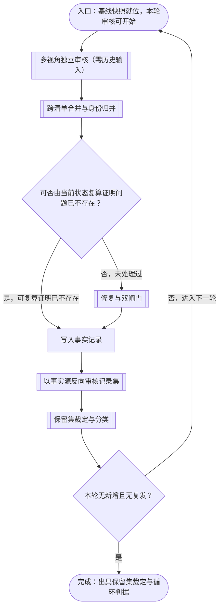
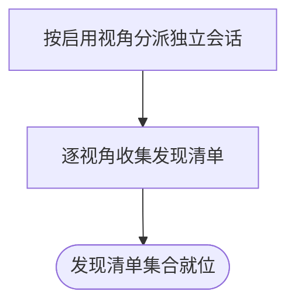
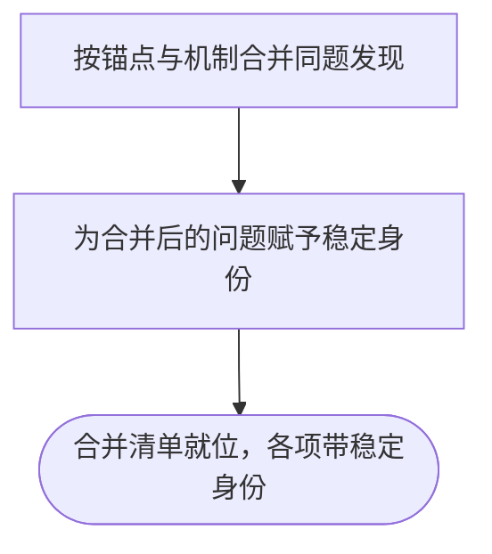
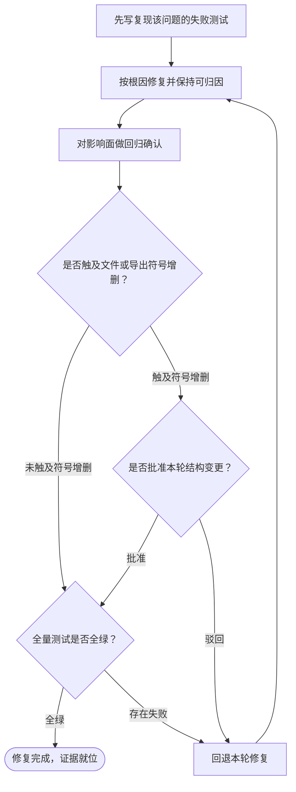
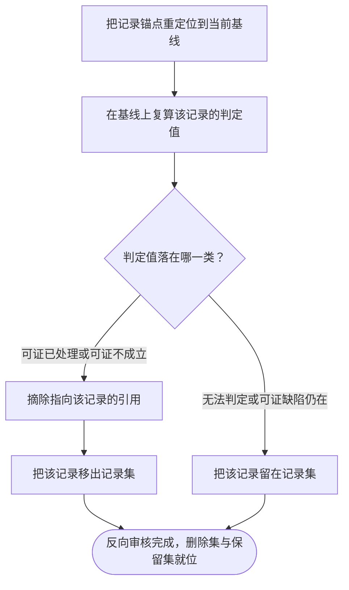
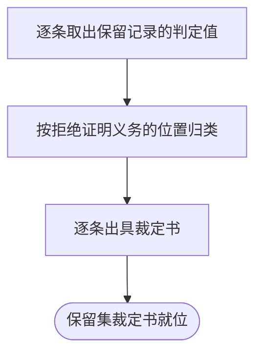

# 审核事实记录的循环流程

本文档交代一套以事实记录承载审核发现的循环机制：从基线快照就位、多视角独立审核产出问题清单开始，经跨清单合并与身份归并、记录集校验分流、修复与双闸门、写入事实记录，到以唯一事实源反向审核整个记录集、裁定保留集、判定本轮循环可否终止为止。读者据此可回答三件事：一条审核发现如何进入记录集、记录集如何在后续轮次参与去重、什么样的记录无法被事实源删除因而必须长期保留。文档不规定审核视角的注册项，也不规定既有的门禁与测试布局，二者分别取各自的归属处。

## 主流程图

## START_ROUND

本节点是每轮的起点，确认本轮审核锚定在哪一个基线切面上。基线快照记录文件清单与内容摘要，本轮全部证据一律锚定该切面：发现、裁决、修复证据与记录都指向它，修复之后不追改。本节点不出分支，唯一出边通向 `AUDIT_FANOUT`；来自 `CONVERGE_CHECK` 的回边使本节点在未达终止条件时再次进入。

基线切面必须唯一。工作树、索引与提交三者是不同切面，同一份记录在三者上的判定值可以不同，故落笔前先指名本轮取哪一个。审核进行期间不得有其它过程写同一工作区——若基线在审核途中被外部改动，本轮各视角所看到的对象不再是同一份，跨视角合并与跨轮计数同时失去依据。

**输入**

- `SNAPSHOT_REF`：基线切面引用，含文件清单与内容摘要；来源为工程部署位置。

**输出**

- `ROUND_CONTEXT`：本轮上下文，含切面引用与轮次序号；去向为 `AUDIT_FANOUT`。

**失败模式**

基线切面未指名而直接开审时，同一份发现可能同时按工作树与索引两种口径比对，判定结果随读者取的切面漂移，且事后无法从记录本身判断当时取的是哪一个。

## AUDIT_FANOUT

本节点承载审核子流程：对同一基线分派多个互不通信的独立审核会话，各自产出一份发现清单。审核会话的输入只含当前基线本身，不含记录集、不含先前轮次的结论与摘要。本节点不出分支，唯一出边通向 `CLASSIFY_MERGE`。

把记录集排除在审核会话之外是本机制的第一条设计约束。审核会话的职责是观测当前对象，不是判断某个现象是否曾经出现过——后者需要历史，而历史不是它的输入。去重责任因此全部下移到 `GATE_HISTORY` 与 `CLASSIFY_MERGE`，审核会话只负责把看到的现象如实写出。

此约束换来的是可观测性：审核会话看不到记录集，就无法把问题判成「已处理」而不再报告，重复报告因此必然出现且必然可计数。反过来，一旦把记录集注入审核会话，重复报告会消失——不是因为它被处理了，而是因为审核会话主动不再报告它。前者是噪声，可计数、可处置；后者是沉默，与真实收敛同形。

**输入**

- `ROUND_CONTEXT`：本轮上下文；来源为 `START_ROUND`。

**输出**

- `FINDING_LIST`：本轮的发现清单集合，每个视角一份；去向为 `CLASSIFY_MERGE`。

**失败模式**

向审核会话注入记录集或先前结论时，该会话对问题的报告率不再反映问题在基线中的实际存在，且这一衰减在指标上与收敛无法区分。

### AUDIT_DISPATCH

本节点按本轮启用的视角集合分派独立会话，每个视角一个会话，会话之间不共享上下文与产出。视角集合须逐轮固定：视角数变化时，发现总量随之变化，跨轮的计数不再可比。本节点不出分支，唯一出边通向 `AUDIT_COLLECT`。

**输入**

- `ROUND_CONTEXT`：本轮上下文；来源为 `START_ROUND`。

**输出**

- `PERSPECTIVE_SET`：本轮启用的视角集合；去向为 `AUDIT_COLLECT`。

### AUDIT_COLLECT

本节点逐视角收集发现清单，每条发现携带可核对的位置引用与摘录。清单为空时也须显式产出一份空清单，不得缺省——空清单本身是观测结果。本节点不出分支，唯一出边通向 `AUDIT_READY`。

**输入**

- `PERSPECTIVE_SET`：本轮启用的视角集合；来源为 `AUDIT_DISPATCH`。

**输出**

- `FINDING_LIST`：发现清单集合；去向为 `CLASSIFY_MERGE`。

### AUDIT_READY

本节点是子流程的结束节点，表示发现清单集合已就位。本节点无出边。

**输入**

- `FINDING_LIST`：发现清单集合；来源为 `AUDIT_COLLECT`。

**输出**

- 无。

## CLASSIFY_MERGE

本节点承载合并子流程：把同轮多份清单中指向同一机制点的发现并为一条，再为合并后的每个问题赋予一个稳定身份。合并依据是锚点与机制描述，不是词面相似度。本节点不出分支，唯一出边通向 `GATE_HISTORY`。

稳定身份是记录集得以参与去重的前提。身份不由问题陈述的字面决定——同一问题换一种措辞重述即成新问题的机制，无法累积去重效果；不同问题共用同一身份则修一处即被当作全部处理。身份取一个不透明且不可变的标识，与问题陈述解耦；「同一问题」的关系由记录之间的关系边承载，不由标识本身携带语义。

**输入**

- `FINDING_LIST`：发现清单集合；来源为 `AUDIT_FANOUT`。

**输出**

- `MERGED_LIST`：合并后的问题清单，每项带稳定身份与证据并集；去向为 `GATE_HISTORY`。

**失败模式**

以词面相似度替代机制比对时，机器可对全部条目给出历史命中，而其中多数经复核属于表面相似——这类误命中会被下游当作已处理，使真问题不再进入修复队列。

### MERGE_ANCHOR

本节点按锚点与机制描述合并同题发现，把证据取并集、严重度取最高、测试缺口归因取最具体者。同一锚点上出现相反结论时，依证据的可当场核验程度裁定；双方证据均可核验仍相持者，标记为待人工仲裁，不得由本节点单方定案。本节点不出分支，唯一出边通向 `MERGE_IDENTITY`。

**输入**

- `FINDING_LIST`：发现清单集合；来源为 `AUDIT_FANOUT`。

**输出**

- `ANCHOR_GROUP`：按锚点聚合的发现分组；去向为 `MERGE_IDENTITY`。

### MERGE_IDENTITY

本节点为每个合并后的问题赋予稳定身份，并在写入记录时登记它与既有记录之间的关系边。身份一经分配即不再改变，重新分组时不重编号，以免与已有引用失配。本节点不出分支，唯一出边通向 `MERGE_READY`。

**输入**

- `ANCHOR_GROUP`：按锚点聚合的发现分组；来源为 `MERGE_ANCHOR`。

**输出**

- `MERGED_LIST`：合并后的问题清单；去向为 `GATE_HISTORY`。

### MERGE_READY

本节点是子流程的结束节点，表示合并清单已就位。本节点无出边。

**输入**

- `MERGED_LIST`：合并后的问题清单；来源为 `MERGE_IDENTITY`。

**输出**

- 无。

## GATE_HISTORY

本节点对合并后的每个问题查询记录集，并判定该问题在当前基线上的状态。判定只认一条依据：能否在当前基线上复算出「该问题所描述的现象已不存在」的正面证据。能复算证明者判为已了结，不再进入修复队列；不能复算证明者，无论记录集里写着什么状态，一律进入修复队列。本节点有两条出边：可复算证明已不存在者通向 `WRITE_RECORD`，其余通向 `REPAIR_FIX`。

记录集在本节点中的合法角色是**待验证假设的索引**，不是结论的来源。命中一条状态为已修复的记录，不等于该问题在当前基线上已不存在——记录的状态字段记载的是当时证据下的处置结论，它不随基线演进而自动保持成立。把状态字段直接当作已处理结论，等价于用关于历史的断言替代关于当前状态的断言。

这条约束有独立的工程依据，不由本机制自创：结论的支撑必须取自当前状态，当前状态可取而实际改用历史记录者，其论证不成立。记录集中出现的现象可以用于生成待验证的假设，但假设的结论仍须回到当前状态取证。

**输入**

- `MERGED_LIST`：合并后的问题清单；来源为 `CLASSIFY_MERGE`。
- `RECORD_SET`：记录集；来源为上一轮的 `REVERSE_AUDIT`。

**输出**

- `SETTLED_SET`：经复算证明现象已不存在的问题集合；去向为 `WRITE_RECORD`。
- `UNRESOLVED_SET`：未能复算证明已不存在的问题集合；去向为 `REPAIR_FIX`。

**失败模式**

以记录状态字段替代基线复算时，一条被误标为已修复的记录会永久遮蔽该问题：它不再进入修复队列，也不再出现在任何清单中，而修复从未发生。此失效与真实收敛同形，二者都表现为本轮无新增问题。

## REPAIR_FIX

本节点承载修复子流程：只处理裁决为待修复的问题，先以可复现的失败测试锁定该问题，再按根因修复，经双闸门后产出可复算的修复证据。本节点不出分支，唯一出边通向 `WRITE_RECORD`。

修复须保持单调：本轮改动不得撤销既有已修复面，也不得引入新的可审核面而不被记录。修复动作本身是问题集的生成器——新增的守卫、句柄、导出、状态字段与测试都会成为下一轮审核的对象，而修复者的注意力只覆盖本轮改动所触及的范围，审核的覆盖面则是整个基线。这处不对称是循环不收敛的结构性来源之一。

**输入**

- `UNRESOLVED_SET`：待修复的问题集合；来源为 `GATE_HISTORY`。

**输出**

- `REPAIR_EVIDENCE`：修复证据，含由红到绿的测试引用与闸门结论；去向为 `WRITE_RECORD`。

**失败模式**

只修同类缺陷的一个点而记为全部处理时，其余同族位置在后续轮次以复发形式重新出现，而记录集里对应的条目状态仍是已修复。

### REPAIR_TEST_FIRST

本节点先写一条能复现该问题的失败测试，或在已有测试未拦住该问题时指出缺口类型——覆盖缺口、断言缺口、测试漂移，或与测试无关。测试先行是修复成立的判据：没有一条由红转绿的用例，就无从区分「缺陷已消除」与「缺陷仍在而未被观测」。本节点不出分支，唯一出边通向 `REPAIR_ROOT_CAUSE`。

**输入**

- `UNRESOLVED_SET`：待修复的问题集合；来源为 `GATE_HISTORY`。

**输出**

- `FAILING_CASE`：能复现该问题的失败用例；去向为 `REPAIR_ROOT_CAUSE`。

### REPAIR_ROOT_CAUSE

本节点修复的目标是使该问题所描述的现象在当前基线上不再存在，并使每一处改动都能引用到它所属的问题身份。修复面由根因决定：同族位置由同一根因导出时一并纳入，不以「与该问题直接相关的代码」为界。本节点不出分支，唯一出边通向 `REPAIR_REGRESS`。

**输入**

- `FAILING_CASE`：能复现该问题的失败用例；来源为 `REPAIR_TEST_FIRST`。
- `ROLLBACK_BASELINE`：被驳回后的回退基线；来源为 `REPAIR_ROLLBACK`。

**输出**

- `PATCHED_BASELINE`：修复后的基线；去向为 `REPAIR_REGRESS`。

### REPAIR_REGRESS

本节点对改动的影响面做回归确认，除对应函数的用例之外，还须列出调用链与边界位置并逐一确认。回归多数发生在调用方与未被修改的文件中，只跑被改文件的用例不足以覆盖。本节点不出分支，唯一出边通向 `GATE_STRUCTURE`。

**输入**

- `PATCHED_BASELINE`：修复后的基线；来源为 `REPAIR_ROOT_CAUSE`。

**输出**

- `REGRESSION_RESULT`：影响面回归结论；去向为 `GATE_STRUCTURE`。

### GATE_STRUCTURE

本节点是结构闸：比较本轮起点与当前基线的文件与导出符号清单，出现文件或符号的增删即触发。触发不构成失败——结构性调整可能正当，但必须由人知情并裁决。触发时本节点提请人工仲裁；未触发时本节点直接放行。本节点有两条出边：触及增删者通向 `REPAIR_HUMAN`，未触及者通向 `GATE_TEST`。

**输入**

- `REGRESSION_RESULT`：影响面回归结论；来源为 `REPAIR_REGRESS`。

**输出**

- `STRUCTURE_DECISION`：结构闸结论，含人裁结果或放行标记；去向为 `GATE_TEST` 与 `REPAIR_HUMAN`。

### GATE_TEST

本节点是测试闸：要求全量测试通过。未全绿即视为修复无效。绿灯的强度由测试的判别力决定，不由绿灯本身决定——一条恒真断言、一处被放宽的断言、一个被跳过的用例都能产出绿灯而不构成修复。本节点有两条出边：全绿者通向 `REPAIR_DONE`，存在失败者通向 `REPAIR_ROLLBACK`。

**输入**

- `STRUCTURE_DECISION`：结构闸结论；来源为 `GATE_STRUCTURE`。
- `HUMAN_VERDICT`：结构变更获批的裁决；来源为 `REPAIR_HUMAN`（仅结构闸触发且获批时）。

**输出**

- `TEST_RESULT`：全量测试结论与失败用例定位；去向为 `REPAIR_DONE` 与 `REPAIR_ROLLBACK`。

### REPAIR_HUMAN

本节点在结构闸触发时提请人工仲裁，附清晰的上下文——差异、原因与影响面。人类裁决为批准、驳回或调整；批准者继续过测试闸，驳回者回退本轮修复。本节点有两条出边：批准者通向 `GATE_TEST`，驳回者通向 `REPAIR_ROLLBACK`。

**输入**

- `STRUCTURE_DECISION`：结构闸结论；来源为 `GATE_STRUCTURE`。

**输出**

- `HUMAN_VERDICT`：人工裁决结果；去向为 `GATE_TEST` 与 `REPAIR_ROLLBACK`。

### REPAIR_ROLLBACK

本节点回退本轮修复，把基线恢复到本轮起点，连同失败测试一起撤销。回退后重新进入修复，直到产生可过闸的改动或转由人工主导。本节点不出分支，唯一出边通向 `REPAIR_ROOT_CAUSE`。

**输入**

- `TEST_RESULT`：全量测试结论；来源为 `GATE_TEST`。
- `HUMAN_VERDICT`：人工裁决结果；来源为 `REPAIR_HUMAN`。

**输出**

- `ROLLBACK_BASELINE`：被驳回后的回退基线；去向为 `REPAIR_ROOT_CAUSE`。

### REPAIR_DONE

本节点是子流程的结束节点，表示修复完成且证据就位。本节点无出边。

**输入**

- `TEST_RESULT`：全量测试结论；来源为 `GATE_TEST`。

**输出**

- 无。

## WRITE_RECORD

本节点把本轮的结果写入记录集：新问题建档，已了结的问题附证据并更新状态，复发的问题追加复发留痕并另立新档。记录的事实面一经写入即追加不可变，可变迁的只有管理面状态。本节点不出分支，唯一出边通向 `REVERSE_AUDIT`。

写入的判据是证据而非结论。状态置为已了结之前，必须先有一条由红转绿的测试引用挂在同一条记录上：没有可复算证据的「已修复」是自我声明，它与真实修复在记录上无法区分。同理，记录只写取值可得而权威不可得时的契约，「已修复」不写「修复了哪一行」——后者随基线漂移即刻失配。

**输入**

- `MERGED_LIST`：合并后的问题清单；来源为 `CLASSIFY_MERGE`。
- `SETTLED_SET`：经复算证明现象已不存在的问题集合；来源为 `GATE_HISTORY`。
- `REPAIR_EVIDENCE`：修复证据；来源为 `REPAIR_FIX`。

**输出**

- `RECORD_SET`：更新后的记录集；去向为 `REVERSE_AUDIT`。

**失败模式**

把记录的状态字段当作已处理结论使用时，本节点写下的每一处误标都会在后续轮次成为遮蔽真问题的依据，且误标本身不再被任何后续步骤质疑。

## REVERSE_AUDIT

本节点承载反向审核子流程：以当前基线为唯一事实源，逐条重审记录集中的记录，判定它能否被证明为已处理或不成立，能证明者移出记录集。本节点不出分支，唯一出边通向 `RETAIN_TRIAGE`。

反向审核与常规审核的方向相反：常规审核从基线出发发现新问题，反向审核从记录出发回基线求证。二者的判定对象不同，可判定性也不同。反向审核要证的是「该现象在基线上不存在」，这是一个全称否定命题——它要求对全部环境与全部输入成立，而基线只是单一状态。用检索、匹配一类有限手段去确认全称否定，方向上是错的：搜不到反例不等于反例不存在。

故本节点的判定值域必须是三值而非二值：可证已处理、可证不成立，以及无法判定。把无法判定折叠进任何一侧都会产生系统性错误——归入已处理即成误删，归入仍存在则记录集只增不减。

**输入**

- `RECORD_SET`：记录集；来源为 `WRITE_RECORD`。

**输出**

- `DELETE_SET`：经证明可移出的记录集合；去向为 `RETAIN_TRIAGE`。
- `RETAIN_SET`：无法证明可移出的记录集合；去向为 `RETAIN_TRIAGE`。
- `RECORD_SET`：移除 `DELETE_SET` 后保留的记录集；去向为下一轮 `GATE_HISTORY`。

**失败模式**

以记录状态字段本身充当证明时，反向审核退化为对记录集的一次重读，判定结果与记录写入时的结论完全一致，等价于没有审核。

### REVERSE_REANCHOR

本节点把每条记录的锚点重定位到当前基线，逐条核对它所引用的文件与位置是否仍然存在、是否仍指向同一对象。锚点失配的记录无法进入复算，判为无法判定并直接保留。本节点不出分支，唯一出边通向 `REVERSE_PROBE`。

这一步骤不可省略。记录的证据锚定在写入时的基线上，此后基线的演进会使行号漂移、文件改名或符号迁移，而记录本身不随之更新。锚点偏移越大，能在当前基线上复算的比例越低——反向审核的可靠性与锚点失配程度成反比。

**输入**

- `RECORD_SET`：记录集；来源为 `WRITE_RECORD`。

**输出**

- `REANCHORED_SET`：锚点已重定位的记录集合，附锚点匹配状态；去向为 `REVERSE_PROBE`。

### REVERSE_PROBE

本节点在基线上逐条复算记录的判定值，取三个原子结果：记录所指对象是否存在、该命题在基线上的真值、以及基线是否覆盖该命题的判定对象域。三者组合出判定值。本节点不出分支，唯一出边通向 `REVERSE_VERDICT`。

复算须区分两种相反的情形：命题断言某对象有缺陷而该对象已消失，命题为假，记录可移出；命题断言某对象缺失或未被清理而该对象已消失，命题为真，记录必须保留。二者在「对象是否存在」这一项上完全相同，笼统按对象消失处置会把后者误删——而后者恰是覆盖类与可观测类发现的常见形态。

**输入**

- `REANCHORED_SET`：锚点已重定位的记录集合；来源为 `REVERSE_REANCHOR`。

**输出**

- `VERDICT_SET`：逐条判定值，含两个原子谓词的结果与域覆盖状态；去向为 `REVERSE_VERDICT`。

### REVERSE_VERDICT

本节点按判定值分流。判定值取六个之一：可证已处理、可证不成立、可证缺陷仍在、证据不足无法判定、命题无真值、以及同一切面上可证真又可证假。前两者可移出记录集；其余四者一律保留。本节点有两条出边：可移出者通向 `REVERSE_CASCADE`，其余通向 `REVERSE_KEEP`。

判定值为可证缺陷仍在时，记录不但保留，还应视为活跃待办——它是记录集参与去重的支点。判定值为无法判定时保留，理由是代价不对称：误删一条真问题记录会使该问题永久逃逸感知，而多留一条记录只损失查询成本。

**输入**

- `VERDICT_SET`：逐条判定值；来源为 `REVERSE_PROBE`。

**输出**

- `DELETABLE_SET`：判定值落在可移出两类的记录集合；去向为 `REVERSE_CASCADE`。
- `RETAIN_SET`：其余记录集合；去向为 `REVERSE_KEEP`。

### REVERSE_CASCADE

本节点在移出记录之前摘除指向它的全部引用：其它记录的关系边、以及以防止复发为目的的记录对它的来源引用。引用未摘除即移出时，记录集内部出现悬空引用，其结构不变量被破坏。本节点不出分支，唯一出边通向 `REVERSE_DELETE`。

**输入**

- `DELETABLE_SET`：判定值落在可移出两类的记录集合；来源为 `REVERSE_VERDICT`。

**输出**

- `DETACHED_SET`：引用已摘除、可安全移出的记录集合；去向为 `REVERSE_DELETE`。

### REVERSE_DELETE

本节点把记录移出记录集。移出保留墓碑：记录的身份、写入时间、判定值、复算命令与裁定者一并留下，供事后复核与回滚。物理抹除与保留墓碑的差别在于前者不可逆——记录集是只增不改的事实源，抹除之后既无法回答「该问题是否出现过」，也无法在判定被推翻时恢复。本节点不出分支，唯一出边通向 `REVERSE_DONE`。

**输入**

- `DETACHED_SET`：引用已摘除、可安全移出的记录集合；来源为 `REVERSE_CASCADE`。

**输出**

- `DELETE_SET`：已移出并留墓碑的记录集合；去向为 `REVERSE_DONE`。

### REVERSE_KEEP

本节点把记录留在记录集中，并把本次判定值追加到该记录的历史上，不改动它既有的状态字段。留痕使后续轮次能区分「本轮复算过且判定为不可判定」与「本轮未复算」两种情形。本节点不出分支，唯一出边通向 `REVERSE_DONE`。

**输入**

- `RETAIN_SET`：无法证明可移出的记录集合；来源为 `REVERSE_VERDICT`。

**输出**

- `RETAIN_SET`：已追加本轮判定留痕的记录集合；去向为 `REVERSE_DONE`。

### REVERSE_DONE

本节点是子流程的结束节点，表示反向审核完成、删除集与保留集就位。本节点无出边。

**输入**

- `DELETE_SET`：已移出并留墓碑的记录集合；来源为 `REVERSE_DELETE`。
- `RETAIN_SET`：已追加判定留痕的记录集合；来源为 `REVERSE_KEEP`。

**输出**

- 无。

## RETAIN_TRIAGE

本节点承载保留集裁定子流程：把反向审核留下的记录逐条归类，出具裁定书，使每一条保留都有可复核的理由。本节点不出分支，唯一出边通向 `CONVERGE_CHECK`。

保留集的规模不由命题的逻辑性质单独决定，而由三件事共同决定：事实源的论域边界——记录所谈的对象是否在事实源之内；证据域的裁决——什么样的证据才算证明；以及记录之间的引用完整性。三者中任何一项的取值改变，保留集的大小随之改变。这意味着反向审核不是一台发现真理的机器，而是一个由证据域约定参数化的过滤器；约定本身必须与裁定书一并写出。

**输入**

- `RETAIN_SET`：保留记录集合；来源为 `REVERSE_AUDIT`。
- `DELETE_SET`：移出记录集合；来源为 `REVERSE_AUDIT`。

**输出**

- `TRIAGE_REPORT`：保留集裁定书，逐条给出类别、判定值、保留理由与离开条件；去向为 `CONVERGE_CHECK`。

**失败模式**

把保留集当作待办积压处时，已判定为接受风险的记录与真实未修的问题混在一处，前者永远不会消失，后者的存量被稀释而无法读出。

### TRIAGE_ENUMERATE

本节点逐条取出保留记录的判定值与其锚点匹配状态，形成待归类清单。无可判定值的记录不得跳过，须显式记为条目不完整并计入保留。本节点不出分支，唯一出边通向 `TRIAGE_CLASSIFY`。

**输入**

- `RETAIN_SET`：保留记录集合；来源为 `REVERSE_AUDIT`。

**输出**

- `TRIAGE_QUEUE`：待归类清单，每项带判定值与锚点状态；去向为 `TRIAGE_CLASSIFY`。

### TRIAGE_CLASSIFY

本节点按**证明义务被拒绝在何处**把保留记录归类。类别不由直觉枚举，而由判定值域的原像得到：先取事实源对单条记录可能给出的全部原子结果，再把每一类定义为这些结果的组合。

类别与各自的离开条件如下。

| 类别 | 判定值 | 为何无法移出 | 离开保留集的可观测条件 |
|---|---|---|---|
| 真阳性未修复 | 可证缺陷仍在 | 事实源正面证实缺陷存在 | 修复过闸并产出由红转绿的证据 |
| 不可修复 | 证据不足或冲突 | 判定所需的对象结构性不可得（授权、决策、规范定案） | 授权动作发生，或冲突双方之一被裁决废弃 |
| 运行时与环境相关 | 证据不足 | 事实源是静态文本，时序与环境求值不在其中 | 该路径被能真实驱动该时序的用例锁定 |
| 意图与价值类 | 命题无真值 | 事实源陈述当前是什么，命题陈述应当是什么 | 命题被降解为对事实源的可核验量 |
| 规范冲突与演进 | 冲突或证据不足 | 判定所依据的规范不在事实源域内 | 规范修订并按本轮切面落入事实源域 |
| 已修复但证据不足以追溯 | 证据不足 | 测试引用只证某用例通过，不证该用例覆盖该命题 | 补做判别力自证：还原旧实现确证用例转红 |
| 已修复但需防复发 | 可证已处理 | 命题可判定，但被其它记录引用 | 引用方改为内联其结论，或本体转为墓碑 |
| 不可证伪的模糊记录 | 命题无真值或证据不足 | 陈述不含可判定的谓词，或缺少锚点 | 改写成指明对象与可核验性质的谓词并补锚点 |
| 元记录 | 证据不足 | 指称对象是审核机制自身，不在事实源域内 | 结构上不可达：把机制纳入事实源会构成自指 |
| 判定锚点 | 证据不足 | 它是其它记录的判定依据，判它会改动判据本身 | 它不再作为任何判据的来源 |
| 时效性 | 命题无真值或证据不足 | 命题真值随外部依赖版本或环境改变 | 把外部约定面写成可复算的断言 |

前八类的离开条件都指向同一个方向：把不可判定的命题降解为对事实源的**可核验量**。把「此处写法反直觉」改写为「此位置是否带有解释性说明」，把「两文件重复」改写为「两文件含逐字相同的文本超过给定长度」，把外部接口面改写为从依赖的实际声明中抽取的断言——每一步都把证明义务从事实源之外搬回事实源之内。凡不能完成这一步的类别，其成员不随修复减少。

第九类与第十类结构上不可达，这一点值得单列：把审核机制、记录集或判定依据本身纳入事实源，会使事实源包含它自己的判定对象，删除判定随即依赖于被删除的记录。此类记录不因轮次增加而消解，故它们构成保留集的一个永久下界。

本节点不出分支，唯一出边通向 `TRIAGE_ADJUDICATE`。

**输入**

- `TRIAGE_QUEUE`：待归类清单；来源为 `TRIAGE_ENUMERATE`。

**输出**

- `CLASSIFIED_TRIAGE`：带类别的保留清单；去向为 `TRIAGE_ADJUDICATE`。

### TRIAGE_ADJUDICATE

本节点逐条出具裁定书，写明类别、判定值、保留理由、离开条件与本次复算所用的命令。裁定书的作用是使保留成为可复核的决定而非默认的堆积：任一外部读者依裁定书可自行复算同一判定值。本节点不出分支，唯一出边通向 `TRIAGE_DONE`。

裁定书须区分两种认知状态：「复算后确证缺陷仍在」与「未能取得证明」。二者在结论上同归保留，在后续处置上完全不同——前者是活跃待办，后者是需要补充证据或重新表述的条目。把二者写成同一种措辞会使记录事后无法区分，从而无法判断保留集里有多少是真正待办的。

**输入**

- `CLASSIFIED_TRIAGE`：带类别的保留清单；来源为 `TRIAGE_CLASSIFY`。

**输出**

- `TRIAGE_REPORT`：保留集裁定书；去向为 `CONVERGE_CHECK`。

### TRIAGE_DONE

本节点是子流程的结束节点，表示保留集裁定书就位。本节点无出边。

**输入**

- `TRIAGE_REPORT`：保留集裁定书；来源为 `TRIAGE_ADJUDICATE`。

**输出**

- 无。

## CONVERGE_CHECK

本节点判定本轮循环可否终止。终止条件取两条同时成立：连续 K 轮既无新增问题也无复发，且无未决闸门与未决的高频重复项。本节点有两条出边：满足者通向 `HALT_LOOP`，不满足者通向 `START_ROUND`。

终止条件的适用范围必须先声明，否则它没有真值。三条前提缺一不可：**问题空间已取定**——审核视角集合与本轮判定范围逐轮固定，集合变化时前后轮次的计数不可比；**身份判据已良基**——「同一问题」的判定稳定，不随措辞变化；**基线自治**——审核期间无外部写入，同一轮各视角看到同一份对象。三条中任一不成立时，跨轮计数失去依据，终止判据随之失效。

终止不等于问题空间被清空。循环可以由外部叫停、由轮次上限触发、或由机制本身被废弃而结束，这三种终止都与「不存在任何问题」无关。把终止当作收敛的证据，是把过程的可停止性当作目标的达成——二者之间没有蕴含关系。

另有两处判据容易被误用。其一，终止条件测量的是观测器的分辨率：视角集合越窄，越容易取到空清单，而问题存量并未改变。故 K 轮守卫必须绑定固定的视角集合，且产出被弃置判定的轮次不计入。其二，删除记录会重置其重复计数，而高频重复正是「该问题无法自我解释」的检测信号——删除越积极，该信号越难触发，机制越看不见自己的盲区。

**输入**

- `TRIAGE_REPORT`：保留集裁定书；来源为 `RETAIN_TRIAGE`。

**输出**

- `ROUND_VERDICT`：本轮循环判据，含各项计数、趋势与是否达到终止条件；去向为 `HALT_LOOP`。

**失败模式**

在视角集合逐轮变化的条件下比较跨轮计数时，视角扩张造成的产出跃升会被读成退化，视角收窄造成的产出归零会被读成收敛，两种误读方向相反而来源相同。

## HALT_LOOP

本节点是流程的结束节点：循环终止，保留集裁定书与循环判据一并交付。本节点无出边。

交付物须自足：裁定书承载保留集的逐条理由与离开条件，判据承载本轮取定的视角集合、基线切面与计数口径。三者缺一时，后续读者无法判断该终止是在什么前提下取得的，也无从复算。

**输入**

- `ROUND_VERDICT`：本轮循环判据；来源为 `CONVERGE_CHECK`。

**输出**

- 无。
