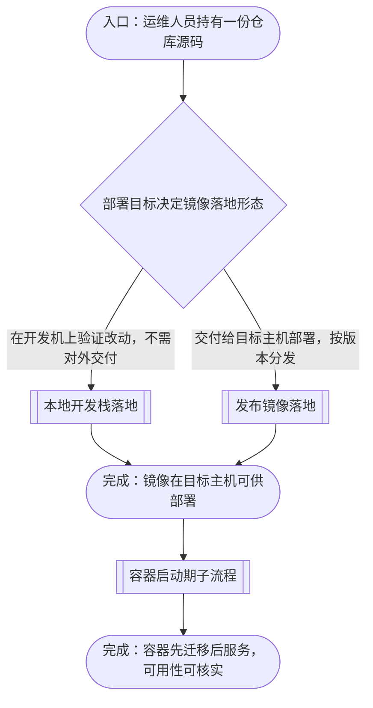
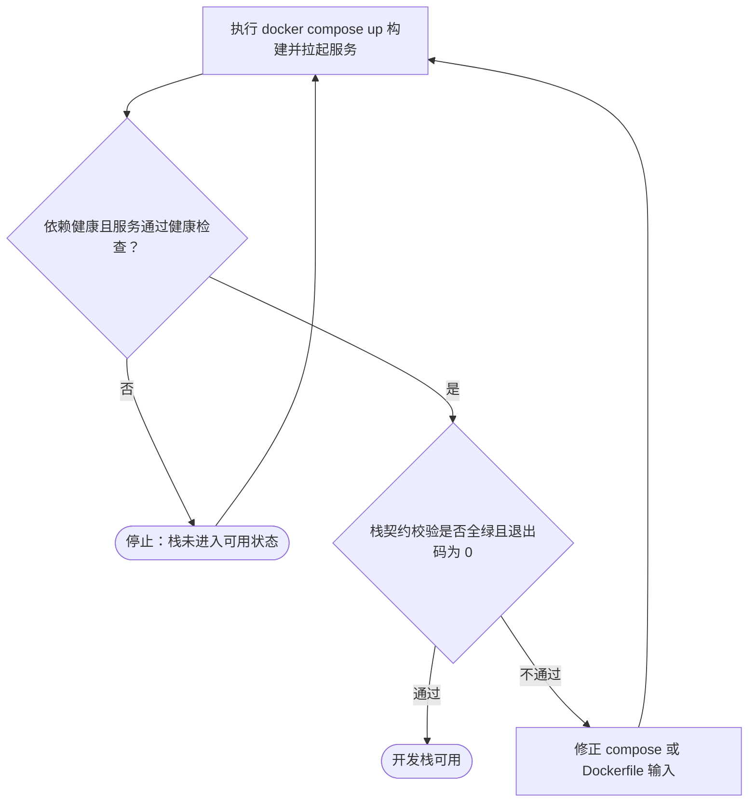
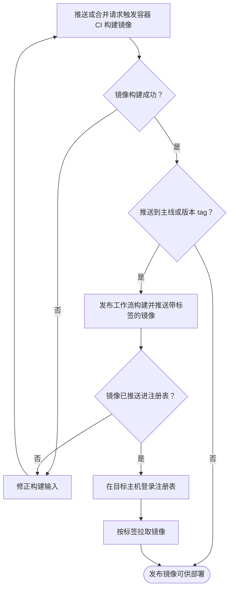
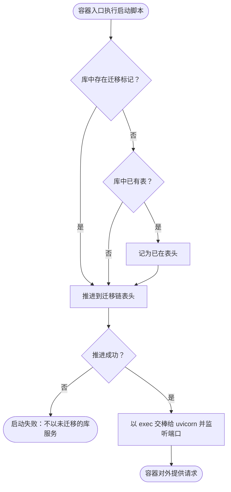

# 源码落地为容器镜像的流程

本文档说明 home-media-pilot 的仓库源码如何落地为可部署的容器镜像：从运维人员持有一份源码开始，经镜像构建输入的就位与落地形态判定，分别走本地开发栈与发布镜像两条路径，到该镜像在目标主机上可供部署为止。各路径的操作命令、校验判据、生效时机与失败模式在逐节点章节中展开；容器内进程如何启动与迁移由启动期子流程单独承载。

## 主流程图



## START_WITH_SOURCE

本节点是流程入口，确认落地所需的输入与工具链已就位。本节点不出分支，唯一出边通向 `CHOOSE_FORM`。

工程根为仓库克隆根目录，其内部布局由该项目决定，**编译与打包一律以镜像内的解释器与镜像内的进程为准，不以工程根为准**。

镜像构建输入由 `docker/api.Dockerfile` 声明，它同时是本地开发栈、CI 与发布工作流三者构建的那一份——判据是 `tests/config/docker/test_image_contracts.py` 的 `test_every_image_build_path_builds_the_published_dockerfile`。构建上下文是工程根，`.dockerignore` 决定哪些路径不进上下文（含 `.git`、`.venv`、`node_modules`、`.env` 及其变体，例外放行 `.env.example`）。

**输入**

- `SOURCE_CHECKOUT`：路径；来源为运维人员的仓库克隆。

**输出**

- `SOURCE_READY`：就位状态；去向为 `CHOOSE_FORM`。

**失败模式**

`Dockerfile` 里的 `COPY` 源必须在声明的构建上下文内可解析，否则构建在解析该指令时即失败。`COPY --from=<stage>` 的源属构建阶段，不在此列。回归判据是 `tests/config/docker/test_image_contracts.py` 的 `test_every_copy_source_resolves_inside_the_build_context`，它不需要 Docker 守护进程即可抓出这类缺陷。

## CHOOSE_FORM

本节点是主图唯一的分叉点：按部署目标判定镜像落地形态。出边条件——要在开发机上验证改动、不需对外交付，走 `RUN_DEV_STACK`；要交付给目标主机部署、按版本分发，走 `PUBLISH_IMAGE`。

| 形态 | 用途 | 由谁触发 | 镜像来源 |
| --- | --- | --- | --- |
| **本地开发栈** | 开发机上拉起完整进程集验证改动 | 开发者在工程根执行 `docker compose up` | 构建上下文就地构建 |
| **发布镜像** | 目标主机按标签拉取部署 | 推送到主线或打版本 tag | 注册表里的已发布标签 |

两条路径都**不需要**调用方预先产出前端 bundle——镜像自带 node 构建阶段产出它；也不需要目标主机具备源码。

**输入**

- `SOURCE_READY`：就位状态；来源为 `START_WITH_SOURCE`。

**输出**

- `TARGET_FORM`：枚举 `dev-stack` 或 `published-image`；去向为 `RUN_DEV_STACK` 或 `PUBLISH_IMAGE`。

## RUN_DEV_STACK

本节点承载本地开发栈的落地子流程：就地构建镜像，拉起带健康检查的进程集，并核对栈的运行契约。本节点不出分支，唯一出边通向 `IMAGE_READY`。



**输入**

- `TARGET_FORM`：枚举值 `dev-stack`；来源为 `CHOOSE_FORM`。

**输出**

- `STACK_READY`：栈可用状态；去向为 `IMAGE_READY`。

### DEV_BUILD

本节点执行：

```bash
cd <工程根>
docker compose up -d --build
```

把 `docker-compose.yml` 声明的服务按各自的构建定义就地构建并拉起。本节点不出分支，唯一出边通向 `DEV_HEALTH`。

**输入**

- `SOURCE_CHECKOUT`：路径；来源为工程部署位置，或在重试时来自 `DEV_FIX`。

**输出**

- `STACK_SERVICES`：已拉起服务集合；去向为 `DEV_HEALTH`。

### DEV_HEALTH

本节点判定服务是否进入可用状态：`db` 由 `pg_isready` 门控，应用服务由进程内探针轮询 `/health`，且**凡接到数据库的服务都必须等数据库健康**。成立时出边通向 `DEV_CONTRACT`；不成立时出边通向 `DEV_FAIL`。

**输入**

- `STACK_SERVICES`：已拉起服务集合；来源为 `DEV_BUILD`。

**输出**

- `STACK_HEALTHY`：布尔；去向为 `DEV_CONTRACT` 或 `DEV_FAIL`。

### DEV_CONTRACT

本节点是子流程的判定点之一，执行：

```bash
cd <工程根>
uv run pytest -q
```

判据是**全绿且退出码为 0**，不是与某个写死的用例条数相等。容器相关的节点集中在 `tests/config/compose/`、`tests/config/docker/` 与 `tests/config/ci/`，校验的是构建与运行所依赖的契约而非构建结果本身。判据成立时出边通向 `DEV_LIVE`；不成立时出边通向 `DEV_FIX`。

**输入**

- `STACK_HEALTHY`：布尔；来源为 `DEV_HEALTH`。

**输出**

- `CONTRACT_RESULT`：布尔；去向为 `DEV_LIVE` 或 `DEV_FIX`。

### DEV_FIX

本节点在校验不通过时进入：定位缺陷所在的构建输入（`docker-compose.yml`、`docker/api.Dockerfile` 或 `docker/api-entrypoint.sh`），修正后回到 `DEV_BUILD` 重新构建。本节点不出分支，唯一出边回到 `DEV_BUILD`。

**输入**

- `CONTRACT_RESULT`：布尔；来源为 `DEV_CONTRACT`。

**输出**

- `SOURCE_CHECKOUT`：修正后的工程根状态；去向为 `DEV_BUILD`。

**失败模式**

开发栈只承载**与环境无关**的配置：仓库里只有一套绑定 localhost 与一次性密码的本地栈，不含真实主机路径、内网地址或对外端点。真实环境的部署配置不随仓库分发，因此套件也不断言它——把它写进 `docker-compose.yml` 会被契约用例判失败。

### DEV_FAIL

本节点在服务未进入可用状态时进入：终止本次落地并停止容器，不以未就绪的栈对外提供请求。

本节点无出边。子流程的可达性由本节点与 `DEV_LIVE` 两个结束型节点承担；`DEV_BUILD → DEV_HEALTH → DEV_FAIL` 与 `DEV_FAIL → DEV_BUILD` 构成的重试环始终带一个通向 `DEV_LIVE` 的出口，退出该环的唯一途径是修正输入。

**输入**

- `STACK_HEALTHY`：布尔；来源为 `DEV_HEALTH`。

**输出**

- 无。

### DEV_LIVE

本节点是本地开发栈子流程的结束节点，表示栈已可用。本节点无出边。

**输入**

- `CONTRACT_RESULT`：布尔；来源为 `DEV_CONTRACT`。

**输出**

- 无。

## PUBLISH_IMAGE

本节点承载发布镜像的落地子流程：容器 CI 先验证镜像可构建，再由发布工作流构建并推送到注册表，最后由目标主机按标签拉取落地。子流程含回退边——CI 或构建失败时修正构建输入重来。本节点不出分支，唯一出边通向 `IMAGE_READY`。



**输入**

- `TARGET_FORM`：枚举值 `published-image`；来源为 `CHOOSE_FORM`。

**输出**

- `IMAGE_DEPLOYABLE`：镜像可部署状态；去向为 `IMAGE_READY`。

### CI_BUILD

本节点由推送到主线或提出合并请求触发，执行 `.github/workflows/ci.yml` 的 `docker` 作业，用 `docker/build-push-action` 构建 `docker/api.Dockerfile` 且**不推送**。本节点不出分支，唯一出边通向 `CI_OK`。

**输入**

- `SOURCE_CHECKOUT`：路径；来源为工程部署位置，或在重试时来自 `CI_FIX`。

**输出**

- `CI_BUILD_RESULT`：构建成败；去向为 `CI_OK`。

**失败模式**

该作业**不得**预先构建前端：镜像在自带的 node 阶段构建它，`npm run build` 的产物在上下文中没有任何 `COPY` 读取，属死工作。前端 bundle 自身的验证由同一流水线的 `frontend` 作业承担——把它从 docker 作业挪走不等于取消覆盖。

### CI_OK

本节点判定 CI 构建结果。成功时出边通向 `PUBLISH_GATE`；失败时出边通向 `CI_FIX`。

**输入**

- `CI_BUILD_RESULT`：构建成败；来源为 `CI_BUILD`。

**输出**

- `CI_PASSED`：布尔；去向为 `PUBLISH_GATE` 或 `CI_FIX`。

### CI_FIX

本节点在构建或推送失败时进入：定位缺陷所在的构建输入（`docker/api.Dockerfile`、`docker-compose.yml`、工作流或前端包配置），修正后回到 `CI_BUILD` 重新验证。本节点不出分支，唯一出边回到 `CI_BUILD`。

**输入**

- `CI_PASSED`：布尔；来源为 `CI_OK`。
- `PUSHED`：布尔；来源为 `PUSH_OK`。

**输出**

- `SOURCE_CHECKOUT`：修正后的工程根状态；去向为 `CI_BUILD`。

### PUBLISH_GATE

本节点判定本次触发是否构成发布：推送到主线或匹配 `v*.*.*` 的版本 tag 时出边通向 `PUBLISH_PUSH`；其余触发（例如仅合并请求）在 `IMAGE_LIVE` 结束，本次不产出可部署镜像。

**输入**

- `CI_PASSED`：布尔；来源为 `CI_OK`。

**输出**

- `PUBLISH_REQUIRED`：布尔；去向为 `PUBLISH_PUSH` 或 `IMAGE_LIVE`。

### PUBLISH_PUSH

本节点执行 `.github/workflows/publish-container.yml` 的 `publish` 作业：**先登录注册表再推送**，标签由单一 `metadata-action` 步骤产出，镜像地址的仓库属主在运行时从仓库解析而非硬编码。本节点不出分支，唯一出边通向 `PUSH_OK`。

**输入**

- `PUBLISH_REQUIRED`：布尔；来源为 `PUBLISH_GATE`。

**输出**

- `PUSH_RESULT`：推送成败；去向为 `PUSH_OK`。

**失败模式**

同存 `build` 与 `image` 不是本流程的问题——发布工作流只推送，不就地构建给主机用。真正会静默失效的是**登录与推送的先后顺序**：登录若排在推送之后，推送会以未认证身份被拒绝。该顺序由契约用例断言。

### PUSH_OK

本节点判定推送结果。成功时出边通向 `PULL_LOGIN`；失败时出边通向 `CI_FIX`。

**输入**

- `PUSH_RESULT`：推送成败；来源为 `PUBLISH_PUSH`。

**输出**

- `PUSHED`：布尔；去向为 `PULL_LOGIN` 或 `CI_FIX`。

### PULL_LOGIN

本节点在目标主机上登录注册表。注册表凭据是**硬约束**：GitHub Packages 只接受 personal access token (classic)，fine-grained token 不被支持；拉取所需的 scope 是 `read:packages`。凭据由部署方注入，不随仓库分发。本节点不出分支，唯一出边通向 `PULL_IMAGE`。

**输入**

- `PUSHED`：布尔；来源为 `PUSH_OK`。

**输出**

- `REGISTRY_SESSION`：已认证的注册表会话；去向为 `PULL_IMAGE`。

**失败模式**

用发布工作流里的 `GITHUB_TOKEN` 在主机侧登录会失败：它短时效且仅限 Actions 内部执行期。匿名拉取同样被拒绝——私有包换取拉取令牌即返回 `401 UNAUTHORIZED`。

### PULL_IMAGE

本节点在目标主机上按标签拉取镜像并落地为可运行容器。标签集合由 `metadata-action` 的单一步骤定义：主线分支对应的移动标签、版本 tag 与短 sha 标签。拉取到位的判据是镜像可被本机运行时列出，**不是**容器已启动——进程如何启动与迁移由[启动期](#IMAGE_READY)之后的目标主机运行承担。本节点不出分支，唯一出边通向 `IMAGE_LIVE`。

**输入**

- `REGISTRY_SESSION`：已认证的注册表会话；来源为 `PULL_LOGIN`。

**输出**

- `IMAGE_LOCAL`：本机镜像引用；去向为 `IMAGE_LIVE`。

### IMAGE_LIVE

本节点是发布镜像子流程的结束节点。镜像已推入注册表并被目标主机拉取到位，满足部署所需的全部前提。本节点无出边。

**输入**

- `IMAGE_LOCAL`：本机镜像引用；来源为 `PULL_IMAGE`。
- `PUBLISH_REQUIRED`：布尔；来源为 `PUBLISH_GATE`（未构成发布时在此结束）。

**输出**

- `IMAGE_DEPLOYABLE`：镜像可部署状态；去向为 `IMAGE_READY`。

## IMAGE_READY

本节点是两条落地路径的汇合点：镜像在目标主机可供部署。本节点不出分支，唯一出边通向 `BOOTSTRAP`。

**输入**

- `STACK_READY`：栈可用状态；来源为 `RUN_DEV_STACK`。
- `IMAGE_DEPLOYABLE`：镜像可部署状态；来源为 `PUBLISH_IMAGE`。

**输出**

- `CONTAINER_START`：容器启动信号；去向为 `BOOTSTRAP`。

## BOOTSTRAP

本节点承载容器内进程的启动子流程。它承接 `IMAGE_READY` 给出的启动信号，决定容器能否对外服务。

进程由 `docker/api-entrypoint.sh` 编排：先把数据库模式推进到迁移链的表头，再以 exec 交棒给 uvicorn。启动命令引用的是 `uv sync` 在镜像内产出的解释器——命令指向别的 venv 路径会在容器启动时失败，而单看 Dockerfile 的静态检查抓不到这一点。

镜像必须自带它所服务的 WebUI：静态路由仅在 `FRONTEND_DIST` 下存在 `assets` 目录时才挂载，而根路径无条件返回该目录下的 `index.html`。缺了前端产物，根路径会以 500 应答，且所有静态路由静默缺席——这不是"少一个页面"，是一次看起来服务已起来、实际不可用的启动。

本节点不出分支，唯一出边通向 `DEPLOY_READY`。



**输入**

- `CONTAINER_START`：容器启动信号；来源为 `IMAGE_READY`。

**输出**

- `SERVICE_LIVE`：服务可用状态；去向为 `DEPLOY_READY`。

#### START_BOOT

容器入口触发，先于 HTTP 服务。输入是运行环境注入的数据库连接。

**输入**

- `DATABASE_URL`：连接串；来源为运行环境，缺省时取工程内的默认库路径

**输出**

- `schema_target`：迁移链表头；去向为 `BOOT_HAS_MARKER`

#### BOOT_HAS_MARKER

以库中是否存在迁移标记判断迁移链是否已接管该库。

**输入**

- `schema_target`：迁移链表头；来源为 `START_BOOT`

**输出**

- `needs_stamp`：布尔；去向为 `BOOT_HAS_TABLES`
- `recorded_at`：迁移链表头；去向为 `BOOT_UPGRADE`，库中已有标记时直接推进

#### BOOT_HAS_TABLES

区分空库与"有表但无标记"的库。后者意味着更早的容器以模型建出了表。

**输入**

- `needs_stamp`：布尔；来源为 `BOOT_HAS_MARKER`

**输出**

- `stamp_required`：布尔；去向为 `BOOT_STAMP`

#### BOOT_STAMP

把无标记但已有表的库记为已在迁移链表头，使后续推进不重放既有迁移而与之冲突。

**输入**

- `stamp_required`：布尔；来源为 `BOOT_HAS_TABLES`

**输出**

- `recorded_at`：迁移链表头；去向为 `BOOT_UPGRADE`

#### BOOT_UPGRADE

把库推进到迁移链表头。这是模式唯一的作者：API 路由逐请求调用模型建表，若不在启动时先迁移，建表就会由模型完成，schema 与迁移链的分歧随之被掩盖。

**输入**

- `recorded_at`：迁移链表头；来源为 `BOOT_STAMP`，或直接来自 `BOOT_HAS_MARKER` 的已接管分支

**输出**

- `upgrade_result`：成败；去向为 `BOOT_MIGRATE_OK`

**失败模式**

库不可达时推进走正常升级路径并自行报出连接问题，而不是被前置探测掩盖——前置的"是否需要 stamp"探测在库不可达时返回否，把错误留给升级步骤显式抛出。

#### BOOT_MIGRATE_OK

判定推进结果。失败即终止启动，不以未迁移的库对外服务。

**输入**

- `upgrade_result`：成败；来源为 `BOOT_UPGRADE`

**输出**

- `boot_verdict`：枚举；去向为 `BOOT_SERVE` 或 `BOOT_ERROR`

#### BOOT_SERVE

迁移完成后以 exec 交棒给 uvicorn，监听容器端口并开始接受请求。用 exec 而非派生子进程，使信号直达服务进程。

**输入**

- `boot_verdict`：枚举；来源为 `BOOT_MIGRATE_OK`

**输出**

- `serve_state`：服务进程状态；去向为 `BOOT_DONE`

#### BOOT_ERROR

启动子流程的失败出口。进程不以未迁移的库对外服务。

**输入**

- `boot_verdict`：枚举；来源为 `BOOT_MIGRATE_OK`

**输出**

- 无。

#### BOOT_DONE

启动子流程的完成出口，容器对外提供请求并经 `/health` 应答。

**输入**

- `serve_state`：服务进程状态；来源为 `BOOT_SERVE`

**输出**

- `SERVICE_LIVE`：服务可用状态；去向为 `DEPLOY_READY`
## DEPLOY_READY

本节点是启动期子流程之后的落地终点：镜像在目标主机上可被部署，容器启动后先迁移后服务，服务可用性可经 `/health` 核实。本节点无出边。

**输入**

- `SERVICE_LIVE`：服务可用状态；来源为 `BOOTSTRAP`。

**输出**

- 无。
