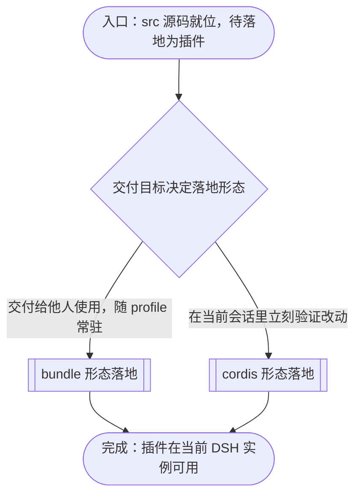
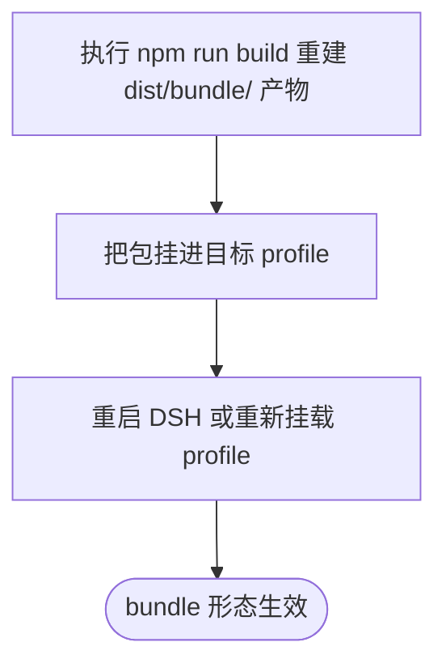
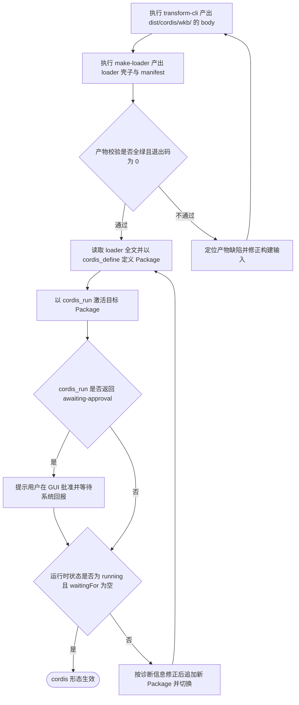

# 源码落地为插件的流程

本文档说明 dsh-workbench 的 `src/` 源码如何落地为 DSH 里可用的插件：从源码与构建输入在工程根就位开始，经落地形态判定，分别走 bundle 与 cordis 落地路径，到插件在当前 DSH 实例里可用为止。各路径的操作命令、校验判据、生效时机与失败模式在逐节点章节中展开；根 AGENTS.md 的「安装部署」节以本文件为准。

## 主流程图



## START_WITH_SOURCE

本节点是流程入口，确认落地所需的输入与工具链已在工程根就位。本节点不出分支，唯一出边通向 `CHOOSE_FORM`。

工程根为 `/home/odie/workbench`，下文命令均以它为 cwd。

`plugin-loader` 是工程根的同级兄弟目录 `/home/odie/plugin-loader`，**不经 `node_modules` 使用**。它是构建期 CLI（`transform-cli.js`/`make-loader.js`/`verify-loader.js`），build script 直接按路径调用 `node ../plugin-loader/...`。由此导出三条契约：它**不是**本工程的依赖项，`package.json` 里没有它，`node_modules/` 下也没有它的副本；改工具链**立即生效**，无需任何同步，单一事实源就是这个目录；它是构建期工具，**不随包分发**（`files` 字段不含它），只有开发/构建时需要在同级就位。

`node_modules/` 已就位（含 esbuild、playwright）；**除非依赖变更，不要重跑安装**。若确实要重装，用 `npm ci`——本工程以 `package-lock.json` 为唯一权威；**不要用 pnpm**，仓库不保留 `pnpm-lock.yaml`。

**输入**

- `WORKBENCH_ROOT`：路径；来源为工程部署位置。

**输出**

- `SOURCE_READY`：就位状态；去向为 `CHOOSE_FORM`。

**失败模式**

`plugin-loader` 若被以 `file:../plugin-loader` 声明为依赖，npm 会装成**拷贝**——改了工具链源文件却不生效，且无任何报错。

## CHOOSE_FORM

本节点是主图唯一的分叉点：按交付目标判定落地形态。出边条件——要交付给别人用、需要随 profile 常驻，走 `DELIVER_BUNDLE`；要在当前会话里立刻验证改动、不想重启 DSH，走 `DEBUG_CORDIS`。

| 形态 | 用途 | 生效方式 | 改代码后 |
| --- | --- | --- | --- |
| **bundle** | 主分发形态，随 profile 常驻 | `dsh plugin add` 挂进 profile | 重建产物 + 重启/重挂载 |
| **cordis** | 动态安装调试，无需重启 DSH | `cordis_define` + `cordis_run` | 重建产物 + 重新激活 |

**输入**

- `SOURCE_READY`：就位状态；来源为 `START_WITH_SOURCE`。

**输出**

- `TARGET_FORM`：枚举 `bundle` 或 `cordis`；去向为 `DELIVER_BUNDLE` 或 `DEBUG_CORDIS`。

## DELIVER_BUNDLE

本节点承载 bundle 形态的落地子流程：同一份源码经 `npm run build` 重新产出 `dist/bundle/` 下的 host 与 client 产物，再经官方通道把包挂进目标 profile，最后让 profile 读到新产物。本节点不出分支，唯一出边通向 `PLUGIN_LIVE`。

**输入**

- `TARGET_FORM`：枚举值 `bundle`；来源为 `CHOOSE_FORM`。

**输出**

- `PLUGIN_ACTIVE`：运行状态；去向为 `PLUGIN_LIVE`。



### BUNDLE_BUILD

本节点执行 `npm run build`（等价于 `npm run build:bundle`），把 `src/` 打包成 `dist/bundle/index.mjs`（host 半）与 `dist/bundle/client.js`（client 半）。构建是幂等的：同源必得同产物。本节点不出分支，唯一出边通向 `BUNDLE_MOUNT`。

**输入**

- `WORKBENCH_ROOT`：路径；来源为工程部署位置。

**输出**

- `BUNDLE_DIST`：产物目录路径；去向为 `BUNDLE_MOUNT`。

### BUNDLE_MOUNT

本节点把产物挂进目标 profile。挂载方式由 `package.json` 与 `bundle.patch.yml` 共同定义。

`package.json`：`main`/`exports` 指向 `dist/bundle/*`；`dsh.bundle.patch` 指向 `bundle.patch.yml`；`dsh.client.inject` 声明 client 半依赖的宿主模块（以该字段的实际列表为准）。

`bundle.patch.yml`：把插件行 `insert` 进 profile 组合树。其中的 `!!js` 条件是**双挂载守卫**——若已有别的 entry 挂了 `dsh-workbench`（如某个聚合 bundle），本行自动让位，避免两条挂载重复注册 `/dsh-workbench/*` 路由。守卫只能看见排在它之前的行，故聚合 bundle 必须排在本行之前（`dsh plugin add` 追加到末尾，恰为默认顺序）；反序是已知限制。

用户侧挂载即官方通道：

```bash
dsh plugin --profile <name> add file:/home/odie/workbench
```

[orchestrator.cjs](../../../../tests/e2e-mount/orchestrator.cjs) 就是这么做的，可作参照。

`npm pack --dry-run` 的输出即分发面的事实源：`bundle.patch.yml`、`package.json`，以及 `files` 字段里的每个 dist 产物。

本节点不出分支，唯一出边通向 `BUNDLE_RELOAD`。

**输入**

- `BUNDLE_DIST`：产物目录路径；来源为 `BUNDLE_BUILD`。

**输出**

- `PROFILE_ENTRY`：profile 组合树里的挂载项；去向为 `BUNDLE_RELOAD`。

### BUNDLE_RELOAD

本节点让运行中的 DSH 读到新产物。profile 常驻形态不重读磁盘，故产物更换后须重启 DSH 或重新挂载 profile 才生效。本节点不出分支，唯一出边通向 `BUNDLE_LIVE`。

**输入**

- `PROFILE_ENTRY`：挂载项；来源为 `BUNDLE_MOUNT`。

**输出**

- `PLUGIN_ACTIVE`：运行状态；去向为 `BUNDLE_LIVE` 与 `PLUGIN_LIVE`。

### BUNDLE_LIVE

本节点是 bundle 子流程的结束节点，表示 bundle 形态已生效。本节点无出边。

**输入**

- `PLUGIN_ACTIVE`：运行状态；来源为 `BUNDLE_RELOAD`。

**输出**

- 无。

## DEBUG_CORDIS

本节点承载 cordis 形态的落地子流程：由构建期工具产出 body 与 loader 壳子，校验产物，再经模型侧工具定义并激活 Package，最后核对运行时状态。子流程含回退边——产物校验不通过时修正构建输入重来，运行时状态不符时追加新 Package 切换。本节点不出分支，唯一出边通向 `PLUGIN_LIVE`。

**输入**

- `TARGET_FORM`：枚举值 `cordis`；来源为 `CHOOSE_FORM`。

**输出**

- `PLUGIN_ACTIVE`：运行状态；去向为 `PLUGIN_LIVE`。



### CORDIS_BUILD_BODY

本节点执行：

```bash
cd /home/odie/workbench
node /home/odie/plugin-loader/transform-cli.js -c loader-configs/build.json -m cordis
```

把 `src/` 按 loader 配置打包成 `dist/cordis/wkb/` 下的 `host-body.js` 与 `client-body.js`。本节点不出分支，唯一出边通向 `CORDIS_MAKE_LOADER`。

**输入**

- `WORKBENCH_ROOT`：路径；来源为工程部署位置或 `CORDIS_FIX_PRODUCT`。

**输出**

- `BODY_DIR`：body 目录路径；去向为 `CORDIS_MAKE_LOADER` 与 `CORDIS_VERIFY_PRODUCT`。

**失败模式**

`bodyDir` 与其他 plugin-loader 工程不同，本工程用 `dist/cordis/wkb`。宿主引导器在运行时定位 body 目录，候选顺序是「构建期绝对路径 `bodyAbsDir` → 客户端上报的 root → workspaceRegistry 全部路径」，且**仅当候选的 `manifest.json` 声明了本插件 name 时才算命中**（未声明 name 的产物按存在即可放行，向后兼容）。该链按三层纵深防御设计，三层各自承担一条不可省的职责：

- **绝对路径优先**：若两个工程都用通用的 `dist/cordis`，绝对路径是唯一能区分它们的信息。缺了它，注册序在前的工程（如 `prompt_enhancer`）的 body 会被本插件的引导器当成自己的，host 半跑成别的插件，而症状只在 client 侧的长度校验上显形（`client body too short`），离病根很远。
- **归属校验兜底**：绝对路径会因工程被移动或换机器而失效，此时若候选只靠"文件存在"判定，仍会误采他工程。有了 name 校验，最坏情况是**响亮报错**而非静默跑错插件。
- **唯一子目录**：子目录名本身无意义（不必须叫 `wkb`），关键是在所有 workspace 里唯一。

回归判据：[cordis-body-dir.test.js](../../../../tests/global/cordis-body-dir.test.js)（本工程）+ [loader-runtime.test.js](../../../../../plugin-loader/test/loader-runtime.test.js) 的归属用例。

### CORDIS_MAKE_LOADER

本节点执行：

```bash
node /home/odie/plugin-loader/make-loader.js loader-configs/loader.json
```

为已有 body 追加产出 `host-loader.js`（传给 `cordis_define` 的 `code.host`）、`client-loader.js`（`code.client`）、`manifest.json`（长度与 sha-256 清单）。本节点不出分支，唯一出边通向 `CORDIS_VERIFY_PRODUCT`。

**输入**

- `BODY_DIR`：body 目录路径；来源为 `CORDIS_BUILD_BODY`。

**输出**

- `LOADER_SOURCE`：host 与 client 的 loader 全文；去向为 `CORDIS_DEFINE_PACKAGE`。
- `MANIFEST`：产物长度与哈希清单；去向为 `CORDIS_DEFINE_PACKAGE`。

**失败模式**

报 `host body length mismatch ... run make-loader to rebuild` 说明 body 与 manifest 不同步——重跑 `CORDIS_BUILD_BODY` 与 `CORDIS_MAKE_LOADER`，不要只手改 body。

### CORDIS_VERIFY_PRODUCT

本节点是子流程的判定点之一，执行：

```bash
node /home/odie/plugin-loader/verify-loader.js dist/cordis/wkb
```

判据是末尾出现 `ALL CHECKS PASSED` 且进程退出码为 0，**不是**与某个写死的检查条数相等。不通过就停下定位，不要继续安装。判据成立时出边通向 `CORDIS_DEFINE_PACKAGE`；不成立时出边通向 `CORDIS_FIX_PRODUCT`。

**输入**

- `BODY_DIR`：body 目录路径；来源为 `CORDIS_BUILD_BODY`。
- `LOADER_SOURCE`：待校验的 host 与 client 的 loader 全文；来源为 `CORDIS_MAKE_LOADER`。
- `MANIFEST`：待校验的产物长度与哈希清单；来源为 `CORDIS_MAKE_LOADER`。

**输出**

- `VERIFY_RESULT`：布尔；去向为 `CORDIS_DEFINE_PACKAGE` 或 `CORDIS_FIX_PRODUCT`。

### CORDIS_FIX_PRODUCT

本节点在产物校验不通过时进入：定位缺陷所在的构建输入（`loader-configs/` 下的配置或 `src/`），修正后回到 `CORDIS_BUILD_BODY` 重新产出。本节点不出分支，唯一出边回到 `CORDIS_BUILD_BODY`。

**输入**

- `VERIFY_RESULT`：布尔；来源为 `CORDIS_VERIFY_PRODUCT`。

**输出**

- `WORKBENCH_ROOT`：修正后的工程根状态；去向为 `CORDIS_BUILD_BODY`。

### CORDIS_DEFINE_PACKAGE

本节点用 read 工具读取 `dist/cordis/wkb/host-loader.js` 与 `client-loader.js` 全文（不要用 `cat`），再以 `cordis_define` 定义 Package：首装用 `plugin` 为 `{ kind: 'new', idPrefix: 'wkb' }`（`name`/`purpose` 自拟），重试或切换用 `{ kind: 'existing', pluginId: <原 pluginId> }`，`code.host`/`code.client` 填读到的全文。记下返回的 `pluginId` 与 `packageId`。本节点不出分支，唯一出边通向 `CORDIS_RUN`。

`cordis_define`、`cordis_run`、`cordis_inspect_self` 是**模型侧工具，不在 bash 工具集里**。若当前会话的工具清单中没有它们，则本子流程无法执行——此时应停下并说明，改用"已有卡片重载"路径（重新激活既有卡片），不要假装安装成功。

**输入**

- `LOADER_SOURCE`：host 与 client 的 loader 全文；来源为 `CORDIS_MAKE_LOADER`。
- `MANIFEST`：产物长度与哈希清单；来源为 `CORDIS_MAKE_LOADER`。
- `VERIFY_RESULT`：产物校验判定；来源为 `CORDIS_VERIFY_PRODUCT`。
- `PLUGIN_REF`：待追加 Package 的插件引用；来源为 `CORDIS_REPAIR`（首装时无此项）。

**输出**

- `PLUGIN_REF`：插件与 Package 引用；去向为 `CORDIS_RUN`、`CORDIS_GRANT`、`CORDIS_INSPECT`。

**失败模式**

同一进程里可能并存多个 wkb 实例卡片（每次 `cordis_define` 分配新 id）。重复挂载同一 id 会在 loader 处响亮失败；面板操作请按 [cordis-panel.cjs](../../../../tests/e2e/cordis-panel.cjs) 的策略选卡片（优先 running，否则取序号最大者）。

### CORDIS_RUN

本节点以 `cordis_run` 激活目标 Package（首装 `mode: 'run'`，切换 `mode: 'update'`）。本节点不出分支，唯一出边通向 `CORDIS_APPROVAL`。

**输入**

- `PLUGIN_REF`：插件与 Package 引用；来源为 `CORDIS_DEFINE_PACKAGE`。

**输出**

- `RUN_STATE`：`awaiting-approval` 或 `starting`；去向为 `CORDIS_APPROVAL`。

### CORDIS_APPROVAL

本节点判定 `cordis_run` 的返回：返回 `awaiting-approval` 时出边通向 `CORDIS_GRANT`；返回 `starting`（已授权）时出边直接通向 `CORDIS_INSPECT`。

**输入**

- `RUN_STATE`：`awaiting-approval` 或 `starting`；来源为 `CORDIS_RUN`。

**输出**

- `APPROVAL_REQUIRED`：布尔；去向为 `CORDIS_GRANT` 或 `CORDIS_INSPECT`。

### CORDIS_GRANT

本节点提示用户在 GUI 批准或拒绝该 Package，然后结束当前轮、等待系统回报运行时结果；不轮询等待，亦不重复请求授权。本节点不出分支，唯一出边通向 `CORDIS_INSPECT`。

**输入**

- `PLUGIN_REF`：插件与 Package 引用；来源为 `CORDIS_DEFINE_PACKAGE`。
- `APPROVAL_REQUIRED`：布尔；来源为 `CORDIS_APPROVAL`。

**输出**

- `GRANT_RESULT`：授权结果；去向为 `CORDIS_INSPECT`。

### CORDIS_INSPECT

本节点是子流程的另一判定点：以 `cordis_inspect_self(pluginId, packageId)` 核对运行时状态——`runtime.state` 为 `running`；`runtime.host.handlers` 含 `loader-wkb-get-bodies` 与全部业务方法（`listDir`/`resolveRoot`/`readFile`/`gitStatus`/`gitDiffFile`/`checkChanges`/`watchChanges`）；`runtime.client.status` 为 `running` 且 `waitingFor` 为空。成立时出边通向 `CORDIS_LIVE`；不成立时出边通向 `CORDIS_REPAIR`。

**输入**

- `PLUGIN_REF`：插件与 Package 引用；来源为 `CORDIS_DEFINE_PACKAGE`。
- `GRANT_RESULT`：授权结果；来源为 `CORDIS_GRANT`。
- `APPROVAL_REQUIRED`：布尔；来源为 `CORDIS_APPROVAL`。

**输出**

- `PLUGIN_ACTIVE`：布尔；去向为 `CORDIS_LIVE` 或 `CORDIS_REPAIR`。

### CORDIS_REPAIR

本节点在运行时状态不符时进入：读 `cordis_inspect_self` 给出的消息与堆栈，修正同一插件的源码或产物，追加新 Package 后回到 `CORDIS_DEFINE_PACKAGE` 切换。本节点不出分支，唯一出边回到 `CORDIS_DEFINE_PACKAGE`。

**输入**

- `PLUGIN_ACTIVE`：布尔；来源为 `CORDIS_INSPECT`。

**输出**

- `PLUGIN_REF`：待追加 Package 的插件引用；去向为 `CORDIS_DEFINE_PACKAGE`。

### CORDIS_LIVE

本节点是 cordis 子流程的结束节点。cordis 形态的生效时机由 loader 的磁盘惰性模式决定：`host-loader.js`（`manifest.hostMode = "disk"`）不内嵌 body，而是在每次激活时从 `dist/cordis/wkb/` 读盘，并按 manifest 记录的长度做守卫。因此**已存在的卡片只要重新激活（GUI 面板 Stop → Run）就会载入新构建**，无需再 `cordis_define` 一个新 package；日志中可见 `wkb-loader: host body loaded (<新长度> bytes)`。若走工具路径，则 `cordis_define`（`plugin.kind: 'existing'` + 原 pluginId）追加新 package，再 `cordis_run`（`mode: 'update'` + 新 packageId）切换。本节点无出边。

**输入**

- `PLUGIN_ACTIVE`：布尔；来源为 `CORDIS_INSPECT`。

**输出**

- 无。

## PLUGIN_LIVE

本节点是主流程的结束节点：各落地路径在此汇合，插件在当前 DSH 实例可用。本节点无出边。

**输入**

- `PLUGIN_ACTIVE`：运行状态；来源为 `DELIVER_BUNDLE` 或 `DEBUG_CORDIS`。

**输出**

- 无。
