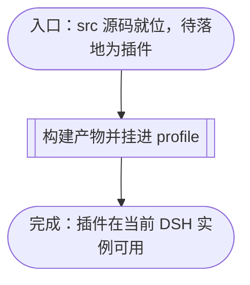
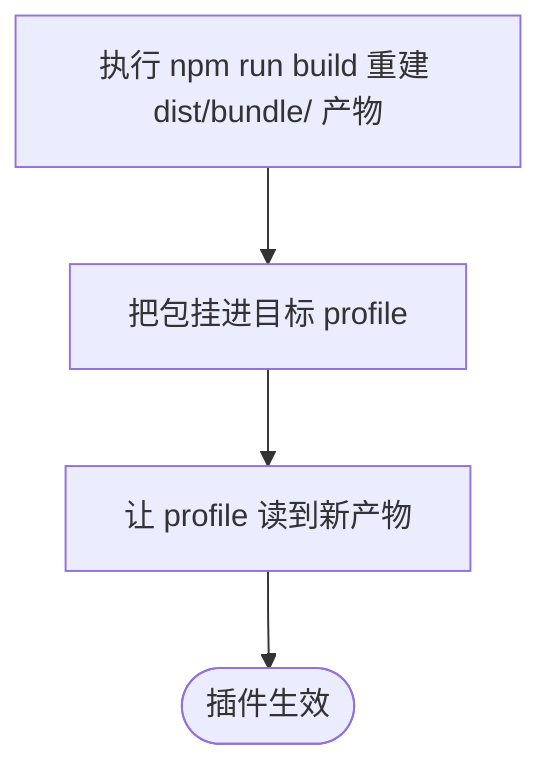

# 源码落地为插件的流程

本文档是 dsh-workbench 的单项目插件落地流程样本：从源码与构建输入在工程根就位开始，经构建产出 bundle 产物、把包挂进目标 profile，到插件在当前 DSH 实例里可用为止。各步骤的操作命令、校验判据、生效时机与失败模式在逐节点章节中展开；它不作为 knowledge-base 或其它项目的部署入口，knowledge-base 自身环境部署见 [KB 部署指南](../../../deploy.md)。

## 主流程图


```mermaid
flowchart TB
  START_WITH_SOURCE(["入口：src 源码就位，待落地为插件"])
  DELIVER_BUNDLE[["构建产物并挂进 profile"]]
  PLUGIN_LIVE(["完成：插件在当前 DSH 实例可用"])
  START_WITH_SOURCE --> DELIVER_BUNDLE
  DELIVER_BUNDLE --> PLUGIN_LIVE
```

## START_WITH_SOURCE

本节点是流程入口，确认落地所需的输入与工具链已在工程根就位。本节点不出分支，唯一出边通向 `DELIVER_BUNDLE`。

工程根为 `/mnt/deepseek-harness/workbench`，下文命令均以它为 cwd。

`plugin-loader` 是工程根的同级兄弟目录 `/mnt/deepseek-harness/plugin-loader`，**不经 `node_modules` 使用**。它是构建期 CLI（`transform-cli.js`），build script 直接按路径调用 `node ../plugin-loader/...`。由此导出三条契约：它**不是**本工程的依赖项，`package.json` 里没有它，`node_modules/` 下也没有它的副本；改工具链**立即生效**，无需任何同步，单一事实源就是这个目录；它是构建期工具，**不随包分发**（`files` 字段不含它），只有开发/构建时需要在同级就位。

`node_modules/` 已就位（含 esbuild、playwright）；**除非依赖变更，不要重跑安装**。若确实要重装，用 `npm ci`——本工程以 `package-lock.json` 为唯一权威；**不要用 pnpm**，仓库不保留 `pnpm-lock.yaml`。

**输入**

- `WORKBENCH_ROOT`：路径；来源为工程部署位置。

**输出**

- `SOURCE_READY`：就位状态；去向为 `DELIVER_BUNDLE`。

**失败模式**

`plugin-loader` 若被以 `file:../plugin-loader` 声明为依赖，npm 会装成**拷贝**——改了工具链源文件却不生效，且无任何报错。


## DELIVER_BUNDLE

本节点承载落地子流程：同一份源码经 `npm run build` 重新产出 `dist/bundle/` 下的 host 与 client 产物，再经官方通道把包挂进目标 profile，最后让 profile 读到新产物。本节点不出分支，唯一出边通向 `PLUGIN_LIVE`。

**输入**

- `SOURCE_READY`：就位状态；来源为 `START_WITH_SOURCE`。

**输出**

- `PLUGIN_ACTIVE`：运行状态；去向为 `PLUGIN_LIVE`。


```mermaid
flowchart TB
  BUNDLE_BUILD["执行 npm run build 重建 dist/bundle/ 产物"]
  BUNDLE_MOUNT["把包挂进目标 profile"]
  BUNDLE_RELOAD["让 profile 读到新产物"]
  BUNDLE_LIVE(["插件生效"])
  BUNDLE_BUILD --> BUNDLE_MOUNT
  BUNDLE_MOUNT --> BUNDLE_RELOAD
  BUNDLE_RELOAD --> BUNDLE_LIVE
```

### BUNDLE_BUILD

本节点执行 `npm run build`（等价于 `npm run build:bundle`），把 `src/` 打包成 `dist/bundle/index.mjs`（host 半）与 `dist/bundle/client.js`（client 半）。构建是幂等的：同源必得同产物。本节点不出分支，唯一出边通向 `BUNDLE_MOUNT`。

**输入**

- `WORKBENCH_ROOT`：路径；来源为工程部署位置。

**输出**

- `BUNDLE_DIST`：产物目录路径；去向为 `BUNDLE_MOUNT`。

### BUNDLE_MOUNT

本节点把产物挂进目标 profile。挂载方式由 `package.json` 与 `bundle.patch.yml` 共同定义。

`package.json`：`main`/`exports` 指向 `dist/bundle/*`；`dsh.bundle.patch` 指向 `bundle.patch.yml`；`dsh.client.inject` 声明 client 半依赖的宿主模块（以该字段的实际列表为准）。

`bundle.patch.yml`：把插件行 `insert` 进 profile 组合树。其中的 `!!js` 条件是**双挂载守卫**——若已有别的 entry 挂了 `dsh-workbench`（如某个聚合 bundle），本行自动让位，避免两条挂载重复注册 `/dsh-workbench/*` 路由。守卫只能看见排在它之前的行，故聚合 bundle 必须排在本行之前（`dsh plugin add` 追加到末尾，恰为默认顺序）；反序是已知限制。

用户侧挂载即官方通道：

```bash
dsh plugin --profile <name> add file:/mnt/deepseek-harness/workbench
```


`npm pack --dry-run` 的输出即分发面的事实源：`bundle.patch.yml`、`package.json`，以及 `files` 字段里的每个 dist 产物。

本节点不出分支，唯一出边通向 `BUNDLE_RELOAD`。

**输入**

- `BUNDLE_DIST`：产物目录路径；来源为 `BUNDLE_BUILD`。

**输出**

- `PROFILE_ENTRY`：profile 组合树里的挂载项；去向为 `BUNDLE_RELOAD`。

### BUNDLE_RELOAD

本节点让运行中的 DSH 读到新产物。profile 常驻形态不重读磁盘，故产物更换后须重启 DSH 或重新挂载 profile 才生效。本节点不出分支，唯一出边通向 `BUNDLE_LIVE`。

**输入**

- `PROFILE_ENTRY`：挂载项；来源为 `BUNDLE_MOUNT`。

**输出**

- `PLUGIN_ACTIVE`：运行状态；去向为 `BUNDLE_LIVE` 与 `PLUGIN_LIVE`。

### BUNDLE_LIVE

本节点是子流程的结束节点，表示插件已生效。本节点无出边。

**输入**

- `PLUGIN_ACTIVE`：运行状态；来源为 `BUNDLE_RELOAD`。

**输出**

- 无。

## PLUGIN_LIVE

本节点是主流程的结束节点：落地流程在此收束，插件在当前 DSH 实例可用。本节点无出边。

**输入**

- `PLUGIN_ACTIVE`：运行状态；来源为 `DELIVER_BUNDLE`。

**输出**

- 无。
