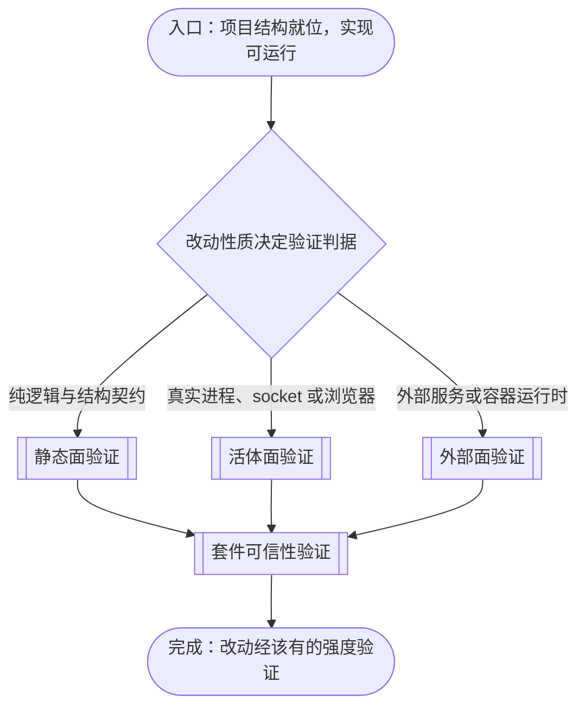
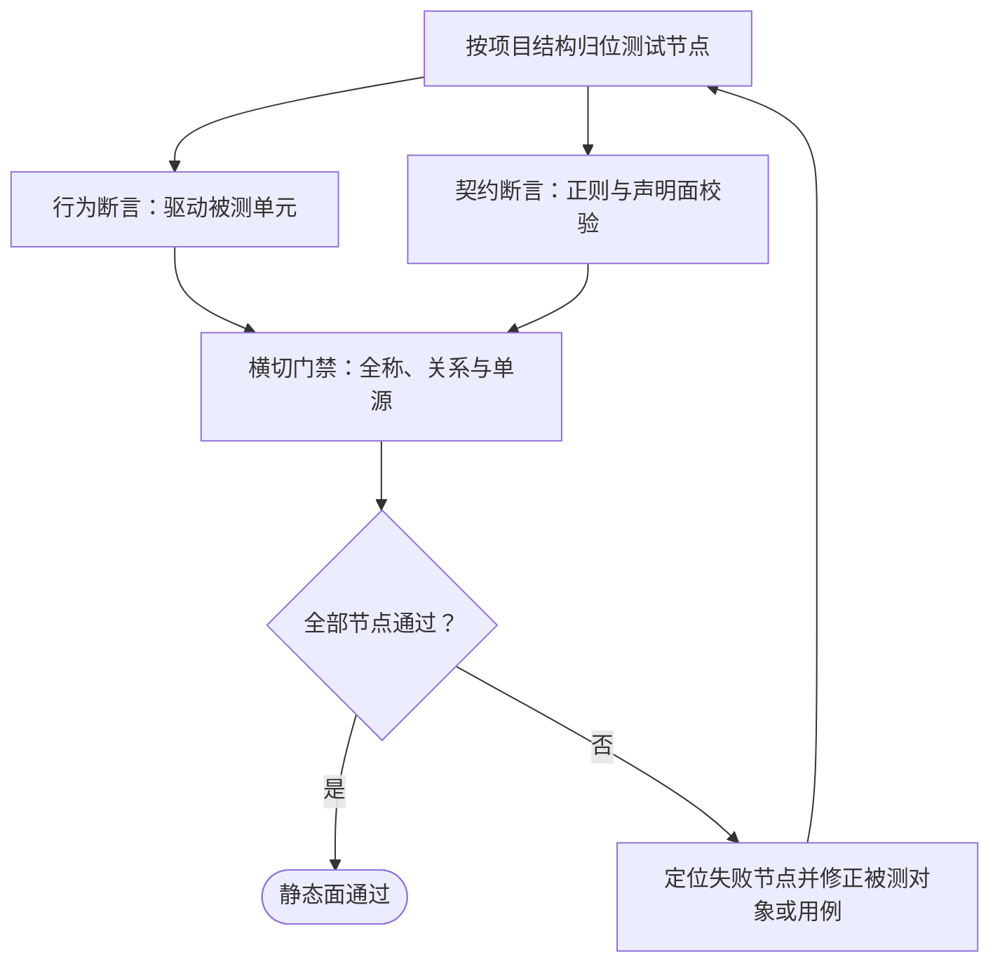
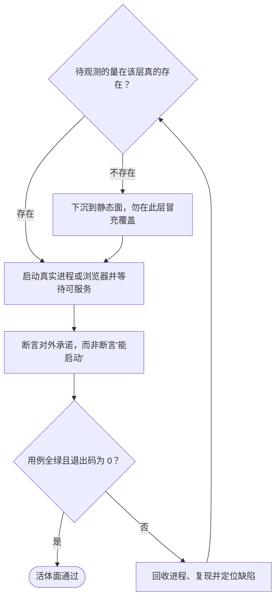
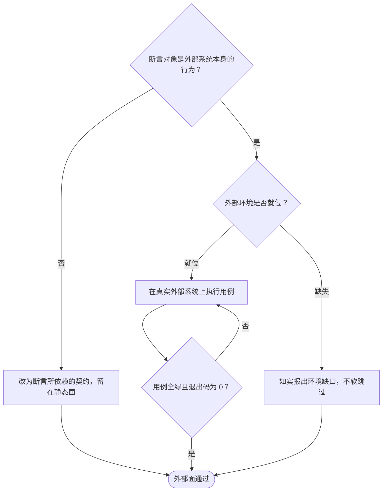
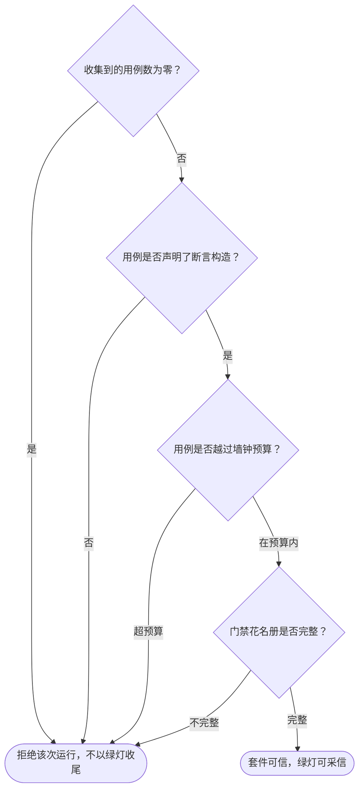

# 为项目建立测试套件的流程

本文档说明一个项目如何从「有可测的实现」走到「改动都被证到该有的强度」：从工程根的项目结构就位开始，经判据分层判定，分别走静态面、活体面与外部面三条验证路径，到每一处改动都有对应的断言守护为止。各层的准入判据、操作命令、校验判据与失败模式在逐节点章节中展开；根 AGENTS.md 的「测试」节以本文件为准。

本文档承载**跨项目共有**的主干：分层判据、各层回答什么问题、节点归位与套件可信的要求。三层各自的完整判据（准入条件、组织规则、反证纪律）在按需子文档中展开，本文件在对应节点处指路，不复制其内容。

**按层分子文档，不按被测对象的技术栈分。** 判据是「这条证据是否只有真实环境才提供」：同一个技术栈的测试可以落在不同层，同一个层的测试可以来自不同技术栈。plugin 的两半、容器镜像的构建契约、前端构建产物的接线，其结构断言同属静态面；以技术栈分册会把判据同源的内容拆散，掩盖「它们回答同一个问题」这一事实。故子文档是三层，不是「plugin 一册、docker 一册」。

## 主流程图

## START_WITH_PROJECT

本节点是流程入口，确认被验证的项目已具备测试所需的最小结构。本节点不出分支，唯一出边通向 `CHOOSE_LAYER`。

本节点要回答的最小问题是：**这个项目的实现有没有一处可被断言触及的入口**。它不要求测试已存在——建立套件本身就是本流程的内容；它要求的是实现不是散落的脚本，而是可导入、可启动或可枚举的产物。三条入口各有对应判据：

- **可导入**：模块能被测试进程 import，因而纯逻辑可被直接驱动；
- **可启动**：存在一个把服务跑起来的入口（如 `src/apps/api/serve.py` 这类自述端口的启动模块），因而真实进程可被观察；
- **可枚举**：项目的输入面（配置、构建输入、产物目录）能被测试递归走过，因而结构契约可被全称断言。

同一测试进程读不到被测仓库的根路径时，后续一切断言都无从落位。故本节点先固定**仓库定位**：由测试套件自身向上查找到那个同时带项目标志与源码目录的祖先目录，并把源码目录注入导入路径。标志缺一不可——只认项目清单文件会误命中子包，只认源码目录会误命中无关祖先。定位只写一处，全树经同一函数取回仓库路径，使镜像树整体搬迁时断言无需改动。

**输入**

- `PROJECT_ROOT`：路径；来源为项目部署位置。

**输出**

- `ENTRY_AVAILABLE`：枚举 `importable` / `startable` / `enumerable`；去向为 `CHOOSE_LAYER`。

## CHOOSE_LAYER

本节点是主图唯一的分叉点：按**改动性质所要求的证伪力**判定走哪条验证路径，而不是按被测对象的技术栈。出边条件——改动只涉及纯逻辑与结构契约，走 `STATIC_LAYER`；断言里需要真实进程、真实 socket 或真实浏览器才成立的那条证据，走 `LIVE_LAYER`；断言依赖外部服务或容器运行时，走 `EXTERNAL_LAYER`。

**分层判据是「这条证据是否只有真实环境才提供」，不是「被测对象属于哪个技术栈」。** 这一点直接决定子项怎么切分：同一个技术栈的测试可以落在不同层，同一个层的测试可以来自不同技术栈。plugin 的两半、容器镜像的构建契约、前端构建产物的接线，其**结构**断言都属静态面（读源码与配置即可判定）；它们的**真实装配**断言才属活体面。以技术栈分层会把判据同源的内容拆散，掩盖「它们其实回答同一个问题」这一事实。

三层各自回答不同问题，按下表选层，不要一律跑全量——选层是为了用对工具，不是为了少跑；不得以「成本高」为由降层或跳过。

| 层 | 回答的问题 | 准入判据 | 成本量级 |
| --- | --- | --- | --- |
| 静态面 | 模块与契约对不对 | 内存打包或直接导入即可判定 | 毫秒至秒 |
| 活体面 | 在真实进程里真的能用吗 | 至少一条证据只有真实运行环境提供 | 秒至分钟 |
| 外部面 | 接上外部系统后正常吗 | 断言对象是外部系统的行为本身 | 分钟 |

**判据可以同时命中多层**：既改集成行为又改构建产物时，两条路径都要走。主图的三条出边表达的是判据，不是互斥承诺——先跑较便宜的那条。

**输入**

- `ENTRY_AVAILABLE`：入口形态；来源为 `START_WITH_PROJECT`。

**输出**

- `LAYER_SET`：非空子集，取值 `static` / `live` / `external`；去向为 `STATIC_LAYER`、`LIVE_LAYER`、`EXTERNAL_LAYER`。

## STATIC_LAYER

本节点承载静态面验证的子流程：把每个实现文件归位到它的镜像测试节点，断言行为与结构契约，再由全称与单源断言的横切门禁守住无人值守的缺口。本节点不出分支，唯一出边通向 `SUITE_TRUSTED`。

本节点承接 `ENTRY_AVAILABLE` 给出的入口形态，按项目结构确定镜像树的形状。

各步骤的判据、组织规则与横切门禁的完整内容见 [静态面的测试判据](tests-static-layer.md)——本节不复制其内容。

**输入**

- `LAYER_SET`：含 `static` 的子集；来源为 `CHOOSE_LAYER`。

**输出**

- `STATIC_VERIFIED`：布尔；去向为 `SUITE_TRUSTED`。

### STATIC_SCOPE

按项目结构把每个断言归位到它的测试节点。判据是断言守护的变更理由有多大作用域。本节点分叉：单元行为走 `STATIC_BEHAVIOUR`，跨文件的契约走 `STATIC_CONTRACT`，全库递归与两侧集合走 `STATIC_GATE`。

**输入**

- `LAYER_SET`：含 `static` 的子集；来源为 `CHOOSE_LAYER`。
- `STATIC_TARGET`：修正后的改动与项目结构；来源为 `STATIC_FIX`。

**输出**

- `SCOPE_MAP`：断言到测试节点的归属映射；去向为 `STATIC_BEHAVIOUR` 或 `STATIC_CONTRACT`。

### STATIC_BEHAVIOUR

驱动被测单元，断言它做什么。本节点不出分支，唯一出边通向 `STATIC_GATE`。

**输入**

- `SCOPE_MAP`：断言到测试节点的归属映射；来源为 `STATIC_SCOPE`。

**输出**

- `ASSERTION_SET`：行为断言集合；去向为 `STATIC_GATE`。

### STATIC_CONTRACT

以正则与声明面校验契约——纯类型、单例导出面这类无法在运行期断言的模块由此守护。本节点不出分支，唯一出边通向 `STATIC_GATE`。

**输入**

- `SCOPE_MAP`：断言到测试节点的归属映射；来源为 `STATIC_SCOPE`。

**输出**

- `CONTRACT_SET`：契约断言集合；去向为 `STATIC_GATE`。

### STATIC_GATE

运行横切门禁：全称、关系与单源性质，以及守护门禁自身的元守护。本节点不出分支，唯一出边通向 `STATIC_RESULT`。

**输入**

- `ASSERTION_SET`：行为断言集合；来源为 `STATIC_BEHAVIOUR`。
- `CONTRACT_SET`：契约断言集合；来源为 `STATIC_CONTRACT`。

**输出**

- `GATE_REPORT`：逐门禁的通过/失败记录；去向为 `STATIC_RESULT`。

### STATIC_RESULT

判定静态面是否成立。判据是全部节点通过且退出码为 0，不是与某个写死的条数相等。成立时出边通向 `STATIC_PASS`；不成立时出边通向 `STATIC_FIX`。

**输入**

- `GATE_REPORT`：逐门禁的通过/失败记录；来源为 `STATIC_GATE`。

**输出**

- `STATIC_GREEN`：布尔；去向为 `STATIC_PASS` 或 `STATIC_FIX`。

### STATIC_FIX

在报红时进入：读失败信息里断言的具体原因定位缺陷，修正被测对象或用例，然后回到 `STATIC_SCOPE` 重跑。本节点不出分支，唯一出边回到 `STATIC_SCOPE`。

**输入**

- `STATIC_GREEN`：布尔；来源为 `STATIC_RESULT`。

**输出**

- `STATIC_TARGET`：修正后的改动与项目结构；去向为 `STATIC_SCOPE`。

### STATIC_PASS

静态面通过。本节点无出边。

**输入**

- `STATIC_GREEN`：布尔；来源为 `STATIC_RESULT`。

**输出**

- 无。

## LIVE_LAYER

本节点承载活体面验证的子流程：先确认「只有真跑能提供的那条证据」确实存在，再让真实进程或浏览器跑起来并断言它对外的承诺，最后无论成败都回收进程。本节点不出分支，唯一出边通向 `SUITE_TRUSTED`。

本节点承接 `ENTRY_AVAILABLE` 给出的入口形态，据此决定启动什么。

准入门槛、进程生命周期、端口选取与「为什么某条断言只有真跑能证伪」的完整内容见 [活体面的测试判据](tests-live-layer.md)——本节不复制其内容。

**输入**

- `LAYER_SET`：含 `live` 的子集；来源为 `CHOOSE_LAYER`。

**输出**

- `LIVE_VERIFIED`：布尔；去向为 `SUITE_TRUSTED`。

### LIVE_START

启动真实进程或浏览器。两条约定对所有启动点成立：浏览器一律经共享的启动选项入口（启动环境变量是替换语义，手写会丢掉运行所需的库路径；不带字体环境时中文会画成缺字方块，而这一失效模式专门骗过断言——只有截图是错的）；环境产物与源码分离，前者集中在一处被忽略的目录内。本节点不出分支，唯一出边通向 `LIVE_PROBE`。

**输入**

- `LAYER_SET`：含 `live` 的子集；来源为 `CHOOSE_LAYER`。
- `LIVE_TARGET`：修正后的待观测的量；来源为 `LIVE_RECOVER`。

**输出**

- `LIVE_TARGET`：待验证的改动与待观测的量；去向为 `LIVE_PROBE`。

### LIVE_PROBE

判定待观测的量在这一层真的存在，且取值随被测行为变化。判据是观测面是否在该层存在，不是断言写得对不对——顺序不可颠倒，探针是秒级而本层单次运行是分钟级。本节点分叉：量可观测且随行为变化走 `LIVE_ASSERT`；不可观测或放错层走 `LIVE_DEMOTE`。

**输入**

- `LIVE_TARGET`：待观测的量；来源为 `LIVE_START`。

**输出**

- `PROBE_RESULT`：枚举 `observable` 或 `wrong-layer`；去向为 `LIVE_ASSERT` 或 `LIVE_DEMOTE`。

### LIVE_DEMOTE

判据的出口：该量在此层不可观测时，把用例下沉到静态面并在覆盖边界中写明这一层不守护它。冒充覆盖比承认缺口更有害。本节点不出分支，唯一出边通向 `LIVE_PASS`。

**输入**

- `PROBE_RESULT`：枚举值 `wrong-layer`；来源为 `LIVE_PROBE`。

**输出**

- `DEMOTED`：下沉记录；去向为 `LIVE_PASS`。

### LIVE_ASSERT

执行断言。本层只断言对外承诺，不断言「能跑起来」：断言「服务在它被告知的地址上应答」是承诺，断言「服务启动了」只是操作系统。端口向内核申请空闲端口再交给被测进程，不得写死。异步改写结构的步骤分两段断言，先断基础结构再轮询等到升级后断结果。本节点不出分支，唯一出边通向 `LIVE_RESULT`。

**输入**

- `PROBE_RESULT`：枚举值 `observable`；来源为 `LIVE_PROBE`。

**输出**

- `LIVE_REPORT`：逐用例的通过/失败记录与退出码；去向为 `LIVE_RESULT`。

### LIVE_RESULT

判定点：判据是用例全绿且进程退出码为 0。收集到零个用例须以非零退出码报错，而不是打印通过。成立时出边通向 `LIVE_PASS`；不成立时出边通向 `LIVE_RECOVER`。

**输入**

- `LIVE_REPORT`：逐用例的通过/失败记录；来源为 `LIVE_ASSERT`。

**输出**

- `LIVE_GREEN`：布尔；去向为 `LIVE_PASS` 或 `LIVE_RECOVER`。

### LIVE_RECOVER

在报红时进入：读失败信息里断言的具体原因定位缺陷，修正实现或用例，然后回到 `LIVE_START` 重跑。**回收进程与复原环境无条件执行**：中途失败留下的进程会占住端口，使下一次运行报出与本次改动无关的冲突。本节点不出分支，唯一出边回到 `LIVE_START`。

**输入**

- `LIVE_GREEN`：布尔；来源为 `LIVE_RESULT`。

**输出**

- `LIVE_TARGET`：修正后的待观测的量；去向为 `LIVE_START`。

### LIVE_PASS

活体面通过。本节点无出边。

**输入**

- `LIVE_GREEN`：布尔；来源为 `LIVE_RESULT`。
- `DEMOTED`：下沉记录；来源为 `LIVE_DEMOTE`。

**输出**

- 无。

## EXTERNAL_LAYER

本节点承载外部面验证的子流程：把「依赖外部系统」的部分与「可在本地判定」的部分划清边界，只对前者建外部面用例，且环境缺失时如实报出缺口。本节点不出分支，唯一出边通向 `SUITE_TRUSTED`。

本节点承接 `ENTRY_AVAILABLE` 给出的入口形态。**它的主要产出往往是一份「不覆盖什么」的清单**——把无法在本环境证伪的部分写下来，与已覆盖的部分同等对待。

边界判据、契约与集成的分工、环境缺失时的处置见 [外部面的测试判据](tests-external-layer.md)——本节不复制其内容。

**输入**

- `LAYER_SET`：含 `external` 的子集；来源为 `CHOOSE_LAYER`。

**输出**

- `EXTERNAL_VERIFIED`：布尔；去向为 `SUITE_TRUSTED`。

### EXT_BOUNDARY

按断言对象分类：断言构建输入能否解析、启动命令是否自洽、迁移顺序是否正确，其对象是项目自己的配置文件，与外部系统是否运行无关，属静态面；只有当断言的对象就是外部系统的行为时，才属本层。本节点分叉：属契约走 `EXT_CONTRACT`；属集成走 `EXT_ENV`。

**输入**

- `LAYER_SET`：含 `external` 的子集；来源为 `CHOOSE_LAYER`。

**输出**

- `BOUND_VERDICT`：枚举 `contract` 或 `integration`；去向为 `EXT_CONTRACT` 或 `EXT_ENV`。

### EXT_CONTRACT

判据的出口：断言对象是项目自身产物时，把用例留在静态面，不因「它和容器有关」或「它和数据库有关」就推进本层。被测对象的技术栈不决定分层。本节点不出分支，唯一出边通向 `EXT_PASS`。

**输入**

- `BOUND_VERDICT`：枚举值 `contract`；来源为 `EXT_BOUNDARY`。

**输出**

- `DEMOTED`：下沉到静态面的记录；去向为 `EXT_PASS`。

### EXT_ENV

核实外部环境是否就位。核实必须是一次真实探测（连接、握手、版本查询），不是「配置项存在即认为可用」——后者会把配置错误伪装成环境缺失，或反之。本节点分叉：就位走 `EXT_RUN`；缺失走 `EXT_ABSENT`。

**输入**

- `BOUND_VERDICT`：枚举值 `integration`；来源为 `EXT_BOUNDARY`。

**输出**

- `ENV_PRESENT`：布尔；去向为 `EXT_RUN` 或 `EXT_ABSENT`。

### EXT_ABSENT

环境缺失时的处置。**不得软跳过**：把「环境不在」写成跳过、打印或早退，会让该部分显示为绿色；**不得把缺口算作覆盖**，须写明这一层不守护哪些性质以及由谁承担。本节点不出分支，唯一出边通向 `EXT_PASS`。

**输入**

- `ENV_PRESENT`：布尔值 `false`；来源为 `EXT_ENV`。

**输出**

- `GAP_REPORT`：环境缺口清单；去向为 `EXT_PASS`。

### EXT_RUN

在真实外部系统上执行用例，纪律与前两层一致：断言对外承诺、不软跳过、失败报出具体原因。本节点不出分支，唯一出边通向 `EXT_RESULT`。

**输入**

- `ENV_PRESENT`：布尔值 `true`；来源为 `EXT_ENV`。
- `EXT_GREEN`：布尔；来源为 `EXT_RESULT` 的重跑分支。

**输出**

- `EXT_REPORT`：逐用例的通过/失败记录与退出码；去向为 `EXT_RESULT`。

### EXT_RESULT

判定点：判据是用例全绿且进程退出码为 0。成立时出边通向 `EXT_PASS`；不成立时出边通向 `EXT_RUN` 重跑，因为外部系统的失败常是瞬时的。

**输入**

- `EXT_REPORT`：逐用例的通过/失败记录；来源为 `EXT_RUN`。

**输出**

- `EXT_GREEN`：布尔；去向为 `EXT_PASS` 或 `EXT_RUN`。

### EXT_PASS

外部面结论已出：集成部分或已在真实系统上验证，或已如实报出环境缺口。两者都是明确结论，不是失败也不是通过。本节点无出边。

**输入**

- `EXT_GREEN`：布尔；来源为 `EXT_RESULT`。
- `EXT_REPORT`：逐用例的通过/失败记录；来源为 `EXT_RUN`。
- `GAP_REPORT`：环境缺口清单；来源为 `EXT_ABSENT`。
- `DEMOTED`：下沉记录；来源为 `EXT_CONTRACT`。

**输出**

- 无。

## SUITE_TRUSTED

本节点承载套件可信性子流程：在三条验证路径汇合之后，确认给出绿灯的这套断言本身没有被削弱。「跑了且全绿」与「真的验证过」是两件事，本节点专门消除两者的差额。本节点不出分支，唯一出边通向 `TESTS_READY`。

前置三条路径各自可能全绿，而全绿的来源未必是「实现正确」。三种形态与真实全绿无从区分：

- **什么都没跑**：收集到零个用例、过滤词无匹配、节点被删空——报告读起来像通过；
- **跑了但没断言**：用例体是空壳，通过与否不取决于实现；
- **跑了但没跑到**：某个门禁被删除或掏空，它守护的性质自此无人过问。

故本节点不检查「哪些用例失败了」，而检查「这次运行是否真的执行了断言」。

三条运行期守卫的判据、元守护的登记方式、反证的纪律，以及「为什么破坏后仍然全绿不足以判定断言空转」的完整内容见 [静态面的测试判据](tests-static-layer.md) 的守卫与元守护两节——本节不复制其内容。

**输入**

- `STATIC_VERIFIED`：布尔；来源为 `STATIC_LAYER`。
- `LIVE_VERIFIED`：布尔；来源为 `LIVE_LAYER`。
- `EXTERNAL_VERIFIED`：布尔；来源为 `EXTERNAL_LAYER`。

**输出**

- `SUITE_TRUSTWORTHY`：布尔；去向为 `TESTS_READY`。

### TRUST_COLLECT

判定收集到的用例数是否为零。零用例来自路径写错、过滤词无匹配、节点被删空，而报告读起来像通过。本节点分叉：为零走 `TRUST_REFUSE`；不为零走 `TRUST_GUARD`。

**输入**

- `STATIC_VERIFIED`：静态面结论；来源为 `STATIC_LAYER`。
- `LIVE_VERIFIED`：活体面结论；来源为 `LIVE_LAYER`。
- `EXTERNAL_VERIFIED`：外部面结论；来源为 `EXTERNAL_LAYER`。

**输出**

- `COLLECTED`：已收集的用例数；去向为 `TRUST_GUARD` 或 `TRUST_REFUSE`。

### TRUST_GUARD

判定每个用例是否声明了断言构造。判据是「是否声明」而非「是否执行到」：断言写在条件分支内的用例，其分支未被走到时不算空壳，那是有效用例只是本次输入没触发。可被机器判定的是「整个用例没有断言」，那才是要抓的形态。本节点分叉：声明了走 `TRUST_BUDGET`；没有走 `TRUST_REFUSE`。

**输入**

- `COLLECTED`：已收集的用例数；来源为 `TRUST_COLLECT`。

**输出**

- `GUARD_PASSED`：布尔；去向为 `TRUST_BUDGET` 或 `TRUST_REFUSE`。

### TRUST_BUDGET

判定用例是否越过墙钟预算。预算的量级属于用例而非全局——一条扫描全库的用例其墙钟随仓库规模增长。本节点分叉：在预算内走 `TRUST_META`；超预算走 `TRUST_REFUSE`。

**输入**

- `GUARD_PASSED`：布尔；来源为 `TRUST_GUARD`。

**输出**

- `BUDGET_OK`：布尔；去向为 `TRUST_META` 或 `TRUST_REFUSE`。

### TRUST_META

判定门禁花名册是否完整：每个门禁文件存在、用例数不低于登记下限、且没有未登记的门禁。没有这层元守护，所有判据都能被一次删除静默拆除而测试仍然全绿。本节点分叉：完整走 `TRUST_PASS`；不完整走 `TRUST_REFUSE`。

**输入**

- `BUDGET_OK`：布尔；来源为 `TRUST_BUDGET`。

**输出**

- `ROSTER_OK`：布尔；去向为 `TRUST_PASS` 或 `TRUST_REFUSE`。

### TRUST_REFUSE

拒绝该次运行，不以绿灯收尾。本节点无出边。

**输入**

- `ROSTER_OK`：布尔；来源为 `TRUST_META`。
- `COLLECTED`：已收集的用例数；来源为 `TRUST_COLLECT`。
- `GUARD_PASSED`：布尔；来源为 `TRUST_GUARD`。
- `BUDGET_OK`：布尔；来源为 `TRUST_BUDGET`。

**输出**

- 无。

### TRUST_PASS

套件可信，绿灯可采信：这次运行真的执行了断言。本节点无出边。

**输入**

- `ROSTER_OK`：布尔；来源为 `TRUST_META`。

**输出**

- `SUITE_TRUSTWORTHY`：布尔；去向为 `TESTS_READY`。

## TESTS_READY

本节点是流程的结束节点：三条验证路径在此汇合并经可信性核验，每一处改动都有对应的断言守护，且该断言已被证明会报红。

改动被测对象后静态面必跑；断言依赖真实进程、socket 或浏览器时再跑活体面；依赖外部系统时再跑外部面。

**建成后的套件只维护一套**，且它随项目源码存放于项目自己的仓库内，不落回本知识库：本知识库不再持有任何可达的 `tests/`。新增测试写在项目内。

**输入**

- `SUITE_TRUSTWORTHY`：布尔；来源为 `SUITE_TRUSTED`。

**输出**

- 无。
