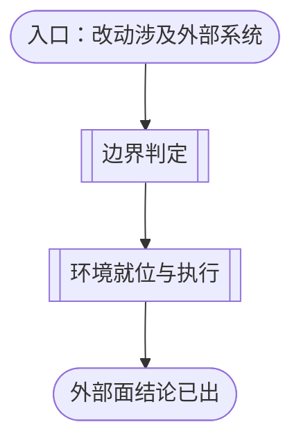
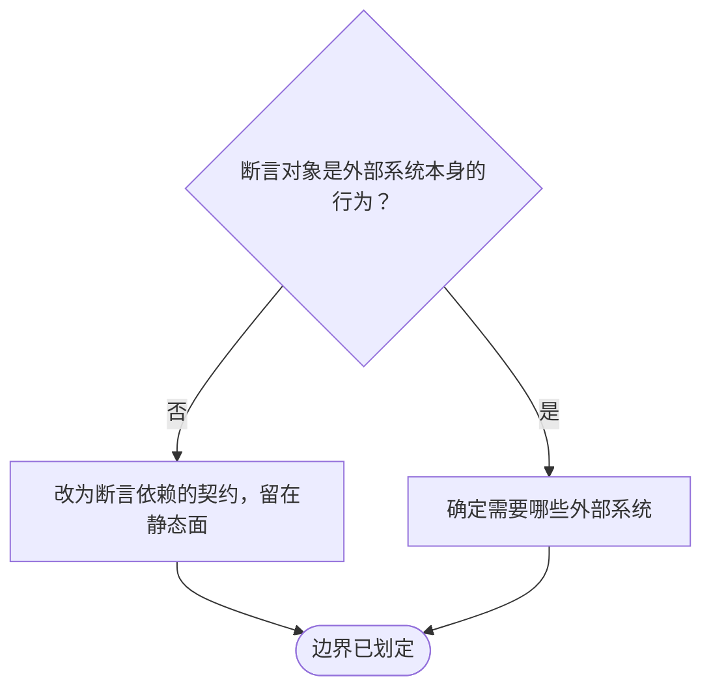
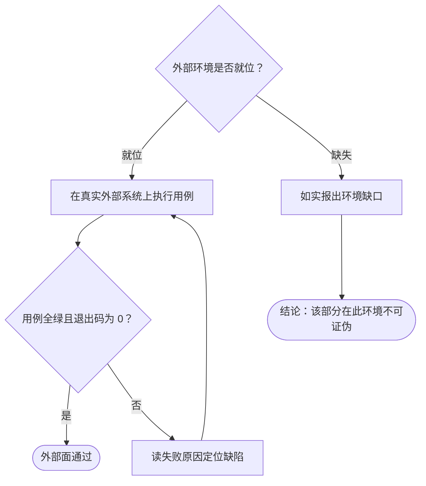

# 外部面的测试判据

本文档说明外部面如何验证一个项目：从判定「断言对象是不是外部系统本身的行为」开始，到在真实外部系统上执行用例、或在环境缺失时如实报出缺口为止。各步骤的边界判据、环境处置与失败模式在逐节点章节中展开；[为项目建立测试套件的流程](source-to-tests-flow.md) 的 `EXTERNAL_LAYER` 节点以本文件为准。

本层是三层里**最常被误用**的一层：多数「需要外部系统」的断言，其实断言的是项目对外部系统所依赖的**契约**，因而可在本地判定。误用的代价是双向的——把契约断言推进本层，会让测试依赖一个本可不必存在的环境；把外部行为留在静态层，则会得到一组永远绿、却从未接上真实系统的断言。

## 主流程图

## START_EXT

本节点是入口，确认改动确实触及外部系统。本节点不出分支，唯一出边通向 `BOUNDARY`。

**输入**

- `LAYER_SET`：含 `external` 的子集；来源为 `CHOOSE_LAYER`。

**输出**

- `EXT_TARGET`：待验证的改动与牵涉的外部系统；去向为 `BOUNDARY`。

## BOUNDARY

本节点承载边界判定的子流程：把断言对象分成「项目所依赖的契约」与「外部系统本身的行为」，前者留在静态面，后者才进本层。本节点不出分支，唯一出边通向 `EXEC`。

**这是本层最重要的一个判断**，因为它决定了一组测试是否需要外部环境。判据是**断言对象**：断言「构建输入能否在构建上下文内解析」「启动命令是否引用构建产出的解释器」「迁移顺序是否先迁移后服务」，其对象是项目自己的配置文件，与外部系统是否在运行无关——它们属静态面。只有当断言的对象**就是外部系统的行为**（容器能否真正构建成功、服务能否真正连上数据库、第三方接口在真实网络上的应答）时，才属本层。

**输入**

- `EXT_TARGET`：待验证的改动与牵涉的外部系统；来源为 `START_EXT`。

**输出**

- `EXT_TARGET`：划定后的目标；去向为 `EXEC`。

### BOUND_OBJECT

判定断言对象。只读契约与集成行为的分工可这样记：**静态面校验的是构建与运行所依赖的契约，不是构建结果本身**。契约能在没有外部进程的机器上判定；结果不能。

**输入**

- `EXT_TARGET`：待验证的改动；来源为 `START_EXT`。

**输出**

- `BOUND_VERDICT`：枚举 `contract` / `integration`；去向为 `BOUND_CONTRACT` 或 `BOUND_SCOPE`。

### BOUND_CONTRACT

判据的出口：断言对象是项目自身产物时，把用例留在静态面，不因「它和容器有关」或「它和数据库有关」就推进本层。**被测对象的技术栈不决定分层**——同一个技术栈的断言可以落在任一层，判据是它需要什么才能成立。

**输入**

- `BOUND_VERDICT`：枚举值 `contract`；来源为 `BOUND_OBJECT`。

**输出**

- `DEMOTED`：下沉到静态面的记录；去向为 `BOUND_DONE`。

### BOUND_SCOPE

确定本层需要哪些外部系统，并逐一核实它们是否存在。核实结果决定走执行还是报缺口。

**输入**

- `BOUND_VERDICT`：枚举值 `integration`；来源为 `BOUND_OBJECT`。

**输出**

- `EXT_INVENTORY`：所需外部系统清单；去向为 `BOUND_DONE`。

### BOUND_DONE

边界已划定的汇合点：哪些断言留在静态面、哪些需要外部环境，均已明确。本节点无出边。

**输入**

- `DEMOTED`：下沉记录；来源为 `BOUND_CONTRACT`。
- `EXT_INVENTORY`：外部系统清单；来源为 `BOUND_SCOPE`。

**输出**

- `EXT_TARGET`：划定后的目标；去向为 `EXEC`。

## EXEC

本节点承载环境就位与执行的子流程：核实外部系统是否可用，就位则在真实系统上执行用例，缺失则如实报出缺口。本节点不出分支，唯一出边通向 `EXT_DONE`。

**输入**

- `EXT_TARGET`：划定后的目标；来源为 `BOUND_DONE`。

**输出**

- `EXT_REPORT`：逐用例的通过/失败记录与退出码；去向为 `END`。

### EXEC_ENV

核实外部环境。核实必须是**一次真实探测**（连接、握手、版本查询），不是「配置项存在即认为可用」——后者会把配置错误伪装成环境缺失，或反之。

**输入**

- `EXT_TARGET`：划定后的目标；来源为 `BOUND_DONE`。

**输出**

- `ENV_PRESENT`：布尔；去向为 `EXEC_RUN` 或 `EXEC_ABSENT`。

### EXEC_RUN

在真实外部系统上执行用例。本层用例的执行与前两层同一套纪律：断言对外承诺、不软跳过、失败报出具体原因。

**输入**

- `ENV_PRESENT`：布尔；来源为 `EXEC_ENV`。
- `EXT_TARGET`：修正后的目标；来源为 `EXEC_FIX`。

**输出**

- `EXT_REPORT`：逐用例的通过/失败记录与退出码；去向为 `EXEC_RESULT`。

### EXEC_ABSENT

环境缺失时的处置。**两条禁止**：

- **不得软跳过**：把「环境不在」写成跳过、打印或早退，会让该部分显示为绿色。缺失即缺口，缺口须显式报出——这与静态面「无法导入即判失败」同源：不可达不是豁免。
- **不得把缺口算作覆盖**：报告里须写明「这一层不守护哪些性质」以及由谁承担（通常是持续集成上的专职作业）。

**输入**

- `ENV_PRESENT`：布尔；来源为 `EXEC_ENV`。

**输出**

- `GAP_REPORT`：环境缺口清单；去向为 `EXEC_GAP`。

### EXEC_RESULT

判定点：判据是用例全绿且进程退出码为 0。

**输入**

- `EXT_REPORT`：通过/失败记录；来源为 `EXEC_RUN`。

**输出**

- `EXT_GREEN`：布尔；去向为 `EXEC_PASS` 或 `EXEC_FIX`。

### EXEC_FIX

在用例报红时进入：读失败信息里断言的具体原因定位缺陷，修正实现或用例。区分「实现错了」与「外部系统变了」——后者是契约漂移，须连同契约断言一起修，只改本层会让静态面的契约继续描述旧行为。

**输入**

- `EXT_GREEN`：布尔；来源为 `EXEC_RESULT`。

**输出**

- `EXT_TARGET`：修正后的目标；去向为 `EXEC_RUN`。

### EXEC_PASS

外部面通过：在真实外部系统上验证成立。本节点无出边。

**输入**

- `EXT_GREEN`：布尔；来源为 `EXEC_RESULT`。

**输出**

- 无。

### EXEC_GAP

结论性出口：该部分在当前环境不可证伪，缺口已如实记录。本节点无出边——它是一个**明确的结论**，不是失败，也不是通过。

**输入**

- `GAP_REPORT`：环境缺口清单；来源为 `EXEC_ABSENT`。

**输出**

- 无。

## EXT_DONE

本节点是外部面的结束节点：断言对象已按「契约」与「集成」划清，集成部分或已在真实系统上验证，或已如实报出环境缺口。本节点无出边。

**输入**

- `EXT_REPORT`：通过/失败记录；来源为 `EXEC_RUN`。
- `GAP_REPORT`：环境缺口清单；来源为 `EXEC_ABSENT`。

**输出**

- `EXTERNAL_VERIFIED`：布尔；去向为 `SUITE_TRUSTED`。
