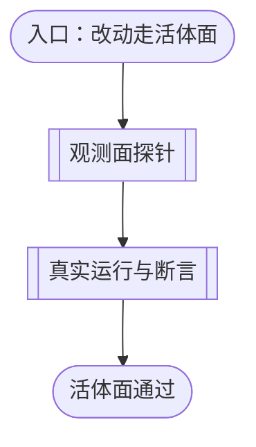
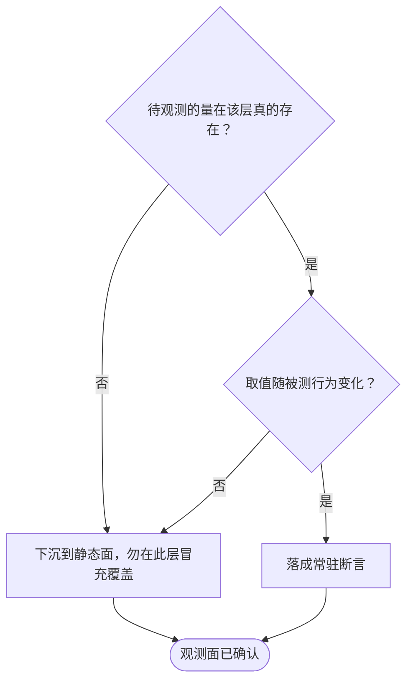
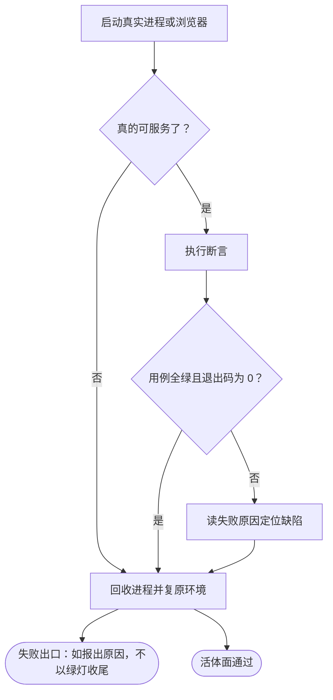

# 活体面的测试判据

本文档说明活体面如何验证一个项目：从判定「待观测的量在该层真的存在」开始，经启动真实进程或浏览器、断言其对外承诺，到用例全绿且进程被回收为止。各步骤的准入判据、生命周期约定与失败模式在逐节点章节中展开；[为项目建立测试套件的流程](source-to-tests-flow.md) 的 `LIVE_LAYER` 节点以本文件为准。

本层回答「在真实进程里真的能用吗」，其准入判据是**至少一条证据只有真实运行环境提供**。这一条判据是本层存在的唯一理由：答不出它的用例，其证伪力用内存打包或框架桩即可获得，代价却是本层的量级（一条用例秒至分钟级，而静态面是毫秒级）。满足不了即应下沉到[静态面的测试判据](tests-static-layer.md)。

## 主流程图

## START_LIVE

本节点是入口，确认改动确实需要活体面。本节点不出分支，唯一出边通向 `PROBE`。

**输入**

- `LAYER_SET`：含 `live` 的子集；来源为 `CHOOSE_LAYER`。

**输出**

- `LIVE_TARGET`：待验证的改动与待观测的量；去向为 `PROBE`。

## PROBE

本节点承载观测面探针子流程：在写常驻断言之前，先用一次性探针确认待观测的量在这一层真的存在，且取值随被测行为变化。本节点不出分支，唯一出边通向 `RUN`。

**判据是观测面是否在该层存在，不是断言写得对不对。** 顺序不可颠倒：探针是秒级，而本层单次运行是分钟级。若先写断言再发现该量在此层不可观测，损失的是整整一轮往返；更糟的是，不可观测的量会诱使作者写下「找不到前提就打印日志返回」的软跳过，换来一个假绿灯。

**输入**

- `LIVE_TARGET`：待验证的改动与待观测的量；来源为 `START_LIVE`。

**输出**

- `LIVE_TARGET`：确认后的待观测的量；去向为 `RUN`。

### PROBE_EXISTS

确认待观测的量在该层可被取到。取不到有两种原因，处置相反：该量本身不存在（实现缺陷，应报失败），或该量在此层不可观测（用例放错层，应下沉）。

**本层承认的领地**通常是这几类，不在其中的量须先证明它确实只有真跑能提供：

- **真实运行引擎**：布局几何（滚动高度、画布像素）、样式级联与实际生效、真实事件循环（受控输入的原生事件、指针捕获）。
- **真实宿主进程**：真实 HTTP 路由、真实文件落盘、真实长轮询。
- **跨侧真装配**：真实的端口与服务接线。
- **真实外部加载**：从网络或磁盘动态加载的库所产出的真实产物。

**输入**

- `LIVE_TARGET`：待观测的量；来源为 `START_LIVE`。

**输出**

- `PROBE_RESULT`：枚举 `observable` / `absent` / `wrong-layer`；去向为 `PROBE_VARIES` 或 `PROBE_DEMOTE`。

### PROBE_VARIES

确认取值随被测行为变化。一个不随行为变化的量，断言它等于常数只能证明「跑过」，不能证明「对」。

**输入**

- `PROBE_RESULT`：探针结果；来源为 `PROBE_EXISTS`。

**输出**

- `PROBE_STABLE`：布尔；去向为 `PROBE_KEEP` 或 `PROBE_DEMOTE`。

### PROBE_KEEP

把探针落成常驻断言。断言的对象是**对外承诺**，不是「能跑起来」——「窗口渲染出 N 个节点」「某个按钮存在」这类只数结构节点的断言，框架桩同样能验，属错层。

**异步改写结构的步骤要分两段断言**：先断言基础结构，再轮询等待升级后断言最终结果。把两段合并在同一时刻断言，就会读到中间态而随机变红。

**输入**

- `PROBE_STABLE`：布尔；来源为 `PROBE_VARIES`。

**输出**

- `ASSERTION_SET`：常驻断言集合；去向为 `RUN`。

### PROBE_DEMOTE

判据的出口：该量在此层不可观测或放错层时，把用例下沉到静态面，而不是在本层留下一条软跳过。**在报告里明确写出「这一层不守护它」**——冒充覆盖比承认缺口更有害。

**输入**

- `PROBE_RESULT`：探针结果；来源为 `PROBE_EXISTS`。
- `PROBE_STABLE`：布尔；来源为 `PROBE_VARIES`。

**输出**

- `DEMOTED`：下沉记录；去向为 `RUN`。

### PROBE_DONE

观测面已确认的汇合点。本节点无出边。

**输入**

- `ASSERTION_SET`：常驻断言集合；来源为 `PROBE_KEEP`。
- `DEMOTED`：下沉记录；来源为 `PROBE_DEMOTE`。

**输出**

- `LIVE_TARGET`：确认后的待观测的量；去向为 `RUN`。

## RUN

本节点承载真实运行与断言的子流程：启动真实进程或浏览器、等待可服务、执行断言，并保证进程无论成败都被回收。本节点不出分支，唯一出边通向 `LIVE_DONE`。

**输入**

- `LIVE_TARGET`：确认后的待观测的量；来源为 `PROBE_DONE`。
- `ASSERTION_SET`：常驻断言集合；来源为 `PROBE_KEEP`。
- `DEMOTED`：下沉记录；来源为 `PROBE_DEMOTE`。

**输出**

- `LIVE_REPORT`：逐用例的通过/失败记录；去向为 `LIVE_DONE`。

### RUN_START

启动真实进程或浏览器。两条约定对**所有启动点**成立：

- **浏览器一律经共享的启动选项入口**，不手写裸选项。启动环境变量的语义是**替换**而非合并，手写会顺手丢掉运行所需的库路径，使进程直接起不来。中文字体环境同理：宿主机常无 CJK 字体，不带字体环境启动会把每个汉字画成缺字方块——这个失效模式**专门骗过断言**（页面文本完全正确、结构断言与几何断言全部照常通过，只有截图是错的），而截图正是给人看的那份证据。
- **环境产物与源码分离**：源码全部入库，浏览器安装、解包的库、截图等环境产物集中在被忽略的单一目录内，按需重建。混放会让「该忽略的」与「该入库的」只能靠逐条规则区分，任何新增产物都容易漏配。

**输入**

- `LIVE_TARGET`：确认后的待观测的量；来源为 `PROBE_DONE`。

**输出**

- `PROCESS_HANDLE`：进程或浏览器句柄；去向为 `RUN_READY`。

### RUN_READY

判定是否真的可服务。**判据是一次真实连接，不是固定延时**——进程打印横幅早于 socket 接受连接，固定延时会在负载下变成随机红，同时什么也没证明。轮询须带截止时间，且进程提前退出时立即报出它退出码与输出，而不是等到超时。

**输入**

- `PROCESS_HANDLE`：句柄；来源为 `RUN_START`。

**输出**

- `READY`：布尔；去向为 `RUN_ASSERT` 或 `RUN_STOP`。

**失败模式**

进程在可服务前退出时，用例必须以该进程的退出码与实际输出报失败。只报「等待超时」会把「起不来」与「起得慢」混为一谈。

### RUN_ASSERT

执行断言。纪律与前一层一致，两条最常被违反：

- **输出日志后返回不是断言**：找不到前提就报失败。软跳过换来的绿灯是假绿灯——同一个用例可以在「没找到文件」「没进目标页面」「没渲染出内容」三种情形下全部通过。
- **断言的对象是对外承诺**：断言「服务在它被告知的地址上应答」是承诺；断言「服务启动了」只是操作系统。

**端口与地址不得写死**：向内核请求空闲端口再交给被测进程，写死会在并行运行或本机已占用时给出与缺陷无关的红。

**输入**

- `READY`：布尔；来源为 `RUN_READY`。

**输出**

- `LIVE_REPORT`：逐用例的通过/失败记录与退出码；去向为 `RUN_RESULT`。

### RUN_RESULT

判定点：判据是用例全绿且进程退出码为 0。成立时出边通向 `RUN_STOP` 后收尾为通过；不成立时出边通向 `RUN_FIX`。

**本层不允许零用例通过**：收集到零个用例时须以非零退出码报错，而不是打印通过——过滤词打错、目录被清空、用例文件只剩声明，都会响亮失败。一次「什么都没跑」的运行不得被读成「跑过且通过」。

**输入**

- `LIVE_REPORT`：通过/失败记录；来源为 `RUN_ASSERT`。

**输出**

- `LIVE_GREEN`：布尔；去向为 `RUN_FIX` 或 `RUN_STOP`。

### RUN_FIX

在用例报红时进入：读失败信息里断言的具体原因（不只是看有没有红）定位缺陷，修正实现或用例。

**本层的反证须走真实运行**：想证明某条断言不是空转，常用手法是故意改坏被测对象、确认用例变红、再复原。在本层这需要**整条链**，缺任何一步都会得到「破坏后仍然全绿」的假象：

1. 改坏源码；
2. **重建产物**——若本层跑的是构建产物而非源码，否则磁盘上的还是旧代码；
3. **重新激活或重启**——否则运行中的实例仍是旧代码（惰性读盘的实例只在激活时读一次）；
4. 跑目标用例，确认它**真的变红**。

复原同样是四步。第 2 步常可由前置检查兜住，第 3 步仍需人工完成，前置检查不能替代它。

**长耗时反证放后台任务并自带复原**：本层反证要重建产物加重启，会超过单次调用的默认超时而被杀——**被杀时复原钩子不执行**，源码与产物会留在破坏态。故把「破坏→重建→重启→验证→复原」整条链写进一个脚本，用 `trap ... EXIT` 兜底，再以后台任务运行。备份不得放系统临时目录，复原范围锚定到该次实验改动的具体文件，理由见[静态面的测试判据](tests-static-layer.md)的 `GATE_FIX`。

**输入**

- `LIVE_GREEN`：布尔；来源为 `RUN_RESULT`。

**输出**

- `LIVE_TARGET`：修正后的待观测的量；去向为 `RUN_STOP`。

### RUN_STOP

回收进程并复原环境。**这一节点必须无条件执行**：中途失败留下的进程会占住端口，使下一次运行报出与本次改动无关的冲突。用 `try/finally` 或语言等价机制绑定生命周期，不依赖用例走到最后一行。

**输入**

- `LIVE_GREEN`：布尔；来源为 `RUN_RESULT`。
- `READY`：布尔；来源为 `RUN_READY`。
- `LIVE_TARGET`：修正后的待观测的量；来源为 `RUN_FIX`。

**输出**

- `ENV_RESTORED`：环境状态；去向为 `RUN_PASS` 或 `RUN_FAIL`。

### RUN_FAIL

失败出口。输出失败用例与原因，并以非零退出码结束。本节点无出边。

**输入**

- `ENV_RESTORED`：环境状态；来源为 `RUN_STOP`。

**输出**

- 无。

### RUN_PASS

活体面通过。本节点无出边。

**输入**

- `ENV_RESTORED`：环境状态；来源为 `RUN_STOP`。

**输出**

- 无。

## LIVE_DONE

本节点是活体面的结束节点：只有真实运行环境才能提供的证据已被取到并断言，进程已回收，环境已复原。本节点无出边。

**输入**

- `LIVE_REPORT`：通过/失败记录；来源为 `RUN_ASSERT`。

**输出**

- `LIVE_VERIFIED`：布尔；去向为 `SUITE_TRUSTED`。
