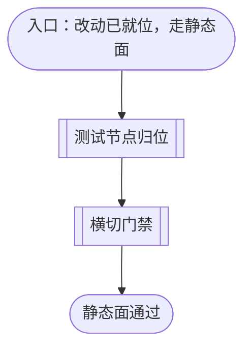
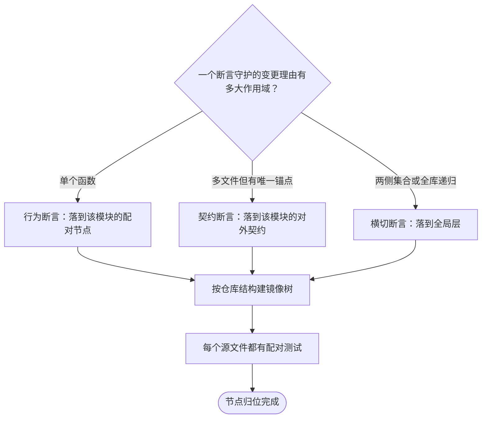
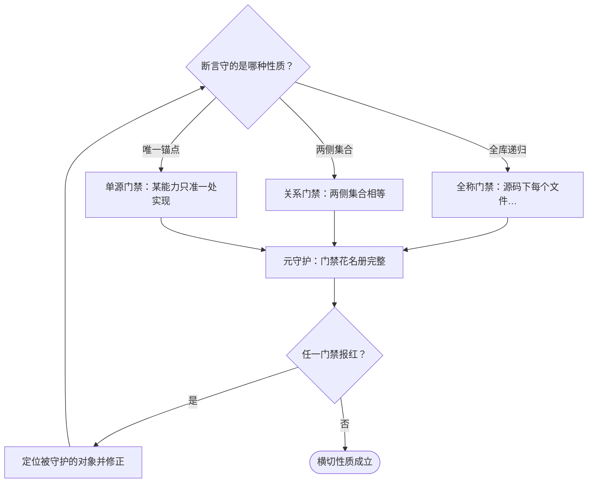

# 静态面的测试判据

本文档说明静态面如何验证一个项目：从测试节点按项目结构归位开始，经行为断言与契约断言两条路径，再由全称、关系与单源三类横切门禁守住无人值守的缺口，到静态面通过为止。各步骤的判据、组织规则与失败模式在逐节点章节中展开；[为项目建立测试套件的流程](source-to-tests-flow.md) 的 `STATIC_LAYER` 节点以本文件为准。

本层回答「模块与契约对不对」，其准入判据是**内存打包或直接导入即可判定**。任何断言若必须真跑一个进程、一个 socket 或一个浏览器才成立，它不属于本层——那属于[活体面的测试判据](tests-live-layer.md)。

## 主流程图

## START_STATIC

本节点是入口，确认静态面要验证的改动已知。本节点不出分支，唯一出边通向 `SCOPE`。

**输入**

- `LAYER_SET`：含 `static` 的子集；来源为 `CHOOSE_LAYER`。

**输出**

- `STATIC_TARGET`：待验证的改动与项目结构；去向为 `SCOPE`。

## SCOPE

本节点承载测试节点归位的子流程：按模块轴把用例落到正确的文件，按项目结构确定树的形状，并划定每个节点的职责边界。本节点不出分支，唯一出边通向 `GATE`。

**镜像规则是本子流程的组织原则**：仓库源码目录下的每一类代码、配置与产物，在测试树中都有一处对应的节点；新增模块时其测试位置由它在仓库中的位置决定，而非另行约定。仓库把业务代码收在自己的源码目录下，根目录只留构建与部署输入。

**输入**

- `STATIC_TARGET`：待验证的改动与项目结构；来源为 `START_STATIC`。

**输出**

- `SCOPE_DONE_STATE`：归位完成状态；去向为 `SCOPE_DONE`。

### SCOPE_BEHAVIOUR

驱动被测单元，断言它做什么。落到该模块的配对节点。本节点不出分支，唯一出边通向 `SCOPE_STRUCTURE`。

**输入**

- `NODE_MAP`：断言到测试节点的归属映射；来源为 `SCOPE_MODULE`。

**输出**

- `BEHAVIOUR_SET`：行为断言集合；去向为 `SCOPE_STRUCTURE`。

### SCOPE_CONTRACT

以正则与声明面校验对外契约——纯类型与单例导出面这类无法运行期断言的模块由此守护。本节点不出分支，唯一出边通向 `SCOPE_STRUCTURE`。

**输入**

- `NODE_MAP`：断言到测试节点的归属映射；来源为 `SCOPE_MODULE`。

**输出**

- `CONTRACT_SET`：契约断言集合；去向为 `SCOPE_STRUCTURE`。

### SCOPE_GLOBAL

承载不对应单个模块的横切断言：全称、关系与单源性质。本节点不出分支，唯一出边通向 `SCOPE_STRUCTURE`。

**输入**

- `NODE_MAP`：断言到测试节点的归属映射；来源为 `SCOPE_MODULE`。

**输出**

- `GLOBAL_SET`：横切断言集合；去向为 `SCOPE_STRUCTURE`。

### SCOPE_DONE

节点归位完成的汇合点：行为、契约与横切三类断言各有其节点。本节点无出边。

**输入**

- `SCOPE_DONE_STATE`：归位完成状态；来源为 `SCOPE_PAIRING`。

**输出**

- 无。

### SCOPE_MODULE

按**量化域**判定一个断言该归哪个节点——即它守护的「变更理由」有多大作用域。判据不是「这条断言写起来像什么」，而是「它被破坏时该改哪里」。

| 断言形态 | 量化域 | 被破坏时改哪里 | 归属 |
| --- | --- | --- | --- |
| 行为断言 | 单个函数 | 该模块 | 该模块的配对节点 |
| 单源断言（「X 只能定义一次」） | 多文件，但有唯一锚点 | 那个唯一的源 | 锚点的对外契约 |
| 关系断言（A 集合 == B 集合） | 两侧集合 | 无单一文件——两侧变得不一致 | 全局层 |
| 全称断言（「源码下每个文件……」） | 全库递归 | 无单一文件——某个新文件破坏性质 | 全局层 |
| 配置断言 | 构建与部署输入 | 该配置 | 全局层 |

机械识别特征是代码里出现递归遍历全库，或断言两侧集合相等：前者如「某能力只有一处实现」，其锚点是那个唯一源，属该模块的对外契约；后者如生产者声明的接口等于消费者调用的接口，属真全局。

只有真全局断言才独立成文件，且文件按**性质**命名（如跨侧契约、单源、套件守护），不按轮次或缺陷号命名。

**轮次与缺陷号不得出现在任何测试标识里**——文件名、声明字段、用例名三处一律禁止。理由是编号不服务用例名的职责：用例名是失败报告的标题，其唯一职责是让人读到的瞬间知道「什么行为、什么契约、什么边界被验证，以何种方式失败」；且编号是抄来的第二事实源，第一事实源一旦移动或废弃，抄本即成孤儿。语义括注（如「真实页面」「已锁定」）不受影响——判据是能否从名字本身读出含义。

**输入**

- `STATIC_TARGET`：待验证的改动与项目结构；来源为 `START_STATIC`。

**输出**

- `NODE_MAP`：断言到测试节点的归属映射；去向为 `SCOPE_STRUCTURE`。

### SCOPE_STRUCTURE

按仓库结构建立镜像树。测试树的位置与仓库位置的对应关系须写成可复核的对照表，使新增仓库内容时落位无需再约定。

镜像节点与行为节点并存于同一棵树：行为断言按被测模块落位，结构断言按镜像规则落位。二者以文件名区分语义，不以目录区分。

**输入**

- `NODE_MAP`：归属映射；来源为 `SCOPE_MODULE`。
- `BEHAVIOUR_SET`：行为断言集合；来源为 `SCOPE_BEHAVIOUR`。
- `CONTRACT_SET`：契约断言集合；来源为 `SCOPE_CONTRACT`。
- `GLOBAL_SET`：横切断言集合；来源为 `SCOPE_GLOBAL`。

**输出**

- `MIRROR_TREE`：镜像树结构；去向为 `SCOPE_PAIRING`。

### SCOPE_PAIRING

每个源文件都必须有配对的测试文件。判据分档，任一档不满足即红：

1. **配对**：该文件出现在某个同侧测试节点的声明里；纯类型文件（零运行时导出）到此为止即可。
2. **真实加载**：该测试确实把该路径送进加载器（含经常量间接引用、经胶水入口打包等写法）。只写进声明却在代码里从不加载，属「声称守护而实际从未执行」。
3. **导出被引用**：对该文件的每个运行时导出名，至少一个配对测试在非 import 行里出现该标识符，以区分「被 import 进依赖图」与「真的被调用」。
4. **渲染专用导出**：只渲染 UI、在无框架环境无法断言的导出，登记进门禁内的渲染豁免表，指向一个真实存在且提到该名字的端到端文件；文件不存在或没提及该名字即红。

判据三不敌视文本断言：纯类型契约、单例导出面这类只能以源码正则校验的模块，其文本断言里出现导出名同样成立。要证伪的是「整个文件无人加载」，不是「用例不是行为断言」。

**跨侧配对用例不得拆散**：同一形态在两侧的用例、以及断言两侧「形状相同」的关系用例必须留在同一文件——拆开就毁掉配对与关系断言本身。

**输入**

- `MIRROR_TREE`：镜像树结构；来源为 `SCOPE_STRUCTURE`。

**输出**

- `SCOPE_DONE_STATE`：归位完成状态；去向为 `GATE`。

## GATE

本节点承载横切门禁的子流程：以全称、关系与单源三类断言守住单个模块之外的性质，并守护门禁自身不被静默拆除。本节点不出分支，唯一出边通向 `STATIC_DONE`。

**门禁自身也必须被守护**：登记全部门禁文件及其用例数下限，几个门禁文件各自断言该花名册——删掉或掏空任何一个门禁都会让其余门禁报红。没有这层元守护，所有判据都能被一次删除静默拆除，而测试仍然全绿。

**输入**

- `SCOPE_DONE_STATE`：归位完成状态；来源为 `SCOPE_PAIRING`。

**输出**

- `GATE_GREEN`：布尔；去向为 `STATIC_DONE`。

### GATE_UNIVERSAL

全称门禁断言「源码下的每个文件都满足某性质」。它抓的是新增文件破坏性质的情形——这类破坏没有单一的原因文件。本节点不出分支，唯一出边通向 `GATE_ROSTER`。

**输入**

- `GATE_SET`：待执行的门禁集合；来源为 `GATE_TYPES`。

**输出**

- `UNIVERSAL_SET`：全称门禁集合；去向为 `GATE_ROSTER`。

### GATE_RELATION

关系门禁断言「A 集合等于 B 集合」。它抓的是两侧各自正确但彼此不一致的情形。本节点不出分支，唯一出边通向 `GATE_ROSTER`。

**输入**

- `GATE_SET`：待执行的门禁集合；来源为 `GATE_TYPES`。

**输出**

- `RELATION_SET`：关系门禁集合；去向为 `GATE_ROSTER`。

### GATE_SINGLE

单源门禁断言「某能力只能有一处实现」。它抓的是第二份实现——每份副本都能通过自己的行为断言，而两者在生产中漂移。本节点不出分支，唯一出边通向 `GATE_ROSTER`。

**输入**

- `GATE_SET`：待执行的门禁集合；来源为 `GATE_TYPES`。

**输出**

- `SINGLE_SET`：单源门禁集合；去向为 `GATE_ROSTER`。

### GATE_TYPES

按断言守护的性质分型。三类各有不可替代的证伪力：

- **全称门禁**断言「源码下的每个文件都满足某性质」。它抓的是**新增文件**破坏性质的情形——这类破坏没有单一的原因文件，逐模块的用例各自正常。
- **关系门禁**断言「A 集合等于 B 集合」（如两侧必须一致的契约、注册面与调用面）。它抓的是**两侧各自正确但彼此不一致**的情形。
- **单源门禁**断言「某能力只能有一处实现」。它抓的是**第二份实现**：每份副本都能通过自己的行为断言，而两者在生产中漂移。

**输入**

- `SCOPE_DONE_STATE`：归位完成状态；来源为 `SCOPE_PAIRING`。
- `GATE_SET`：修正后的门禁集合；来源为 `GATE_FIX`。

**输出**

- `GATE_SET`：待执行的门禁集合；去向为 `GATE_ROSTER`。

### GATE_ROSTER

登记每个门禁及其**用例数下限**与**断言调用数下限**，并在每次运行末尾核对实际执行量。

只数用例名不够：把用例体改写成先 `assert true` 再返回，会保留用例名、保留源码里的用例行数、甚至**提高**源码中的断言调用点数量，而真正执行的断言塌缩为零。故必须统计**运行期实际执行的断言调用数**。

**输入**

- `GATE_SET`：门禁集合；来源为 `GATE_TYPES`。
- `UNIVERSAL_SET`：全称门禁集合；来源为 `GATE_UNIVERSAL`。
- `RELATION_SET`：关系门禁集合；来源为 `GATE_RELATION`。
- `SINGLE_SET`：单源门禁集合；来源为 `GATE_SINGLE`。

**输出**

- `ROSTER_CHECKED`：花名册核对结果；去向为 `GATE_VERDICT`。

### GATE_VERDICT

判定横切性质是否成立。判据是任一已登记门禁报红即不成立。

**输入**

- `ROSTER_CHECKED`：花名册核对结果；来源为 `GATE_ROSTER`。

**输出**

- `GATE_GREEN`：布尔；去向为 `GATE_PASS` 或 `GATE_FIX`。

### GATE_FIX

在门禁报红时进入：读失败信息里断言的具体原因（不只是看有没有红），定位被守护的对象，修正实现或用例，然后回到 `GATE_TYPES` 重跑。

**测试是判官**：绿灯不得靠删测试或放宽断言达成。**测试先行**：修缺陷先写能复现的红测试，确证失败后再修，红转绿才是闭环证据。已知红的用例须登记在案，且红转绿前先移除该标记确证断言真会失败，防空转断言。

**破坏性反证的复原不得依赖记忆**：为验证断言真的会红而临时改坏源码或删文件时，备份与复原必须由机制保证，而不是靠「记得最后改回来」。两条硬约束：

- **不得把备份放在系统临时目录**：那里的生命周期等于单次调用，跨调用恢复时必然不存在，源码会被留在破坏状态。备份放工作区内的临时目录（已被忽略规则覆盖），或用 `trap ... EXIT` 把复原绑到调用退出，使中途失败也会复原。
- **复原范围锚定到改动的那一个文件**：恢复命令的目标写成具体路径，不得写成目录或路径前缀。判据是复原动作的作用域——一次实验只改了一个文件，复原却覆盖整个目录，就会把该目录下别的未提交改动一并擦掉。

**同一批证伪写进一个脚本，一次调用跑完**：一条断言要验多个失效路径时，把「逐条改坏→跑→复原」串成一个脚本内的循环，而不是每条各起一次调用。判据是往返次数，不是总命令数——每次往返都夹带一轮推理，占用的墙钟远大于脚本自身的执行时间。同批配负控：循环前后各跑一次未注入的基线，确认基线为零红，否则「报红」可能来自别的变体残留。

**破坏性实验先确认自己真的改坏了，再跑测试**：注入、篡改、删文件这类实验，第一步是核实改动确实发生，核实失败就地报错退出，不进测试。判据是失败发生的时点——改坏这一步本身没成功（锚点不存在、改错文件、转义被 shell 吃掉、备份没落盘），却要等整套测试跑完才从「没有报红」里倒推出来，此时既浪费一轮往返，又会把「实验无效」误读成「断言空转」。

**判据自检的样板**：「破坏后仍然全绿」这一现象本身**不足以**判定断言空转——它同样可以由「改动没有被真正加载」产生。必须先确认改动确实生效，再据此断定断言是否有效。

**输入**

- `GATE_GREEN`：布尔；来源为 `GATE_VERDICT`。

**输出**

- `GATE_SET`：修正后的门禁集合；去向为 `GATE_TYPES`。

### GATE_PASS

横切性质成立，单个模块之外的全称、关系与单源性质均被守护。本节点无出边。

**输入**

- `GATE_GREEN`：布尔；来源为 `GATE_VERDICT`。

**输出**

- 无。

## STATIC_DONE

本节点是静态面的结束节点：每个实现文件都有配对的测试节点，行为与契约断言全绿，横切门禁与元守护均成立。本节点无出边。

判据是**全绿且退出码为 0**，不是与某个写死的条数相等。

**输入**

- `SCOPE_DONE_STATE`：归位完成状态；来源为 `SCOPE_PAIRING`。
- `GATE_GREEN`：布尔；来源为 `GATE_VERDICT`。

**输出**

- `STATIC_VERIFIED`：布尔；去向为 `SUITE_TRUSTED`。
