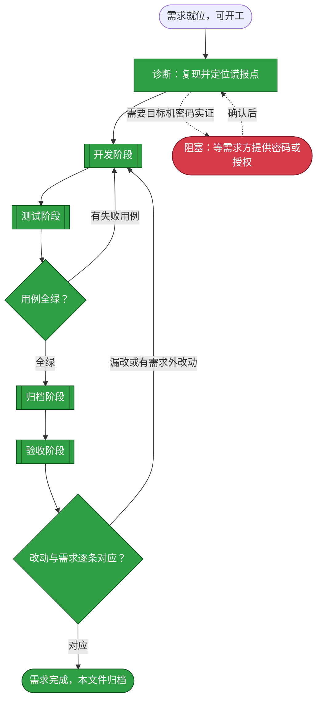
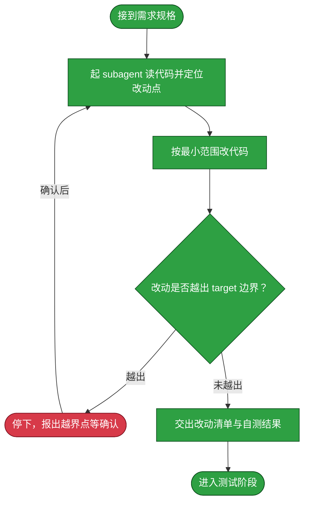
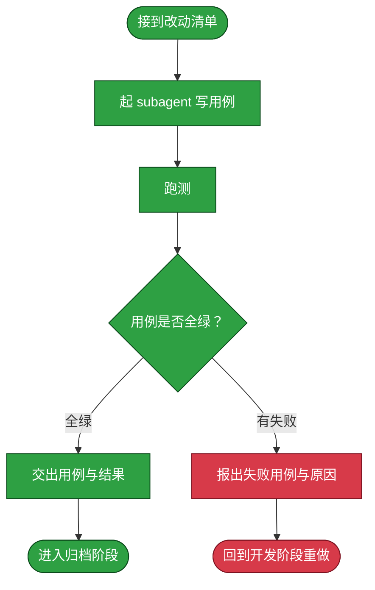
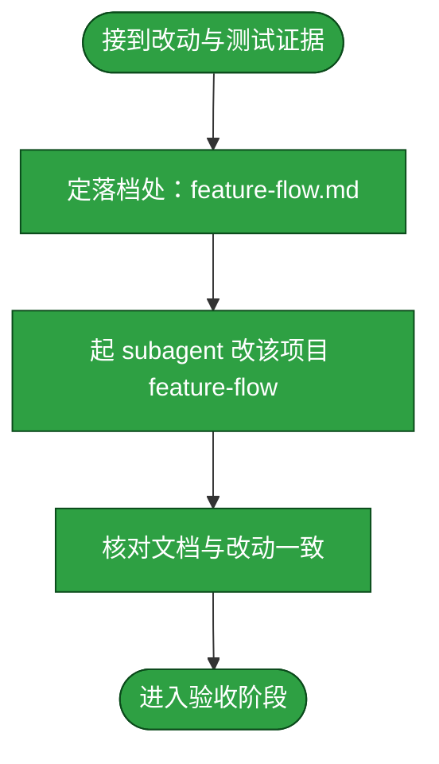
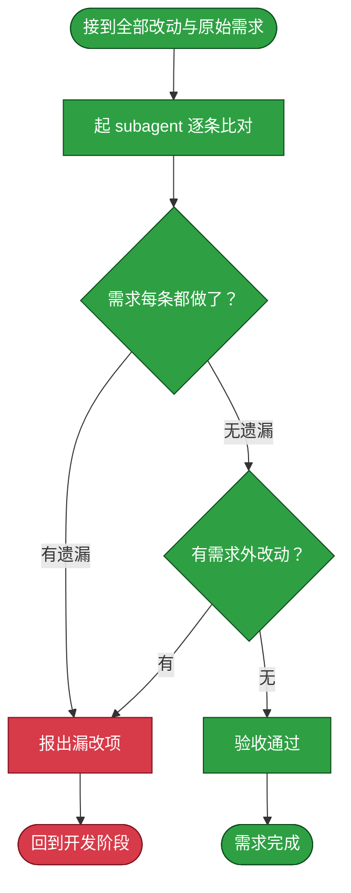

# 需求：修复 SSH 免密引导/重绑定谎报成功，导致目标机实际未装公钥、探活认证失败

```yaml
target: assets/projects/dsh-credentials/dsh-credentials/src/host/bootstrap.ts（与 src/shared/bootstrap.ts、src/host/rebind.ts 的安装/重绑定路径）
output: assets/projects/dsh-credentials/dsh-credentials/src/（修复安装成功判定），并将既成事实落档到 assets/projects/dsh-credentials/feature-flow.md
prompt:
  - 发现一个bug，unraid，openwrt都连接失败，但是自己在命令行输入一样的账号密码和端口号都是可以连接成功的，感觉是密钥没有推送到目标机器。，需要检查一下
  - 「连接失败」具体是哪个操作报错？→ 目标列表里点「检测连接」→ 显示认证失败/连不上；「命令行输入一样账号密码端口能连上」→ ssh -p 22 root@192.168.1.217 然后手输密码
```

用户反馈：unraid、openwrt 两台机器在凭证面板「检测连接」时报认证失败，但同一账号密码在命令行手输可成功登录。本需求要查清并修复——使「配置免密登录 / 重新绑定」报告的成功与目标机 `authorized_keys` 的真实状态一致，不再出现本机密钥落盘、面板显示可检测、实际公钥未送达目标机的谎报。起点是已复现的失败现场（见 DIAG），终点是安装/重绑定的成功判定可靠、且修复后有测试证据。

## 主流程图



## START

开工前的就位判定：需求已在前置块写清 `target` 与 `output`，且失败现象已在本机精确复现。本节点不出分支。

**输入**

- `REQ_READY`：前置块三键已填、失败现场已复现的状态；来源为本文件的前置数据块与「诊断」章节的实测记录。

**输出**

- `REQ_SPEC`：本需求的规格，即前置块的三键内容；去向为 `DIAG`。

## DIAG

诊断节点（本需求特有，先于四阶段）：把「感觉密钥没推送」落到可复算的事实。本节点为叶子节点，证据已取到，结论如下，均可现取现验。

已确认的最小事实：

1. 失败路径是**探活**（`target-probe`），非安装。用户确认「检测连接」报认证失败。
2. 用插件探活的精确 argv 复现：`ssh -F /dev/null -i <登记密钥> -o IdentitiesOnly=yes -o BatchMode=yes -o StrictHostKeyChecking=accept-new -o ConnectTimeout=10 -p <port> <user>@<host> true`，unraid 与 openwrt 均回 `Permission denied (publickey,...)`、退出码 255。该命令可在本机直接重跑验证。
3. 两台目标机真实可达（回答了密钥交换并拒绝密钥），排除网络/未开机。
4. 用户手动能成的是**密码登录**，证明 sshd 正常、密码正确、端口正确，缺的只是目标机 `authorized_keys` 里没有本机公钥。
5. 本机侧正常：`~/.ssh/id_ed25519_{unraid,openwrt}` 与 `.pub` 均在、`~/.ssh/config` 段齐全、登记表 `keyPath` 为正确绝对路径且文件存在。
6. unraid 私钥文件 mtime 为当日 21:22，说明经历过重新绑定/重装，但探活仍被拒——即「装密钥」被报告成功、实际未送达。

远端实证已补齐（在真实 unraid 上取证）：

7. unraid `~/.ssh/authorized_keys` 末尾有一行**残缺的 `ssh-ed25519`**（无 key body、无注释），全文 `grep dsh-credentials` 为空（exit=1）。该文件 mtime 为当日 09:22，且非手动所改——即插件某次「报成功」的安装/重绑定确实改写了远端文件，但写入的是残缺 `$1`。
8. unraid sshd 配置正常：`AuthorizedKeysFile .ssh/authorized_keys`（默认）、`PubkeyAuthentication`/`StrictModes`/`PasswordAuthentication` 均未显式设置（走默认），`/root` 710、`authorized_keys` 600 满足 StrictModes，`/root/.ssh` 是指向 `/boot/config/ssh/root` 的符号链接（unraid 标准持久化做法）。**排除权限与 sshd 配置两支反题**。
9. 根因钉死：插件的安装/重绑定把完整公钥 `ssh-ed25519 <body> <comment>` 截断成 `$1=ssh-ed25519`（仅第一个空格分隔词）写进 authorized_keys；而成功判定只看退出码与 `INSTALLED` 字串，对「`$1` 残缺」完全无感——远端脚本对残缺 `$1` 照样 `grep -qxF`、照样追加、照样 `echo INSTALLED`、退出码照样 0。截断具体发生在 argv→shell→ssh→远端 `$1` 链路的哪一环无法在本机复现（本机无 sshd、`/etc/ssh` 只读，无法起真实密码认证 sshd），故修复不针对某一猜测的 quote/join 点，而是修判定盲区本身。

**输入**

- `REQ_SPEC`：需求规格；来源为 `START`。
- `RESOLVED`：已取得目标机密码或授权；来源为 `BLOCKED`。到达时表示远端实证的阻塞已解除。

**输出**

- `REQ_SPEC`：需求规格（转交）；去向为 `DEVELOP`。
- `ROOT_CAUSE`：谎报点定位；去向为 `DEVELOP`。
- `OPEN_QUESTION`：需要目标机密码做实证；去向为 `BLOCKED`。

**失败模式**

- 需要目标机 root 密码做远端实证而尚未取得：走 `BLOCKED`，不强行推进——强行改一个判据未定的实现只会产出又一个判不了的版本。

## DEVELOP

开发阶段。本阶段的产出是**功能改动本身**——使安装/重绑定的成功判定与远端真实状态一致。它按下面的子流程走。

**起独立 subagent**：本阶段由一个新起的 subagent 执行，不承接对话里的上下文。交给它的输入只有 `target`、`output`、`prompt` 与本节写明的边界；它在自己的上下文里读代码、改代码、把改动落到工作区，中间过程留在它那里。

**边界**：它只改 `target` 指到的内容，不改需求未提及的相邻模块；发现必须改动需求之外的代码时停下并报出，不自行扩大范围。

**输入**

- `REQ_SPEC`：本需求的规格；来源为 `DIAG`。
- `ROOT_CAUSE`：谎报点定位；来源为 `DIAG`。
- `FAILURE_REPORT`：失败用例与原因；来源为 `TEST` 回边。
- `TEST_VERDICT`：全绿与否（失败时随回边到达）；来源为 `TEST_GATE`。
- `ACCEPT_FAILURE`：漏改或多余的处置要求；来源为 `ACCEPT` 回边。
- `ACCEPT_VERDICT`：逐条对应与否（不通过时随回边到达）；来源为 `ACCEPT_GATE`。

**输出**

- `REQ_SPEC`：需求规格（下发给子流程）；去向为 `D_IN`。
- `DEV_RESULT`：改动清单与自测结果；去向为 `TEST`、`ARCHIVE`、`ACCEPT`。
- `OPEN_QUESTION`：悬置的条件；去向为 `BLOCKED`。



### D_IN

承接 `DIAG` 交来的需求规格，把它整理成交给 subagent 的作业书。本节点不出分支。

**输入**

- `REQ_SPEC`：本需求的规格；来源为 `DIAG`。承接自 `DEVELOP` 章节的同名输入。

**输出**

- `DEV_BRIEF`：作业书，含 `target`、`output`、`prompt` 与本节边界；去向为 `D_AGENT`。

### D_AGENT

起一个独立 subagent，把 `DEV_BRIEF` 交给它，由它读代码并定位本需求要改的那一处。**为什么独立**：开发要在自己的上下文里反复读文件、试错、回退，这些中间过程对本流程其余阶段是噪声；独立 subagent 让它们留在自己的上下文里，本流程只收它的结论。

**输入**

- `DEV_BRIEF`：作业书；来源为 `D_IN`。
- `SCOPE_RESOLVED`：已确认的边界；来源为 `D_STOP`。

**输出**

- `CHANGE_POINT`：改动点，即要改的文件与位置；去向为 `D_EDIT`。

### D_EDIT

按最小范围实施改动。**最小范围**指只改需求要求的那一处行为，不顺手重构、不改格式、不升级依赖。

**输入**

- `CHANGE_POINT`：改动点；来源为 `D_AGENT`。

**输出**

- `DIFF`：本次改动；去向为 `D_SCOPE`。

### D_SCOPE

判定改动是否越出 `target` 边界。判定语义是：`DIFF` 触及的每个文件，是否都落在 `target` 所指的范围内。越界不一定是错的，但**必须报出来由需求方确认**，因为它意味着这条需求的实际影响面比它写下的 `target` 更大。

**输入**

- `DIFF`：本次改动；来源为 `D_EDIT`。

**输出**

- `SCOPE_VERDICT`：越界与否及其具体落点；去向为 `D_STOP` 或 `D_REPORT`。

### D_STOP

越界出口：停下并把越界点报给需求方，等其确认是扩大 `target` 还是收回改动。

**输入**

- `SCOPE_VERDICT`：越界点；来源为 `D_SCOPE`。

**输出**

- `SCOPE_RESOLVED`：已确认的边界；去向为 `D_AGENT`。

### D_REPORT

交出改动清单与开发自测结果，作为进入测试阶段的输入。**开发自测不等于测试阶段**：这里只证明改动跑得起来，覆盖需求要求的行为由测试阶段负责。

**输入**

- `DIFF`：本次改动；来源为 `D_EDIT`。
- `SCOPE_VERDICT`：未越界的判定；来源为 `D_SCOPE`。

**输出**

- `DEV_RESULT`：改动清单与自测结果；去向为 `D_OUT`。

### D_OUT

开发阶段出口：改动已在工作区就位且未越界。本节点无出边。

**输入**

- `DEV_RESULT`：改动清单与自测结果；来源为 `D_REPORT`。

**输出**

- `DEV_RESULT`：改动清单与自测结果；去向为 `TEST`。

## TEST

测试阶段。本阶段的产出是**测试用例与它们的运行结果**。它按下面的子流程走。

**起独立 subagent**：本阶段由一个新起的 subagent 执行。**为什么独立**：写用例的人应当是找出改动缺陷的人，独立于开发者才不会沿用开发者的思路去验证开发者自己的假设。它拿到的是改动清单与本需求的行为要求，不接触开发阶段的中间推理。

**边界**：它只写覆盖本需求要求的行为的用例，不借机扩充项目的测试套件覆盖面；用例失败时它**不改产品代码**，只报出失败。

**测试失败回到开发阶段**：失败不就地绕过，而是回到 `DEVELOP` 重做、测试重跑。已写入的用例保留——它们是这次失败的证据，也是下一轮开发的验收面。

**输入**

- `DEV_RESULT`：改动清单与自测结果；来源为 `DEVELOP`。

**输出**

- `TEST_EVIDENCE`：用例与运行结果；去向为 `ARCHIVE`。
- `FAILURE_REPORT`：失败用例与原因；去向为 `DEVELOP`。



### T_IN

承接开发阶段交来的改动清单，整理成测试作业书。本节点不出分支。

**输入**

- `DEV_RESULT`：改动清单与自测结果；来源为 `DEVELOP`。

**输出**

- `TEST_BRIEF`：测试作业书，含改动清单与本需求的行为要求；去向为 `T_AGENT`。

### T_AGENT

起一个独立 subagent，按 `TEST_BRIEF` 写覆盖本需求行为要求的用例。**为什么独立**：见本章开头。它不接触开发阶段的中间推理，故它对改动是否真的满足需求给出的是独立判断。

**输入**

- `TEST_BRIEF`：测试作业书；来源为 `T_IN`。

**输出**

- `TEST_CASES`：本次写下的用例；去向为 `T_RUN`。

### T_RUN

运行用例。跑法与判据取回自被测项目自己的 `tests/README.md`，本流程不另立判据；判据是全绿且退出码为 0。

**输入**

- `TEST_CASES`：本次写下的用例；来源为 `T_AGENT`。

**输出**

- `RUN_RESULT`：运行输出与退出码；去向为 `T_VERDICT`。

### T_VERDICT

判定是否全绿。判定语义是：该项目的全部用例都通过，且运行未被绕过——不靠删用例、放宽断言、跳过用例换取绿灯。

**输入**

- `RUN_RESULT`：运行输出与退出码；来源为 `T_RUN`。

**输出**

- `TEST_VERDICT`：全绿与否；去向为 `T_PASS` 或 `T_FAIL`。

### T_PASS

全绿出口：交出本次用例与运行结果，作为归档阶段的事实依据。本节点不出分支。

**输入**

- `TEST_VERDICT`：全绿判定；来源为 `T_VERDICT`。
- `TEST_CASES`：本次写下的用例；来源为 `T_AGENT`。

**输出**

- `TEST_EVIDENCE`：用例与运行结果；去向为 `T_OUT`。

### T_FAIL

失败出口：报出失败用例、失败原因与本次改动。**不在这里改产品代码**——改代码职责单一地落在开发阶段；测试阶段只判不改，否则判据与被判对象同出一处，绿灯失去意义。

**输入**

- `TEST_VERDICT`：失败判定；来源为 `T_VERDICT`。
- `RUN_RESULT`：运行输出；来源为 `T_RUN`。

**输出**

- `FAILURE_REPORT`：失败用例与原因；去向为 `T_BACK`。

### T_BACK

回到开发阶段的出口：带回失败报告。本节点无出边。

**输入**

- `FAILURE_REPORT`：失败用例与原因；来源为 `T_FAIL`。

**输出**

- `FAILURE_REPORT`：失败用例与原因；去向为 `DEVELOP`。

### T_OUT

测试阶段出口：用例全绿，交出用例与结果。本节点无出边。

**输入**

- `TEST_EVIDENCE`：用例与运行结果；来源为 `T_PASS`。

**输出**

- `TEST_EVIDENCE`：用例与运行结果；去向为 `ARCHIVE`。

## TEST_GATE

测试阶段的判定点：本次用例是否全绿。判定语义是全部用例通过且运行未被绕过——不靠删用例、放宽断言、跳过用例换取绿灯；任一条不成立即判失败。失败走回 `DEVELOP`，全绿则进入 `ARCHIVE`。

**输入**

- `RUN_RESULT`：用例运行输出与退出码；来源为 `TEST`。

**输出**

- `TEST_VERDICT`：全绿与否；去向为 `DEVELOP` 或 `ARCHIVE`。

## ARCHIVE

归档阶段。本阶段的产出是**落档后的文档**——把这次改动造成的既成事实写进它该在的地方。它按下面的子流程走。

**起独立 subagent**：本阶段由一个新起的 subagent 执行。**为什么独立**：落档要对着一份长文档做局部改写并保持它通篇自洽，这需要通读全文，而通读的上下文不该占用本流程的其余阶段。它拿到的是改动清单与测试证据。

**边界**：它只写**已经验证过的**事实——测试没覆盖到的环节写进文档的「未验证面」，不写成已验证；不把开发过程中的取舍与来历写进流程文档，那些不归流程文档承载。

**输入**

- `DEV_RESULT`：改动清单；来源为 `DEVELOP`。
- `TEST_EVIDENCE`：用例与运行结果；来源为 `TEST`。
- `TEST_VERDICT`：全绿与否；来源为 `TEST_GATE`。

**输出**

- `ARCHIVED`：已落档且自洽的文档；去向为 `ACCEPT`。



### A_IN

承接开发与测试两个阶段的产出，整理成落档作业书。本节点不出分支。

**输入**

- `DEV_RESULT`：改动清单；来源为 `DEVELOP`。
- `TEST_EVIDENCE`：用例与运行结果；来源为 `T_PASS`。

**输出**

- `ARCHIVE_BRIEF`：落档作业书，含改动与已验证面；去向为 `A_LOCATE`。

### A_LOCATE

定下这次改动的落档去处：`target` 落在被收录项目 `dsh-credentials` 的仓库克隆内，故该项目的 `feature-flow.md` 是它的落档处。本节点不出分支。

**输入**

- `ARCHIVE_BRIEF`：落档作业书；来源为 `A_IN`。

**输出**

- `ARCHIVE_TARGET`：落档处（`assets/projects/dsh-credentials/feature-flow.md`）；去向为 `A_AGENT`。

### A_AGENT

起一个独立 subagent，把这次改动的既成事实写进该项目的流程文档。

**输入**

- `ARCHIVE_BRIEF`：落档作业书；来源为 `A_IN`。
- `ARCHIVE_TARGET`：落档处；来源为 `A_LOCATE`。

**输出**

- `DOC_DIFF`：文档改动；去向为 `A_CHECK`。

### A_CHECK

核对落档结果与改动一致：文档描述的流程与工作区里的改动指向同一事实。本节点不出分支。

**输入**

- `DOC_DIFF`：文档改动；来源为 `A_AGENT`。

**输出**

- `ARCHIVED`：已落档且自洽的文档；去向为 `A_OUT`。

### A_OUT

归档阶段出口。本节点无出边。

**输入**

- `ARCHIVED`：已落档的文档；来源为 `A_CHECK`。

**输出**

- `ARCHIVED`：已落档的文档；去向为 `ACCEPT`。

## ACCEPT

验收阶段。本阶段判定**改的是不是需求要求的**：把本次全部改动与前置块的 `prompt` 逐条比对。它按下面的子流程走。

**起独立 subagent**：本阶段由一个新起的 subagent 执行。**为什么独立**：验收必须由一个没有参与前三个阶段的主体来做——它若参与过，就会用自己当初的思路去核对，看不到自己的偏差。它拿到的是全部 diff（代码与文档）与 `prompt`，不接触前三阶段的中间推理。

**判定语义**：判定分两问，**两问都成立**才算通过——其一，需求要求的每一处改动都做了（不少改）；其二，改动里没有需求未要求的东西（不多改）。少改则需求未达成；多改是范围蔓延，须回到开发阶段收回，或由需求方确认扩大需求。

**边界**：它只判「对不对应」，不判「改得好不好」——代码质量、风格、测试强度属开发与测试阶段，不在这里重开。

**输入**

- `ARCHIVED`：已落档的文档；来源为 `ARCHIVE`。
- `DEV_RESULT`：改动清单；来源为 `DEVELOP`。

**输出**

- `ACCEPT_FAILURE`：漏改或多余的处置要求；去向为 `DEVELOP`。



### C_IN

承接归档阶段的文档与开发阶段的代码改动，合为本次全部改动。本节点不出分支。

**输入**

- `ARCHIVED`：已落档的文档；来源为 `ARCHIVE`。
- `DEV_RESULT`：改动清单；来源为 `DEVELOP`。

**输出**

- `FULL_DIFF`：本次全部改动；去向为 `C_AGENT`。

### C_AGENT

起一个独立 subagent，把 `FULL_DIFF` 与 `prompt` 逐条比对。

**输入**

- `FULL_DIFF`：本次全部改动；来源为 `C_IN`。
- `PROMPT_RECORD`：前置块的 `prompt` 留档；来源为本文件的前置数据块。

**输出**

- `COMPARISON`：逐条对应关系与差异；去向为 `C_COVER`。

### C_COVER

判定需求要求的每一处改动是否都做了。判定语义是：`prompt` 的**最后一条**（当前有效的需求陈述）里的每项要求，都能在 `FULL_DIFF` 里找到对应的改动。

**输入**

- `COMPARISON`：逐条对应关系；来源为 `C_AGENT`。

**输出**

- `COVERAGE`：覆盖与否及漏改项；去向为 `C_BACK` 或 `C_EXTRA`。

### C_EXTRA

判定改动里是否有需求未要求的东西。判定语义是：`FULL_DIFF` 里的每处改动，都能追溯到 `prompt` 里的某项要求；追不到的是范围蔓延。

**输入**

- `COVERAGE`：无遗漏的判定；来源为 `C_COVER`。

**输出**

- `EXTRA`：需求外改动；去向为 `C_BACK` 或 `C_PASS`。

### C_BACK

不通过出口：报出漏改项或需求外改动。**两种不通过都回开发阶段**——验收阶段只判不改，自行修正是它越权，且会让「谁改的」与「谁验的」重新合一。

**输入**

- `COVERAGE`：漏改项；来源为 `C_COVER`。
- `EXTRA`：需求外改动；来源为 `C_EXTRA`。

**输出**

- `ACCEPT_FAILURE`：漏改或多余的处置要求；去向为 `C_OUT`。

### C_OUT

回到开发阶段的出口。本节点无出边。

**输入**

- `ACCEPT_FAILURE`：处置要求；来源为 `C_BACK`。

**输出**

- `ACCEPT_FAILURE`：处置要求；去向为 `DEVELOP`。

### C_PASS

通过出口：需求要求的都做了、且没有需求外的改动。本节点无出边。

**输入**

- `EXTRA`：无需求外改动的判定；来源为 `C_EXTRA`。

**输出**

- `ACCEPTED`：验收通过；去向为 `C_DONE`。

### C_DONE

需求完成的收尾：本条需求达成。按 [本目录 README](README.md) 的边界声明，需求完成后本目录不留存档，故**本文件整篇移入 [assets/archive/](../archive/README.md)**——是移动不是复制；归档前把全部节点状态标为已执行，文件内容不再改写。本节点无出边。

**输入**

- `ACCEPTED`：验收通过；来源为 `C_PASS`。

**输出**

- 无。

## ACCEPT_GATE

验收阶段的判定点：改动与需求是否逐条对应。判定语义分两问，两问都成立才通过——需求要求的每处改动都做了，且改动里没有需求未要求的东西。任一问不成立即回到 `DEVELOP`。

**输入**

- `COMPARISON`：逐条对应关系与差异；来源为 `ACCEPT`。

**输出**

- `ACCEPT_VERDICT`：逐条对应与否；去向为 `DEVELOP` 或 `DONE`。

## DONE

需求完成的终点标记：四个阶段都走完且验收通过，本文件移入 `assets/archive/`。本节点无出边。

**输入**

- `ACCEPTED`：验收通过；来源为 `ACCEPT` 的 `C_PASS`。
- `ACCEPT_VERDICT`：逐条对应与否；来源为 `ACCEPT_GATE`。

**输出**

- `ARCHIVE_MOVE`：把本文件移入 `assets/archive/` 的动作；去向为流程外部的归档动作。

## BLOCKED

阻塞出口：流程中遇到做不下去的条件时停在这里等协助。**停在这里是本流程的正常出口，不是失败**——一项判据未定的需求，强行推进只会产出一个自己都判不了的实现。本需求的阻塞点是诊断阶段需要目标机 root 密码做远端实证而尚未取得；取得后回 `DIAG` 补齐，再进 `DEVELOP`。

**输入**

- `OPEN_QUESTION`：悬置的条件；来源为 `DIAG` 或 `DEVELOP`。

**输出**

- `RESOLVED`：已确认的条件；去向为 `DIAG`。
