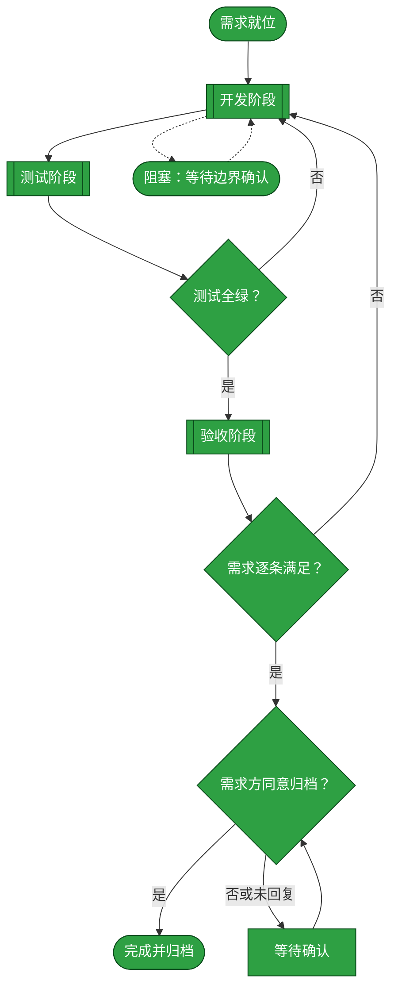
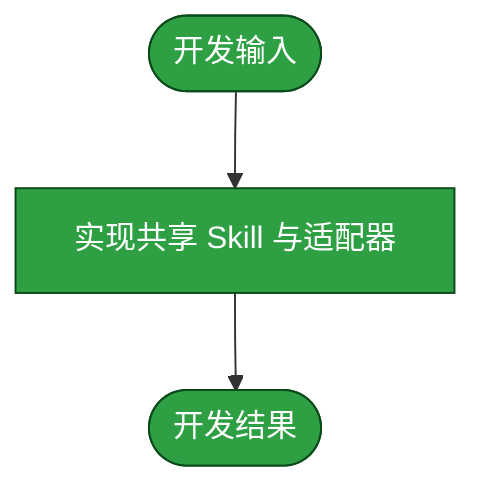
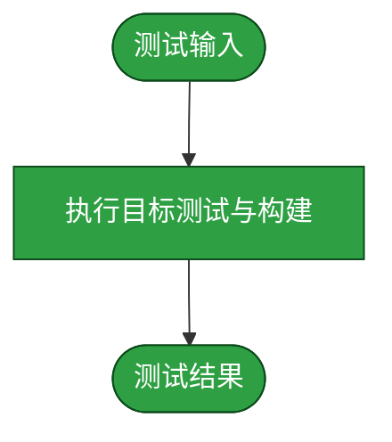
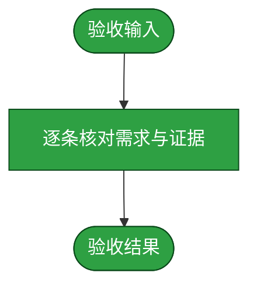

# 需求：为 dsh-credentials 提供 bundle 与动态 Cordis 的设备链接 Skill

```yaml
target: assets/projects/dsh-credentials/dsh-credentials/src/host 与 assets/projects/dsh-credentials/dsh-credentials/tests
output: assets/projects/dsh-credentials/dsh-credentials/src/host 与 assets/projects/dsh-credentials/dsh-credentials/tests
prompt:
  - dsh-credentials需要提供一些skills，当进行nickname设备链接的时候提供帮助。先探索一个比较推荐的途径
  - bundle和动态cordis都要支持
  - 开始实施
```

本流程从已确定的 nickname/alias 规则开始，完成共享 Skill、只读目标解析能力在 bundle 与动态 Cordis 两种 Host 形态中的实现、测试和独立验收；密码输入与 SSH 指纹确认仍只发生在设置页。验收通过后等待需求方明确同意，才归档本流程。

## 主流程图



## START

需求范围、输出路径与安全边界已明确，允许进入开发。本节点无分支。

**输入**

- `REQ_SPEC`：前置块中的目标、产出和原始需求；来源为本文件前置块。

**输出**

- `DEV_BRIEF`：实现共享 Skill、目标查询、两种 adapter 注册和对应测试的作业书；去向为 `DEVELOP`。

## DEVELOP

开发阶段由独立 subagent 实施，只修改项目仓库中与本需求有关的源码和测试，不改知识库规范。实现必须以 alias 为连接主键，nickname 默认等于 alias 但允许独立修改；解析应优先精确 alias，其次唯一 nickname，多匹配时不得自动选择。bundle 与 Cordis 必须共用 Skill 与协议定义，并各自完成生命周期注销。



**输入**

- `DEV_BRIEF`：开发作业书；来源为 `START`。
- `FAILURE_REPORT`：测试失败报告；来源为 `TEST_GATE`。
- `ACCEPT_FAILURE`：验收不通过报告；来源为 `ACCEPT_GATE`。
- `TEST_VERDICT`：测试通过或失败的判定；来源为 `TEST_GATE`。
- `ACCEPTANCE`：验收通过或返工要求；来源为 `ACCEPT_GATE`。

**输出**

- `DEV_RESULT`：源码、测试改动与开发自测结果；去向为 `TEST` 或 `ACCEPT`。
- `OPEN_QUESTION`：阻塞条件；去向为 `BLOCKED`。
- `TEST_VERDICT`：测试判定的回传；去向为 `DEVELOP`。
- `ACCEPT_FAILURE`：验收不通过报告；去向为 `DEVELOP`。

### DEV_SCOPE

开发输入已由主流程确定，独立 subagent 仅接收作业书及返工报告，不扩大目标范围。本节点无分支。

**输入**

- 无

**输出**

- 无

### DEV_IMPLEMENT

实现共享 Skill、只读解析协议以及 bundle 与 Cordis 两种适配器，并保留生命周期注销边界。本节点无分支。

**输入**

- 无

**输出**

- 无

### DEV_VERIFY

以开发自测结果确认实现可交给测试阶段；发现需要外部边界决定的问题时保留阻塞信息。本节点无分支。

**输入**

- 无

**输出**

- 无

## TEST

测试阶段由独立 subagent 执行，只新增或修改覆盖本需求的测试，不修改产品代码。已验证目标解析优先级、重复 nickname、无秘密泄露、bundle 注册/注销和 Cordis 注册/注销；相关套件、两种构建均退出码为 0。项目全量 `npm test` 仍有一个继承的 file-log askpass 元数据断言失败，故该节点保留阻塞状态，不把全量失败伪装成全绿。



**输入**

- `DEV_RESULT`：开发结果；来源为 `DEVELOP`。

**输出**

- `TEST_EVIDENCE`：测试用例与全绿运行结果；去向为 `ACCEPT`。
- `FAILURE_REPORT`：失败用例与原因；去向为 `DEVELOP`。

### TEST_SCOPE

测试 subagent 接收开发结果，限定覆盖本需求行为的用例范围。本节点无分支。

**输入**

- 无

**输出**

- 无

### TEST_CASES

独立执行目标解析、秘密排除、bundle 注册/注销、Cordis 注册/注销及两种构建验证。本节点无分支。

**输入**

- 无

**输出**

- 无

### TEST_REPORT

保留测试用例与运行结果；全量测试的继承性 file-log 失败仍作为阻塞证据，不被改写为全绿。本节点无分支。

**输入**

- 无

**输出**

- 无

## TEST_GATE

测试判定依据为项目测试入口的全绿结果且退出码为 0；任何失败都回到开发阶段。本轮目标套件与构建均通过，但全量测试在继承的 `tests/host/adapters/bundle/file-log.test.ts` 中仍失败，断言为 askpass 元数据缺失；该失败不触及本需求代码，已由独立开发 agent 复现并判定为基线问题，因此暂不改动其所属 file-log 实现。

**输入**

- `TEST_EVIDENCE`：测试证据；来源为 `TEST`。
- `FAILURE_REPORT`：失败用例与原因；来源为 `TEST`。

**输出**

- `TEST_VERDICT`：测试通过或失败；去向为 `ACCEPT` 或 `DEVELOP`。
- `FAILURE_REPORT`：失败用例与原因；去向为 `DEVELOP`。

## ACCEPT

验收阶段由独立 subagent 执行，检查全部 diff 是否逐条满足需求，且没有把密码、私钥或指纹确认引入模型工具或 Skill。验收确认共享 Skill、两种 adapter 的注册注销、alias 优先与 nickname 歧义保护、只读解析及秘密排除均有代码和测试证据；全量测试的继承性 file-log 失败不归因于本需求。



**输入**

- `TEST_EVIDENCE`：测试证据；来源为 `TEST`。
- `DEV_RESULT`：开发结果；来源为 `DEVELOP`。
- `TEST_VERDICT`：测试通过或失败的判定；来源为 `TEST_GATE`。

**输出**

- `ACCEPT_VERDICT`：逐条对应结论；去向为 `ACCEPT_GATE`。

### ACCEPT_SCOPE

验收 subagent 接收需求、全部 diff 和测试证据，限定为需求逐条对应及安全边界检查。本节点无分支。

**输入**

- 无

**输出**

- 无

### ACCEPT_REVIEW

独立核对共享 Skill、两种 adapter 的注册注销、alias 优先、nickname 歧义保护、只读解析和秘密排除。本节点无分支。

**输入**

- 无

**输出**

- 无

### ACCEPT_REPORT

形成逐条验收结论，并保留全量测试基线失败不归因于本需求的证据。本节点无分支。

**输入**

- 无

**输出**

- 无

## ACCEPT_GATE

验收判定依据是：bundle 与动态 Cordis 都可注册同一 Skill；目标解析行为和安全边界都有证据；改动范围与需求一致。判定通过才进入需求方确认。

**输入**

- `ACCEPT_VERDICT`：验收结论；来源为 `ACCEPT`。

**输出**

- `ACCEPTANCE`：通过或返工要求；去向为 `REQUESTER_APPROVAL` 或 `DEVELOP`。
- `ACCEPT_FAILURE`：验收不通过报告；去向为 `DEVELOP`。

## REQUESTER_APPROVAL

等待需求方明确决定是否归档。未收到明确同意前不得移动本文件，也不得合并开发分支。

**输入**

- `ACCEPTANCE`：通过的验收结论；来源为 `ACCEPT_GATE`。
- `ARCHIVE_PERMISSION`：需求方后续明确答复；来源为 `APPROVAL_WAIT`。

**输出**

- `ARCHIVE_PERMISSION`：明确同意或未同意；去向为 `DONE` 或 `APPROVAL_WAIT`。

## APPROVAL_WAIT

需求尚未获得明确归档同意。本节点保持待确认状态。

**输入**

- `ARCHIVE_PERMISSION`：未同意或未回复；来源为 `REQUESTER_APPROVAL`。

**输出**

- `ARCHIVE_PERMISSION`：需求方后续明确答复；去向为 `REQUESTER_APPROVAL`。

## BLOCKED

开发或测试遇到需要外部协助的边界问题时暂停，不改变既有实现或证据；边界明确后恢复开发。

**输入**

- `OPEN_QUESTION`：阻塞条件；来源为 `DEVELOP`。

**输出**

- `DEV_BRIEF`：已确认的边界决定；去向为 `DEVELOP`。

## DONE

仅在需求方明确同意归档后结束流程，并将整篇需求文档移动到 `assets/archive/`；未获明确同意时不得进入本节点。

**输入**

- `ARCHIVE_PERMISSION`：明确同意归档；来源为 `REQUESTER_APPROVAL`。

**输出**

- 无
