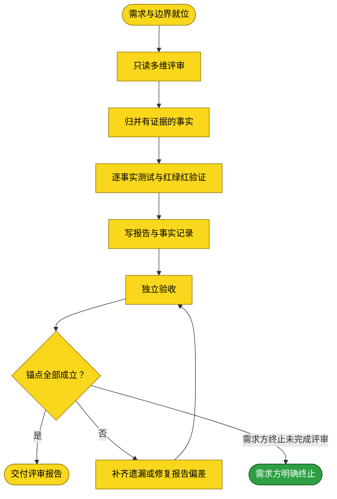

# 需求：评审 dsh-credentials 工程并落档可验证事实

```yaml
target: assets/projects/dsh-credentials/dsh-credentials/
output: assets/projects/dsh-credentials/dsh-credentials/reviews/review-20261010-003323.md
prompt:
  - projects/des-credentials中新增一篇dsh-credentials工程评审说明文档。评审需要阅读工程代码，需要从多维度subagent独立评审，评审阶段仅能读取代码。评审找出项目中的问题，生成评审报告，在项目仓库新增评审文件夹，文件夹中生成评审报告以review-timestamp为名，评审规则为：找出代码中的问题，问题即为事实。事实必会有test，如果没有test，则需要补充test。test会让问题变红（不通过）。然后修复问题。再跑test，需要变绿。最后需要破坏性破坏代码，再跑test，test需要转红，证明test和修复均有效。然后test落档。落档格式：{factId, note, category, testpath, evidence, solution}。
```

本流程从目标仓库只读基线开始，经多视角独立代码评审、对发现事实逐项测试红—修复绿—可逆破坏红验证，再把报告与结构化事实落档到仓库内，最后由独立验收者复核需求锚点。

## 需求澄清

### 澄清记录

- 无——目录定位依项目索引唯一对应为 `assets/projects/dsh-credentials/dsh-credentials/`；评审发现阶段仅读代码，测试与修复阶段才允许改代码。破坏性验证采用可恢复的临时反向变更并在验证后恢复，不能把故意破坏留在最终工作树。
  - 裁决：把需求中的 `projects/des-credentials` 视为对索引项目 `dsh-credentials` 的路径误写，产物写在仓库 `reviews/`。
  - 反论与代价：路径误写可能表示用户意图为另一个不存在的项目；按索引路径执行会漏掉本意。代价是若用户原意不同需重做评审；通过检查索引中仅有的 dsh-credentials 项目并让用户最终可核报告路径降低误解。
  - 验收面：目标仓库确为项目索引列出的 dsh-credentials 克隆；报告含所有评审事实的测试证据和破坏性验证结果。

### 验收锚点

- A1：至少多个互不共享上下文的评审 subagent 覆盖不同代码维度，且审查时不改源码、测试或配置；各自结论可追溯到当前代码证据。
- A2：每个进入报告的事实均有测试；原无测试的事实先补测试并证红，修复后证绿，再以可恢复的破坏性变更证红，最终恢复源码。
- A3：仓库中新增以 `review-<timestamp>` 命名的评审目录内报告，事实落档对象字段精确为 `{factId, note, category, testpath, evidence, solution}`。
- A4：适用的仓库测试按 `tests/README.md` 跑法通过，报告如实区分未能验证的发现。

### 范围边界

- 不做：不审改知识库其他项目；不在评审取证阶段写入或执行代码；不把未能复现的猜测写成事实；不把故意破坏留在最终源码中；不执行提交、推送或部署。

## 主流程图



## START

确认目标仓库与本需求范围已明确；子流程执行前代码评审阶段严格只读。

**输入**

- `REQUEST`：需求及其澄清；来源为本文件。

**输出**

- `REVIEW_SCOPE`：目标仓库及评审范围；去向为 `READONLY`。

## READONLY

由多个独立 subagent 分别评审安全与凭证处理、宿主/客户端协议与状态行为、测试与构建/装配边界。每个 agent 只读当前工程代码、测试、配置和文档作为理解上下文，不写文件、不运行会产生副作用的命令；报告问题时提供文件位置、可观察机制和最强反题。不得相互传递发现以维持独立性。

**输入**

- `REVIEW_SCOPE`：目标仓库及评审范围；来源为 `START`。

**输出**

- `REVIEW_FINDINGS`：各视角发现及其代码证据；去向为 `FINDINGS`。

## FINDINGS

只保留可从源码和行为测试验证的具体事实。相同根因合并；主张为事实前必须排除误读，并确认可构造判别性测试。不存在可复现证明的内容不进入已确认事实。

**输入**

- `REVIEW_FINDINGS`：各视角发现及其代码证据；来源为 `READONLY`。

**输出**

- `FACT_SET`：事实及待验证命题；去向为 `TESTS`。

## TESTS

每项事实均关联测试。既有测试未失败时先补测试并在未修复代码上确认失败；修复后运行相关测试及适用回归测试确认通过；再用临时、可恢复的反向变更破坏修复点，确认同一测试再次失败，随后立即恢复并重跑确认通过。破坏性测试不得损坏用户数据、外部环境或最终工作树。若不能安全进行，明确标为未验证，不伪造红绿红结论。

**输入**

- `FACT_SET`：事实及待验证命题；来源为 `FINDINGS`。

**输出**

- `TEST_EVIDENCE`：测试路径、原始红绿红结果及恢复验证；去向为 `REPORT`。

## REPORT

在仓库 `reviews/review-<timestamp>/` 写评审报告，并对每个已证实事实记录 `factId`、`note`、`category`、`testpath`、`evidence`、`solution`。证据包含可复算命令与结果；测试落档包含测试路径及红绿红/恢复结果。报告同时列明未验证面、最强反题和整体裁决。

**输入**

- `TEST_EVIDENCE`：测试路径、原始红绿红结果及恢复验证；来源为 `TESTS`。

**输出**

- `REVIEW_REPORT`：评审报告与事实记录；去向为 `ACCEPT`。

## ACCEPT

由未参与评审、测试、修复及报告撰写的独立 subagent 对照验收锚点、完整 diff 和实际测试输出验收；不自行修正。任一事实缺测试、阶段边界被违反、破坏性验证未恢复或报告证据不可复算时判失败。

**输入**

- `REVIEW_REPORT`：评审报告与事实记录；来源为 `REPORT`。
- `REWORK_RESULT`：补正后的报告；来源为 `REWORK`。

**输出**

- `ACCEPT_VERDICT`：验收结论；去向为 `GATE`。

## GATE

只有 A1–A4 均由实际产物与测试结果证实才通过；否则回到 `REWORK`。

**输入**

- `ACCEPT_VERDICT`：验收结论；来源为 `ACCEPT`。

**输出**

- `FINAL_VERDICT`：通过与否；去向为 `DONE` 或 `REWORK`。

## REWORK

仅补正验收指出的需求遗漏或报告错误，并重新独立验收；不得扩展范围或覆盖未恢复的破坏性变更。

**输入**

- `FINAL_VERDICT`：不通过结论；来源为 `GATE`。

**输出**

- `REWORK_RESULT`：补正后的报告；去向为 `ACCEPT`。

## CANCELLED

需求方明确终止本评审流程，并要求将仍未完成的评审需求归档。此终态只记录流程终止，不表示指定评审报告已经产出或需求验收通过。

**输入**

- `CANCELLATION`：需求方明确终止决定；来源为需求方当前指示。

**输出**

- 无。

## DONE

交付可复算的评审报告及事实记录，不自动提交或推送仓库。

**输入**

- `FINAL_VERDICT`：通过结论；来源为 `GATE`。

**输出**

- `DELIVERABLE`：评审报告路径；去向为需求方。
