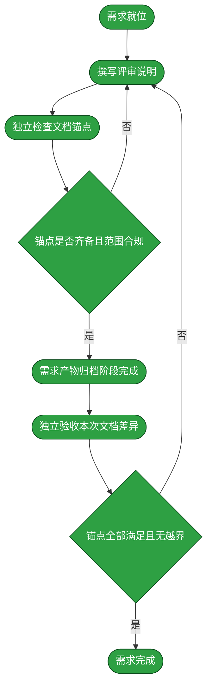

# 需求：新增 dsh-credentials 工程评审说明

```yaml
target: assets/projects/dsh-credentials/
output: assets/projects/dsh-credentials/review-guide.md
prompt:
  - projects/des-credentials中新增一篇dsh-credentials工程评审说明文档，以下是文档内容方向，本次任务只写文档。评审需要阅读工程代码，需要从多维度subagent独立评审，评审阶段仅能读取src下面的代码，不得读取其他文档，配置等信息。评审找出项目中的问题，生成评审报告，在项目仓库新增评审文件夹，文件夹中生成评审报告以review-timestamp为名，评审规则为：找出代码中的问题，问题即为事实。事实必会有test，如果没有test，则需要补充test。test会让问题变红（不通过）。然后修复问题。再跑test，需要变绿。最后需要破坏性破坏代码，再跑test，test需要转红，证明test和修复均有效。然后test落档。落档格式：{factId, note, category, testpath, evidence, solution}每个评审步骤需要独立一次性subagent进行，方式不同步骤上下文污染。
```

本需求在现有 `assets/projects/dsh-credentials/` 收录目录中新增一篇评审流程说明；该说明定义多维度、隔离上下文的代码评审及红—绿—破坏后红的测试证据链。本需求只新增知识库文档，不执行项目评审、不读取或修改项目源码、测试、配置或仓库内文档。用户确认将原提示中的 `des-credentials` 目录指向现有 `dsh-credentials` 项目目录。

## 需求澄清

### 澄清记录

- 问答：`assets/projects/des-credentials/` 当前不存在；你是要将文档新增到已有的 `assets/projects/dsh-credentials/` 吗？→ 是，使用 dsh-credentials。
  - 裁决：新增文档落在现有的 `assets/projects/dsh-credentials/` 项目目录。
  - 反论与代价：若原意是独立的 des-credentials 项目，则现有路径无法代表该项目；本裁决依据用户明确选择，代价是不能覆盖未知项目。
  - 验收面：新增说明文档的路径位于 `assets/projects/dsh-credentials/`。
  - 被消歧措辞：`projects/des-credentials`。

### 验收锚点

- A1：评审说明文档已新增于现有 dsh-credentials 项目目录，且清楚限定本任务只写文档、不执行评审。
- A2：说明书规定评审阶段只读仓库 `src/`，多维度评审及每个后续评审步骤均使用互不共享上下文的一次性 subagent。
- A3：说明书规定候选事实须有测试，修复前失败、修复后通过、破坏修复后失败、恢复后再次通过，并规定安全恢复约束。
- A4：说明书规定在项目仓库新增 `reviews/`，报告按 `review-<timestamp>.md` 命名，事实字段为 `{factId, note, category, testpath, evidence, solution}`。

### 范围边界

- 不做：读取 dsh-credentials 仓库内 `src/` 以外的对象、执行代码评审、创建评审报告或改动项目仓库。
- 不做：修改、创建或运行源码及测试。

## 主流程图



## START

确认目标路径、产出路径、验收锚点与范围边界均明确后开工。

**输入**

- 无。

**输出**

- `REQ_SPEC`：本需求规格；去向为 `DEVELOP`。

## DEVELOP

由独立 subagent 撰写说明文档，只新增 `assets/projects/dsh-credentials/review-guide.md`。撰写者不得读取项目仓库内容，也不得执行评审。说明文档须定义评审阶段的 `src/` 只读限制、独立视角、步骤隔离、测试闭环、报告命名与落档字段，并限定破坏性测试只在可恢复的本地临时改动中实施。

**输入**

- `REQ_SPEC`：本需求规格；来源为 `START`。
- `TEST_FAILURE`：独立检查发现的问题；来源为 `TEST`。
- `ACCEPT_FAILURE`：独立验收发现的偏差；来源为 `ACCEPT`。
- `DOC_VERDICT`：测试通过后回到撰写阶段的反馈；来源为 `GATE`。

**输出**

- `DOC_DIFF`：文档差异；去向为 `TEST` 与 `ACCEPT`。

## TEST

由独立一次性 subagent 检查 A1–A4 是否都能从文档中逐项核对，并检查说明文档未声称本次实际运行评审。该阶段不读取或修改 dsh-credentials 项目仓库对象，不改文档。

**输入**

- `DOC_DIFF`：文档差异；来源为 `DEVELOP`。

**输出**

- `TEST_RESULT`：锚点核对结果；去向为 `GATE`。
- `TEST_FAILURE`：缺失或越界项；去向为 `DEVELOP`。

## GATE

锚点逐项成立且范围符合要求时交归档阶段；否则把具体差异交回撰写阶段。

**输入**

- `TEST_RESULT`：锚点核对结果；来源为 `TEST`。
- `TEST_FAILURE`：失败项；来源为 `TEST`。

**输出**

- `DOC_VERDICT`：测试判定；去向为 `ARCHIVE` 或 `DEVELOP`。

## ARCHIVE

由未参与撰写与测试的独立一次性 subagent 将已完成文档作为本需求产物提交给验收阶段，不改写项目流程文档，也不生成实际评审报告。

**输入**

- `DOC_VERDICT`：锚点全部成立的判定；来源为 `GATE`。
- `DOC_DIFF`：文档差异；来源为 `DEVELOP`。

**输出**

- `ARCHIVED_DOC`：待验收文档；去向为 `ACCEPT`。

## ACCEPT

由未参与前序阶段的独立一次性 subagent 比较本需求锚点与完整差异，确认只新增评审说明文档、全部要求均落入文档且没有需求外改动。验收者不自行修正。

**输入**

- `ARCHIVED_DOC`：待验收文档；来源为 `ARCHIVE`。
- `DOC_DIFF`：本次文档差异；来源为 `DEVELOP`。
- `REQ_SPEC`：本需求规格与范围边界；来源为 `START`。

**输出**

- `ACCEPT_VERDICT`：验收判定；去向为 `ACCEPT_GATE`。
- `ACCEPT_FAILURE`：不符合项；去向为 `DEVELOP`。

## ACCEPT_GATE

确认四项验收锚点均满足且没有范围外改动时完成；否则按验收反馈返回撰写阶段。

**输入**

- `ACCEPT_VERDICT`：逐项验收结果；来源为 `ACCEPT`。
- `ACCEPT_FAILURE`：验收失败项；来源为 `ACCEPT`。

**输出**

- `DONE_RESULT`：通过的验收结果；去向为 `DONE`。

## DONE

本需求产物是评审说明文档，不是 dsh-credentials 的实际评审结论。完成验收后将本需求交需求方确认；只有收到明确归档同意后，才按收件箱归档规则移动本需求文档。

**输入**

- `DONE_RESULT`：通过的验收结果；来源为 `ACCEPT_GATE`。

**输出**

- `ARCHIVE_MOVE`：需求方同意后整篇移动本流程文档；去向为流程外部的归档操作。
