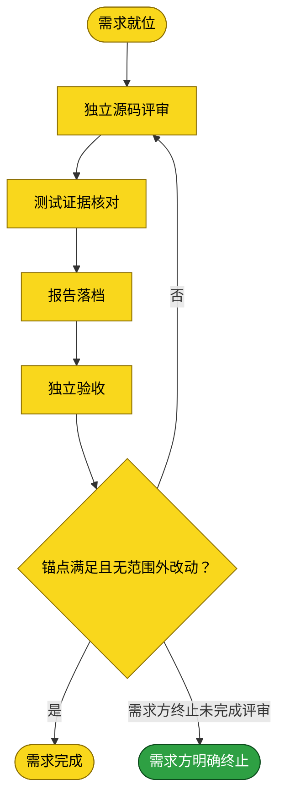

# 需求：评审 dsh-credentials src 并输出报告

```yaml
target: assets/projects/dsh-credentials/dsh-credentials/src/
output: assets/projects/dsh-credentials/dsh-credentials/reviews/review-20261010-143549.md
prompt:
  - 评审dsh-credentials的src实现，输出报告到项目仓库的reviews目录下
```

本需求从指定仓库 `src/` 的多维只读评审开始，以报告写入其 `reviews/` 并独立验收结束。任何未完成证据闭环的候选均须留在未验证面，不能写成确认事实。

## 需求澄清

### 澄清记录

- 无——本需求 prompt 的工程根目录、源码范围、报告落点可由知识库目录结构及源码评审指南取回；未有需需求方裁决的歧义。

### 验收锚点

- A1：六个源码维度均有完成/受阻状态，候选有明确去向；证据不足不得判 PASS。
- A2：报告包含可定位源码证据、触发条件、可观察错误、预期行为及候选测试断言。
- A3：报告位于要求的 reviews 目录，命名符合 review-<timestamp>.md。

### 范围边界

- 不做：修复产品源码、改测试、提交或推送；不把未验证候选混入闭环事实。

## 主流程图



## START

目标、范围、落点与验收锚点均明确后开始。输入：`REQ_SPEC`（本文件前置块），来源为本文件。输出：`REVIEW_BRIEF`（评审作业书），去向为 REVIEW。

## REVIEW

由独立一次性 subagent 按源码指南分别评审六个维度，只读 `src/`，不读测试或运行命令，不修改文件。输入：`REVIEW_BRIEF`，来源为 START。输出：`CANDIDATES`（候选及源码位置、触发条件、错误结果、预期与判别断言），去向为 TEST。

## TEST

由独立测试 subagent 查阅项目测试入口并核对候选覆盖。每项事实缺少直接用例时先补判别测试并在修复前运行；本次只授权评审与报告，不授权修改项目测试，无法补测的候选标未验证。输入：`CANDIDATES`，来源为 REVIEW。输出：`TEST_EVIDENCE`（命令、退出码、目标输出或具体阻塞），去向为 ARCHIVE。

## ARCHIVE

由独立报告阶段将评审与测试结果写入指定报告路径。仅完整证据闭环的事实可列为闭环事实；测试证据排除项、未验证项分别标明。输入：`CANDIDATES` 与 `TEST_EVIDENCE`，来源为 REVIEW、TEST。输出：`REPORT`，去向为 ACCEPT。

## ACCEPT

由未参与前述阶段的独立验收者核对全部需求锚点、报告落点、范围与报告结论。输入：`REPORT`，来源为 ARCHIVE。输出：`ACCEPT_VERDICT`，去向为 GATE。

## GATE

只有锚点均满足且无范围外改动才通过。输入：`ACCEPT_VERDICT`，来源为 ACCEPT。输出：满足时 `DONE`，去向为 DONE；否则退回 REVIEW。

## CANCELLED

需求方明确终止本评审流程并要求归档。报告的结论仍为 INCOMPLETE，终止不表示验收通过或候选已验证。

**输入**

- `CANCELLATION`：需求方明确终止决定；来源为需求方当前指示。

**输出**

- 无。

## DONE

需求验收完成。本节点输出：`ARCHIVED_REQUEST`，去向为需求方确认归档。
