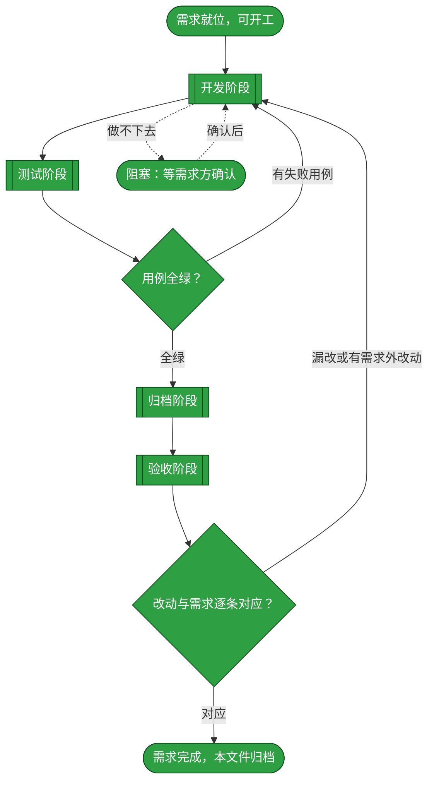
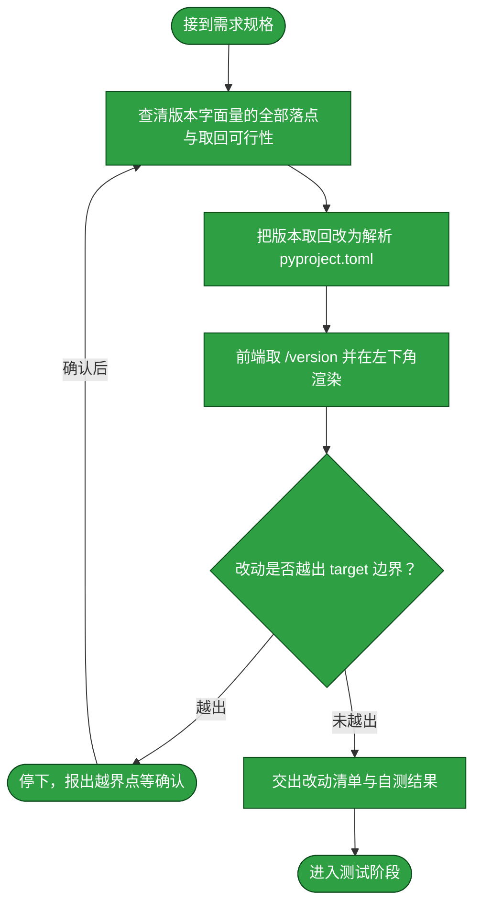
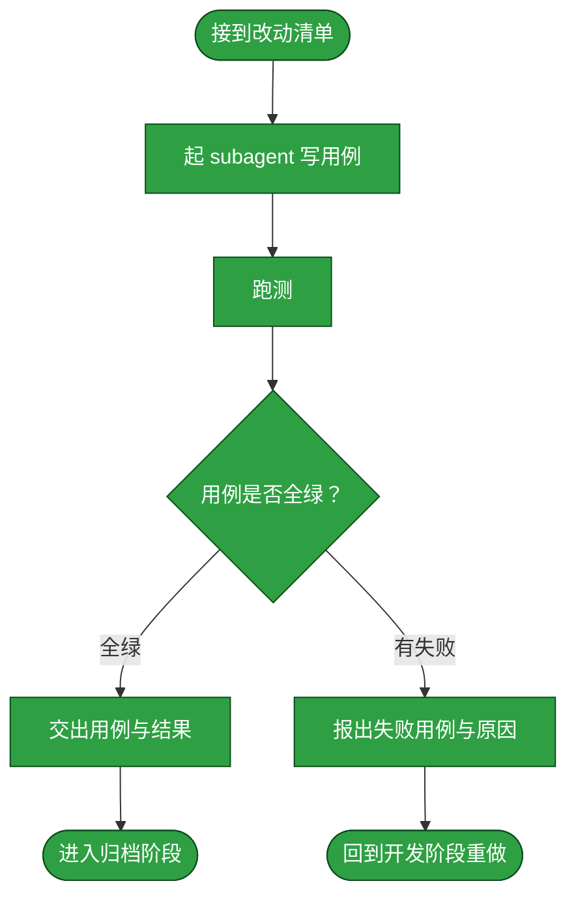
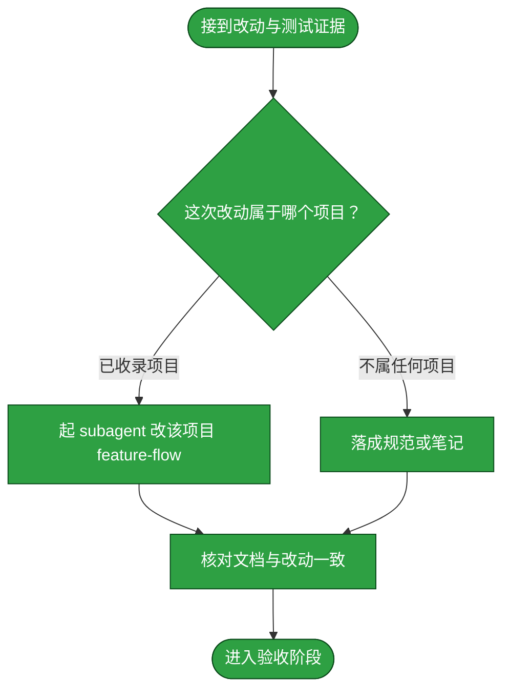
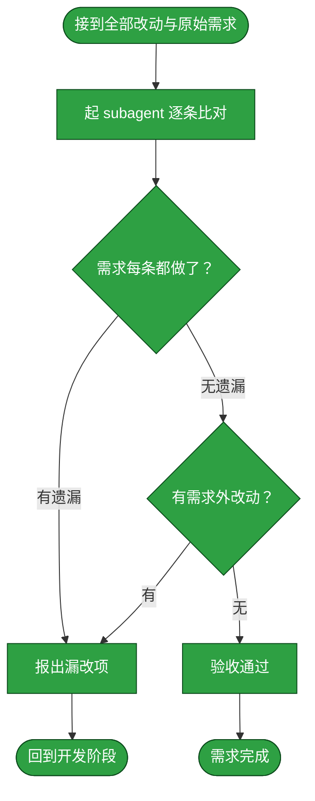

# 需求：给 hmp 建立版本号单一事实源，并在 WebUI 左下角显示当前版本

```yaml
target: assets/projects/home-media-pilot/home-media-pilot/pyproject.toml（version 字段）、assets/projects/home-media-pilot/home-media-pilot/src/apps/api/main.py（APP_VERSION 与 /version 路由）、assets/projects/home-media-pilot/home-media-pilot/src/apps/cli/main.py（APP_VERSION 引用）、assets/projects/home-media-pilot/home-media-pilot/src/frontend/src/main.tsx（左下角渲染）与同目录 style.css
output: 上述同一组文件（版本取回与展示的实现），并将既成事实落档到 assets/projects/home-media-pilot/feature-flow.md
prompt:
  - 新需求，需要给hmp增加版本号管理，在webui的左下角显示当前版本
  - 版本号的单一事实源放 pyproject.toml 的 version；先做「单一事实源 + 左下角展示」，不做 bump 工具链、不做构建期注入
```

本需求要解的是**版本号没有主人**这件事：`home-media-pilot` 的应用版本号当前在三处各写一遍且互不相干——`pyproject.toml` 的 `version`、`src/apps/api/main.py` 的 `APP_VERSION` 常量、`src/frontend/package.json` 的 `version`，三处都是手抄的 `0.1.0`；`GET /version` 路由已经存在，但前端从未调用它，页面上没有任何地方能看到当前版本。本需求从改一处开始（把版本号收敛到 `pyproject.toml` 这一个事实源，API 与 CLI 从它取回而非各留字面量），到在 WebUI 左下角显示当前版本结束（左下角指左侧侧边栏 `.sidebar-bottom` 区域）。bump 工具链、CHANGELOG、git tag、构建期注入均不在本次范围内。

## 主流程图



## 状态配色

本文档的取色值在本节定死，不取渲染器默认值——默认值随渲染器主题变化，那样颜色就不承载状态了。三档与 [本目录 README](README.md) 的对应关系一致：

| 档位 | 颜色 | 取值 | 含义 |
| --- | --- | --- | --- |
| 待执行 | 黄 | `fill:#f9d71c,stroke:#8a6d00,color:#000` | 尚未开始，或已开始但还没拿到结果 |
| 已执行 | 绿 | `fill:#2ea043,stroke:#0b4a1b,color:#fff` | 已完成，且结果经证据确认 |
| 阻塞 | 红 | `fill:#d73a49,stroke:#7d1220,color:#fff` | 卡住，需要外部协助才能继续 |

「经证据确认」的判定：该节点的产出能被一条**可复算的命令输出**支撑——开发节点的证据是工作区 diff 与 `uv run pytest -q`／`npm run build --prefix src/frontend` 的退出码 0，测试节点的证据是套件运行输出，归档节点的证据是落档后的文档与 diff 指向同一事实，验收节点的证据是逐条比对表。节点只有在其证据可当场复算时才标绿。

## START

开工前的就位判定：需求已在前置块里写清 `target` 与 `output`，且「版本字面量分散在三处」这一事实已在工作区取证（见下）。本节点不出分支。

**输入**

- `REQ_READY`：前置块三键已填、缺口已取证的状态；来源为本文件的前置数据块与下方实测记录。

**输出**

- `REQ_SPEC`：本需求的规格，即前置块的三键内容；去向为 `DEVELOP`。

### 已取证的缺口事实（随需求携带，勿推翻）

1. **三处手抄的 `0.1.0`**：`pyproject.toml` 的 `version`、`src/apps/api/main.py` 的 `APP_VERSION = "0.1.0"`、`src/frontend/package.json` 的 `"version": "0.1.0"`。三者之间没有取回关系，改一处不会带动另一处。
2. **`/version` 路由已存在但无人调用**：`src/apps/api/main.py` 的 `GET /version` 返回 `{"name": APP_NAME, "version": APP_VERSION}`；`src/frontend/src/main.tsx` 的 `refresh()` 用 `Promise.allSettled` 并发拉起的那批接口里不含 `/version`（接口清单见该函数的 `requestJson` 调用），页面上没有版本显示。
3. **`APP_VERSION` 有两个消费者**：`src/apps/api/main.py` 的 FastAPI 标题与 `/version` 路由，`src/apps/cli/main.py` 的 `system doctor`（输出 `service version: status`）。改取回方式须同时满足二者。
4. **镜像内 `pyproject.toml` 可达**：`docker/api.Dockerfile` 的 python 阶段 `COPY pyproject.toml uv.lock README.md ./`，工作目录 `/app`，故运行时读得到该文件；`src/` 位于 `/app/src`，与源码树中 `src/` 相对 `pyproject.toml` 的位置关系一致。
5. **基线是绿的**：`UV_CACHE_DIR=.uv-cache uv run pytest -q` 为 418 passed、退出码 0（宿主机默认 uv 缓存目录只读，须用仓库内缓存目录）。

## DEVELOP

开发阶段。本阶段的产出是**功能改动本身**——不产出测试，也不落档。它按下面的子流程走。

**起独立 subagent**：本阶段由一个新起的 subagent 执行，不承接对话里的上下文。交给它的输入只有 `target`、`output`、`prompt` 与本节写明的边界；它在自己的上下文里读代码、改代码、把改动落到工作区，中间过程留在它那里。

**边界**：它只改 `target` 指到的内容。以下动作均属越界，须停下报出而非自行处置：改 `docker/api.Dockerfile`（含为其 COPY 补 `pyproject.toml`）、改 `.github/workflows/`、改 `src/frontend/package.json` 的 `version` 值、新增 bump 脚本或 CHANGELOG、改 `src/frontend/dist/`（该目录 git-ignored，由镜像构建产出）。

**方向约束（不得偏离本质）**：

1. **事实源唯一**：`pyproject.toml` 的 `project.version` 是应用版本号的唯一事实源。`src/apps/api/main.py` 里不得再留 `APP_VERSION = "x.y.z"` 形式的字面量，`src/apps/cli/main.py` 继续从 `apps.api.main` 取回，不得另立常量。
2. **运行时解析 `pyproject.toml`，不取 `importlib.metadata`**：理由是一条可验证的失败模式——`importlib.metadata.version()` 读的是**安装时快照**（`.venv/.../home_media_pilot-0.1.0.dist-info`），改了 `pyproject.toml` 而未重装的环境会静默读到旧版本；一个「版本管理」需求自身显示错版本，是最坏的一种失败，且它不被任何断言发现。解析用标准库 `tomllib`（仓库 `requires-python >=3.12`），定位 `pyproject.toml` 用**向上遍历祖先目录**的既有形态（与 `tests/_harness/paths.py` 的 `repository_root()` 同形），不写死层级数——写死层级数会在目录结构调整时静默指错文件。
3. **取不到版本时的行为须明确**：遍历不到 `pyproject.toml` 时，`/version` 返回 `"unknown"` 而不是抛 500。版本是展示用途、不是安全边界，事实源缺失不该让整站不可用；该行为由测试钉住。
4. **前端不引入构建期注入**：左下角的版本在运行时向 `GET /version` 取回，复用既有 `requestJson` 与 `apiBase`（含 `VITE_API_BASE_URL` 分流部署），不新增环境变量、不改 `vite.config.ts`、不在 `package.json` 里复制版本号。取回失败时该处不渲染版本号，不弹错误提示——一次展示性请求的失败不该打扰用户。
5. **前端 `package.json` 的 `version` 不动**：它从此只是 npm 私有包的字段、不再被当作应用版本引用，改它的值会牵动 `npm ci` 与 lockfile，超出本需求范围。

**输入**

- `REQ_SPEC`：本需求的规格；来源为 `START`。
- `FAILURE_REPORT`：失败用例与原因；来源为 `T_BACK`。
- `ACCEPT_FAILURE`：漏改或多余的处置要求；来源为 `C_OUT`。
- `RESOLVED`：已确认的条件；来源为 `BLOCKED`。
- `TEST_VERDICT`：全绿与否；来源为 `TEST_GATE`。
- `ACCEPT_VERDICT`：逐条对应与否；来源为 `ACCEPT_GATE`。

**输出**

- `DEV_RESULT`：改动清单与自测结果；去向为 `TEST`、`ARCHIVE`、`ACCEPT`。
- `OPEN_QUESTION`：悬置的条件；去向为 `BLOCKED`。



### D_IN

承接 `START` 交来的需求规格，把它整理成交给 subagent 的作业书。本节点不出分支。

**输入**

- `REQ_SPEC`：本需求的规格；来源为 `START`。

**输出**

- `DEV_BRIEF`：作业书，含 `target`、`output`、`prompt` 与本节边界；去向为 `D_PROBE`。

### D_PROBE

先查清事实再动手：枚举仓库内所有承载应用版本号的字面量落点，确认 `pyproject.toml` 在源码树与镜像内两个位置都可达，确认 `tomllib` 可用。这一步是诊断，不改代码。

**输入**

- `DEV_BRIEF`：作业书；来源为 `D_IN`。
- `SCOPE_RESOLVED`：已确认的边界；来源为 `D_STOP`。

**输出**

- `VERSION_SITES`：应用版本号的全部落点清单；去向为 `D_SOURCE`。

### D_SOURCE

按最小范围改造取回链路：`pyproject.toml` 的 `project.version` 成为唯一事实源，`apps.api.main` 暴露由它解析出的版本，`apps.cli.main` 沿用该取回结果，原 `APP_VERSION` 字面量消失。

**输入**

- `VERSION_SITES`：版本号落点清单；来源为 `D_PROBE`。

**输出**

- `SOURCE_DIFF`：取回链路的改动；去向为 `D_UI`。

### D_UI

在左侧侧边栏底部（`.sidebar-bottom` 区域）渲染当前版本，数据取自 `GET /version`，样式落在 `src/frontend/src/style.css`。本节点不出分支。

**输入**

- `SOURCE_DIFF`：取回链路的改动；来源为 `D_SOURCE`。

**输出**

- `UI_DIFF`：前端改动；去向为 `D_SCOPE`。

### D_SCOPE

判定改动是否越出 `target` 边界。判定语义是：`SOURCE_DIFF` 与 `UI_DIFF` 触及的每个文件，是否都落在 `target` 所指的范围内。越界不一定是错的，但**必须报出来由需求方确认**，因为它意味着这条需求的实际影响面比它写下的 `target` 更大。

**输入**

- `UI_DIFF`：前端改动；来源为 `D_UI`。

**输出**

- `SCOPE_VERDICT`：越界与否及其具体落点；去向为 `D_STOP` 或 `D_REPORT`。

### D_STOP

越界出口：停下并把越界点报给需求方，等其确认是扩大 `target` 还是收回改动。

**输入**

- `SCOPE_VERDICT`：越界点；来源为 `D_SCOPE`。
- `SCOPE_REPLY`：需求方对越界的处置；来源为流程外部的确认动作。

**输出**

- `SCOPE_RESOLVED`：已确认的边界；去向为 `D_PROBE`。

### D_REPORT

交出改动清单与开发自测结果，作为进入测试阶段的输入。**开发自测不等于测试阶段**：这里只证明改动跑得起来（后端 `uv run pytest -q`、前端 `npm run build --prefix src/frontend` 退出码 0），覆盖需求要求的行为由测试阶段负责。

**输入**

- `UI_DIFF`：前端改动；来源为 `D_UI`。
- `SCOPE_VERDICT`：未越界的判定；来源为 `D_SCOPE`。

**输出**

- `DEV_RESULT`：改动清单与自测结果；去向为 `D_OUT`。

### D_OUT

开发阶段出口：改动已在工作区就位且未越界。本节点无出边。

**输入**

- `DEV_RESULT`：改动清单与自测结果；来源为 `D_REPORT`。

**输出**

- `DEV_RESULT`：改动清单与自测结果；去向为 `TEST`。

## TEST

测试阶段。本阶段的产出是**测试用例与它们的运行结果**。它按下面的子流程走。

**起独立 subagent**：本阶段由一个新起的 subagent 执行。**为什么独立**：写用例的人应当是找出改动缺陷的人，独立于开发者才不会沿用开发者的思路去验证开发者自己的假设。它拿到的是改动清单与本需求的行为要求，不接触开发阶段的中间推理。

**边界**：它只写覆盖本需求要求的行为的用例，不借机扩充项目的测试套件覆盖面；用例失败时它**不改产品代码**，只报出失败。

**测试失败回到开发阶段**：失败不就地绕过，而是回到 `DEVELOP` 重做、测试重跑。已写入的用例保留——它们是这次失败的证据，也是下一轮开发的验收面。

**跑法与判据**：取回自仓库克隆内的 `tests/README.md`。命令 `UV_CACHE_DIR=.uv-cache uv run pytest -q`（宿主机默认 uv 缓存目录只读，须用仓库内缓存目录），判据为全绿且退出码 0。新增用例按该 README 的镜像规则落位：`src/apps/api` 的行为断言进 `tests/src/apps/api/`，前端契约断言进 `tests/src/frontend/test_webui_contract.py`，构建与配置断言进 `tests/config/build/`。

**输入**

- `DEV_RESULT`：改动清单与自测结果；来源为 `DEVELOP`。

**输出**

- `TEST_EVIDENCE`：用例与运行结果；去向为 `ARCHIVE`。
- `FAILURE_REPORT`：失败用例与原因；去向为 `DEVELOP`。



### T_IN

承接开发阶段交来的改动清单，整理成测试作业书。本节点不出分支。

**输入**

- `DEV_RESULT`：改动清单与自测结果；来源为 `DEVELOP`。

**输出**

- `TEST_BRIEF`：测试作业书，含改动清单与本需求的行为要求；去向为 `T_AGENT`。

### T_AGENT

起一个独立 subagent，按 `TEST_BRIEF` 写覆盖本需求行为要求的用例。**为什么独立**：见本章开头。它不接触开发阶段的中间推理，故它对改动是否真的满足需求给出的是独立判断。

必须覆盖的行为面（用例由它自行设计，此处只列行为）：

1. `GET /version` 返回的 `version` 等于 `pyproject.toml` 的 `project.version`——**断言是两者相等，而不是等于某个字面量**；字面量断言会让下一次 bump 静默失效。
2. `src/apps/api/main.py` 内不存在应用版本号的字面量常量。
3. 定位不到 `pyproject.toml` 时 `/version` 返回 `"unknown"` 且其余路由不受影响。
4. CLI `system doctor` 输出的版本与 `/version` 同源。
5. 前端源码调用 `/version` 并在侧边栏底部渲染取回的版本。
6. 前端源码不内联版本号字面量。

**输入**

- `TEST_BRIEF`：测试作业书；来源为 `T_IN`。

**输出**

- `TEST_CASES`：本次写下的用例；去向为 `T_RUN`。

### T_RUN

运行用例。跑法与判据取回自被测项目自己的 `tests/README.md`，本流程不另立判据；判据是全绿且退出码为 0。

**输入**

- `TEST_CASES`：本次写下的用例；来源为 `T_AGENT`。

**输出**

- `RUN_RESULT`：运行输出与退出码；去向为 `T_VERDICT`。

### T_VERDICT

判定是否全绿。判定语义是：该项目的全部用例都通过，且运行未被绕过——不靠删用例、放宽断言、跳过用例换取绿灯。

**输入**

- `RUN_RESULT`：运行输出与退出码；来源为 `T_RUN`。

**输出**

- `TEST_VERDICT`：全绿与否；去向为 `T_PASS` 或 `T_FAIL`。

### T_PASS

全绿出口：交出本次用例与运行结果，作为归档阶段的事实依据。本节点不出分支。

**输入**

- `TEST_VERDICT`：全绿判定；来源为 `T_VERDICT`。
- `TEST_CASES`：本次写下的用例；来源为 `T_AGENT`。

**输出**

- `TEST_EVIDENCE`：用例与运行结果；去向为 `T_OUT`。

### T_FAIL

失败出口：报出失败用例、失败原因与本次改动。**不在这里改产品代码**——改代码职责单一地落在开发阶段；测试阶段只判不改，否则判据与被判对象同出一处，绿灯失去意义。

**输入**

- `TEST_VERDICT`：失败判定；来源为 `T_VERDICT`。
- `RUN_RESULT`：运行输出；来源为 `T_RUN`。

**输出**

- `FAILURE_REPORT`：失败用例与原因；去向为 `T_BACK`。

### T_BACK

回到开发阶段的出口：带回失败报告。本节点无出边。

**输入**

- `FAILURE_REPORT`：失败用例与原因；来源为 `T_FAIL`。

**输出**

- `FAILURE_REPORT`：失败用例与原因；去向为 `DEVELOP`。

### T_OUT

测试阶段出口：用例全绿，交出用例与结果。本节点无出边。

**输入**

- `TEST_EVIDENCE`：用例与运行结果；来源为 `T_PASS`。

**输出**

- `TEST_EVIDENCE`：用例与运行结果；去向为 `ARCHIVE`。

## TEST_GATE

测试阶段的判定点：本次用例是否全绿。判定语义是全部用例通过且运行未被绕过——不靠删用例、放宽断言、跳过用例换取绿灯；任一条不成立即判失败。失败走回 `DEVELOP`，全绿则进入 `ARCHIVE`。

**输入**

- `RUN_RESULT`：用例运行输出与退出码；来源为 `TEST`。

**输出**

- `TEST_VERDICT`：全绿与否；去向为 `DEVELOP` 或 `ARCHIVE`。

## ARCHIVE

归档阶段。本阶段的产出是**落档后的文档**——把这次改动造成的既成事实写进它该在的地方。它按下面的子流程走。

**起独立 subagent**：本阶段由一个新起的 subagent 执行。**为什么独立**：落档要对着一份长文档做局部改写并保持它通篇自洽，这需要通读全文，而通读的上下文不该占用本流程的其余阶段。它拿到的是改动清单与测试证据。

**边界**：它只写**已经验证过的**事实——测试没覆盖到的环节写进文档的「未验证面」，不写成已验证；不把开发过程中的取舍与来历写进流程文档，那些不归流程文档承载。本需求的落档处是已收录项目 `home-media-pilot`，故走 `A_AGENT` 分支改 `assets/projects/home-media-pilot/feature-flow.md`。

**输入**

- `DEV_RESULT`：改动清单；来源为 `DEVELOP`。
- `TEST_EVIDENCE`：用例与运行结果；来源为 `TEST`。
- `TEST_VERDICT`：全绿与否；来源为 `TEST_GATE`。

**输出**

- `ARCHIVED`：已落档且自洽的文档；去向为 `ACCEPT`。



### A_IN

承接开发与测试两个阶段的产出，整理成落档作业书。本节点不出分支。

**输入**

- `DEV_RESULT`：改动清单；来源为 `DEVELOP`。
- `TEST_EVIDENCE`：用例与运行结果；来源为 `T_PASS`。

**输出**

- `ARCHIVE_BRIEF`：落档作业书，含改动与已验证面；去向为 `A_LOCATE`。

### A_LOCATE

判定这次改动的落档去向。判定语义是：`target` 是否落在某个被收录项目的仓库克隆内——是则该项目的 `feature-flow.md` 是它的落档处；否（改动落在本知识库自身的规范、判据册或某目录的约定上）则按 `_meta/`、随 skill 分发的判据册、各目录 README 的归属落档。

**输入**

- `ARCHIVE_BRIEF`：落档作业书；来源为 `A_IN`。

**输出**

- `ARCHIVE_TARGET`：落档处；去向为 `A_AGENT` 或 `A_ELSE`。

### A_AGENT

起一个独立 subagent，把这次改动的既成事实写进该项目的流程文档。落档内容是事实本身——版本号的唯一事实源是 `pyproject.toml`、取回链路的走向、WebUI 左下角显示版本的流程节点——不写本次改动的过程与取舍。

**输入**

- `ARCHIVE_BRIEF`：落档作业书；来源为 `A_IN`。
- `ARCHIVE_TARGET`：落档处；来源为 `A_LOCATE`。

**输出**

- `DOC_DIFF`：文档改动；去向为 `A_CHECK`。

### A_ELSE

落档到项目流程文档之外的情形：把改动落成规范条目、判据或某目录 README 的约定，处置按该处的归属规则。本节点不出分支。

**输入**

- `ARCHIVE_TARGET`：落档处；来源为 `A_LOCATE`。

**输出**

- `DOC_DIFF`：文档改动；去向为 `A_CHECK`。

### A_CHECK

核对落档结果与改动一致：文档描述的流程与工作区里的改动指向同一事实。本节点不出分支。

**输入**

- `DOC_DIFF`：文档改动；来源为 `A_AGENT` 或 `A_ELSE`。

**输出**

- `ARCHIVED`：已落档且自洽的文档；去向为 `A_OUT`。

### A_OUT

归档阶段出口。本节点无出边。

**输入**

- `ARCHIVED`：已落档的文档；来源为 `A_CHECK`。

**输出**

- `ARCHIVED`：已落档的文档；去向为 `ACCEPT`。

## ACCEPT

验收阶段。本阶段判定**改的是不是需求要求的**：把本次全部改动与前置块的 `prompt` 逐条比对。

**起独立 subagent**：本阶段由一个新起的 subagent 执行。**为什么独立**：验收必须由一个没有参与前三个阶段的主体来做——它若参与过，就会用自己当初的思路去核对，看不到自己的偏差。它拿到的是全部 diff（代码与文档）与 `prompt`，不接触前三阶段的中间推理。

**判定语义**：判定分两问，**两问都成立**才算通过——其一，需求要求的每一处改动都做了（不少改）；其二，改动里没有需求未要求的东西（不多改）。少改则需求未达成；多改是范围蔓延，须回到开发阶段收回，或由需求方确认扩大需求。

**逐条比对的条目**（取自 `prompt` 最后一条）：版本号有单一事实源且在 `pyproject.toml`；WebUI 左下角显示当前版本；不含 bump 工具链、CHANGELOG、git tag；不含构建期注入。

**边界**：它只判「对不对应」，不判「改得好不好」——代码质量、风格、测试强度属开发与测试阶段，不在这里重开。

**输入**

- `ARCHIVED`：已落档的文档；来源为 `ARCHIVE`。
- `DEV_RESULT`：改动清单；来源为 `DEVELOP`。

**输出**

- `ACCEPT_FAILURE`：漏改或多余的处置要求；去向为 `DEVELOP`。



### C_IN

承接归档阶段的文档与开发阶段的代码改动，合为本次全部改动。本节点不出分支。

**输入**

- `ARCHIVED`：已落档的文档；来源为 `ARCHIVE`。
- `DEV_RESULT`：改动清单；来源为 `DEVELOP`。

**输出**

- `FULL_DIFF`：本次全部改动；去向为 `C_AGENT`。

### C_AGENT

起一个独立 subagent，把 `FULL_DIFF` 与 `prompt` 逐条比对。

**输入**

- `FULL_DIFF`：本次全部改动；来源为 `C_IN`。
- `PROMPT_RECORD`：前置块的 `prompt` 留档；来源为本文件的前置数据块。

**输出**

- `COMPARISON`：逐条对应关系与差异；去向为 `C_COVER`。

### C_COVER

判定需求要求的每一处改动是否都做了。判定语义是：`prompt` 的**最后一条**（当前有效的需求陈述）里的每项要求，都能在 `FULL_DIFF` 里找到对应的改动。

**输入**

- `COMPARISON`：逐条对应关系；来源为 `C_AGENT`。

**输出**

- `COVERAGE`：覆盖与否及漏改项；去向为 `C_BACK` 或 `C_EXTRA`。

### C_EXTRA

判定改动里是否有需求未要求的东西。判定语义是：`FULL_DIFF` 里的每处改动，都能追溯到 `prompt` 里的某项要求；追不到的是范围蔓延。

**输入**

- `COVERAGE`：无遗漏的判定；来源为 `C_COVER`。

**输出**

- `EXTRA`：需求外改动；去向为 `C_BACK` 或 `C_PASS`。

### C_BACK

不通过出口：报出漏改项或需求外改动。**两种不通过都回开发阶段**——验收阶段只判不改，自行修正是它越权，且会让「谁改的」与「谁验的」重新合一。

**输入**

- `COVERAGE`：漏改项；来源为 `C_COVER`。
- `EXTRA`：需求外改动；来源为 `C_EXTRA`。

**输出**

- `ACCEPT_FAILURE`：漏改或多余的处置要求；去向为 `C_OUT`。

### C_OUT

回到开发阶段的出口。本节点无出边。

**输入**

- `ACCEPT_FAILURE`：处置要求；来源为 `C_BACK`。

**输出**

- `ACCEPT_FAILURE`：处置要求；去向为 `DEVELOP`。

### C_PASS

通过出口：需求要求的都做了、且没有需求外的改动。本节点无出边。

**输入**

- `EXTRA`：无需求外改动的判定；来源为 `C_EXTRA`。

**输出**

- `ACCEPTED`：验收通过；去向为 `C_DONE`。

### C_DONE

需求完成的收尾：本条需求达成。按 [本目录 README](README.md) 的边界声明，需求完成后本目录不留存档，故**本文件整篇移入 [assets/archive/](../archive/README.md)**——是移动不是复制；归档前把全部节点状态标为已执行，文件内容不再改写。本节点无出边。

**输入**

- `ACCEPTED`：验收通过；来源为 `C_PASS`。

**输出**

- 无。

## ACCEPT_GATE

验收阶段的判定点：改动与需求是否逐条对应。判定语义分两问，两问都成立才通过——需求要求的每处改动都做了，且改动里没有需求未要求的东西。任一问不成立即回到 `DEVELOP`。

**输入**

- `COMPARISON`：逐条对应关系与差异；来源为 `ACCEPT`。

**输出**

- `ACCEPT_VERDICT`：逐条对应与否；去向为 `DEVELOP` 或 `DONE`。

## DONE

需求完成的终点标记：四个阶段都走完且验收通过，本文件移入 `assets/archive/`。本节点无出边。

**输入**

- `ACCEPTED`：验收通过；来源为 `C_PASS`。
- `ACCEPT_VERDICT`：逐条对应与否；来源为 `ACCEPT_GATE`。

**输出**

- `ARCHIVE_MOVE`：把本文件移入 `assets/archive/` 的动作；去向为流程外部的归档动作。

## BLOCKED

阻塞出口：流程中遇到做不下去的条件时停在这里等协助。**停在这里是本流程的正常出口，不是失败**——一项判据未定的需求，强行推进只会产出一个自己都判不了的实现。

**输入**

- `OPEN_QUESTION`：悬置的条件；来源为 `DEVELOP`。

**输出**

- `RESOLVED`：已确认的条件；去向为 `DEVELOP`。
