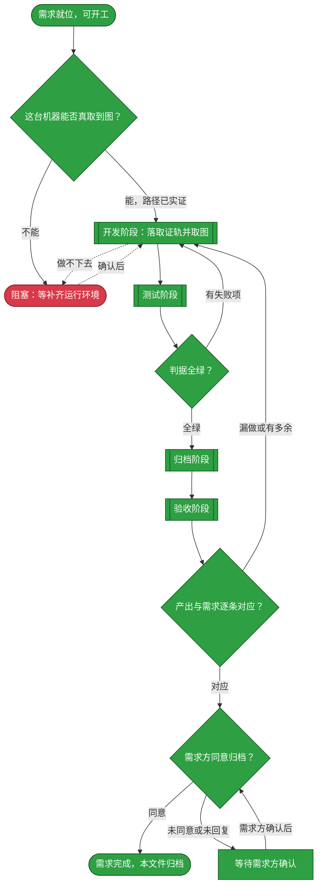
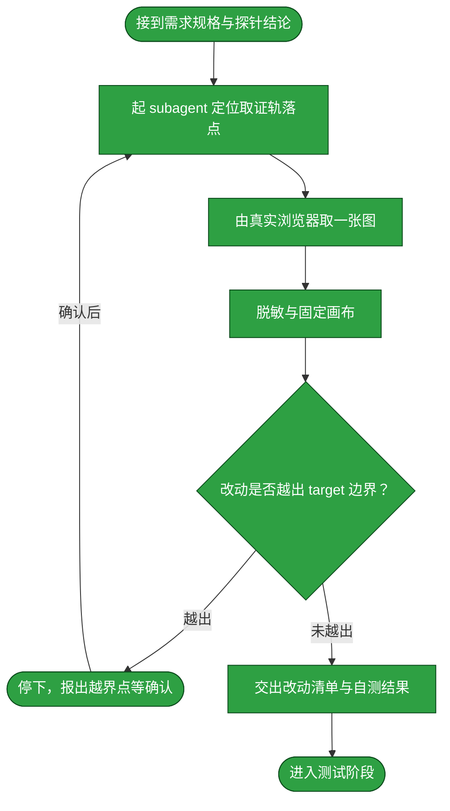
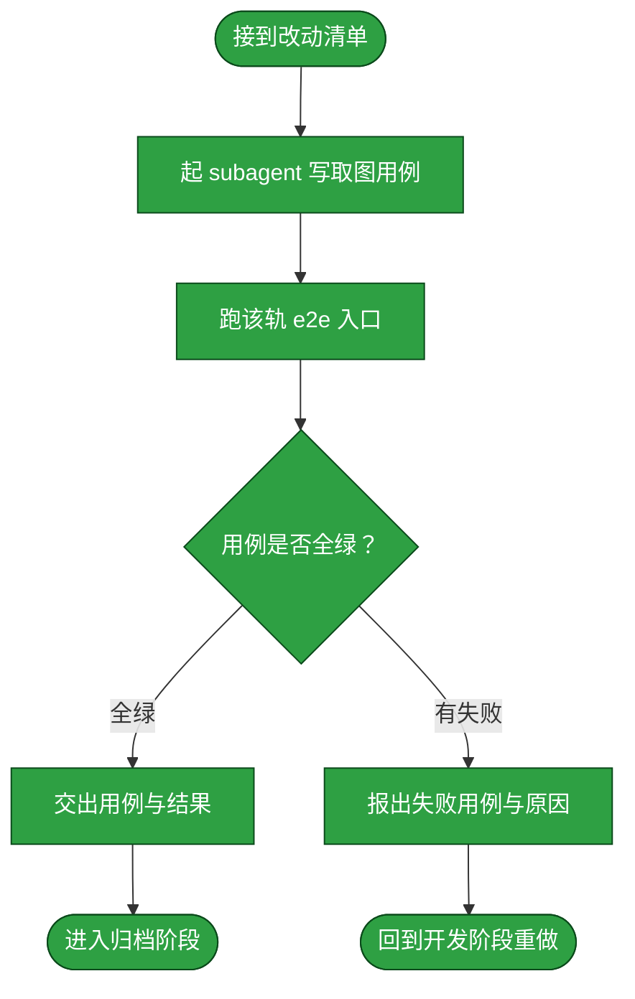
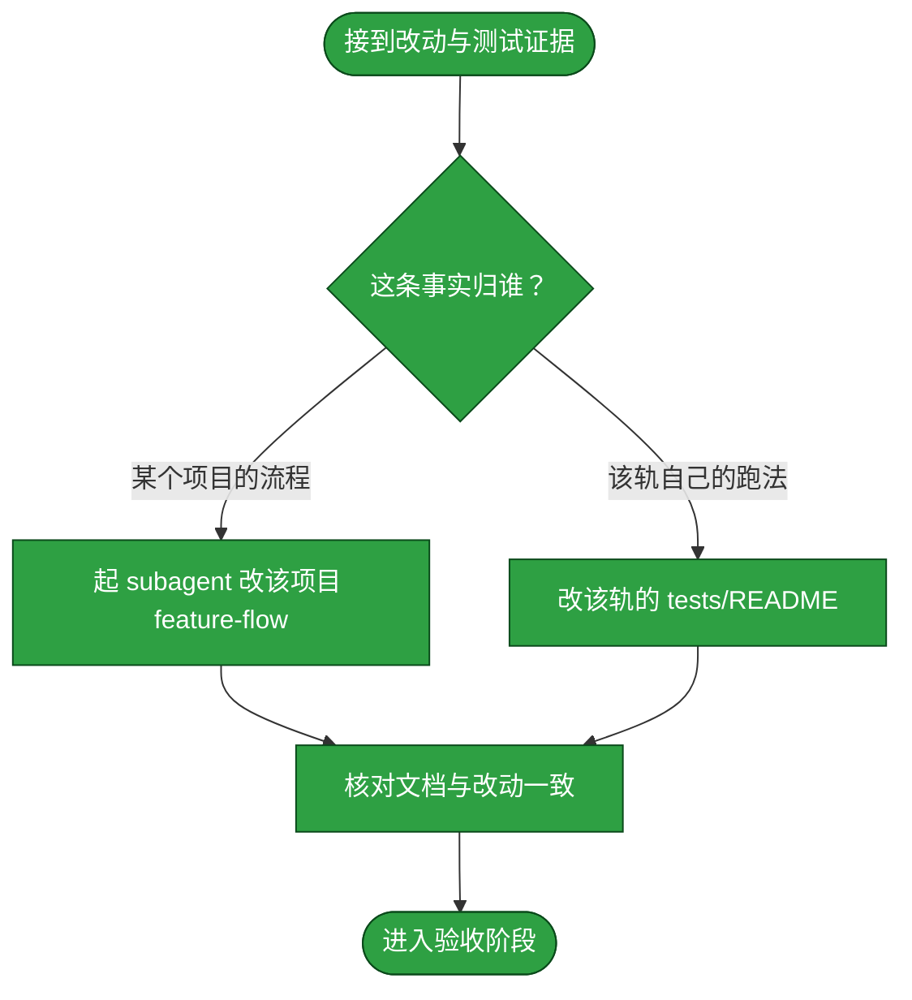
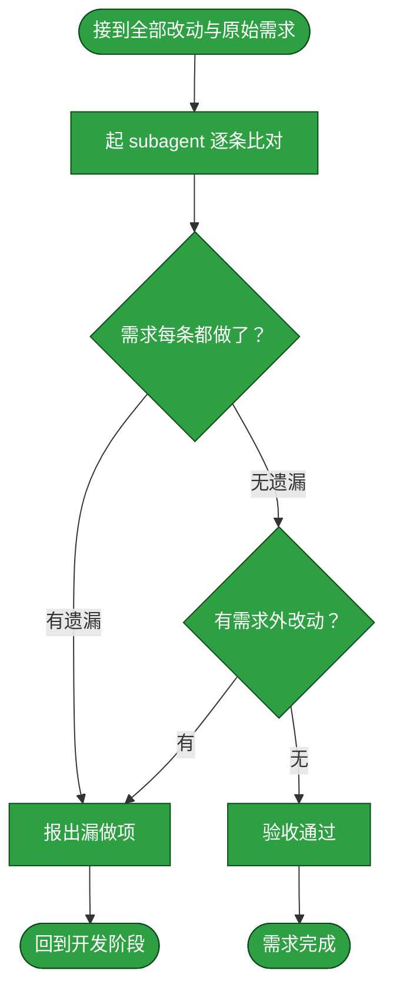

# 需求：用真实浏览器取回前端产物的最终效果图，并把这条取证路径落成可复算的手续

```yaml
target: assets/projects/home-media-pilot/home-media-pilot/tests/（新增真实浏览器取图与版本正确性取证轨）；assets/projects/home-media-pilot/feature-flow.md 的验证面
output: 一张脱敏 hmp WebUI 最终效果图（左下角版本号）；hmp 测试树内可复算的截图取证轨与其 tests/README.md 说明；home-media-pilot/feature-flow.md 的验证面／未验证面相应改写

prompt:
  - 新增request完成交付产物。如果有前端产物：webui，dsh设置界面等，需要产出一张类似截图的最终效果图（判断是否可以做到），可以的话，先补充一下hmp版本号的需求
  - 因为指定了左下角显示版本号，所以应该要截图表现一下显示正确。
  - 继续；按前述第一方案继续执行可行的 hmp WebUI 取证，取消已移出本知识库的 DSH 插件管理面板产物。
  - 不提交 tests/.artifacts/ 目录；在知识库 tests-flow 模板中新增前端测试类。
```

本需求因原先拟取的 dsh-plugin-manager 面板已随项目移出本知识库而重新定向，只验证仍在承载范围内的 `home-media-pilot` WebUI。它从确认「这台机器上能不能取到真实渲染图」开始，到把取图与版本正确性验证变成**可复算的手续**、并把 hmp 流程文档的验证面改写为与事实相符为止。静态源码断言只能证明调用与结构，不能证明页面实际绘制出的版本值。

**范围**：只做**取图与落档**，不新增前端功能、不改任何产品代码。`prompt` 里那句「先补充一下 hmp 版本号的需求」指的是版本号展示现已实现（`pyproject.toml` 的 `project.version` 为单一事实源，WebUI 侧栏底部渲染），故本需求只在 hmp 侧取图并验证版本正确性，不再包含已移出本知识库的 DSH 插件面板。

**版本号这张图必须证明「显示正确」，而不只是「显示了」**。这两件事的差别是本需求第二处要解的东西，也是它比第一处更容易落空的地方——一张左下角带版本的图，看上去已经回答了问题，实则可能只证明了「那里有字」。判据落在**三个数相等**：图上读出的版本、`GET /version` 返回的 `version`、以及 `pyproject.toml` 的 `project.version`。三者相等才算「显示正确」。理由是可验证的：版本取回失败时按设计退为占位值且不打扰用户，此时图上仍会出现一个字串——**图能出、字能读，而版本是错的**。只断言「左下角有版本字样」的用例在这个失效模式下是绿的，这与本需求要拿的证据正好相反。

**已核到的取证缺口**：hmp 现行的三条相关断言全是**源码文本**断言——`test_webui_renders_the_fetched_version_in_the_sidebar_foot` 判的是 `main.tsx` 里 `.sidebar-bottom` 切片内出现过 `appVersion` 这个**标识符**，`test_webui_carries_no_version_literal` 判的是源码内没有版本字面量，`test_version_fetch_is_outside_the_refresh_bundle` 判的是调用位置。三者都答不了「页面上真的画出这个版本了吗、画出的值对不对」。故本需求的图不是给这些断言补一张配图，而是补上**它们结构上取不到的那层证据**。

## 主流程图



## START

开工前的就位判定：前置块三键已填、目标与产出都指到具体路径。本节点不出分支。

**输入**

- `REQ_READY`：前置块三键已填、目标与产出都已指明的状态；来源为本文件的前置数据块。

**输出**

- `REQ_SPEC`：本需求的规格；去向为 `PROBE`。

## PROBE

**这条需求能不能做，不由推演决定**——它取决于这台机器上有没有真浏览器、能不能连上在跑的 GUI、以及中文会不会画成缺字方块。本节点在动任何工程文件之前先把这三问答完，答不出来就走 `BLOCKED`，而不是硬写一条跑不通的取证轨。本节点已完成，结论如下。

**已实证的事实**（探针只往被忽略的 scratch 目录写图，不改任何工程文件）：

1. **浏览器可用**。`~/.cache/ms-playwright/chromium-1243/chrome-linux64/chrome` 报告为 `Google Chrome for Testing 153.0.8010.12`；Playwright 包在 `../workbench/node_modules/playwright` 可被 `require`（DSH 部署自身不携带它）。取回命令：`ls ~/.cache/ms-playwright/chromium-*/chrome-linux64/chrome` 与 `ls ../workbench/node_modules/playwright`。
2. **能出图，故「可以做到」的答案是能**。以 1440×900 视口打开在跑的 GUI，点侧栏 `[class*=trigger]` 中的 Settings 触发器后截图，产出 **1440×900 的真 PNG**：其 `IHDR` 尺寸与 IDAT 解压后的扫描线逐行对齐，且解出的像素矩阵非空。
3. **中文有办法画对，但当前默认是错的**。宿主机 `fc-match "sans-serif:lang=zh"` 回落到 `/usr/share/fonts/truetype/dejavu/DejaVuSans.ttf`，而**该字体不含 CID 汉字覆盖**（其 `lang` 列表无 `zh`）；宿主机另有 `/usr/share/fonts/truetype/droid/DroidSansFallbackFull.ttf` 覆盖中文，能否被 fontconfig 取到须在开发阶段现验。

**尚未实证、须在开发阶段钉住的两条**——本节点不替开发阶段作答：

- **浏览器字体与画布仍需按运行环境取证**。本次 hmp 取证以页面确实绘制出版本为准，不把宿主字体目录是否可读当作版本正确性的证据。
- **hmp API 的可达地址**。取证脚本在本地分配端口并启动 API，页面与 `/version` 使用同一 origin；不依赖已运行的共享 GUI，也不触碰 live profile。

**输入**

- `REQ_SPEC`：本需求的规格；来源为 `START`。

**输出**

- `FEASIBLE`：可做到与否及其证据；去向为 `DEVELOP`。
- `OPEN_QUESTION`：悬置的条件；去向为 `BLOCKED`。

## BLOCKED

阻塞出口：探针答不出「有没有浏览器／能不能连上 GUI／中文能不能画对」时停在这里。**停在这里是本流程的正常出口**——一套取不到真实渲染的「效果图」只会退化成手画示意图，那与需求要的证据正好相反。

**输入**

- `OPEN_QUESTION`：悬置的条件；来源为 `PROBE` 或 `DEVELOP`。

**输出**

- `RESOLVED`：已确认的条件；去向为 `DEVELOP`。
## DEVELOP

开发阶段。本阶段的产出是**取证轨本身与它取回的一张图**——不产出测试，也不落档。它按下面的子流程走。

**起独立 subagent**：本阶段由一个新起的 subagent 执行，不承接对话里的上下文。交给它的输入只有 `target`、`output`、`prompt` 与本节点写明的边界；中间试错留在它自己的上下文里。

**边界**：它只改 `target` 指到的内容。以下动作均属越界，须停下报出而非自行处置：改 `home-media-pilot` 的任何产品源码（`src/`）、改其既有用例与其断言、改 `_lint/`、新增依赖或改 `package.json` 的依赖段、把浏览器二进制或字体文件复制进仓库。

**输入**

- `REQ_SPEC`：本需求的规格；来源为 `START`。
- `FEASIBLE`：可做到与否及其证据；来源为 `PROBE`。
- `FAILURE_REPORT`：失败用例与原因；来源为 `T_BACK`。
- `ACCEPT_FAILURE`：漏做或多余的处置要求；来源为 `C_OUT`。
- `TEST_VERDICT`：全绿与否的判定；来源为 `TEST_GATE`。
- `ACCEPT_VERDICT`：逐条对应与否的判定；来源为 `ACCEPT_GATE`。
- `RESOLVED`：已确认的条件；来源为 `BLOCKED`。

**输出**

- `DEV_RESULT`：改动清单与自测结果；去向为 `TEST`、`ARCHIVE`、`ACCEPT`。
- `OPEN_QUESTION`：悬置的条件；去向为 `BLOCKED`。



### D_IN

承接 `PROBE` 交来的规格与结论，整理成交给 subagent 的作业书。本节点不出分支。

**输入**

- `REQ_SPEC`：本需求的规格；来源为 `START`。
- `FEASIBLE`：可做到与否及其证据；来源为 `PROBE`。

**输出**

- `DEV_BRIEF`：作业书；去向为 `D_AGENT`。

### D_AGENT

起一个独立 subagent，由它读 hmp 工程并定位取证轨该落在哪。**为什么独立**：取证轨要同时读懂 hmp API、已构建前端与项目内镜像套件，读进来的上下文对后续阶段是噪声。

**落点判据**（写进作业书，不留给执行者临场决定）：取证轨的断言对象是 `home-media-pilot` 的真实 WebUI 运行结果，故按根 [AGENTS.md](../../AGENTS.md) 的「测试」一节，它属该项目、写在项目内；`_lint/` 守护的是知识库自身文档，不承载它。浏览器取证入口为项目内 `tests/e2e/capture_webui.cjs`，不把截图断言伪装成静态源码断言。

**输入**

- `DEV_BRIEF`：作业书；来源为 `D_IN`。
- `SCOPE_RESOLVED`：已确认的边界；来源为 `D_STOP`。

**输出**

- `CHANGE_POINT`：改动点，即要新增的取证轨与其触及的文件；去向为 `D_CAPTURE`。

### D_CAPTURE

取回一张图。取法从 `PROBE` 的实证出发：

- **hmp WebUI 入口含左下角版本**：起 hmp 的 API 与前端，打开入口页，待左下角 `.sidebar-version` 渲染出取回的版本后截图。

**版本号这张图的取法有三件事缺一不可**：

1. **先读真值，再读图**。取图前现取 `GET /version` 的响应与 `pyproject.toml` 的 `project.version`；截图后从图上读出左下角实际渲染的版本。**三个值相等**才算这张图成立。判据是三者相等，而不是等于某个写死的版本号——写死会让下一次 bump 静默失效。
2. **不许只断言「那里有字」**。判据不得退化为「`.sidebar-version` 存在且非空」：版本取回失败时该处按设计退为占位值，位置照样有内容，那样的断言在「显示错误版本」时仍然通过。
3. **反向证明这张图不是空转**。至少取一次**反证**：把 `pyproject.toml` 的 `project.version` 改成一个不同的值、重启 API 与前端、确认图上读出的版本随之改变，再复原。**只改文件不重启是不够的**——`APP_VERSION` 在模块级求值一次，此后请求只回送该值，进程不重启则图不变，会得到「改了也没变化」的假象。复原按 `_meta` 的纪律做：备份放工作区内、复原范围锚定到那一个文件、用 `trap ... EXIT` 兜底。

**输入**

- `CHANGE_POINT`：取证轨改动点；来源为 `D_AGENT`。

**输出**

- `RAW_SHOTS`：一张未脱敏的原始图与其取回时的控制台状态；去向为 `D_REDACT`。
- `VERSION_TRIPLE`：图上读出的版本、`GET /version` 的返回值与 `pyproject.toml` 的 `project.version` 三个值；去向为 `D_REDACT`。

### D_REDACT

脱敏并固定画布。三件事：**抹掉 URL 里的 token**（GUI 地址带 `?token=`，带 token 的地址不得入图、不得入仓）；**抹掉侧栏的会话与工作区名**（每次运行不同，属易变环境状态）；**固定视口尺寸**，使同一需求重跑时出图可比。脱敏的落点须写进文档，使读者知道图上哪些东西是处理过的。

**输入**

- `RAW_SHOTS`：一张未脱敏的原始图；来源为 `D_CAPTURE`。
- `VERSION_TRIPLE`：三个版本值；来源为 `D_CAPTURE`。

**输出**

- `SHOTS`：一张脱敏后的效果图；去向为 `D_SCOPE`。
- `VERSION_TRIPLE`：三个版本值；去向为 `D_SCOPE`。

### D_SCOPE

判定改动是否越出 `target` 边界。判定语义是：`DIFF` 触及的每个文件，是否都落在 `target` 所指的范围内。越界不一定是错的，但**必须报出来由需求方确认**。

**输入**

- `SHOTS`：一张脱敏后的效果图；来源为 `D_REDACT`。
- `VERSION_TRIPLE`：三个版本值；来源为 `D_REDACT`。

**输出**

- `SCOPE_VERDICT`：越界与否及其具体落点；去向为 `D_STOP` 或 `D_REPORT`。

### D_STOP

越界出口：停下并把越界点报给需求方，等其确认是扩大 `target` 还是收回改动。

**输入**

- `SCOPE_VERDICT`：越界点；来源为 `D_SCOPE`。
- `SCOPE_REPLY`：需求方对越界的处置；来源为流程外部的确认动作。

**输出**

- `SCOPE_RESOLVED`：已确认的边界；去向为 `D_AGENT`。

### D_REPORT

交出改动清单与开发自测结果，作为进入测试阶段的输入。**开发自测不等于测试阶段**：这里只证明图能出得来且看起来对，覆盖需求行为由测试阶段负责。

**输入**

- `SHOTS`：一张脱敏后的效果图；来源为 `D_REDACT`。
- `VERSION_TRIPLE`：三个版本值；来源为 `D_REDACT`。
- `SCOPE_VERDICT`：未越界的判定；来源为 `D_SCOPE`。

**输出**

- `DEV_RESULT`：改动清单与自测结果；去向为 `D_OUT`。

### D_OUT

开发阶段出口：取证轨与一张图已在工作区就位且未越界。本节点无出边。

**输入**

- `DEV_RESULT`：改动清单与自测结果；来源为 `D_REPORT`。

**输出**

- `DEV_RESULT`：改动清单与自测结果；去向为 `TEST`。

## TEST

测试阶段。本阶段的产出是**取证轨的用例与它们的运行结果**。它按下面的子流程走。

**起独立 subagent**：本阶段由一个新起的 subagent 执行。**为什么独立**：写用例的人应当是找出取图缺陷的人，独立于写取证轨的人才不会沿用同一套假设。**它只写用例、只跑用例**：跑法与判据取回自 `assets/projects/home-media-pilot/home-media-pilot/tests/README.md`，命令为该轨的 e2e 入口，判据是**全绿且退出码为 0**，不是与某个写死的条数相等。**用例失败时它不改产品代码，也不改取证轨以外的代码**，只报出失败；**零用例即失败**的守卫沿用既有 e2e runner，不得关掉。

**输入**

- `DEV_RESULT`：改动清单与自测结果；来源为 `DEVELOP`。

**输出**

- `TEST_EVIDENCE`：用例与运行结果；去向为 `ARCHIVE`。
- `FAILURE_REPORT`：失败用例与原因；去向为 `T_BACK`。
- `RUN_RESULT`：用例运行输出与退出码；去向为 `TEST_GATE`。



### T_IN

承接开发阶段交来的改动清单，整理成测试作业书。本节点不出分支。

**输入**

- `DEV_RESULT`：改动清单与自测结果；来源为 `DEVELOP`。

**输出**

- `TEST_BRIEF`：测试作业书；去向为 `T_AGENT`。

### T_AGENT

起一个独立 subagent，按 `TEST_BRIEF` 写覆盖本需求行为的用例。**它不接触开发阶段的中间推理**，故它对取证轨是否真的取到图给出的是独立判断。

**本轨必须带一条版本正确性用例，且它的判据不能是「有字」**：从图上读出左下角渲染的版本，与 `GET /version` 的返回值和 `pyproject.toml` 的 `project.version` 三者比对，三者相等才通过。**断言的对象是三者相等，不是等于某个写死的版本号**——写死会让下一次 bump 静默失效，而那正是这条用例本该发现的事。

**输入**

- `TEST_BRIEF`：测试作业书；来源为 `T_IN`。

**输出**

- `TEST_CASES`：本次写下的用例；去向为 `T_RUN`。

### T_RUN

跑该轨的 e2e 入口，命令与判据取回自克隆内的 `tests/README.md`，本流程不另立判据。

**输入**

- `TEST_CASES`：本次写下的用例；来源为 `T_AGENT`。

**输出**

- `RUN_RESULT`：运行输出与退出码；去向为 `T_VERDICT`。

### T_VERDICT

判定是否全绿。判定语义是：该轨的全部用例都通过，且运行未被绕过——不靠删用例、放宽断言、跳过用例换取绿灯；零用例的收集按既有守卫即失败。

**输入**

- `RUN_RESULT`：运行输出与退出码；来源为 `T_RUN`。

**输出**

- `TEST_VERDICT`：全绿与否；去向为 `T_PASS` 或 `T_FAIL`。

### T_PASS

全绿出口：交出本次用例与运行结果，作为归档阶段的事实依据。本节点不出分支。

**输入**

- `TEST_VERDICT`：全绿判定；来源为 `T_VERDICT`。
- `TEST_CASES`：本次写下的用例；来源为 `T_AGENT`。

**输出**

- `TEST_EVIDENCE`：用例与运行结果；去向为 `T_OUT`。

### T_FAIL

失败出口：报出失败用例、失败原因与本次改动。**不在这里改产品代码**，也不改取证轨——改代码职责单一地落在开发阶段；测试阶段只判不改。

**输入**

- `TEST_VERDICT`：失败判定；来源为 `T_VERDICT`。
- `RUN_RESULT`：运行输出；来源为 `T_RUN`。

**输出**

- `FAILURE_REPORT`：失败用例与原因；去向为 `T_BACK`。

### T_BACK

回到开发阶段的出口：带回失败报告，已写下的用例保留作证据。本节点无出边。

**输入**

- `FAILURE_REPORT`：失败用例与原因；来源为 `T_FAIL`。

**输出**

- `FAILURE_REPORT`：失败用例与原因；去向为 `DEVELOP`。

### T_OUT

测试阶段出口：用例全绿。本节点无出边。

**输入**

- `TEST_EVIDENCE`：用例与运行结果；来源为 `T_PASS`。

**输出**

- `TEST_EVIDENCE`：用例与运行结果；去向为 `ARCHIVE`。

## TEST_GATE

测试阶段的判定点：本轨用例是否全绿。判定语义是全部用例通过且运行未被绕过——不靠删用例、放宽断言、跳过用例换取绿灯；任一条不成立即判失败。失败走回 `DEVELOP`，全绿则进入 `ARCHIVE`。

**输入**

- `RUN_RESULT`：用例运行输出与退出码；来源为 `TEST`。

**输出**

- `TEST_VERDICT`：全绿与否；去向为 `DEVELOP` 或 `ARCHIVE`。

## ARCHIVE

归档阶段。本阶段的产出是**落档后的文档**——把这次改动造成的既成事实写进它该在的地方。它按下面的子流程走。

**起独立 subagent**：本阶段由一个新起的 subagent 执行。**为什么独立**：落档要对两份长文档做局部改写并保持通篇自洽，这需要通读全文。

**边界**：它只写**已经验证过的**事实——测试没覆盖到的环节写进文档的「未验证面」，不写成已验证；不把开发过程中的取舍与来历写进流程文档。

**输入**

- `DEV_RESULT`：改动清单；来源为 `DEVELOP`。
- `TEST_EVIDENCE`：用例与运行结果；来源为 `TEST`。
- `TEST_VERDICT`：全绿与否；来源为 `TEST_GATE`。

**输出**

- `ARCHIVED`：已落档且自洽的文档；去向为 `ACCEPT`。



### A_IN

承接开发与测试两个阶段的产出，整理成落档作业书。本节点不出分支。

**输入**

- `DEV_RESULT`：改动清单；来源为 `DEVELOP`。
- `TEST_EVIDENCE`：用例与运行结果；来源为 `TEST`。

**输出**

- `ARCHIVE_BRIEF`：落档作业书；去向为 `A_LOCATE`。

### A_LOCATE

判定这次改动的落档去向。判据是**这条事实归谁**：改动落在 hmp 的测试轨内，取图与版本正确性事实写入 `assets/projects/home-media-pilot/feature-flow.md`；**跑法与判据本身**归项目克隆内的 `tests/README.md`，不在知识库流程文档里复制。

**输入**

- `ARCHIVE_BRIEF`：落档作业书；来源为 `A_IN`。

**输出**

- `ARCHIVE_TARGET`：落档处；去向为 `A_AGENT` 或 `A_ELSE`。

### A_AGENT

起一个独立 subagent，把既成事实写进对应项目的流程文档。**须改写的是两处「验证面」的表述**，且改写的理由要被写出来：hmp 的流程文档现行「未验证面」里那条说呈现效果只有源码层证据、真实浏览器里的绘制结果尚无活体证据的断言，在本需求完成后即为过期断言，须按新事实改写，不得留着。

**输入**

- `ARCHIVE_BRIEF`：落档作业书；来源为 `A_IN`。
- `ARCHIVE_TARGET`：落档处；来源为 `A_LOCATE`。

**输出**

- `DOC_DIFF`：文档改动；去向为 `A_CHECK`。

### A_ELSE

落档到项目流程文档之外的情形：把该轨的跑法与判据写进 `tests/README.md` 的既有说明，与其余各层并列。本节点不出分支。

**输入**

- `ARCHIVE_TARGET`：落档处；来源为 `A_LOCATE`。

**输出**

- `DOC_DIFF`：文档改动；去向为 `A_CHECK`。

### A_CHECK

核对落档结果与改动一致：文档描述的取证轨与工作区里的改动指向同一事实。本节点不出分支。

**输入**

- `DOC_DIFF`：文档改动；来源为 `A_AGENT` 或 `A_ELSE`。

**输出**

- `ARCHIVED`：已落档且自洽的文档；去向为 `A_OUT`。

### A_OUT

归档阶段出口。本节点无出边。

**输入**

- `ARCHIVED`：已落档的文档；来源为 `A_CHECK`。

**输出**

- `ARCHIVED`：已落档的文档；去向为 `ACCEPT`。

## ACCEPT

验收阶段。本阶段判定**改的是不是需求要求的**：把本次全部改动与前置块的 `prompt` 逐条比对。

**起独立 subagent**：本阶段由一个新起的 subagent 执行。**为什么独立**：验收必须由一个没有参与前三个阶段的主体来做，否则它会用自己当初的思路去核对，看不到自己的偏差。

**判定语义**：两问都成立才算通过——其一，需求要求的每一处都做了（不少做）；其二，改动里没有需求未要求的东西（不多做）。**本需求的第一问有两处硬判据**：其一，一张图须是**真渲染**取回的实物，可从图上读出该页的实际内容（面板的 cell 网格、侧栏底部的版本号），而不是手画示意或结构占位；其二，版本号那张图须证明**显示正确**而非仅显示——图上读出的版本、`GET /version` 的返回值、`pyproject.toml` 的 `project.version` 三者相等，且反证做过（改版本并重启后图上版本随之改变）。**「图上有版本字样」不构成本项的通过证据**。

**边界**：它只判「对不对应」，不判「改得好不好」。

**输入**

- `ARCHIVED`：已落档的文档；来源为 `ARCHIVE`。
- `DEV_RESULT`：改动清单；来源为 `DEVELOP`。

**输出**

- `ACCEPT_FAILURE`：漏做或多余的处置要求；去向为 `DEVELOP`。



### C_IN

承接归档阶段的文档与开发阶段的代码改动，合为本次全部改动。本节点不出分支。

**输入**

- `ARCHIVED`：已落档的文档；来源为 `ARCHIVE`。
- `DEV_RESULT`：改动清单；来源为 `DEVELOP`。

**输出**

- `FULL_DIFF`：本次全部改动；去向为 `C_AGENT`。

### C_AGENT

起一个独立 subagent，把 `FULL_DIFF` 与 `prompt` 逐条比对。**须按硬判据核对一张图**：图能从浏览器取回、图上能读出该页的实际内容。

**对版本号那张图，还须核对它的用例断言的是正确性而非存在性**：用例读的是图上版本、`GET /version` 返回值与 `pyproject.toml` 的 `project.version` 三者是否相等。若用例只断言 `.sidebar-version` 存在或非空，本项判不通过——**那是图省事的写法，且在版本显示错误时照样绿**。

**输入**

- `FULL_DIFF`：本次全部改动；来源为 `C_IN`。
- `PROMPT_RECORD`：前置块的 `prompt` 留档；来源为本文件的前置数据块。

**输出**

- `COMPARISON`：逐条对应关系与差异；去向为 `C_COVER`。

### C_COVER

判定需求要求的每一处是否都做了。判定语义是：`prompt` 的**每一条**（含最后一条这一当前有效的需求陈述）里的每项要求，都能在 `FULL_DIFF` 里找到对应的产物。**本需求的两处硬判据**：其一，一张效果图是从真实浏览器取回的实物，而不是手画示意或结构占位；其二，`prompt` 第二条要的「截图表现一下显示正确」由**版本正确性的断言与反证**承载——图上读出的版本与 `GET /version` 返回值、`pyproject.toml` 的 `project.version` 三者相等，且反证做过（改版本并重启后图上版本随之改变）。**只交一张带版本的图、没有这三者相等的证据，本项判不通过**：那证明的是「显示了」，不是「显示正确」。

**输入**

- `COMPARISON`：逐条对应关系；来源为 `C_AGENT`。

**输出**

- `COVERAGE`：覆盖与否及漏做项；去向为 `C_BACK` 或 `C_EXTRA`。

### C_EXTRA

判定改动里是否有需求未要求的东西。判定语义是：`FULL_DIFF` 里的每处改动，都能追溯到 `prompt` 里的某项要求；追不到的是范围蔓延。**本需求尤其要看**：有没有顺手改了产品源码或既有断言。

**输入**

- `COVERAGE`：无遗漏的判定；来源为 `C_COVER`。

**输出**

- `EXTRA`：需求外改动；去向为 `C_BACK` 或 `C_PASS`。

### C_BACK

不通过出口：报出漏做项或需求外改动。**两种不通过都回开发阶段**——验收阶段只判不改。

**输入**

- `COVERAGE`：漏做项；来源为 `C_COVER`。
- `EXTRA`：需求外改动；来源为 `C_EXTRA`。

**输出**

- `ACCEPT_FAILURE`：漏做或多余的处置要求；去向为 `C_OUT`。

### C_OUT

回到开发阶段的出口。本节点无出边。

**输入**

- `ACCEPT_FAILURE`：处置要求；来源为 `C_BACK`。

**输出**

- `ACCEPT_FAILURE`：处置要求；去向为 `DEVELOP`。

### C_PASS

通过出口：需求要求的都做了、且没有需求外的改动。本节点把结果交给需求方，不自行触发归档。

**输入**

- `EXTRA`：无需求外改动的判定；来源为 `C_EXTRA`。

**输出**

- `ACCEPTED`：验收通过；去向为 `REQUESTER_APPROVAL`。

### C_DONE

需求完成的收尾：只有需求方明确同意归档后，本文件才整篇移入 [assets/archive/](../../assets/archive/README.md)——是移动不是复制；归档前把全部节点状态标为已执行，内容不再改写。本节点无出边。

**输入**

- `REQUESTER_DECISION`：需求方明确同意归档；来源为 `REQUESTER_APPROVAL`。

**输出**

- 无。

## ACCEPT_GATE

验收阶段的判定点：改动与需求是否逐条对应。判定语义分两问，两问都成立才通过。任一问不成立即回到 `DEVELOP`。

**输入**

- `COMPARISON`：逐条对应关系与差异；来源为 `ACCEPT`。

**输出**

- `ACCEPT_VERDICT`：逐条对应与否；去向为 `DEVELOP` 或 `REQUESTER_APPROVAL`。

## DONE

需求完成的终点标记：四个阶段都走完、验收通过，且需求方明确同意归档；本节点只在收到该同意后成立。本节点无出边。

**输入**

- `REQUESTER_DECISION`：需求方明确同意归档；来源为 `REQUESTER_APPROVAL`。
- `ACCEPT_VERDICT`：逐条对应与否；来源为 `ACCEPT_GATE`。

**输出**

- `ARCHIVE_MOVE`：把本文件移入 `assets/archive/` 的动作；去向为流程外部的归档动作。

## REQUESTER_APPROVAL

验收通过后把结果提交给需求方，等待其明确回答是否同意把本需求归档。没有明确同意时，不得把「未回复」解释成同意，也不得自动移动文件。

**输入**

- `ACCEPTED`：验收通过；来源为 `C_PASS`。
- `ACCEPT_VERDICT`：逐条对应与否；来源为 `ACCEPT_GATE`。
- `REQUESTER_DECISION`：需求方确认后的决定；来源为 `APPROVAL_WAIT`。

**输出**

- `REQUESTER_DECISION`：需求方明确同意或拒绝归档；去向为 `DONE` 或 `APPROVAL_WAIT`。

## APPROVAL_WAIT

需求方未同意归档时的等待出口。本节点不改变代码或文档，也不把沉默当作同意；收到需求方明确意见后重新进入 `REQUESTER_APPROVAL`。

**输入**

- `REQUESTER_DECISION`：未同意或未回复；来源为 `REQUESTER_APPROVAL`。

**输出**

- `REQUESTER_DECISION`：等待中的决定；去向为 `REQUESTER_APPROVAL`。

## 状态配色

本文件的主图与各子图共用同一组 `classDef`，三档取色不取渲染器默认值——默认值随主题变化，那样颜色就不承载状态了：

| 状态 | 颜色 | 取色 | 含义 |
| --- | --- | --- | --- |
| 待执行 | 黄色 | `fill:#f9d71c, stroke:#8a6d00, color:#000` | 尚未开始，或已开始但还没拿到结果 |
| 已执行 | 绿色 | `fill:#2ea043, stroke:#0b4a1b, color:#fff` | 已完成，且结果经证据确认 |
| 阻塞 | 红色 | `fill:#d73a49, stroke:#7d1220, color:#fff` | 卡住，需要外部协助才能继续 |

**「经证据确认」的判定**：一个节点标绿，当且仅当它的产出已被一次可复算的运行或一次实测取回，且那个运行的判据（命令 + 期望结果）能写在图外。凭「已经做过了」标绿不算。

主图当前标绿的两处为 `START`（前置块三键齐备）与 `PROBE`（可行性已由实测的 PNG 及其尺寸与扫描线对齐结果确认）；其余节点与 `BLOCKED` 均待执行后按上表改色。
