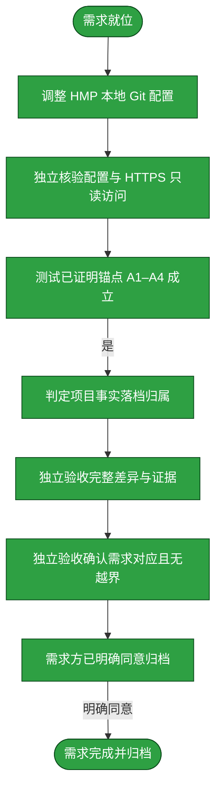

# 需求：统一 Home Media Pilot 的 GitHub CLI 鉴权

```yaml
target: assets/projects/home-media-pilot/home-media-pilot/.git/config
output: assets/projects/home-media-pilot/home-media-pilot/.git/config 中 origin 与 credential.helper 的本地设置
prompt:
  - 修改一下HMP，T统一一下
```

本需求仅调整 HMP 克隆的本地 Git 鉴权配置，使其通过 HTTPS remote 使用已配置的 GitHub CLI credential helper；从检查当前仓库状态开始，以独立验收变更、验证 HTTPS 只读访问和不影响其它改动结束。不改动 HMP 源码、全局 Git 配置或其他仓库。

## 需求澄清

### 澄清记录

- 无——结合当前会话刚完成的鉴权盘点，“统一”指让 HMP 的 GitHub Git 操作与已由 GitHub CLI/keyring 管理的凭证统一；明确采用 HTTPS remote，并移除 HMP 仓库本地的 `credential.helper=store` 覆盖。只读访问用于验证 helper 实际可用，不执行 push。
  - 裁决：将 HMP `origin` fetch/push URL 设为 `https://github.com/yunjies/home-media-pilot.git`，清除仅该仓库的 `credential.helper=store`，使用现有全局 `gh auth git-credential` 配置。
  - 反论与代价：SSH key 不再用于这个仓库；HTTPS 访问依赖 `gh` 当前登录态与 keyring，登录失效时操作会失败。保留 SSH 的最强替代方案是统一改用 SSH，而不是 CLI；但需求目标是复用 GitHub CLI。变更可通过恢复原 SSH URL 和 `store` helper 撤回，不改写提交历史。
  - 验收面：`origin` fetch/push URL 均为预期 HTTPS URL；HMP 本地配置不再含 `store` helper；`gh auth status` 显示 GitHub CLI 已登录且凭证来源为 keyring；非交互 `git ls-remote origin HEAD` 成功；工作树内容、暂存区和其它仓库不受影响。

### 验收锚点

- A1：HMP `origin` 的 fetch 与 push URL 均为预期 GitHub HTTPS 地址。
- A2：HMP 本地没有 `credential.helper=store`；有效 GitHub HTTPS helper 来自既有 GitHub CLI 配置，且 `gh auth status` 报告 keyring 登录。
- A3：不交互的 `git ls-remote origin HEAD` 成功，证明 Git HTTPS 请求可通过 GitHub CLI helper 读取远端。
- A4：没有更改 HMP 源码/提交历史、全局 Git 设置或其他仓库；不读取、打印、复制或删除凭证内容，HMP 既有工作区改动保持不变。

### 范围边界

- 不做：不修改知识库仓库及其他项目仓库的 remote/helper；不改全局 Git 或 `gh` 配置；不删除或读取 `~/.git-credentials`。
- 不做：不提交、推送、切换 HMP 分支、改写提交历史或修改 HMP 产品代码。
- 不做：若 HTTPS 鉴权验证失败，不改用明文凭证或绕过 `gh`；恢复原有 HMP 本地 Git 配置并报告阻塞。

## 主流程图



## START

确认目标是 HMP 独立仓库，当前分支为 `main`；记录已有工作区状态、原 `origin` URL 与仓库本地 helper，作为恢复基线。不得将嵌套 Git 仓库误作知识库外层仓库。

**输入**

- `REQUEST`：需求及范围；来源为本文件。

**输出**

- `BASELINE`：HMP 仓库分支、工作区摘要及鉴权配置基线；去向为 `DEVELOP`。

## DEVELOP

由独立开发 subagent 仅更新 HMP 克隆自身 `.git/config`：设置 `origin` 为本需求声明的 HTTPS 地址，移除本仓库 `credential.helper=store`。修改前保留确切旧值用于失败回滚；不得触碰全局配置、凭证文件或工作区内容。发现 scope 外变更立即停止。

**输入**

- `BASELINE`：仓库状态和旧配置；来源为 `START`。

**输出**

- `CHANGE`：本地配置差异和恢复值；去向为 `TEST`。

## TEST

由独立测试 subagent 只读验证远端 URL 与 helper 配置，核实 GitHub CLI keyring 登录态，并以禁止交互的 `git ls-remote origin HEAD` 测试 Git HTTPS 只读访问。不得输出凭证内容、不得执行写入远端的命令、不得修改配置或源码。运行失败时交付具体错误；不得绕过鉴权。

**输入**

- `CHANGE`：HMP 本地配置差异；来源为 `DEVELOP`。

**输出**

- `EVIDENCE`：配置核验、CLI 登录来源、HTTPS 读取结果与退出码；去向为 `TEST_GATE`。

## TEST_GATE

仅当 A1–A4 全部由可复算证据支持且退出码为 0 时继续；配置不匹配但可安全恢复时回到开发重做，认证不可用或出现非预期副作用则停止并报告。

**输入**

- `EVIDENCE`：只读测试证据；来源为 `TEST`。
**输出**

- `TEST_VERDICT`：A1–A4 由只读证据全部证实；去向为 `ARCHIVE`。

## ARCHIVE

由独立归档 subagent 判断已验证事实的归属。该改动只影响 HMP 克隆的本地 Git remote/helper，不改变产品能力或 HMP 运行流程，因此不修改 `feature-flow.md`、`deploy.md` 或项目源码；配置真值可从 `.git/config` 现取，不把凭证或机器特定状态复制进项目文档。测试交接证据显示 HMP 的 origin fetch/push URL 均为预期 HTTPS 地址，仓库本地 helper 无值，GitHub-specific effective helper 来自 `/home/azha/.gitconfig`（含空值 reset 与 `gh auth git-credential`），禁止交互的 `git ls-remote origin HEAD` 退出码为 0 并返回 ref；独立测试观察分支为 main 且 porcelain clean。没有写远端，也没有查看凭证文件。主会话较早读取 `gh auth status` 显示 yunjies/keyring，但独立测试阶段未重跑，故本阶段不将其作为新近复验事实。归档结论：`ARCHIVE_RESULT=不修改项目文档`；权威配置路径为 HMP 克隆的 `.git/config` 和 GitHub-specific Git 配置可用 `git config --show-origin --get-regexp '^credential\\.helper$'` 复取，有效登录态可用 `gh auth status` 现取。将此归属判断与测试证据交给验收。

**输入**

- `CHANGE`：配置差异；来源为 `DEVELOP`。
- `TEST_VERDICT`：测试结果；来源为 `TEST_GATE`。

**输出**

- `ARCHIVE_RESULT`：落档归属判断及证据；去向为 `ACCEPT`。

## ACCEPT

由未参与开发、测试与归档的独立验收 subagent 核对完整变更与本需求提示词、锚点及范围边界。逐项复算 A1–A4；不符合则指出具体差异并退回开发，不自行修正。

**输入**

- `ARCHIVE_RESULT`：归档阶段输出；来源为 `ARCHIVE`。
- `CHANGE`：本地配置差异；来源为 `DEVELOP`。
- `EVIDENCE`：测试证据；来源为 `TEST`。

**输出**

- `ACCEPT_VERDICT`：逐项验收结论；去向为 `ACCEPT_GATE`。

## ACCEPT_GATE

本次独立验收确认需求锚点全部满足且无越界改动；通过结论交给需求方，需求方明确同意后进入归档。

**输入**

- `ACCEPT_VERDICT`：独立验收结论；来源为 `ACCEPT`。

**输出**

- `ACCEPTED`：独立验收通过；去向为 `REQUESTER_APPROVAL`。

## REQUESTER_APPROVAL

接收独立验收通过结论，并核验需求方已明确同意归档。

**输入**

- `ACCEPTED`：独立验收通过；来源为 `ACCEPT_GATE`。
- `REQUESTER_DECISION`：需求方明确同意归档；来源为需求方。

**输出**

- `ARCHIVE_MOVE`：得到明确同意后的归档动作；去向为 `DONE`。

## DONE

需求方明确同意后，将本需求文档移动到 `assets/archive/`。这不触发 HMP 仓库提交或推送。

**输入**

- `ARCHIVE_MOVE`：流程文档移动动作；来源为 `REQUESTER_APPROVAL`。

**输出**

- 无。

## 状态配色

需求方已明确同意归档。`START`、`DEVELOP`、`TEST`、`TEST_GATE`、`ARCHIVE`、`ACCEPT`、`ACCEPT_GATE`、`REQUESTER_APPROVAL` 与 `DONE` 均有本次交接、独立核验/验收及明确归档决定作为依据，归档前全部标绿。本次实际路径没有触发失败重试、等待或阻塞分支，故这些未经过节点已从本次流程图和节点章节裁去。
