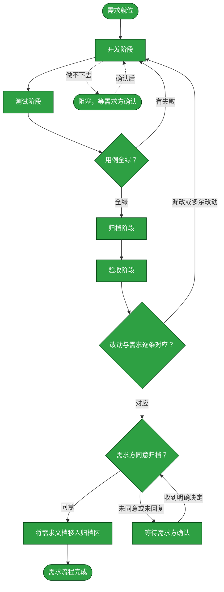

# 需求：将 HMP Provider 拆分为类型与可复用链接

```yaml
target: assets/projects/home-media-pilot/home-media-pilot/src/packages、src/apps、src/frontend、src/migrations、tests 与 assets/projects/home-media-pilot/feature-flow.md
output: assets/projects/home-media-pilot/home-media-pilot/src/packages、src/apps、src/frontend、src/migrations、tests 与 assets/projects/home-media-pilot/feature-flow.md
prompt:
  - 拆分Provider的功能，采用类型+链接方式，然后评估当前所有Provider的适配情况
  - 是，类型+独立链接（推荐）
```

本流程把 HMP 的 Provider 类型定义与可复用连接实例拆开，使媒体库按 Link ID 绑定连接，并评估各内建 Provider 的运行适配；从现有注册、配置、路由与界面开始，以迁移兼容、覆盖测试和已验证流程事实为止。

## 主流程图



## START

规格已收敛为类型定义与连接实例分离：一个 Provider type 可有多个 Link；媒体库绑定 Link ID，凭据仍不可回显。本节点确认分支为 main，且目标和产出都落在前置块所列范围。

**输入**
- `REQ_SPEC`：前置块列出的原始需求与补充确认；来源为本文件。

**输出**
- `DEV_BRIEF`：Provider Type/Link 拆分任务及既有配置兼容要求；去向为 `DEVELOP`。
- `REQ_SPEC`：完整需求规格；去向为 `DEVELOP`。

## DEVELOP

开发阶段由独立 subagent 完成，只改 HMP 仓库 `src/` 与 `tests/`；流程事实由 `ARCHIVE` 阶段单独写入知识库文档。保持旧配置迁移兼容，加入 Link CRUD、绑定、运行时解析及 WebUI 支持，不改需求之外的模块。

**输入**
- `DEV_BRIEF`：开发边界与规格；来源为 `START`。
- `REQ_SPEC`：完整的需求规格；来源为 `START`。
- `TEST_FAILURE`：测试阶段的失败报告；来源为 `TEST_GATE`。
- `TEST_VERDICT`：测试门禁的判定；来源为 `TEST_GATE`。
- `ACCEPT_FAILURE`：验收阶段的差异清单；来源为 `ACCEPT_GATE`。
- `RESOLVED`：确认后的条件；来源为 `BLOCKED`。

**输出**
- `DEV_RESULT`：代码差异与改动清单；去向为 `TEST`、`ARCHIVE`、`ACCEPT`。
- `REQ_SPEC`：转交验收的原始规格；去向为 `ACCEPT`。
- `OPEN_QUESTION`：需要需求方定夺的边界；去向为 `BLOCKED`。

## TEST

测试阶段由独立 subagent 执行，不改产品代码。验证旧配置迁移、多个同类型链接、媒体库 Link ID 绑定、凭据保密、每类内建 Provider 的接入路径，并运行项目测试命令。

**输入**
- `DEV_RESULT`：开发差异；来源为 `DEVELOP`。

**输出**
- `TEST_EVIDENCE`：用例、命令与结果；去向为 `TEST_GATE`、`ARCHIVE`。
- `TEST_FAILURE`：失败断言与可复现信息；去向为 `DEVELOP`。

## TEST_GATE

全绿且测试命令退出码为 0 才通过；否则回开发修正，再由独立测试阶段复测。

**输入**
- `TEST_EVIDENCE`：测试结果；来源为 `TEST`。
- `TEST_FAILURE`：失败证据；来源为 `TEST`。

**输出**
- `TEST_VERDICT`：通过或失败；去向为 `ARCHIVE` 或 `DEVELOP`。
- `TEST_FAILURE`：失败断言转交开发；去向为 `DEVELOP`。

## ARCHIVE

归档阶段由独立 subagent 执行，只把已验证的类型、链接、迁移和运行时适配事实写入 HMP `feature-flow.md`；不记录未经真实服务验证的在线状态。

**输入**
- `DEV_RESULT`：最终差异；来源为 `DEVELOP`。
- `TEST_VERDICT`：通过门禁；来源为 `TEST_GATE`。
- `TEST_EVIDENCE`：通过的测试证据；来源为 `TEST`。

**输出**
- `ARCHIVE_RESULT`：更新后的项目流程事实；去向为 `ACCEPT`。

## ACCEPT

验收阶段由独立 subagent 对照原始需求、确认的多链接模型、全量 diff 与测试结果；不自行改动代码或文档。

**输入**
- `REQ_SPEC`：原始需求和确认；来源为 `DEVELOP`。
- `DEV_RESULT`：代码差异；来源为 `DEVELOP`。
- `TEST_EVIDENCE`：测试证据；来源为 `TEST`。
- `ARCHIVE_RESULT`：流程事实更新；来源为 `ARCHIVE`。

**输出**
- `ACCEPT_VERDICT`：逐项对应的验收结论；去向为 `ACCEPT_GATE`。

## ACCEPT_GATE

检查需求要求全部实现且没有越界修改；不通过则把差异交开发阶段修正。通过后等待需求方明确同意，未回复不能归档。

**输入**
- `ACCEPT_VERDICT`：验收结论；来源为 `ACCEPT`。

**输出**
- `PUBLISH_READY`：验收通过；去向为 `REQUESTER_APPROVAL`。
- `ACCEPT_FAILURE`：未通过的差异；去向为 `DEVELOP`。

## REQUESTER_APPROVAL

把验收结论交给需求方；只有明确同意才触发需求文档归档。

**输入**
- `PUBLISH_READY`：验收通过的结论；来源为 `ACCEPT_GATE`。
- `REQUESTER_DECISION`：需求方决定；来源为 `APPROVAL_WAIT`。

**输出**
- `REQUESTER_DECISION`：需求方明确决定；去向为 `ARCHIVE_MOVE` 或 `APPROVAL_WAIT`。

## ARCHIVE_MOVE

需求方明确同意且归档节点状态全绿后，将本需求文件整篇移入 `assets/archive/`；移动后不再改写本文件。知识库 GitHub 提交与推送在移动后按[assets/archive/README.md](../archive/README.md)办理，不记录为本文件的流程节点状态。

**输入**
- `REQUESTER_DECISION`：明确同意归档；来源为 `REQUESTER_APPROVAL`。

**输出**
- `ARCHIVED_REQ`：归档后的流程文档；去向为 `DONE`。

## DONE

需求流程结束，需求文档已移入归档区，结果可从项目仓库与 HMP 流程说明复取；知识库 GitHub 提交、推送与远端核实按归档 README 在移动后完成。

**输入**
- `ARCHIVED_REQ`：归档后的需求文件；来源为 `ARCHIVE_MOVE`。

**输出**
- 无。

## APPROVAL_WAIT

没有明确同意时保持等待，不改动工作区、不移动需求文件。

**输入**
- `REQUESTER_DECISION`：未同意或未回复；来源为 `REQUESTER_APPROVAL`。

**输出**
- `REQUESTER_DECISION`：等待中的决定；去向为 `REQUESTER_APPROVAL`。

## BLOCKED

遇到需求范围、迁移兼容或接口关系无法安全推定时暂停并请求需求方决定，不自行扩大改造。

**输入**
- `OPEN_QUESTION`：悬置的问题；来源为 `DEVELOP`。

**输出**
- `RESOLVED`：确认后的条件；去向为 `DEVELOP`。

## 状态配色

状态取色严格对应待执行、已执行、阻塞三档：`#f9d71c`、`#2ea043`、`#d73a49`。节点变绿要求有测试或验收证据；尚未完成的节点保持黄色，BLOCKED 只在实际阻塞时标红。
