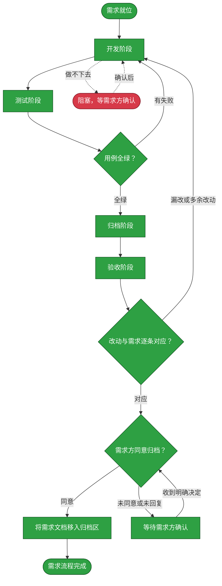

# 需求：将 HMP Provider 拆分为类型与可复用链接

```yaml
target: assets/projects/home-media-pilot/home-media-pilot/.env.example、src/packages、src/apps、src/frontend、src/migrations、tests 与 assets/projects/home-media-pilot/feature-flow.md
output: assets/projects/home-media-pilot/home-media-pilot/.env.example、src/packages、src/apps、src/frontend、src/migrations、tests 与 assets/projects/home-media-pilot/feature-flow.md
prompt:
  - 拆分Provider的功能，采用类型+链接方式，然后评估当前所有Provider的适配情况
  - 是，类型+独立链接（推荐）
  - 迁移完成后，相关逻辑是否可以清理？
  - 所以其实当前request还没有完成，还不应该落到feature-flow中。agents中定义了长期价值>短期代价
```

本流程把 HMP Provider 类型定义与可复用连接实例拆开，使 ProviderLink 成为唯一配置源；迁移旧 ProviderConfig 数据后清除其存储、API 与同步路径，并令 NAS SSH bootstrap 按 Link ID 操作；评估内建 Provider 适配、覆盖测试，全部完成后再更新项目流程事实。

## 主流程图



## START

规格已收敛为类型定义与连接实例分离：一个 Provider type 可有多个 Link；媒体库绑定 Link ID，凭据仍不可回显。本节点确认分支为 main，且目标和产出都落在前置块所列范围。

**输入**
- `REQ_SPEC`：前置块列出的原始需求与补充确认；来源为本文件。

**输出**
- `DEV_BRIEF`：Provider Type/Link 拆分、既有配置迁移与兼容面清退任务；去向为 `DEVELOP`。
- `REQ_SPEC`：完整需求规格；去向为 `DEVELOP`。

## DEVELOP

开发阶段由独立 subagent 完成，只改 HMP 仓库 `src/` 与 `tests/`；流程事实由 `ARCHIVE` 阶段单独写入知识库文档。保留旧配置到 Link 的历史数据迁移，验证后移除 ProviderConfig 存储、API 与同步逻辑；NAS SSH scan/bootstrap 按 Link ID 操作。加入 Link CRUD、绑定、运行时解析及 WebUI 支持，不改需求之外的模块。

【事实】新类型定义能力，同类型 Link 保存独立 endpoint 与凭据，消费方按唯一 Link ID 读取配置；ProviderConfig 镜像和单向同步制造两份可写状态。迁移旧数据并不要求继续保留双配置运行时。

【反题】直接删除旧表或 API 可能丢失 endpoint、密文、环境凭据引用、优先级、连接状态，或使旧客户端及 NAS 引导失效。通过可复算迁移断言、Link-ID NAS 路由与 UI 测试，并在新版本不再读旧表后删除旧表，可验证此风险。

【裁决】以 ProviderLink 为唯一配置源；保留 0012 历史迁移，新增后续迁移收尾旧表，删除旧 API 与双写同步，NAS SSH 引导显式选择 Link ID。接受旧 API 客户端必须升级及旧表降级重建的维护代价，以消除状态漂移并支持按链接轮换凭据。若运行代码仍读旧配置、迁移漏字段或 NAS 操作影响非目标 Link，此裁决即被证伪。

【事实】当前 runtime 除 Link 外还会从 `AppSettings.services` 和 provider-specific environment 变量取 endpoint/credential；ProviderLink 作为唯一配置源要求无 Link 时不能成功运行，也不能因数据库错误退回旧配置。

【反题】已有仅配置环境变量、没有 Link 的部署可能在升级后不能连接服务；若这类环境输入仍是受支持的独立配置契约，移除后会破坏其配置。可证伪条件是无 ProviderLink 时运行仍成功读取裸环境配置，或指定 `credential_ref=env:...` 后其凭据不能按字段解析。

【裁决】运行路径移除裸 `AppSettings.services`/provider env fallback，只从选定 Link 的 endpoint、密文和显式 `credential_ref` 解析配置；协议内建公共默认地址可保留。接受环境-only 部署必须先建立 Link（环境凭据可被 Link 显式引用），以避免 Link 看似权威但运行时被外部配置静默覆盖。

【事实】adapter 运行已不再读取 `AppSettings.services`，但该环境配置模型及 CLI `config validate` 仍列出 Provider URL/credential refs；死配置继续向操作者承诺一条实际不生效的配置路径。

【反题】删除该模型和 CLI 输出会破坏旧脚本/部署对 `config validate` 环境服务摘要的依赖；若这一摘要仍是有意支持的对外契约，其移除就是不必要的契约破坏。证伪条件是任一产品运行路径仍需该模型值，或当前 CLI 契约有调用者必须据其配置 Provider。

【裁决】确认 `AppSettings.services` 只被配置校验和原 fallback 使用后，连同 `ServiceEndpoint` 与 provider env endpoint 解析一并清除；CLI 保留通用环境/媒体库校验，不再把废弃的 Provider endpoint 显示为有效状态。接受旧 config-validate consumers 更新输出，以消除僵尸配置接口与 Link 权威性歧义。

【事实】媒体库创建/更新请求未带 Link ID 时，服务端按 provider 的最低 priority 启用 Link 选定一个并把其 UUID 落库；此后运行路径只读落库 UUID。这与运行期每次按 priority 隐式重选不同——后者会让 priority 变更静默改绑媒体库。

【反题】规格原文是"媒体库绑定 Link ID"，最强反对意见是省略 Link ID 的请求应被拒绝，以强制调用方显式表达绑定；隐式默认选定可能在多 Link 并存时绑到非预期实例。证伪条件是请求省略 Link ID 时落库结果不是确定性的最低 priority 启用 Link，或落库后运行路径仍按 priority 重选而非读 UUID。

【裁决】保留写入期默认选定并强制落库 UUID：媒体库绑定在写入时定型为具体 Link ID，运行期与迁移后的库都按 UUID 读取。接受省略 Link ID 的请求不报错这一兼容面，因为 jellyfin_sync 新建库与首启动导入本就需要默认选定语义；错误绑定可由显式指定 Link ID 的更新请求修正。

**输入**
- `DEV_BRIEF`：开发边界与规格；来源为 `START`。
- `REQ_SPEC`：完整的需求规格；来源为 `START`。
- `TEST_FAILURE`：测试阶段的失败报告；来源为 `TEST_GATE`。
- `TEST_VERDICT`：测试门禁的判定；来源为 `TEST_GATE`。
- `ACCEPT_FAILURE`：验收阶段的差异清单；来源为 `ACCEPT_GATE`。
- `RESOLVED`：确认后的条件；来源为 `BLOCKED`。

**输出**
- `DEV_RESULT`：代码差异与改动清单；去向为 `TEST`、`ARCHIVE`、`ACCEPT`。
- `REQ_SPEC`：转交验收的原始规格；去向为 `ACCEPT`。
- `OPEN_QUESTION`：需要需求方定夺的边界；去向为 `BLOCKED`。

## TEST

测试阶段由独立 subagent 执行，不改产品代码。验证旧配置数据完整迁移、最终 schema 中 ProviderConfig 表不存在、旧运行/API引用和裸环境配置 fallback 已移除、`AppSettings.services` provider endpoint 配置已清退、`.env.example` 不再建议 provider endpoint 裸变量、Link `credential_ref` 环境解析仍有效、多个同类型链接、媒体库 Link ID 绑定、凭据保密、NAS bootstrap 仅作用于目标 Link、每类内建 Provider 的接入路径，并运行项目测试命令。

**输入**
- `DEV_RESULT`：开发差异；来源为 `DEVELOP`。

**输出**
- `TEST_EVIDENCE`：用例、命令与结果；去向为 `TEST_GATE`、`ARCHIVE`。
- `TEST_FAILURE`：失败断言与可复现信息；去向为 `DEVELOP`。

## TEST_GATE

全绿且测试命令退出码为 0 才通过；否则回开发修正，再由独立测试阶段复测。

**输入**
- `TEST_EVIDENCE`：测试结果；来源为 `TEST`。
- `TEST_FAILURE`：失败证据；来源为 `TEST`。

**输出**
- `TEST_VERDICT`：通过或失败；去向为 `ARCHIVE` 或 `DEVELOP`。
- `TEST_FAILURE`：失败断言转交开发；去向为 `DEVELOP`。

## ARCHIVE

归档阶段由独立 subagent 执行，只把已验证的类型、链接、迁移和运行时适配事实写入 HMP `feature-flow.md`；不记录未经真实服务验证的在线状态。

**输入**
- `DEV_RESULT`：最终差异；来源为 `DEVELOP`。
- `TEST_VERDICT`：通过门禁；来源为 `TEST_GATE`。
- `TEST_EVIDENCE`：通过的测试证据；来源为 `TEST`。

**输出**
- `ARCHIVE_RESULT`：更新后的项目流程事实；去向为 `ACCEPT`。

## ACCEPT

验收阶段由独立 subagent 对照原始需求、确认的多链接模型、全量 diff 与测试结果；不自行改动代码或文档。

**输入**
- `REQ_SPEC`：原始需求和确认；来源为 `DEVELOP`。
- `DEV_RESULT`：代码差异；来源为 `DEVELOP`。
- `TEST_EVIDENCE`：测试证据；来源为 `TEST`。
- `ARCHIVE_RESULT`：流程事实更新；来源为 `ARCHIVE`。

**输出**
- `ACCEPT_VERDICT`：逐项对应的验收结论；去向为 `ACCEPT_GATE`。

## ACCEPT_GATE

检查需求要求全部实现且没有越界修改；不通过则把差异交开发阶段修正。通过后等待需求方明确同意，未回复不能归档。

**输入**
- `ACCEPT_VERDICT`：验收结论；来源为 `ACCEPT`。

**输出**
- `PUBLISH_READY`：验收通过；去向为 `REQUESTER_APPROVAL`。
- `ACCEPT_FAILURE`：未通过的差异；去向为 `DEVELOP`。

## REQUESTER_APPROVAL

把验收结论交给需求方；只有明确同意才触发需求文档归档。

**输入**
- `PUBLISH_READY`：验收通过的结论；来源为 `ACCEPT_GATE`。
- `REQUESTER_DECISION`：需求方决定；来源为 `APPROVAL_WAIT`。

**输出**
- `REQUESTER_DECISION`：需求方明确决定；去向为 `ARCHIVE_MOVE` 或 `APPROVAL_WAIT`。

## ARCHIVE_MOVE

需求方明确同意且归档节点状态全绿后，将本需求文件整篇移入 `assets/archive/`；移动后不再改写本文件。知识库 GitHub 提交与推送在移动后按[assets/archive/README.md](../archive/README.md)办理，不记录为本文件的流程节点状态。

**输入**
- `REQUESTER_DECISION`：明确同意归档；来源为 `REQUESTER_APPROVAL`。

**输出**
- `ARCHIVED_REQ`：归档后的流程文档；去向为 `DONE`。

## DONE

需求流程结束，需求文档已移入归档区，结果可从项目仓库与 HMP 流程说明复取；知识库 GitHub 提交、推送与远端核实按归档 README 在移动后完成。

**输入**
- `ARCHIVED_REQ`：归档后的需求文件；来源为 `ARCHIVE_MOVE`。

**输出**
- 无。

## APPROVAL_WAIT

没有明确同意时保持等待，不改动工作区、不移动需求文件。

**输入**
- `REQUESTER_DECISION`：未同意或未回复；来源为 `REQUESTER_APPROVAL`。

**输出**
- `REQUESTER_DECISION`：等待中的决定；去向为 `REQUESTER_APPROVAL`。

## BLOCKED

遇到需求范围、迁移兼容或接口关系无法安全推定时暂停并请求需求方决定，不自行扩大改造。

**输入**
- `OPEN_QUESTION`：悬置的问题；来源为 `DEVELOP`。

**输出**
- `RESOLVED`：确认后的条件；去向为 `DEVELOP`。

## 状态配色

状态取色严格对应待执行、已执行、阻塞三档：`#f9d71c`、`#2ea043`、`#d73a49`。节点变绿要求有测试或验收证据；尚未完成的节点保持黄色，BLOCKED 只在实际阻塞时标红。
