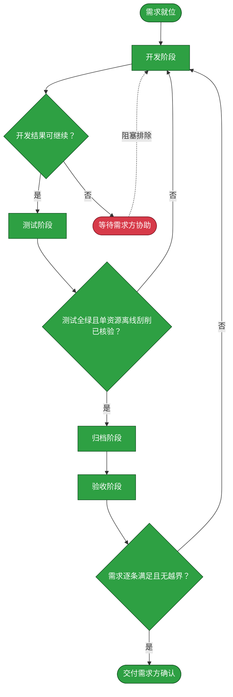

# 需求：调整资源中心展示并验证匹配刮削

```yaml
target: assets/projects/home-media-pilot/home-media-pilot/ 与 assets/projects/home-media-pilot/feature-flow.md
output: assets/projects/home-media-pilot/home-media-pilot/ 与 assets/projects/home-media-pilot/feature-flow.md
prompt:
  - TMP新增迭代：1. 资源中心不再是瀑布式，而是对齐的表格式。2. 资源中心需要区分类型，详情中的字段也应该是根据类型区分，比如只只有电视剧才有season和epsoide，电影则没有。3.资源详情不展示元数据原始数据。4.列表需要支持排序，默认是资源名。5.检查匹配机制，需要列出缺失了那些资源。6.检查刮削是否生效，测试一个资源刮削
  - 改为离线验证
```

本需求调整 home-media-pilot 的资源中心：将资源展示为对齐表格，按媒体类型呈现详情字段，隐藏原始元数据，支持默认按资源名排序，并使匹配检查能明确列出未匹配资源；再以单个测试资源进行离线刮削链路验证，不访问远端实例。

## 需求澄清

### 澄清记录

- 问答：需求中的“缺失了那些资源”具体指什么？ → 选择“未匹配资源”：显示已扫描但没有成功匹配/刮削会话的媒体资源。
  - 裁决：把缺失定义为扫描索引中的未匹配资源，并由列表明确呈现资源身份；不将磁盘已删除文件或外部应有清单差异纳入本次范围。
  - 反论与代价：未匹配是匹配状态而非磁盘存在性，无法揭示索引陈旧；改查磁盘或比较外部清单会引入另一数据源及一致性契约，本次不扩展。
  - 验收面：在匹配检查中可见每个未匹配资源且与筛选后的资源清单一致。
- 问答：实际刮削目标实例是什么？ → `https://cyclonejoker.xyz:18081/`。
  - 裁决：初始目标指向该实例，但只有 TLS 身份可验证后才允许访问；不绕过证书校验。
  - 反论与代价：停止真实调用意味着无法证明部署实例的在线 Provider 与业务链路可用；这是避免把未经身份确认的主机当作目标所付出的验证缺口。
  - 验收面：真实在线面标记为未验证，不将离线测试描述为实例实测。
- 问答：TLS 证书链校验失败后如何继续？ → “改为离线验证”。
  - 裁决：不访问该实例，将“测试一个资源刮削”改为使用单个测试资源及 mock Provider 验证刮削服务创建候选会话。
  - 反论与代价：mock 无法证明远端服务可达、凭据有效或 Provider 在线响应兼容；未来如需现场验收，须在 TLS 可验证后重新授权并执行真实操作。
  - 验收面：覆盖单个测试资源的刮削调用，验证返回报告与候选会话；真实实例行为明确列作未验证面。
- 需求原话中“TMP”及“season和epsoide”存在拼写/术语歧义；按已识别的 home-media-pilot 资源中心处理，季号与集号仅适用于电视剧。若项目识别不符，开发前暂停。

### 验收锚点

- A1：资源中心以行列对齐的表格呈现资源，而不是瀑布式卡片布局。
- A2：资源类型可区分；电视剧详情可呈现季号与集号，电影详情不呈现这两个字段。
- A3：资源详情不呈现元数据原始 JSON/原始载荷。
- A4：列表可按字段排序，默认排序为资源名；排序在完整筛选集上执行后再分页，切换媒体库、搜索、状态筛选或排序时页码回到第一页，避免旧页偏移隐藏有效结果。
- A5：匹配检查列出具体未匹配资源，且其判定语义与服务端匹配状态一致。
- A6：单个测试资源通过离线刮削链路得到可核对的会话与候选；真实目标实例仍明确标注未验证。

### 范围边界

- 不做：将资源从磁盘删除、导入/导出或批量修改元数据。
- 不做：选择匹配候选或写入任何媒体目录 sidecar。
- 不做：用外部资源清单或磁盘全盘核对定义“缺失资源”。
- 不做：修改媒体类型识别规则、Provider 路由或其他资源中心之外的业务契约；若验收 A4/A5 确需扩展 API 契约，应先向需求方确认实际扩展范围。

## 主流程图



## START

需求范围、澄清裁决与验收锚点已就位，允许进入开发。

**输入**

- `REQ_SPEC`：本文件的前置块；来源为本文件。

**输出**

- `REQ_SPEC`：需求规格；去向为 `DEVELOP`。

## DEVELOP

开发阶段只修改需求指向的 home-media-pilot 仓库及其流程说明。先确认仓库分支策略，再按需求改动；遇到需求边界外的 API 或行为改动时暂停并请求确认。

**输入**

- `REQ_SPEC`：需求规格、澄清记录和验收锚点；来源为 `START`。
- `FAILURE_REPORT`：上一轮测试失败；来源为 `TEST`。
- `ACCEPT_FAILURE`：验收发现的遗漏或越界；来源为 `ACCEPT_GATE`。
- `TEST_VERDICT`：上一轮测试判定；来源为 `TEST_GATE`。
- `RESOLUTION`：阻塞事项的需求方处置；来源为 `BLOCKED`。

**输出**

- `DEV_RESULT`：改动清单与自测结果；去向为 `DEV_GATE`。
- `OPEN_QUESTION`：边界外依赖或无法继续的条件；去向为 `BLOCKED`。

## DEV_GATE

开发结果已覆盖需求范围且无未决扩展时进入测试，否则等待澄清。

**输入**

- `DEV_RESULT`：开发结果；来源为 `DEVELOP`。
- `OPEN_QUESTION`：未决条件；来源为 `DEVELOP`。

**输出**

- `TEST_BRIEF`：可测试的改动与需求；去向为 `TEST`。
- `DEV_RESULT`：改动清单；去向为 `ARCHIVE`。
- `OPEN_QUESTION`：未解除的阻塞；去向为 `BLOCKED`。

## TEST

由独立测试阶段编写并运行覆盖表格布局、类型字段、原始元数据隐藏、排序和未匹配资源枚举的测试。单资源刮削使用测试资源与 mock Provider 验证会话创建；不得访问证书身份未能验证的目标实例。测试失败回到开发，测试阶段不修改产品代码。

**输入**

- `TEST_BRIEF`：需求行为及开发结果；来源为 `DEV_GATE`。

**输出**

- `TEST_EVIDENCE`：测试输出与离线刮削观察；去向为 `ARCHIVE`。
- `FAILURE_REPORT`：失败行为与证据；去向为 `DEVELOP`。

## TEST_GATE

判据是项目测试全绿且退出码为零，并记录单个测试资源经 mock Provider 的离线刮削结果。该结果不构成真实实例连接或在线刮削通过的证据。

**输入**

- `TEST_EVIDENCE`：测试与实例观察；来源为 `TEST`。

**输出**

- `TEST_VERDICT`：通过或失败；去向为 `ARCHIVE` 或 `DEVELOP`。

## ARCHIVE

仅将已验证的项目流程事实更新至 home-media-pilot 的 feature-flow 文档；真实运行结果如未能核验，必须保留为未验证，不写成已完成事实。

**输入**

- `DEV_RESULT`：已交付改动；来源为 `DEV_GATE`。
- `TEST_EVIDENCE`：测试证据；来源为 `TEST`。
- `TEST_VERDICT`：测试阶段判定；来源为 `TEST_GATE`.

**输出**

- `ARCHIVED`：已对齐的项目流程说明；去向为 `ACCEPT`。

## ACCEPT

由未参与开发、测试与归档的验收阶段独立对照全部改动与本文件原始需求及验收锚点，要求无遗漏且无范围外变更。

**输入**

- `ARCHIVED`：项目流程说明已更新；来源为 `ARCHIVE`。
- `FULL_DIFF`：本需求全部改动；来源为工作区。
- `REQ_SPEC`：前置块与验收锚点；来源为本文件。

**输出**

- `ACCEPT_VERDICT`：逐项核对结果；去向为 `ACCEPT_GATE`。

## ACCEPT_GATE

每个验收锚点均有证据且改动没有越出范围时通过，否则回开发修正。

**输入**

- `ACCEPT_VERDICT`：逐项核对结果；来源为 `ACCEPT`。

**输出**

- `ACCEPTED`：验收结论；去向为 `DONE`。
- `ACCEPT_FAILURE`：遗漏或越界项；去向为 `DEVELOP`。

## BLOCKED

开发阶段遇到无法自行解除的边界或依赖问题时，停止相关改动并请求需求方协助；条件解除后回开发阶段继续。

**输入**

- `OPEN_QUESTION`：阻塞条件；来源为 `DEVELOP`。

**输出**

- `RESOLUTION`：需求方确认的处置；去向为 `DEVELOP`。

## DONE

验收通过后将结果交需求方；未经需求方明确同意，不移动本需求文档至 archive。

**输入**

- `ACCEPTED`：验收结果；来源为 `ACCEPT_GATE`。

**输出**

- `HANDOFF`：交付与归档确认请求；去向为需求方。
