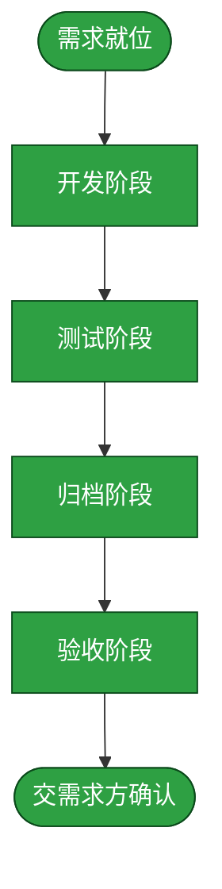

# 需求：优化 HMP 资源中心加载与字幕呈现

```yaml
target: assets/projects/home-media-pilot/home-media-pilot/src/
output: assets/projects/home-media-pilot/home-media-pilot/src/
prompt:
  - "现在需要优化一下HMP资源中心：\n1. 当前加载速度很慢，且翻页逻辑阅读信息很困难。需要增加单页显示的数量，并且加速内容加载。且未加载图片的时候应该用一张loading图占位\n2. 字幕模块显得多余，在每个资源的详情面板上展示即可"
  - "从50、100、150、200可供选择，需要缓存"
  - "允许最小 API 契约变更（推荐）"
  - "页面生命周期缓存（推荐）"
```

本需求优化 HMP 资源中心的列表浏览和资源详情。用户可选择提示词中指定的四档每页数量，资源数据在当前页面生命周期内按媒体库缓存；封面尚未加载时以内置占位呈现。移除独立字幕模块，把已扫描字幕文件及其关联状态放进对应资源详情。现有 API 不提供可靠字幕关联时允许最小必要的只读 API 契约变更，不改变字幕 Provider 搜索/下载业务行为。

## 需求澄清

### 澄清记录

- 问答：每页数量、图片占位和字幕呈现范围？→“从50、100、150、200可供选择，需要缓存”；接受内置占位；详情中展示已有字幕文件及匹配状态，不迁入搜索/下载动作。
  - 裁决：提供四个每页档位；资源缓存限当前页面生命周期并按媒体库隔离；资源状态变化或显式刷新时更新缓存。
  - 反论与代价：较大页数和缓存会增加浏览器内存及过期数据风险；较小默认值可降低负担，但不能同等减少翻页。限定缓存生命周期并在变更时刷新，代价是页面刷新后需重新加载。
  - 验收面：界面档位与提示词一致；切页回看复用已缓存资源；切换媒体库不串数据，显式刷新后显示新数据；图片未就绪或失败时显示本地占位。
- 问答：API 缺少字幕归属与状态时如何呈现？→“允许最小 API 契约变更（推荐）”。
  - 裁决：现有数据不能可靠关联时，增加足以表达资源与已有字幕文件及状态关系的最小只读契约。
  - 反论与代价：API 契约增加维护面且消费者需同步更新；仅以前端标题猜测虽轻，但可能误把字幕归给其他资源。选择明确关联，代价由 API 与前端共同维护。
  - 验收面：API 对资源返回可辨识的相关字幕及状态，详情仅展示对应关系；不触发字幕 Provider 搜索或下载。
- 问答：缓存范围？→“页面生命周期缓存（推荐）”。
  - 裁决：不使用跨刷新持久缓存；页面刷新后缓存失效。
  - 反论与代价：刷新后重新取数，无法节省跨页面请求；但规避持久旧数据与复杂失效管理。
  - 验收面：当前页面翻页可复用已取回数据；重新加载后重新获取。
- 提示词消歧位置：页数档位、缓存范围、图片占位形式、字幕关联与缓存生命周期。

### 验收锚点

- A1：资源中心提供提示词指定的四档每页数量，页面条数受选中档位约束，末页可少于档位数。
- A2：当前页面切页复用按媒体库隔离的已取回数据；显式刷新后数据更新，浏览器刷新后不再复用旧内存缓存。
- A3：封面加载中或不可用时显示不依赖外部请求的内置占位。
- A4：独立字幕模块入口消失；资源详情呈现 API 明确关联的已有字幕文件与状态；不调用字幕搜索/下载业务行为。

### 范围边界

- 不做：数据库持久化缓存或跨设备缓存、字幕 Provider/搜索/下载业务变更、无关页面重构。仅当现有只读 API 数据不足以表达媒体与字幕文件归属时，允许增加最小必要的只读 API 契约。

## 主流程图



## START

需求路径、验收锚点及范围已明确，交给开发阶段。输入为本文件规格，输出为开发作业书。

- 输入参数：无
- 输出参数：
  - `REQ_SPEC`：需求规格；去向为 `DEVELOP`

## DEVELOP

由独立开发 subagent 执行。仅改前置块 `target` 指向的 HMP 源码；先核实项目仓库分支为 `main`，不在该分支时暂停。阶段产出是代码改动与开发自测，不编写测试、不改流程文档。测试失败与验收差异均作为输入返还本阶段重做。

- 输入参数：
  - `REQ_SPEC`：需求规格；来源为 `START`
  - `FAILURE_REPORT`：测试失败及原因；来源为 `TEST`
  - `ACCEPT_FAILURE`：验收差异与处置要求；来源为 `ACCEPT`
- 输出参数：
  - `DEV_RESULT`：代码改动清单与自测结论；去向为 `TEST`

## TEST

由独立测试 subagent 执行，不继承开发上下文。按项目 `tests/README.md` 选层并新增覆盖本需求的用例，运行测试并交出证据；测试阶段不修改产品代码。失败时返回开发阶段修正后重跑。

- 输入参数：
  - `DEV_RESULT`：代码改动清单与自测结论；来源为 `DEVELOP`
- 输出参数：
  - `TEST_EVIDENCE`：测试用例与运行结果；去向为 `ARCHIVE`
  - `FAILURE_REPORT`：失败用例与原因；去向为 `DEVELOP`

## ARCHIVE

由独立归档 subagent 执行。只把已验证事实写入项目 `feature-flow.md`；没有测试覆盖的行为写为未验证，不记录开发过程或决策来历。

- 输入参数：
  - `DEV_RESULT`：代码改动清单；来源为 `DEVELOP`
  - `TEST_EVIDENCE`：测试证据；来源为 `TEST`
- 输出参数：
  - `ARCHIVED`：与实现一致的流程文档；去向为 `ACCEPT`

## ACCEPT

由独立验收 subagent 执行，不参与开发、测试或归档。逐项列出当前需求及验收锚点，再将每一项对应到完整代码与文档 diff，并检查范围边界。全覆盖且无越界才通过；否则报告差异并退回开发，不在验收阶段修改产品。

- 输入参数：
  - `ARCHIVED`：已归档的流程说明；来源为 `ARCHIVE`
  - `TEST_EVIDENCE`：测试证据；来源为 `TEST`
- 输出参数：
  - `ACCEPTED`：逐条比对后通过的验收结论；去向为 `DONE`
  - `ACCEPT_FAILURE`：遗漏或范围外改动；去向为 `DEVELOP`

## DONE

验收结果交需求方确认。本节点不自动移动或归档需求单；只有需求方明确同意后才归档。

- 输入参数：
  - `ACCEPTED`：验收通过结论；来源为 `ACCEPT`
- 输出参数：无
