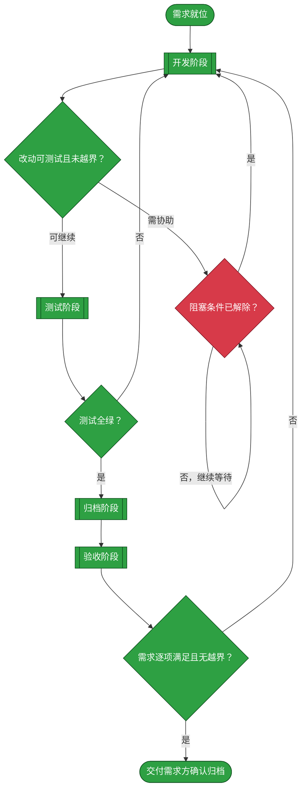
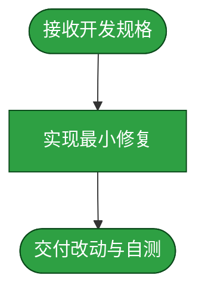
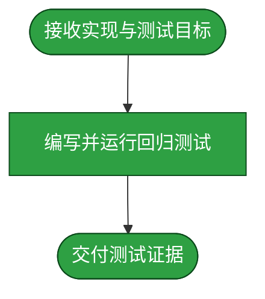
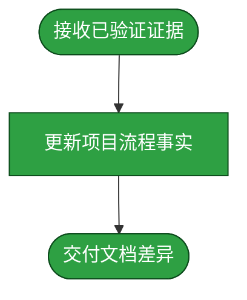
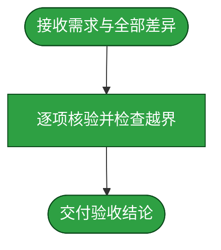

# 需求：修复资源中心读取本地 meta 信息失败并显示封面

```yaml
target: assets/projects/home-media-pilot/home-media-pilot/
output: assets/projects/home-media-pilot/home-media-pilot/ 与 assets/projects/home-media-pilot/feature-flow.md
prompt:
  - 现在来解决一下HMP资源中心中读取meta信息失败的问题，我们以‘/mnt/user/Videos/电影/Stuart.Little.1999.BluRay.1080p.DTS.3Audio.x264-CHD’为例，资源中心显示了名字，但是封面没有显示，目录下是有信息的
  - 示例目录里面探索
```

本需求从资源中心读取本地资源旁已有的 meta 信息开始，目标是查明示例电影显示名称但未显示封面的原因，并修复对受支持的本地 NFO 与封面文件的读取，使资源清单提供可消费的标题、元数据和封面入口；结束于源码和自动化测试，不包含运行实例发布或用户媒体目录写入。

## 需求澄清

### 澄清记录

- 问答：目录下已有的信息具体是什么？→需求方要求在 Unraid 上只读探索示例目录。
  - 裁决：只读检查示例目录文件名与 NFO 中的相关 XML 字段，不读取或传输媒体、图像内容；不连接 HMP API，不部署或重启服务。
  - 反论与代价：示例只覆盖一种电影 NFO/海报命名；其它目录约定仍可能不受支持。只读取 sidecar 避免对媒体文件造成影响，但解析故障须局部失败，不得中断资源清单。
  - 验收面：隔离测试覆盖观察到的 `movie.nfo`、poster thumb 元素和同目录 `poster.jpg`；API 返回可加载的封面入口，且媒体目录内容未改变。
- 问答：是否需要验证或发布？→“不需要验证发布了”。
  - 裁决：仅交付源码、项目流程事实与自动化证据；不操作 HMP 运行实例、不推送镜像或变更 Unraid 部署。
  - 反论与代价：部署中版本和挂载权限未验证，改动不会立即影响运行服务；部署升级由操作者另行执行。
  - 验收面：源码测试通过且本次没有部署操作。

### 验收锚点

- A1：含受支持 NFO 与本地海报的已索引电影资源，返回标题/简介/年份与可消费的封面 URL；图片接口返回实际图像字节。
- A2：provider 已匹配元数据不被 sidecar 覆盖；损坏或过大的 NFO、跨根路径与 symlink escape 不阻断清单或越界读取；无 sidecar 的既有资源行为保持有效。
- A3：对 Unraid 示例目录只读；完整项目测试、前端构建与源码编译检查通过。

### 范围边界

- 不做：修改部署实例配置、重建或重启服务、写入/删除/覆盖用户媒体目录文件、修改无关 Provider 业务或新增数据库迁移。

## 主流程图



## START

需求范围、验收锚点和禁区已确定；本节点把规格交给开发阶段。

- 输入参数：无
- 输出参数：
  - `REQ_SPEC`：本需求规格；去向为 `DEVELOP`

## DEVELOP

开发 subagent 仅修改目标仓库内与本需求相关的源码；不得触及用户媒体路径，也不得发布或重启部署实例。



开发 subagent 读取本需求规格及验收锚点，交付实现和自测结果。测试、归档和验收由独立阶段执行者负责。

- 输入参数：
  - `REQ_SPEC`：本需求规格；来源为 `START`
  - `FAILURE_REPORT`：失败用例与原因；来源为 `TEST_GATE`
  - `ACCEPT_FAILURE`：验收未通过项；来源为 `ACCEPT_GATE`
  - `DEV_RESOLVED`：阻塞条件已解除；来源为 `BLOCKED`
- 输出参数：
  - `DEV_RESULT`：改动清单与自测结果；去向为 `DEV_GATE`
  - `OPEN_QUESTION`：尚未解决的条件；去向为 `DEV_GATE`

### D_IN

开发子流程接收完整需求与验收锚点。

- 输入参数：
  - `REQ_SPEC`：本需求规格；来源为开发阶段调用方
- 输出参数：
  - `EDIT_SCOPE`：允许修改范围；去向为 `D_EDIT`

### D_EDIT

开发者在目标仓库实现修复；需要扩大范围时停止并报告，不自行越界。

- 输入参数：
  - `EDIT_SCOPE`：允许修改范围；来源为 `D_IN`
- 输出参数：
  - `EDIT_RESULT`：源码改动；去向为 `D_OUT`

### D_OUT

交付源码改动、自测结果与未解决的问题。

- 输入参数：
  - `EDIT_RESULT`：源码改动；来源为 `D_EDIT`
- 输出参数：
  - `PHASE_RESULT`：开发阶段交付；去向为开发阶段调用方

## DEV_GATE

只有改动符合目标范围且交付可测试时才进入测试；仍有权限、路径或实现条件未明时转为阻塞。

- 输入参数：
  - `DEV_RESULT`：开发交付；来源为 `DEVELOP`
  - `OPEN_QUESTION`：待协助条件；来源为 `DEVELOP`
- 输出参数：
  - `DEV_RESULT`：可测试改动；去向为 `TEST`
  - `OPEN_QUESTION`：阻塞条件；去向为 `BLOCKED`

## BLOCKED

阻塞事项需要需求方确认；不得以猜测的主机或路径替代缺失的访问信息。

- 输入参数：
  - `OPEN_QUESTION`：待协助条件；来源为 `DEV_GATE`
- 输出参数：
  - `DEV_RESOLVED`：已解除的条件；去向为 `DEVELOP`

## TEST

测试 subagent 只新增本需求测试并运行，不改产品源码。任何失败均退回开发阶段。



测试必须隔离用户媒体路径，并验证本地 sidecar 读取、封面接口、错误容忍与路径安全。

- 输入参数：
  - `DEV_RESULT`：可测试改动；来源为 `DEV_GATE`
- 输出参数：
  - `TEST_EVIDENCE`：用例与执行结果；去向为 `TEST_GATE`

### T_IN

测试阶段接收实现结果及本需求的可观察验收锚点。

- 输入参数：
  - `TEST_INPUT`：实现与验收锚点；来源为测试阶段调用方
- 输出参数：
  - `TEST_PLAN`：隔离测试计划；去向为 `T_RUN`

### T_RUN

测试者添加行为用例并按项目测试入口运行；测试不得改动产品代码或真实媒体目录。

- 输入参数：
  - `TEST_PLAN`：隔离测试计划；来源为 `T_IN`
- 输出参数：
  - `TEST_EVIDENCE`：测试与执行结果；去向为 `T_OUT`

### T_OUT

交付测试文件清单、实际命令、退出码与未覆盖边界。

- 输入参数：
  - `TEST_EVIDENCE`：测试与执行结果；来源为 `T_RUN`
- 输出参数：
  - `PHASE_RESULT`：测试阶段交付；去向为测试阶段调用方

## TEST_GATE

项目测试套件全部通过且退出码为 0 时继续；任一失败都回到开发阶段修复并重新运行。

- 输入参数：
  - `TEST_EVIDENCE`：测试结果；来源为 `TEST`
- 输出参数：
  - `TEST_EVIDENCE`：全绿测试证据；去向为 `ARCHIVE`
  - `FAILURE_REPORT`：失败用例及原因；去向为 `DEVELOP`

## ARCHIVE

归档 subagent 只将已由源码与测试证实的流程事实写入项目流程文档；未验证的生产表现不写成已实现事实。



归档内容须同时说明 sidecar 来源、消费方契约、安全边界和未验证面。

- 输入参数：
  - `TEST_EVIDENCE`：全绿测试证据；来源为 `TEST_GATE`
- 输出参数：
  - `ARCHIVED`：已核对流程文档；去向为 `ACCEPT`

### A_IN

归档阶段接收实现与测试已验证的事实，不把源码推断外延成部署实测。

- 输入参数：
  - `ARCHIVE_INPUT`：源码与测试证据；来源为归档阶段调用方
- 输出参数：
  - `DOC_FACTS`：可归档事实；去向为 `A_WRITE`

### A_WRITE

只更新 `assets/projects/home-media-pilot/feature-flow.md` 中与已实现资源清单流程相关的说明。

- 输入参数：
  - `DOC_FACTS`：可归档事实；来源为 `A_IN`
- 输出参数：
  - `DOC_DIFF`：项目流程文档差异；去向为 `A_OUT`

### A_OUT

交付文档差异与尚未验证的运行环境面。

- 输入参数：
  - `DOC_DIFF`：项目流程文档差异；来源为 `A_WRITE`
- 输出参数：
  - `ARCHIVED`：已核对流程文档；去向为归档阶段调用方

## ACCEPT

验收 subagent 独立对照原始需求、验收锚点、完整源码与测试差异；只判断、不自行修复。



验收报告逐项指出要求、证据与缺口；发现漏项或越界时退回开发阶段。

- 输入参数：
  - `ARCHIVED`：归档后的项目流程说明；来源为 `ARCHIVE`
- 输出参数：
  - `ACCEPT_VERDICT`：逐项验收结论；去向为 `ACCEPT_GATE`

### C_IN

验收阶段接收需求、完整 diff 与测试证据。

- 输入参数：
  - `ACCEPT_INPUT`：需求与交付差异；来源为验收阶段调用方
- 输出参数：
  - `REQUIREMENTS`：验收锚点；去向为 `C_COMPARE`

### C_COMPARE

验收者独立比对全部改动与验收锚点，并核对未验证面没有被表述为实测结论。

- 输入参数：
  - `REQUIREMENTS`：验收锚点；来源为 `C_IN`
- 输出参数：
  - `ACCEPT_RESULT`：逐项核验结果；去向为 `C_OUT`

### C_OUT

交付 PASS/FAIL 及其正反向可复核证据。

- 输入参数：
  - `ACCEPT_RESULT`：逐项核验结果；来源为 `C_COMPARE`
- 输出参数：
  - `PHASE_RESULT`：验收阶段交付；去向为验收阶段调用方

## ACCEPT_GATE

全部验收锚点成立且没有范围外改动才通过；失败项返回开发阶段修复。

- 输入参数：
  - `ACCEPT_VERDICT`：验收结论；来源为 `ACCEPT`
- 输出参数：
  - `ACCEPTED`：通过的交付；去向为 `WAIT`
  - `ACCEPT_FAILURE`：漏项或越界；去向为 `DEVELOP`

## WAIT

将结果交还需求方，只有取得明确同意后才移动本需求文档到 `assets/archive/`；需求完成本身不构成归档许可。

- 输入参数：
  - `ACCEPTED`：验收通过结果；来源为 `ACCEPT_GATE`
- 输出参数：无
