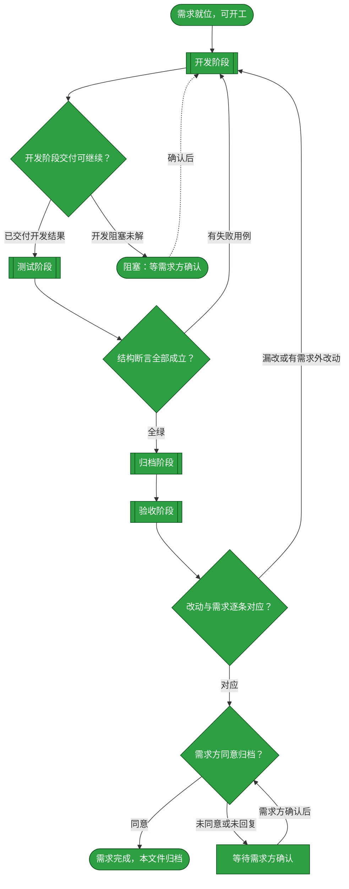
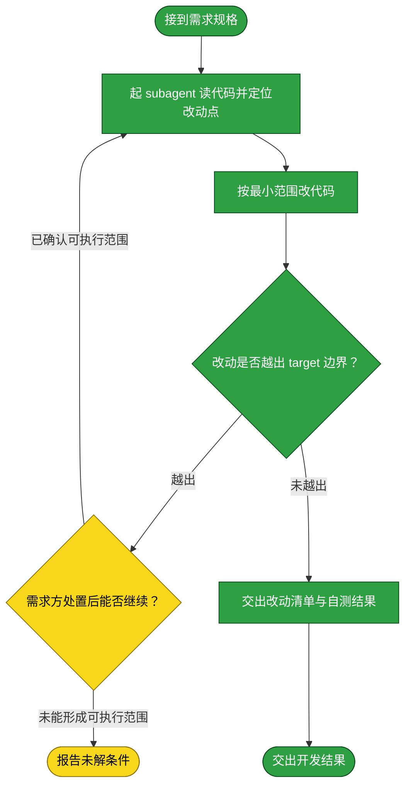
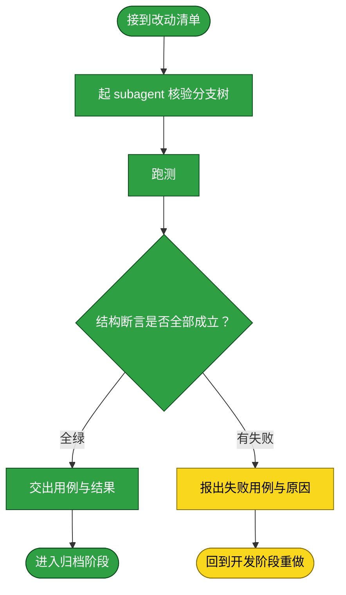
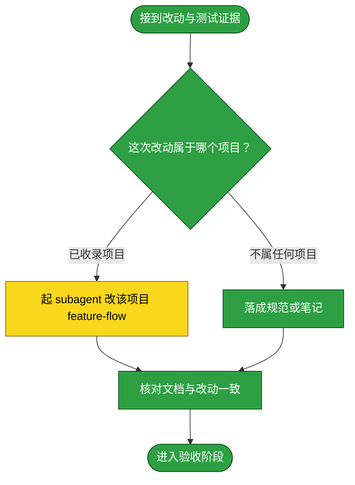
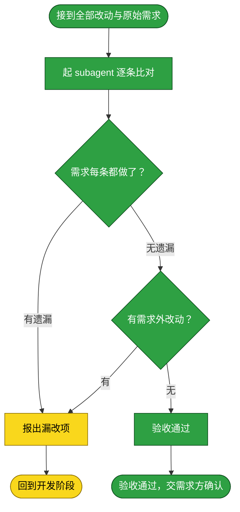

# 需求：将本地知识库与 GitHub main 分支分层

```yaml
target: 本知识库 Git 仓库的分支、assets/ 路径结构与 GitHub 远端分支
output: 本地 duoduo 与 main 分支，以及 GitHub 上对应的远端分支
prompt:
  - 修改知识库GitHub仓库管理结构，新增duoduo分支，表示当前本地的知识库，保留assets内的内容，但是main上不保留assets中的内容，但是保留结构，可以做不？
```

本需求把知识库内容分为两个分支：`duoduo` 保存当前本地知识库的完整状态，`main` 只保留 `assets/` 下的目录结构，不保留其中的资料文件。流程从当前本地仓库及已确认的目录占位方案开始，到两个本地分支内容符合要求并在 GitHub 远端复核结束；远端认证不可用时停在阻塞出口，不绕过认证或更改远端协议。

## 需求澄清

通过需求方澄清确定了资产占位方式、duoduo 内容范围与远端推送授权；裁决与代价记录如下。

### 澄清记录

四项澄清均消歧了 prompt 中的「保留结构」「当前本地」与「GitHub 仓库」：

- 问答：main 上的 assets 结构你希望怎么保留？Git 不跟踪空目录，需用占位文件保目录结构。 → 仅目录占位（推荐）
  - 裁决：assets 下所有既有目录只用 `.gitkeep` 保留，资料文件不进入 main。
  - 反论与代价：不保留 README 与模板会使 main 上的文档链接失效、说明缺席；选择仅占位符合“assets 内容不保留”的字面边界，半年后若要恢复说明需从 duoduo 恢复。
  - 验收面：main 分支 assets 路径中无资料文件，仅有目录占位，目录层级与 duoduo 一致。
- 问答：duoduo 应包含哪些内容？当前工作区有未提交改动，且 main 比 origin/main 超前 1 个提交。 → 当前完整工作区
  - 裁决：把执行时当前本地工作区状态连同现有本地提交纳入 duoduo；已有改动不丢弃。
  - 反论与代价：工作区可能包含与分支拆分无关的未提交内容；遗漏则 duoduo 不再代表当前知识库，纳入则把当前现存状态一并保存，后续可用追加提交拆分整理。
  - 验收面：duoduo 保留完整 assets 内容，提交记录含本地快照，工作区无遗留改动。
- 问答：是否授权我把两个分支的调整推送到 GitHub？ → 推送 GitHub
  - 裁决：认证可用后推送 duoduo 与 main，并只读复核远端分支引用。
  - 反论与代价：远端 main 变更会让所有协作者立即看到精简后的 assets；若目标仓库/分支并非预期，影响面扩大，因此推送前核验远端分支与提交关系，且不强推。
  - 验收面：远端两分支的引用与本地目标提交一致。
- 问答：你说“projects下没有内容”，请确认 main 要保留到哪一层？当前本地 main 是按 duoduo 保留所有子目录、每个目录放 `.gitkeep`，还未推送。 → 只保留 projects 根目录
  - 裁决：`assets/projects/` 本身保留 `.gitkeep`；其下不保留项目、仓库或取证子目录。`assets/` 其它既有目录按原层级以 `.gitkeep` 占位。
  - 反论与代价：main 不再展示项目名称和项目级结构，且知识库 lint 中依赖项目文档存在的用例会失败；项目结构的权威完整状态仍在 duoduo，若未来需要主干承载项目资料，须从 duoduo 恢复。
  - 验收面：main 的 `assets/projects/` 下仅有 `.gitkeep`，没有任何项目子目录。

### 验收锚点

以下锚点供独立验收阶段按仓库状态、目录内容与远端引用逐项核验。

- A1：duoduo 表示完整当前知识库 → duoduo 的树含 assets 资料，且本次快照已提交并工作区干净。
- A2：main 仅保留 assets 目录占位结构 → `assets/projects/` 只含 `.gitkeep`、不含子目录；assets 的其他既有目录层级以 `.gitkeep` 保留，且不含资料文件。
- A3：GitHub 两分支同步 → 远端 duoduo 与 main 分别指向对应本地提交，且无强制推送。

### 范围边界

范围仅限知识库当前 Git 仓库的 `duoduo`、`main` 分支与其 GitHub 远端引用；不改知识库规则文档，不重写或删除远端历史。

- 不做：改写共享历史、强制推送、删除其他远端分支、改动 `assets/` 以外的知识库内容。

## 主流程图



## START

开工前的就位判定：需求已在前置块里写清 `target` 与 `output`，这两项都是具体路径而非占位符，且「需求澄清」章节的验收锚点与范围边界已就位（无澄清需要时该节显式写「无」并给出理由）。本节点不出分支。

**输入**

- `REQ_READY`：前置块三键已填、澄清章节已就位的状态；来源为本文件的前置数据块与「需求澄清」章节。

**输出**

- `REQ_SPEC`：本需求的规格，即前置块的三键内容；去向为 `DEVELOP`。
- `CLARIFICATIONS`：澄清裁决与验收锚点；去向为 `DEVELOP`。

## DEVELOP

开发阶段。本阶段的产出是**功能改动本身**——不产出测试，也不落档。它按下面的子流程走。

**起独立 subagent**：本阶段由一个新起的 subagent 执行，不承接对话里的上下文。交给它的输入是 `REQ_SPEC`（前置块三键）与 `CLARIFICATIONS`（「需求澄清」章节的裁决与验收锚点），再加本节写明的边界；它在自己的上下文里读代码、改代码、把改动落到工作区，中间过程留在它那里。

**边界**：它只改 `target` 指到的内容，不改需求未提及的相邻模块；发现必须改动需求之外的代码时停下并报出，不自行扩大范围。

**项目仓库分支策略**：当 `target` 指向 `assets/projects/<项目>/<repository>/` 时，先确认该仓库当前分支是 `main`，并在 `main` 上开发、测试和验证；不为需求创建专用分支，也不安排需求分支的合并或删除。若仓库不在 `main`，或需求要求多人协作而此规则不适用，先暂停并向需求方确认，不自行切换或重置分支。

**输入**

- `REQ_SPEC`：本需求的规格；来源为 `START`。
- `CLARIFICATIONS`：需求澄清章节的裁决与验收锚点；来源为本文件的「需求澄清」章节。
- `FAILURE_REPORT`：失败用例与原因；来源为 `T_BACK`。
- `ACCEPT_FAILURE`：漏改或多余的处置要求；来源为 `C_OUT`。
- `DEV_RESOLVED`：开发阻塞已排除；来源为 `BLOCKED`。
- `DEV_RESULT`：开发子流程交付的改动清单与自测结果；来源为 `D_OUT`。
- `OPEN_QUESTION`：开发子流程交付的未解条件；来源为 `D_FAIL`。
- `TEST_VERDICT`：全绿与否；来源为 `TEST_GATE`。
- `ACCEPT_VERDICT`：逐条对应与否；来源为 `ACCEPT_GATE`。

**输出**

- `REQ_SPEC`：本轮需求规格；去向为 `D_IN`。
- `CLARIFICATIONS`：澄清裁决与验收锚点；去向为 `D_IN`。
- `FAILURE_REPORT`：上一轮失败用例与原因（若本轮由测试失败返回）；去向为 `D_IN`。
- `ACCEPT_FAILURE`：验收发现的漏改或范围外改动（若本轮由验收退回）；去向为 `D_IN`。
- `DEV_RESOLVED`：已解除的开发阻塞（若本轮由阻塞返回）；去向为 `D_IN`。
- `TEST_VERDICT`：上一轮测试判定（若有）；去向为 `D_IN`。
- `ACCEPT_VERDICT`：上一轮验收判定（若有）；去向为 `D_IN`。
- `DEV_RESULT`：改动清单与自测结果；去向为 `DEV_GATE`。
- `OPEN_QUESTION`：悬置的条件；去向为 `DEV_GATE`。



### D_IN

承接父级 `DEVELOP` 分发的本轮需求、上一轮反馈与阻塞解决结果，把它们整理成交给 subagent 的作业书。本节点不出分支。

**输入**

- `REQ_SPEC`：本轮需求规格；来源为 `DEVELOP`。
- `CLARIFICATIONS`：澄清裁决与验收锚点；来源为 `DEVELOP`。
- `FAILURE_REPORT`：上一轮失败用例与原因（若本轮由测试失败返回）；来源为 `DEVELOP`。
- `ACCEPT_FAILURE`：验收发现的漏改或范围外改动（若本轮由验收退回）；来源为 `DEVELOP`。
- `DEV_RESOLVED`：已解除的开发阻塞（若本轮由阻塞返回）；来源为 `DEVELOP`。
- `TEST_VERDICT`：上一轮测试判定（若有）；来源为 `DEVELOP`。
- `ACCEPT_VERDICT`：上一轮验收判定（若有）；来源为 `DEVELOP`。

**输出**

- `DEV_BRIEF`：作业书，含 `REQ_SPEC`、`CLARIFICATIONS`、`FAILURE_REPORT`、`ACCEPT_FAILURE`、`DEV_RESOLVED`、`TEST_VERDICT`、`ACCEPT_VERDICT`（有对应来源时附带）、范围边界及项目仓库分支策略；去向为 `D_AGENT`。

### D_AGENT

起一个独立 subagent，把 `DEV_BRIEF` 交给它，由它读代码并定位本需求要改的那一处。**为什么独立**：开发要在自己的上下文里反复读文件、试错、回退，这些中间过程对本流程其余阶段是噪声；独立 subagent 让它们留在自己的上下文里，本流程只收它的结论。

**输入**

- `DEV_BRIEF`：作业书；来源为 `D_IN`。
- `SCOPE_RESOLVED`：已确认的边界；来源为 `D_STOP`。

**输出**

- `CHANGE_POINT`：改动点，即要改的文件与位置；去向为 `D_EDIT`。

### D_EDIT

按最小范围实施改动。**最小范围**指只改需求要求的那一处行为，不顺手重构、不改格式、不升级依赖。

**输入**

- `CHANGE_POINT`：改动点；来源为 `D_AGENT`。

**输出**

- `DIFF`：本次改动；去向为 `D_SCOPE`。

### D_SCOPE

判定改动是否越出 `target` 边界。判定语义是：`DIFF` 触及的每个文件，是否都落在 `target` 所指的范围内。越界不一定是错的，但**必须报出来由需求方确认**，因为它意味着这条需求的实际影响面比它写下的 `target` 更大。

**输入**

- `DIFF`：本次改动；来源为 `D_EDIT`。

**输出**

- `SCOPE_VERDICT`：越界与否及其具体落点；去向为 `D_STOP` 或 `D_REPORT`。

### D_STOP

越界出口：把范围差异交给需求方确认；明确确认可执行的新范围或收回越界改动后回到开发，无法形成可执行范围时报告未解条件。

**输入**

- `SCOPE_VERDICT`：越界点；来源为 `D_SCOPE`。
- `SCOPE_REPLY`：需求方对越界的处置；来源为流程外部的确认动作。

**输出**

- `SCOPE_RESOLVED`：已确认的可执行边界；去向为 `D_AGENT`。
- `OPEN_QUESTION`：无法继续的未解条件；去向为 `D_FAIL`。

### D_FAIL

开发子流程阻塞出口：报告无法继续的条件，并把它交给父级 `DEVELOP` 做出口判定。

**输入**

- `OPEN_QUESTION`：无法继续的未解条件；来源为 `D_STOP`。

**输出**

- `OPEN_QUESTION`：开发阻塞条件；去向为 `DEVELOP`。

### D_REPORT

交出改动清单与开发自测结果，作为开发出口判定的输入。**开发自测不等于测试阶段**：这里只证明改动跑得起来，覆盖需求要求的行为由测试阶段负责。

**输入**

- `DIFF`：本次改动；来源为 `D_EDIT`。
- `SCOPE_VERDICT`：未越界的判定；来源为 `D_SCOPE`。

**输出**

- `DEV_RESULT`：改动清单与自测结果；去向为 `D_OUT`。

### D_OUT

开发子流程成功出口：改动已在工作区就位且未越界；将开发结果交给父级 `DEVELOP` 做出口判定。

**输入**

- `DEV_RESULT`：改动清单与自测结果；来源为 `D_REPORT`。

**输出**

- `DEV_RESULT`：改动清单与自测结果；去向为 `DEVELOP`。

## DEV_GATE

开发出口判定：只有 `DEV_RESULT` 完整且不存在未解条件时进入测试；其余状态整理为 `OPEN_QUESTION` 并转入阻塞等待。

**输入**

- `DEV_RESULT`：改动清单与自测结果；来源为 `DEVELOP`。
- `OPEN_QUESTION`：开发子流程未解的条件；来源为 `DEVELOP`。

**输出**

- `DEV_RESULT`：可测试的开发结果；去向为 `TEST`、`ARCHIVE`、`ACCEPT`。
- `OPEN_QUESTION`：阻塞条件；去向为 `BLOCKED`。

## TEST

测试阶段。本阶段的产出是对分支引用、assets 树与变更范围的**独立核验结果**。它按下面的子流程走。

**起独立 subagent**：本阶段由一个新起的 subagent 执行。它只取得需求锚点与目标 refs，不接触开发阶段的中间推理，以独立核验最终提交树。

**边界**：它只读检查 `duoduo`、`main` 的 Git tree、提交差异和 GitHub refs，不修改文件、分支或配置。结构核验判据取本需求澄清和验收锚点。

**兼容性诊断**：在 main 运行知识库 `_lint` 并原样记录结果。该套件仍断言 projects 下存在 deploy.md 与 feature-flow.md；用户已澄清 main 的 projects 子树为空，因此该诊断失败不能伪报全绿，也不构成更改 main 内容的授权。

**输入**

- `DEV_RESULT`：改动清单与自测结果；来源为 `DEV_GATE`。

**输出**

- `TEST_EVIDENCE`：用例与运行结果；去向为 `ARCHIVE`。
- `FAILURE_REPORT`：失败用例与原因；去向为 `DEVELOP`。



### T_IN

承接开发阶段交来的改动清单，整理成测试作业书。本节点不出分支。

**输入**

- `DEV_RESULT`：改动清单与自测结果；来源为 `DEV_GATE`。

**输出**

- `TEST_BRIEF`：测试作业书，含改动清单与本需求的行为要求；去向为 `T_AGENT`。

### T_AGENT

起一个独立 subagent，按 `TEST_BRIEF` 只读核验本需求的结构锚点：对比资产目录树、变更路径与本地/远端分支提交。**为什么独立**：见本章开头。它不接触开发阶段的中间推理，故独立判断目标是否满足。

**输入**

- `TEST_BRIEF`：测试作业书；来源为 `T_IN`。

**输出**

- `TEST_CASES`：本次写下的用例；去向为 `T_RUN`。

### T_RUN

运行结构核验：用 `git ls-tree -r --name-only <main-ref> -- assets` 检查资产树，用 `git diff --name-only <base>..<main-ref>` 检查改动范围，用 `git ls-remote --heads origin refs/heads/duoduo refs/heads/main` 检查远端引用。三项结构断言必须全部成立。另按知识库 [_lint/README.md](../../_lint/README.md) 在 main 执行完整 `_lint`，原样记录失败；不得将其改写成全绿或修改断言。

**输入**

- `TEST_CASES`：本次写下的用例；来源为 `T_AGENT`。

**输出**

- `RUN_RESULT`：运行输出与退出码；去向为 `T_VERDICT`。

### T_VERDICT

判定请求范围内的三项结构断言是否全部成立，且读取远端 ref 的结果与本地提交相同。_lint 的兼容性诊断单独报告其实际退出码和失败项；只有结构断言全成立才从本需求的 TEST_GATE 通过，不得声称 `_lint` 全绿。

**输入**

- `RUN_RESULT`：运行输出与退出码；来源为 `T_RUN`。

**输出**

- `TEST_VERDICT`：全绿与否；去向为 `T_PASS` 或 `T_FAIL`。

### T_PASS

结构断言通过出口：交出目录树、范围和远端 ref 核验结果，并附上 `_lint` 的真实诊断结果，作为归档阶段事实依据。本节点不出分支。

**输入**

- `TEST_VERDICT`：全绿判定；来源为 `T_VERDICT`。
- `TEST_CASES`：本次写下的用例；来源为 `T_AGENT`。

**输出**

- `TEST_EVIDENCE`：用例与运行结果；去向为 `T_OUT`。

### T_FAIL

失败出口：报出失败用例、失败原因与本次改动。**不在这里改产品代码**——改代码职责单一地落在开发阶段；测试阶段只判不改，否则判据与被判对象同出一处，绿灯失去意义。

**输入**

- `TEST_VERDICT`：失败判定；来源为 `T_VERDICT`。
- `RUN_RESULT`：运行输出；来源为 `T_RUN`。

**输出**

- `FAILURE_REPORT`：失败用例与原因；去向为 `T_BACK`。

### T_BACK

回到开发阶段的出口：带回失败报告。本节点无出边。

**输入**

- `FAILURE_REPORT`：失败用例与原因；来源为 `T_FAIL`。

**输出**

- `FAILURE_REPORT`：失败用例与原因；去向为 `DEVELOP`。

### T_OUT

测试阶段出口：结构断言均成立，且 `_lint` 的非绿结果与按需求删除项目资料的冲突已如实记录。本节点无出边。

**输入**

- `TEST_EVIDENCE`：用例与运行结果；来源为 `T_PASS`。

**输出**

- `TEST_EVIDENCE`：用例与运行结果；去向为 `ARCHIVE`。

## TEST_GATE

测试阶段的判定点：请求锚点列出的结构断言是否全部成立。main 的 `_lint` 结果单独记录，不能表述为全绿；它要求的项目文档因本需求明确不进入 main 而不存在。任何结构断言失败仍返回 `DEVELOP`，三项全部成立则进入 `ARCHIVE`。

**输入**

- `RUN_RESULT`：用例运行输出与退出码；来源为 `TEST`。

**输出**

- `TEST_VERDICT`：请求结构断言是否全部成立；去向为 `DEVELOP` 或 `ARCHIVE`。

## ARCHIVE

归档阶段。本阶段判断是否需要在 Git 之外重复记录既成事实，并把归档决策与测试未验证面交给验收阶段。它按下面的子流程走。

**起独立 subagent**：本阶段由一个新起的 subagent 执行。**为什么独立**：落档要对着一份长文档做局部改写并保持它通篇自洽，这需要通读全文，而通读的上下文不该占用本流程的其余阶段。它拿到的是改动清单与测试证据。

**边界**：它只写**已经验证过的**事实——测试没覆盖到的环节写进文档的「未验证面」，不写成已验证；不把开发过程中的取舍与来历写进流程文档，那些不归流程文档承载。

**输入**

- `DEV_RESULT`：改动清单；来源为 `DEV_GATE`。
- `TEST_EVIDENCE`：用例与运行结果；来源为 `TEST`。
- `TEST_VERDICT`：全绿与否；来源为 `TEST_GATE`。

**输出**

- `ARCHIVED`：已落档且自洽的文档；去向为 `ACCEPT`。



### A_IN

承接开发与测试两个阶段的产出，整理成落档作业书。本节点不出分支。

**输入**

- `DEV_RESULT`：改动清单；来源为 `DEV_GATE`。
- `TEST_EVIDENCE`：用例与运行结果；来源为 `T_PASS`。

**输出**

- `ARCHIVE_BRIEF`：落档作业书，含改动与已验证面；去向为 `A_LOCATE`。

### A_LOCATE

判定这次改动的落档去向。判定语义是：`target` 是否落在某个被收录项目的仓库克隆内——是则该项目的 `feature-flow.md` 是它的落档处；否（改动落在本知识库自身的规范、判据册或某目录的约定上）则按 `_meta/`、随 skill 分发的判据册、各目录 README 的归属落档。

**输入**

- `ARCHIVE_BRIEF`：落档作业书；来源为 `A_IN`。

**输出**

- `ARCHIVE_TARGET`：落档处；去向为 `A_AGENT` 或 `A_ELSE`。

### A_AGENT

起一个独立 subagent，把这次改动的既成事实写进该项目的流程文档。

**输入**

- `ARCHIVE_BRIEF`：落档作业书；来源为 `A_IN`。
- `ARCHIVE_TARGET`：落档处；来源为 `A_LOCATE`。

**输出**

- `DOC_DIFF`：文档改动；去向为 `A_CHECK`。

### A_ELSE

本需求的分支指针、提交树和远端 refs 都可由 Git 命令现取，按根 `AGENTS.md` 的取回路径规则不复制到规范、README 或 notes。故无需另写长期文档；lint 兼容性结果是本次测试证据，不作为长期事实源。

**输入**

- `ARCHIVE_TARGET`：落档处；来源为 `A_LOCATE`。

**输出**

- `DOC_DIFF`：文档改动；去向为 `A_CHECK`。

### A_CHECK

确认无需另设长期文档的判定与根 `AGENTS.md` 的取回路径规则一致，并确认目标树与远端 refs 本身保留了完整证据。本节点不出分支。

**输入**

- `DOC_DIFF`：文档改动；来源为 `A_AGENT` 或 `A_ELSE`。

**输出**

- `ARCHIVED`：已落档且自洽的文档；去向为 `A_OUT`。

### A_OUT

归档阶段出口。本节点无出边。

**输入**

- `ARCHIVED`：已落档的文档；来源为 `A_CHECK`。

**输出**

- `ARCHIVED`：已落档的文档；去向为 `ACCEPT`。

## ACCEPT

验收阶段。本阶段判定**改的是不是需求要求的**：把本次全部改动与前置块的 `prompt` 逐条比对。

**起独立 subagent**：本阶段由一个新起的 subagent 执行。**为什么独立**：验收必须由一个没有参与前三个阶段的主体来做——它若参与过，就会用自己当初的思路去核对，看不到自己的偏差。它拿到的是全部 diff（代码与文档）与 `prompt`，不接触前三阶段的中间推理。

**判定语义**：判定分两问，**两问都成立**才算通过——其一，需求要求的每一处改动都做了（不少改）；其二，改动里没有需求未要求的东西（不多改）。少改则需求未达成；多改是范围蔓延，须回到开发阶段收回，或由需求方确认扩大需求。

**边界**：它只判「对不对应」，不判「改得好不好」——代码质量、风格、测试强度属开发与测试阶段，不在这里重开。

**输入**

- `ARCHIVED`：已落档的文档；来源为 `ARCHIVE`。
- `DEV_RESULT`：改动清单；来源为 `DEV_GATE`。
- `COMPARISON`：逐条比对结果；来源为 `C_AGENT`。
- `ACCEPTED`：验收子流程交回的通过结论；来源为 `C_ACCEPT_OUT`。

**输出**

- `COMPARISON`：逐条对应关系与差异；去向为 `ACCEPT_GATE`。
- `ACCEPTED`：无遗漏且无需求外改动的验收结论；去向为 `REQUESTER_APPROVAL`。
- `ACCEPT_FAILURE`：漏改或多余的处置要求；去向为 `DEVELOP`。



### C_IN

承接归档阶段的文档与开发阶段的代码改动，合为本次全部改动。本节点不出分支。

**输入**

- `ARCHIVED`：已落档的文档；来源为 `ARCHIVE`。
- `DEV_RESULT`：改动清单；来源为 `DEV_GATE`。

**输出**

- `FULL_DIFF`：本次全部改动；去向为 `C_AGENT`。

### C_AGENT

起一个独立 subagent，把 `FULL_DIFF` 与需求逐项比对。**它必须在产出里显式列出它从 `prompt` 最后一条与验收锚点拆出的项清单**——核对逐条落在这份清单上，每条注明对应的 diff 或「无对应」。不先列清单直接给结论的验收无效：清单是复核的落点，缺了它，错拆漏拆无人能复算。

**输入**

- `FULL_DIFF`：本次全部改动；来源为 `C_IN`。
- `PROMPT_RECORD`：前置块的 `prompt` 留档；来源为本文件的前置数据块。
- `CLARIFICATIONS`：澄清裁决与验收锚点；来源为本文件的「需求澄清」章节。

**输出**

- `COMPARISON`：逐项对应关系与差异，含该 subagent 拆出的项清单；去向为 `C_COVER` 与父级 `ACCEPT`。

### C_COVER

判定需求要求的每一处改动是否都做了。判定语义是：`prompt` 的**最后一条**（当前有效的需求陈述）里的每项要求，加上「需求澄清」章节验收锚点列出的每条证据，都能在 `FULL_DIFF` 里找到对应的改动。判定逐项落在 `COMPARISON` 显式列出的项清单上，不对一段自然语言整体下结论。

**输入**

- `COMPARISON`：逐条对应关系；来源为 `C_AGENT`。

**输出**

- `COVERAGE`：覆盖与否及漏改项；去向为 `C_BACK` 或 `C_EXTRA`。

### C_EXTRA

判定改动里是否有需求未要求的东西。判定语义是：`FULL_DIFF` 里的每处改动，都能追溯到 `prompt` 里的某项要求或「需求澄清」章节的某条裁决；追不到的是范围蔓延。「需求澄清」的「范围边界」一节列出的不做事项，每出现一处即直接判范围蔓延。

**输入**

- `COVERAGE`：无遗漏的判定；来源为 `C_COVER`。

**输出**

- `EXTRA`：需求外改动；去向为 `C_BACK` 或 `C_PASS`。

### C_BACK

不通过出口：报出漏改项或需求外改动。**两种不通过都回开发阶段**——验收阶段只判不改，自行修正是它越权，且会让「谁改的」与「谁验的」重新合一。

**输入**

- `COVERAGE`：漏改项；来源为 `C_COVER`。
- `EXTRA`：需求外改动；来源为 `C_EXTRA`。

**输出**

- `ACCEPT_FAILURE`：漏改或多余的处置要求；去向为 `C_OUT`。

### C_OUT

回到开发阶段的出口。本节点无出边。

**输入**

- `ACCEPT_FAILURE`：处置要求；来源为 `C_BACK`。

**输出**

- `ACCEPT_FAILURE`：处置要求；去向为 `DEVELOP`。

### C_PASS

通过出口：需求要求的都做了、且没有需求外的改动。本节点把结果交给需求方，不自行触发归档。

**输入**

- `EXTRA`：无需求外改动的判定；来源为 `C_EXTRA`。

**输出**

- `ACCEPTED`：验收通过；去向为 `C_ACCEPT_OUT`。

### C_ACCEPT_OUT

验收子流程出口：把验收通过结论交给父级 `ACCEPT` 汇总，再由外层的 `REQUESTER_APPROVAL` 交给请求方决定是否归档。本节点不移动需求文档，也不提交或推送知识库；它只结束独立验收阶段。

**输入**

- `ACCEPTED`：验收通过；来源为 `C_PASS`。

**输出**

- `ACCEPTED`：验收通过；去向为 `ACCEPT`。

## ACCEPT_GATE

验收阶段的判定点：改动与需求是否逐条对应。判定语义分两问，两问都成立才通过——需求要求的每处改动都做了，且改动里没有需求未要求的东西。任一问不成立即回到 `DEVELOP`。

**输入**

- `COMPARISON`：逐条对应关系与差异；来源为 `ACCEPT`。

**输出**

- `ACCEPT_VERDICT`：逐条对应与否；去向为 `DEVELOP`、`REQUESTER_APPROVAL` 或 `DONE`。

## DONE

需求方于 2026-10-10 确认分支拆分已完成并明确要求归档。当前可见的 `duoduo`、`main` 本地分支分别与其 origin 跟踪分支对齐；本会话按需求方确认将本流程全部标绿。本节点输出是把本文件整篇移入 `assets/archive/`，移动后不再修改本文件；知识库 GitHub 提交与推送是移动后的仓库发布步骤，按[assets/archive/README.md](../archive/README.md)办理，不记录为本文件的流程节点状态。

**输入**

- `REQUESTER_DECISION`：需求方明确同意归档；来源为 `REQUESTER_APPROVAL`。
- `ACCEPT_VERDICT`：逐条对应与否；来源为 `ACCEPT_GATE`。

**输出**

- `ARCHIVE_MOVE`：把本文件整篇移入 `assets/archive/` 的动作；去向为流程外部的归档操作。

## REQUESTER_APPROVAL

验收通过后把结果提交给需求方，等待其明确回答是否同意把本需求归档。没有明确同意时，不得把「未回复」解释成同意，也不得自动移动文件。

**输入**

- `ACCEPTED`：验收通过；来源为 `ACCEPT`。
- `ACCEPT_VERDICT`：逐条对应与否；来源为 `ACCEPT_GATE`。
- `REQUESTER_DECISION`：需求方确认后的决定；来源为 `APPROVAL_WAIT`。

**输出**

- `REQUESTER_DECISION`：需求方明确同意或拒绝归档；去向为 `DONE` 或 `APPROVAL_WAIT`。

## APPROVAL_WAIT

需求方未同意归档时的等待出口。本节点不改变代码或文档，也不把沉默当作同意；收到需求方明确意见后重新进入 `REQUESTER_APPROVAL`。

**输入**

- `REQUESTER_DECISION`：未同意或未回复；来源为 `REQUESTER_APPROVAL`。

**输出**

- `REQUESTER_DECISION`：等待中的决定；去向为 `REQUESTER_APPROVAL`。

## BLOCKED

阻塞出口：开发阶段无法继续时停在这里等协助。阻塞事项解决后返回开发阶段；未解决前不得把开发结果送入测试。


**输入**

- `OPEN_QUESTION`：开发阶段悬置的条件；来源为 `DEV_GATE`。

**输出**

- `DEV_RESOLVED`：开发阻塞已排除；去向为 `DEVELOP`。
