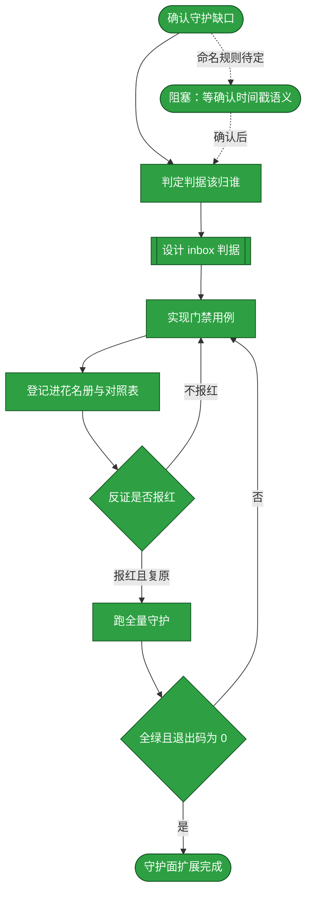
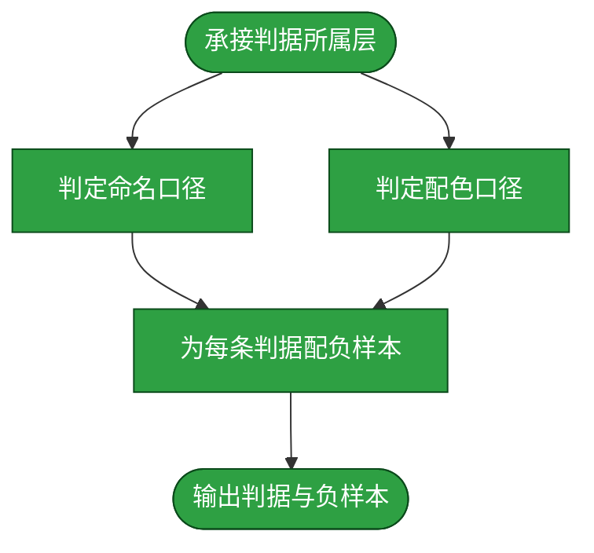

# 需求：把 inbox 目录纳入知识库的守护面

```yaml
target: _lint/
output: _lint/ 下新增 inbox 的判据与门禁；assets/inbox/README.md 的命名与配色契约
prompt:
  - 用知识库自身的真实待办做第一份
  - 新增format，需要在流程图前方使用格式化的数据结构定义好引用关系，当前req针对的是知识库中哪一部分内容，产出会在哪里，原始需求（prompt记录）
  - 更正 promote 其实是 prompt
  - 接下来构建开发流程图template
  - 有u一些固定流程需要确认一下，由于req文档是开发流程文档，需要规划每个阶段要做什么，边界是什么，是否启动subagent，以及开发阶段、测试阶段（失败则回滚到开发）、归档阶段（落档feature-flow）、验收阶段（比对文档diff和req是否匹配）。每个阶段采用独立的subagent
  - req.lint归档
```


本流程处理一条需求：知识库新增了 `assets/inbox/`，本目录承载待办需求、并以颜色标注流程节点的状态，但知识库的文档守护当前只覆盖 `assets/notes/` 的分层判据，不认这条新的命名规则与配色契约——一个不符合 `req.<业务>.<时间>.md` 的文件、或一份没有任何状态标记的流程图，都能在守护全绿的情况下留在本目录里。本流程从确认这条缺口开始，经判据设计、门禁实现、反证校验，到守护面扩展完成为止。

节点状态按 [本目录 README](README.md) 的三档配色标注：绿色为已获证据确认的环节，黄色为待执行，红色为需要协助才能继续。

## 主流程



## START

需求由「新增了 `assets/inbox/` 目录」这一动作触发，入口节点确认这条缺口是否真实存在：`assets/inbox/` 已在 `assets/` 之下，而守护的扫描面按目录递归得出；若守护面已经覆盖它，本流程到此结束，不进入后续节点。

**输入**

- `INBOX_DIR`：新增的需求目录；来源为知识库的目录变更。

**输出**

- `GAP_CONFIRMED`：缺口是否成立的判定；去向为 `SCOPE`。

## SCOPE

判定这条判据该归谁。判据是「被守护对象属于谁」而非「文件放在哪个目录」：`assets/inbox/` 的文件是**本知识库自己的文档**，描述的是知识库自身的待办与流程，不属于任何被收录项目的源码或构建产物，因此它的判据归 `_lint/`，写在项目内即放错层（判据见根 [AGENTS.md](../../AGENTS.md) 的「测试」一节）。

这一判定同时决定后续节点的落点：判据册在 `_lint/README.md`，实现落在 `_lint/` 下的用例文件。

**输入**

- `GAP_CONFIRMED`：缺口成立的判定；来源为 `START`。
- `RESOLVED`：已确认的判据口径；来源为 `BLOCKED`。

**输出**

- `LAYER`：判据所属层，值为 `_lint/`；去向为 `DESIGN`。

## DESIGN

设计 inbox 的判据，拆成命名与状态两条，二者都可机械判定。本节点须另起一张图方能讲清，其内部步骤分派给四个子节点：先定判据的判定口径，再为每条判据配一个必须报红的负样本。



### D_START

入口子节点：接收上游给出的判据所属层，并把设计工作分派给命名与配色两条。两条判据各自独立，可并行定，故 `D_START` 分出两条出边；两条都完成才进入 `D_NEGATIVE`。

**输入**

- `LAYER`：判据所属层；来源为 `SCOPE`。

**输出**

- `D_NAMING_IN`：命名判据的设计任务；去向为 `D_NAMING`。
- `D_COLOR_IN`：配色判据的设计任务；去向为 `D_COLOR`。

### D_NAMING

定下命名判据的判定口径：`assets/inbox/` 下每个文件名（README 除外）匹配 `^req\.[a-z0-9]+-[0-9]{8}-[0-9]{6}\.md$`。业务段与时间段的形态由模式判定；**投递时刻的真实性不判**——它与文件名无从对照，能判的是「时间段的形态是 `YYYYMMDD-HHMMSS`」这一条。本节点不出分支。

**输入**

- `D_NAMING_IN`：命名判据的设计任务；来源为 `D_START`。

**输出**

- `NAMING_CRITERION`：命名判据的判定口径；去向为 `D_NEGATIVE`。

### D_COLOR

定下配色判据的判定口径：每份需求文档的每张 mermaid 图，其节点须至少被一条 `class` 语句归入三档状态之一，且三档取色各由一处 `classDef` 定义。判定的是「每个节点都带状态」而非「三档颜色都出现」——一张全绿的图是合法状态，收件箱里没有阻塞项正是常态。本节点不出分支。

**输入**

- `D_COLOR_IN`：配色判据的设计任务；来源为 `D_START`。

**输出**

- `COLOR_CRITERION`：配色判据的判定口径；去向为 `D_NEGATIVE`。

### D_NEGATIVE

为两条判据各配一个负样本：一个历史遗留的违规文件名、一份节点无状态标记的图。负样本的作用是证明判据不是死规则——一条放宽到什么都不报的判据，其绿灯不构成守护。两份负样本都就位才输出。

**输入**

- `NAMING_CRITERION`：命名判据的判定口径；来源为 `D_NAMING`。
- `COLOR_CRITERION`：配色判据的判定口径；来源为 `D_COLOR`。

**输出**

- `CRITERIA`：命名与状态两条判据的判定口径及其负样本；去向为 `IMPL`。

### D_OUT

出口子节点：两套口径与两份负样本齐备后，设计工作结束，判据交给实现节点。本节点无出边。

**输入**

- `CRITERIA`：命名与状态两条判据的判定口径及其负样本；来源为 `D_NEGATIVE`。

**输出**

- `CRITERIA`：命名与状态两条判据的判定口径及其负样本；去向为 `IMPL`。

## IMPL

在 `_lint/` 下新建用例文件实现 `DESIGN` 给出的两条判据。实现遵循本目录既有用例的三条形态：文档集合**发现而非登记**（遍历得到，不靠清单），每条判据**两个方向都断言**（既断言它报红、也断言它对正常文本沉默），失败信息给出**修正方向**而非只给结论。

若 `DESIGN` 的判据不足以判定某份文档（例如出现了三档之外的颜色语义），回到 `DESIGN` 补判据，不在实现里就地放宽。

**输入**

- `CRITERIA`：两条判据的判定口径；来源为 `DESIGN`。

**输出**

- `GATE_FILE`：新用例文件的路径；去向为 `REGISTER`。

## REGISTER

把新门禁登记进两处花名册——`_lint/test_suite_integrity.py` 的 `GATE_FLOOR` 给它一个用例数下限，`_lint/README.md` 的门禁对照表给它一行说明。漏登记的后果是可被静默删除：守护本身没有守护，而运行仍然全绿。

**输入**

- `GATE_FILE`：新用例文件；来源为 `IMPL`。

**输出**

- `ROSTERED`：已登记的花名册；去向为 `VERIFY`。

## VERIFY

反证校验：把一份文档按判据的违规形态临时改坏，确认新门禁确实报红；报红后**立即复原**该文件并复跑确认回到绿。反证不依赖记忆——备份放工作区内、复原范围锚定到那一个文件，用 `trap ... EXIT` 兜底，单次调用被超时杀掉时只有 `trap` 能保证复原。

判据是「报红**且**复原后回到绿」两条同时成立。只报红不复原，留下的是一份坏文档；只跑绿不做反证，证明不了这条门禁真的在判。

**输入**

- `ROSTERED`：已登记的花名册；来源为 `REGISTER`。

**输出**

- `RED_PROVEN`：报红且已复原的判定；去向为 `BASELINE`。

## BASELINE

在完整知识库上跑全量守护：`UV_CACHE_DIR=.uv-cache uv run --with pytest==9.1.1 pytest _lint -q`。先跑基线再改判据实现的理由在 `_lint/README.md` 的 `LINT_FIX`：报红时先问「是不是判据读错了」。

**输入**

- `RED_PROVEN`：报红且已复原的判定；来源为 `VERIFY`。

**输出**

- `LINT_RESULT`：全量运行的输出与退出码；去向为 `GREEN`。

## GREEN

判定这次运行是否可采信。判据是**全绿且退出码为 0**，且运行期守卫未被绕过——收集到的用例数不为零、每条用例都声明了断言、没有用例越过墙钟预算。靠放宽断言、删用例、跳过反证换来的绿灯不构成通过。

**输入**

- `LINT_RESULT`：全量运行的输出与退出码；来源为 `BASELINE`。

**输出**

- `GUARDED_GREEN`：可采信的全绿；去向为 `DONE`。

## DONE

收尾节点：守护面扩展完成。这一步同时触发本需求自身的归位——按 [本目录 README](README.md) 的边界声明，需求完成后本目录不放存档，故本文件与其判据实现一并成为知识库的既成部分，本需求文档整篇移入 [assets/archive/](../archive/README.md)。

**输入**

- `GUARDED_GREEN`：可采信的全绿；来源为 `GREEN`。

**输出**

- 无。

## BLOCKED

阻塞出口。当 `DESIGN` 无法确定判据口径时进入此节点并停在这里等待协助——例如 `<时间>` 段的确切语义未定，或配色契约的权威承载处未定。停在阻塞态是**本流程的正常出口**，不是失败：一项没有明确判据的需求，推进它只会产出一个自己都判不了的实现。

解除条件是把口径确认下来；确认后沿虚线出边回到 `SCOPE` 重走后续节点，不接着用阻塞前的假设往下推。

**输入**

- `OPEN_QUESTION`：悬置的判据口径问题；来源为流程外部的确认动作。

**输出**

- `RESOLVED`：已确认的口径；去向为 `SCOPE`。
