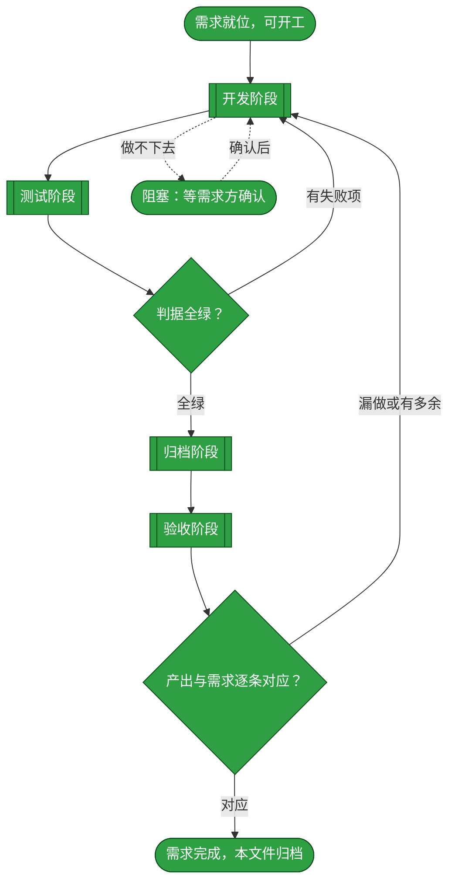
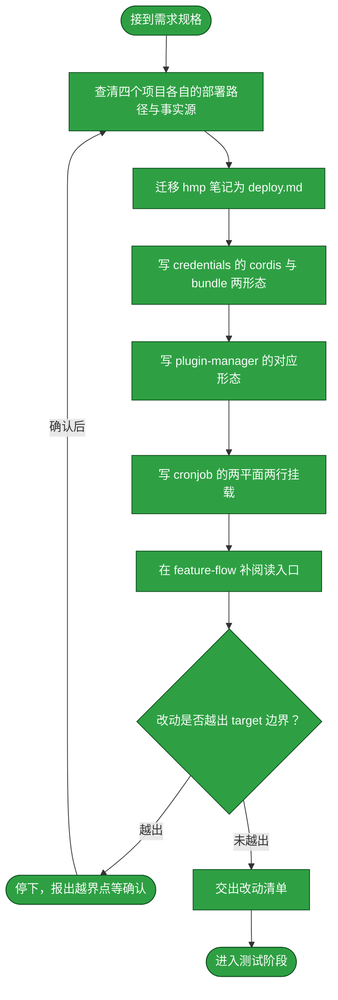
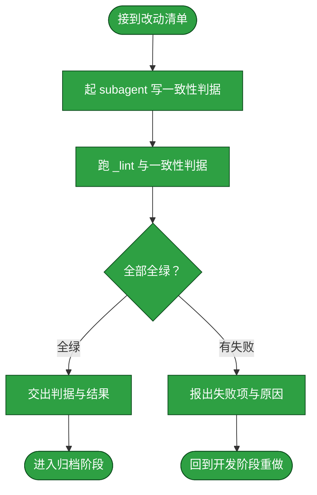
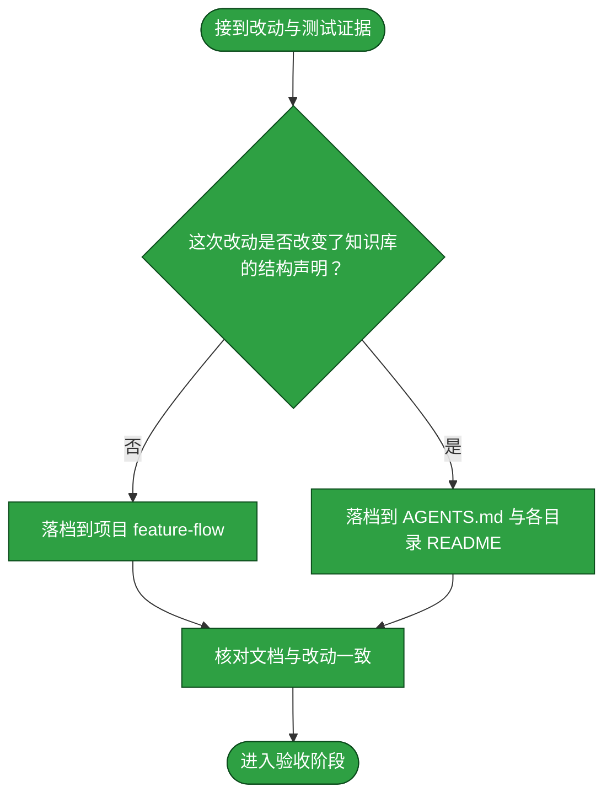
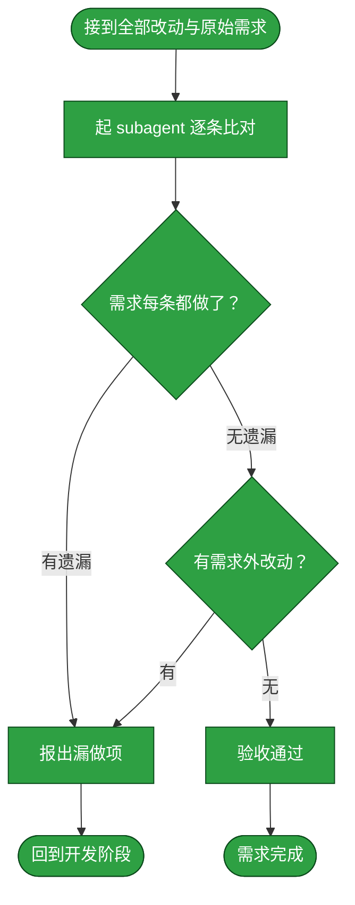

# 需求：为每个被收录项目补部署/使用说明文档

```yaml
target: assets/projects/<项目>/（四个项目：dsh-credentials、dsh-cronjob、dsh-plugin-manager、home-media-pilot），各项目目录下新增 deploy.md；并迁移 assets/notes/deploy-home-media-pilot.md
output: assets/projects/<项目>/deploy.md 四份；assets/notes/deploy-home-media-pilot.md 整篇移入 assets/projects/home-media-pilot/deploy.md 后删除；各项目 feature-flow.md 的阅读入口指向该文档
prompt:
  - project下面的每一个project需要提供部署/使用方式说明。比如hmp就要提供docker部署方式，credentials就需要分别提供bundle和动态cordis两种不是方式
  - 使用相对路径，部署时需要增加.env文件来配置环境信息
  - （追加说明）文档内引用的路径写成相对、不写绝对路径；先只改 hmp（Docker 部署那份），其余三份按需判断
```

本需求要解的是**部署与使用方式没有承载处**这件事。`assets/projects/` 下四个项目各有 `feature-flow.md`，它讲的是项目已实现的流程主干与分支，不讲「拿到这个项目的人怎么把它装起来、跑起来、用起来」。这些事实当前散落在各处：`home-media-pilot` 的部署做法在 `assets/notes/deploy-home-media-pilot.md`，`dsh-credentials`、`dsh-plugin-manager`、`dsh-cronjob` 的构建与挂载做法只在各自仓库克隆的 `README.md` 里。后者的形态正是本知识库明确不采纳的——`AGENTS.md` 与 `assets/notes/README.md` 都写明「单个项目的流程与结构归 `<项目>/feature-flow.md`，此处不放它的副本」，而部署方式属于单个项目的事实。本需求从为四个项目各建一份部署/使用说明开始，到把 `home-media-pilot` 的那篇既有笔记按同一归属迁入为止。四份文档只写各自项目**当前已实现**的部署路径，不写尚未接线的能力。

## 主流程图



## 状态配色

本文档的取色值在本节定死，不取渲染器默认值——默认值随渲染器主题变化，那样颜色就不承载状态了。三档与 [本目录 README](README.md) 的对应关系一致：

| 档位 | 颜色 | 取值 | 含义 |
| --- | --- | --- | --- |
| 待执行 | 黄 | `fill:#f9d71c,stroke:#8a6d00,color:#000` | 尚未开始，或已开始但还没拿到结果 |
| 已执行 | 绿 | `fill:#2ea043,stroke:#0b4a1b,color:#fff` | 已完成，且结果经证据确认 |
| 阻塞 | 红 | `fill:#d73a49,stroke:#7d1220,color:#fff` | 卡住，需要外部协助才能继续 |

「经证据确认」的判定：该节点的产出能被一条**可复算的命令输出**支撑——开发节点的证据是四份文档与笔记迁移的工作区 diff，测试节点的证据是判据脚本的运行输出，归档节点的证据是落档后的文档与 diff 指向同一事实，验收节点的证据是逐条比对表。节点只有在其证据可当场复算时才标绿。

本需求的「全绿」判据不是单元测试套件，而是**文档与其事实源一致**：知识库自己的文档判据 `UV_CACHE_DIR=.uv-cache uv run --with pytest==9.1.1 pytest _lint -q` 全绿且退出码 0，**外加**本需求自定的四份文档一致性判据（见 `T_AGENT` 的行为面）。理由是这两者回答不同问题：`_lint` 判形态与归层，一致性判据判「文档说的与工程里的事实是否同一件」。

## START

开工前的就位判定：需求已在前置块里写清 `target` 与 `output`，且「部署方式目前没有承载处」这一事实已取证。本节点不出分支。

**输入**

- `REQ_READY`：前置块三键已填、缺口已取证的状态；来源为本文件的前置数据块与下方实测记录。

**输出**

- `REQ_SPEC`：本需求的规格，即前置块的三键内容；去向为 `DEVELOP`。

### 已取证的缺口事实（随需求携带，勿推翻）

1. **四个项目均无部署文档**：`assets/projects/` 下每个项目目录只有 `<仓库克隆>/` 与 `feature-flow.md` 两项，无任何部署或使用说明文件（`find` 查 `*deploy*`／`*usage*`／`*install*` 无命中）。
2. **四份事实源各自的形态不同，不可套同一模板**：
   - `home-media-pilot`：走容器路线，部署机只从 GHCR 拉镜像、不构建；已有 `assets/notes/deploy-home-media-pilot.md` 承载完整做法（含 Compose 全文与故障处置）。
   - `dsh-credentials`：DSH 插件，支持 **cordis（动态，`cordis_define` + `cordis_run`）** 与 **bundle（随 profile 常驻，`dsh plugin add file:<工程>`）** 两种**平级**落地形态，业务代码一份、只有 `adapters/` 分叉。两种方式**都要写**。
   - `dsh-plugin-manager`：同样两形态，但 `bundle.patch.yml` 与 `package.json` 显示其 bundle 形态是**已交付**路径，cordis 形态是开发期即时验证路径；原文 README 用词为「开发期即时验证」与「交付分发」，与 credentials 的平级关系**不同**，撰写时按各自 `package.json`／patch／README 的实际措辞取用，不互相套用。
   - `dsh-cronjob`：无「落地形态」之分，而是**两平面两行**组合——host 平面挂 `@deepseek-ai/dsh-cronjob`（发布跨会话 `cronjobs` 服务，不得置于 agent preset），agent preset 挂 `@deepseek-ai/dsh-cronjob/tool-cronjob`（消费 `cronjobs` + `tools`）。示例见克隆内 `examples/cordis.overlay.yml`。
3. **`assets/notes/deploy-home-media-pilot.md` 放错层**：它通篇描述 `home-media-pilot` 这一个项目的部署事实，与本需求要新建的 `assets/projects/home-media-pilot/deploy.md` 是同一份东西。`assets/notes/README.md` 的准入判据第二条（「没有别处可放」）与 [_lint/test_doc_placement.py](../_lint/test_doc_placement.py) 的判据方向一致——该笔记不点名克隆内路径，故当前守护抓不到，但归层判据归撰写者判断，不靠守护全绿。**处置是迁移而非保留**：内容按新文档形态并入，笔记整篇删除，不留副本。
4. **`AGENTS.md` 的取回路径写法约束**：凡事实的权威承载在工程本身（源码、配置、目录结构、命令输出）时，写取回路径而非取值；能从工程自行取回的值（版本号、端口、文件清单）不抄进文档。**例外是可复算的完整配置**：`deploy-home-media-pilot.md` 的 Compose 全文是刻意保留的——它给出的是「使 agent 无需回工程取配置即可完成部署」的可用产物，其取值随主机而异且不在工程内。撰写四份文档时逐条判断，不因为「有先例」而一律抄配置。

## DEVELOP

开发阶段。本阶段的产出是**四份 deploy.md 与一次笔记迁移**——不产出判据脚本，也不落档。它按下面的子流程走。

**起独立 subagent**：本阶段由一个新起的 subagent 执行，不承接对话里的上下文。交给它的输入只有 `target`、`output`、`prompt` 与本节写明的边界；它在自己的上下文里读克隆、写文档，中间过程留在它那里。

**边界**：它只改 `target` 指到的内容。以下动作均属越界，须停下报出而非自行处置：改四个项目仓库克隆内的任何文件（含其 `README.md`——那些面向该仓库的开发者，不是本知识库的产物）、改 `feature-flow.md` 的流程内容（只允许在它已有结构内补一处指向 deploy.md 的阅读入口）、改 `AGENTS.md` 与各目录 `README.md` 的边界声明（那是需求方的裁决面，不是本需求的产物）、改 `_lint/` 的判据。

**方向约束（不得偏离本质）**：

1. **一项目一文档，落在该项目目录下**：路径为 `assets/projects/<项目>/deploy.md`，与 `feature-flow.md` 并列。职责分离是这条格式的理由——`feature-flow.md` 讲流程，`deploy.md` 讲怎么装起来、跑起来、用起来；两份不互相复述。
2. **每份文档取名该项目的真实部署路径，不强求四份同构**：`home-media-pilot` 是 Docker 拉镜像部署，`dsh-credentials` 与 `dsh-plugin-manager` 各写 cordis 与 bundle 两形态，`dsh-cronjob` 写两平面两行挂载。**四份文档的章节结构可以不同**——强行同构会让某个项目写不出它真正需要说清的事。
3. **每份文档须自足可执行**：读者（尤其是 agent）拿着这一份就该能完成部署与基本使用，不必回克隆翻 README。故必要的命令、配置形态、前置条件、验证方式、失败处置都要在文档内。判据是「按这份文档从零做，能否跑通」，不是「行数够不够」。
4. **写明适用范围与失效条件**：这份部署方式在什么条件下成立、什么条件下不成立（如 hmp 的 amd64-only、credentials 的 `~/.ssh` 可写要求、cronjob 的 host 平面不得进 preset）。无条件的断言与有条件的断言须能分辨。
5. **不写未验证面为已验证**：克隆内 README 与 `tests/README.md` 明确标注为未验证的环节（如 cronjob 的「无一次真实进程内的定时触发」、credentials 的「密码认证对真实服务器未证到」），在 deploy.md 中如实标注为未验证，不写成可用。
6. **不含密钥与凭据**：文档内不放任何凭据、令牌、私钥或内网地址（`assets/notes/README.md` 的写入形态末条同样适用）。
7. **`home-media-pilot` 走迁移不走新写**：既有笔记的内容按新路径与命名并入 `deploy.md`，删掉笔记本体，不在两处并存。

**输入**

- `REQ_SPEC`：本需求的规格；来源为 `START`。
- `REJECT_REPORT`：判据失败项与原因；来源为 `T_BACK`。
- `ACCEPT_FAILURE`：漏做或多余的处置要求；来源为 `C_OUT`。
- `RESOLVED`：已确认的条件；来源为 `BLOCKED`。
- `TEST_VERDICT`：全绿与否；来源为 `TEST_GATE`。
- `ACCEPT_VERDICT`：逐条对应与否；来源为 `ACCEPT_GATE`。

**输出**

- `DEV_RESULT`：四份文档与迁移的改动清单；去向为 `TEST`、`ARCHIVE`、`ACCEPT`。
- `OPEN_QUESTION`：悬置的条件；去向为 `BLOCKED`。



### D_IN

承接 `START` 交来的需求规格，把它整理成交给 subagent 的作业书。本节点不出分支。

**输入**

- `REQ_SPEC`：本需求的规格；来源为 `START`。

**输出**

- `DEV_BRIEF`：作业书，含 `target`、`output`、`prompt` 与本节边界；去向为 `D_PROBE`。

### D_PROBE

先查清事实再动手：对四个项目各自确认它的部署路径是什么、事实源在克隆的哪些文件里、哪些能力已实现哪些未验证。这一步是诊断，不写文档。判据是**逐个项目落到具体文件**（`package.json` 的 `files`／`dsh` 字段、`bundle.patch.yml`、`examples/cordis.overlay.yml`、`docker-compose.yml`、`.github/workflows/`、`tests/README.md`），而不是从项目名推断。

**输入**

- `DEV_BRIEF`：作业书；来源为 `D_IN`。
- `SCOPE_RESOLVED`：已确认的边界；来源为 `D_STOP`。

**输出**

- `DEPLOY_FACTS`：四个项目各自的部署路径与事实源清单；去向为 `D_HMP`。

### D_HMP

把 `assets/notes/deploy-home-media-pilot.md` 的内容按新路径迁移为 `assets/projects/home-media-pilot/deploy.md`：保留其可执行产物（Compose 全文、升级命令、验证三项、故障处置），调整标题与首段使其面向该项目的读者，随后整篇删除原笔记。

**输入**

- `DEPLOY_FACTS`：事实源清单；来源为 `D_PROBE`。

**输出**

- `HMP_DOC`：hmp 的部署文档与笔记删除；去向为 `D_CRED`。

### D_CRED

写 `assets/projects/dsh-credentials/deploy.md`：**cordis 与 bundle 两种方式都要有**，各自写全从构建到生效的步骤、前置条件、验证方式与已知限制。两形态的差别只在构建期 adapter 映射这一点须写明，使读者知道业务代码不分叉。

**输入**

- `HMP_DOC`：hmp 的部署文档；来源为 `D_HMP`。

**输出**

- `CRED_DOC`：credentials 的部署文档；去向为 `D_PGM`。

### D_PGM

写 `assets/projects/dsh-plugin-manager/deploy.md`：按该项目自身 `package.json`、`bundle.patch.yml` 与 README 的实际措辞，写清其两形态各自的用途差异（哪一种是交付路径、哪一种是开发期验证路径）与落地步骤。

**输入**

- `CRED_DOC`：credentials 的部署文档；来源为 `D_CRED`。

**输出**

- `PGM_DOC`：plugin-manager 的部署文档；去向为 `D_CRON`。

### D_CRON

写 `assets/projects/dsh-cronjob/deploy.md`：写清 host 平面与 agent preset 两行各自的挂载位置、为何不得互换、配置项与作业定义的存放与使用方式（作业 YAML 落在哪、九个工具怎么用），以及该项能力的未验证面。

**输入**

- `PGM_DOC`：plugin-manager 的部署文档；来源为 `D_PGM`。

**输出**

- `CRON_DOC`：cronjob 的部署文档；去向为 `D_ENTRY`。

### D_ENTRY

在四个项目的 `feature-flow.md` 内各补一处指向同目录 `deploy.md` 的阅读入口，使按 `AGENTS.md` 的「先读流程文档」路径进来的读者能一步找到部署说明。**只补入口，不改流程内容**。

**输入**

- `CRON_DOC`：cronjob 的部署文档；来源为 `D_CRON`。

**输出**

- `ENTRY_DIFF`：四处阅读入口的改动；去向为 `D_SCOPE`。

### D_SCOPE

判定改动是否越出 `target` 边界。判定语义是：`HMP_DOC`、`CRED_DOC`、`PGM_DOC`、`CRON_DOC`、`ENTRY_DIFF` 触及的每个文件，是否都落在 `target` 所指的范围内。越界不一定是错的，但**必须报出来由需求方确认**。

**输入**

- `ENTRY_DIFF`：阅读入口改动；来源为 `D_ENTRY`。

**输出**

- `SCOPE_VERDICT`：越界与否及其具体落点；去向为 `D_STOP` 或 `D_REPORT`。

### D_STOP

越界出口：停下并把越界点报给需求方，等其确认是扩大 `target` 还是收回改动。

**输入**

- `SCOPE_VERDICT`：越界点；来源为 `D_SCOPE`。
- `SCOPE_REPLY`：需求方对越界的处置；来源为流程外部的确认动作。

**输出**

- `SCOPE_RESOLVED`：已确认的边界；去向为 `D_PROBE`。

### D_REPORT

交出改动清单与自测结果，作为进入测试阶段的输入。**开发自测不等于测试阶段**：这里只证明文档已落盘且格式可读。

**输入**

- `ENTRY_DIFF`：阅读入口改动；来源为 `D_ENTRY`。
- `SCOPE_VERDICT`：未越界的判定；来源为 `D_SCOPE`。

**输出**

- `DEV_RESULT`：改动清单；去向为 `D_OUT`。

### D_OUT

开发阶段出口：四份文档与笔记迁移已在工作区就位且未越界。本节点无出边。

**输入**

- `DEV_RESULT`：改动清单；来源为 `D_REPORT`。

**输出**

- `DEV_RESULT`：改动清单；去向为 `TEST`。

## TEST

测试阶段。本阶段的产出是**判据与它们的运行结果**。它按下面的子流程走。

**起独立 subagent**：本阶段由一个新起的 subagent 执行。**为什么独立**：写判据的人应当是找出文档缺陷的人，独立于撰写者才不会沿用撰写者的思路去验证撰写者自己的假设。它拿到的是改动清单与本需求的行为要求，不接触开发阶段的中间推理。

**边界**：它只写覆盖本需求行为面的判据，不借机扩充 `_lint/` 的守护面；判据失败时它**不改文档**，只报出失败。

**判据失败回到开发阶段**：失败不就地绕过，而是回到 `DEVELOP` 重做、判据重跑。

**跑法与判据**：两部分都要跑，且都以退出码 0 为判据——其一是本知识库既有的 `UV_CACHE_DIR=.uv-cache uv run --with pytest==9.1.1 pytest _lint -q`（形态与归层的既有守护必须仍全绿）；其二是本需求自己的一致性判据。

**输入**

- `DEV_RESULT`：改动清单；来源为 `DEVELOP`。

**输出**

- `TEST_EVIDENCE`：判据与运行结果；去向为 `ARCHIVE`。
- `REJECT_REPORT`：失败项与原因；去向为 `DEVELOP`。



### T_IN

承接开发阶段交来的改动清单，整理成测试作业书。本节点不出分支。

**输入**

- `DEV_RESULT`：改动清单；来源为 `DEVELOP`。

**输出**

- `TEST_BRIEF`：测试作业书，含改动清单与本需求的行为要求；去向为 `T_AGENT`。

### T_AGENT

起一个独立 subagent，按 `TEST_BRIEF` 写覆盖本需求行为面的判据。**为什么独立**：见本章开头。

必须覆盖的行为面（判据由它自行设计，此处只列行为）：

1. **四份文档都在位**：`assets/projects/<项目>/deploy.md` 对四个项目逐一存在。
2. **笔记已迁移而非并存**：`assets/notes/deploy-home-media-pilot.md` 不存在，且其承载的部署做法在 `home-media-pilot/deploy.md` 内可见。
3. **credentials 两种方式都在**：`dsh-credentials/deploy.md` 同时含 cordis 形态与 bundle 形态的落地方式。
4. **文档内的命令可复算**：文档给出的构建／测试／部署命令，其入口在对应克隆内真实存在（如 `package.json` 的 `scripts`、`bundle.patch.yml` 的路径、`.github/workflows/` 的工作流名）。**判据是「命令指向的入口存在」，不是「命令此刻能跑通」**——跑通需要 registry、GUI、容器运行时与 root，属该项目自己的测试层，不在本知识库。
5. **文档不含凭据**：四份文档内不出现令牌、私钥、密码或内网地址。
6. **既有守护仍全绿**：`_lint` 套件全绿且退出码为 0。

**输入**

- `TEST_BRIEF`：测试作业书；来源为 `T_IN`。

**输出**

- `CHECKS`：本次写下的判据；去向为 `T_RUN`。

### T_RUN

运行判据。跑两部分：既有 `_lint` 套件，与本次新增的一致性判据。判据是全部通过且退出码为 0。

**输入**

- `CHECKS`：本次写下的判据；来源为 `T_AGENT`。

**输出**

- `RUN_RESULT`：运行输出与退出码；去向为 `T_VERDICT`。

### T_VERDICT

判定是否全绿。判定语义是：两部分判据全部通过，且运行未被绕过——不靠删判据、放宽断言、跳过用例换取绿灯。

**输入**

- `RUN_RESULT`：运行输出与退出码；来源为 `T_RUN`。

**输出**

- `TEST_VERDICT`：全绿与否；去向为 `T_PASS` 或 `T_FAIL`。

### T_PASS

全绿出口：交出本次判据与运行结果，作为归档阶段的事实依据。本节点不出分支。

**输入**

- `TEST_VERDICT`：全绿判定；来源为 `T_VERDICT`。
- `CHECKS`：本次写下的判据；来源为 `T_AGENT`。

**输出**

- `TEST_EVIDENCE`：判据与运行结果；去向为 `T_OUT`。

### T_FAIL

失败出口：报出失败项、原因与本次改动。**不在这里改文档**——测试阶段只判不改，否则判据与被判对象同出一处，绿灯失去意义。

**输入**

- `TEST_VERDICT`：失败判定；来源为 `T_VERDICT`。
- `RUN_RESULT`：运行输出；来源为 `T_RUN`。

**输出**

- `REJECT_REPORT`：失败项与原因；去向为 `T_BACK`。

### T_BACK

回到开发阶段的出口：带回失败报告。本节点无出边。

**输入**

- `REJECT_REPORT`：失败项与原因；来源为 `T_FAIL`。

**输出**

- `REJECT_REPORT`：失败项与原因；去向为 `DEVELOP`。

### T_OUT

测试阶段出口：判据全绿，交出判据与结果。本节点无出边。

**输入**

- `TEST_EVIDENCE`：判据与运行结果；来源为 `T_PASS`。

**输出**

- `TEST_EVIDENCE`：判据与运行结果；去向为 `ARCHIVE`。

## TEST_GATE

测试阶段的判定点：本次判据是否全绿。判定语义是全部通过且运行未被绕过；任一条不成立即判失败。失败走回 `DEVELOP`，全绿则进入 `ARCHIVE`。

**输入**

- `RUN_RESULT`：判据运行输出与退出码；来源为 `TEST`。

**输出**

- `TEST_VERDICT`：全绿与否；去向为 `DEVELOP` 或 `ARCHIVE`。

## ARCHIVE

归档阶段。本阶段的产出是**落档后的文档**——把这次改动造成的既成事实写进它该在的地方。它按下面的子流程走。

**起独立 subagent**：本阶段由一个新起的 subagent 执行。**为什么独立**：落档要对 `AGENTS.md` 的目录结构声明与 `assets/notes/README.md` 的准入判据做局部改写并保持通篇自洽，这需要通读全文。它拿到的是改动清单与测试证据。

**边界**：它只写**已经验证过的**事实；不把开发过程中的取舍写进规范，那些归本文档的正文。本需求的落档处是知识库自身的结构声明——因为新增了一类项目产物（`deploy.md`），这改变了 `assets/projects/` 的边界声明。

**输入**

- `DEV_RESULT`：改动清单；来源为 `DEVELOP`。
- `TEST_EVIDENCE`：判据与运行结果；来源为 `TEST`。
- `TEST_VERDICT`：全绿与否；来源为 `TEST_GATE`。

**输出**

- `ARCHIVED`：已落档且自洽的文档；去向为 `ACCEPT`。



### A_IN

承接开发与测试两个阶段的产出，整理成落档作业书。本节点不出分支。

**输入**

- `DEV_RESULT`：改动清单；来源为 `DEVELOP`。
- `TEST_EVIDENCE`：判据与运行结果；来源为 `T_PASS`。

**输出**

- `ARCHIVE_BRIEF`：落档作业书，含改动与已验证面；去向为 `A_LOCATE`。

### A_LOCATE

判定这次改动的落档去向。判定语义是：本需求新增了 `assets/projects/<项目>/deploy.md` 这一类产物，它改变了 `assets/projects/` 的边界声明（该目录下现在承载 `feature-flow.md` 与 `deploy.md` 两类文档），故落档处是 `AGENTS.md` 的「目录结构」与「项目目录的阅读方式」两节，以及 `assets/notes/README.md` 中与项目归属相关的表述。

**输入**

- `ARCHIVE_BRIEF`：落档作业书；来源为 `A_IN`。

**输出**

- `ARCHIVE_TARGET`：落档处；去向为 `A_AGENT` 或 `A_ELSE`。

### A_AGENT

把本次改动的既成事实写进项目流程文档的落档分支。本需求走 `A_ELSE`，此节点保留为同类需求的出口。本节点不出分支。

**输入**

- `ARCHIVE_BRIEF`：落档作业书；来源为 `A_IN`。
- `ARCHIVE_TARGET`：落档处；来源为 `A_LOCATE`。

**输出**

- `DOC_DIFF`：文档改动；去向为 `A_CHECK`。

### A_ELSE

落档到结构声明的分支：在 `AGENTS.md` 的目录结构与项目阅读方式两节写入 `deploy.md` 这一类产物的位置与读法，使后续会话据边界判据即可判断部署事实归这一层；并核对 `assets/notes/README.md` 与 `assets/inbox/README.md` 中「单个项目归项目目录」的表述是否已覆盖部署文档，未覆盖则补。

**输入**

- `ARCHIVE_BRIEF`：落档作业书；来源为 `A_IN`。
- `ARCHIVE_TARGET`：落档处；来源为 `A_LOCATE`。

**输出**

- `DOC_DIFF`：文档改动；去向为 `A_CHECK`。

### A_CHECK

核对落档结果与改动一致：结构声明描述的位置与实际落盘的四份文档指向同一事实。本节点不出分支。

**输入**

- `DOC_DIFF`：文档改动；来源为 `A_AGENT` 或 `A_ELSE`。

**输出**

- `ARCHIVED`：已落档且自洽的文档；去向为 `A_OUT`。

### A_OUT

归档阶段出口。本节点无出边。

**输入**

- `ARCHIVED`：已落档的文档；来源为 `A_CHECK`。

**输出**

- `ARCHIVED`：已落档的文档；去向为 `ACCEPT`。

## ACCEPT

验收阶段。本阶段判定**做的是不是需求要求的**：把本次全部改动与前置块的 `prompt` 逐条比对。

**起独立 subagent**：本阶段由一个新起的 subagent 执行。**为什么独立**：验收必须由一个没有参与前三个阶段的主体来做——它若参与过，就会用自己当初的思路去核对，看不到自己的偏差。它拿到的是全部 diff（文档与结构声明）与 `prompt`，不接触前三阶段的中间推理。

**判定语义**：判定分两问，**两问都成立**才算通过——其一，需求要求的每一处都做了（不少做）；其二，改动里没有需求未要求的东西（不多做）。

**逐条比对的条目**（取自 `prompt` 最后一条）：四个项目各有部署/使用说明；`home-media-pilot` 给出 Docker 部署方式；`dsh-credentials` 分别给出 bundle 与动态 cordis 两种方式。

**边界**：它只判「对不对应」，不判「写得好不好」——文档质量、判据强度属开发与测试阶段，不在这里重开。

**输入**

- `ARCHIVED`：已落档的文档；来源为 `ARCHIVE`。
- `DEV_RESULT`：改动清单；来源为 `DEVELOP`。

**输出**

- `ACCEPT_FAILURE`：漏做或多余的处置要求；去向为 `DEVELOP`。



### C_IN

承接归档阶段的文档与开发阶段的改动，合为本次全部改动。本节点不出分支。

**输入**

- `ARCHIVED`：已落档的文档；来源为 `ARCHIVE`。
- `DEV_RESULT`：改动清单；来源为 `DEVELOP`。

**输出**

- `FULL_DIFF`：本次全部改动；去向为 `C_AGENT`。

### C_AGENT

起一个独立 subagent，把 `FULL_DIFF` 与 `prompt` 逐条比对。

**输入**

- `FULL_DIFF`：本次全部改动；来源为 `C_IN`。
- `PROMPT_RECORD`：前置块的 `prompt` 留档；来源为本文件的前置数据块。

**输出**

- `COMPARISON`：逐条对应关系与差异；去向为 `C_COVER`。

### C_COVER

判定需求要求的每一处是否都做了。判定语义是：`prompt` 的**最后一条**里的每项要求，都能在 `FULL_DIFF` 里找到对应的产出。

**输入**

- `COMPARISON`：逐条对应关系；来源为 `C_AGENT`。

**输出**

- `COVERAGE`：覆盖与否及漏做项；去向为 `C_BACK` 或 `C_EXTRA`。

### C_EXTRA

判定改动里是否有需求未要求的东西。判定语义是：`FULL_DIFF` 里的每处改动，都能追溯到 `prompt` 里的某项要求；追不到的是范围蔓延。

**输入**

- `COVERAGE`：无遗漏的判定；来源为 `C_COVER`。

**输出**

- `EXTRA`：需求外改动；去向为 `C_BACK` 或 `C_PASS`。

### C_BACK

不通过出口：报出漏做项或需求外改动。**两种不通过都回开发阶段**——验收阶段只判不改。

**输入**

- `COVERAGE`：漏做项；来源为 `C_COVER`。
- `EXTRA`：需求外改动；来源为 `C_EXTRA`。

**输出**

- `ACCEPT_FAILURE`：漏做或多余的处置要求；去向为 `C_OUT`。

### C_OUT

回到开发阶段的出口。本节点无出边。

**输入**

- `ACCEPT_FAILURE`：处置要求；来源为 `C_BACK`。

**输出**

- `ACCEPT_FAILURE`：处置要求；去向为 `DEVELOP`。

### C_PASS

通过出口：需求要求的都做了、且没有需求外的改动。本节点无出边。

**输入**

- `EXTRA`：无需求外改动的判定；来源为 `C_EXTRA`。

**输出**

- `ACCEPTED`：验收通过；去向为 `C_DONE`。

### C_DONE

需求完成的收尾：本条需求达成。按 [本目录 README](README.md) 的边界声明，需求完成后本目录不留存档，故**本文件整篇移入 [assets/archive/](../archive/README.md)**——是移动不是复制；归档前把全部节点状态标为已执行，文件内容不再改写。本节点无出边。

**输入**

- `ACCEPTED`：验收通过；来源为 `C_PASS`。

**输出**

- 无。

## ACCEPT_GATE

验收阶段的判定点：产出与需求是否逐条对应。判定语义分两问，两问都成立才通过——需求要求的每处都做了，且改动里没有需求未要求的东西。任一问不成立即回到 `DEVELOP`。

**输入**

- `COMPARISON`：逐条对应关系与差异；来源为 `ACCEPT`。

**输出**

- `ACCEPT_VERDICT`：逐条对应与否；去向为 `DEVELOP` 或 `DONE`。

## DONE

需求完成的终点标记：四个阶段都走完且验收通过，本文件移入 `assets/archive/`。本节点无出边。

**输入**

- `ACCEPTED`：验收通过；来源为 `C_PASS`。
- `ACCEPT_VERDICT`：逐条对应与否；来源为 `ACCEPT_GATE`。

**输出**

- `ARCHIVE_MOVE`：把本文件移入 `assets/archive/` 的动作；去向为流程外部的归档动作。

## BLOCKED

阻塞出口：流程中遇到做不下去的条件时停在这里等协助。**停在这里是本流程的正常出口，不是失败**——一份连事实源都没定下来的部署说明，写出来也无法判定它对不对。

**输入**

- `OPEN_QUESTION`：悬置的条件；来源为 `DEVELOP`。

**输出**

- `RESOLVED`：已确认的条件；去向为 `DEVELOP`。
