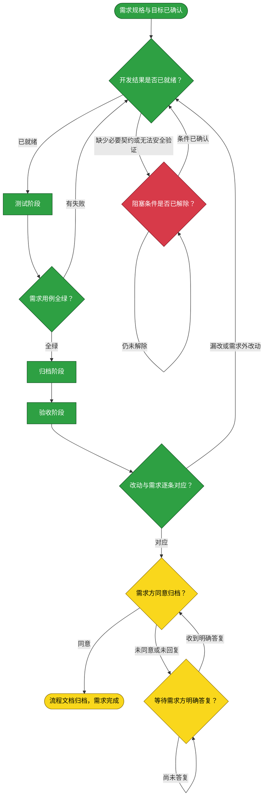

# 需求：使 dsh-credentials 可由 DSH 0.2 动态加载并保留两种形态

```yaml
target: assets/projects/dsh-credentials/dsh-credentials 的 Cordis adapters、package.json、必要的构建辅助脚本与 tests，以及 assets/projects/dsh-credentials/feature-flow.md 和 deploy.md
output: assets/projects/dsh-credentials/dsh-credentials 的动态 Cordis 构建产物与回归测试，以及项目流程和部署文档
prompt:
  - 加载des-credentials为动态cordis插件
  - 需要他可以动态加载，静态目前处于disable状态。两种方式均保留
  - dsh0.2.0对动态cordis改动很大，现在想要动态加载需要对dsh-credentials做什么修改呢
  - 继续探查如何落地
  - 可以，尝试修改
```

本需求从已收录的 `dsh-credentials` 项目仓库及当前 profile 的 Dynamic Cordis Loader 契约出发，修改该项目的 Cordis 产物以兼容 DSH 0.2 动态运行时，同时保留现有 bundle 与旧 body 输出；以独立用例和真实动态加载证据验证后交付需求方确认。

## 主流程图



## START

确认需求范围为 `dsh-credentials` 的动态 Cordis Host/Client 入口和构建产物；不能把 `@deepseek-ai/dsh-credentials-local` 存储提供方与本项目管理界面混为一谈。

**输入**

- `USER_REQUEST`：本文件前置块的原始提示词记录；来源为需求方。

**输出**

- `REQ_SPEC`：保留 bundle 与旧 Cordis body，同时新增 DSH 0.2 动态加载兼容产物；去向为 `DEVELOP`。

## DEVELOP

开发阶段由独立 subagent 执行，只改前置块 `target` 指定的 `dsh-credentials` 源码、构建配置、项目清单与对应测试。实施前必须从该项目 `main` 创建本需求分支；不得改动当前 profile 的插件状态、动态加载器或其安装目录。

代码应使用动态 Runner 实际提供的 `harness`、`host`、`React` 闭包符号及 `apply(ctx)` 契约，并产出当前动态加载器认可的精确候选文件名；现有 bundle 与旧 `host-body.js` / `client-body.js` 产物不能失效。动态插件仅提供凭据目录 UI/管理能力，不实现凭据存储；`ctx.credentials` 缺席必须保持项目定义的降级行为。

**输入**

- `REQ_SPEC`：本需求规格；来源为 `START`。
- `FAILURE_REPORT`：测试失败原因；来源为 `TEST_GATE`。
- `TEST_VERDICT`：测试未通过判定；来源为 `TEST_GATE`。
- `ACCEPT_FAILURE`：验收遗漏或范围蔓延；来源为 `ACCEPT_GATE`。
- `RESOLVED`：阻塞条件的明确答复；来源为 `BLOCKED`。

**输出**

- `DEV_RESULT`：源改动、构建产物契约与自测；去向为 `TEST`。
- `OPEN_QUESTION`：尚不能自行裁决的条件；去向为 `BLOCKED`。

## TEST

测试阶段由独立 subagent 执行，不改产品代码。测试需覆盖：旧 bundle 与旧 Cordis body 构建仍成立；动态产物精确文件名与语法成立；Host/Client body 在 DSH 0.2 符号与 `apply(ctx)` 调用形态下可注册和清理；缺少可选 credential seam 时仍按既有契约降级。运行项目测试 README 中适用的套件及两形态构建，判据为全绿且退出码 0。真实 Web 动态加载若无法在本环境完成，必须记入未验证面，不能以静态测试代替。

**输入**

- `DEV_RESULT`：开发改动清单；来源为 `DEVELOP`。

**输出**

- `TEST_EVIDENCE`：新增用例与运行结果；去向为 `TEST_GATE`。

## ARCHIVE

归档阶段由独立 subagent 执行，只把已由源码或测试证据确认的事实写入正确归属处：在 `assets/projects/dsh-credentials/dsh-credentials/tests/README.md` 更新测试索引，在 `assets/projects/dsh-credentials/feature-flow.md` 或 `deploy.md` 更新项目流程与动态加载操作。若真实 Web 动态加载未验证，明确保留在「未验证面」。归档阶段不提交、不合并、不删除需求分支。

**输入**

- `DEV_RESULT`：改动清单；来源为 `DEVELOP`。
- `TEST_VERDICT`：测试通过判定；来源为 `TEST_GATE`。

**输出**

- `ARCHIVED`：与已验证实现一致的项目文档改动；去向为 `ACCEPT`。

## ACCEPT

验收阶段由未参与开发、测试和归档的独立 subagent 执行，逐条比对完整 diff 与本文件 `prompt` 最后一条有效陈述：动态加载产物与入口已兼容；bundle 和旧产物仍可构建；没有改动目标之外的项目或 profile 状态。不得在验收阶段修代码。

**输入**

- `FULL_DIFF`：代码、测试与项目文档完整 diff；来源为工作区。
- `ARCHIVED`：归档后的项目文档；来源为 `ARCHIVE`。

**输出**

- `ACCEPT_VERDICT`：覆盖情况及范围审查；去向为 `ACCEPT_GATE`。

## TEST_GATE

只有本项目适用测试全绿且退出码为 0，且未绕过动态兼容性用例时，才判定测试通过。

**输入**

- `TEST_EVIDENCE`：测试命令结果；来源为 `TEST`。

**输出**

- `TEST_VERDICT`：测试通过或失败；去向为 `ARCHIVE`、`DEVELOP`。
- `FAILURE_REPORT`：失败用例、复现命令与原因；去向为 `DEVELOP`。

## ACCEPT_GATE

只有需求要求的动态兼容改动全部落实、bundle/旧 body 路径保持可用，且 diff 未触及目标外范围时才通过。

**输入**

- `ACCEPT_VERDICT`：独立验收的对应表；来源为 `ACCEPT`。

**输出**

- `ACCEPTED`：通过结论；去向为 `REQUESTER_APPROVAL`。
- `ACCEPT_FAILURE`：未通过的遗漏或范围问题；去向为 `DEVELOP`。

## REQUESTER_APPROVAL

验收通过后等待需求方明确同意是否将本需求文档移入 `assets/archive/`。本节点不自动归档，也不合并或删除需求分支。

**输入**

- `ACCEPTED`：验收通过结论；来源为 `ACCEPT_GATE`。
- `REQUESTER_DECISION`：需求方对归档的明确答复；来源为 `APPROVAL_WAIT`。

**输出**

- `ARCHIVE_MOVE`：仅在需求方明确同意时将本文件移入归档区；去向为 `DONE`。
- `WAIT_FOR_REPLY`：等待需求方明确答复；去向为 `APPROVAL_WAIT`。

## APPROVAL_WAIT

未收到明确同意时保留需求文档与专用开发分支，等待需求方回复；沉默不视为同意。

**输入**

- `WAIT_FOR_REPLY`：尚未收到明确答复；来源为 `REQUESTER_APPROVAL`。

**输出**

- `REQUESTER_DECISION`：需求方给出的明确答复；去向为 `REQUESTER_APPROVAL`。

## DONE

需求方明确同意归档后，才把本文件整篇移入 `assets/archive/`。该移动发生后才允许按知识库项目分支规则合并需求分支并确认清理。

**输入**

- `ARCHIVE_MOVE`：需求文档已移动；来源为归档动作。

**输出**

- 无。

## BLOCKED

若 DSH 动态 Runner 的当前契约不足以让项目安全地使用闭包符号，或所需真实环境权限/页面无法获得，则停止越界改造并报告需要需求方确认的具体条件。

**输入**

- `OPEN_QUESTION`：未决契约或验证阻塞；来源为 `DEVELOP`。

**输出**

- `RESOLVED`：需求方明确给出的处理范围；去向为 `DEVELOP`。
