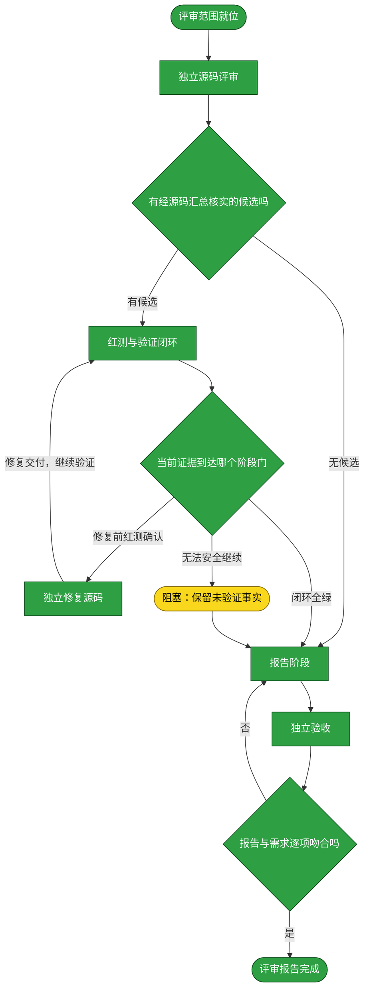

# 需求：按 review-guide 评审 dsh-credentials 源码并闭合证据

```yaml
target: assets/projects/dsh-credentials/dsh-credentials/src/、assets/projects/dsh-credentials/dsh-credentials/tests/、assets/projects/dsh-credentials/dsh-credentials/dist/bundle/、assets/projects/dsh-credentials/dsh-credentials/reviews/ 与 assets/projects/dsh-credentials/feature-flow.md
output: assets/projects/dsh-credentials/dsh-credentials/src/、assets/projects/dsh-credentials/dsh-credentials/tests/、assets/projects/dsh-credentials/dsh-credentials/dist/bundle/、assets/projects/dsh-credentials/dsh-credentials/reviews/review-20261010-010816.md 与 assets/projects/dsh-credentials/feature-flow.md
prompt:
  - dsh-credentials根据reviewguide进行review
```

本需求从 dsh-credentials 的只读源码评审开始，按 review-guide 覆盖其规定的六个维度，并仅对可由源码定位且经测试验证的缺陷执行红测、修复、绿测、破坏性反证、恢复复测闭环，最终由独立验收者核对完整改动并形成评审报告。

## 需求澄清

### 澄清记录

无——review-guide 已规定评审范围、六个维度、事实准入、测试与修复闭环、报告结构；需求只要求按该指南执行，无额外模糊点需要裁决。

### 验收锚点

- A1：六个规定的评审维度均有独立评审者提交结果，且评审阶段没有读取 `src/` 之外的工程材料或运行命令。
- A2：进入事实清单的问题均有源码触发条件、可观察错误结果、预期行为、对应测试及完整的修复前红／修复后绿／破坏后红／恢复后绿证据；不能闭环的候选只列入未验证面并说明原因。
- A3：报告字段、运行入口、修复与测试对应关系、破坏与恢复核验及未覆盖范围均可从报告复算。
- A4：独立验收逐项比对需求和完整 diff，确认无漏项且无需求外改动。

### 范围边界

- 不做：评审 `src/` 以外的产品代码、配置或文档；扩展 review-guide 之外的审查范围；提交、推送、部署或触及生产环境。
- 不做：把未经完整测试闭环的候选记为已验证事实。

## 主流程图



## START

评审作业书与范围已就位；六个独立维度、只读源码的阶段边界和闭环要求均明确。本节点不出分支。

**输入**

- `REVIEW_SPEC`：本需求与验收锚点；来源为本文件。

**输出**

- `REVIEW_SPEC`：评审规格；去向为 `REVIEW`。

## REVIEW

六个维度分别由全新的一次性 subagent 执行；评审者只读相关 `src/` 源码，不读测试或其它材料，不运行命令、不修改文件。另一名全新 subagent 仅按候选引用位置核实候选并按根因去重。

**输入**

- `REVIEW_SPEC`：评审规格；来源为 `START`。

**输出**

- `CANDIDATES`：独立评审候选及来源；去向为 `REVIEW_GATE`。

## REVIEW_GATE

只保留能够从被引用源码说明触发条件、可观察错误结果与预期行为的候选；其余候选不得作为事实进入报告。没有保留候选时直接形成无缺陷评审报告。

**输入**

- `CANDIDATES`：独立评审候选；来源为 `REVIEW`。

**输出**

- `VALIDATED_CANDIDATES`：经源码核实的问题；去向为 `TEST`。
- `NO_CANDIDATE`：无经核实候选的结果；去向为 `REPORT`。

## TEST

每项候选由独立一次性 subagent 检查现有覆盖或新增直接测试，并在修复前证明测试因目标错误行为失败。初始红测确认后，测试阶段把证据交给 `DEVELOP`；修复后由新的测试 subagent 验证绿测，再由新的 subagent 做可恢复的本地破坏性反证，最后由另一名 subagent 恢复并复测。每次失败都保留证据并回到相应阶段，无法准确恢复时停止。

**输入**

- `VALIDATED_CANDIDATES`：经源码核实的问题；来源为 `REVIEW_GATE`。
- `PATCH`：独立修复者交付的源码修复；来源为 `DEVELOP`。

**输出**

- `RED_EVIDENCE`：修复前因目标错误行为失败的直接测试证据；去向为 `TEST_GATE`。
- `CLOSURE_EVIDENCE`：修复后绿测、破坏性反证及恢复复测证据；去向为 `TEST_GATE`。
- `UNVERIFIED`：无法安全继续的候选及阻因；去向为 `TEST_GATE`。

## DEVELOP

针对已由修复前红测证实的问题，由一个独立的一次性 subagent 只改对应源码，不改证据测试、不夹带无关改动。修复者不负责测试验收。

**输入**

- `RED_EVIDENCE`：修复前失败的目标测试；来源为 `TEST_GATE`。
- `VALIDATED_CANDIDATES`：对应的源码问题事实；来源为 `REVIEW_GATE`。

**输出**

- `PATCH`：最小源码修复；去向为 `TEST`。

## TEST_GATE

初始红测须因目标行为失败才允许进入修复；修复后的相关测试全绿、破坏修复后目标断言转红、恢复后再次全绿且所有命令退出码为 0，才进入归档。无法安全或准确恢复的候选留在未验证面。

**输入**

- `RED_EVIDENCE`：修复前测试证据；来源为 `TEST`。
- `CLOSURE_EVIDENCE`：绿测、反证、恢复复测证据；来源为 `TEST`。
- `UNVERIFIED`：闭环阻因；来源为 `TEST`。

**输出**

- `RED_EVIDENCE`：足以进入修复的失败证据；去向为 `DEVELOP`。
- `VERIFIED_FACTS`：完整闭环的问题事实；去向为 `REPORT`。
- `UNVERIFIED`：未验证面；去向为 `BLOCKED`。

## REPORT

由独立一次性 subagent 按 review-guide 规定的字段与结构撰写报告，只登记具有完整闭环证据的问题；记录测试运行入口、对应关系、破坏方式、恢复核验与未覆盖范围。报告位置为项目仓库 `reviews/`。

**输入**

- `VERIFIED_FACTS`：完整闭环的问题事实；来源为 `TEST_GATE`。
- `UNVERIFIED`：未验证面；来源为 `BLOCKED`。
- `NO_CANDIDATE`：无候选结果（若适用）；来源为 `REVIEW_GATE`。
- `ACCEPT_FAILURE`：验收发现的遗漏或越界项；来源为 `ACCEPT_GATE`。

**输出**

- `REVIEW_REPORT`：评审报告；去向为 `ACCEPT`。

## ACCEPT

独立一次性验收者核对完整 diff 与本文件的提示词、验收锚点和范围边界，逐项检查评审覆盖、事实准入、闭环证据和报告字段。验收者不修正产物；发现遗漏或越界时交回报告阶段处置。

**输入**

- `REVIEW_REPORT`：评审报告与本次完整改动；来源为 `REPORT`。

**输出**

- `COMPARISON`：评审覆盖、事实证据与报告内容逐项比对结果；去向为 `ACCEPT_GATE`。

## ACCEPT_GATE

独立验收阶段按验收锚点和范围边界逐项判断评审与报告是否完整。任何遗漏或需求外改动均不通过。

**输入**

- `COMPARISON`：逐项比对结果；来源为 `ACCEPT`。

**输出**

- `ACCEPTED`：逐项吻合的验收结论；去向为 `DONE`。
- `ACCEPT_FAILURE`：遗漏或越界项；去向为 `REPORT`。

## DONE

评审报告已通过独立验收。本需求流程文档不因验收通过自动归档；须待需求方明确同意后再移动归档。

**输入**

- `ACCEPTED`：独立验收通过；来源为 `ACCEPT_GATE`。

**输出**

- 无。

## BLOCKED

无法准确恢复破坏性反证造成的状态，或环境阻碍导致闭环无法继续时停止，不把候选记为已验证事实，并在报告未验证面列明阻因。

**输入**

- `UNVERIFIED`：未验证候选及阻因；来源为 `TEST_GATE`。

**输出**

- `UNVERIFIED`：未验证面与阻因；去向为 `REPORT`。

## 状态配色

本需求已完成六维独立评审、六条事实的红绿反证闭环、最终构建与独立验收；流程文件仍保留在收件箱，未获明确授权前不归档。候选对应测试均通过，但全量 `npm test` 为 371 passed、42 failed、退出码 1，失败与未验证范围已列入[评审报告](../projects/dsh-credentials/dsh-credentials/reviews/review-20261010-010816.md)。绿色表示已执行且有证据确认，黄色表示尚待完成，红色表示阻塞需外部协助；图中每个节点以颜色单独表示状态。
