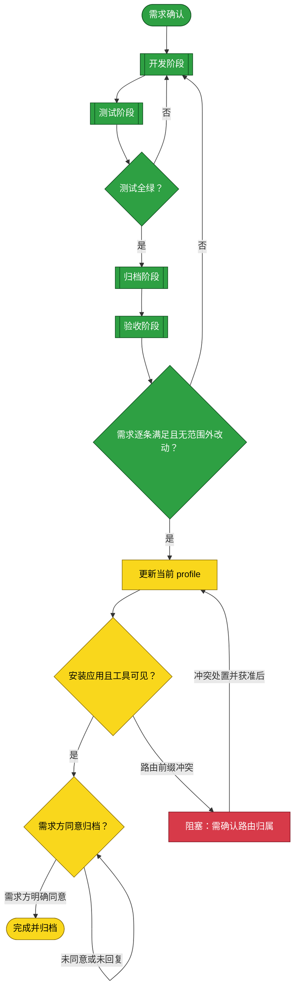

# 需求：让 agent 查询 SSH target 连接信息

```yaml
target: assets/projects/dsh-credentials/dsh-credentials/src/host/tool.ts、assets/projects/dsh-credentials/dsh-credentials/tests/host/device-linking.test.ts 与 assets/projects/dsh-credentials/feature-flow.md
output: assets/projects/dsh-credentials/dsh-credentials/src/host/tool.ts、assets/projects/dsh-credentials/dsh-credentials/tests/host/device-linking.test.ts、assets/projects/dsh-credentials/feature-flow.md
prompt:
  - 给到一个别名，可以通过插件知道已有的链接io，端口，用户名，然后就可以链接了。新增一个功能去做吧
```

本需求让 session agent 解析 SSH target alias 后实际看到目标 host/IP、端口与用户名，从而继续使用 `ssh <alias>`。解析只读、不发起连接，且不得暴露私钥路径、密钥内容或密码；连接结果仍以实际 SSH 尝试为准。

## 主流程图



## START

确认需求边界：只将已有安全过滤后的 host、port、user 呈现给模型；不新增执行远端命令的插件 API。agent 可在可用的 shell 环境中使用目标 alias；不能由 metadata 推断连接已成功。

**输入**

- `REQUEST`：需求与范围确认；来源为用户。

**输出**

- `SPEC`：已确认需求；去向为 `DEVELOP`。

## DEVELOP

由独立 subagent 修改模型工具的结果渲染，使其包含 alias、host、port、user，并保持 keyPath 不输出。改动限定在 target 范围；发现必须扩大范围时先报告。


**输入**

- `SPEC`：需求规格；来源为 `START`。
- `VERDICT`：测试未通过时的失败反馈；来源为 `GATE`。

**输出**

- `CHANGE`：实现 diff 与自测结果；去向为 `TEST`。

### D_IN

分发已确认规格给代码修改阶段。

**输入**

- `SPEC`：本需求规格；来源为 `START`。

**输出**

- `EDIT_BRIEF`：代码修改作业书；去向为 `D_EDIT`。

### D_EDIT

修改模型可见的 SSH target 查询结果，输出目标地址、端口与用户名，不返回密钥路径或秘密。

**输入**

- `EDIT_BRIEF`：代码修改作业书；来源为 `D_IN`。

**输出**

- `PATCH`：代码 diff；去向为 `D_OUT`。

### D_OUT

交付限制在目标文件内的代码 diff。

**输入**

- `PATCH`：代码 diff；来源为 `D_EDIT`。

**输出**

- `CHANGE`：实现 diff 与自测结果；去向为 `TEST`。

## TEST

由独立 subagent 新增/调整目标解析工具用例，覆盖可见渲染内容、目标字段与私钥路径不泄露；运行工程测试，判据为全绿且退出码 0。测试阶段不改产品代码。


**输入**

- `CHANGE`：实现 diff；来源为 `DEVELOP`。

**输出**

- `EVIDENCE`：测试用例与运行结果；去向为 `GATE`。

### T_IN

接收开发阶段交付的代码 diff。

**输入**

- `CHANGE`：实现 diff；来源为 `DEVELOP`。

**输出**

- `TEST_BRIEF`：测试目标与输入；去向为 `T_CASES`。

### T_CASES

补覆盖解析结果字段、缺省用户名和保密边界的测试。

**输入**

- `TEST_BRIEF`：测试目标与输入；来源为 `T_IN`。

**输出**

- `CASES`：回归用例；去向为 `T_RUN`。

### T_RUN

运行项目完整测试套件。

**输入**

- `CASES`：回归用例；来源为 `T_CASES`。

**输出**

- `EVIDENCE`：测试输出与退出码；去向为 `T_OUT`。

### T_OUT

交付测试证据供外层判定节点使用。

**输入**

- `EVIDENCE`：测试输出与退出码；来源为 `T_RUN`。

**输出**

- `EVIDENCE`：测试结果；去向为 `GATE`。

## GATE

依据测试实际退出码与完整结果判定，不以跳过测试取得绿灯。失败返回 `DEVELOP` 并保留失败用例。

**输入**

- `EVIDENCE`：测试结果；来源为 `TEST`。

**输出**

- `VERDICT`：测试判定；去向为 `DEVELOP` 或 `ARCHIVE`。

## ARCHIVE

由独立 subagent 按已验证的代码和测试结果更新项目流程文档；未验证的连接行为不得写成已验证事实。


**输入**

- `CHANGE`：实现 diff；来源为 `DEVELOP`。
- `VERDICT`：测试判定；来源为 `GATE`。

**输出**

- `DOC_CHANGE`：项目流程文档更新；去向为 `ACCEPT`。

### A_IN

接收已经测试验证的代码变更和测试证据。

**输入**

- `CHANGE`：实现 diff；来源为 `DEVELOP`。
- `VERDICT`：测试通过结论；来源为 `GATE`。

**输出**

- `DOC_BRIEF`：项目流程文档更新要求；去向为 `A_EDIT`。

### A_EDIT

仅把由源码与测试证据支持的行为写入项目流程文档。

**输入**

- `DOC_BRIEF`：文档更新要求；来源为 `A_IN`。

**输出**

- `DOC_CHANGE`：文档 diff；去向为 `A_OUT`。

### A_OUT

交付与已验证实现一致的文档变更。

**输入**

- `DOC_CHANGE`：文档 diff；来源为 `A_EDIT`。

**输出**

- `DOC_CHANGE`：项目流程文档更新；去向为 `ACCEPT`。

## ACCEPT

由独立 subagent 对照需求检查完整 diff：工具对 agent 的可见结果须含 alias、host、port、user，且不得泄露 keyPath、密码或密钥；不得新增需求外的远端执行能力。任一要求不符即退回 `DEVELOP`。


**输入**

- `CHANGE`：代码改动；来源为 `DEVELOP`。
- `DOC_CHANGE`：文档改动；来源为 `ARCHIVE`。
- `SPEC`：验收规格；来源为 `START`。

**输出**

- `ACCEPTED`：验收结论；去向为 `REVIEW`。

### C_IN

收集代码、测试和文档变更形成完整验收输入。

**输入**

- `CHANGE`：实现 diff；来源为 `DEVELOP`。
- `DOC_CHANGE`：文档 diff；来源为 `ARCHIVE`。
- `SPEC`：需求规格；来源为 `START`。

**输出**

- `REVIEW_BRIEF`：完整变更及需求；去向为 `C_REVIEW`。

### C_REVIEW

由未参与开发、测试和归档的 agent 独立对照需求验收。

**输入**

- `REVIEW_BRIEF`：完整变更及需求；来源为 `C_IN`。

**输出**

- `ACCEPTED`：验收结论；去向为 `C_OUT`。

### C_OUT

将验收结论交给主流程。

**输入**

- `ACCEPTED`：验收结论；来源为 `C_REVIEW`。

**输出**

- `ACCEPTED`：验收结论；去向为 `REVIEW`。

## REVIEW

逐项比对实现与需求：成功渲染含 alias、host/IP、端口与用户名，用户名缺省时明确说明使用默认账号；私钥路径未暴露，解析不探测网络；不新增远端命令执行 API。不得把未验证的 SSH 连通性写成已验证。

**输入**

- `ACCEPTED`：验收结论；来源为 `ACCEPT`。

**输出**

- `ACCEPTED`：符合需求的验收结果；去向为 `DEPLOY`。

## DEPLOY

用已构建的 bundle 更新当前 `web` profile。变更影响该 profile 的全部 session；安装结果以 plugin manager 的 `application` 字段为准，并在变更应用后检查 live tool catalog。若出现现存路由冲突，不猜测归属，也不随意卸载其他插件。

**输入**

- `ACCEPTED`：通过代码验收的结果；来源为 `REVIEW`。
- `ROUTE_CONFLICT_CLEARED`：路由冲突已处置并确认可重试；来源为 `BLOCKED`。

**输出**

- `DEPLOY_RESULT`：安装与 live tool 检查结果；去向为 `DEPLOY_GATE`。

## DEPLOY_GATE

安装只有在 plugin manager 报告已应用，且 live tool catalog 能观察到 `device_target` 才算成功。本次安装返回 `application: failed`，错误为 `webServer` 已有 `/dsh-credentials/api` 前缀路由。当前 `include:dsh-workbench` 与 `include:web-optimizer` 为 active，`include:dsh-credentials` 为 failed；错误未指出既有路由的所有者。

**输入**

- `DEPLOY_RESULT`：安装与 live tool 检查结果；来源为 `DEPLOY`。

**输出**

- `DEPLOY_VERDICT`：安装成功或路由前缀冲突；去向为 `WAIT` 或 `BLOCKED`。

## BLOCKED

暂停 profile 变更，先清理现存 `/dsh-credentials/api` 路由冲突。当前清单显示 `dsh-workbench` 与 `dsh-web-network-optimizer` active，直接 `dsh-credentials` 行 failed；管理器错误未识别路由所有者。需求方已授权重启当前 DSH Web 服务，但目标机的 system service 要求 sudo 交互认证；非交互 sudo 尝试被拒绝。不得索取或输出密码，也不得绕过 sudo。等待用户在已核验的 DSH 主机通过授权管理会话重启，或授予合适的免密服务管理权限；重启后先检查服务状态与 live Tool catalog，若冲突仍在再查路由归属，不随意停用其他插件。

**输入**

- `DEPLOY_VERDICT`：路由前缀冲突；来源为 `DEPLOY_GATE`。

**输出**

- `ROUTE_CONFLICT_CLEARED`：重启或其他有证据支持的处置后，路由冲突已清除且获准重试；去向为 `DEPLOY`。

## WAIT

验收后等待需求方明确决定是否归档；未回复不视为同意。

**输入**

- `DEPLOY_VERDICT`：当前 profile 安装已验证；来源为 `DEPLOY_GATE`。
- `REQUESTER_DECISION`：需求方对归档的决定；来源为用户。

**输出**

- `ARCHIVE_MOVE`：得到明确同意后将需求文档移入归档区；去向为 `DONE`。

## DONE

需求方明确同意后移动本文件到 `assets/archive/`。在此之前，本需求继续留在收件箱。

**输入**

- `ARCHIVE_MOVE`：需求文档移动动作；来源为 `WAIT`。

**输出**

- 无。

## 状态配色

黄色 `#f9d71c` 表示待执行或执行中，绿色 `#2ea043` 表示有证据确认完成，红色 `#d73a49` 表示阻塞。目前 `START`、`DEVELOP`、`TEST`、`GATE`、`ARCHIVE`、`ACCEPT` 与 `REVIEW` 已验证完成；bundle 安装在 `DEPLOY` 处因现存路由前缀冲突未激活，重启需要目标机管理员交互认证，`BLOCKED` 标红，其余后续节点待执行。
