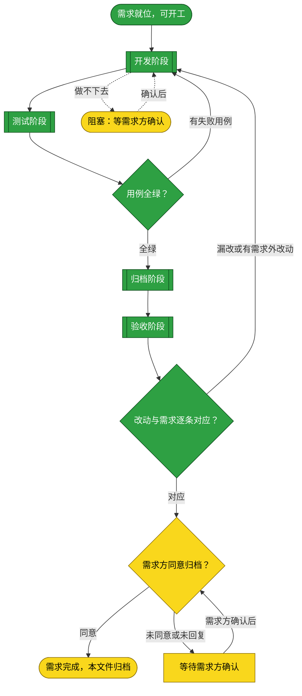
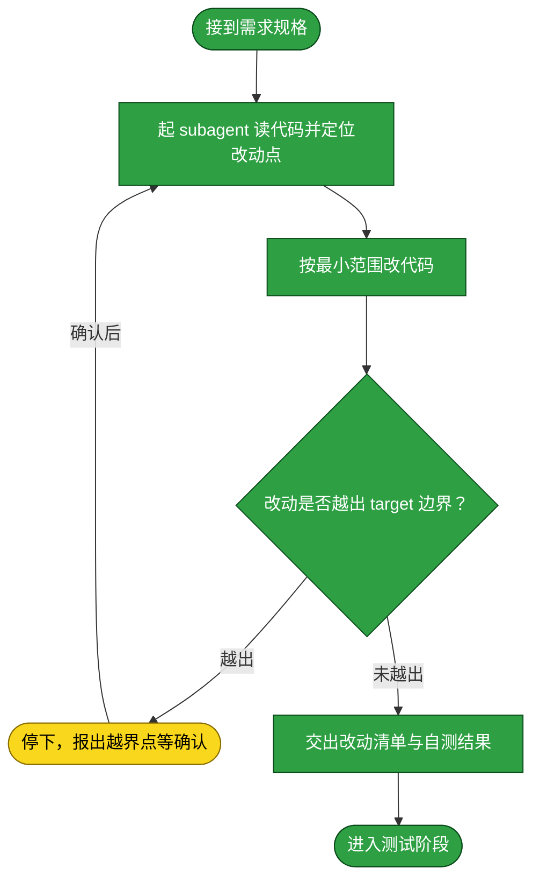
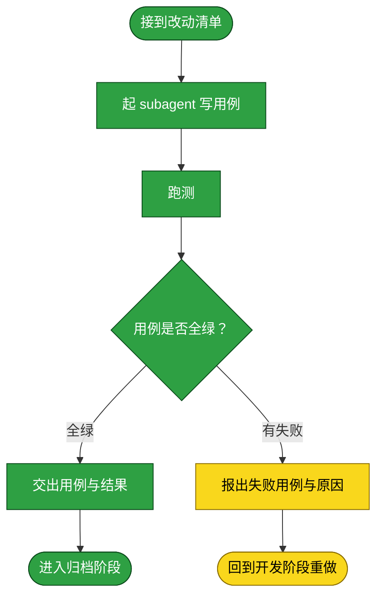
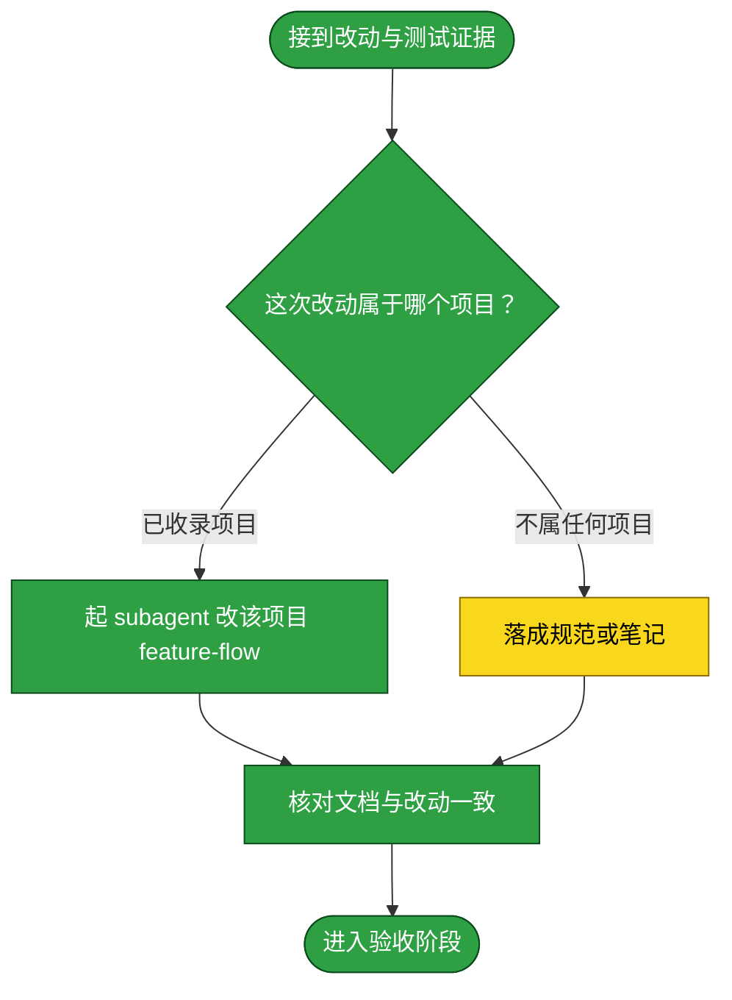
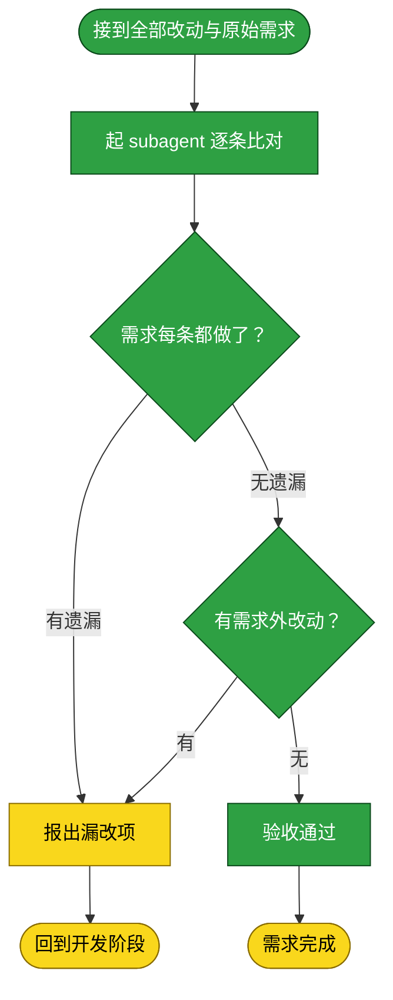

# 需求：创建动态 Cordis 项目登记与加载面板

```yaml
target: assets/projects/dsh-dynamic-cordis-loader/
output: assets/projects/dsh-dynamic-cordis-loader/
prompt:
  - 想要一个类似这个面板的插件，专门用于等级动态cordis插件的地方，解决现在动态cordis都需要手动输入提示词才能加载。新增project，GitHub链接是https://github.com/yunjies/dsh-dynamic-cordis-loader
  - 采用项目路径登记、当前会话手动加载；本地创建并配置 remote，暂不推送 GitHub。
  - 在测试前希望先做调整，参考插件的配置方式，提供一个现有插件的本地路径，即可加载动态cordis
  - 探索一下两个目录，分别是对应workbench和dsh-credentials

本需求从一个可在 WebUI 使用的项目登记面板开始，交付一个可在当前会话中显式装载已登记动态 Cordis 源码的插件；代码留在新项目仓库，测试和文档验证其加载边界。

## 主流程图



## START

开工前的就位判定：需求已在前置块里写清 `target` 与 `output`，且这两项都是具体路径而非占位符。本节点不出分支。

**输入**

- `REQ_READY`：前置块三键已填、目标与产出都已指明的状态；来源为本文件的前置数据块。

**输出**

- `REQ_SPEC`：本需求的规格，即前置块的三键内容；去向为 `DEVELOP`。

## DEVELOP

开发阶段已完成。递归检索、候选相对路径保存与显式重检索、Load 时同根校验，以及 Session 选择初始为空、无默认首项、显示占位项并在选择前禁用 Search/Register/Rescan/Load，均已落入项目代码；当前用户侧契约见 [dsh-dynamic-cordis-loader feature-flow](../projects/dsh-dynamic-cordis-loader/feature-flow.md)。本阶段的产出是**功能改动本身**——不产出测试，也不落档。它按下面的子流程走。

**起独立 subagent**：本阶段由一个新起的 subagent 执行，不承接对话里的上下文。交给它的输入只有 `target`、`output`、`prompt` 与本节写明的边界；它在自己的上下文里读代码、改代码、把改动落到工作区，中间过程留在它那里。

**边界**：它只改 `target` 指到的内容，不改需求未提及的相邻模块；发现必须改动需求之外的代码时停下并报出，不自行扩大范围。

**输入**

- `REQ_SPEC`：本需求的规格；来源为 `START`。
- `FAILURE_REPORT`：失败用例与原因；来源为 `T_BACK`。
- `ACCEPT_FAILURE`：漏改或多余的处置要求；来源为 `C_OUT`。
- `RESOLVED`：已确认的条件；来源为 `BLOCKED`。
- `TEST_VERDICT`：全绿与否；来源为 `TEST_GATE`。
- `ACCEPT_VERDICT`：逐条对应与否；来源为 `ACCEPT_GATE`。

**输出**

- `DEV_RESULT`：改动清单与自测结果；去向为 `TEST`、`ARCHIVE`、`ACCEPT`。
- `OPEN_QUESTION`：悬置的条件；去向为 `BLOCKED`。



### D_IN

承接 `START` 交来的需求规格，把它整理成交给 subagent 的作业书。本节点不出分支。

**输入**

- `REQ_SPEC`：本需求的规格；来源为 `START`。

**输出**

- `DEV_BRIEF`：作业书，含 `target`、`output`、`prompt` 与本节边界；去向为 `D_AGENT`。

### D_AGENT

起一个独立 subagent，把 `DEV_BRIEF` 交给它，由它读代码并定位本需求要改的那一处。**为什么独立**：开发要在自己的上下文里反复读文件、试错、回退，这些中间过程对本流程其余阶段是噪声；独立 subagent 让它们留在自己的上下文里，本流程只收它的结论。

**输入**

- `DEV_BRIEF`：作业书；来源为 `D_IN`。
- `SCOPE_RESOLVED`：已确认的边界；来源为 `D_STOP`。

**输出**

- `CHANGE_POINT`：改动点，即要改的文件与位置；去向为 `D_EDIT`。

### D_EDIT

按最小范围实施改动。**最小范围**指只改需求要求的那一处行为，不顺手重构、不改格式、不升级依赖。

**输入**

- `CHANGE_POINT`：改动点；来源为 `D_AGENT`。

**输出**

- `DIFF`：本次改动；去向为 `D_SCOPE`。

### D_SCOPE

判定改动是否越出 `target` 边界。判定语义是：`DIFF` 触及的每个文件，是否都落在 `target` 所指的范围内。越界不一定是错的，但**必须报出来由需求方确认**，因为它意味着这条需求的实际影响面比它写下的 `target` 更大。

**输入**

- `DIFF`：本次改动；来源为 `D_EDIT`。

**输出**

- `SCOPE_VERDICT`：越界与否及其具体落点；去向为 `D_STOP` 或 `D_REPORT`。

### D_STOP

越界出口：停下并把越界点报给需求方，等其确认是扩大 `target` 还是收回改动。

**输入**

- `SCOPE_VERDICT`：越界点；来源为 `D_SCOPE`。
- `SCOPE_REPLY`：需求方对越界的处置；来源为流程外部的确认动作。

**输出**

- `SCOPE_RESOLVED`：已确认的边界；去向为 `D_AGENT`。

### D_REPORT

交出改动清单与开发自测结果，作为进入测试阶段的输入。**开发自测不等于测试阶段**：这里只证明改动跑得起来，覆盖需求要求的行为由测试阶段负责。

**输入**

- `DIFF`：本次改动；来源为 `D_EDIT`。
- `SCOPE_VERDICT`：未越界的判定；来源为 `D_SCOPE`。

**输出**

- `DEV_RESULT`：改动清单与自测结果；去向为 `D_OUT`。

### D_OUT

开发阶段出口：改动已在工作区就位且未越界。本节点无出边。

**输入**

- `DEV_RESULT`：改动清单与自测结果；来源为 `D_REPORT`。

**输出**

- `DEV_RESULT`：改动清单与自测结果；去向为 `TEST`。

## TEST

测试阶段已完成。本阶段的产出是**测试用例与它们的运行结果**。它按下面的子流程走。

**起独立 subagent**：本阶段由一个新起的 subagent 执行。**为什么独立**：写用例的人应当是找出改动缺陷的人，独立于开发者才不会沿用开发者的思路去验证开发者自己的假设。它拿到的是改动清单与本需求的行为要求，不接触开发阶段的中间推理。

**边界**：它只写覆盖本需求要求行为的用例，不借机扩充测试套件；用例失败时它**不改产品代码**，只报出失败。当前工作区运行 [`npm test`](../projects/dsh-dynamic-cordis-loader/dsh-dynamic-cordis-loader/tests/README.md) 已通过，所有测试全绿且退出码为 0；其中 Host fake filesystem／runner 用例覆盖绝对 Host 可读根目录校验、递归检索、同目录精确普通文件配对、相对路径响应、搜索不读源码且不定义 Plugin、body 文件名与无关 bundle Client 排除、深度、目录数、目录项数、候选数、结果大小与相对路径长度超限、选中路径与当前文件集合复核、越界与陈旧路径拒绝、错误脱敏、大小与 UTF-8 检查；Client 用例为静态源码断言，现检查 Session 初始为空且不默认第一项、占位项与未选择时 Search/Register/Rescan/Load 禁用；静态断言不渲染 React，不证明真实界面交互。独立 Test agent 报告 `npm test` 退出码为 0；命令与测试范围取回路径见 [tests/README.md](../projects/dsh-dynamic-cordis-loader/dsh-dynamic-cordis-loader/tests/README.md)。上述递归搜索边界均由 Host fake filesystem 用例覆盖；各项当前命令见 [tests/README.md](../projects/dsh-dynamic-cordis-loader/dsh-dynamic-cordis-loader/tests/README.md)。`npm test` 对 noop fixture 只编译 Runner 形状的 async-function-body 包装，不调用或执行源码，并断言旧 `export function apply() {}` 形式会产生 `SyntaxError`。文档所列 `node --check` 检查、`npm pack --dry-run` 与 `git diff --check` 均已通过。Client remote 根注入的静态回归仍由当前测试约束。当前工作区检索确认 [`dsh-credentials` Cordis host body](../projects/dsh-credentials/dsh-credentials/dist/cordis/cred/host-body.js) 与 [client body](../projects/dsh-credentials/dsh-credentials/dist/cordis/cred/client-body.js) 不是 `host.js`／`client.js` 别名；该 checkout 没有精确 `host.js`，另一个目录的 [`dist/bundle/client.js`](../projects/dsh-credentials/dsh-credentials/dist/bundle/client.js) 不会构成候选。`dsh-credentials` 的运行时输出目录与 body 参数分别见其 [build 配置](../projects/dsh-credentials/dsh-credentials/loader-configs/build.json) 与 [loader 配置](../projects/dsh-credentials/dsh-credentials/loader-configs/loader.json)；[`host-body.js`](../projects/dsh-credentials/dsh-credentials/dist/cordis/cred/host-body.js) 声明 `apply(ctx, harness)` 并返回 `{ apply, portsFor }`；该 adapter 依赖额外的 `harness` 参数，加载器不会自动适配。该项目的 [package.json](../projects/dsh-credentials/dsh-credentials/package.json) 也区分 `dist/bundle` 与 Cordis runtime 产物。已有的 Workbench Cordis build 记录指出 `dist/cordis/wkb` 含 `host-loader.js`、`client-loader.js`、`host-body.js`、`client-body.js` 与 `manifest.json`，loader wrapper 读取 body 文件；其 [`package.json`](../../../workbench/package.json)、[build 配置](../../../workbench/loader-configs/build.json) 与 [loader 配置](../../../workbench/loader-configs/loader.json) 位于当前知识库工作区之外，本次未能独立复核。成功 Load、动态源码执行、真实 WebUI 与 Host→Client E2E、`command/done.text` 日志行为及 Acceptance 均未验证。

**测试失败回到开发阶段**：失败不就地绕过，而是回到 `DEVELOP` 重做、测试重跑。已写入的用例保留——它们是这次失败的证据，也是下一轮开发的验收面。

**输入**

- `DEV_RESULT`：改动清单与自测结果；来源为 `DEVELOP`。

**输出**

- `TEST_EVIDENCE`：用例与运行结果；去向为 `ARCHIVE`。
- `FAILURE_REPORT`：失败用例与原因；去向为 `DEVELOP`。



### T_IN

承接开发阶段交来的改动清单，整理成测试作业书。本节点不出分支。

**输入**

- `DEV_RESULT`：改动清单与自测结果；来源为 `DEVELOP`。

**输出**

- `TEST_BRIEF`：测试作业书，含改动清单与本需求的行为要求；去向为 `T_AGENT`。

### T_AGENT

起一个独立 subagent，按 `TEST_BRIEF` 写覆盖本需求行为要求的用例。**为什么独立**：见本章开头。它不接触开发阶段的中间推理，故它对改动是否真的满足需求给出的是独立判断。

**输入**

- `TEST_BRIEF`：测试作业书；来源为 `T_IN`。

**输出**

- `TEST_CASES`：本次写下的用例；去向为 `T_RUN`。

### T_RUN

运行用例。跑法与判据取回自被测项目自己的 `tests/README.md`，本流程不另立判据；判据是全绿且退出码为 0。

**输入**

- `TEST_CASES`：本次写下的用例；来源为 `T_AGENT`。

**输出**

- `RUN_RESULT`：运行输出与退出码；去向为 `T_VERDICT`。

### T_VERDICT

判定是否全绿。判定语义是：该项目的全部用例都通过，且运行未被绕过——不靠删用例、放宽断言、跳过用例换取绿灯。

**输入**

- `RUN_RESULT`：运行输出与退出码；来源为 `T_RUN`。

**输出**

- `TEST_VERDICT`：全绿与否；去向为 `T_PASS` 或 `T_FAIL`。

### T_PASS

全绿出口：交出本次用例与运行结果，作为归档阶段的事实依据。本节点不出分支。

**输入**

- `TEST_VERDICT`：全绿判定；来源为 `T_VERDICT`。
- `TEST_CASES`：本次写下的用例；来源为 `T_AGENT`。

**输出**

- `TEST_EVIDENCE`：用例与运行结果；去向为 `T_OUT`。

### T_FAIL

失败出口：报出失败用例、失败原因与本次改动。**不在这里改产品代码**——改代码职责单一地落在开发阶段；测试阶段只判不改，否则判据与被判对象同出一处，绿灯失去意义。

**输入**

- `TEST_VERDICT`：失败判定；来源为 `T_VERDICT`。
- `RUN_RESULT`：运行输出；来源为 `T_RUN`。

**输出**

- `FAILURE_REPORT`：失败用例与原因；去向为 `T_BACK`。

### T_BACK

回到开发阶段的出口：带回失败报告。本节点无出边。

**输入**

- `FAILURE_REPORT`：失败用例与原因；来源为 `T_FAIL`。

**输出**

- `FAILURE_REPORT`：失败用例与原因；去向为 `DEVELOP`。

### T_OUT

测试阶段出口：用例全绿，交出用例与结果。本节点无出边。

**输入**

- `TEST_EVIDENCE`：用例与运行结果；来源为 `T_PASS`。

**输出**

- `TEST_EVIDENCE`：用例与运行结果；去向为 `ARCHIVE`。

## TEST_GATE

测试阶段的判定点：本次用例是否全绿。判定语义是全部用例通过且运行未被绕过——不靠删用例、放宽断言、跳过用例换取绿灯；任一条不成立即判失败。失败走回 `DEVELOP`，全绿则进入 `ARCHIVE`。

**输入**

- `RUN_RESULT`：用例运行输出与退出码；来源为 `TEST`。

**输出**

- `TEST_VERDICT`：全绿与否；去向为 `DEVELOP` 或 `ARCHIVE`。

## ARCHIVE

归档阶段文档更新已完成。本阶段的产出是**落档后的文档**——递归检索契约、受限源码读取、运行验证边界、候选结构与 Session 初始无默认选择规则均写入项目流程、项目 README 与测试说明；流程设计记录同时写明要求用户明确指定目标的安全收益、最强反题、可观察证伪面及使用迁移成本。搜索边界由 fake Host 测试覆盖；Session 选择规则仅有静态 Client 源码断言，未作 React 渲染或 live UI 验收。Session 变更后，文档所列 `node --check` 检查、`npm pack --dry-run --cache ./.npm-cache --logs-dir ./.npm-cache/logs`、package `git diff --check` 与知识库 lint 均已通过且退出码为 0；命令入口见 [tests/README.md](../projects/dsh-dynamic-cordis-loader/dsh-dynamic-cordis-loader/tests/README.md) 与 [_lint/README.md](../../_lint/README.md)。需求验收与需求方归档同意仍待办。它按下面的子流程走。

**起独立 subagent**：本阶段由一个新起的 subagent 执行。**为什么独立**：落档要对着一份长文档做局部改写并保持它通篇自洽，这需要通读全文，而通读的上下文不该占用本流程的其余阶段。它拿到的是改动清单与测试证据。

**边界**：它只写**已经验证过的**事实——测试没覆盖到的环节写进文档的「未验证面」，不写成已验证；不把开发过程中的取舍与来历写进流程文档，那些不归流程文档承载。

**输入**

- `DEV_RESULT`：改动清单；来源为 `DEVELOP`。
- `TEST_EVIDENCE`：用例与运行结果；来源为 `TEST`。
- `TEST_VERDICT`：全绿与否；来源为 `TEST_GATE`。

**输出**

- `ARCHIVED`：已落档且自洽的文档；去向为 `ACCEPT`。



### A_IN

承接开发与测试两个阶段的产出，整理成落档作业书。本节点不出分支。

**输入**

- `DEV_RESULT`：改动清单；来源为 `DEVELOP`。
- `TEST_EVIDENCE`：用例与运行结果；来源为 `T_PASS`。

**输出**

- `ARCHIVE_BRIEF`：落档作业书，含改动与已验证面；去向为 `A_LOCATE`。

### A_LOCATE

判定这次改动的落档去向。判定语义是：`target` 是否落在某个被收录项目的仓库克隆内——是则该项目的 `feature-flow.md` 是它的落档处；否（改动落在本知识库自身的规范、判据册或某目录的约定上）则按 `_meta/`、随 skill 分发的判据册、各目录 README 的归属落档。

**输入**

- `ARCHIVE_BRIEF`：落档作业书；来源为 `A_IN`。

**输出**

- `ARCHIVE_TARGET`：落档处；去向为 `A_AGENT` 或 `A_ELSE`。

### A_AGENT

起一个独立 subagent，把这次改动的既成事实写进该项目的流程文档。

**输入**

- `ARCHIVE_BRIEF`：落档作业书；来源为 `A_IN`。
- `ARCHIVE_TARGET`：落档处；来源为 `A_LOCATE`。

**输出**

- `DOC_DIFF`：文档改动；去向为 `A_CHECK`。

### A_ELSE

落档到项目流程文档之外的情形：把改动落成规范条目、判据或某目录 README 的约定，处置按该处的归属规则。本节点不出分支。

**输入**

- `ARCHIVE_TARGET`：落档处；来源为 `A_LOCATE`。

**输出**

- `DOC_DIFF`：文档改动；去向为 `A_CHECK`。

### A_CHECK

核对落档结果与改动一致：文档描述的流程与工作区里的改动指向同一事实。本节点不出分支。

**输入**

- `DOC_DIFF`：文档改动；来源为 `A_AGENT` 或 `A_ELSE`。

**输出**

- `ARCHIVED`：已落档且自洽的文档；去向为 `A_OUT`。

### A_OUT

归档阶段出口。本节点无出边。

**输入**

- `ARCHIVED`：已落档的文档；来源为 `A_CHECK`。

**输出**

- `ARCHIVED`：已落档的文档；去向为 `ACCEPT`。

## ACCEPT

验收阶段已由独立审查通过（PASS）；需求方归档许可仍待明确。本阶段判定**改的是不是需求要求的**：把本次全部改动与当前可恢复的需求目标逐条比对。最新精确原话不可得，未编造或追加提示词；审查依当前目标规格进行，并将该归档限制单独记录。

【事实】独立审查确认目标包是需求分支，`origin` 未变、工作树保留未提交差异且没有 commit／push；审查者重跑 `npm test` 全绿且退出码为 0。Lead 复跑文档所列 `node --check`、`npm pack --dry-run --cache ./.npm-cache --logs-dir ./.npm-cache/logs`、package `git diff --check` 与知识库 lint，均全绿且退出码为 0。Host fake filesystem 测试覆盖递归精确同目录配对、限制失败、Load 前重验；Client 静态断言覆盖 Search／Rescan／候选选择、手动 Load 与必须主动选择 Session。对 `dsh-credentials` 的路径 glob 未找到精确 `host.js`，仅找到无关目录 `dist/bundle/client.js`；未读取或执行其源码。具体流程与测试限制见 [项目流程](../projects/dsh-dynamic-cordis-loader/feature-flow.md) 与 [测试说明](../projects/dsh-dynamic-cordis-loader/dsh-dynamic-cordis-loader/tests/README.md)。

【反题】严格文件名排除采用其它合法产物布局的构建；强制提交两项选中路径会破坏旧直接根目录调用方；无默认 Session 增加每次打开后的点击，并阻断自动操作。这些是设计成本，不以兼容性或便利性抹去用户确认要求。

【证伪条件】若 Search 读取源码或定义 Plugin、任一搜索上限后仍返回部分候选、Load 在缺少路径字段或路径陈旧／越界时读取源码、未选 Session 仍能执行 Search、Register、Rescan 或 Load，或远端配置改变，则验收失败。真实 WebUI、Host-to-Client、动态源码运行、`command/done.text` 与实际 Host sandbox 仍未验证，不把静态／fake-FS 证据当作 live 证明。

【裁决】在上述可复核证据与当前可恢复目标规格下，独立审查判定需求改动覆盖且未发现范围外改动，验收通过。独立设计反题、证伪条件及代价展开见 [项目流程的设计裁决](../projects/dsh-dynamic-cordis-loader/feature-flow.md)。

【弃用代价】若严格配对或显式路径契约被推翻，维护者需设计清晰的映射方式、迁移构建方与旧调用者并保持无猜测选择；若无默认 Session 被撤回，使用者恢复自动目标但也重新承担误选风险。

**起独立 subagent**：本阶段由一个新起的 subagent 执行。**为什么独立**：验收必须由一个没有参与前三个阶段的主体来做——它若参与过，就会用自己当初的思路去核对，看不到自己的偏差。它拿到的是全部 diff（代码与文档）与 `prompt`，不接触前三阶段的中间推理。

**判定语义**：判定分两问，**两问都成立**才算通过——其一，需求要求的每一处改动都做了（不少改）；其二，改动里没有需求未要求的东西（不多改）。少改则需求未达成；多改是范围蔓延，须回到开发阶段收回，或由需求方确认扩大需求。

**边界**：它只判「对不对应」，不判「改得好不好」——代码质量、风格、测试强度属开发与测试阶段，不在这里重开。

**输入**

- `ARCHIVED`：已落档的文档；来源为 `ARCHIVE`。
- `DEV_RESULT`：改动清单；来源为 `DEVELOP`。

**输出**

- `ACCEPT_FAILURE`：漏改或多余的处置要求；去向为 `DEVELOP`。



### C_IN

承接归档阶段的文档与开发阶段的代码改动，合为本次全部改动。本节点不出分支。

**输入**

- `ARCHIVED`：已落档的文档；来源为 `ARCHIVE`。
- `DEV_RESULT`：改动清单；来源为 `DEVELOP`。

**输出**

- `FULL_DIFF`：本次全部改动；去向为 `C_AGENT`。

### C_AGENT

起一个独立 subagent，把 `FULL_DIFF` 与 `prompt` 逐条比对。

**输入**

- `FULL_DIFF`：本次全部改动；来源为 `C_IN`。
- `PROMPT_RECORD`：前置块的 `prompt` 留档；来源为本文件的前置数据块。

**输出**

- `COMPARISON`：逐条对应关系与差异；去向为 `C_COVER`。

### C_COVER

判定需求要求的每一处改动是否都做了。判定语义是：`prompt` 的**最后一条**（当前有效的需求陈述）里的每项要求，都能在 `FULL_DIFF` 里找到对应的改动。

**输入**

- `COMPARISON`：逐条对应关系；来源为 `C_AGENT`。

**输出**

- `COVERAGE`：覆盖与否及漏改项；去向为 `C_BACK` 或 `C_EXTRA`。

### C_EXTRA

判定改动里是否有需求未要求的东西。判定语义是：`FULL_DIFF` 里的每处改动，都能追溯到 `prompt` 里的某项要求；追不到的是范围蔓延。

**输入**

- `COVERAGE`：无遗漏的判定；来源为 `C_COVER`。

**输出**

- `EXTRA`：需求外改动；去向为 `C_BACK` 或 `C_PASS`。

### C_BACK

不通过出口：报出漏改项或需求外改动。**两种不通过都回开发阶段**——验收阶段只判不改，自行修正是它越权，且会让「谁改的」与「谁验的」重新合一。

**输入**

- `COVERAGE`：漏改项；来源为 `C_COVER`。
- `EXTRA`：需求外改动；来源为 `C_EXTRA`。

**输出**

- `ACCEPT_FAILURE`：漏改或多余的处置要求；去向为 `C_OUT`。

### C_OUT

回到开发阶段的出口。本节点无出边。

**输入**

- `ACCEPT_FAILURE`：处置要求；来源为 `C_BACK`。

**输出**

- `ACCEPT_FAILURE`：处置要求；去向为 `DEVELOP`。

### C_PASS

通过出口：需求要求的都做了、且没有需求外的改动。本节点把结果交给需求方，不自行触发归档。

**输入**

- `EXTRA`：无需求外改动的判定；来源为 `C_EXTRA`。

**输出**

- `ACCEPTED`：验收通过；去向为 `REQUESTER_APPROVAL`。

### C_DONE

需求完成的收尾：只有需求方明确同意归档后，本条需求才算完成。此时按 [本目录 README](README.md) 的边界声明，把**本文件整篇移入 [assets/archive/](../archive/README.md)**——是移动不是复制；归档前把全部节点状态标为已执行，文件内容不再改写。本节点无出边。

**输入**

- `ACCEPTED`：验收通过；来源为 `C_PASS`。

**输出**

- 无。

## ACCEPT_GATE

验收阶段的判定点：改动与需求是否逐条对应。判定语义分两问，两问都成立才通过——需求要求的每处改动都做了，且改动里没有需求未要求的东西。任一问不成立即回到 `DEVELOP`。

**输入**

- `COMPARISON`：逐条对应关系与差异；来源为 `ACCEPT`。

**输出**

- `ACCEPT_VERDICT`：逐条对应与否；去向为 `DEVELOP` 或 `REQUESTER_APPROVAL`。

## DONE

需求完成的终点标记：四个阶段都走完、验收通过，且需求方明确同意归档；本节点只在收到该同意后成立。本节点无出边。

**输入**

- `REQUESTER_DECISION`：需求方明确同意归档；来源为 `REQUESTER_APPROVAL`。
- `ACCEPT_VERDICT`：逐条对应与否；来源为 `ACCEPT_GATE`。

**输出**

- `ARCHIVE_MOVE`：把本文件移入 `assets/archive/` 的动作；去向为流程外部的归档动作。

## REQUESTER_APPROVAL

验收通过后把结果提交给需求方，等待其明确回答是否同意把本需求归档。没有明确同意时，不得把「未回复」解释成同意，也不得自动移动文件。

**输入**

- `ACCEPTED`：验收通过；来源为 `C_PASS`。
- `ACCEPT_VERDICT`：逐条对应与否；来源为 `ACCEPT_GATE`。
- `REQUESTER_DECISION`：需求方确认后的决定；来源为 `APPROVAL_WAIT`。

**输出**

- `REQUESTER_DECISION`：需求方明确同意或拒绝归档；去向为 `DONE` 或 `APPROVAL_WAIT`。

## APPROVAL_WAIT

需求方未同意归档时的等待出口。本节点不改变代码或文档，也不把沉默当作同意；收到需求方明确意见后重新进入 `REQUESTER_APPROVAL`。

**输入**

- `REQUESTER_DECISION`：未同意或未回复；来源为 `REQUESTER_APPROVAL`。

**输出**

- `REQUESTER_DECISION`：等待中的决定；去向为 `REQUESTER_APPROVAL`。

## BLOCKED

阻塞出口：流程中遇到做不下去的条件时停在这里等协助。**停在这里是本流程的正常出口，不是失败**——一项判据未定的需求，强行推进只会产出一个自己都判不了的实现。

**输入**

- `OPEN_QUESTION`：悬置的条件；来源为 `DEVELOP`。

**输出**

- `RESOLVED`：已确认的条件；去向为 `DEVELOP`。
