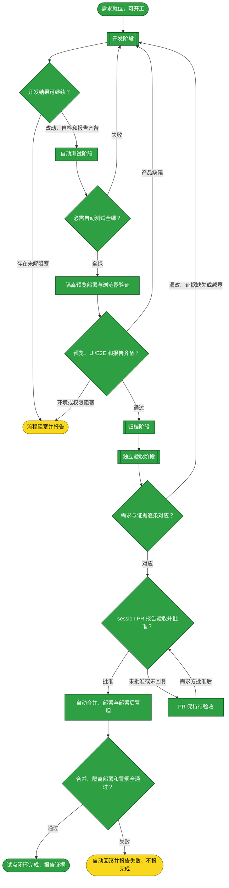
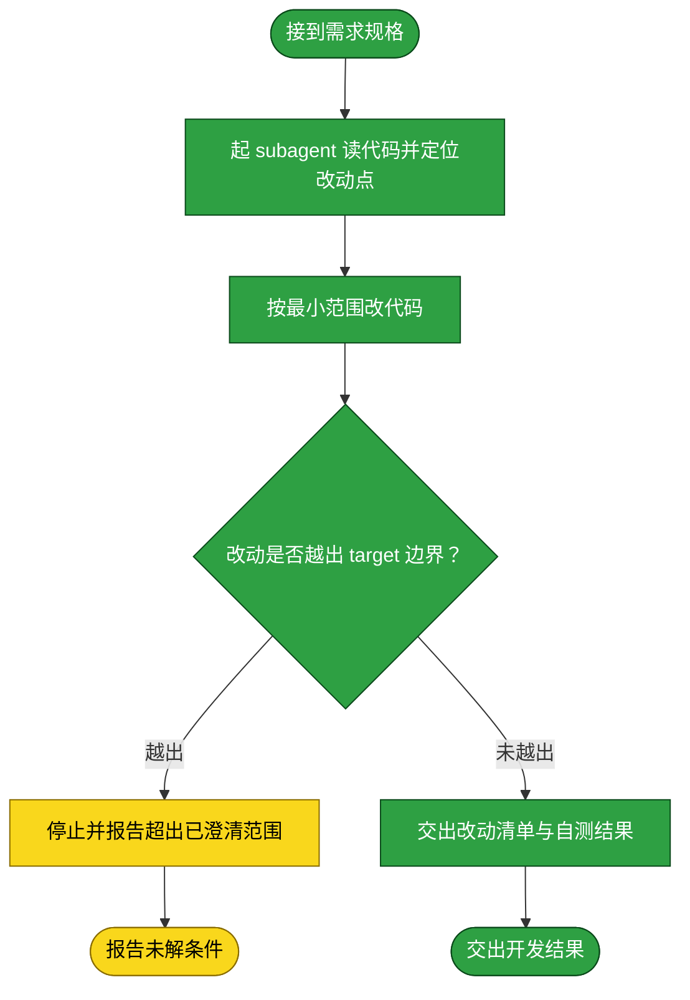
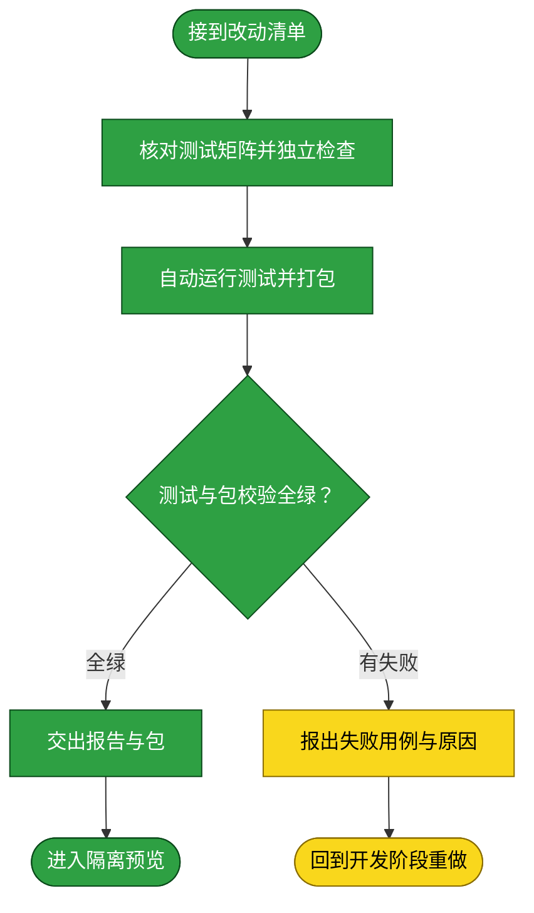
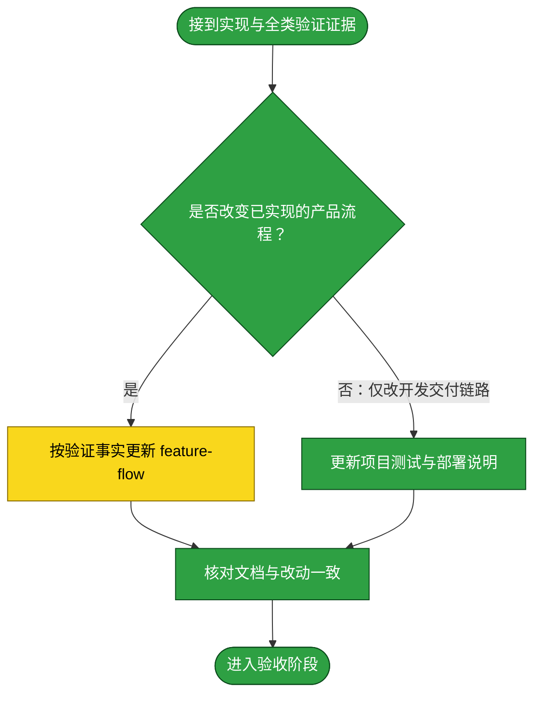
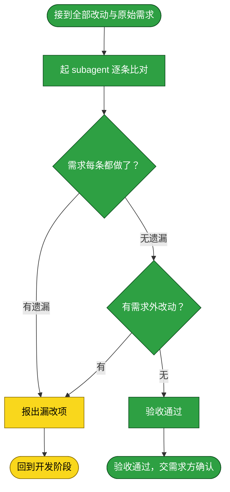

# 需求：跑通 DSH Settings 插件的 session PR 交付关卡

```yaml
target: assets/projects/dsh-settings-trusted-authority/
output: 当前 session 中可审阅的临时 PR 报告（Workbench diff 引用、测试证据、前端截图/视频）及批准后本地合并到隔离 profile 的验证；更新 tests/README.md 和 deploy.md，只有产品运行流程改变时才更新 feature-flow.md
prompt:
  - "我觉得这里有几个方向需要思考：1. 流程自循环完整性。希望人介入的时机只有输入需求&澄清，以及最后的验收（PR）。中间的开发，测试，部署，冒烟都应该自动化流程完成，用户拿到最终的成品，可以通过验收产物（还原截图，视频等等）（高效），一篇说明文档（feature-flow的diff日志）（中效），或者上手实践操作功能（低效），或看代码diff（低效）完成最终验收确认功能开发完成。2. 流程流程骨架的坚实，能力驱动具体流程内容定制，比如一个项目带了dsh plugin开发，则需要对plugin的必要逻辑进行单元测试；如果带了前端开发，则验收阶段也许需要产出预期前端表现截图等。3. 流程可复现，即对每一个流程做好约束和护栏，保证各司其职，且重复流程是稳定的产出"
  - "需要先核实，自动闭环是终极目标，先看各个部分能否串起来，是否能够跑。比如拿一个简单的项目，跑通单项目的流程，然后总结，固定，再跑下一个。先构建构建流程的能力。"
  - "就是pr会带一个预览，预览通过PR完成，然后会自动合并+完成部署？"
  - "可以先这么跑。"
  - "本质只是一道流程关卡，不是特指GitHub的PR CI流程，出版可以先生成临时的PR报告，diff引用（修改文件配合workbench插件的diff功能），前端截图等，然后在session中继续流程"
```

本流程以 `dsh-settings-trusted-authority` 为首个单项目试点，验证测试与打包、隔离 Web profile 预览、真实浏览器截图/保存刷新验收是否能组成可复现闭环；先在当前 session 生成临时 PR 报告（改动引用、测试证据、前端截图/视频），由需求方在 session 作唯一最终验收，批准后继续本地合并与隔离部署冒烟。这里的 PR 是流程关卡，不要求 GitHub PR、GitHub CI 或仓库设置；不触碰用户正在使用的 profile。

## 需求澄清

本节记录自动闭环试点的范围裁决、验收证据与安全边界；项目仓库现行的 main-only 规则与 PR 验收冲突，按需求方明确选择的试点例外执行，不在试点成功前推广为全局规则。

### 澄清记录

- 问答：是否以 `dsh-settings-trusted-authority` 为首个试点，先建立 inbox 需求、采用 PR 分支流程，并只在隔离 Web profile 预览？→「按建议继续」
  - 裁决：以该项目验证静态测试、包构建、隔离 profile 安装、真实浏览器保存与刷新读回、PR 证据和批准后的本地合并/部署冒烟；试点过程使用需求分支，不修改用户正在使用的 profile。全局流程模板暂不改，待试点证据审阅后再决定固定哪些通用能力。
  - 反论与代价：插件替换 Settings provider 并需重启 Web profile；误选 profile 会影响真实设置界面，浏览器测试又可能受认证和目标地址约束。故只允许明确命名的隔离 profile，报告须绑定本地分支工作树 diff hash、包 hash、profile 与截图/视频；任何无法自动隔离或回滚的步骤都阻塞，不得改用活跃 profile。
  - 验收面：从本地审阅分支工作树快照重建包，在隔离 profile 完成预览及真实浏览器保存/刷新验证；session 中可取回对应 diff 与证据；需求方批准后本地合并、部署到隔离试点目标并通过部署后冒烟；全程证明活跃 profile 未被修改。
- 问答：PR 是否必须是 GitHub PR/CI？另选的批准机制是什么？→「本质只是一道流程关卡，不是特指GitHub的PR CI流程，出版可以先生成临时的PR报告，diff引用（修改文件配合workbench插件的diff功能），前端截图等，然后在session中继续流程」
  - 裁决：PR 报告是当前 session 的临时审阅交接，不调用 GitHub PR/CI、不改远端分支保护；报告含本地 diff 引用、测试/部署证据和真实 UI 截图/视频。需求方在 session 明确批准后，自动把已审阅的精确 diff 提交到本地审阅分支，核验后 fast-forward 合入 `main`、部署到隔离 profile 并做部署后冒烟；远端发布不在此次试点内。
  - 反论与代价：session 门禁没有 GitHub 的持久审查记录与远端保护，跨团队可见性较弱；此试点按用户指定选择 session 连续流程，只有成功证据支持后才考虑添加 GitHub 适配器，不把它当主干必需能力。
  - 验收面：session 中实际呈现临时报告，能对照本地分支 diff 与真实截图；用户批准后无需再问，即继续本地合并、隔离部署和冒烟。当前项目仓库是知识库工作区内的嵌套 Git 仓库，Workbench 不递归发现其内部改动，且当前 Client inspect 没有连通页面；报告须给文件行链接并明确 live diff UI 未执行，不伪称已使用。只有项目仓库作为 workspace root 且 Client 连通时，才可引用 Workbench 的 Open Diff 视图。

### 验收锚点

- A1：在 session 中对本地审阅分支工作树运行项目静态测试和包构建；报告绑定基线 `HEAD`、工作树 diff 与包哈希，命令和退出码可复取，不要求 GitHub PR/CI。
- A2：由本地审阅分支工作树快照构建的包安装到明确隔离的 DSH Web profile；报告绑定基线 `HEAD`、diff hash 和 tarball hash，profile、运行地址、清理/回滚路径可核验，活跃 profile 未修改。
- A3：真实浏览器在 Models 页用合成无效 API key 保存 provider 设置并刷新读回；不发起模型 API 请求，不将该结果表述为凭证/模型可用性验证；测试不是 mock UI，session 可查看真实页面截图或视频及运行报告。
- A4：session 中临时呈现 PR 报告，含 Workbench diff 引用/文件行链接、测试报告、截图/视频、部署状态和未验证项；用户只需在 session 做最终批准。
- A5：用户在 session 批准后自动将报告中的精确工作树改动提交到本地审阅分支、核对提交差异后 fast-forward 合入 `main`，将该合并 commit 对应的包部署到隔离目标并运行部署后冒烟；不发布远端、不触碰活跃 profile。
- A6：失败用例保留并回到开发修复后重跑；报告分别标记 PASS、FAIL、BLOCKED、NOT_REQUIRED，不把未执行、mock 或环境缺失记成通过。
- A7：项目测试/部署说明记录可复现的命令、前置条件、证据位置与试点验证结论；不将试点未证实的能力泛化为全局规则。

### 范围边界

- 不做：不修改用户正在使用的 DSH profile、生产实例或其 Settings 数据；不使用活跃 profile 代替隔离预览。
- 不做：本试点不创建 GitHub PR、不推送远端、不调用 GitHub CI、不改仓库保护或自动合并设置；PR 只作为当前 session 的审阅关卡。
- 不做：不改项目的产品行为，除非实际 E2E 暴露了本需求范围内必须修复的缺陷；范围扩张先报告，不自行加入。
- 不做：本轮不重写全局 inbox 模板或强行推广所有项目的分支/发布策略；试点报告完成后再根据证据固化通用部分。
- 不做：不把静态测试、mock E2E、截图或部署健康检查互相替代；每种证据单独报告。

## 主流程图



## START

开工前的就位判定：需求已在前置块里写清 `target` 与 `output`，这两项都是具体路径而非占位符，且「需求澄清」章节的验收锚点与范围边界已就位（无澄清需要时该节显式写「无」并给出理由）。本节点不出分支。

**输入**

- `REQ_READY`：前置块三键已填、澄清章节已就位的状态；来源为本文件的前置数据块与「需求澄清」章节。

**输出**

- `REQ_SPEC`：本需求的规格，即前置块的三键内容；去向为 `DEVELOP`。
- `CLARIFICATIONS`：澄清裁决与验收锚点；去向为 `DEVELOP`。

## DEVELOP

开发阶段。本阶段的产出是**功能改动本身**——不产出测试，也不落档。它按下面的子流程走。

**起独立 subagent**：本阶段由一个新起的 subagent 执行，不承接对话里的上下文。交给它的输入是 `REQ_SPEC`（前置块三键）与 `CLARIFICATIONS`（「需求澄清」章节的裁决与验收锚点），再加本节写明的边界；它在自己的上下文里读代码、改代码、把改动落到工作区，中间过程留在它那里。

**边界**：它只改 `target` 指到的内容，不改需求未提及的相邻模块；发现必须改动需求之外的代码时停下并报出，不自行扩大范围。

**本试点的分支例外**：从已核对的 `origin/main` 基线创建本地审阅分支；只在该分支开发、测试并生成预览报告，不推送远端或创建 GitHub PR。需求方在 session 批准临时 PR 报告后，流程才将该分支本地合入 `main` 并部署到指定隔离 profile。此例外仅对本试点有效，成功后再决定是否更新全局模板。

**输入**

- `REQ_SPEC`：本需求的规格；来源为 `START`。
- `CLARIFICATIONS`：需求澄清章节的裁决与验收锚点；来源为本文件的「需求澄清」章节。
- `FAILURE_REPORT`：失败用例与原因；来源为 `T_BACK`。
- `ACCEPT_FAILURE`：漏改或多余的处置要求；来源为 `C_OUT`。
- `DEV_RESULT`：开发子流程交付的改动清单与自测结果；来源为 `D_OUT`。
- `OPEN_QUESTION`：开发子流程交付的未解条件；来源为 `D_FAIL`。
- `TEST_VERDICT`：全绿与否；来源为 `TEST_GATE`。
- `PREVIEW_VERDICT`：预览产品行为失败后的判定；来源为 `PREVIEW_GATE`。
- `ACCEPT_VERDICT`：逐条对应与否；来源为 `ACCEPT_GATE`。

**输出**

- `REQ_SPEC`：本轮需求规格；去向为 `D_IN`。
- `CLARIFICATIONS`：澄清裁决与验收锚点；去向为 `D_IN`。
- `FAILURE_REPORT`：上一轮失败用例与原因（若本轮由测试失败返回）；去向为 `D_IN`。
- `ACCEPT_FAILURE`：验收发现的漏改或范围外改动（若本轮由验收退回）；去向为 `D_IN`。
- `TEST_VERDICT`：上一轮测试判定（若有）；去向为 `D_IN`。
- `PREVIEW_VERDICT`：上一轮预览产品行为失败判定（若有）；去向为 `D_IN`。
- `ACCEPT_VERDICT`：上一轮验收判定（若有）；去向为 `D_IN`。
- `DEV_RESULT`：改动清单与自测结果；去向为 `DEV_GATE`。
- `OPEN_QUESTION`：悬置的条件；去向为 `DEV_GATE`。



### D_IN

承接父级 `DEVELOP` 分发的本轮需求、上一轮反馈与阻塞解决结果，把它们整理成交给 subagent 的作业书。本节点不出分支。

**输入**

- `REQ_SPEC`：本轮需求规格；来源为 `DEVELOP`。
- `CLARIFICATIONS`：澄清裁决与验收锚点；来源为 `DEVELOP`。
- `FAILURE_REPORT`：上一轮失败用例与原因（若本轮由测试失败返回）；来源为 `DEVELOP`。
- `ACCEPT_FAILURE`：验收发现的漏改或范围外改动（若本轮由验收退回）；来源为 `DEVELOP`。
- `TEST_VERDICT`：上一轮测试判定（若有）；来源为 `DEVELOP`。
- `PREVIEW_VERDICT`：上一轮预览产品行为失败判定（若有）；来源为 `DEVELOP`。
- `ACCEPT_VERDICT`：上一轮验收判定（若有）；来源为 `DEVELOP`。

**输出**

- `DEV_BRIEF`：作业书，含 `REQ_SPEC`、`CLARIFICATIONS`、`FAILURE_REPORT`、`ACCEPT_FAILURE`、`TEST_VERDICT`、`PREVIEW_VERDICT`、`ACCEPT_VERDICT`（有对应来源时附带）、范围边界及本试点 PR 分支策略；去向为 `D_AGENT`。

### D_AGENT

起一个独立 subagent，把 `DEV_BRIEF` 交给它，由它读代码并定位本需求要改的那一处。**为什么独立**：开发要在自己的上下文里反复读文件、试错、回退，这些中间过程对本流程其余阶段是噪声；独立 subagent 让它们留在自己的上下文里，本流程只收它的结论。

**输入**

- `DEV_BRIEF`：作业书；来源为 `D_IN`。

**输出**

- `CHANGE_POINT`：改动点，即要改的文件与位置；去向为 `D_EDIT`。

### D_EDIT

按最小范围实施改动。**最小范围**指只改需求要求的那一处行为，不顺手重构、不改格式、不升级依赖。

**输入**

- `CHANGE_POINT`：改动点；来源为 `D_AGENT`。

**输出**

- `DIFF`：本次改动；去向为 `D_SCOPE`。

### D_SCOPE

判定改动是否越出 `target` 边界。`DIFF` 中每个文件都必须落在已澄清范围内；若实现需要扩大范围，不在中途询问需求方，立即停止该分支并输出阻塞报告，等待下一次需求输入重新澄清。

**输入**

- `DIFF`：本次改动；来源为 `D_EDIT`。

**输出**

- `SCOPE_VERDICT`：越界与否及其具体落点；去向为 `D_STOP` 或 `D_REPORT`。

### D_STOP

越界出口：停止当前自动流程，报告所需范围扩张及其影响；不自行修改 target、不在中途等待用户答复，也不把现有改动送入测试。

**输入**

- `SCOPE_VERDICT`：越界点；来源为 `D_SCOPE`。

**输出**

- `OPEN_QUESTION`：无法继续的未解条件；去向为 `D_FAIL`。

### D_FAIL

开发子流程阻塞出口：报告无法继续的条件，并把它交给父级 `DEVELOP` 做出口判定。

**输入**

- `OPEN_QUESTION`：无法继续的未解条件；来源为 `D_STOP`。

**输出**

- `OPEN_QUESTION`：开发阻塞条件；去向为 `DEVELOP`。

### D_REPORT

交出改动清单与开发自测结果，作为开发出口判定的输入。**开发自测不等于测试阶段**：这里只证明改动跑得起来，覆盖需求要求的行为由测试阶段负责。

**输入**

- `DIFF`：本次改动；来源为 `D_EDIT`。
- `SCOPE_VERDICT`：未越界的判定；来源为 `D_SCOPE`。

**输出**

- `DEV_RESULT`：改动清单与自测结果；去向为 `D_OUT`。

### D_OUT

开发子流程成功出口：改动已在工作区就位且未越界；将开发结果交给父级 `DEVELOP` 做出口判定。

**输入**

- `DEV_RESULT`：改动清单与自测结果；来源为 `D_REPORT`。

**输出**

- `DEV_RESULT`：改动清单与自测结果；去向为 `DEVELOP`。

## DEV_GATE

开发出口判定：只有 `DEV_RESULT` 完整且无未解条件时进入测试；否则把阻塞原因交给 `BLOCKED`，本轮自动流程终止并报告，不在中途向需求方追问。

**输入**

- `DEV_RESULT`：改动清单与自测结果；来源为 `DEVELOP`。
- `OPEN_QUESTION`：开发子流程未解的条件；来源为 `DEVELOP`。

**输出**

- `DEV_RESULT`：可测试的开发结果；去向为 `TEST`。
- `OPEN_QUESTION`：阻塞条件；去向为 `BLOCKED`。

## TEST

测试阶段。本阶段以本地审阅分支工作树快照为唯一输入，运行项目静态测试并校验包内容，产出可供隔离预览安装的确切包及测试证据；真实 Web profile 与浏览器验证属于后续 `PREVIEW`，不得在此阶段虚报为已通过。

**起独立 subagent**：本阶段由一个新起的 subagent 执行。它只接收改动清单与验收锚点，不接触开发中间推理；本试点的实际测试由可复现的项目命令和本地 `preview:session` runner 执行，subagent 负责独立选择、运行和审查证据。

**边界**：只验证本需求要求的项目行为、静态契约和包内容，不借机扩充无关覆盖面；失败时不改产品代码，只交失败报告并回开发。`npm test`、包校验通过都不能替代真实浏览器验证。

**测试失败回到开发阶段**：失败不就地绕过，而是回到 `DEVELOP` 重做、测试重跑。已写入的用例保留——它们是这次失败的证据，也是下一轮开发的验收面。

**输入**

- `DEV_RESULT`：改动清单与自测结果；来源为 `DEV_GATE`。

**输出**

- `TEST_EVIDENCE`：静态测试与包校验命令、基线 `HEAD`、工作树 diff hash、环境、输出和退出码；去向为 `PREVIEW`、`ARCHIVE`。
- `PACKAGE_ARTIFACT`：与本地审阅分支工作树快照对应、可供预览安装的实际包；去向为 `PREVIEW`。
- `FAILURE_REPORT`：失败用例与原因；去向为 `DEVELOP`。



### T_IN

承接开发阶段交来的改动清单，整理成测试作业书。本节点不出分支。

**输入**

- `DEV_RESULT`：改动清单与自测结果；来源为 `DEV_GATE`。

**输出**

- `TEST_BRIEF`：测试作业书，含改动清单与本需求的行为要求；去向为 `T_AGENT`。

### T_AGENT

起一个独立 subagent，按 `TEST_BRIEF` 写覆盖本需求行为要求的用例。**为什么独立**：见本章开头。它不接触开发阶段的中间推理，故它对改动是否真的满足需求给出的是独立判断。

**输入**

- `TEST_BRIEF`：测试作业书；来源为 `T_IN`。

**输出**

- `TEST_CASES`：本次写下的用例；去向为 `T_RUN`。

### T_RUN

运行用例。跑法与判据取回自被测项目自己的 `tests/README.md`，本流程不另立判据；判据是全绿且退出码为 0。

**输入**

- `TEST_CASES`：本次写下的用例；来源为 `T_AGENT`。

**输出**

- `RUN_RESULT`：运行输出与退出码；去向为 `T_VERDICT`。
- `PACKAGE_ARTIFACT`：绑定本地审阅分支工作树快照的包与分发清单；去向为 `T_PASS`。

### T_VERDICT

判定是否全绿。判定语义是：该项目的全部用例都通过，且运行未被绕过——不靠删用例、放宽断言、跳过用例换取绿灯。

**输入**

- `RUN_RESULT`：运行输出与退出码；来源为 `T_RUN`。

**输出**

- `TEST_VERDICT`：全绿与否；去向为 `T_PASS` 或 `T_FAIL`。

### T_PASS

全绿出口：交出本次用例、自动运行报告及实际包，作为隔离预览和归档的事实依据。本节点不出分支。

**输入**

- `TEST_VERDICT`：全绿判定；来源为 `T_VERDICT`。
- `TEST_CASES`：本次写下的用例；来源为 `T_AGENT`。
- `PACKAGE_ARTIFACT`：本次实际打包的包；来源为 `T_RUN`。

**输出**

- `TEST_EVIDENCE`：命令、本地审阅分支工作树快照、运行环境、日志与退出码；去向为 `T_OUT`。
- `PACKAGE_ARTIFACT`：实际打包文件与内容清单；去向为 `T_OUT`。

### T_FAIL

失败出口：报出失败用例、失败原因与本次改动。**不在这里改产品代码**——改代码职责单一地落在开发阶段；测试阶段只判不改，否则判据与被判对象同出一处，绿灯失去意义。

**输入**

- `TEST_VERDICT`：失败判定；来源为 `T_VERDICT`。
- `RUN_RESULT`：运行输出；来源为 `T_RUN`。

**输出**

- `FAILURE_REPORT`：失败用例与原因；去向为 `T_BACK`。

### T_BACK

回到开发阶段的出口：带回失败报告。本节点无出边。

**输入**

- `FAILURE_REPORT`：失败用例与原因；来源为 `T_FAIL`。

**输出**

- `FAILURE_REPORT`：失败用例与原因；去向为 `DEVELOP`。

### T_OUT

测试阶段出口：用例全绿，交出用例与结果。本节点无出边。

**输入**

- `TEST_EVIDENCE`：自动测试报告；来源为 `T_PASS`。
- `PACKAGE_ARTIFACT`：实际包与清单；来源为 `T_PASS`。

**输出**

- `TEST_EVIDENCE`：自动测试报告；去向为 `PREVIEW` 与 `ARCHIVE`。
- `PACKAGE_ARTIFACT`：实际包与清单；去向为 `PREVIEW`。

## TEST_GATE

测试阶段的判定点：本次静态检查与自动用例是否全绿，包内容是否可核验。判定语义是全部必需用例通过且运行未被绕过——不靠删用例、放宽断言、跳过用例换取绿灯；任一条不成立即判失败。失败回到 `DEVELOP`，全绿后进入隔离预览；此处不把浏览器 UI、外部集成或部署证据记作已通过。

**输入**

- `RUN_RESULT`：自动测试输出与退出码；来源为 `TEST`。
- `PACKAGE_ARTIFACT`：绑定本地审阅分支工作树快照的包与清单；来源为 `TEST`。

**输出**

- `TEST_VERDICT`：静态测试和包校验是否通过；去向为 `DEVELOP` 或 `PREVIEW`。

## PREVIEW

本节点在静态门禁通过后触发：仅把绑定本地审阅分支工作树快照的包安装到明确隔离的 DSH Web profile，重启该隔离实例，并由真实浏览器完成 Models 设置保存、刷新读回与冒烟；采集预览地址、profile 标识、工作树 diff hash、tarball hash、运行报告及截图/视频。不得接触用户活跃 profile，不得以静态测试或 mock 页面代替浏览器实测。本节点不出分支，唯一出边通向 `PREVIEW_GATE`。

**输入**

- `TEST_VERDICT`：静态测试与包校验通过；来源为 `TEST_GATE`。
- `PACKAGE_ARTIFACT`：本地审阅分支工作树快照的插件包；来源为 `TEST`。
- `TEST_EVIDENCE`：自动测试/包校验报告、基线 `HEAD` 与工作树 diff hash；来源为 `TEST`。
- `ISOLATED_PROFILE`：隔离预览环境及其可访问地址；来源为试点运行器配置。

**输出**

- `PREVIEW_EVIDENCE`：部署版本、profile、浏览器运行结果及截图/视频；去向为 `PREVIEW_GATE` 与 `ARCHIVE`。
- `OPEN_QUESTION`：无法安全自动部署或无法取得真实浏览器证据的阻塞原因；去向为 `BLOCKED`。

## PREVIEW_GATE

只有当预览确实运行了当前本地审阅分支工作树快照、真实浏览器完成保存与刷新读回、冒烟通过且证据可取回时，才进入归档和独立验收。产品行为失败回到 `DEVELOP`；环境/认证/权限不足则进入 `BLOCKED`，不能把人工步骤、mock 或缺失环境包装成自动化通过。

**输入**

- `PREVIEW_EVIDENCE`：预览及浏览器报告；来源为 `PREVIEW`。
- `OPEN_QUESTION`：环境或权限阻塞；来源为 `PREVIEW`。

**输出**

- `PREVIEW_VERDICT`：通过与否；去向为 `ARCHIVE`、`DEVELOP` 或 `BLOCKED`。

## ARCHIVE

归档阶段。本阶段的产出是**落档后的文档**——把这次改动造成的既成事实写进它该在的地方。它按下面的子流程走。

**起独立 subagent**：本阶段由一个新起的 subagent 执行。**为什么独立**：落档要对着一份长文档做局部改写并保持它通篇自洽，这需要通读全文，而通读的上下文不该占用本流程的其余阶段。它拿到的是改动清单与测试证据。

**边界**：它只写**已经验证过的**事实——测试没覆盖到的环节写进文档的「未验证面」，不写成已验证；不把开发过程中的取舍与来历写进流程文档，那些不归流程文档承载。

**输入**

- `DEV_RESULT`：改动清单；来源为 `DEV_GATE`。
- `TEST_EVIDENCE`：静态测试与包校验报告；来源为 `TEST`。
- `TEST_VERDICT`：静态测试与包校验是否通过；来源为 `TEST_GATE`。
- `PREVIEW_EVIDENCE`：隔离 profile 部署、浏览器、冒烟及截图/视频；来源为 `PREVIEW`。
- `PREVIEW_VERDICT`：预览证据是否满足验收矩阵；来源为 `PREVIEW_GATE`。

**输出**

- `ARCHIVED`：已落档且自洽的文档；去向为 `ACCEPT`。



### A_IN

承接开发、自动测试与隔离预览的报告，整理成落档作业书。本节点不出分支。

**输入**

- `DEV_RESULT`：改动清单；来源为 `DEV_GATE`。
- `TEST_EVIDENCE`：自动测试与包校验证据；来源为 `T_PASS`。
- `PREVIEW_EVIDENCE`：隔离 profile 浏览器验证与产物；来源为 `PREVIEW`。

**输出**

- `ARCHIVE_BRIEF`：落档作业书，含改动与已验证面；去向为 `A_LOCATE`。

### A_LOCATE

判定本次改动是否改变插件对用户可见或运行时的已实现流程。改变则只按已验证事实更新 `feature-flow.md`；本试点仅改开发、测试与交付链路，落档处为项目 `tests/README.md` 和 `deploy.md`，不把开发期 session runner 的单次执行历史记成产品流程日志。

**输入**

- `ARCHIVE_BRIEF`：落档作业书；来源为 `A_IN`。

**输出**

- `ARCHIVE_TARGET`：落档处；去向为 `A_AGENT` 或 `A_ELSE`。

### A_AGENT

起一个独立 subagent，把这次改动的既成事实写进该项目的流程文档。

**输入**

- `ARCHIVE_BRIEF`：落档作业书；来源为 `A_IN`。
- `ARCHIVE_TARGET`：落档处；来源为 `A_LOCATE`。

**输出**

- `DOC_DIFF`：文档改动；去向为 `A_CHECK`。

### A_ELSE

本试点仅改变项目开发与交付链路时，更新项目 `tests/README.md` 与 `deploy.md`：前者记录测试类别、运行报告及未覆盖面；后者记录隔离预览、批准后部署、冒烟与回滚步骤。本节点不出分支。

**输入**

- `ARCHIVE_TARGET`：落档处；来源为 `A_LOCATE`。

**输出**

- `DOC_DIFF`：文档改动；去向为 `A_CHECK`。

### A_CHECK

核对落档结果与改动一致：文档描述的流程与工作区里的改动指向同一事实。本节点不出分支。

**输入**

- `DOC_DIFF`：文档改动；来源为 `A_AGENT` 或 `A_ELSE`。

**输出**

- `ARCHIVED`：已落档且自洽的文档；去向为 `A_OUT`。

### A_OUT

归档阶段出口。本节点无出边。

**输入**

- `ARCHIVED`：已落档的文档；来源为 `A_CHECK`。

**输出**

- `ARCHIVED`：已落档的文档；去向为 `ACCEPT`。

## ACCEPT

验收阶段。本阶段判定**改的是不是需求要求的**：把本次全部改动与前置块的 `prompt` 逐条比对。

**起独立 subagent**：本阶段由一个新起的 subagent 执行。**为什么独立**：验收必须由一个没有参与前三个阶段的主体来做——它若参与过，就会用自己当初的思路去核对，看不到自己的偏差。它拿到的是全部 diff（代码与文档）与 `prompt`，不接触前三阶段的中间推理。

**判定语义**：判定分两问，**两问都成立**才算通过——其一，需求要求的每一处改动都做了（不少改）；其二，改动里没有需求未要求的东西（不多改）。少改则需求未达成；多改是范围蔓延，须回到开发阶段收回，或由需求方确认扩大需求。

**边界**：它只判「对不对应」，不判「改得好不好」——代码质量、风格、测试强度属开发与测试阶段，不在这里重开。

**输入**

- `ARCHIVED`：已落档的文档；来源为 `ARCHIVE`。
- `DEV_RESULT`：改动清单；来源为 `DEV_GATE`。
- `COMPARISON`：逐条比对结果；来源为 `C_AGENT`。
- `ACCEPTED`：验收子流程交回的通过结论；来源为 `C_ACCEPT_OUT`。

**输出**

- `COMPARISON`：逐条对应关系与差异；去向为 `ACCEPT_GATE`。
- `ACCEPTED`：无遗漏且无需求外改动的验收结论；去向为 `REQUESTER_APPROVAL`。
- `ACCEPT_FAILURE`：漏改或多余的处置要求；去向为 `DEVELOP`。



### C_IN

承接归档阶段的文档与开发阶段的代码改动，合为本次全部改动。本节点不出分支。

**输入**

- `ARCHIVED`：已落档的文档；来源为 `ARCHIVE`。
- `DEV_RESULT`：改动清单；来源为 `DEV_GATE`。

**输出**

- `FULL_DIFF`：本次全部改动；去向为 `C_AGENT`。

### C_AGENT

起一个独立 subagent，把 `FULL_DIFF` 与需求逐项比对。**它必须在产出里显式列出它从 `prompt` 最后一条与验收锚点拆出的项清单**——核对逐条落在这份清单上，每条注明对应的 diff 或「无对应」。不先列清单直接给结论的验收无效：清单是复核的落点，缺了它，错拆漏拆无人能复算。

**输入**

- `FULL_DIFF`：本次全部改动；来源为 `C_IN`。
- `PROMPT_RECORD`：前置块的 `prompt` 留档；来源为本文件的前置数据块。
- `CLARIFICATIONS`：澄清裁决与验收锚点；来源为本文件的「需求澄清」章节。

**输出**

- `COMPARISON`：逐项对应关系与差异，含该 subagent 拆出的项清单；去向为 `C_COVER` 与父级 `ACCEPT`。

### C_COVER

判定需求要求的每一处改动是否都做了。判定语义是：`prompt` 的**最后一条**（当前有效的需求陈述）里的每项要求，加上「需求澄清」章节验收锚点列出的每条证据，都能在 `FULL_DIFF` 里找到对应的改动。判定逐项落在 `COMPARISON` 显式列出的项清单上，不对一段自然语言整体下结论。

**输入**

- `COMPARISON`：逐条对应关系；来源为 `C_AGENT`。

**输出**

- `COVERAGE`：覆盖与否及漏改项；去向为 `C_BACK` 或 `C_EXTRA`。

### C_EXTRA

判定改动里是否有需求未要求的东西。判定语义是：`FULL_DIFF` 里的每处改动，都能追溯到 `prompt` 里的某项要求或「需求澄清」章节的某条裁决；追不到的是范围蔓延。「需求澄清」的「范围边界」一节列出的不做事项，每出现一处即直接判范围蔓延。

**输入**

- `COVERAGE`：无遗漏的判定；来源为 `C_COVER`。

**输出**

- `EXTRA`：需求外改动；去向为 `C_BACK` 或 `C_PASS`。

### C_BACK

不通过出口：报出漏改项或需求外改动。**两种不通过都回开发阶段**——验收阶段只判不改，自行修正是它越权，且会让「谁改的」与「谁验的」重新合一。

**输入**

- `COVERAGE`：漏改项；来源为 `C_COVER`。
- `EXTRA`：需求外改动；来源为 `C_EXTRA`。

**输出**

- `ACCEPT_FAILURE`：漏改或多余的处置要求；去向为 `C_OUT`。

### C_OUT

回到开发阶段的出口。本节点无出边。

**输入**

- `ACCEPT_FAILURE`：处置要求；来源为 `C_BACK`。

**输出**

- `ACCEPT_FAILURE`：处置要求；去向为 `DEVELOP`。

### C_PASS

通过出口：需求要求的都做了、且没有需求外的改动。本节点把结果交给需求方，不自行触发归档。

**输入**

- `EXTRA`：无需求外改动的判定；来源为 `C_EXTRA`。

**输出**

- `ACCEPTED`：验收通过；去向为 `C_ACCEPT_OUT`。

### C_ACCEPT_OUT

验收子流程出口：把验收通过结论交给父级 `ACCEPT` 汇总，再由外层的 `REQUESTER_APPROVAL` 交给请求方决定是否归档。本节点不移动需求文档，也不提交或推送知识库；它只结束独立验收阶段。

**输入**

- `ACCEPTED`：验收通过；来源为 `C_PASS`。

**输出**

- `ACCEPTED`：验收通过；去向为 `ACCEPT`。

## ACCEPT_GATE

验收阶段的判定点：改动与需求是否逐条对应。判定语义分两问，两问都成立才通过——需求要求的每处改动都做了，且改动里没有需求未要求的东西。任一问不成立即回到 `DEVELOP`。

**输入**

- `COMPARISON`：逐条对应关系与差异；来源为 `ACCEPT`。

**输出**

- `ACCEPT_VERDICT`：逐条对应与否；去向为 `DEVELOP` 或 `REQUESTER_APPROVAL`。

## REQUESTER_APPROVAL

独立验收通过后，在当前 session 呈现临时 PR 报告：改动文件的 diff 引用、预览截图/视频、测试与包证据、隔离部署状态及未验证项。需求方明确批准后，session 自动继续本地分支合并与隔离部署；未批准或未回复时保持在验收关卡，不合并、不部署。

**输入**

- `ACCEPTED`：独立验收通过；来源为 `ACCEPT`。
- `ACCEPT_VERDICT`：逐项证据对应结论；来源为 `ACCEPT_GATE`。
- `SESSION_APPROVAL`：需求方对临时 PR 报告的明确批准；来源为需求方当前 session 回复。
- `REQUESTER_DECISION`：前一次等待后收到的 PR 决定；来源为 `APPROVAL_WAIT`。

**输出**

- `REQUESTER_DECISION`：session 中明确批准或等待状态；去向为 `POST_MERGE` 或 `APPROVAL_WAIT`。

## APPROVAL_WAIT

唯一人工等待点：临时 PR 报告尚未在 session 获得明确批准时不执行合并或部署；批准后由当前 session 继续，不再要求中间阶段逐项确认。

**输入**

- `REQUESTER_DECISION`：未批准或未回复；来源为 `REQUESTER_APPROVAL`。

**输出**

- `REQUESTER_DECISION`：待处理的 PR；去向为 `REQUESTER_APPROVAL`。

## POST_MERGE

仅在需求方于 session 明确批准临时 PR 报告后触发：把报告中的精确工作树差异提交到本地审阅分支，核对新 commit 与报告的 diff hash 一致后 fast-forward 合入 `main`；从合并 commit 重建插件包，部署到本试点明确指定的隔离 Web profile，并运行部署后冒烟。不得提交报告之外的改动，不得把与合并 commit 不一致的包部署为最终结果；不得访问活跃 profile。此处只改变本地项目仓库，不推送远端。

**输入**

- `REQUESTER_DECISION`：session PR 报告已批准；来源为 `REQUESTER_APPROVAL`。
- `PREVIEW_EVIDENCE`：预览时已验证的浏览器证据；来源为 `PREVIEW`。
- `MERGED_COMMIT`：本地审阅分支合并生成的 commit；来源为本地 Git 操作。
- `ISOLATED_PROFILE`：部署目标及回滚配置；来源为试点运行器配置。

**输出**

- `POST_MERGE_REPORT`：合并 commit、部署版本、目标 profile、健康检查与冒烟结果；去向为 `POST_GATE`。
- `OPEN_QUESTION`：合并或部署失败及回滚结果；去向为 `DEPLOY_FAIL`。

## POST_GATE

核对合并、部署和冒烟证据属于同一合并 commit，部署目标是授权的隔离 profile，实际冒烟全绿且退出码为 0。缺一项即不允许报告完成。

**输入**

- `POST_MERGE_REPORT`：合并与部署报告；来源为 `POST_MERGE`。

**输出**

- `POST_DEPLOY_VERDICT`：闭环是否通过；去向为 `DONE` 或 `DEPLOY_FAIL`。

## DEPLOY_FAIL

合并后部署或冒烟失败的终止出口。自动工作流应恢复隔离 profile 的上一已知可用版本并收集日志；只有回滚状态可验证时报告已回滚。失败不能重新标成通过，修复须开新的本地审阅分支并重新生成 session PR 报告，不在已合并提交上静默改写。

**输入**

- `POST_DEPLOY_VERDICT`：部署或冒烟失败；来源为 `POST_GATE`。
- `OPEN_QUESTION`：自动恢复失败原因；来源为 `POST_MERGE`。

**输出**

- `DEPLOY_FAILURE_REPORT`：失败版本、目标、日志、回滚结果与安全影响；去向为需求方最终结果报告。

## DONE

唯一成功终点：需求方在 session 批准临时 PR 报告、本地审阅分支合入 `main`、合并版本部署到隔离 profile 且部署后冒烟全绿。session 的明确批准是本试点唯一人工验收授权；仅当上述链路成功后，才可把本需求文档整篇归档。

**输入**

- `REQUESTER_DECISION`：需求方在 session 明确批准临时 PR 报告；来源为 `REQUESTER_APPROVAL`。
- `ACCEPT_VERDICT`：独立验收通过；来源为 `ACCEPT_GATE`。
- `POST_DEPLOY_VERDICT`：合并后隔离部署及冒烟通过；来源为 `POST_GATE`。

**输出**

- `ARCHIVE_MOVE`：把本文件整篇移入 `assets/archive/` 的动作；去向为流程外部的归档操作。

## BLOCKED

自动流程无法在已授权范围内继续时的终止报告出口，包括开发范围越界、预览环境/认证不可用或无法安全清理。中间阶段不得临时要求需求方操作，也不得把阻塞转成绿灯；报告原因、已完成步骤、残余状态及安全影响，等待下一次需求输入重新澄清。

**输入**

- `OPEN_QUESTION`：开发或预览阶段的不可自动恢复阻塞；来源为 `DEV_GATE` 或 `PREVIEW`。
- `PREVIEW_VERDICT`：环境或权限阻塞判定；来源为 `PREVIEW_GATE`。

**输出**

- `BLOCKED_REPORT`：阻塞原因、证据、部分产物、清理/回滚状态；去向为流程终止报告。
