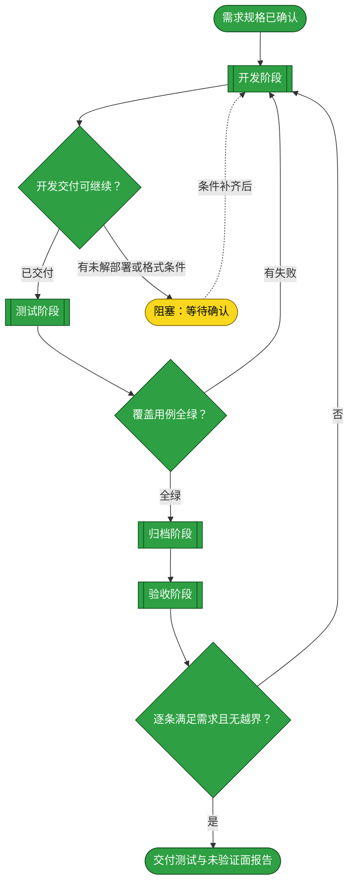
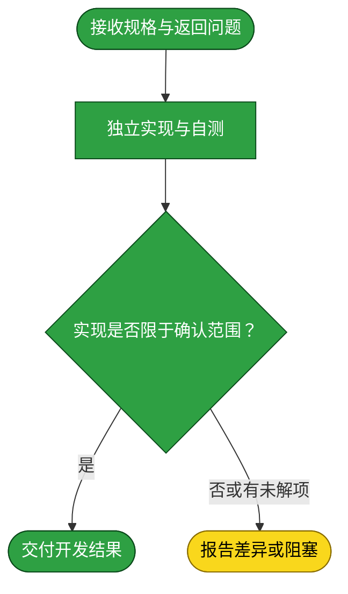
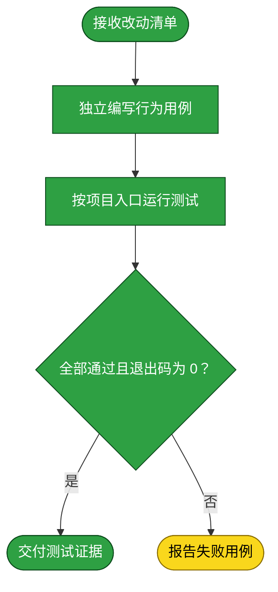
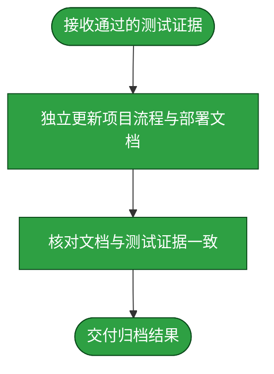
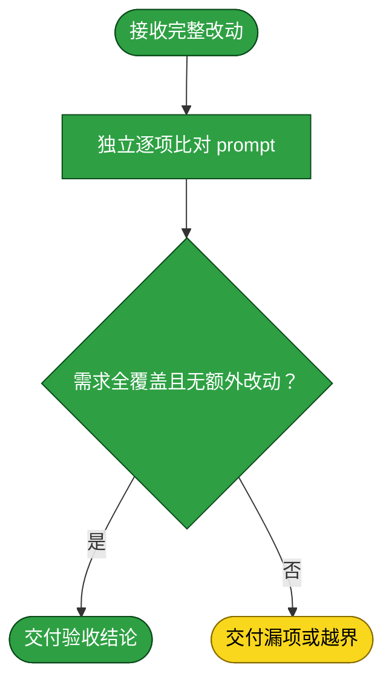

# 需求：解除字幕 Provider 对元数据刮削的耦合并导出 Jellyfin 元数据

```yaml
target: assets/projects/home-media-pilot/feature-flow.md、assets/projects/home-media-pilot/deploy.md 与本需求文档的当前有效正文
output: assets/projects/home-media-pilot/feature-flow.md、assets/projects/home-media-pilot/deploy.md 与本需求文档；不产生现场刮削报告。
prompt:
  - 测试HMP的刮削能力，根据不同的媒体库，配置不同的刮削器Provider，对媒体库资源进行刮削。产出报告
  - 1.先忽略open subtitles 2. 尝试跑通tvmaze和metatube，注意需要下载符合jellyfin的meta格式
  - 卸载opensubtitles应该讲对应的检查也一起接触不应该写死
  - 开放读写权限，
  - 电影也可以走TVMaze，根据配置来而不是名字来
  - 再找一个免费的可以刮削电影的？imdb可以么
  - 可以，新增TMBD Provider吧
  - 更正“你确认有覆盖持久 TMDb sidecar 保留的书面许可；我会保留导出路径，并在说明中注明 HMP 不会自动验证该许可或清理过期数据”的描述，应该是采用让使用hmo用户自己负责
  - 修正，不定死刮Provider的职能，在媒体库中配置使用哪个刮削
```

本需求解除元数据匹配对字幕 Provider 的不必要依赖。每个媒体库以已保存的 `metadata_link_id`/ProviderLink 作为用户配置的 Provider 选择；HMP 不按库名或资源媒体类型分配、交换或回退 Provider。适配器能力是独立事实：TVMaze 使用 show/series API，MetaTube 使用 movie API；错类型搜索返回空结果且不发网络请求，显式错类型详情在请求前抛出 typed business error。TMDb 支持电影与 TV 搜索和详情：类型搜索调用 `/search/movie` 或 `/search/tv`（series/episode 映射 TV），无类型搜索使用有界 `/search/multi` 并过滤非 movie/TV 与无海报结果；TMDb 详情要求显式 `media_type`，数字 ID 本身不能消歧，且候选 Provider 数字 ID 是 Jellyfin NFO 的规范标识。用户显式选择候选后，HMP 更新数据库并可在启用且配置物理根的库路径输出 Jellyfin NFO 与海报 sidecar；不自动选择、不覆盖已有目标、不修改媒体字节。TMDb 电影与 TV/series NFO 均用 `<tmdbid>` 与 `<uniqueid type="tmdb">` 写入所选 TMDb 数字 ID。TMDb 内容持久留存授权与期限由 HMP 用户/运营方负责；HMP 不核验授权、不执行过期删除。离线自动化测试与文档更新构成本地验收范围；目标实例的连接测试、真实资源扫描/刮削、sidecar 实写、部署与 Jellyfin 导入均不执行且未验证。

## 主流程图



## START

本流程的目标是准确说明每个媒体库以其已保存的 `metadata_link_id`/ProviderLink 作为用户配置的 Provider 选择，HMP 不按库名或资源媒体类型分配、交换或回退 Provider。适配器能力须与路由政策分开描述：TVMaze 的 show/series API 与 MetaTube 的 movie API 保持各自域；错误媒体类型搜索返回空且不发请求，显式错误类型详情在请求前抛出 typed business error。TMDb 支持电影和 TV 搜索/详情；类型搜索用 `/search/movie` 或 `/search/tv`（series/episode 映射 TV），无类型搜索用有界 `/search/multi` 并过滤非 movie/TV 与无海报行；详情必须显式给出 `media_type`，数字 ID 单独不能区分类型，候选数字 Provider ID 保留用于 Jellyfin NFO。TMDb 电影与 TV/series NFO 均用 `<tmdbid>` 与 `<uniqueid type="tmdb">` 输出该 ID。保留 no-overwrite、no-media-byte-change 和用户/运营方承担授权与留存责任的边界；本轮只修订文档，不执行现场连接、资源刮削、sidecar 写入、部署或 Jellyfin 导入，也不声称现场验证。

- 输入参数：无
- 输出参数：
  - `REQ_SPEC`：本文件前置块中最后一条 prompt 与本流程的验收边界；去向为 `DEVELOP`

## DEVELOP

由独立 subagent 完成，仅改本需求 target 范围。元数据搜索/预览不得因未使用的字幕 Provider 停用而失败；字幕搜索仍按其自身 Provider 状态判定。用户手动选择候选后，生成 Jellyfin NFO 与封面图；不自动选择候选，不覆盖已有目标文件，不写入视频内容。媒体挂载读写调整只能支持这些导出产物，不授予 HMP 通用删除、移动、重命名能力。部署端缺少主机访问权或不能限制写入范围时，交付开发结果并标记现场阻塞，不假称部署完成。



- 输入参数：
  - `REQ_SPEC`：需求规格；来源为 `START`
  - `TEST_VERDICT`：上一轮测试结论；来源为 `TEST_GATE`
  - `ACCEPT_FAILURE`：验收差异；来源为 `ACCEPT_GATE`
  - `DEV_RESOLVED`：需求方确认的解阻结果；来源为 `BLOCKED`
  - `FAILURE_REPORT`：测试失败详情；来源为 `TEST_GATE`
- 输出参数：
  - `REQ_SPEC`：需求规格；去向为 `D_START`
  - `DEV_RESULT`：代码改动、自测结果与未解条件；去向为 `D_OUT` 或 `DEV_GATE`

### D_START

开发子流程接收本轮规格与返回问题。

- 输入参数：
  - `REQ_SPEC`：需求规格；来源为 `DEVELOP`
- 输出参数：
  - `DEV_BRIEF`：开发作业书；去向为 `D_AGENT`

### D_AGENT

独立 subagent 读代码、仅在 target 范围内实现需求并运行窄范围自测；不写测试文件，不部署运行实例。

- 输入参数：
  - `DEV_BRIEF`：开发作业书；来源为 `D_START`
- 输出参数：
  - `DIFF`：产品改动；去向为 `D_SCOPE`

### D_SCOPE

核对改动是否限于确认范围，并检查是否有尚未解决的部署或导出问题。

- 输入参数：
  - `DIFF`：产品改动；来源为 `D_AGENT`
- 输出参数：
  - `DEV_RESULT`：范围内开发结果；去向为 `D_OUT`
  - `OPEN_QUESTION`：范围外差异或阻塞；去向为 `D_FAIL`

### D_OUT

开发子流程交付自测结果与改动清单。

- 输入参数：
  - `DEV_RESULT`：开发结果；来源为 `D_SCOPE`
- 输出参数：
  - `DEV_RESULT`：开发结果；去向为 `DEV_GATE`

### D_FAIL

开发子流程报告未解问题，不扩大需求。

- 输入参数：
  - `OPEN_QUESTION`：未解问题；来源为 `D_SCOPE`
- 输出参数：
  - `OPEN_QUESTION`：未解问题；去向为 `DEV_GATE`

## DEV_GATE

只有改动范围清楚且无未解条件时进入测试；未解的现场条件转交需求方确认。

- 输入参数：
  - `DEV_RESULT`：开发结果；来源为 `DEVELOP`
  - `OPEN_QUESTION`：未解问题；来源为 `DEVELOP`
- 输出参数：
  - `DEV_RESULT`：可测试改动；去向为 `TEST`
  - `OPEN_QUESTION`：待确认问题；去向为 `BLOCKED`

## BLOCKED

等待需求方补充现场部署访问方式或确认可执行范围；确认后返回开发阶段。不得在阻塞期间写现场媒体目录。

- 输入参数：
  - `OPEN_QUESTION`：未解条件；来源为 `DEV_GATE`
- 输出参数：
  - `DEV_RESOLVED`：需求方确认后的范围；去向为 `DEVELOP`

## TEST

本轮是知识库文档修订，不编写或运行 HMP 源码测试。文档验收须确认：媒体库已保存的 `metadata_link_id`/ProviderLink 是用户配置的 Provider 选择，HMP 不按库名或资源媒体类型分配、交换或回退 Provider；TVMaze 与 MetaTube 的适配器域、错类型不发请求/抛 typed business error 行为明确；TMDb movie+TV 支持、按类型搜索、series/episode 到 TV 映射、有界多类型搜索过滤、详情显式 `media_type`、数字 ID 规范性及兼容代价明确；电影与 TV/series NFO 的 TMDb 标签均正确。离线 mock 不证明 TVMaze/MetaTube 在线可用，也不证明实时刮削或导入。保留 HMP 用户/运营方承担授权与留存责任、C-002、no-overwrite、no-media-mutation、offline-only 与现场验证排除要求；执行知识库 `_lint` 和根 `git diff --check`。不做 live calls 或 HMP tests。



- 输入参数：
  - `DEV_RESULT`：开发结果；来源为 `DEV_GATE`
- 输出参数：
  - `DEV_RESULT`：开发结果；去向为 `T_START`
  - `TEST_EVIDENCE`：用例、运行结果与退出码；去向为 `TEST_GATE`
  - `FAILURE_REPORT`：失败用例与原因；去向为 `TEST_GATE`

### T_START

测试子流程接收开发改动清单与行为要求。

- 输入参数：
  - `DEV_RESULT`：开发结果；来源为 `TEST`
- 输出参数：
  - `TEST_BRIEF`：独立测试作业书；去向为 `T_AGENT`

### T_AGENT

独立 subagent 只写本需求所需测试，不修改产品代码。

- 输入参数：
  - `TEST_BRIEF`：测试作业书；来源为 `T_START`
- 输出参数：
  - `TEST_CASES`：本需求测试用例；去向为 `T_RUN`

### T_RUN

按 `tests/README.md` 给出的项目测试入口运行用例。

- 输入参数：
  - `TEST_CASES`：测试用例；来源为 `T_AGENT`
- 输出参数：
  - `TEST_RESULT`：测试输出与退出码；去向为 `T_VERDICT`

### T_VERDICT

全部用例通过且退出码为零才判全绿。

- 输入参数：
  - `TEST_RESULT`：测试结果；来源为 `T_RUN`
- 输出参数：
  - `TEST_EVIDENCE`：全绿证据；去向为 `T_PASS`
  - `FAILURE_REPORT`：失败结果；去向为 `T_FAIL`

### T_PASS

交付通过的用例与运行证据。

- 输入参数：
  - `TEST_EVIDENCE`：全绿证据；来源为 `T_VERDICT`
- 输出参数：
  - `TEST_EVIDENCE`：测试证据；去向为 `TEST_GATE`

### T_FAIL

交付失败用例与原因，不在测试阶段修改产品代码。

- 输入参数：
  - `FAILURE_REPORT`：失败结果；来源为 `T_VERDICT`
- 输出参数：
  - `FAILURE_REPORT`：失败原因；去向为 `TEST_GATE`

## TEST_GATE

本轮限定为文档更正，不重新运行 HMP 源码测试或前端构建，也不做 live calls。此前完整后端命令 `UV_CACHE_DIR=.uv-cache uv run pytest -q` 以退出码 0 完成，570 passed、28 deprecation warnings；主聚焦命令 59 passed、退出码 0，补充聚焦命令 36 passed、退出码 0。前端 `npm run build` 在后端 TV endpoint 扩展前通过；扩展未改前端源码，不将其表述为扩展后的新构建。当前阶段运行知识库 lint 命令 `UV_CACHE_DIR=.uv-cache uv run --with pytest==9.1.1 pytest _lint -q` 并确认退出码为 0，且根 `git diff --check` 无 whitespace errors，方可进入文档归档阶段；检查失败不跳过。现场连接、资源刮削、sidecar 实写与 Jellyfin 导入继续列为未验证且不作为本轮门槛。

- 输入参数：
  - `TEST_EVIDENCE`：测试证据；来源为 `TEST`
  - `FAILURE_REPORT`：测试失败；来源为 `TEST`
- 输出参数：
  - `TEST_VERDICT`：全绿结论；去向为 `ARCHIVE` 或 `DEVELOP`
  - `TEST_EVIDENCE`：测试证据；去向为 `ARCHIVE`
  - `FAILURE_REPORT`：失败详情；去向为 `DEVELOP`

## ARCHIVE

由独立 subagent 将已验证的元数据路由、TMDb 行为、Jellyfin 导出边界与部署配置写入 home-media-pilot 项目的流程说明和部署说明；现场未实测的事实标记为未验证，不写成已验证。已完成文档一致性核对，未移动本需求文件。



- 输入参数：
  - `TEST_EVIDENCE`：测试证据；来源为 `TEST_GATE`
  - `TEST_VERDICT`：全绿结论；来源为 `TEST_GATE`
- 输出参数：
  - `TEST_EVIDENCE`：测试证据；去向为 `A_START`
  - `TEST_VERDICT`：全绿结论；去向为 `A_START`
  - `ARCHIVED`：项目文档更新；去向为 `A_OUT`

### A_START

归档子流程接收开发事实与测试证据。

- 输入参数：
  - `TEST_EVIDENCE`：测试证据；来源为 `ARCHIVE`
  - `TEST_VERDICT`：全绿结论；来源为 `ARCHIVE`
- 输出参数：
  - `ARCHIVE_BRIEF`：已验证事实与待标未验证面；去向为 `A_AGENT`

### A_AGENT

独立 subagent 更新目标项目的权威流程与部署说明，不改项目源码或测试。

- 输入参数：
  - `ARCHIVE_BRIEF`：归档作业书；来源为 `A_START`
- 输出参数：
  - `DOC_DIFF`：文档改动；去向为 `A_CHECK`

### A_CHECK

核对文档只写已验证事实且与实现一致。

- 输入参数：
  - `DOC_DIFF`：文档改动；来源为 `A_AGENT`
- 输出参数：
  - `ARCHIVED`：自洽项目文档；去向为 `A_OUT`

### A_OUT

交付归档阶段结果。

- 输入参数：
  - `ARCHIVED`：项目文档；来源为 `A_CHECK`
- 输出参数：
  - `ARCHIVED`：归档结果；去向为 `ACCEPT`

## ACCEPT

独立验收者比对全部 diff 与 prompt 当前有效条目，确认：字幕 Provider 停用不阻断元数据操作；每个媒体库按用户保存的 `metadata_link_id`/ProviderLink 选择 Provider；HMP 不按库名或资源媒体类型分配、交换或自动回退 Provider；TVMaze show/series API 与 MetaTube movie API 的实际边界、错类型搜索不发请求且返回空、错类型详情请求前抛 typed business error 均有准确说明。确认 TMDb movie+TV 搜索/详情能力：movie 与 TV 类型搜索端点、series/episode→TV、无类型有界 `/search/multi` 且过滤非 movie/TV 与无海报项、详情显式 `media_type`、数字 ID 保持 canonical、遗漏 `media_type` 的调用者兼容成本。确认电影与 TV/series Jellyfin NFO 均写所选 TMDb 数字 ID 至 `<tmdbid>` 与 `<uniqueid type="tmdb">`。还须确认 HMP 用户/运营方承担许可与留存责任且文档不声称当前用户已授权；no-overwrite、no-media-byte-change、offline-only 和现场验证排除均保留。验收要求知识库 `_lint` 与根 `git diff --check` 通过；不要求也不得执行 live calls、HMP tests、部署、实物刮削或导入。离线 mock 不证明实时服务可用、刮削或导入。任何遗漏或越界退回开发；本次独立验收结果为 PASS，ACCEPT 节点已据此标绿，未验证面随报告交付。



- 输入参数：
  - `ARCHIVED`：落档结果；来源为 `ARCHIVE`
- 输出参数：
  - `ARCHIVED`：项目文档；去向为 `C_START`
  - `ACCEPT_VERDICT`：逐项验收结论；去向为 `ACCEPT_GATE`
  - `ACCEPT_FAILURE`：差异报告；去向为 `ACCEPT_GATE`

### C_START

验收子流程接收已归档文档与当前工作区全部差异。

- 输入参数：
  - `ARCHIVED`：项目文档；来源为 `ACCEPT`
- 输出参数：
  - `FULL_DIFF`：全部代码与文档差异；去向为 `C_AGENT`

### C_AGENT

独立 subagent 对照需求最后一条有效陈述与全部差异。

- 输入参数：
  - `FULL_DIFF`：全部改动；来源为 `C_START`
- 输出参数：
  - `COMPARISON`：逐项对应关系；去向为 `C_VERDICT`

### C_VERDICT

需求项全部对应且没有额外差异才判验收通过。

- 输入参数：
  - `COMPARISON`：逐项对照；来源为 `C_AGENT`
- 输出参数：
  - `ACCEPT_VERDICT`：通过结论；去向为 `C_PASS`
  - `ACCEPT_FAILURE`：遗漏或越界；去向为 `C_FAIL`

### C_PASS

交付验收通过结论。

- 输入参数：
  - `ACCEPT_VERDICT`：验收结论；来源为 `C_VERDICT`
- 输出参数：
  - `ACCEPT_VERDICT`：通过；去向为 `ACCEPT_GATE`

### C_FAIL

交付需求遗漏或范围外差异，不在验收阶段修正。

- 输入参数：
  - `ACCEPT_FAILURE`：差异报告；来源为 `C_VERDICT`
- 输出参数：
  - `ACCEPT_FAILURE`：差异报告；去向为 `ACCEPT_GATE`

## ACCEPT_GATE

独立验收结论为 PASS，已交付测试与未验证面报告，并据此将验收节点标为已执行。需求文档仍留在 inbox；收到需求方明确同意归档前不移动。

- 输入参数：
  - `ACCEPT_VERDICT`：验收结论；来源为 `ACCEPT`
  - `ACCEPT_FAILURE`：差异报告；来源为 `ACCEPT`
- 输出参数：
  - `FINAL_REPORT`：验收后的测试报告；去向为 `REPORT`
  - `ACCEPT_FAILURE`：遗漏或越界；去向为 `DEVELOP`

## REPORT

交付离线测试命令、结果与退出码，并说明外部 API/provider 使用 mock 及覆盖范围；未观察到的 Provider 候选、部署、资源刮削、sidecar 文件与 Jellyfin 导入均明确标为未验证，不要求执行这些现场操作。

- 输入参数：
  - `FINAL_REPORT`：实测报告；来源为 `ACCEPT_GATE`
- 输出参数：无
