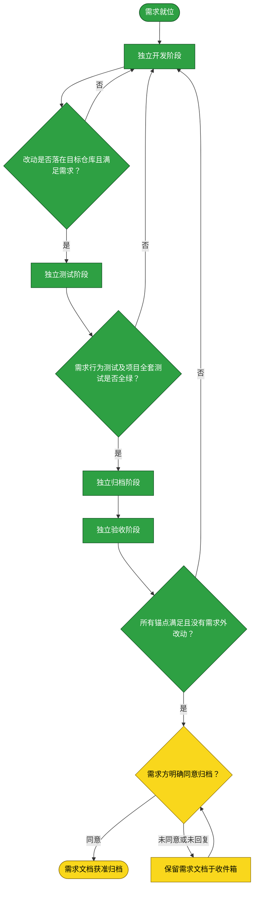

# 需求：媒体库设置支持排序且下拉沿用该顺序

```yaml
target: assets/projects/home-media-pilot/home-media-pilot/
output: assets/projects/home-media-pilot/home-media-pilot/
prompt:
  - 新增需求，媒体库设置支持排序，别处下拉顺序按照设置中的顺序来
```

本流程把媒体库排序需求从开发推进至独立验收，并在取得需求方明确同意前保留本文件于收件箱。排序顺序由服务端保存，设置页修改后资源选择下拉须采用相同顺序。

## 需求澄清

### 澄清记录

- 无——本需求 prompt 无下游无法自行取回的模糊点；持久化的用户设置与全应用下拉顺序同步已由需求直接确定，具体交互由开发按可用性实现。
  - 裁决：顺序为服务端持久化的媒体库设置，不以单浏览器临时状态充当权威。
  - 反论与代价：需承担数据模式/API迁移与排序写入契约；若只在浏览器保存，跨设备、跨会话与其他客户端无法共享设置，因此不选客户端本地状态。
  - 验收面：顺序修改后刷新及重新加载媒体库，下拉仍显示同一顺序。

### 验收锚点

- A1：用户能在媒体库设置内改变媒体库先后顺序，且顺序持久化。
- A2：应用所有媒体库选择下拉按设置顺序展示，不受名称字典序影响。
- A3：新增、删除媒体库后排序仍确定、完整且可继续调整。

### 范围边界

- 不做：媒体库名称、启用状态或 Provider 项目的排序。
- 不做：对资源、任务或 Provider 下拉的排序改造。

## 主流程图



## START

需求原话、验收锚点与范围边界已明确，可以启动开发。

- 输入参数：无
- 输出参数：
  - `REQ_SPEC`：本文件前置块与需求澄清；去向为 `DEVELOP`

## DEVELOP

由独立开发主体在目标项目仓库实现服务端持久化顺序、媒体库设置排序交互及媒体库下拉顺序同步。修改范围限于目标项目仓库；仓库开发分支按目标项目流程核实。该阶段已交付排序字段与迁移、排序 API、设置页上下移操作、列表排序以及新增和删除排序维护。

- 输入参数：
  - `REQ_SPEC`：需求规格；来源为 `START`
  - `DEV_VERDICT`：开发复核失败后继续开发的结论；来源为 `DEV_GATE`
  - `TEST_VERDICT`：测试失败后返回开发的结论；来源为 `TEST_GATE`
  - `FAILURE_REPORT`：测试失败与原因（若由失败测试返回）；来源为 `TEST_GATE`
  - `ACCEPT_FAILURE`：验收发现的漏项或范围外修改（若由验收返回）；来源为 `ACCEPT_GATE`
- 输出参数：
  - `DEV_RESULT`：产品改动清单与构建结果；去向为 `DEV_GATE`

## DEV_GATE

检查开发结果是否仍在目标仓库范围内且覆盖排序设置、持久化与下拉同步。检查通过后进入测试；未通过时将具体失败交还开发阶段。

- 输入参数：
  - `DEV_RESULT`：产品改动清单；来源为 `DEVELOP`
- 输出参数：
  - `DEV_RESULT`：开发改动清单；去向为 `TEST`、`ARCHIVE` 或 `ACCEPT`
  - `DEV_VERDICT`：开发交付可测试或需重做；去向为 `TEST` 或 `DEVELOP`

## TEST

由独立测试主体编写并运行排序需求用例，再按项目测试说明运行全套测试。排序 API 测试覆盖持久化重排、完整 ID 集校验、新库追加、删除后顺序连续；迁移测试覆盖旧库确定性排序。最终项目套件结果为全绿且退出码 0。

- 输入参数：
  - `DEV_VERDICT`：开发交付可测试的判定；来源为 `DEV_GATE`
  - `DEV_RESULT`：产品改动清单；来源为 `DEV_GATE`
- 输出参数：
  - `TEST_EVIDENCE`：需求测试、全套测试与前端构建结果；去向为 `TEST_GATE`
  - `FAILURE_REPORT`：失败用例及原因；去向为 `DEVELOP`

## TEST_GATE

只在需求行为测试、迁移测试及项目全套测试均通过且退出码为 0 时放行。失败时不由测试阶段修产品代码，回到开发阶段处理后重跑。

- 输入参数：
  - `TEST_EVIDENCE`：测试与构建结果；来源为 `TEST`
  - `FAILURE_REPORT`：失败用例及原因（若有）；来源为 `TEST`
- 输出参数：
  - `TEST_EVIDENCE`：通过的测试与构建证据；去向为 `ARCHIVE` 或 `ACCEPT`
  - `TEST_VERDICT`：测试通过或失败；去向为 `ARCHIVE` 或 `DEVELOP`
  - `FAILURE_REPORT`：失败用例与原因；去向为 `DEVELOP`

## ARCHIVE

由独立归档主体把已验证的实现事实写入项目流程文档，不把开发中间过程或未验证的浏览器行为写成已实现事实。本次已在项目 `CONFIG_LIBRARY` 流程中补入持久化顺序、API契约、新建/删除处理与消费列表顺序的界限。

- 输入参数：
  - `DEV_RESULT`：开发改动清单；来源为 `DEV_GATE`
  - `TEST_EVIDENCE`：通过的测试与构建结果；来源为 `TEST_GATE`
  - `TEST_VERDICT`：测试通过的判定；来源为 `TEST_GATE`
- 输出参数：
  - `ARCHIVED_FACTS`：已核对的项目流程文档改动；去向为 `ACCEPT`

## ACCEPT

由未参与开发、测试、归档的独立验收主体逐项比对有效需求、验收锚点与全量 diff。不能把前端构建或 API 测试推作浏览器实测证据。本次独立验收已判定 A1-A3 满足；真实浏览器交互及服务重启端到端行为未由本轮测试直接验证，保留为未验证面。

- 输入参数：
  - `ARCHIVED_FACTS`：归档后的项目流程事实；来源为 `ARCHIVE`
  - `DEV_RESULT`：产品改动清单；来源为 `DEV_GATE`
  - `TEST_EVIDENCE`：测试和构建证据；来源为 `TEST_GATE`
  - `REQ_SPEC`：有效需求与验收锚点；来源为 `START`
- 输出参数：
  - `ACCEPT_VERDICT`：逐项比对结果；去向为 `ACCEPT_GATE`
  - `ACCEPT_FAILURE`：未覆盖要求或范围外改动（若有）；去向为 `DEVELOP`

## ACCEPT_GATE

分别核对设置可调序且持久化、所有媒体库下拉采用同一顺序、增删后顺序有效，并核对全部变更均可追溯到需求。全部满足才交需求方决定归档；否则回开发阶段修正。

- 输入参数：
  - `ACCEPT_VERDICT`：逐项验收结论；来源为 `ACCEPT`
- 输出参数：
  - `ACCEPTED`：需求锚点全部满足且无需求外改动；去向为 `REQUESTER_APPROVAL`
  - `ACCEPT_FAILURE`：漏项或范围外改动；去向为 `DEVELOP`

## REQUESTER_APPROVAL

验收通过后等待需求方明确决定是否归档。未回复不视为同意；只有明确同意才把整份需求文档移入归档目录。

- 输入参数：
  - `ACCEPTED`：验收通过结论；来源为 `ACCEPT_GATE`
  - `REQUESTER_DECISION`：需求方决定；来源为流程外部
- 输出参数：
  - `ARCHIVE_MOVE`：获准后移动整份需求文档；去向为 `DONE`
  - `WAITING_DECISION`：尚无明确同意；去向为 `WAIT`

## WAIT

需求方未同意或未回复时保留本文件于收件箱，不移动、不复制、不自动提交。

- 输入参数：
  - `WAITING_DECISION`：等待需求方决定；来源为 `REQUESTER_APPROVAL`
- 输出参数：
  - `REQUESTER_DECISION`：需求方后续明确决定；去向为 `REQUESTER_APPROVAL`

## DONE

需求方明确同意归档后，把本文件整篇移入 `assets/archive/`；需求方未同意时不得到达本节点。

- 输入参数：
  - `ARCHIVE_MOVE`：经需求方批准的文档移动；来源为 `REQUESTER_APPROVAL`
- 输出参数：无
