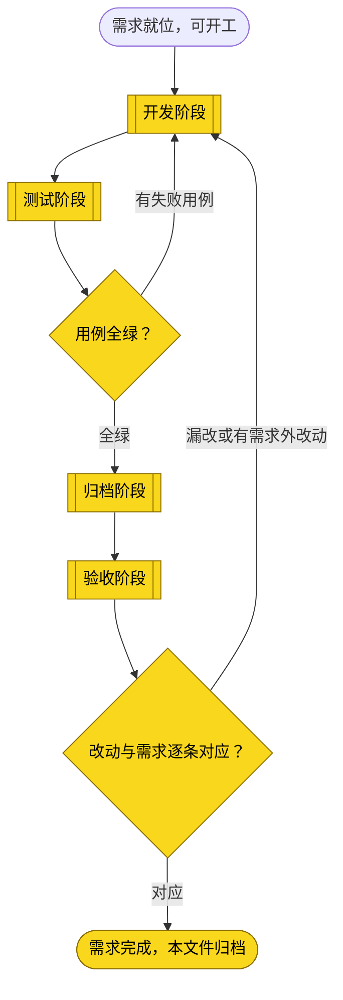
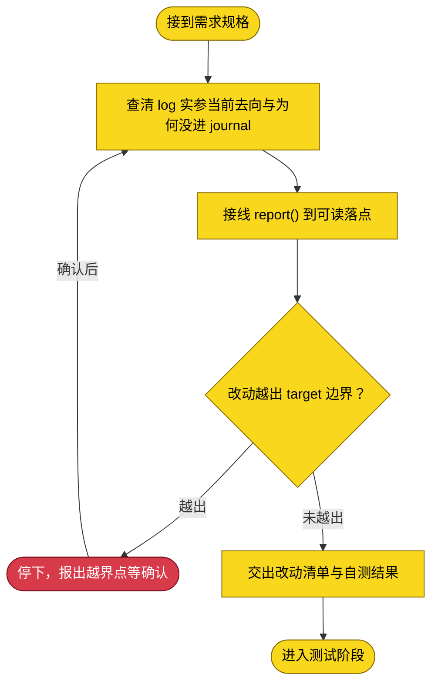
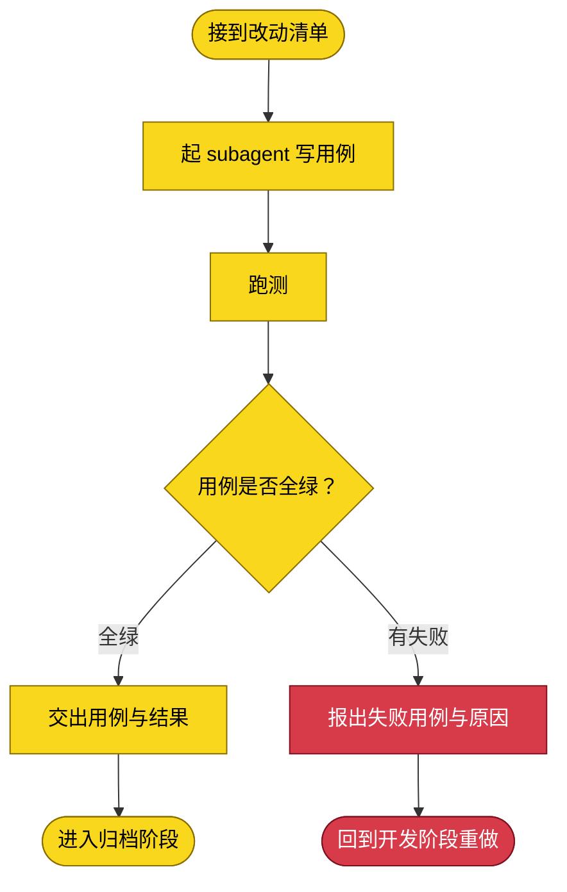
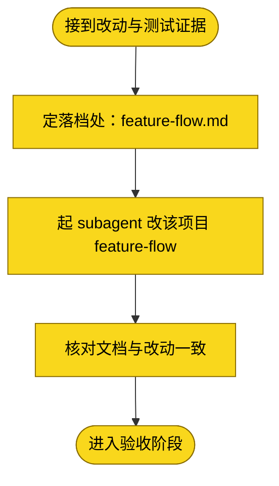
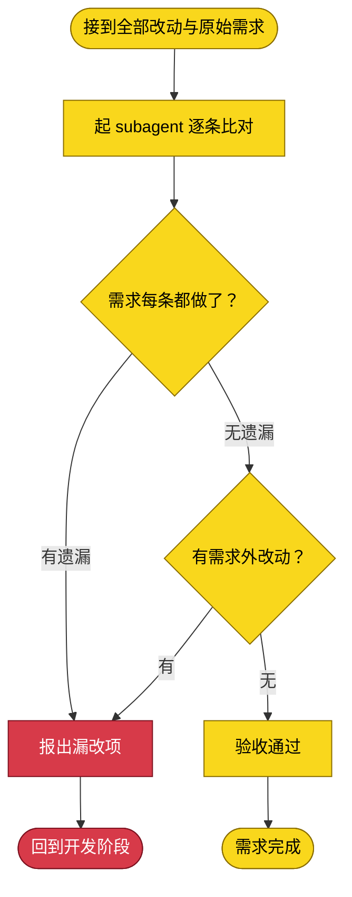

# 需求：让 dsh-credentials 的运行日志真实落盘可检索，使 rebind/install 失败可诊断

```yaml
target: assets/projects/dsh-credentials/dsh-credentials/src/host/（report/log 的落点接线，横跨 bootstrap.ts 与各形态 adapters）
output: assets/projects/dsh-credentials/dsh-credentials/src/（日志落盘实现），并将既成事实落档到 assets/projects/dsh-credentials/feature-flow.md
prompt:
  - 不想做这样的修复了，要么完善一下日志系统，要么你调用命令行自行探测
```

本需求要修的不是某个具体连接失败，而是**故障不可诊断**这个系统性缺陷：`dsh-credentials` 的 install/rebind 路径埋点齐全（远端脚本全文、ssh argv、远端回显、REMOTE_REJECTED 判定都经 `report()` 产生），但这些输出在实际部署中**没有落到任何可读的地方**——导致「报成功却装不上」「REMOTE_REJECTED 拦截」这类故障，原因明明被记录却无处取回，只能靠用户手输密码做远端取证。修好日志落点后，任何绑定失败都能直接给出 argv 与远端回显，一步定位。

## 主流程图



## START

开工前的就位判定：需求已在前置块写清 `target` 与 `output`，且「日志产生但未落盘」这一事实已在真实部署上取证（见下）。本节点不出分支。

**输入**

- `REQ_READY`：前置块三键已填、缺口已取证的状态；来源为本文件的前置数据块与下方实测记录。

**输出**

- `REQ_SPEC`：本需求的规格，即前置块的三键内容；去向为 `DEVELOP`。

## 已取证的缺口事实（诊断结论，随需求携带）

这些事实已在真实部署上取到，是开发阶段的起点，勿推翻：

1. **埋点齐全**：`src/host/bootstrap.ts` 的 install/rebind 每步都 `report()`——远端脚本全文（L234）、ssh argv（L262/L423）、远端回显（L283/L442）、REMOTE_REJECTED 与回显比对判定（L311/L455）。
2. **输出未落盘**：dsh 以 systemd 服务 `deepseek-harness.service` 运行，进程 stdout/stderr 接 journal；但 openwrt rebind 发生的整段窗口（01:30–01:52），旧进程（PID 501263）的 journal `-- No entries --`，新进程（515885）的 journal 仅 1 行启动横幅。同进程 01:16 的 exception 堆栈却进了 journal——证明 **cordis/bundle 的 `report()` 输出没接到进程 stdout**，exception 级 stderr 才接得上。
3. **一个待解的矛盾**：dsh-credentials 以 bundle 形态挂载（`profiles/web/package.json` 的 `link:` 行），bundle 的 `run()` 用 `spawn` 逐项传 argv，公钥本不应被截断成无空格——但 openwrt rebind 实际触发了「`$1` 无空格」的 `REMOTE_REJECTED` 拦截。截断发生在哪一环（转发层拼串？openwrt 端 busybox ash 的 `sh -s` 参数处理？）**因日志缺失而无法分辨**，这正是本需求要解的。

## DEVELOP

开发阶段。产出是**功能改动本身**——让 `report()` 的输出在 bundle 与 cordis 两种形态下都落到一个可读、可检索的落点。起独立 subagent，不承接对话上下文，只交 `target`、`output`、`prompt` 与本节边界。

**方向约束（不得偏离本质）**：日志要落到**可读的位置**——优先写进 `DSH_HOME` 下的一个日志文件（如 `$DSH_HOME/logs/dsh-credentials.log`），并保留向既有 logger 的输出；落盘必须可释放（fiber 持有 disposer）、不得记密码/私钥（沿用既有「密码不进日志」约束）。先查清 bundle 形态 `createBootstrapPorts(log)` 的 `log` 实参当前接到哪、为何没进 journal，再决定接线点。

**边界**：只改 `target` 指到的宿主侧日志接线；发现必须改动 dsh 宿主工程本身（`@deepseek-ai/dsh`）才能让 logger 落盘时，停下报出，不自行改宿主。

**输入**

- `REQ_SPEC`：本需求的规格；来源为 `START`。
- `FAILURE_REPORT`：失败用例与原因；来源为 `TEST` 回边。
- `TEST_VERDICT`：全绿与否（失败时随回边到达）；来源为 `TEST_GATE`。
- `ACCEPT_FAILURE`：漏改或多余的处置要求；来源为 `ACCEPT` 回边。
- `ACCEPT_VERDICT`：逐条对应与否（不通过时随回边到达）；来源为 `ACCEPT_GATE`。

**输出**

- `DEV_RESULT`：改动清单与自测结果；去向为 `TEST`、`ARCHIVE`、`ACCEPT`。



### D_IN

承接 `START` 交来的需求规格，整理成交给 subagent 的作业书。本节点不出分支。

**输入**

- `REQ_SPEC`：本需求的规格；来源为 `START`。

**输出**

- `DEV_BRIEF`：作业书；去向为 `D_PROBE`。

### D_PROBE

先查清事实再动手：bundle 形态 `createBootstrapPorts(log)` 的 `log` 实参当前接到哪、cordis 形态 `ctx.get('logger')` 的 exporter 落到哪、为何二者都没进 journal。这一步是诊断，不改代码。

**输入**

- `DEV_BRIEF`：作业书；来源为 `D_IN`。
- `SCOPE_RESOLVED`：已确认的边界；来源为 `D_STOP`。

**输出**

- `LOG_GAP`：日志断点的确切位置；去向为 `D_EDIT`。

### D_EDIT

按最小范围接线：让 `report()` 的输出落到可读位置（优先 `$DSH_HOME/logs/` 下的文件），保留既有 logger 输出与「密码不进日志」约束。

**输入**

- `LOG_GAP`：日志断点位置；来源为 `D_PROBE`。

**输出**

- `DIFF`：本次改动；去向为 `D_SCOPE`。

### D_SCOPE

判定改动是否越出 `target` 边界。越界必须报出由需求方确认，不自行扩大范围。

**输入**

- `DIFF`：本次改动；来源为 `D_EDIT`。

**输出**

- `SCOPE_VERDICT`：越界与否及落点；去向为 `D_STOP` 或 `D_REPORT`。

### D_STOP

越界出口：停下报出越界点，等需求方确认是扩大 `target` 还是收回改动。

**输入**

- `SCOPE_VERDICT`：越界点；来源为 `D_SCOPE`。

**输出**

- `SCOPE_RESOLVED`：已确认的边界；去向为 `D_PROBE`。

### D_REPORT

交出改动清单与自测结果。开发自测只证明改动跑得起，覆盖需求行为由测试阶段负责。

**输入**

- `DIFF`：本次改动；来源为 `D_EDIT`。
- `SCOPE_VERDICT`：未越界的判定；来源为 `D_SCOPE`。

**输出**

- `DEV_RESULT`：改动清单与自测结果；去向为 `D_OUT`。

### D_OUT

开发阶段出口：改动已就位且未越界。本节点无出边。

**输入**

- `DEV_RESULT`：改动清单与自测结果；来源为 `D_REPORT`。

**输出**

- `DEV_RESULT`：改动清单与自测结果；去向为 `TEST`。

## TEST

测试阶段。产出是覆盖本需求行为的用例与运行结果。起独立 subagent，独立于开发者。跑法与判据取回自 `assets/projects/dsh-credentials/dsh-credentials/tests/README.md`，判据为全绿且退出码 0。用例须覆盖「report() 的输出真的写到了声明的落点」与「密码/私钥不出现在落点里」。测试失败回 `DEVELOP`，测试阶段不改产品代码。

**输入**

- `DEV_RESULT`：改动清单；来源为 `DEVELOP`。

**输出**

- `TEST_EVIDENCE`：用例与运行结果；去向为 `ARCHIVE`。
- `FAILURE_REPORT`：失败用例与原因；去向为 `DEVELOP`。



### T_IN

承接开发阶段交来的改动清单，整理成测试作业书。本节点不出分支。

**输入**

- `DEV_RESULT`：改动清单；来源为 `DEVELOP`。

**输出**

- `TEST_BRIEF`：测试作业书；去向为 `T_AGENT`。

### T_AGENT

起一个独立 subagent，按 `TEST_BRIEF` 写覆盖本需求行为要求的用例，独立于开发阶段给判断。

**输入**

- `TEST_BRIEF`：测试作业书；来源为 `T_IN`。

**输出**

- `TEST_CASES`：本次写下的用例；去向为 `T_RUN`。

### T_RUN

运行用例。跑法与判据取回自项目自己的 `tests/README.md`；判据是全绿且退出码为 0。

**输入**

- `TEST_CASES`：本次写下的用例；来源为 `T_AGENT`。

**输出**

- `RUN_RESULT`：运行输出与退出码；去向为 `T_VERDICT`。

### T_VERDICT

判定是否全绿：全部用例通过且运行未被绕过——不靠删用例、放宽断言、跳过用例换取绿灯。

**输入**

- `RUN_RESULT`：运行输出与退出码；来源为 `T_RUN`。

**输出**

- `TEST_VERDICT`：全绿与否；去向为 `T_PASS` 或 `T_FAIL`。

### T_PASS

全绿出口：交出用例与运行结果。本节点不出分支。

**输入**

- `TEST_VERDICT`：全绿判定；来源为 `T_VERDICT`。
- `TEST_CASES`：本次写下的用例；来源为 `T_AGENT`。

**输出**

- `TEST_EVIDENCE`：用例与运行结果；去向为 `T_OUT`。

### T_FAIL

失败出口：报出失败用例与原因，不改产品代码。

**输入**

- `TEST_VERDICT`：失败判定；来源为 `T_VERDICT`。
- `RUN_RESULT`：运行输出；来源为 `T_RUN`。

**输出**

- `FAILURE_REPORT`：失败用例与原因；去向为 `T_BACK`。

### T_BACK

回到开发阶段的出口：带回失败报告。本节点无出边。

**输入**

- `FAILURE_REPORT`：失败用例与原因；来源为 `T_FAIL`。

**输出**

- `FAILURE_REPORT`：失败用例与原因；去向为 `DEVELOP`。

### T_OUT

测试阶段出口：用例全绿，交出用例与结果。本节点无出边。

**输入**

- `TEST_EVIDENCE`：用例与运行结果；来源为 `T_PASS`。

**输出**

- `TEST_EVIDENCE`：用例与运行结果；去向为 `ARCHIVE`。

## TEST_GATE

测试阶段的判定点：本次用例是否全绿且未被绕过。失败走回 `DEVELOP`，全绿进入 `ARCHIVE`。

**输入**

- `RUN_RESULT`：用例运行输出与退出码；来源为 `TEST`。

**输出**

- `TEST_VERDICT`：全绿与否；去向为 `DEVELOP` 或 `ARCHIVE`。

## ARCHIVE

归档阶段。把既成事实落档到 `assets/projects/dsh-credentials/feature-flow.md`。起独立 subagent。只写已验证的事实；未取到证据的环节写进该文档的「未验证面」。

**输入**

- `DEV_RESULT`：改动清单；来源为 `DEVELOP`。
- `TEST_EVIDENCE`：用例与运行结果；来源为 `TEST`。
- `TEST_VERDICT`：全绿与否；来源为 `TEST_GATE`。

**输出**

- `ARCHIVED`：已落档且自洽的文档；去向为 `ACCEPT`。



### A_IN

承接开发与测试两个阶段的产出，整理成落档作业书。本节点不出分支。

**输入**

- `DEV_RESULT`：改动清单；来源为 `DEVELOP`。
- `TEST_EVIDENCE`：用例与运行结果；来源为 `T_PASS`。

**输出**

- `ARCHIVE_BRIEF`：落档作业书；去向为 `A_LOCATE`。

### A_LOCATE

定下落档去处：`target` 落在被收录项目 `dsh-credentials` 的仓库克隆内，故其 `feature-flow.md` 是落档处。本节点不出分支。

**输入**

- `ARCHIVE_BRIEF`：落档作业书；来源为 `A_IN`。

**输出**

- `ARCHIVE_TARGET`：落档处；去向为 `A_AGENT`。

### A_AGENT

起一个独立 subagent，把这次改动的既成事实写进该项目的流程文档。

**输入**

- `ARCHIVE_BRIEF`：落档作业书；来源为 `A_IN`。
- `ARCHIVE_TARGET`：落档处；来源为 `A_LOCATE`。

**输出**

- `DOC_DIFF`：文档改动；去向为 `A_CHECK`。

### A_CHECK

核对落档结果与改动一致。本节点不出分支。

**输入**

- `DOC_DIFF`：文档改动；来源为 `A_AGENT`。

**输出**

- `ARCHIVED`：已落档且自洽的文档；去向为 `A_OUT`。

### A_OUT

归档阶段出口。本节点无出边。

**输入**

- `ARCHIVED`：已落档的文档；来源为 `A_CHECK`。

**输出**

- `ARCHIVED`：已落档的文档；去向为 `ACCEPT`。

## ACCEPT

验收阶段。比对全部 diff 与 `prompt`，两问都成立才通过——需求要求的每处改动都做了，且没有需求外的东西。起独立 subagent，独立于前三阶段。不通过回 `DEVELOP`，验收不自行修正。

**输入**

- `ARCHIVED`：已落档的文档；来源为 `ARCHIVE`。
- `DEV_RESULT`：改动清单；来源为 `DEVELOP`。

**输出**

- `ACCEPT_FAILURE`：漏改或多余的处置要求；去向为 `DEVELOP`。



### C_IN

承接归档阶段的文档与开发阶段的代码改动，合为本次全部改动。本节点不出分支。

**输入**

- `ARCHIVED`：已落档的文档；来源为 `ARCHIVE`。
- `DEV_RESULT`：改动清单；来源为 `DEVELOP`。

**输出**

- `FULL_DIFF`：本次全部改动；去向为 `C_AGENT`。

### C_AGENT

起一个独立 subagent，把 `FULL_DIFF` 与 `prompt` 逐条比对。

**输入**

- `FULL_DIFF`：本次全部改动；来源为 `C_IN`。
- `PROMPT_RECORD`：前置块的 `prompt` 留档；来源为本文件的前置数据块。

**输出**

- `COMPARISON`：逐条对应关系与差异；去向为 `C_COVER`。

### C_COVER

判定需求要求的每一处改动是否都做了：`prompt` 最后一条里的每项要求都能在 `FULL_DIFF` 里找到对应改动。

**输入**

- `COMPARISON`：逐条对应关系；来源为 `C_AGENT`。

**输出**

- `COVERAGE`：覆盖与否及漏改项；去向为 `C_BACK` 或 `C_EXTRA`。

### C_EXTRA

判定改动里是否有需求未要求的东西：`FULL_DIFF` 里每处改动都能追溯到 `prompt` 里的某项要求。

**输入**

- `COVERAGE`：无遗漏的判定；来源为 `C_COVER`。

**输出**

- `EXTRA`：需求外改动；去向为 `C_BACK` 或 `C_PASS`。

### C_BACK

不通过出口：报出漏改项或需求外改动，回开发阶段。验收阶段只判不改。

**输入**

- `COVERAGE`：漏改项；来源为 `C_COVER`。
- `EXTRA`：需求外改动；来源为 `C_EXTRA`。

**输出**

- `ACCEPT_FAILURE`：漏改或多余的处置要求；去向为 `C_OUT`。

### C_OUT

回到开发阶段的出口。本节点无出边。

**输入**

- `ACCEPT_FAILURE`：处置要求；来源为 `C_BACK`。

**输出**

- `ACCEPT_FAILURE`：处置要求；去向为 `DEVELOP`。

### C_PASS

通过出口：需求要求的都做了、且没有需求外的改动。本节点无出边。

**输入**

- `EXTRA`：无需求外改动的判定；来源为 `C_EXTRA`。

**输出**

- `ACCEPTED`：验收通过；去向为 `C_DONE`。

### C_DONE

需求完成的收尾：本文件整篇移入 [assets/archive/](../archive/README.md)（移动而非复制，归档前节点状态全部标绿）。本节点无出边。

**输入**

- `ACCEPTED`：验收通过；来源为 `C_PASS`。

**输出**

- 无。

## ACCEPT_GATE

验收阶段的判定点：改动与需求是否逐条对应。任一问不成立回 `DEVELOP`，两问成立进 `DONE`。

**输入**

- `COMPARISON`：逐条对应关系与差异；来源为 `ACCEPT`。

**输出**

- `ACCEPT_VERDICT`：逐条对应与否；去向为 `DEVELOP` 或 `DONE`。

## DONE

需求完成的终点标记：四个阶段都走完且验收通过，本文件移入 `assets/archive/`。本节点无出边。

**输入**

- `ACCEPTED`：验收通过；来源为 `ACCEPT` 的 `C_PASS`。
- `ACCEPT_VERDICT`：逐条对应与否；来源为 `ACCEPT_GATE`。

**输出**

- `ARCHIVE_MOVE`：把本文件移入 `assets/archive/` 的动作；去向为流程外部的归档动作。
