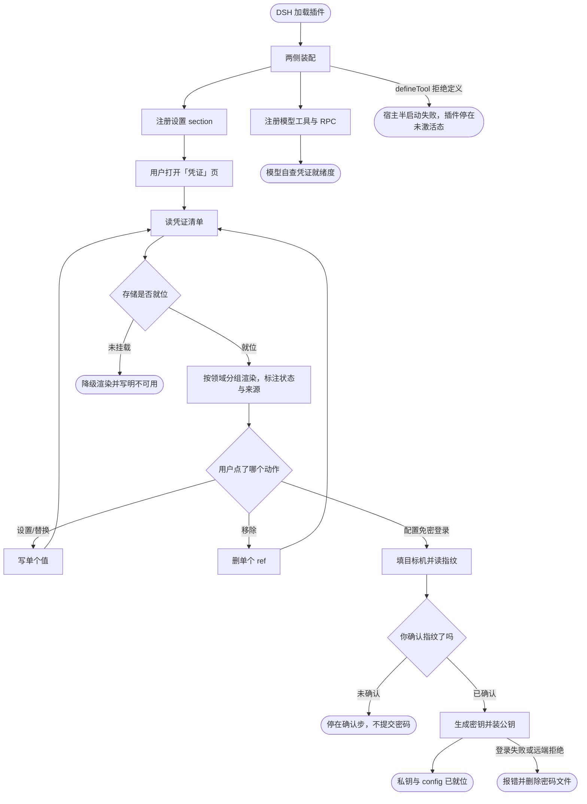

# dsh-credentials 凭证初始化与管理流程

本文档描述 `dsh-credentials` 已实现的流程：DSH 加载本插件后，宿主侧把凭证目录接到凭证 seam 并注册模型工具与三条 RPC，浏览器侧在设置面板注册一个「凭证」页；用户在该页写入一个值，值单向流入本机凭证库，状态回流到页面与模型。文档覆盖流程的主干、分叉点、失败出口，以及每个环节的输入输出；末节 [未验证面](#未验证面) 列出已实现但证据尚未取到的环节，读到的部分未经验证时以该节为准。

本工程的源码在 [dsh-credentials/](dsh-credentials/)（自带 `.git` 与远端），下文所有路径与命令都以该目录为工程根。

## 主流程

## START

DSH 在自己的进程与页面里加载本插件，把运行所需的服务交付给两侧。工程有**两种落地形态**——cordis 与 bundle——二者共享全部业务逻辑，只有 `adapters/` 分叉；形态由构建期决定，不由业务模块决定。本流程描述的主干两形态通用，差异集中在 `MOUNT`。

**两形态都已有活体证据**：cordis 形态以动态包在真实 DSH 进程里激活；bundle 形态在专用 profile `e2e-credentials` 里经 `dsh plugin add file:<pkg>`（官方挂载通道）装成行并跑通页面与业务面。bundle 形态仍**未注册进本仓库的任何 profile**，因而挂载是一个单独、显式的动作。

**输入**

- `PLUGIN_ROOT`：工程根路径；来源为工程部署位置。
- `INJECTED_SERVICES`：运行期可用服务集合。宿主侧用 `credentials`（凭证 seam），客户端用 `slots`（插槽注册）。两者都是**可选读取**，不是硬依赖。

**输出**

- `MOUNT_REQUEST`：装配请求，含两侧入口；去向为 `MOUNT`。

## MOUNT

两侧各自的唯一装配入口：把端口实现与业务对象拼起来，并让每个副作用可释放。本节点是**唯一按形态分叉**的节点——两种形态的差别到此为止，向下的 section 注册、工具定义、读清单、写入、移除完全相同。

形态分叉在构建期完成：`src/{host,client}/adapters/index.ts` 是形态无关入口，`loader-configs/build.json` 的 `adapters` 声明它在两种形态下分别解析到哪个实现。因此**运行时看不到分叉**，只有产物不同。

| 形态 | 宿主通信 | 客户端通信 |
| --- | --- | --- |
| **cordis** | `harness.handle` 注册 Package 私有方法 | `host.call` |
| **bundle** | profile `webServer` 上注册 `/dsh-credentials/api` 前缀路由 | 同源 `fetch` POST |

宿主侧装配链（两形态同形）：端口实现 → `CredentialCatalog` → `src/host/tool.ts` 的 `register()`。客户端侧装配链（两形态同形）：`ClientPorts` → `src/client/index.ts` 的 `mount()`。

`seam()` 在 seam 缺失时返回 `undefined` 而非抛错：目录仍要能列出「有哪些凭证」，即使这台机器一个都写不了。`register()` 与形态适配器返回的每个 disposer 都由 fiber 持有，插件停止、更新或移除时一并撤下。

上表 bundle 一列已实测：宿主侧前缀路由由真实 `webServer` 注册并分发（未服务的操作答 404），客户端侧经同源 `fetch` POST 真实往返。

**输入**

- `MOUNT_REQUEST`：装配请求；来源为 `START`。

**输出**

- `PORTS_READY`：两侧端口就位；去向为 `SECTION`、`TOOL`。
- `DISPOSERS`：每个注册的释放器；去向为运行期的 fiber。
- `MOUNT_REFUSAL`：装配被运行期拒绝；去向为 `MOUNT_FAIL`。

**失败模式**

本节点有两条失败出口，**处置方式刻意不同**：

- 端口构造失败（`credentials` 或 `slots` 服务缺失）：两侧都是可选读取，`seam()` 返回 `undefined`、`slots` 分支返回空释放器——**不抛错、不中止装配**。插件照常起来，代价只是部分能力不可用（宿主报 `no-store`，页面不注册）。这条不走 `MOUNT_FAIL`。
- `defineTool` 拒绝定义：**宿主半整体启动失败**，插件停在未激活态，走 `MOUNT_FAIL`。一个只注册了半边的插件比没有插件更难诊断，因此这里不降级。

## MOUNT_FAIL

宿主半在 `harness.defineTool` 处被运行期拒绝时的终止出口：插件不进入 `currentPackageId`，停在 `nextPackageId`，宿主半的 RPC 与工具**一个都没有注册**，客户端半即使起来了也无处可调。

拒绝原因是结构性的，不是运行环境的偶然——`defineTool` 校验的是定义本身的形状。已知会被拒的有三类：缺 `output` 声明；`output.schema` 里用了对象级 `required` 数组；`parameters` 根声明了 `additionalProperties`。这些都由单测的形状锁守卫，见 [tests/README.md](dsh-credentials/tests/README.md)。

本节点是终止态，不出边：能修的是定义，不是运行环境。

**输入**

- `MOUNT_REFUSAL`：装配被运行期拒绝；来源为 `MOUNT`。

**输出**

- 无。

## SECTION

客户端半把「凭证」页注册进 `settings.section` 插槽。该插槽是 `list` 型，注册项带 `id`／`order`／`label`。

**用自有的 id**：注册一个原插槽未占用的 id（本工程用 `credentials`）会在既有页旁**新增**一页；复用既有 id 则会替换那一页。本工程因此不需要与「模型」「插件」等页的属主协作。注册发生在 `slots.inject` 的回调里，因而**等插槽声明出现才注册**，不假设它已经在。

该注册发生在设置面板**打开之后**时，面板的导航列表不会自行重绘；本节只负责把页注册进去，何时可见由面板自身的重绘时机决定。`slots` 缺失时直接返回一个空释放器，不抛错。

**输入**

- `PORTS_READY`：客户端端口；来源为 `MOUNT`。

**输出**

- `SECTION_READY`：section 注册结果；去向为 `OPEN`。

**失败模式**

- `slots` 服务缺失：不注册任何东西并返回空释放器，插件的其余部分照常工作。

## TOOL

宿主半注册模型工具 `credential_manage` 与三条 Package 私有 RPC（`catalog`／`save`／`remove`），两者共用同一个 `CredentialCatalog` 实例，因而两条路径对状态的判定、对写入的拒绝条件不可能分叉。

工具定义同时满足**两套方向相反的 schema 方言**：`parameters` 用根级 `required` 数组且省略 `additionalProperties`（隐式参数根是开放的）；`output.schema` 用逐属性 `required: true` 且每个对象节点显式声明 `additionalProperties`。`output.render` 返回内容块数组，不返回裸字符串。

工具的 `list` 分支只报告状态与来源，`set`／`remove` 只返回写入结果，**三个 action 都不返回值**。

**输入**

- `PORTS_READY`：宿主端口；来源为 `MOUNT`。

**输出**

- `TOOL_READY`：工具与三条 RPC 的注册结果；去向为 `PROBE`。

**失败模式**

- `defineTool` 拒绝定义（方言写错、缺 `output`）：**宿主半整体启动失败**，插件停在 `nextPackageId` 而不进入 `current`。这是刻意的：一个只注册了半边的插件比没有插件更难诊断。

## OPEN

用户在设置面板里点开「凭证」页。面板把 section 的渲染函数挂进内容列；本节点不含业务判定，唯一出边通向 `LIST`。

**输入**

- `SECTION_READY`：section 注册结果；来源为 `SECTION`。
- `USER_CLICK`：用户的打开动作；来源为界面交互。

**输出**

- `PAGE_MOUNTED`：页面已挂载；去向为 `LIST`。

## LIST

页面挂载后立即经 `host.call('catalog')` 读一次全量清单，宿主侧对目录里**每一个** ref 调一次 `credentials.describe()`。

解析是**每次调用现读、不跨调用缓存**——这正是「刚存下的值下一次读就可见、无需重启」的机制。单条 `describe` 抛错不中断整表：那条记为 `error` 并带上原因，其余照常返回。

**输入**

- `PAGE_MOUNTED`：页面已挂载；来源为 `OPEN`。
- `WRITE_RESULT`：上一次写入的结果；来源为 `WRITE`。到达即表示需要重读，内容本身不参与判定。
- `UNSET_RESULT`：上一次删除的结果；来源为 `UNSET`。与 `WRITE_RESULT` 同理。

**输出**

- `CATALOG_SNAPSHOT`：`{ storeAvailable, entries[] }`，每项含 `id`／`ref`／`group`／`label`／`purpose`／`how`／`state`／`source`／`writable`／`detail`，**不含任何值**；去向为 `RENDER`。

**失败模式**

- `host.call` 整体失败：页面把快照置为不可用并退出加载态，不留在「读取中」。
- 单条 `describe` 失败：该项 `state` 为 `error`、`detail` 写明原因，整表仍返回。

## RENDER

本节点是主图的分叉点：按 `storeAvailable` 决定这一页是可用还是不可用。它不渲染任何内容，只做这一个判定。就位走 `GRID`，未挂载走 `DEGRADE`。

`no-store` 与 `error` 两种状态**不在此分叉**：它们都是「存储就位但某项没读到」，仍进 `GRID` 逐行呈现——把某项失败升级成整页降级，会让一个可修的局部问题看起来像不可用的部署。

**输入**

- `CATALOG_SNAPSHOT`：清单；来源为 `LIST`。

**输出**

- `ROWS_INPUT`：可渲染的清单；去向为 `GRID`。
- `DEGRADED`：不可用提示；去向为 `DEGRADE`。

## GRID

按 `GROUPS` 的顺序分组渲染，空组不渲染（避免出现一个只有标题的空白组）；每行显示名称、ref、状态徽章、用途，已配置时另显来源。

`state` 的四种取值在此逐行呈现且互相可辨：`set`／`unset`／`no-store`／`error`。`no-store` 与 `error` 刻意分开：前者这台机器修不了，后者可能再读一次就好，合并二者会给出错误指引。

**输入**

- `ROWS_INPUT`：可渲染的清单；来源为 `RENDER`。

**输出**

- `ROWS`：渲染出的行；去向为 `ACTION`。

## ACTION

用户在某一行上选一个动作。可写性由 `writable` **与** `state` 共同决定：`writable` 为假（只读来源遮蔽该 ref）或 `state` 为 `no-store` 时两个按钮都禁用——禁用而非隐藏，使「为什么不能改」在界面上可见。

点「设置」或「替换」展开输入行，点「移除」直接进入 `UNSET`。`state` 为 `set` 时才渲染「移除」按钮。

**输入**

- `ROWS`：已渲染的行；来源为 `GRID`。
- `USER_ACTION`：用户的点击；来源为界面交互。

**输出**

- `WRITE_INTENT`：待写入的 `id`；去向为 `WRITE`。
- `UNSET_INTENT`：待删除的 `id`；去向为 `UNSET`。

## WRITE

页面把 `{ id, value }` 经 `host.call('save')` 交给宿主；宿主按 **id** 查目录（不是按 ref——ref 不是 id，传 ref 会被拒），校验值非空后调 `credentials.set(ref, value)`。

值在此处**单向流走**：宿主收到后直接交给 seam，不回显、不记日志、不做二次读取。写成功后对该 ref 重读一次状态，使返回的 `state` 是**写后的事实**而非假设。之后页面清空输入框并触发一次 `LIST`。

**输入**

- `WRITE_INTENT`：待写入的 `id`；来源为 `ACTION`。
- `SECRET_VALUE`：用户粘贴的值；来源为页面输入框。

**输出**

- `WRITE_RESULT`：`{ ok, id?, ref?, state? }` 或 `{ ok: false, reason }`，**不含值**；去向为 `LIST`。

**失败模式**

- 值为空：拒绝并提示改用「移除」——空值不能存，seam 会把空值当作「没有这个凭证」。
- id 未知：拒绝并回显该 id，不触达 seam。
- seam 拒绝：把 seam 的原话透传。最常见的原话是「只读来源遮蔽了该 ref」——即启动环境里已有同名变量，此时存了也不会生效，原话比任何改写都准确。
- seam 未挂载：拒绝并写明「凭证存储未挂载」。

## UNSET

页面把 `{ id }` 经 `host.call('remove')` 交给宿主；宿主按 id 查目录后调 `credentials.unset(ref)`，再重读一次状态。删除一个不存在的 ref 是 no-op，不报错。删除同样会被只读来源遮蔽而拒绝，原因原话透传，与 `WRITE` 同一路径。

**输入**

- `UNSET_INTENT`：待删除的 `id`；来源为 `ACTION`。

**输出**

- `UNSET_RESULT`：与 `WRITE_RESULT` 同形，**不含值**；去向为 `LIST`。

**失败模式**

- id 未知：拒绝且不触达 seam。
- 只读来源遮蔽：透传 seam 原话。

## BSSELECT

用户在设置页的「为另一台机器配置免密登录」里填入地址、端口、账号（别名可留空自动生成），点「读取指纹」。本节点只做一件事：用 `ssh-keyscan` 读目标机的主机公钥。

**这一步不提交任何凭据。** `ssh-keyscan` 只做密钥交换，目标机学不到任何可重放的东西；指纹显示给用户确认，密码仍留在输入框里。

**输入**

- `USER_ACTION`：用户填入的目标描述；来源为界面交互。

**输出**

- `HOST_FINGERPRINT`：目标机公钥指纹与原始 known_hosts 行；去向为 `BSCONFIRM`。

**失败模式**

- 主机名不合法：拒绝且不启动任何子进程。
- 目标机不可达或未返回公钥：报错并停在 `BSSELECT`，此时未提交任何凭据。

## BSCONFIRM

本节点是主图的分叉点：由**用户**判断目标机身份是否可信。确认则走 `BSINSTALL`，未确认则走 `BSWAIT`。

本节点不判断技术条件，只承载一个事实：**第一次连接没有可对照的信任锚**。指纹由前一步显示，但「这是不是真的目标机」只能由人来判断——界面在此把提交密码的按钮**禁用**，而不是提示后放行。

**输入**

- `HOST_FINGERPRINT`：目标机公钥指纹；来源为 `BSSELECT`。
- `USER_CONFIRM`：用户的确认动作；来源为界面交互。

**输出**

- `CONFIRMED`：已确认的目标描述与密码；去向为 `BSINSTALL`。
- `UNCONFIRMED`：未确认状态；去向为 `BSWAIT`。

## BSWAIT

未确认时的出口：密码留在输入框，不发起任何连接。本节点不是终止态——用户确认指纹后可回到 `BSINSTALL`；它是**密码不得离开本机**这一约束在流程上的落点。

**输入**

- `UNCONFIRMED`：未确认状态；来源为 `BSCONFIRM`。

**输出**

- `USER_CONFIRM`：用户后续的确认；去向为 `BSINSTALL`。

## BSINSTALL

本机生成 ed25519 密钥对，用密码登录一次把公钥追加到目标机 `authorized_keys`，再写本机私钥与 `~/.ssh/config` 段。

**密码的生命周期在这一次调用内闭合**：先经 `shell`/`fs` 落成一个仅本用户可读的临时文件（写入后回读该文件的权限位校验，不符即删除并报错；权限取值与判据见 [工程 README](dsh-credentials/README.md)），ssh 经 `SSH_ASKPASS_REQUIRE=force` 指向的 askpass 程序从该文件读取。密码**不进 argv**、**不进环境变量**（该处可经 `/proc/<pid>/environ` 读到，故弃用）、**不进逐字记录**；三条候选传递路径的比对见 [测试说明](dsh-credentials/tests/README.md)。

临时文件的删除在 `finally`：成功、失败、抛错三条路都删。

**远端命令是 `sh -s -- <公钥>`，脚本经 stdin 送达。** `sh -s` 从 **stdin** 读脚本，所以「脚本真的到了远端」由 `run()` 是否接上子进程的 stdin 决定，而不是由命令行的形状决定——两形态的端口都曾收下 `stdin` 参数然后丢掉它（见 [测试说明](dsh-credentials/tests/README.md) 的「两形态的 `run()` 都丢掉 `stdin`」）。丢掉时的表现是 `sh` 什么都没跑、**退出码 0**、没有 `INSTALLED`，于是本节点的守卫报出一条读起来像成功的失败。

**输入**

- `CONFIRMED`：已确认的目标描述与密码；来源为 `BSCONFIRM`。
- `USER_CONFIRM`：在 `BSWAIT` 停留后补上的确认；来源为 `BSWAIT`。到达时与 `CONFIRMED` 同义。

**输出**

- `BOOTSTRAP_DONE`：已完成的步骤、写入本机的文件清单、敏感项告警；去向为 `BSDONE`。
- `BOOTSTRAP_FAILURE`：失败原因（已剔除密码形状的片段）与已完成的步骤；去向为 `BSFAIL`。

**失败模式**

- 本机已存在同名私钥：拒绝，不覆盖——那可能是用户通往该机的既有通路。
- `~/.ssh/config` 已有同别名条目：拒绝，不覆写用户手写的选项。
- 远端登录失败：报错并把该行密码提示剔除后回显；密码文件照删。
- 私钥落盘：owner-only 权限，**无 passphrase**（这是自动化密钥，与「免密」目的冲突），代价是任何读到该文件者可免密登录目标机。

## BSDONE

成功出口：私钥、公钥、`~/.ssh/config` 段均已就位，此后可用别名直接登录。本节点是终止态，不再回到主干。

**输入**

- `BOOTSTRAP_DONE`：步骤与写入清单；来源为 `BSINSTALL`。

**输出**

无。

## BSFAIL

失败出口：原因已回显、密码文件已删除、本机可能残留已写入的私钥。本节点是终止态——用户能改的是输入（换别名、核对密码）或目标机（自查 sshd 配置），不是本插件的运行环境。

**输入**

- `BOOTSTRAP_FAILURE`：失败原因与已完成步骤；来源为 `BSINSTALL`。

**输出**

无。

## DEGRADE

存储未挂载时的出口：页面只写一句不可用说明，不渲染任何行、不提供任何按钮。本节点是终止态，不再回到主干的其余节点——用户在此无可为，能做的是改部署组合而不是改凭证。

**输入**

- `DEGRADED`：不可用提示；来源为 `RENDER`。

**输出**

- 无。

## PROBE

模型侧的出口：agent 调 `credential_manage`，`action=list` 拿到与页面同源的清单（同一 `CredentialCatalog`），据以判断「这次 clone 私有仓库会不会因为没有 token 而失败」。本节点是终止态；`set`／`remove` 两个 action 会回到 `WRITE`／`UNSET` 的同一条宿主路径，但**都不返回值**，因而模型无法把凭证读进上下文。

**输入**

- `TOOL_READY`：工具注册结果；来源为 `TOOL`。
- `MODEL_CALL`：模型的工具调用；来源为模型回合。

**输出**

- `PROBE_RESULT`：状态与来源的清单，或写入结果；**不含值**；去向为模型回合。

## 未验证面

本节记录**已实现但尚未取到证据**的环节，使只读本流程文档的人不会把未验证的部分当成已验证。判据是「这条证据是否只有真实环境才提供」。

**主干的三条活体证据均已取到**（真实 Chromium + 真实 DSH 进程）：

1. `SECTION`——设置面板导航里真的出现「凭证」页（实测导航为 `General, Models, Plugins, 凭证, Agent presets`）；
2. `GRID`——该页真的渲染出目录行与摘要行，无 slot 崩溃；
3. `WRITE`——值经**本仓库源码**的路径真的写进 `$DSH_HOME/.credentials.yaml`（redirect 后的 provider 文件），且任何回包都不含该值。

**bundle 形态已实测**：装配、注册、路由、页面、业务面都有活体证据（`tests/e2e/` 的宿主探针 + `tests/live-mount-probe.mjs` 的装配探针）。`bundle.patch.yml` 仍携带可挂载的行而**刻意不注册**，使挂载保持为一个单独、显式的动作。

**两形态都能转换**：`npm run build:bundle` 与 `npm run build:cordis` 均退出 0 且产物非空（`dist/bundle/{index.mjs,client.js}`、`dist/cordis/cred/{host-body.js,client-body.js}`）。cordis body 内无静态 `import`（`new Function` 不接受，判据可现取：`grep -cE "^\s*import[\s(]" dist/cordis/cred/*.js` 为 0）。

**`BSDONE` 证到哪一步，说清楚**：安装**跑完**这一段已取到证据——公钥装到远端、私钥按 0600 落盘、`~/.ssh/config` 段写全、远端脚本经 stdin 真的执行（`tests/e2e/bootstrap-success.e2e.mjs`）；凭据也确实送到了真实 sshd（`install-path.e2e.mjs`）。**但「密码认证对真实服务器成功」没有取到**，因为这台机器上做不到：sshd 需要可读的 shadow 条目，而 `/etc/shadow` 是 `root:shadow` 0640、`/etc/pam.d` 与 `/etc/nsswitch.conf` 只读、无 `uidmap`、无 `sudo`、无容器运行时（逐条实测见 [测试说明](dsh-credentials/tests/README.md) 的「密码认证在这台机器上做不到」）。`bootstrap-success` 因此用 `PATH` 上的 `ssh` 替身顶掉「一台会接受密码的服务器」这一件，其余全是本仓库自己的代码。换一台有 root 或已装 `uidmap` 的机器即可补上，届时把替身换回真 `ssh`。

**已由单测守住的部分**：目录结构不变量、状态映射、写前拒绝、无路径返回值、工具定义的两套 schema 方言形状、两半 RPC 词汇一致、dispose 解挂、两形态端口对 `stdin`/`env` 的传递、适配器入口不写死形态。跑法与判据见 [tests/README.md](dsh-credentials/tests/README.md)：`npm test`，全绿且退出码为 0。
