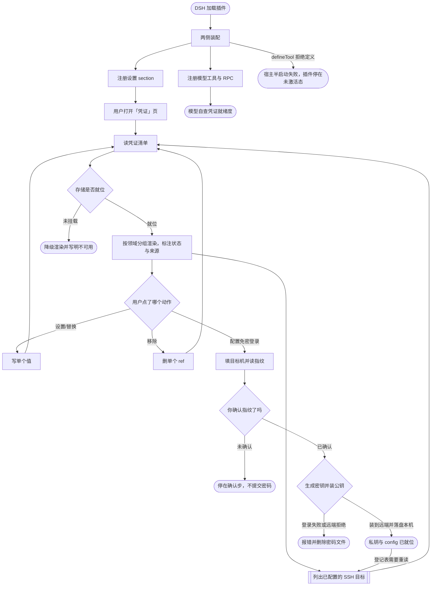
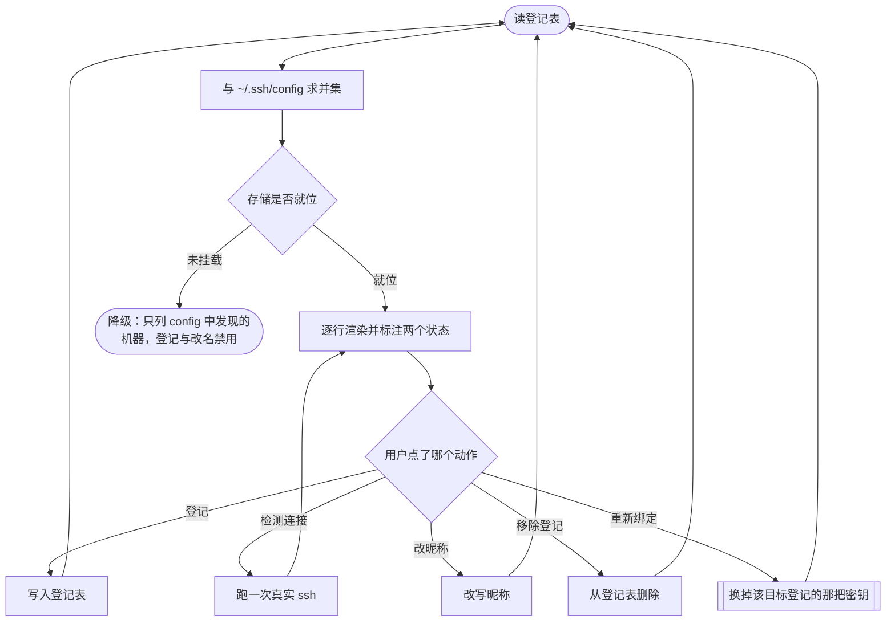
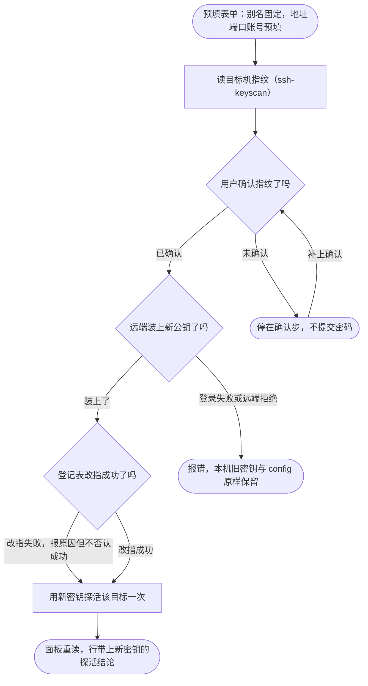

# dsh-credentials 凭证初始化与管理流程

本文档描述 `dsh-credentials` 已实现的流程：DSH 加载本插件后，宿主侧把凭证目录接到凭证 seam 并注册模型工具与 RPC，浏览器侧在设置面板注册一个「凭证」页；用户在该页写入一个值，值单向流入本机凭证库，状态回流到页面与模型。SSH 这一域另有自己的流程：一条密码引导路径负责**建立**免密能力，一张目标面板负责**使用**它并报告它现在还通不通，已登记行的「重新绑定」则在连接失败时承担**修复**——重输一次账号密码换一把新密钥，不必从零再配一遍。文档覆盖流程的主干、分叉点、失败出口，以及每个环节的输入输出；末节 [未验证面](#未验证面) 列出已实现但证据尚未取到的环节，读到的部分未经验证时以该节为准。

本工程的源码在 [dsh-credentials/](dsh-credentials/)（自带 `.git` 与远端），下文所有路径与命令都以该目录为工程根。部署与使用方式见同目录 [deploy.md](deploy.md)。

## 主流程

```mermaid
flowchart TB
  START(["DSH 加载插件"]) --> MOUNT["两侧装配"]
  MOUNT --> SECTION["注册设置 section"]
  MOUNT --> TOOL["注册模型工具与 RPC"]
  MOUNT -->|"defineTool 拒绝定义"| MOUNT_FAIL(["宿主半启动失败，插件停在未激活态"])
  SECTION --> OPEN["用户打开「凭证」页"]
  OPEN --> LIST["读凭证清单"]
  LIST --> RENDER{"存储是否就位"}
  RENDER -->|"就位"| GRID["按领域分组渲染，标注状态与来源"]
  RENDER -->|"未挂载"| DEGRADE(["降级渲染并写明不可用"])
  GRID --> TARGETS[["列出已配置的 SSH 目标"]]
  GRID --> ACTION{"用户点了哪个动作"}
  ACTION -->|"设置/替换"| WRITE["写单个值"]
  ACTION -->|"移除"| UNSET["删单个 ref"]
  ACTION -->|"配置免密登录"| BSSELECT["填目标机并读指纹"]
  WRITE --> LIST
  UNSET --> LIST
  TARGETS --> LIST
  BSSELECT --> BSCONFIRM{"你确认指纹了吗"}
  BSCONFIRM -->|"未确认"| BSWAIT(["停在确认步，不提交密码"])
  BSCONFIRM -->|"已确认"| BSINSTALL{"生成密钥并装公钥"}
  BSINSTALL -->|"装到远端并落盘本机"| BSDONE(["私钥与 config 已就位"])
  BSINSTALL -->|"登录失败或远端拒绝"| BSFAIL(["报错并删除密码文件"])
  BSDONE -->|"登记表需要重读"| TARGETS
  TOOL --> PROBE(["模型自查凭证就绪度"])
```

## START

DSH 在自己的进程与页面里加载本插件，把运行所需的服务交付给两侧。工程有**两种落地形态**——cordis 与 bundle——二者共享全部业务逻辑，只有 `adapters/` 分叉；形态由构建期决定，不由业务模块决定。本流程描述的主干两形态通用，差异集中在 `MOUNT`。

**两形态都已有活体证据**：cordis 形态以动态包在真实 DSH 进程里激活；bundle 形态在专用 profile `e2e-credentials` 里经 `dsh plugin add file:<pkg>`（官方挂载通道）装成行并跑通页面与业务面。bundle 形态仍**未注册进本仓库的任何 profile**，因而挂载是一个单独、显式的动作。当前 source-to-plugin 落地流程使用 bundle 形态。

**输入**

- `PLUGIN_ROOT`：工程根路径；来源为工程部署位置。
- `INJECTED_SERVICES`：运行期可用服务集合。宿主侧用 `credentials`（凭证 seam），客户端用 `slots`（插槽注册）。两者都是**可选读取**，不是硬依赖。

**输出**

- `MOUNT_REQUEST`：装配请求，含两侧入口；去向为 `MOUNT`。

## MOUNT

两侧各自的唯一装配入口：把端口实现与业务对象拼起来，并让每个副作用可释放。本节点是**唯一按形态分叉**的节点——两种形态的差别到此为止，向下的 section 注册、工具定义、读清单、写入、移除完全相同。

形态分叉在构建期完成：`src/{host,client}/adapters/index.ts` 是形态无关入口，`loader-configs/build.json` 的 `adapters` 声明它在两种形态下分别解析到哪个实现。因此**运行时看不到分叉**，只有产物不同。

| 形态 | 宿主通信 | 客户端通信 |
| --- | --- | --- |
| **cordis** | `harness.handle` 注册 Package 私有方法 | `host.call` |
| **bundle** | profile `webServer` 上注册 `/dsh-credentials/api` 前缀路由 | 同源 `fetch` POST |

bundle 路由的 [readJsonBody](dsh-credentials/src/host/adapters/bundle/registrar.ts#L257) 按 UTF-8 字节数累计请求体大小，超过 1 MiB 返回 HTTP 413；字符数不能代替字节数判定。

宿主侧装配链（两形态同形）：端口实现 → `CredentialCatalog` → `src/host/tool.ts` 的 `register()`。客户端侧装配链（两形态同形）：`ClientPorts` → `src/client/index.ts` 的 `mount()`。

`seam()` 在 seam 缺失时返回 `undefined` 而非抛错：目录仍要能列出「有哪些凭证」，即使这台机器一个都写不了。`register()` 与形态适配器返回的每个 disposer 都由 fiber 持有，插件停止、更新或移除时一并撤下。

宿主侧另有一条插件自有的诊断落盘通道，与宿主 logger 并存：每条 `report()` 消息**先落盘、再走既有 logger**——落盘写 `$DSH_HOME/logs/dsh-credentials.log`（路径解析与行格式见 `src/host/adapters/file-log.ts`，一行一报可 grep），宿主 logger 目前只进 cordis `LoggerService` 的内存环形 buffer（`@deepseek-ai/cordis/src/logger.ts`），全宿主无 stdout/文件 exporter，故后者不落 journal。两形态的落盘实现不同：bundle 经 `file-log.ts` 同步 append（fire-and-forget 之下异步会重演「产生即蒸发」，写失败静默不抛）；cordis body 是 `new Function` 无 import，经既有 `shell` 服务把行从 stdin 追加到同一文件，`shell` 缺失时静默降级只走 logger。logger 缺失或抛错的行为不变。

上表 bundle 一列已实测：宿主侧前缀路由由真实 `webServer` 注册并分发（未服务的操作答 404），客户端侧经同源 `fetch` POST 真实往返。该证据适用于 bundle 路径。

**输入**

- `MOUNT_REQUEST`：装配请求；来源为 `START`。

**输出**

- `PORTS_READY`：两侧端口就位；去向为 `SECTION`、`TOOL`。
- `DISPOSERS`：每个注册的释放器；去向为运行期的 fiber。
- `MOUNT_REFUSAL`：装配被运行期拒绝；去向为 `MOUNT_FAIL`。

**失败模式**

本节点有两条失败出口，**处置方式刻意不同**：

- 端口构造失败（`credentials` 或 `slots` 服务缺失）：两侧都是可选读取，`seam()` 返回 `undefined`、`slots` 分支返回空释放器——**不抛错、不中止装配**。插件照常起来，代价只是部分能力不可用（宿主报 `no-store`，页面不注册）。这条不走 `MOUNT_FAIL`。
- `defineTool` 拒绝定义：**宿主半整体启动失败**，插件停在未激活态，走 `MOUNT_FAIL`。一个只注册了半边的插件比没有插件更难诊断，因此这里不降级。

## MOUNT_FAIL

宿主半在 `harness.defineTool` 处被运行期拒绝时的终止出口：插件不进入 `currentPackageId`，停在 `nextPackageId`，宿主半的 RPC 与工具**一个都没有注册**，客户端半即使起来了也无处可调。

拒绝原因是结构性的，不是运行环境的偶然——`defineTool` 校验的是定义本身的形状。已知会被拒的有三类：缺 `output` 声明；`output.schema` 里用了对象级 `required` 数组；`parameters` 根声明了 `additionalProperties`。这些都由单测的形状锁守卫，见 [tests/README.md](dsh-credentials/tests/README.md)。

本节点是终止态，不出边：能修的是定义，不是运行环境。

**输入**

- `MOUNT_REFUSAL`：装配被运行期拒绝；来源为 `MOUNT`。

**输出**

- 无。

## SECTION

客户端半把「凭证」页注册进 `settings.section` 插槽。该插槽是 `list` 型，注册项带 `id`／`order`／`label`。

**用自有的 id**：注册一个原插槽未占用的 id（本工程用 `credentials`）会在既有页旁**新增**一页；复用既有 id 则会替换那一页。本工程因此不需要与「模型」「插件」等页的属主协作。注册发生在 `slots.inject` 的回调里，因而**等插槽声明出现才注册**，不假设它已经在。

该注册发生在设置面板**打开之后**时，面板的导航列表不会自行重绘；本节只负责把页注册进去，何时可见由面板自身的重绘时机决定。`slots` 缺失时直接返回一个空释放器，不抛错。

**输入**

- `PORTS_READY`：客户端端口；来源为 `MOUNT`。

**输出**

- `SECTION_READY`：section 注册结果；去向为 `OPEN`。

**失败模式**

- `slots` 服务缺失：不注册任何东西并返回空释放器，插件的其余部分照常工作。

## TOOL

宿主半注册模型工具 `credential_manage` 与一组 Package 私有 RPC——凭证侧 `catalog`／`save`／`remove`，SSH 侧 `targets`／`target-probe`／`target-register`／`target-rename`／`target-forget`／`target-rebind`——两者共用同一个 `CredentialCatalog` 实例，因而两条路径对状态的判定、对写入的拒绝条件不可能分叉。RPC 清单的权威源是 `src/shared/protocol.ts` 的 `OPERATIONS`：宿主注册的每个方法都必须在其中，否则 bundle 路由不分发它、按钮答 404（该守卫见 [tests/README.md](dsh-credentials/tests/README.md)）。

工具定义同时满足**两套方向相反的 schema 方言**：`parameters` 用根级 `required` 数组且省略 `additionalProperties`（隐式参数根是开放的）；`output.schema` 用逐属性 `required: true` 且每个对象节点显式声明 `additionalProperties`。`output.render` 返回内容块数组，不返回裸字符串。

工具的 `list` 分支只报告状态与来源，`set`／`remove` 只返回写入结果，**三个 action 都不返回值**。

另注册 `device_target`：它先按完全一致的别名查找，未命中时再以大小写不敏感方式匹配别名，唯一命中才成功；没有别名命中时才按大小写不敏感方式解析唯一昵称，别名或昵称多重命中时要求消歧、不任意选择。成功时模型可见结果包含规范别名、主机/IP、端口、用户名、可复制执行的精确 SSH 命令，以及配置的私钥文件路径（没有配置时为空并使用 SSH 默认密钥选择）；不返回私钥内容。命令与路径只提供连接参数，不会改变沙箱内进程的 `nobody` 身份或权限，因此需要在能读取该私钥的执行环境中运行。解析不发起网络连接，也不验证 SSH 认证。

**输入**

- `PORTS_READY`：宿主端口；来源为 `MOUNT`。

**输出**

- `TOOL_READY`：工具与每个 RPC 的注册结果；去向为 `PROBE`。

**失败模式**

- `defineTool` 拒绝定义（方言写错、缺 `output`）：**宿主半整体启动失败**，插件停在 `nextPackageId` 而不进入 `current`。这是刻意的：一个只注册了半边的插件比没有插件更难诊断。

## OPEN

用户在设置面板里点开「凭证」页。面板把 section 的渲染函数挂进内容列；本节点不含业务判定，唯一出边通向 `LIST`。

**输入**

- `SECTION_READY`：section 注册结果；来源为 `SECTION`。
- `USER_CLICK`：用户的打开动作；来源为界面交互。

**输出**

- `PAGE_MOUNTED`：页面已挂载；去向为 `LIST`。

## LIST

页面挂载后立即经 `host.call('catalog')` 读一次全量清单，宿主侧对目录里**每一个** ref 调一次 `credentials.describe()`。

解析是**每次调用现读、不跨调用缓存**——这正是「刚存下的值下一次读就可见、无需重启」的机制。单条 `describe` 抛错不中断整表：那条记为 `error` 并带上原因，其余照常返回。

**输入**

- `PAGE_MOUNTED`：页面已挂载；来源为 `OPEN`。
- `WRITE_RESULT`：上一次写入的结果；来源为 `WRITE`。到达即表示需要重读，内容本身不参与判定。
- `UNSET_RESULT`：上一次删除的结果；来源为 `UNSET`。与 `WRITE_RESULT` 同理。

**输出**

- `CATALOG_SNAPSHOT`：`{ storeAvailable, entries[] }`，每项含 `id`／`ref`／`group`／`label`／`purpose`／`how`／`state`／`source`／`writable`／`detail`，**不含任何值**；去向为 `RENDER`。

**失败模式**

- `host.call` 整体失败：页面把快照置为不可用并退出加载态，不留在「读取中」。
- 单条 `describe` 失败：该项 `state` 为 `error`、`detail` 写明原因，整表仍返回。

## RENDER

本节点是主图的分叉点：按 `storeAvailable` 决定这一页是可用还是不可用。它不渲染任何内容，只做这一个判定。就位走 `GRID`，未挂载走 `DEGRADE`。

`no-store` 与 `error` 两种状态**不在此分叉**：它们都是「存储就位但某项没读到」，仍进 `GRID` 逐行呈现——把某项失败升级成整页降级，会让一个可修的局部问题看起来像不可用的部署。

**输入**

- `CATALOG_SNAPSHOT`：清单；来源为 `LIST`。

**输出**

- `ROWS_INPUT`：可渲染的清单；去向为 `GRID`。
- `DEGRADED`：不可用提示；去向为 `DEGRADE`。

## GRID

按 `GROUPS` 的顺序分组渲染，空组不渲染（避免出现一个只有标题的空白组）；每行显示名称、ref、状态徽章、用途，已配置时另显来源。

`state` 的四种取值在此逐行呈现且互相可辨：`set`／`unset`／`no-store`／`error`。`no-store` 与 `error` 刻意分开：前者这台机器修不了，后者可能再读一次就好，合并二者会给出错误指引。

**SSH 组没有成员行，只有标题。** 目录里已不存在「粘贴私钥」那一行：一条粘贴的密钥和一条装好的密钥是两回事穿同一个名字——粘贴产出的密钥本机不知道怎么用（没有 `Host` 段、没有 `IdentityFile`、远端 `authorized_keys` 里也没有），而且面板无从判断这台机器连不连得上。所以 SSH 只有一条配置路径，由 `BSSELECT` 那条分支承担；`ssh` 组仍声明着，使标题与 `TARGETS` 在它下面渲染。

**输入**

- `ROWS_INPUT`：可渲染的清单；来源为 `RENDER`。

**输出**

- `ROWS`：渲染出的行；去向为 `ACTION`。
- `GRID_READY`：SSH 组的标题已就位，目标面板可以挂在它下面；去向为 `TARGETS`。

## TARGETS

在主图里它是子流程蓝图型节点：内部步骤须另起一张图方能讲清，故此处先绘其子流程图，再逐节点成章。

页面打开后读一次登记表，把**本机所有能免密到达的机器**列成行，并让用户在行上做五件事：补登记、检测连接、改昵称、移除登记、重新绑定（仅已登记的行）。这一步**不发起任何连接**——探活只发生在用户的点击之内：点「检测连接」，或一次成功的「重新绑定」在那次点击里补上的那一次（见 `TRPROBE`）。

**登记表存在设置文档里**（namespace `dsh-credentials`），不在凭证 seam 里。两个事实决定了这一点：本部署的凭证 seam 是 `0.1.0-rc.7`，只暴露引用半（`describe`／`set`／`unset`）**没有枚举**，而目标列表最需要的恰恰是可枚举；而目标本来就不是机密——`~/.ssh/config` 早已把地址、账号、密钥路径明文写着。全程唯一真正的机密是密码，它不落任何存储。

登记表变更（登记、改名、移除与重绑定后的密钥路径更新）由 [`TargetRegistry`](dsh-credentials/src/host/targets.ts) 串行执行，避免并发读-改-写互相覆盖。

**输入**

- `GRID_READY`：SSH 组标题已就位，目标面板可以挂在它下面；来源为 `GRID`。
- `BSDONE_TOUCH`：一次引导刚成功、登记表需要重读的信号；来源为 `BSDONE`。
- `USER_ACTION`：用户在某个目标行上的点击；来源为界面交互。

**输出**

- `TARGETS_READY`：登记表已读并渲染出的行，含登记状态、连接状态、昵称与密钥路径；去向为 `TLIST`。
- `TARGETS_FAILURE`：登记表不可读，面板降级渲染；去向为 `TDEGRADE`。

```mermaid
flowchart TB
  TLOAD(["读登记表"]) --> TJOIN["与 ~/.ssh/config 求并集"]
  TJOIN --> TRENDER{"存储是否就位"}
  TRENDER -->|"就位"| TLIST["逐行渲染并标注两个状态"]
  TRENDER -->|"未挂载"| TDEGRADE(["降级：只列 config 中发现的机器，登记与改名禁用"])
  TLIST --> TACT{"用户点了哪个动作"}
  TACT -->|"登记"| TREGISTER["写入登记表"]
  TACT -->|"检测连接"| TPROBE["跑一次真实 ssh"]
  TACT -->|"改昵称"| TRENAME["改写昵称"]
  TACT -->|"移除登记"| FTRGET["从登记表删除"]
  TACT -->|"重新绑定"| TREBIND[["换掉该目标登记的那把密钥"]]
  TREGISTER --> TLOAD
  TRENAME --> TLOAD
  FTRGET --> TLOAD
  TPROBE --> TLIST
  TREBIND --> TLOAD
```

### TLOAD

读一次登记表与 `~/.ssh/config`，把两者交给 `TJOIN`。读取是每次现读、不缓存，使刚登记的目标下一次读就可见。

本节点同时是子流程的**重读入口**：下列每个结果到达都表示登记表或连接状态已变，需要重读一遍。到达本身即信号，结果内容不参与后续判定。

**输入**

- `BSDONE_TOUCH`：一次引导刚成功、登记表需要重读的信号；来源为 `BSDONE`。无内容，仅作触发。
- `REGISTER_RESULT`：一次登记的写入结果；来源为 `TREGISTER`。带成功与否及原因，仅用于判定是否重读。
- `RENAME_RESULT`：一次改名的写入结果；来源为 `TRENAME`。带成功与否及原因，仅用于判定是否重读。
- `FORGET_RESULT`：一次移除登记的删除结果；来源为 `FTRGET`。带成功与否及原因，仅用于判定是否重读。
- `REBIND_RESULT`：一次重绑定的结果；来源为 `TREBIND`。带成功与否及原因，仅用于判定是否重读。
- `RETRY_READ`：用户重新打开页面触发的重读；来源为 `TDEGRADE`。无内容，仅作触发。
- `USER_ACTION`：某个目标行上的点击；来源为界面交互。

**输出**

- `REGISTERED`：登记表里已登记的条目；去向为 `TJOIN`。
- `CONFIG_TEXT`：`~/.ssh/config` 的原文，文件不存在时为空串；去向为 `TJOIN`。

**失败模式**

- 登记表不可读：返回 `undefined`，由 `TJOIN` 之后的分叉判为未挂载。

### TJOIN

把两份来源求并集并定出每行的来路。求并集的判据是**别名**：登记表里有的是 `registered`，只出现在 config 里的是 `config-only`。已登记的目标**不因 config 里没有而消失**——config 可能被手工改过，而静默忘掉用户登记过的机器，比显示一行他能自己删的陈旧条目更糟。同名时以登记表的连接事实为准。

**输入**

- `REGISTERED`：登记表条目；来源为 `TLOAD`。
- `CONFIG_TEXT`：`~/.ssh/config` 原文；来源为 `TLOAD`。

**输出**

- `ROWS_INPUT`：合并后的行，每行带 `registered` 或 `config-only`；去向为 `TRENDER`。

**失败模式**

- `~/.ssh/config` 不存在（`ENOENT`）：[`readSshConfig`](dsh-credentials/src/host/adapters/ports-targets.ts#L51) 按空文件处理；其他读取错误交由上层写入 warning 后按空文件降级，不阻断登记表读取。

### TRENDER

本节点是子流程的分叉点：按登记表是否就位决定这一页可用还是降级。就位走 `TLIST`，未挂载走 `TDEGRADE`。

**输入**

- `ROWS_INPUT`：合并后的行；来源为 `TJOIN`。

**输出**

- `ROWS_READY`：可渲染的行；去向为 `TLIST`。
- `DEGRADED`：不可用提示；去向为 `TDEGRADE`。

### TLIST

逐行渲染，每行三个互相独立的事实：**登记状态**（`已登记`／`未登记`）、**连接状态**（`已连接`／`认证失败`／`连不上`／`未检测`）、**显示名称**（昵称，纯显示，不影响 ssh 怎么连）。已登记的行另显密钥路径。

连接状态在本次进程内记忆、**不落盘**：它是某一刻网络的事实，不是机器的属性，昨天写的「已连接」今天读出来就是一句自信的谎话。所以进程重启后每个目标都回到 `未检测`。已登记的行在「认证失败」时另显一行提示，把出口指到「重新绑定」——那是面板能为这一状态点名的唯一修复动作（见 `src/client/targets-panel.ts` 的 `unauthenticatedHint`）。

**输入**

- `ROWS_READY`：可渲染的行；来源为 `TRENDER`。
- `TARGETS_READY`：子流程入口交付的、已读并渲染出的行；来源为 `TARGETS`。与 `ROWS_READY` 同义，二者到达任一即触发行渲染。
- `PROBE_RESULT`：一次探活的结果；来源为 `TPROBE`。到达即表示该行需要重绘，内容本身不参与判定。

**输出**

- `ROWS`：渲染出的行；去向为 `TACT`。

### TDEGRADE

登记表未挂载时的出口：只列出 `~/.ssh/config` 中发现的机器，登记、改名、移除三个动作禁用，并写明原因；重新绑定同样不可达——此刻只剩 `config-only` 的行，而它只给已登记的行。本节点不是终止态——存储回来后重读即恢复可用；它是「这台机器写不了登记表」这一约束在流程上的落点。

**输入**

- `DEGRADED`：不可用提示；来源为 `TRENDER`。
- `TARGETS_FAILURE`：登记表不可读、面板降级渲染的原因；来源为 `TARGETS`。

**输出**

- `RETRY_READ`：用户重新打开页面触发的重读；去向为 `TLOAD`。

### TACT

用户在某个目标行上选一个动作。可选的动作用两个事实决定：`config-only` 的行给「登记」；`registered` 的行给「改名」、「移除登记」与「重新绑定」；**每一行都给「检测连接」**，因为它对两种来路的机器同样有意义。`registered` 的行**不因连接状态而有任何动作增减**——「重新绑定」在探活报出「认证失败」之前就在，只是那一刻它才成为该点的修复出口（行内提示会指名它）。

**输入**

- `ROWS`：已渲染的行；来源为 `TLIST`。
- `USER_ACTION`：用户的点击；来源为界面交互。

**输出**

- `REGISTER_INTENT`：待登记的别名与昵称；去向为 `TREGISTER`。
- `PROBE_INTENT`：待检测的别名；去向为 `TPROBE`。
- `RENAME_INTENT`：待改名的别名与新昵称；去向为 `TRENAME`。
- `FORGET_INTENT`：待移除的别名；去向为 `FTRGET`。
- `REBIND_INTENT`：待重绑定的别名与表单里改过的地址、端口、账号、密码；去向为 `TREBIND`。

### TREGISTER

用户点「登记」。宿主按别名在 `~/.ssh/config` 里找该机器的地址事实（`HostName`／`Port`／`User`／`IdentityFile`），填入缺失的字段后写入登记表。这是**补登记**：config 里手工配过、或用别的工具配过的机器会被发现并列出来，点一下就纳管，此后就能检测连接、改名、移除登记。

**不连接任何东西**——本节点只搬运已经知道的事实。别名取不到地址时拒绝并说明；已经登记的别名再次登记是覆盖，不是新增。

**输入**

- `REGISTER_INTENT`：待登记的别名与可选昵称；来源为 `TACT`。

**输出**

- `REGISTER_RESULT`：写入结果，含成功与否与原因；去向为 `TLOAD`。到达即表示需要重读。

**失败模式**

- config 与请求里都没有地址：拒绝且**不写**登记表——写一条 host 为空的条目会造出一行永远连不上、又永远说不清为什么的行。
- 写失败（存储只读等）：把原因原样透传，不谎报成功——静默不落盘会让面板显示一条下一次读不到的登记。
- 别名为空：拒绝。

### TPROBE

用户点「检测连接」。跑一次真实的 `ssh`（`-o BatchMode=yes`、`-o IdentitiesOnly=yes`、显式 `-i <密钥>`），把结果记进本进程并交回 `TLIST` 重绘。

**只有用户点击才会走到这里。** 打开页面不会向任何机器发起连接：这批是生产主机，让「打开设置页」带上网络副作用是不可接受的。本节点不是探活的唯一入口——一次成功的重绑定也在其点击之内对该目标补一次探活（`TRPROBE`），同样由用户的点击发起，原则未破。

`BatchMode=yes` 是承重项：没有它 ssh 可能退回交互式提问，而一个能卡在密码提示上的探活不是探活，是一个挂住的请求；带它是为了让 ssh **失败而不是提问**，从而在超时内给出退出码。`IdentitiesOnly=yes` 配显式 `-i` 把这次尝试钉在这台机器登记的那把密钥上，使结论描述的是**那把**密钥，而不是 agent 恰好先递出的任何一把。机器没有记录密钥路径时省略这两个选项——空的 `-i` 是 ssh 的参数错误，而省略它让 ssh 用自己的默认配置，这才是「文件里没写」的诚实读法。

结果按 ssh 自己报告的原因分类，因为「没通」不可操作：**认证失败**（目标机拒了这把密钥，要修的是密钥或重跑引导）与**连不上**（网络或开机问题）**分开报**，两者修法不同。二者同时出现时取**认证失败**——回答过并拒绝密钥的机器是可达的，把它报成不可达会让人去查网络。

**输入**

- `PROBE_INTENT`：待检测的别名；来源为 `TACT`。

**输出**

- `PROBE_RESULT`：连接状态与失败原因；去向为 `TLIST`。

**失败模式**

- 别名不在当前列表里：拒绝，且**不运行 ssh**——未知别名没有可描述的目标。
- [`TargetRegistry.probe`](dsh-credentials/src/host/targets.ts#L131) 探活期间若目标被移除或同别名身份改变，旧探活结果不返回成功 verdict/view，也不写入探活缓存；面板保持该目标为未检测状态。
- ssh 非零退出：按 stderr 分类，绝不因退出码非零而报 `connected`。
- 机器不可达：报 `连不上` 并给出分类后的原因。

### TRENAME

用户点「改名」，填入显示名称后保存。只改 `nickname` 一个字段，连接事实（地址、端口、账号、密钥路径）原样不动。清空后回退到别名，使一行永不显示为空白。

**输入**

- `RENAME_INTENT`：待改名的别名与新昵称；来源为 `TACT`。

**输出**

- `RENAME_RESULT`：写入结果；去向为 `TLOAD`。

**失败模式**

- 目标尚未登记：拒绝并提示先登记——改名只作用于登记表里存在的条目。
- 写失败：透传原因。

### FTRGET

用户点「移除登记」。只从登记表里删除该别名，**不动** `~/.ssh/config` 里的 `Host` 段——那段可能是用户手写的，删掉它就等于替用户改了他的 ssh 配置。移除后该机器若仍在 config 里，会以 `未登记` 重新出现。

**输入**

- `FORGET_INTENT`：待移除的别名；来源为 `TACT`。

**输出**

- `FORGET_RESULT`：删除结果；去向为 `TLOAD`。

**失败模式**

- 别名本就不在登记表里：no-op，且**不重写文档**。
- 写失败：透传原因。

### TREBIND

在子图里它是子流程蓝图型节点：重绑定要跨引导与登记表两个服务才能讲清，内部步骤在此展开。它是**修复路径**——探活报出「认证失败」时，引导表单的两道存在性拒绝（本机已有同名私钥、config 已有同别名段）恰好在这个时刻把路堵死，重绑定以**替换**语义绕开这两道拒绝：用户明知哪台机器坏了、只想重输一次账号密码换一把新 key，不必先手工删私钥再手工改 config。

**入口在已登记的行上**。`config-only` 的行没有旧密钥可换，引导表单本就是它的配置路径。宿主侧拒绝未知别名与 `config-only` 别名，且不生成任何密钥——重绑定不产生新机器、不产生第二份登记。

**表单与引导表单同形**：地址、端口、账号预填登记表现有值（用户只改要改的），别名固定不可改，密码留空待输。**指纹确认不因「连过」而豁免**——复用引导路径的 `bootstrap-scan`（ssh-keyscan）读指纹、用户确认后才允许密码离开输入框，因为旧密钥失效的原因可能正是主机重装，第一次连接没有可对照的信任锚这一事实并未因重绑定而改变。

**输入**

- `REBIND_INTENT`：待重绑定的别名与表单里改过的地址、端口、账号、密码；来源为 `TACT`。
- `REBIND_CONFIRM`：用户对指纹的确认动作；来源为 `TRWAIT`（在 `TRCONFIRM` 处直接确认时同义）。未确认时提交按钮禁用，密码不离开页面。

**输出**

- `REBIND_RESULT`：重绑定结果，含步骤与写入的文件清单，**不含密码**；去向为 `TLOAD`。到达即表示登记表与探活缓存已变，需要重读。

```mermaid
flowchart TB
  TRFORM(["预填表单：别名固定，地址端口账号预填"])
  TRSCAN["读目标机指纹（ssh-keyscan）"]
  TRCONFIRM{"用户确认指纹了吗"}
  TRREPLACE{"远端装上新公钥了吗"}
  TRRECORD{"登记表改指成功了吗"}
  TRPROBE["用新密钥探活该目标一次"]
  TRDONE(["面板重读，行带上新密钥的探活结论"])
  TRFAIL(["报错，本机旧密钥与 config 原样保留"])

  TRFORM --> TRSCAN
  TRSCAN --> TRCONFIRM
  TRCONFIRM -->|"未确认"| TRWAIT(["停在确认步，不提交密码"])
  TRWAIT -->|"补上确认"| TRCONFIRM
  TRCONFIRM -->|"已确认"| TRREPLACE
  TRREPLACE -->|"装上了"| TRRECORD
  TRREPLACE -->|"登录失败或远端拒绝"| TRFAIL
  TRRECORD -->|"改指失败，报原因但不否认成功"| TRPROBE
  TRRECORD -->|"改指成功"| TRPROBE
  TRPROBE --> TRDONE
```

#### TRFORM

展开一个与引导表单同形的输入面：地址、端口、账号默认取登记表里该目标的现有值，别名以禁用输入框的形式固定——重绑定不产生新机器、不产生新文件；密码留空待输。表单的可用性判定在 [targets-panel.ts](dsh-credentials/src/client/targets-panel.ts) 的 `canRebindScan`／`canRebindSubmit`：地址填了才允许扫描，指纹已确认、地址账号非空且密码非空才允许提交。引导与重绑定的指纹确认均绑定当前 host+port；端点编辑会清除确认。重绑定表单保留上次指纹并在扫描端点与当前端点不同时标出陈旧提示，只有端点匹配且用户重新确认后才可提交；引导表单则在端点编辑时清除旧扫描指纹。

**输入**

- `REBIND_INTENT`：待重绑定的别名；来源为 `TACT`。

**输出**

- `REBIND_FIELDS`：表单里改过的地址、端口、账号；去向为 `TRSCAN`。

**失败模式**

- 地址为空：扫描按钮禁用，不发起任何连接。

#### TRSCAN

点「读取指纹」，经 `bootstrap-scan` 用 `ssh-keyscan` 读目标机主机公钥。与 `BSSELECT` 同一条路径、同一个方法——重绑定不自带第二套扫描。**这一步不提交任何凭据**：密码仍留在输入框里。

**输入**

- `REBIND_FIELDS`：表单里改过的地址与端口；来源为 `TRFORM`。

**输出**

- `REBIND_FINGERPRINT`：目标机公钥指纹；去向为 `TRCONFIRM`。

**失败模式**

- 目标机不可达或未返回公钥：报错并停在表单，未提交任何凭据。

#### TRCONFIRM

由**用户**判断目标机身份是否可信。界面把提交按钮**禁用**而非提示后放行；表单文案写明「重绑定不因『连过』而豁免指纹确认：旧密钥失效的原因可能正是主机重装」。

**输入**

- `REBIND_FINGERPRINT`：目标机公钥指纹；来源为 `TRSCAN`。
- `REBIND_CONFIRM`：用户的确认动作；来源为 `TRWAIT`。

**输出**

- `REBIND_CONFIRMED`：已确认状态；去向为 `TRREPLACE`。
- `REBIND_UNCONFIRMED`：未确认状态；去向为 `TRWAIT`。

#### TRWAIT

未确认时的出口：密码留在输入框，不发起任何连接。不是终止态——用户确认指纹后回到 `TRCONFIRM`；它是**密码不得离开本机**这一约束在重绑定路径上的落点。

**输入**

- `REBIND_UNCONFIRMED`：未确认状态；来源为 `TRCONFIRM`。

**输出**

- `REBIND_CONFIRM`：用户后续的确认；去向为 `TRCONFIRM`。

#### TRREPLACE

本节点承载整个特性的承重次序，实现在 `src/host/bootstrap.ts` 的 `rebind` 方法（由 `src/host/rebind.ts` 组合调用）：生成**新的** ed25519 密钥对，用密码登录一次把**新**公钥追加到远端 `authorized_keys`——在远端接受之前，本机的旧私钥、旧公钥与 config 段**一个字节都不动**。只有远端成功之后才替换本机那一半：覆盖私钥与 `.pub`，并把 `~/.ssh/config` 该别名 `Host` 段的 `IdentityFile` 行指到新私钥路径。改写由 `src/shared/bootstrap.ts` 的 `replaceIdentityFileLine` 承担——**只替换那一个 `IdentityFile` 行**，段内其余选项（用户手写的 `ProxyJump`、手工改过的 `Port`）逐字节保留；段里没有 `IdentityFile` 行时在 `Host` 行后插入一行，没有该别名的段时按引导同款补写整段。若新路径与旧行所指一致（私钥原路径被覆盖），行内容已然正确。

密码的生命周期与 `BSINSTALL` 完全一致，同一条 askpass／600 临时文件通道，`finally` 删除，不进 argv、不进环境变量、不进日志（含落盘日志 `$DSH_HOME/logs/dsh-credentials.log`）。

「远端是否收下了完整新公钥」的判定与 `BSINSTALL` 同一条：远端脚本经 `"$*"` 取键（SSH 命令行拼接加重分词的根因与修法见 `BSINSTALL`），形状拦截拦下单词残缺行，宿主侧 `INSTALLED` 之后再以 `remoteKeyEchoProblem` 比对回显的字节长度与逐词内容，不一致即判失败、本机旧密钥与 config 逐字节不动。写入同样是双写：两条远端路径共用同一条 `INSTALL_KEY_COMMAND`（`src/shared/bootstrap.ts`）——`~/.ssh/authorized_keys` 总写，dropbear 主机（`/etc/dropbear` 存在）另写 `/etc/dropbear/authorized_keys` 且不可写时静默跳过，每个实际写入路径回显一行 `REMOTE_WROTE: <path>`（该形态的完整描述见 `BSINSTALL`）。`src/host/rebind.ts` 无需自带第二套判定——它消费 `BootstrapOutcome`，服务内的判定已收紧即对它生效（两层判定的完整描述见 `BSINSTALL`）。

**新私钥恒落插件按别名派生的路径**（`keyPath`，形如 `id_ed25519_<别名>`）——**不是**登记表记录的那条路径。手工登记的目标可能记录的是与其他机器共享的密钥文件，覆盖那个文件正是引导阶段的存在性拒绝要防的锁死场景；重绑定写的是本插件自有的那一条路径，登记表记录改为指向它，旧的自定义文件留在原地不动。

**输入**

- `REBIND_CONFIRMED`：已确认的目标描述与密码；来源为 `TRCONFIRM`。
- `REBIND_FIELDS`：表单里改过的地址、端口、账号；来源为 `TRFORM`。未填的字段由登记表该目标的现有值补齐（实现在 `src/host/rebind.ts`）——只报别名的重绑定请求也连到登记表所知的机器。

**输出**

- `REBIND_DONE`：步骤与写入的本机文件清单；去向为 `TRRECORD`。
- `REBIND_FAILURE`：失败原因（已剔除密码形状的片段）；去向为 `TRFAIL`。

**失败模式**

- 密码为空：拒绝，不生成密钥、不触达任何子进程。
- 远端安装失败（密码错、网络断、退出码 0 但无 `INSTALLED`，或回显比对不一致）：报错并写明「本机旧密钥与 config 未改动」，旧密钥与 config 原样保留——本机仍持有旧密钥，只是远端还没收下新的。
- 别名未登记或为 `config-only`：拒绝，不生成密钥。

#### TRRECORD

远端成功后的收尾，实现在 `src/host/rebind.ts` 的组合次序里：先 `recordKeyPath` 把登记表里该目标记录的密钥路径改指新私钥路径（探活把 ssh 尝试钉在记录的路径上，记录不改指，下一次探活测的就是一把已不存在的密钥），再 `clearProbe` 清掉缓存里那条对旧密钥下的「认证失败」结论——面板随后重读登记表，不能让一条陈旧结论贴在一把刚被换掉的密钥旁边。清缓存排在改指之后：面板重读时不能观察到「路径未更新而结论已清」的中间态。

**改指失败不否认成功**：远端已装上新公钥、本机已换新私钥——机器本身是好的，此时把整次操作报成失败会告诉用户「重绑定没发生」而它发生了。失败时报 `ok:true` 带原因（说明改指失败），且**不清探活缓存**——记录仍指着旧路径，此刻清掉结论反而掩盖真实状态。

**输入**

- `REBIND_DONE`：步骤与写入清单；来源为 `TRREPLACE`。

**输出**

- `REBIND_RESULT`：重绑定结果；去向为 `TLOAD`。

**失败模式**

- `recordKeyPath` 写失败（存储只读等）：报 `ok:true` 带原因，机器可用，仅面板下一次探活会测到旧路径。
- 目标未登记：拒绝改指（与入口拒绝同一条路）。

#### TRPROBE

成功路径上的最后一次探活，实现在 `src/client/targets-panel.ts` 的 `rebindSubmit`（提交 `70bdc85` 引入）：远端装上新公钥、本机换好新私钥、登记表改指之后，对刚换上新密钥的那个别名发**恰好一次** `target-probe`，然后才 `reload()`。探活结论像任何一次探活一样落进登记器的探活缓存，随后的重读把行重绘成「已连接」；探活自己分类出的失败结论也照常呈现——它是新密钥的真实状态，不是要吞掉的异常。

**这一次探活不违反「只在用户点击时探活」**（该原则见 `TPROBE` 与 `src/host/tool.ts` 的注册注释）：它发生在用户的「重新绑定」这一次点击之内，而**新密钥确实能用**正是重绑定的验收标准——一次成功的重绑定之后行落回「未检测」，等于把用户点这一下的目的藏起来了。

**探活通道失败不否认重绑定的成功**：`target-probe` 答非 `ok` 或整体抛错时，原因上到问题行，成功展示（步骤行）原样保留，重读照跑——机器本身是好的，只有结论缺席。

**输入**

- `REBIND_RESULT`：重绑定成功的结果；来源为 `TRRECORD`。到达即表示新密钥已就位、可以检验。

**输出**

- `PROBE_VERDICT`：新密钥的探活结论（含通道失败时的原因）；去向为 `TRDONE`。

#### TRDONE

成功出口：面板重读登记表（`TLOAD`），该行显示新密钥路径；行上的连接状态是前一步探活落下的**新密钥自己的结论**——「已连接」即时可见，探活分类出的失败也照常带上原因。

**输入**

- `REBIND_RESULT`：重绑定成功的结果；来源为 `TRRECORD`。
- `PROBE_VERDICT`：新密钥的探活结论；来源为 `TRPROBE`。

**输出**

- 无。

#### TRFAIL

失败出口：原因已回显、密码文件已删除、本机旧密钥与 config 未受任何影响。不是终止态——用户能改的是输入（核对密码）或目标机（自查 sshd），改完可再次点「重新绑定」。

**输入**

- `REBIND_FAILURE`：失败原因；来源为 `TRREPLACE`。

**输出**

- 无。

## ACTION

用户在某一行上选一个动作。可写性由 `writable` **与** `state` 共同决定：`writable` 为假（只读来源遮蔽该 ref）或 `state` 为 `no-store` 时两个按钮都禁用——禁用而非隐藏，使「为什么不能改」在界面上可见。

点「设置」或「替换」展开输入行，点「移除」直接进入 `UNSET`。`state` 为 `set` 时才渲染「移除」按钮。

**输入**

- `ROWS`：已渲染的行；来源为 `GRID`。
- `USER_ACTION`：用户的点击；来源为界面交互。

**输出**

- `WRITE_INTENT`：待写入的 `id`；去向为 `WRITE`。
- `UNSET_INTENT`：待删除的 `id`；去向为 `UNSET`。

## WRITE

页面把 `{ id, value }` 经 `host.call('save')` 交给宿主；宿主按 **id** 查目录（不是按 ref——ref 不是 id，传 ref 会被拒），校验值非空后调 `credentials.set(ref, value)`。

值在此处**单向流走**：宿主收到后直接交给 seam，不回显、不记日志、不做二次读取。写成功后对该 ref 重读一次状态，使返回的 `state` 是**写后的事实**而非假设。之后页面清空输入框并触发一次 `LIST`。

**输入**

- `WRITE_INTENT`：待写入的 `id`；来源为 `ACTION`。
- `SECRET_VALUE`：用户粘贴的值；来源为页面输入框。

**输出**

- `WRITE_RESULT`：`{ ok, id?, ref?, state? }` 或 `{ ok: false, reason }`，**不含值**；去向为 `LIST`。

**失败模式**

- 值为空：拒绝并提示改用「移除」——空值不能存，seam 会把空值当作「没有这个凭证」。
- id 未知：拒绝并回显该 id，不触达 seam。
- seam 拒绝：把 seam 的原话透传。最常见的原话是「只读来源遮蔽了该 ref」——即启动环境里已有同名变量，此时存了也不会生效，原话比任何改写都准确。
- seam 未挂载：拒绝并写明「凭证存储未挂载」。

## UNSET

页面把 `{ id }` 经 `host.call('remove')` 交给宿主；宿主按 id 查目录后调 `credentials.unset(ref)`，再重读一次状态。删除一个不存在的 ref 是 no-op，不报错。删除同样会被只读来源遮蔽而拒绝，原因原话透传，与 `WRITE` 同一路径。

**输入**

- `UNSET_INTENT`：待删除的 `id`；来源为 `ACTION`。

**输出**

- `UNSET_RESULT`：与 `WRITE_RESULT` 同形，**不含值**；去向为 `LIST`。

**失败模式**

- id 未知：拒绝且不触达 seam。
- 只读来源遮蔽：透传 seam 原话。

## BSSELECT

用户在设置页的「为另一台机器配置免密登录」里填入地址、端口、账号（别名可留空自动生成），点「读取指纹」。本节点只做一件事：用 `ssh-keyscan` 读目标机的主机公钥。

**这一步不提交任何凭据。** `ssh-keyscan` 只做密钥交换，目标机学不到任何可重放的东西；指纹显示给用户确认，密码仍留在输入框里。

**输入**

- `USER_ACTION`：用户填入的目标描述；来源为界面交互。

**输出**

- `HOST_FINGERPRINT`：目标机公钥指纹与原始 known_hosts 行；去向为 `BSCONFIRM`。

**失败模式**

- 主机名不合法：拒绝且不启动任何子进程。
- 目标机不可达或未返回公钥：报错并停在 `BSSELECT`，此时未提交任何凭据。

## BSCONFIRM

本节点是主图的分叉点：由**用户**判断目标机身份是否可信。确认则走 `BSINSTALL`，未确认则走 `BSWAIT`。

本节点不判断技术条件，只承载一个事实：**第一次连接没有可对照的信任锚**。指纹由前一步显示，但「这是不是真的目标机」只能由人来判断——界面在此把提交密码的按钮**禁用**，而不是提示后放行。

[BootstrapPanel](dsh-credentials/src/client/index.ts#L349) 将确认绑定当前扫描端点（host 与 port）；编辑任一端点字段都会清除确认状态并丢弃旧扫描结果，因此旧指纹不能授权新端点，改回原值也不会恢复先前确认。

**输入**

- `HOST_FINGERPRINT`：目标机公钥指纹；来源为 `BSSELECT`。
- `USER_CONFIRM`：用户的确认动作；来源为界面交互。

**输出**

- `CONFIRMED`：已确认的目标描述与密码；去向为 `BSINSTALL`。
- `UNCONFIRMED`：未确认状态；去向为 `BSWAIT`。

## BSWAIT

未确认时的出口：密码留在输入框，不发起任何连接。本节点不是终止态——用户确认指纹后可回到 `BSINSTALL`；它是**密码不得离开本机**这一约束在流程上的落点。

**输入**

- `UNCONFIRMED`：未确认状态；来源为 `BSCONFIRM`。

**输出**

- `USER_CONFIRM`：用户后续的确认；去向为 `BSINSTALL`。

## BSINSTALL

本机生成 ed25519 密钥对，用密码登录一次把公钥追加到目标机的密钥授权文件，再写本机私钥与 `~/.ssh/config` 段。

**公钥写进哪个文件由远端 sshd 的种类决定，远端脚本无从得知，因此双写。** OpenSSH 读 `~/.ssh/authorized_keys`，而 OpenWrt 的 dropbear 默认读 `/etc/dropbear/authorized_keys`——只写前者时 dropbear 主机上公钥内容对、文件错，装了也连不上（`INSTALL_KEY_COMMAND` 的源码注释取证自真实 openwrt）。所以脚本**总写** `~/.ssh/authorized_keys`，当 `[ -d /etc/dropbear ]` 成立时**另写** `/etc/dropbear/authorized_keys`；两处都是 `grep -qxF` 幂等追加、权限置 600；dropbear 路径不可写时静默跳过——OpenSSH 路径自成一份，不使整次安装失败（守护形态与缘由见 `src/shared/bootstrap.ts` 的 `INSTALL_KEY_COMMAND` 注释）。追加之后脚本**每个实际写入路径回显一行 `REMOTE_WROTE: <path>`**，让宿主核对公钥落进了哪个存储；宿主侧的判定逻辑对这批行天然忽略，兼容旧形态回显。

**密码的生命周期在这一次调用内闭合**：先经 `shell`/`fs` 落成一个仅本用户可读的临时文件（写入后回读该文件的权限位校验，不符即删除并报错；权限取值与判据见 [工程 README](dsh-credentials/README.md)），ssh 经 `SSH_ASKPASS_REQUIRE=force` 指向的 askpass 程序从该文件读取。密码**不进 argv**、**不进环境变量**（该处可经 `/proc/<pid>/environ` 读到，故弃用）、**不进逐字记录**（落盘日志同样只带「口令长度=N」元信息，密码本体不入 `$DSH_HOME/logs/dsh-credentials.log`）；三条候选传递路径的比对见 [测试说明](dsh-credentials/tests/README.md)。

临时文件的删除在 `finally`：成功、失败、抛错三条路都删。

**远端命令是 `sh -s -- <公钥>`，脚本经 stdin 送达。** `sh -s` 从 **stdin** 读脚本，所以「脚本真的到了远端」由 `run()` 是否接上子进程的 stdin 决定，而不是由命令行的形状决定——两形态的端口都曾收下 `stdin` 参数然后丢掉它（见 [测试说明](dsh-credentials/tests/README.md) 的「两形态的 `run()` 都丢掉 `stdin`」）。丢掉时的表现是 `sh` 什么都没跑、**退出码 0**、没有 `INSTALLED`，于是本节点的守卫报出一条读起来像成功的失败。

**公钥经 SSH 传远端会被重分词，远端脚本因此不读 `$1` 而读 `"$*"`。** SSH 协议只传一条命令行字符串：本端传给 ssh 的每个远端参数被拼接成一个空格分隔的命令行，交远端 shell 重新分词——`ssh host sh -s -- "ssh-ed25519 AAAA comment"` 到远端变成无引号的 `sh -s -- ssh-ed25519 AAAA comment`，远端 `sh -s` 重分词后公钥的三个词各占一个位置参数，`$1` 只是公钥的第一词。截断发生在远端 shell 重解析这一步，与本端如何传 argv 无关（本端端口逐项传 argv 是对的），对 OpenSSH 与 dropbear 同样成立。`INSTALL_KEY_COMMAND`（`src/shared/bootstrap.ts`）的全部取键处（形状校验、grep 比对、追加写入、长度与逐词回显）因此都读 `"$*"`：远端重分词后 `"$*"` 以单空格拼接所有位置参数，恰好逐字节还原完整公钥；`$0` 是 shell 名不进 `$*`。该形态的取证与验证证据见[未验证面](#未验证面)的「公钥重分词截断的根因已定位」一段。

**远端是否收到了完整公钥，由两层判定回答，退出码与 `INSTALLED` 都回答不了它。** 第一层在远端脚本里：`INSTALL_KEY_COMMAND` 在追加 `authorized_keys` **之前**做形状拦截——`"$*"` 不含空格即 `echo REMOTE_REJECTED >&2; exit 1`，一条完整公钥至少是 `<类型> <主体>` 两个词，残缺行因此不再落盘；追加之后脚本回显两份自证特征——`REMOTE_KEYLEN`（`"$*"` 的字节数）与逐词的 `REMOTE_KEY: <word>`。第二层在宿主侧：`INSTALLED` 判定通过后再调 `remoteKeyEchoProblem`（`src/host/bootstrap.ts`）比对字节长度与逐词内容，不一致或回显缺席即判失败，**不写本机密钥与 config**。这一层兜住形状拦截管不到的情形——保留了空格的截断、被替换的值——脚本对残缺值照样能 grep 追加、`echo INSTALLED`、退出码 0。

**输入**

- `CONFIRMED`：已确认的目标描述与密码；来源为 `BSCONFIRM`。
- `USER_CONFIRM`：在 `BSWAIT` 停留后补上的确认；来源为 `BSWAIT`。到达时与 `CONFIRMED` 同义。

**输出**

- `BOOTSTRAP_DONE`：已完成的步骤、写入本机的文件清单、敏感项告警；去向为 `BSDONE`。
- `BOOTSTRAP_FAILURE`：失败原因（已剔除密码形状的片段）与已完成的步骤；去向为 `BSFAIL`。

**失败模式**

- 本机已存在同名私钥：拒绝，不覆盖——那可能是用户通往该机的既有通路。
- `~/.ssh/config` 已有同别名条目：拒绝，不覆写用户手写的选项。
- 远端登录失败：报错并把该行密码提示剔除后回显；密码文件照删。
- 远端收到残缺公钥：`"$*"` 不含空格时远端脚本以 `REMOTE_REJECTED` 拒绝，残缺行不落盘；截断保留了空格等绕过形状拦截的情形由宿主的回显比对兜住，判失败并写明「本机密钥与 config 未写入」。
- 私钥落盘：owner-only 权限，**无 passphrase**（这是自动化密钥，与「免密」目的冲突），代价是任何读到该文件者可免密登录目标机。

## BSDONE

成功出口：私钥、公钥、`~/.ssh/config` 段均已就位，此后可用别名直接登录。**这一台机器并未就此自动出现在目标面板里**：面板的登记表是另一个存储（设置文档），引导只写 `~/.ssh` 与 config，所以刚装好的机器在面板上先是 `未登记`，点一次「登记」才纳管。引导成功后页面会重读一次登记表，使这次变化立刻可见，而不必手动刷新。

本节点是终止态，不再回到主干；用户后续在 `TARGETS` 那边继续操作这台机器。

**输入**

- `BOOTSTRAP_DONE`：步骤与写入清单；来源为 `BSINSTALL`。

**输出**

- `BSDONE_TOUCH`：登记表需要重读的信号；去向为 `TARGETS`。

## BSFAIL

失败出口：原因已回显、密码文件已删除、本机可能残留已写入的私钥。本节点是终止态——用户能改的是输入（换别名、核对密码）或目标机（自查 sshd 配置），不是本插件的运行环境。

**输入**

- `BOOTSTRAP_FAILURE`：失败原因与已完成步骤；来源为 `BSINSTALL`。

**输出**

无。

## DEGRADE

存储未挂载时的出口：页面只写一句不可用说明，不渲染任何行、不提供任何按钮。本节点是终止态，不再回到主干的其余节点——用户在此无可为，能做的是改部署组合而不是改凭证。

**输入**

- `DEGRADED`：不可用提示；来源为 `RENDER`。

**输出**

- 无。

## PROBE

模型侧的出口：agent 调 `credential_manage`，`action=list` 拿到与页面同源的清单（同一 `CredentialCatalog`），据以判断「这次 clone 私有仓库会不会因为没有 token 而失败」。本节点是终止态；`set`／`remove` 两个 action 会回到 `WRITE`／`UNSET` 的同一条宿主路径，但**都不返回值**，因而模型无法把凭证读进上下文。

**输入**

- `TOOL_READY`：工具注册结果；来源为 `TOOL`。
- `MODEL_CALL`：模型的工具调用；来源为模型回合。

**输出**

- `PROBE_RESULT`：状态与来源的清单，或写入结果；**不含值**；去向为模型回合。

## 未验证面

本节记录**已实现但尚未取到证据**的环节，使只读本流程文档的人不会把未验证的部分当成已验证。判据是「这条证据是否只有真实环境才提供」。

**旧入口的三条主干活体证据均已取到**（真实 Chromium + 真实 DSH 进程）：

1. `SECTION`——设置面板导航里真的出现「凭证」页（实测导航为 `General, Models, Plugins, 凭证, Agent presets`）；
2. `GRID`——该页真的渲染出目录行与摘要行，无 slot 崩溃；
3. `WRITE`——值经**本仓库源码**的路径真的写进 `$DSH_HOME/.credentials.yaml`（redirect 后的 provider 文件），且任何回包都不含该值。

以上活体证据适用于已验证的 Cordis/bundle 入口；目标部署 profile 是否已挂载 bundle，仍需在该 profile 中单独核验。

**bundle 形态已实测**：装配、注册、路由、页面、业务面都有活体证据（`tests/e2e/` 的宿主探针 + `tests/live-mount-probe.mjs` 的装配探针）。`bundle.patch.yml` 仍携带可挂载的行而**刻意不注册**，使挂载保持为一个单独、显式的动作。以上 bundle 证据仅适用于 bundle 路径。

**目标 profile 的挂载状态未由本流程验证**：bundle 构建产物存在不等于目标 profile 已安装并加载；应按部署文档在目标 profile 中确认挂载与页面行为。

**`tests/live-mount-probe.mjs` 当前基线即红**：报 `registered no tool`，且对干净的 git 树同样失败，属装配面 loader 环境的既有问题，与任何进行中的源码改动无关；在该探针恢复之前，「bundle 形态已实测」那条里的装配探针证据不可复算。

**两种运行形态的构建产物边界**：bundle 与 Cordis 是本工程的两种运行形态。`npm run build:bundle` 产出 bundle；`npm run build:cordis` 产出的 `dist/cordis/cred/{host-body.js,client-body.js}` 是 Cordis 装配所用 body。两种构建均须退出码 0 且产物非空，可分别执行 `npm run build:bundle && test -s dist/bundle/index.mjs && test -s dist/bundle/client.js` 与 `npm run build:cordis && test -s dist/cordis/cred/host-body.js && test -s dist/cordis/cred/client-body.js`；Cordis body 不含静态 `import`（`new Function` 不支持），可复核 `grep -cE "^\s*import[\s(]" dist/cordis/cred/*.js` 为 0。构建成功不能证明目标 profile 已挂载插件。完整静态套件由 `DSH_PLUGIN_LOADER=/path/to/plugin-loader npm test` 执行，判据为退出码 0 且没有跳过的转换用例。

**`BSDONE` 证到哪一步，说清楚**：安装**跑完**这一段已取到证据——公钥装到远端、私钥按 0600 落盘、`~/.ssh/config` 段写全、远端脚本经 stdin 真的执行（`tests/e2e/bootstrap-success.e2e.mjs`）；凭据也确实送到了真实 sshd（`install-path.e2e.mjs`）。**但「密码认证对真实服务器成功」没有取到**，因为这台机器上做不到：sshd 需要可读的 shadow 条目，而 `/etc/shadow` 是 `root:shadow` 0640、`/etc/pam.d` 与 `/etc/nsswitch.conf` 只读、无 `uidmap`、无 `sudo`、无容器运行时（逐条实测见 [测试说明](dsh-credentials/tests/README.md) 的「密码认证在这台机器上做不到」）。`bootstrap-success` 因此用 `PATH` 上的 `ssh` 替身顶掉「一台会接受密码的服务器」这一件，其余全是本仓库自己的代码。换一台有 root 或已装 `uidmap` 的机器即可补上，届时把替身换回真 `ssh`。该探针的 ssh 替身已改为真实执行远端脚本并直通其 stdout（使宿主的回显比对能读到 `REMOTE_KEYLEN`／`REMOTE_KEY` 行），但该 shim 改动**只经真 shell 语义验证**（直接以完整与残缺参数形态执行 `INSTALL_KEY_COMMAND`：完整公钥逐字一致追加且幂等、残缺单词被 `REMOTE_REJECTED` 拦截、前 2 词截断被回显比对兜住），**未经 e2e 进程实跑**——本机 workspace-write 沙箱写不了 DSH_HOME profile（`EROFS`），探针在本机起不来。

**公钥重分词截断的根因已定位**：截断发生在 SSH 把远端命令拼成命令行字符串、交远端 shell 重新分词那一步——本端逐项传 argv 是对的，残缺在远端 shell 重解析产生，对 OpenSSH 与 dropbear 同样成立（机制与修法见 `BSINSTALL`）。该结论由 `$DSH_HOME/logs/dsh-credentials.log` 取证：一次真实重绑定中本地公钥逐字节完整、本地 argv 形态正确，远端仍回 `REMOTE_REJECTED`——本地两半皆完整，排除项只剩远端重分词。修复已落地：`INSTALL_KEY_COMMAND` 的全部取键处改读 `"$*"`，远端重分词后 `"$*"` 恰好逐字节还原完整公钥（`src/shared/bootstrap.ts` 的源码注释含该论证，busybox ash 与 dash 两个真实 shell 下 `$0`／`$#`／`"$*"` 的行为均实测成立）。「回退到 `$1`」与「形状校验留 `"$*"` 但追加用 `$1`」两种注入缺陷均被对应用例精确抓红（`npm test` 全绿且退出码 0）。

**写错文件这一类缺陷已定位并修复**：取证自真实 openwrt——公钥经 `"$*"` 修复已完整送达并写进 `/root/.ssh/authorized_keys`，但该机的 dropbear 默认读 `/etc/dropbear/authorized_keys`，公钥内容对、文件错，装了也连不上；unraid（OpenSSH）读 `~/.ssh` 所以正常。修法是 `INSTALL_KEY_COMMAND` 双写两个路径（机制见 `BSINSTALL`）。证据面：新增单测以 `bwrap --tmpfs /etc` 加 bind／ro-bind 构造真替身远端（ro-bind 给出真 EROFS），覆盖 dropbear 双写、纯 OpenSSH 单写、dropbear 真不可写静默跳过、形状拒绝时两文件均不写、追加幂等、busybox ash 等价；「不进入 dropbear 分支」与「不可写时不静默跳过」两种注入缺陷各自被对应用例精确抓红（`npm test` 全绿且退出码 0）。

**尚未实测**：真实 openwrt（dropbear）主机上的端到端重绑定——需重启运行中的 dsh 进程加载新代码后做一次真实 rebind，才能确认公钥真的写进 `/etc/dropbear/authorized_keys` 且密钥登录通；此前的证据链只能证明「残缺必被拦下」与「双写逻辑对替身远端成立」，不能证明「完整公钥已送达真实 dropbear 并生效」。

**「远端自证＋宿主比对」判定的证据面**：`INSTALL_KEY_COMMAND` 的形状拦截与自证回显、`remoteKeyEchoProblem` 的比对与「不一致即不落盘」语义由单测守住（`npm test` 全绿且退出码 0），四条注入缺陷的反证各自精确转红对应用例（跳过 echo 校验、删词比对、删 `REMOTE_KEY` 行、删形状拦截）；远端脚本语义经真 shell 直接执行验证（见上段）。

**`TARGETS` 证到哪一步，说清楚**：登记表的**读、合并、登记、改名、移除**已取到活体证据——在真实部署端口上，`targets` 返回了 `~/.ssh/config` 里发现的每台机器（`github.com`／`proxy`／`openwrt`，均为 `config-only`），`target-register` 带昵称写入后 `origin` 翻为 `registered` 且条目落在 `$DSH_HOME/settings.yaml` 的 `dsh-credentials` namespace 里，跨重启仍在。**探活也取到了真实证据**：对 `openwrt` 跑 `target-probe` 得 `unauthenticated`，同时独立跑同一条 `ssh` 得 `Permission denied (publickey,password)`，**分类与事实一致**；未知别名被拒且不运行 ssh。

**`TREBIND` 证到哪一步，说清楚**：重绑定的**组合与替换语义**已由单测守住（见下段「已由单测守住的部分」），但两件只有真实环境才能提供的证据没有取到，与 `BSDONE` 那条同一环境边界：① E2E 级的重绑定对**真实 sshd 接受密码**——这台机器构造不出密码认证（原因同上），`npm test` 里以端口替身顶掉「一台会接受密码的服务器」这一件，其余全是本仓库自己的代码，换一台有 root 的机器即可补上；② **真实浏览器里渲染重绑定表单**——按钮对已登记行可见、表单预填登记表的地址端口账号、别名输入框禁用，这些只在纯函数层（`canRebind`／`canRebindScan`／`canRebindSubmit`／`unauthenticatedHint`）被守住，页面把它们组装起来的样子尚未看到。

**重绑定后的探活回流（`TRPROBE`）已由单测守住**：重绑定成功 → 对换上新密钥的别名探活恰好一次 → 重读，这一次序由单测以事件处理器护具守住（提交 `2993f69` 落的 `tests/client/targets-rebind-probe.test.ts`，护具与判据以该文件首部的说明为准——驱动真实的 `TargetRow` 走真实的重绑定流程，以一份共享事件日志的次序为断言面）。它不证明的与既有边界同款：真实的重读循环与浏览器的页面绘制仍归 E2E 层——重读在该护具里是一个探针，只有它与探活的**次序**被断言。

**已修但未活体验证的一处**：验证过程中发现——**`IdentityFile` 缺失的机器登记后会在下一次读时消失**，且 `forget` 因同一原因静默无效。根因是 `parseTarget` 拒了合法的空 `keyPath`，已修并补了对应回归用例（`tests/shared/targets.test.ts` 里的「an empty keyPath」两条），`dist/cordis/cred/host-body.js` 里确认含修复。但**它跑起来的样子尚未看到**：本机的 dsh 进程在改动期间无法由沙箱内重启（写 `data/profiles/web/cordis.yml` 得 `EROFS`），故运行中的进程仍是修复前的代码。重启后应复验：没有 `IdentityFile` 的机器能登记并留住。

**已由单测守住的部分**：目录结构不变量、状态映射、写前拒绝、无路径返回值、工具定义的两套 schema 方言形状、两半 RPC 词汇一致、dispose 解挂、两形态端口对 `stdin`/`env` 的传递、适配器入口不写死形态；**新增部分**——目标契约的解析与往返、`~/.ssh/config` 的解析（含 `=` 分隔与大小写混排）、两来源求并集、探活参数与结果分类、登记表服务的全部决策路径、bundle 行 `inject` 的完整覆盖（含新增的 `settings`）、以及**「宿主注册的每个操作都可被 bundle 路由分发」**这道 404 类防复发守卫；**重绑定部分**——组合次序（未知与 `config-only` 别名在引导启动前被拒、登记表事实补齐页面未填的字段、登记记录改指插件按别名派生的路径而非登记表记录的路径、缓存探活只在成功后清、改指失败在远端成功之后报 `ok:true` 带原因）、`BootstrapService.rebind` 的远端优先次序（退出码 255 或无 `INSTALLED` 时旧私钥与 config 逐字节不动）、新公钥确实交给 ssh、**「远端自证＋宿主比对」判定**（`INSTALL_KEY_COMMAND` 的形状拦截在追加前拒绝不含空格的 `"$*"`、追加后回显 `REMOTE_KEYLEN` 与逐词 `REMOTE_KEY`，并为每个实际写入路径回显一行 `REMOTE_WROTE: <path>`；**双写授权文件**（`~/.ssh/authorized_keys` 总写、`/etc/dropbear` 存在时另写 `/etc/dropbear/authorized_keys`、dropbear 路径真不可写时静默跳过、形状拒绝时两文件均不写、两处追加均幂等、busybox ash 等价，替身远端以 `bwrap --tmpfs /etc` 加 bind／ro-bind 构造；「不进入 dropbear 分支」与「不可写时不静默跳过」两种注入缺陷各自抓红）；`expectedKeyEcho`／`parseRemoteKeyEcho` 的解析与宽容度；install 与 rebind 在 `INSTALLED` 之后经 `remoteKeyEchoProblem` 比对，不一致即判失败且 install 不写本机密钥、rebind 不动旧密钥与 config）、**`"$*"` 还原的传递链验证**（真子进程起真实 shell 模拟远端重分词形态：三词公钥经 `"$*"` 还原后 `authorized_keys` 逐字节一致、回显与本地一致、残缺单词仍被 `REMOTE_REJECTED` 拦下、追加幂等，busybox ash 与 dash 双 shell 均成立；「回退 `$1`」与「校验留 `"$*"` 而追加用 `$1`」两种注入缺陷各自被对应用例抓红）、密码生命周期（不进 argv、不进环境变量、600 临时文件成功失败抛错三条路都删）、`replaceIdentityFileLine` 的保留语义（只改 `IdentityFile` 行，手写的 `ProxyJump`／`Port` 逐字保留；段内无该行则插入，无该段返回 `undefined`，前缀别名不误配）、门控助手（`canRebind` 只对 `registered` 行真、`unauthenticatedHint` 点名重新绑定、`canRebindSubmit` 拒绝未确认指纹的提交）、`target-rebind` 在 `OPERATIONS` 里（404 守卫）、以及 `clearProbe`／`recordKeyPath` 的决策路径；**重绑定后的探活回流**——成功后对换上新密钥的别名探活恰好一次、探活先于重读、失败的重绑定不探活不重读、成功文案不再让用户去点「检测连接」、探活通道失败不否认重绑定的成功展示（提交 `2993f69` 补的事件处理器护具所守，用例清单以 `tests/client/targets-rebind-probe.test.ts` 为准）。跑法与判据见 [tests/README.md](dsh-credentials/tests/README.md)：`npm test`，判据为全绿且退出码 0。

**`report()` 落盘通道已由单测守住**：路径解析（缺省/空串回退 `~/.dsh`）、行格式（ISO 时间戳 + level + 消息、换行折叠为字面 `\n`）、落盘次序（先落盘再走 logger）、两形态的降级（写失败静默不抛、cordis 侧 `shell` 缺失时只走 logger）、密码金丝雀不入日志——见 `tests/host/adapters/file-log.test.ts` 及两形态适配器的对应用例。但**「真实运行中的 dsh 进程落盘」未实测**：运行中的 dsh 进程尚未重启加载这段落盘代码，重启后一次真实的 install/rebind 才能确认 `$DSH_HOME/logs/dsh-credentials.log` 在真实部署被写入。
