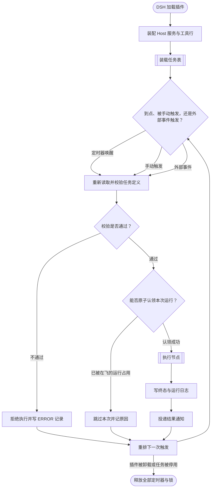
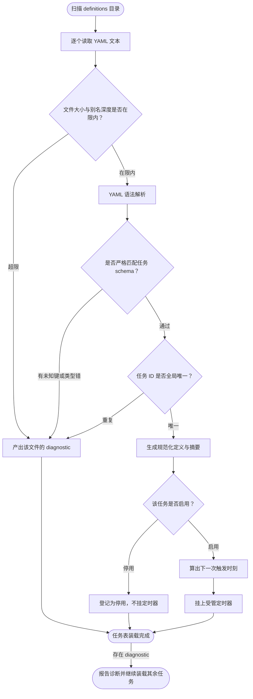
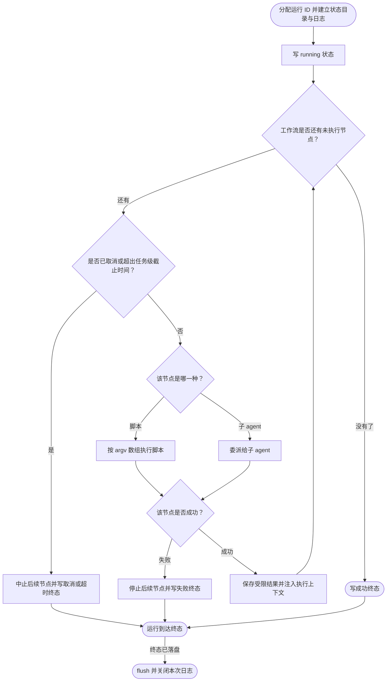

# dsh-cronjob 定时任务流程

本文档描述 `dsh-cronjob` 要实现的流程：宿主进程加载本插件后，把一份受管的定时任务表装载为下一次触发时刻的定时器；每次到点或每次被人手动触发，都重新读取并校验该任务定义，校验通过才在独立会话里跑一次，产物与日志落到 `$DSH_HOME/cronjobs/`，结果作为一条消息回到绑定的会话。文档覆盖主干、分叉点、失败出口与每个环节的输入输出；末节 [未验证面](#未验证面) 列出尚未取到证据的环节。

本流程的设计参照 Hermes Agent 的 cron 子系统（[功能说明](https://hermes-agent.nousresearch.com/docs/user-guide/features/cron)、[内部实现](https://hermes-agent.nousresearch.com/docs/developer-guide/cron-internals)），取舍的理由在 [与 Hermes 的差异](#与-hermes-的差异) 一节。

**本工程尚未存在。** 主流程图描述的是**目标流程**，不是已实现的流程：`assets/projects/dsh-cronjob/` 下暂无仓库克隆，代码未写。现有的 `/mnt/deepseek-harness/cronjob` 是另一份平行尝试（远端 `yunjies/dsh-cronjob`），与本流程的关系见 [与已有尝试的关系](#与已有尝试的关系)。

部署与使用方式见同目录 [deploy.md](deploy.md)。

## 主流程

## START

本节点是流程入口，DSH 在自己的进程里加载本插件，把运行所需的 Host 服务交付给它。本节点不出分支，唯一出边通向 `MOUNT`。

插件分两行装配，落点不同：**服务 provider 属 Host 平面**（调度、存储、通知跨 session，一个进程内只应存在一份），**工具行属 agent preset**（让某个会话的模型看见这套工具）。两行不可合并——把 provider 放进 preset，第二个挂载该 preset 的会话会在服务名上撞车。

**输入**

- `PLUGIN_ENTRY`：插件入口；来源为 Cordis composition 的装配行。
- `DSH_HOME`：DSH 数据根；来源为宿主环境，定时任务的存储布局以它为根。

**输出**

- `SERVICE_READY`：`cronjobs` Host 服务已发布；去向为 `MOUNT`。

## MOUNT

本节点把存储、校验器、调度器、编排器、日志器与通知 outbox 装配成一个 Host 服务，并注册面向模型的工具。本节点不出分支，唯一出边通向 `LOAD`。

装配中的每个副作用都必须可释放：定时器、文件锁、子进程、队列项都挂在当前 Cordis fiber 或显式 disposer 上，插件卸载后不留残余。定义目录的存储布局由本节点建立，装载子流程只消费它。

**输入**

- `SERVICE_READY`：装配前提；来源为 `START`。
- `HOST_SERVICES`：宿主能力集合，含受管定时器、子进程、子 agent 委派与 session 生命周期；来源为 Cordis 运行时的可选读取。

**输出**

- `MOUNTED`：服务与工具就绪；去向为 `LOAD`。
- `DEFINITIONS_DIR`：`$DSH_HOME/cronjobs/definitions/`；去向为 `LOAD` 与 `SCAN`。

## LOAD

本节点承载装载的子流程：扫描 `$DSH_HOME/cronjobs/definitions/`，逐个把任务定义校验成规范化形式，并为每个启用中的任务换算出下一次触发时刻、挂上一个受管定时器。本节点不出分支，唯一出边通向 `TICK`。

**按需重扫而非常驻解析**：任务表的权威承载是 definitions 目录下的 YAML 文件，内存里的定时器只是它的投影。因此增删改任务后重建的是定时器，而不是去改一份内存副本——后者会与磁盘分叉。

**输入**

- `MOUNTED`：服务与工具就绪；来源为 `MOUNT`。
- `DEFINITIONS_DIR`：`$DSH_HOME/cronjobs/definitions/`；来源为 `MOUNT`。
- `SIZE_VERDICT`：在限内或超限的判定；来源为 `SIZE`。
- `SCHEMA_VERDICT`：通过或含错误的判定；来源为 `SCHEMA`。
- `UNIQ_VERDICT`：唯一或重复的判定；来源为 `UNIQ`。
- `ENABLED_VERDICT`：启用或停用的判定；来源为 `ENABLED`。

**输出**

- `LOADED_TABLE`：内存中的任务表投影；去向为 `TICK` 与 `REPORT`。

### SCAN

本节点列出 definitions 目录下的任务定义文件，建立本次装载的工作集。目录不存在时视为空表而非错误——首次运行本就没有任务。本节点不出分支，唯一出边通向 `READ`。

**输入**

- `DEFINITIONS_DIR`：`$DSH_HOME/cronjobs/definitions/`；来源为 `MOUNT` 建立的存储布局。

**输出**

- `DEFINITION_PATHS`：待装载的定义文件路径集；去向为 `READ`。

### READ

本节点逐个读取定义文件的文本，并在解析前施加资源限制。本节点不出分支，唯一出边通向 `SIZE`。

限制在解析**之前**施加，而非在解析之后检查：YAML 的别名展开可以在很小的输入上膨胀成巨大的对象图，等解析完再判断大小就来不及了。

**输入**

- `DEFINITION_PATHS`：待读文件集；来源为 `SCAN`。

**输出**

- `YAML_TEXT`：单个文件的原始文本；去向为 `SIZE`。

### SIZE

本节点判定当前文件是否在资源限制内。本节点按判定结果分叉。

**输入**

- `YAML_TEXT`：待判文本；来源为 `READ`。

**输出**

- `SIZE_VERDICT`：在限内或超限的判定；去向为 `DIAG` 与 `PARSE`。
- `YAML_TEXT`：单个文件的原始文本；去向为 `PARSE` 与 `LOAD`。

### PARSE

本节点做 YAML 语法解析。解析失败时返回行、列与 parser 消息的安全版本——原始消息可能内嵌文件片段，直接透出会把定义内容带进错误通道。本节点不出分支，唯一出边通向 `SCHEMA`。

**输入**

- `YAML_TEXT`：待解析文本；来源为 `SIZE`。
- `SIZE_VERDICT`：在限内或超限的判定；来源为 `SIZE`。

**输出**

- `PARSED_DOCUMENT`：解析所得的文档对象；去向为 `SCHEMA`。

### SCHEMA

本节点判定文档是否严格匹配任务 schema。顶层必须是数组，每一项严格匹配；**未知键一律拒绝**而不是忽略——拼错的字段名若被静默吞掉，任务会按作者没写的意思运行。本节点按判定结果分叉。

**输入**

- `PARSED_DOCUMENT`：待校验文档；来源为 `PARSE`。

**输出**

- `SCHEMA_VERDICT`：通过或含错误的判定；去向为 `DIAG` 与 `UNIQ`。
- `PARSED_DOCUMENT`：已过 schema 的文档；去向为 `UNIQ`。

### UNIQ

本节点判定任务 ID 在全局是否唯一。ID 大小写精确匹配，不做大小写折叠——折叠会让 `Daily` 与 `daily` 指向同一个任务，两个文件互相覆盖。本节点按判定结果分叉。

**输入**

- `PARSED_DOCUMENT`：已过 schema 的文档；来源为 `SCHEMA`。
- `SEEN_IDS`：本次装载已占用的 ID 集；来源为本节点自身的累积。
- `SCHEMA_VERDICT`：通过或含错误的判定；来源为 `SCHEMA`。

**输出**

- `UNIQ_VERDICT`：唯一或重复的判定；去向为 `DIAG` 与 `CANON`。
- `PARSED_DOCUMENT`：已过唯一性检查的文档；去向为 `CANON` 与 `LOAD`。

### CANON

本节点产出规范化定义与它的内容摘要。摘要是后续判断「定义是否变过」的唯一依据——定时器换不换、执行器读到的是不是同一份，都比对这个摘要。本节点不出分支，唯一出边通向 `ENABLED`。

**输入**

- `PARSED_DOCUMENT`：已过唯一性检查的文档；来源为 `UNIQ`。
- `UNIQ_VERDICT`：唯一或重复的判定；来源为 `UNIQ`。

**输出**

- `CANONICAL_DEFINITION`：规范化定义与 sha256 摘要；去向为 `ENABLED`。

### ENABLED

本节点判定任务当前是否启用。停用的任务保留在表里但不挂定时器，因此它的历史运行记录不会因为停用而消失。本节点按判定结果分叉。

**输入**

- `CANONICAL_DEFINITION`：规范化定义；来源为 `CANON`。

**输出**

- `ENABLED_VERDICT`：启用或停用的判定；去向为 `SKIPDEF` 与 `NEXT`。
- `CANONICAL_DEFINITION`：规范化定义与摘要；去向为 `ARM`、`NEXT`、`SKIPDEF` 与 `LOAD`。

### SKIPDEF

本节点把停用任务登记进任务表但不为它挂定时器。它仍可被手动触发——停用拦的是自动触发，不是操作者的显式动作。本节点不出分支，唯一出边通向 `LOADED`。

**输入**

- `CANONICAL_DEFINITION`：停用任务的定义；来源为 `ENABLED`。
- `ENABLED_VERDICT`：启用或停用的判定；来源为 `ENABLED`。

**输出**

- `DISABLED_ENTRY`：登记项；去向为 `LOADED`。

### NEXT

本节点用 5 字段 cron 与显式 IANA 时区，算出严格晚于当前时刻的下一次触发时刻。本节点不出分支，唯一出边通向 `ARM`。

**极长等待要分段**：定时器一次挂几个月并不可靠——进程可能被挂起、系统时钟可能被改。因此长等待拆成有界的段，每次唤醒重新采样墙钟再决定是继续等还是触发。

夏令时的两个不连续处按确定性规则处理：跳过的本地时间不存在，直接跳过；重叠出现两次的时刻取较早的那个。规则写死而非依赖运行时环境，重放才不会因时区状态不同而得出不同结果。

**输入**

- `CANONICAL_DEFINITION`：含 cron 表达式与时区的定义；来源为 `ENABLED`。
- `NOW`：当前墙钟时刻；来源为宿主时钟。
- `ENABLED_VERDICT`：启用或停用的判定；来源为 `ENABLED`。

**输出**

- `NEXT_FIRE_AT`：下一次触发时刻；去向为 `ARM`。

### ARM

本节点为任务挂上一个受管定时器，记录它的摘要与下次触发时刻。重新挂载时先比较摘要，变了才替换并立即释放旧 handle——无条件替换会泄漏定时器。本节点不出分支，唯一出边通向 `LOADED`。

**输入**

- `NEXT_FIRE_AT`：下次触发时刻；来源为 `NEXT`。
- `CANONICAL_DEFINITION`：用于比对的摘要；来源为 `ENABLED`。

**输出**

- `ARMED_TIMER`：已登记的定时器 handle；去向为 `LOADED`。

### LOADED

本节点收敛装载结果：已挂载的任务、已登记的停用任务，以及本次遭遇的诊断。本节点按是否存在诊断分叉。

诊断不影响其余任务的装载——一个写坏的文件不应让整张表停摆。这与「校验失败即拒绝执行」并不矛盾：后者拒绝的是**被执行的那一个**任务，前者拦的是「因为其中一个坏了所以全都不跑」。

**输入**

- `ARMED_TIMER`：已挂载定时器；来源为 `ARM`。
- `DISABLED_ENTRY`：停用登记项；来源为 `SKIPDEF`。
- `diagnostics`：本次装载的诊断集；来源为 `DIAG`。

**输出**

- `LOADED_TABLE`：内存中的任务表投影；去向为 `TICK` 与 `REPORT`。

### DIAG

本节点把一份配置缺陷收敛成一条可查询的诊断：稳定的错误码、YAML 路径与行列、安全说明。它只承载诊断，不含密钥或原始定义内容。本节点不出分支，唯一出边通向 `LOADED`。

错误码是封闭集合，逐条对应一类缺陷：语法错误、schema 不匹配、未知字段、任务 ID 重复、节点 ID 重复、cron 表达式非法、时区非法、脚本路径非法、节点非法、超时非法、misfire 策略非法。

**输入**

- `SIZE_VERDICT`：超限判定；来源为 `SIZE`。
- `SCHEMA_VERDICT`：schema 判定；来源为 `SCHEMA`。
- `UNIQ_VERDICT`：唯一性判定；来源为 `UNIQ`。

**输出**

- `diagnostics`：诊断集；去向为 `LOADED`。

### REPORT

本节点把诊断写进日志并保留为可查询记录，让操作者知道哪些文件被跳过、为什么。本节点不出分支，唯一出边通向结束型节点 `LOADED`（诊断已登记，装载照常收敛）。

**输入**

- `LOADED_TABLE`：含诊断的装载结果；来源为 `LOADED`。

**输出**

- `DIAGNOSTIC_LOG`：诊断记录；去向为宿主的日志通道。

## TICK

本节点是每次触发的分派点：定时器到点、被手动触发、或被外部事件触发，三条来路在这里汇聚。三条来路走的是同一套下游——认领、校验、执行、通知——差别只在触发来源如何记账。本节点按触发来源与其后续判定分叉。

触发来源要记进运行记录，因为它决定可观测语义：定时的运行消耗一次调度时点，手动的运行不消耗，事件触发的运行由外部因果解释。

**输入**

- `LOADED_TABLE`：内存任务表；来源为 `LOAD`。
- `TRIGGER_SOURCE`：触发来源，取定时、手动或外部事件；来源为定时器唤醒、模型工具调用或外部事件回调。
- `NEXT_TIMER`：重排后的定时器；来源为 `REARM`。

**输出**

- `FIRE_REQUEST`：一次触发请求，含任务 ID 与来源；去向为 `RELOAD`。
- `TRIGGER_SOURCE`：触发来源；去向为 `EXEC` 与 `MARK`。

## RELOAD

本节点在每次触发前重新读取并完整校验当前 YAML，**不信任上一次的结果**。这是本流程唯一允许进入执行的入口，调用方无法绕过它。本节点不出分支，唯一出边通向 `GATE`。

重新校验而非复用装载时的结果，是因为两次运行之间文件可能已被改写。若沿用旧结果，执行的就是一份已经不存在的定义；重新读取后执行的东西，与操作者此刻在磁盘上看到的始终一致。代价是每次触发多一次文件读与解析——相对于一次动辄数分钟的运行，这个开销不构成取舍。

**输入**

- `FIRE_REQUEST`：触发请求；来源为 `TICK`。
- `DEFINITION_PATH`：该任务的定义文件路径；来源为存储布局。

**输出**

- `VERIFIED_DEFINITION`：本次运行实际消费的规范化定义与摘要；去向为 `GATE`。
- `CANONICAL_DEFINITION`：本次运行实际消费的规范化定义与摘要；去向为 `ALLOC`、`PICK`、`EXEC` 与 `REARM`。
- `MISFIRE_POLICY`：该任务的 misfire 策略；去向为 `SKIP`。
- `diagnostics`：校验产出的诊断集；去向为 `GATE`。

## GATE

本节点判定校验是否通过。不通过时拒绝执行：不创建子进程、不调用子 agent、不加任何重试。本节点按判定结果分叉。

一个跑错的定时任务会按周期反复消耗额度并反复报警，所以「配置文件坏了」这件事必须在花掉任何一次模型调用**之前**被截住，而不是让运行失败来表达它。

**输入**

- `VERIFIED_DEFINITION`：待判定的定义；来源为 `RELOAD`。
- `diagnostics`：校验产出的诊断集；来源为 `RELOAD`。

**输出**

- `GATE_VERDICT`：通过或拒绝的判定；去向为 `CLAIM` 与 `REJECT`。
- `diagnostics`：校验产出的诊断集；去向为 `REJECT`。

## REJECT

本节点把一次被拒绝的运行写成终态记录与 ERROR 日志，让「这个任务为什么没跑」有据可查。本节点不出分支，唯一出边通向 `REARM`。

拒绝的运行**仍然计入运行历史**，并带有它的触发来源。把它记成「没发生过」会让失败的任务在监控上看起来是健康的。

**输入**

- `diagnostics`：拒绝原因；来源为 `GATE`。
- `FIRE_REQUEST`：本次触发；来源为 `TICK`。
- `GATE_VERDICT`：通过或拒绝的判定；来源为 `GATE`。

**输出**

- `REJECTED_RUN`：状态为 rejected 的运行记录与 ERROR 日志；去向为 `REARM`。

## CLAIM

本节点尝试原子认领本次运行：取得任务级锁与全局并发令牌，并把运行标为已认领。认领失败意味着另一次运行仍在飞，或全局并发已满。本节点按判定结果分叉。

**认领必须先于执行且是原子的**：先执行后记录的话，两次触发并发时同一次任务会被跑两遍，而两遍各自都会认为自己是对的。认领是用一次原子的比较并交换把「谁在跑」这件事定下来，因此并发触发里至多一次能进入执行。

**输入**

- `GATE_VERDICT`：校验通过的判定；来源为 `GATE`。
- `JOB_LOCK`：任务级锁；来源为存储的锁接口。
- `CONCURRENCY_TOKEN`：全局并发令牌；来源为编排器的并发闸。

**输出**

- `CLAIM_VERDICT`：认领成功或被占用的判定；去向为 `SKIP` 与 `EXEC`。
- `RUN_ID`：本次运行的唯一标识；去向为 `EXEC`。
- `JOB_LOCK`：任务级锁；去向为 `EXEC` 与 `FLUSH`。
- `CONCURRENCY_TOKEN`：全局并发令牌；去向为 `EXEC` 与 `FLUSH`。

## SKIP

本节点把被跳过的触发写成终态记录并说明原因，它可能来自锁被占用、并发已满，或 misfire 策略要求跳过积压。本节点不出分支，唯一出边通向 `REARM`。

跳过与拒绝要分开记：跳过是「系统此刻不接受这一次」，拒绝是「这个任务的定义本身有问题」。混成一种状态会让读者分不清该去修配置还是该去调并发。

**输入**

- `CLAIM_VERDICT`：被占用的判定；来源为 `CLAIM`。
- `MISFIRE_POLICY`：该任务的 misfire 策略；来源为 `RELOAD`。

**输出**

- `SKIPPED_RUN`：状态为 skipped 的运行记录；去向为 `REARM`。

## EXEC

本节点承载执行的子流程：为本次运行分配运行 ID，按其定义建立状态目录与日志，然后按工作流顺序逐个节点执行，每步之前检查取消与任务级截止时间。本节点不出分支，唯一出边通向 `TERMINAL`。

节点只接受两种：跑一个脚本，或委派给一个子 agent。两种都被当作不可信输入处理——脚本的输出与子 agent 的回答是**数据**，不是下一步的指令。

### ALLOC

本节点在**任何节点开始执行之前**分配运行 ID，建立该次运行的状态目录与日志文件。本节点不出分支，唯一出边通向 `MARK`。

先立记录后干活，是为了让「已经开始但没结束」这件事在磁盘上可见。反过来的话，一个在第一个节点就崩溃的运行不会留下任何痕迹，而它恰恰是最需要被看见的那种。

**输入**

- `RUN_ID`：本次运行标识；来源为 `CLAIM`。
- `CANONICAL_DEFINITION`：本次运行的依据；来源为 `RELOAD`。
- `CLAIM_VERDICT`：认领成功或被占用的判定；来源为 `CLAIM`。
- `NODE_KIND`：节点类型判定；来源为 `NODETYPE`。
- `RESULT_VERDICT`：成功或失败的判定；来源为 `RESULT`。
- `RUNNING_STATE`：状态为 running 的运行记录；来源为 `MARK`。
- `TERMINAL_STATE`：本次运行的终态；来源为 `DONE`。
- `NODE_RESULT`：JSON-safe 的节点结果；来源为 `RESULT`。

**输出**

- `RUN_DIR`：`runs/{cronjobId}/{runId}/`；去向为 `MARK`。
- `LOG_HANDLE`：本次运行的日志句柄；去向为 `MARK`。

### MARK

本节点把运行状态写为 running 并记录 accepted 时刻。本节点不出分支，唯一出边通向 `PICK`。

**输入**

- `RUN_DIR`：运行目录；来源为 `ALLOC`。
- `TRIGGER_SOURCE`：触发来源；来源为 `TICK`。
- `LOG_HANDLE`：本次运行的日志句柄；来源为 `ALLOC`。

**输出**

- `RUNNING_STATE`：状态为 running 的运行记录；去向为 `PICK`。

### PICK

本节点按定义顺序取下一个人口未执行的节点。本节点按是否还有节点分叉。

**输入**

- `CANONICAL_DEFINITION`：含工作流节点序列的定义；来源为 `RELOAD`。
- `NODE_CURSOR`：已执行到的位置；来源为本节点自身的累积。
- `EXEC_CONTEXT`：更新后的执行上下文；来源为 `KEEP`。
- `RUNNING_STATE`：状态为 running 的运行记录；来源为 `MARK`。

**输出**

- `NEXT_NODE`：下一个待执行节点；去向为 `DEADLINE`。
- `WORKFLOW_DONE`：工作流已尽；去向为 `OK`。

### DEADLINE

本节点在节点开始前检查该次运行是否已被取消或已超出任务级截止时间。本节点按判定结果分叉。

检查放在每个节点**之前**而不是只在开头：一次运行由多个节点组成，只有逐节点检查才能让取消在一个长运行里及时生效。正在执行的节点本身靠它自己的取消信号中止。

**输入**

- `CANCEL_SIGNAL`：取消信号；来源为宿主或操作者。
- `RUN_DEADLINE`：任务级截止时间；来源为 `CANONICAL_DEFINITION`。
- `NEXT_NODE`：下一个待执行节点；来源为 `PICK`。

**输出**

- `DEADLINE_VERDICT`：继续或中止的判定；去向为 `NODETYPE` 与 `ABORT`。

### NODETYPE

本节点判定当前节点属于哪一种，并把执行交给对应的执行器。本节点按节点类型分叉。

**输入**

- `NEXT_NODE`：待执行节点；来源为 `PICK`。
- `DEADLINE_VERDICT`：继续或中止的判定；来源为 `DEADLINE`。

**输出**

- `NODE_KIND`：节点类型判定；去向为 `RUNPY` 与 `SPAWN`。
- `NEXT_NODE`：待执行节点；去向为 `RUNPY`、`SPAWN` 与 `EXEC`。

### RUNPY

本节点执行脚本节点。脚本以固定解释器与 **argv 数组**执行，参数经受控通道传入，**绝不经过 shell 拼接**；脚本的 realpath 必须落在受控的 artifact 根目录内，防止定义文件把执行指向任意路径。本节点不出分支，唯一出边通向 `RESULT`。

**输入**

- `NEXT_NODE`：含脚本路径与参数的节点；来源为 `NODETYPE`。
- `EXEC_CONTEXT`：执行上下文，含任务 context 与前置节点摘要；来源为 `KEEP`。
- `NODE_KIND`：节点类型判定；来源为 `NODETYPE`。

**输出**

- `NODE_RESULT`：JSON-safe 的节点结果，含 stdout、stderr 与退出码；去向为 `RESULT`。

### SPAWN

本节点把一个子 agent 节点委派出去。未指定 provider 时用服务配置的默认值，并把实际用到的 provider 记进日志；父子任务被取消时同时中断子任务，不留后台孤儿。子 agent 的输出按不可信数据处理。本节点不出分支，唯一出边通向 `RESULT`。

**输入**

- `NEXT_NODE`：含 prompt、provider 与输出格式的节点；来源为 `NODETYPE`。
- `EXEC_CONTEXT`：执行上下文，含前置节点结果；来源为 `KEEP`。
- `NODE_KIND`：节点类型判定；来源为 `NODETYPE`。

**输出**

- `NODE_RESULT`：JSON-safe 的节点结果，含子任务标识与摘要；去向为 `RESULT`。

### RESULT

本节点按节点结果判定成功与否。本节点按判定结果分叉。

**输入**

- `NODE_RESULT`：节点执行结果；来源为 `RUNPY` 或 `SPAWN`。

**输出**

- `RESULT_VERDICT`：成功或失败的判定；去向为 `KEEP` 与 `FAIL`。
- `NODE_RESULT`：节点执行结果；去向为 `KEEP` 与 `EXEC`。

### KEEP

本节点保存受限的节点结果，并把它注入后续节点的执行上下文，然后回到 `PICK` 取下一个人口。结果按大小截断，敏感信息遮蔽。本节点不出分支，唯一出边回到 `PICK`。

**输入**

- `NODE_RESULT`：成功的节点结果；来源为 `RESULT`。
- `RESULT_VERDICT`：成功或失败的判定；来源为 `RESULT`。

**输出**

- `EXEC_CONTEXT`：更新后的执行上下文；去向为 `PICK` 与后续节点的执行器。

### FAIL

本节点在首个失败处停止后续节点，并写出失败终态。默认不继续——后续节点通常依赖前置节点的产物，硬跑下去只会制造更多错误。本节点不出分支，唯一出边通向 `DONE`。

**输入**

- `RESULT_VERDICT`：失败的判定；来源为 `RESULT`。

**输出**

- `FAILED_STATE`：失败终态与错误码；去向为 `DONE`。

### ABORT

本节点把被取消或超时的运行写成相应终态。取消与超时要与失败区分：失败是任务自己没跑成，取消是有人叫停了它，超时是它没在期限内跑完——三者在事后排查时指向完全不同的动作。本节点不出分支，唯一出边通向 `DONE`。

**输入**

- `DEADLINE_VERDICT`：中止的判定；来源为 `DEADLINE`。

**输出**

- `ABORTED_STATE`：取消或超时终态；去向为 `DONE`。

### SUCCEED

本节点把跑完全部节点的运行写成成功终态。本节点不出分支，唯一出边通向 `DONE`。

**输入**

- `WORKFLOW_DONE`：工作流已尽；来源为 `PICK`。

**输出**

- `SUCCEEDED_STATE`：成功终态与结果摘要；去向为 `DONE`。

### DONE

本节点收敛运行的终态，把它落盘后转入日志收尾。本节点按终态是否已落盘分叉。

**输入**

- `FAILED_STATE`：失败终态；来源为 `FAIL`。
- `ABORTED_STATE`：取消或超时终态；来源为 `ABORT`。
- `SUCCEEDED_STATE`：成功终态；来源为 `OK`。

**输出**

- `TERMINAL_STATE`：本次运行的终态；去向为 `FLUSH`。

### FLUSH

本节点 flush 并关闭本次运行的日志，释放该次运行占用的锁与并发令牌。本节点到达结束型节点后返回主干。**日志写入失败不得阻塞释放**——若因为写不进日志就不放锁，一次磁盘问题会升级成整个任务永久停摆。日志失败只更新运行状态里的标记，并回退到宿主 stderr。

**输入**

- `LOG_HANDLE`：本次运行的日志句柄；来源为 `ALLOC`。
- `JOB_LOCK`：任务级锁；来源为 `CLAIM`。
- `CONCURRENCY_TOKEN`：全局并发令牌；来源为 `CLAIM`。
- `TERMINAL_STATE`：本次运行的终态；来源为 `DONE`。

**输出**

- `RUN_COMPLETE`：本次运行已收尾；去向为 `TERMINAL`。

## TERMINAL

本节点把运行终态与它的摘要写成一条不可变的通知记录，登记到绑定会话的 outbox。本节点不出分支，唯一出边通向 `NOTIFY`。

记录在投递之前就已经落盘，因此投递失败不会让这次运行的结果消失——它只是从「已投递」退回「待投递」。

**输入**

- `RUN_COMPLETE`：已收尾的运行；来源为 `EXEC`。
- `BIND_SESSION_ID`：该任务绑定的会话；来源为任务定义。

**输出**

- `NOTIFICATION_RECORD`：含通知 ID、任务与运行 ID、状态、摘要与幂等键的记录；去向为 `NOTIFY`。

## NOTIFY

本节点把通知投递给绑定的会话：会话在线就立即排入队列，离线就留在 outbox 等待该会话后续创建或恢复时投递。本节点不出分支，唯一出边通向 `REARM`。

投递按幂等键去重——会话恢复事件可能重复到达，没有幂等键就会把同一条结果推两遍。超过次数上限的通知转为 failed 并保留诊断，不无限重试。

通知内容只含状态、日志路径与受限摘要；**不把脚本或子 agent 的输出解释成指令**。没有绑定会话的任务只记录运行产物，不产生通知。

**输入**

- `NOTIFICATION_RECORD`：待投递记录；来源为 `TERMINAL`。
- `SESSION_LIVENESS`：目标会话是否在线；来源为宿主的 session 生命周期。

**输出**

- `DELIVERY_OUTCOME`：已投递、待投递或投递失败；去向为 `REARM` 与 outbox。

## REARM

本节点在本次触发办理完之后，基于**最新**的定义重新安排下一次触发：释放当前 handle，重新读取并校验，再算下一次时刻并挂上新的定时器。本节点按插件是否仍装载、任务是否仍启用分叉。

无论上一次是执行成功、被拒绝、被跳过还是失败，都要重排——调度不该因为一次运行的结果而停摆。重排用的是此刻磁盘上的定义，因此运行期间对定义的修改会在下一次触发时生效。

**输入**

- `REJECTED_RUN`：被拒绝的运行；来源为 `REJECT`。
- `SKIPPED_RUN`：被跳过的运行；来源为 `SKIP`。
- `DELIVERY_OUTCOME`：投递结果；来源为 `NOTIFY`。
- `CANONICAL_DEFINITION`：最新定义；来源为 `RELOAD`。

**输出**

- `NEXT_TIMER`：重排后的定时器；去向为 `TICK`。

## STOP

本节点是流程出口：插件被卸载或任务被停用删除时，依次取消全部定时器、停止接收新触发、等待已进入编排器的调用返回，并释放遗留的锁与队列项。本节点到达结束型节点。

**输入**

- `NEXT_TIMER`：待释放的定时器；来源为 `REARM`。
- `DISPOSAL_SIGNAL`：卸载或停用信号；来源为 Cordis fiber 的释放流程。

**输出**

- `RELEASED`：全部资源已释放；去向为宿主。

## 与 Hermes 的差异

Hermes 的 cron 是**聊天机器人优先级**的设计：任务跑完把结果发到 Telegram、Slack 这类渠道，因而它有一整套投递目标语法、渠道凭证预检与「送达回执」语义。本流程服务的是 DSH 内的定时任务，投递对象是**本机会话**，因此不引入外部渠道层。

保留自 Hermes 的设计：

- **每次触发都重新校验**，以及「校验不过就不花一次模型调用」的前置拦截。
- **独立会话执行**：每次运行都是全新会话，不继承上次的对话上下文，任务 prompt 必须自包含。持久记忆仍会加载，逐次对话上下文不会。
- **原子认领**：定时器的触发与手动触发走同一套认领，避免同一次任务被跑两遍。
- **外部事件触发**：除按时刻触发外，也允许由外部事件触发同一条任务。
- **运行账本**：每次尝试先记账，崩溃后按 PID 与进程起始指纹判定 owner 已死才标为 unknown，且 unknown 记录**永不自动重跑**。

有意不做的：

- **不做投递目标语法与外部渠道**。Hermes 用 `platform:chat_id:thread_id` 覆盖二十余个平台，本流程只需投递给会话。
- **不做 `no_agent` 脚本模式**。Hermes 允许整条任务不调模型、只跑脚本并把 stdout 原样投递；本流程的脚本节点是工作流里的一步，不是任务的全部。
- **不做托管调度与 scale-to-zero**。那需要一个外部调度服务来反向回调，本流程的调度由进程内受管定时器完成。
- **不做任务间结果串联**。Hermes 的 `context_from` 允许任务引用另一个任务的上次输出，本流程首版只保证单任务内的节点按序传递。

## 与已有尝试的关系

`/mnt/deepseek-harness/cronjob`（远端 `yunjies/dsh-cronjob`）是一份已完成一部分的平行实现，其设计文档在 `docs/landdoc/` 与 `docs/codedesign/`。两者在**共享契约、5 字段 cron、YAML 定义、脚本与子 agent 两种节点**上取向一致；本流程的差异主要在：

- 已有尝试的工作流是**顺序节点**且首个失败即停止；本流程同样如此，但把失败、取消、超时三者拆成独立的终态与出口。
- 已有尝试的 `misfirePolicy` 首版仅 `skip`；本流程同样保留 skip，并把「跳过」与「拒绝」记为两种可区分的终态。
- 已有尝试未纳入外部事件触发；本流程把它作为第三条触发来路，与定时、手动共用下游。

本流程不预设复用它的代码。是否以它为起点、或另起实现，取决于它未提交改动与测试状态的处置结论。

## 未验证面

以下环节**尚无证据**，读到这些部分时不要当作已验证：

- **本流程整体未经实现验证**。`assets/projects/dsh-cronjob/` 下没有仓库克隆，主流程图描述的是目标流程而非已跑通的流程。本文档因此不含任何取自运行输出的断言。
- **与已有尝试的比较基于其设计文档，未基于其代码**。`/mnt/deepseek-harness/cronjob` 的工作树有未提交改动（`validation.ts`、`validation.test.ts` 被修改，`packages/cronjob/tools/` 未跟踪），且其测试套件在当前只读策略下无法运行——`pnpm test` 失败于 Vite 写 `node_modules/.vite-temp/` 的 `EROFS`，而非代码缺陷。该工程的**实际**测试结论尚未取得。
- **Hermes 的取舍为外部证据**。上述差异基于其官方文档与 `tools/cronjob_tools.py` 的公开源码；未在本机运行过 Hermes，其行为未亲自复现。
- **DSH 侧底座的可组合性未验证**。受管定时器、子 agent 委派与 session 生命周期三个 seam 是否能在同一装配里共存、以及工具行挂在 preset 后是否对目标会话生效，均未实测。
