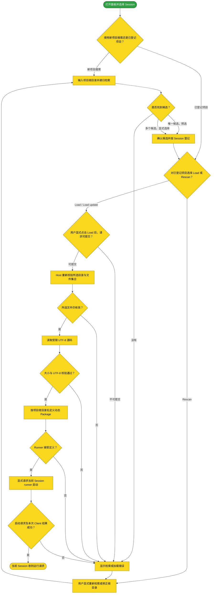

# 动态 Cordis 项目从递归检索到当前会话运行

本流程从用户打开 WebUI 面板并主动选择 Session 后开始：Session 选择初始为空，面板显示选择占位项，不会自动选中第一个 Session；未选择 Session 时 Search、Register、Rescan 与 Load 均不可用。用户选择 Session 后，可输入 Host 可读的绝对项目根目录递归检索，也可选择该 Session 已登记的项目执行手动 Load 或 Rescan；新候选经确认后按 Session 保存相对源码路径，手动 Load 时重新校验并显式读取，最终向本次 Session 的动态 Cordis runner 请求运行。只有用户显式点击 Load 会读取源码，自动检索不读取或执行源码。

## 主流程

## START

用户打开侧栏中的 Dynamic Cordis／动态 Cordis 面板后，Session 选择状态为空，选择框显示「请选择会话」占位项；即使存在可选 Session，面板也不会默认选中 `sessionIds[0]`。用户主动选择 Session 后，登记数据才按该 Session 从当前浏览器的 `localStorage` 读取；未选择 Session 时 Search、Register、Rescan 与 Load 均禁用。此项要求用户明确指定命令目标，降低误将检索或动态加载发往意外 Session 的风险；代价是每次打开面板都须先作选择，也不支持无交互自动操作。

**输入**

- `SESSION_OPTIONS`：可选 Session 集合；来源为 Client `useSessions`。

**输出**

- `SESSION_ID`：所选 Session 身份；去向为 `SESSION_ENTRY`。
- `SESSION_PROJECTS`：该 Session 的浏览器本地登记记录；去向为 `SESSION_ENTRY`。

## SESSION_ENTRY

用户可从当前 Session 的本地登记记录中选择已有项目，或开始新项目搜索。新搜索要求用户提供 Host 可读的绝对根目录；已有项目进入 Load／Rescan 操作。没有可选 Session 时，两种路径都不可用。

**输入**

- `SESSION_ID`：所选 Session 身份；来源为 `START`。
- `SESSION_PROJECTS`：该 Session 的已登记项目列表；来源为 `START`。

**输出**

- `NEW_SEARCH`：开始检索新项目的选择；去向为 `SEARCH`。
- `PROJECT_RECORD`：用户选择的已有项目；去向为 `PROJECT_ACTION`。

## SEARCH

用户输入 Host 可访问的绝对项目根目录并点击检索。Client 以 `/dcscan` 和 JSON `sourceDir` 请求 Host；Host 解析根目录后递归调用 `fs.listDir`，只读取目录元数据，不读取源码字节，也不执行源码。Host 返回的候选记录只含 `relativeDir`、`hostRelativePath`、`clientRelativePath` 等相对路径，不含项目绝对路径或源码。

项目根目录与每个候选相对文件路径最长 4096 个字符，命令请求最多 16 KiB。检索深度上限为 32 层、访问目录数上限为 10,000、目录项数上限为 50,000、候选项数上限为 128、序列化 UTF-8 结果上限为 12 KiB；超过任一界限时 Host 返回错误，不静默截断或返回部分候选。搜索上限的测试覆盖绝对根目录校验、路径对字段必需、非普通文件 `host.js`，以及上述每项搜索上限。`/dcscan` 设置 `recordInput: false`，但 `command/done.text` 仍进入 Session log；其搜索响应只含相对路径。

**输入**

- `NEW_SEARCH`：用户选择新项目搜索；来源为 `SESSION_ENTRY`。
- `SESSION_ID`：当前选择的 Session；来源为 `START`。
- `SOURCE_DIR`：用户输入的 Host 可读绝对项目根目录；来源为用户输入。
- `RESCAN_REQUEST`：现有项目登记的根目录与重新检索动作；来源为 `RESCAN`。

**输出**

- `SEARCH_RESULT`：候选相对路径列表；去向为 `CANDIDATES`。
- `SEARCH_ERROR`：无路径或源码内容的检索错误；去向为 `ERROR`。

## CANDIDATES

Host 只把同一目录内精确名称且类型为普通文件的 `host.js` 作为候选必需半区；精确 `client.js` 是可选半区，若存在则必须也是普通文件且与 `host.js` 同目录。没有符合条件的 `host.js` 就没有候选。`host-body.js` 与 `client-body.js` 不是别名；检索不会把另一个目录的 `dist/bundle/client.js` 与候选 Host 半区配对。

唯一候选由 Client 预选；多个候选展示相对目录与 Host／Client 半区信息，并要求用户显式选择；零候选时面板显示未找到候选且不允许登记。代码树中的 `dsh-credentials` Cordis 输出目录只有 [`host-body.js`](../dsh-credentials/dsh-credentials/dist/cordis/cred/host-body.js) 与 [`client-body.js`](../dsh-credentials/dsh-credentials/dist/cordis/cred/client-body.js)，整个 checkout 没有精确 `host.js`，故从该项目根检索不会产生候选；另一个 [`dist/bundle/client.js`](../dsh-credentials/dsh-credentials/dist/bundle/client.js) 不能补足缺少的 Host 文件。

**输入**

- `SEARCH_RESULT`：Host 返回的候选列表；来源为 `SEARCH`。

**输出**

- `CANDIDATE_SET`：一个或多个可选候选；去向为 `SELECT`。
- `NO_CANDIDATE`：空候选列表；去向为 `ERROR`。

## SELECT

用户确认单一预选候选，或从多个候选中明确选择一个。Client 把原始 `sourceDir`、候选列表、所选 `hostRelativePath` 与可选 `clientRelativePath` 按 Session 写入浏览器 `localStorage`；无 Client 半区时保存 `null`。Client 仅用 `trim()` 拒绝空根目录，路径校验、登记数据与 Host payload 保留用户输入的原始根路径。显示名由根目录 basename 派生；Host 定义时从 basename 生成 Plugin 名称，名称经 trim 后截断至 120 个字符；根目录、`.` 或 `..` basename 使用 `Dynamic Cordis` fallback。用途固定为 `Loaded from a local dynamic Cordis source directory.`，界面不提供名称或用途编辑项。旧 `{paths:{host,client}}` 逐文件登记仍可显示，但没有 `sourceDir`，Load 按钮禁用。

**输入**

- `SESSION_ID`：登记归属 Session；来源为 `START`。
- `SOURCE_DIR`：检索时的原始绝对根目录；来源为用户输入与 Client 表单状态。
- `CANDIDATE_SET`：候选相对路径集合；来源为 `CANDIDATES`。
- `SELECTED_CANDIDATE`：用户确认的候选；来源为单候选预选或多候选显式选择。

**输出**

- `PROJECT_RECORD`：按 Session 保存的根路径、候选列表与所选相对文件路径；去向为 `PROJECT_ACTION`。

## PROJECT_ACTION

用户从已登记的项目卡选择 **Load／Load update** 或 **Rescan**。若当前记录没有仍有效的选中候选，Client 禁用 Load；用户须先重新检索并选择候选。选择 Rescan 只更新候选记录，不读取或执行源码。

**输入**

- `PROJECT_RECORD`：按 Session 保存的根目录、候选集与当前选择；来源为 `SESSION_ENTRY` 或 `SELECT`。
- `SESSION_ID`：当前面板所选 Session；来源为 `START`。

**输出**

- `LOAD_SELECTION`：当前项目及已选相对路径；去向为 `LOAD`。
- `RESCAN_SELECTION`：当前项目的重新检索选择；去向为 `RESCAN`。

## LOAD

只有用户点击 **Load** 或 **Load update** 时，Client 才为所选 Session 准备 `/dcload` 请求。当前 Session、已选候选或必要 inventory 查询不可用时，Client 显示错误而不提交请求；否则它只在 inventory 确认 Plugin 属于同一 Session 时发送可复用的 `pluginId`，并请求定义或更新动态 Plugin。面板请求包含 `sourceDir`、`hostRelativePath`、`clientRelativePath`（无 Client 半区时为 `null`）及可选 `pluginId`。`/dcload` 设置 `recordInput: false`，但其 `command/done.text` 收据或错误仍进入 Session log；Host 成功收据不含绝对路径或源码。

**输入**

- `LOAD_SELECTION`：当前项目及已选相对路径；来源为 `PROJECT_ACTION`。
- `SESSION_ID`：命令接收 Session；来源为 `START`。
- `PLUGIN_ID`：可选且经同 Session inventory 核实的 Plugin 身份；来源为 `LOAD_SELECTION` 与 Client inventory。

**输出**

- `LOAD_REQUEST`：根目录、所选相对路径与可选同 Session Plugin 身份；去向为 `REVALIDATE`。
- `SESSION_ID`：本次命令的 Session 执行上下文；去向为 `REVALIDATE`、`DEFINE` 与 `RUN`。
- `PLUGIN_ID`：经同 Session inventory 核实后用于更新的可选 Plugin 身份；去向为 `DEFINE`。
- `COMMAND_ERROR`：命令通信或拒绝响应；去向为 `ERROR`。

WebUI 始终发送已选中的 `hostRelativePath` 与 `clientRelativePath`；Host 要求两个字段都存在，无 Client 半区时也必须显式发送 `clientRelativePath: null`。缺少任一字段的 `/dcload` 请求会被拒绝并要求重新检索。

## REVALIDATE

Host 重新解析根目录及所选文件的包含目录，确认根目录和候选目录均为目录且候选目录位于根目录之下，再重新列出候选目录元数据。Host 要求该目录当前仍含普通 `host.js`，并要求普通 `client.js` 的存在性与本次所选记录一致；两个文件都必须位于根目录内。选择缺失、越界、类型改变或 Host／Client 文件集合改变时，Host 在读源码字节和调用 Runner 之前拒绝请求，用户须重新检索。若文件字节变更但相对路径与文件集合不变，手动 Load 会读取当前字节，不以字节摘要要求再次检索。

**输入**

- `LOAD_REQUEST`：根目录及已选相对文件路径；来源为 `LOAD`。
- `SESSION_ID`：当前命令的 Session；来源为 `LOAD`。

**输出**

- `REVALIDATION_RESULT`：最新目录、文件类型、包含关系与文件集合元数据；去向为 `VALID`。

## VALID

仅当 Host 确认根目录可解析、所选目录仍存在且位于根目录内、必需 `host.js` 为普通文件、可选 `client.js` 的当前存在性与选择一致时，路径校验才通过；任一项不成立都在读取源码前拒绝。Host 若从目录元数据获知文件已超出 256 KiB，也会提前拒绝；实际字节大小、UTF-8 与合计大小由 `READ` 强制校验。请求来源的 16 KiB 上限在读取前检查。

**输入**

- `REVALIDATION_RESULT`：Host 最新目录元数据；来源为 `REVALIDATE`。

**输出**

- `VALIDATED_TARGETS`：通过校验的 Host／Client 文件目标及所选 Session；去向为 `READ`。
- `VALIDATION_ERROR`：所选文件已变化、缺失或越界；去向为 `ERROR`。

## READ

Host 只在用户明确 Load 且所选目录与文件集合重新校验通过后，用 `fs.readBytes` 读取所选源码，并以严格 UTF-8 解码。每个半区上限为 256 KiB，Host 与 Client 合计上限为 512 KiB；超限、读取失败或 UTF-8 无效时不定义 Plugin，读取结果交由 `READ_RESULT` 判定。搜索阶段从不调用该读取过程。

**输入**

- `VALIDATED_TARGETS`：重验通过的文件目标；来源为 `VALID`。

**输出**

- `READ_RESULT_PAYLOAD`：所选源码读取、字节数与 UTF-8 解码结果；去向为 `READ_RESULT`。

## READ_RESULT

该条件节点只在 Host 成功读取所选文件、每半区不超过 256 KiB、合计不超过 512 KiB，且所有字节均通过严格 UTF-8 解码时成立；任何超限、读取失败或无效 UTF-8 都使本次加载失败，Host 不定义 Plugin。

**输入**

- `READ_RESULT_PAYLOAD`：所选源码读取、字节数与 UTF-8 解码结果；来源为 `READ`。

**输出**

- `VALIDATED_SOURCE`：大小与解码检查通过的源码及半区存在性；去向为 `DEFINE`。
- `READ_ERROR`：不含源码内容的读取或解码失败；去向为 `ERROR`。

## DEFINE

Host 使用命令执行时的 `agent.id` 作为 Plugin 所有者 Session，并调用动态 Cordis runner 创建 Plugin；同 Session 已有 Plugin 的 `pluginId` 只有在 Client inventory 核实后才可复用。Host 从项目根目录 basename 生成名称，仅 trim basename 并最多保留 120 字符；根、`.`、`..` 等 basename 使用 `Dynamic Cordis` fallback。Host 使用固定用途 `Loaded from a local dynamic Cordis source directory.`。每个源码半区必须是 runner 接受的 async function body 并返回 Cordis Plugin，不能包含 ESM `export`。成功收据只包含 `pluginId`、`packageId` 与 Host／Client 半区存在性；定义错误转为通用诊断。

**输入**

- `VALIDATED_SOURCE`：已验证源码与半区存在性；来源为 `READ_RESULT`。
- `SESSION_ID`：命令执行身份所对应 Session；来源为 `LOAD`。
- `PLUGIN_ID`：可选且经同 Session inventory 核实的既有 Plugin 身份；来源为 `LOAD`。

**输出**

- `DEFINE_OUTCOME`：动态定义收据或通用拒绝原因；去向为 `DEFINE_RESULT`。

## DEFINE_RESULT

Runner 接受定义时，Host 返回只含 `pluginId`、`packageId` 与半区存在性的收据；Runner 拒绝定义时，Host 返回通用错误，不回显名称、用途、路径或源码。

**输入**

- `DEFINE_OUTCOME`：动态定义收据或拒绝原因；来源为 `DEFINE`。

**输出**

- `PACKAGE_RECEIPT`：Plugin／Package 身份与半区元数据；去向为 `RUN`。
- `DEFINE_ERROR`：通用动态定义错误；去向为 `ERROR`。

## RUN

Client 仅在收到 Host 成功收据后调用动态 runner 的显式启动入口；新定义使用 `run`，同 Session 既有 Plugin 使用 `update`。Client 只把与本次 `packageId` 匹配的 `lastRunError` 判为本次运行错误。

**输入**

- `PACKAGE_RECEIPT`：Host 动态定义收据；来源为 `DEFINE_RESULT`。
- `SESSION_ID`：用户所选 Session；来源为 `LOAD`。

**输出**

- `RUN_OUTCOME`：runner 请求与本次 Client 错误状态；去向为 `RESULT`。

## RESULT

仅当 `/dcload` 成功且 runner 未报告与本次 Package 匹配的 Client 错误时，界面才显示已定义并已请求 Session runtime 运行该版本；该提示不是业务行为完成的证明。Host／Client 错误由界面呈现，不自动重试。

**输入**

- `RUN_OUTCOME`：命令与 runner 结果；来源为 `RUN`。

**输出**

- `LOAD_STATUS`：成功运行请求或失败结果；去向为 `DONE` 或 `ERROR`。

## ERROR

面板显示检索、无候选、命令、校验、读取、定义或运行错误，不自动重试。检索超限时 Host 返回错误，不将部分候选伪装成完整结果；加载时路径或当前文件集合不符时，Host 在读取源码前拒绝。用户可修改根目录或显式重新检索。

**输入**

- `SEARCH_ERROR`：Host 检索错误；来源为 `SEARCH`。
- `NO_CANDIDATE`：没有符合精确文件契约的候选；来源为 `CANDIDATES`。
- `COMMAND_ERROR`：命令通信或拒绝响应；来源为 `LOAD`。
- `VALIDATION_ERROR`：所选目录或文件不再有效；来源为 `VALID`。
- `READ_ERROR`：源码字节读取或 UTF-8 错误；来源为 `READ_RESULT`。
- `DEFINE_ERROR`：动态定义失败；来源为 `DEFINE_RESULT`。
- `LOAD_STATUS`：本次 runner 启动失败；来源为 `RESULT`。

**输出**

- `USER_DIAGNOSTIC`：界面展示给用户的错误信息；去向为 `RESCAN`。

## RESCAN

用户从已登记项目的操作中选择 **Rescan／重新检索**，或在错误后修正未登记的根目录并再次检索时，Client 调用 `/dcscan`；它不读取源码、不执行源码，也不自动 Load。若旧候选的相对路径仍在结果中，Client 保留该选择；否则只有唯一的新候选可预选，多候选须用户重新选择，且候选改变时不复用旧 Plugin 身份。重新检索结果经候选确认后更新 Session 登记。

**输入**

- `RESCAN_SELECTION`：用户为已登记项目选择的重新检索动作；来源为 `PROJECT_ACTION`。
- `PROJECT_RECORD`：错误后仍保存在 Session 的项目根目录与候选路径；来源为 `SESSION_ENTRY` 或 `SELECT`。
- `SOURCE_DIR`：新项目或纠错后输入的绝对根目录；来源为用户输入。
- `USER_DIAGNOSTIC`：需要更新检索结果的提示；来源为 `ERROR`。
- `SESSION_ID`：项目登记所属 Session；来源为 `START`。

**输出**

- `RESCAN_REQUEST`：使用已登记或已修正根目录重新检索的请求；去向为 `SEARCH`。

## DONE

界面报告当前 Session 已收到动态 runner 运行请求。登记仍存于当前浏览器的 Session-scoped `localStorage`；动态定义只存于当前 DSH 进程，DSH 重启后须再次由用户显式加载。

**输入**

- `LOAD_STATUS`：成功运行请求状态；来源为 `RESULT`。

**输出**

- `SESSION_PLUGIN`：当前进程由所选 Session 持有的动态 Plugin；去向为 DSH runtime。

## 设计裁决

【事实】检索的目标是找到可验证的动态 Cordis 源码候选，而不是猜测构建工具之间的配对关系；Host 必需文件和可选 Client 文件若同属一个候选，必须在同一目录，并以精确普通文件名 `host.js` 与 `client.js` 表示。Load 的目标是执行使用者已确认的候选，而非让 Host 从目录内容替使用者推断选择。每次会话命令还必须由用户指定其目标 Session，不能仅凭列表顺序猜测目标。

【反题】最强反题是严格配对会排除实际有效但文件名或目录布局不同的构建产物；强制 Load 显式提交 `hostRelativePath` 与 `clientRelativePath` 字段则会破坏旧的直接根目录调用方，即使其目录里只有一个显而易见的 `host.js`，并要求面板调用方一并升级。Session 选择同样可能被认为增加了每次使用的点击与自动化障碍，尤其当用户只有一个 Session，或面板的常见工作流本来就明确限定在当前活动 Session 时；这时强制每次重新指定目标会增加摩擦而没有相称的防错收益。

【证伪条件】若 `/dcscan` 将不同目录文件配成一组、接受 `host-body.js`／`client-body.js` 别名、泄露绝对路径或源码，或任一搜索上限触发后仍返回部分结果，则配对契约失败。若 `/dcload` 在缺少任一路径字段时调用目录列表或读取源码、或将缺字段当作根目录直载，则显式路径选择契约失败。若维护者观察到真实使用者的有效构建普遍无法按同目录精确文件名产出，或升级调用方后旧直接调用者仍可在不提供选择的情况下成功执行，则分别证伪配对或强制显式路径裁决。若在实际面板交互中，未选择 Session 仍能触发 Search、Register、Rescan 或 Load，或操作被发往未由用户选择的 Session，则无默认 Session 契约失败；若使用观察显示该规则持续阻断正常单 Session 操作、而目标 Session 错配并未因此减少，则其安全收益假设不成立，应重新评估强制选择。

【裁决】`/dcscan` 仅递归列 Host 可读目录元数据，以同目录内精确普通 `host.js` 与可选精确普通 `client.js` 形成候选，响应只给相对路径；遇到深度、目录、条目、候选、序列化字节或相对路径长度任一上限时返回错误而不截断。搜索不读、不执行源码。`/dcload` 必须同时收到 `hostRelativePath` 与 `clientRelativePath` 字段；Host 在目录列表和源码读取之前拒绝缺字段，请求 Host-only 候选时 Client 字段显式为 `null`。Host 在手动 Load 时重新验证所选路径、根目录包含关系和当前文件集合，之后才严格 UTF-8 读取并定义／启动 Plugin。面板 Session 选择初始为空，用户必须选定目标后 Search、Register、Rescan 与 Load 才可用；这样避免界面以列表顺序代替用户意图，减少将操作发往错误 Session 的风险。用户须显式确认目标的额外步骤，是换取明确命令归属的持续使用成本。

【弃用代价】精确同目录契约要求不兼容的构建方调整产物或另行设计具有明确映射语义的清单；迁移时须避免让已保存路径静默指向别的源码。强制显式路径会让旧直接根目录调用失败，旧调用方维护者需升级为检索并提交所选相对路径（无 Client 时传 `null`）；这是可观察的接口迁移成本，不提供兼容性猜测分支，以免形成第二套选择规则。无默认 Session 也要求面板使用者每次打开面板后先选择目标；这是重复操作与自动化可用性的成本，不涉及已保存项目的数据迁移。若证伪条件成立并撤回该规则，维护者需恢复允许未选状态下操作的 UI 与相应断言，使用者则重新承担意外目标选择的风险；目前没有量化误选率或额外操作负担的运行数据。

## 未验证面

- 当前工作区 `npm test` 全绿且退出码为 0；文档所列 `node --check` 检查也通过。测试使用 fake Host filesystem／runner 与静态 Client source assertions，覆盖绝对 Host 可读根目录校验、递归同目录精确普通文件配对、候选相对路径、搜索不读不定义、body 名称与无关 bundle Client 排除、非普通 `host.js`、必需路径对拒绝、深度／目录数／目录项数／候选数／结果大小／相对路径长度超限、选中路径复核、陈旧文件与 Client 集合变化、越界路径、错误脱敏、输入／源码边界及 UTF-8；命令与覆盖细节见 [tests/README.md](dsh-dynamic-cordis-loader/tests/README.md)。`npm pack --dry-run` 已通过，命令见 [tests/README.md](dsh-dynamic-cordis-loader/tests/README.md)。
- 静态 Client 断言不渲染 React，也不证明实际页面交互；fake Host filesystem／runner 测试不执行真实动态源码或验证实际 DSH profile。
- 尚无递归检索更新后的真实 WebUI、Host-to-Client 执行、动态源码执行或 `command/done.text` 行为验证。仍需在真实目标 profile 中验证 Host 权限／sandbox、操作系统路径差异、Client inventory、remote command 与 `lastRunError` 等活体边界。
