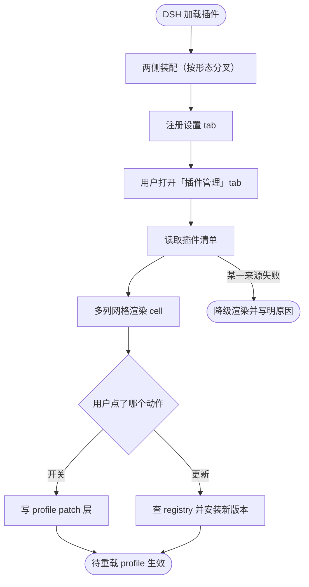

# dsh-plugin-manager 插件管理面板流程

本文档描述 `dsh-plugin-manager` 已实现的流程：DSH 加载插件后，浏览器侧在设置界面的「插件」页注册出一个新 tab，宿主侧装配插件清单并承接开关与更新两个动作。文档覆盖流程的主干、分叉点、失败出口，以及每个环节的输入输出。

本工程的源码在 [dsh-plugin-manager/](dsh-plugin-manager/)（自带 `.git` 与远端），下文所有路径与命令都以该目录为工程根。部署与使用方式见同目录 [deploy.md](deploy.md)。

## 主流程



## START

DSH 在自己的进程与页面里加载本插件，把运行所需的服务交付给它。加载通道由**落地形态**决定，不由业务模块决定。

**输入**

- `PLUGIN_ROOT`：工程根路径；来源为工程部署位置。
- `INJECTED_SERVICES`：宿主注入的服务集合。宿主侧需要 `fs`（文件读写）与 `shell`（命令执行）；客户端需要 `slots`（插槽注册）。文件系统与命令执行的具体来源在两种形态下不同，见 [MOUNT](#mount)。

**输出**

- `MOUNT_REQUEST`：装配请求，含形态与注入服务；去向为 `MOUNT`。

## MOUNT

两侧各自的唯一装配入口：把端口实现与业务对象拼起来，并把运行期资源登记为可释放的副作用。本节点是**唯一按形态分叉**的节点——两种形态的差别到此为止，向下的 tab 注册、清单装配、动作语义完全相同。

宿主侧装配链：`src/host/adapters/index.ts` 的 `createPorts()` 产出端口实现（形态相关）→ `src/host/index.ts` 的 `apply()` 构造 `PluginManager` → `src/host/adapters/registrar.ts` 把三个操作挂到该形态的传输上（形态相关）。

客户端装配链：`src/client/adapters/index.ts` 的 `createPorts()` 产出与宿主对话的桥（形态相关）→ `src/client/index.ts` 的 `apply()` 注册 tab（形态无关）。

| 形态 | 宿主端口来源 | 宿主传输 | 客户端传输 |
| --- | --- | --- | --- |
| **cordis** | `ctx.get('fs')`、`ctx.get('shell')` | `harness.handle` 注册 Package 私有方法 | `host.call` |
| **bundle** | `node:fs/promises`、`node:child_process` | profile `webServer` 上的三条 HTTP 路由 | 同源 `fetch` POST |

**输入**

- `MOUNT_REQUEST`：装配请求；来源为 `START`。

**输出**

- `PORTS_READY`：端口与传输就位状态；去向为 `TAB`。
- `HOST_OPERATIONS`：三个宿主操作（`list`／`toggle`／`update`）；去向为 [READ](#read)、[TOGGLE](#toggle)、[UPDATE](#update)。

**失败模式**

- 端口构造失败（如 cordis 形态下 `fs` 服务缺失）：记录一行错误并停止装配，**不抛异常**——抛出去只会让用户看到一个空白面板且没有原因。
- 传输注册失败（如 bundle 形态下 `webServer` 缺失，或同一 profile 里已有另一实例占了路由）：只关掉这一项能力并记录原因，其余操作继续工作。

## TAB

客户端半把面板注册进 `settings.plugins.tab` 插槽。该插槽是 `list` 型，注册项带 `id`／`order`／`label` 三个字段。

**用自有的 id**：注册一个原插槽未占用的 id（本工程用 `manager`）会在既有 tab 旁**新增**一个；复用既有 id 则会替换那个 tab。本工程因此不需要与「插件」页的属主协作。

`label` 传的是 thunk 而非字符串，使 tab 文字跟随当前语言而无需重新注册。整个注册属于本插件的 fiber，插件停止即撤下。

**输入**

- `PORTS_READY`：端口就位状态；来源为 `MOUNT`。

**输出**

- `TAB_REGISTERED`：tab 贡献就位；去向为 `OPEN`。

## OPEN

用户点击侧栏「设置」，再选中「插件」页的**插件管理** tab。tab 面板此时才挂载，`list` 调用随之发出——激活期不读任何数据，因此插件加载不会因为 registry 慢或文件系统不可用而变慢。

**输入**

- `TAB_REGISTERED`：tab 贡献就位；来源为 `TAB`。

**输出**

- `READ_REQUEST`：读取请求；去向为 `READ`。

## READ

宿主侧装配一份 `ManagerSnapshot`，是三个来源的合并：

1. **组合树的行**——哪些插件行存在、是否启用。按 profile 的层序读：`package.json` 的 `dsh.profile.bundles` 逐个取该 bundle 的 patch 文件、解析其中的 `insert:` 行，最后叠上 profile 自己的 `cordis.patch.yml`。**不能只读 profile 自己的 `cordis.yml`**——那一份在真实部署里是空列表，组合实际来自各 bundle 层，只读它会得到一份恒为空的清单。bundle 的包根在 profile 自有的 `node_modules` 与 profiles 同级共享的 `node_modules` 两处依序找。
2. **每个模块的已安装版本**——按包名到 `node_modules/<包名>/package.json` 取 `version` 字段。同样两处依序找：profile 自有的树，再是 profiles 同级共享的树；只查前者会让一个用 hoisted linker 建出的 profile 报出「全部版本未知」。
3. **profile patch 层的目标化开关**——本插件自己写下的覆盖，叠在 Loader 的启用状态之上。

三处来源都要先知道**这个部署在哪**（[deployment](dsh-plugin-manager/src/host/deployment.ts)）。`DSH_HOME` 通常能从环境读到，**profile 名读不到**——启动好的 `dsh web` 在内部选定 profile，不把它发布到插件运行的环境里；于是它由文件系统发现：DSH home 持有 `profiles/` 目录，其下每个带 `package.json` 的条目即一个 profile。多个 profile 并存时取 manifest 最近修改的那个，面板会把它落定的路径显示出来，因此这个选择是可见的而非静默的。

发现**不接受猜测**：写错根会让本插件的写入落到另一个部署上，而发现失败产出一个显式的「无 profile」状态由面板如实报出。

三处各自独立读取，任一处失败**降级为一条原因**而不是让清单变空：「Loader 读不到」与「没有插件」绝不能渲染成同一个样子。

版本的合并按包名进行、且**有意做成有损的**：模块名解析不出包名、或该包在部署里取不到版本时，该 cell 仍然出现，只是 `version` 为 `null`——隐藏它等于误报这份组合。

**输入**

- `HOST_OPERATIONS`：`list` 操作；来源为 `MOUNT`。
- `READ_REQUEST`：读取请求；来源为 `OPEN`。

**输出**

- `SNAPSHOT`：cell 列表 + patch 路径 + registry 地址 + 部分失败原因；去向为 `RENDER`。

## RENDER

面板把快照渲染成网格。网格用 `grid-template-columns: repeat(auto-fill, minmax(260px, 1fr))`，**列数跟随面板自身宽度**：设置面板宽时一行多个 cell，窄时收敛为单列，没有需要维护的断点。

每个 cell 两行：

- **第一行**：插件名（模块名的末段，去掉 `@deepseek-ai/` 作用域）+ 版本号 + 状态标签。有更新版本时版本号旁另有标记。
- **第二行**：**开关**按钮与**更新**按钮。

不可操作的行不给按钮，改在该位置写明原因（属于 agent preset 组合、没有可目标化的入口 id、patch 层读不出、或本插件自己那一行）。

**输入**

- `SNAPSHOT`：清单快照；来源为 `READ`。

**输出**

- `CELLS_RENDERED`：可见 cell 集合；去向为 `ACTION`。

## ACTION

用户点下按钮。两个动作的分叉点。

**输入**

- `CELLS_RENDERED`：可见 cell 集合；来源为 `RENDER`。

**输出**

- `TOGGLE_REQUEST`：开关请求（cell id + 目标启用状态）；去向为 `TOGGLE`。
- `UPDATE_REQUEST`：更新请求（cell id）；去向为 `UPDATE`。

## TOGGLE

把一行的启停写进 profile 的 patch 层。

**写的是哪一层**：profile 的组合树由三层叠成——`package.json` 里列的 bundles、`cordis.patch.yml`、以及命令行 `--patch` 覆盖。本插件**只写中间那层**，因为它是用户自有的一层，也是升级不会重写的一层；写进生成的 `cordis.yml` 会被升级抹掉，还可能损坏组合树。

**写成什么形状**：patch 层是 loader patch 条目的数组，启停表达为对目标条目的一条顶层 `disabled`：

```yaml
- id: some-entry
  disabled: true
```

目标条目**只带 `id` 与 `disabled` 两个字段**——它只覆盖所命名那一行的这两个字段。写成完整行会重新声明该行的 config 并把它冻结在上游变更之外，因此本插件只产出这两个字段。

**启用与停用不对称**：`enabled: false` 追加或改写那条覆盖；`enabled: true` 则**删掉**该条目，把决定权还给下面各层，而不是钉一个字面的 `false`。删除后若该层已无有效内容，占位符 `[]` 被还原，保证文件仍是一个可加载的列表。

**改动前的三道防线**：

1. 计算出的新文本与磁盘现状**完全一致时不写盘**，空操作绝不重写文件。
2. 首次修改前在同目录留下 `<patch>.before-plugin-manager` 备份；第二次写入不再覆盖它。
3. **本插件自己那一行拒绝被开关**——否则会卸载正在显示本面板的 tab；返回的错误直接说明原因。

写入是原子的（`fs` 服务的 `writeText` 契约），所以不存在写一半的文件。

**生效时机**：Loader 不会在没有重载的情况下重读 patch 层。返回的快照因此通过叠加 patch 层的覆盖来反映这次写入，而 cell 的 `fiberPhase` 仍报告**尚未重载**的实时状态——两个字段的差别正是「用户要什么」与「现在是什么」。

**输入**

- `TOGGLE_REQUEST`：开关请求；来源为 `ACTION`。
- `HOST_OPERATIONS`：`toggle` 操作；来源为 `MOUNT`。

**输出**

- `TOGGLE_RESULT`：结果 + 写入后的新快照；去向为 `RELOAD`。

**失败模式**：patch 层读不出（返回原因，不动文件）；patch 路径解析不出（profile 名不可得）；行不可目标化；行是本插件自己。

## UPDATE

把一行的包升到 registry 上发布的最新版本。

**更新由两半构成，且两半各自独立失败**：一是发现存在更新的版本，二是把它装上。本工程让前者只读——从 registry 读 `dist-tags.latest`，**不下载任何 tarball**；后者交给 DSH 自己的 `dsh plugin ... add` 命令，由唯一知道 profile 是什么的那个组件执行。这样切分的理由是：registry 一侧失败永远不可能留下一个只更新了一半的 profile。

**先比对再动手**：只有当 registry 报出的版本严格新于已安装版本时才执行安装。版本比较对语义化版本的数字段逐一比较，且**预发布版本排在它的正式版之前**（`1.0.0-rc.1` < `1.0.0`）；解析不出数字的输入一律按相等处理，因此一个读不懂的版本号永远不会被报成「有新版」。

**命令注入的防线**：包名在拼进 shell 命令前必须匹配一个保守的白名单（`@scope/name` 或 `name` 形状）。包名来自模块名，模块名来自组合文件，因此这条校验挡的是被污染的组合而非用户输入。

**生效时机**：安装完成后需要重载 profile 才会载入新版本。返回的 detail 明确写出这一点，而不是让调用方以为改动已经生效。

**输入**

- `UPDATE_REQUEST`：更新请求；来源为 `ACTION`。
- `HOST_OPERATIONS`：`update` 操作；来源为 `MOUNT`。

**输出**

- `UPDATE_RESULT`：结果 + 安装后的新快照；去向为 `RELOAD`。

**失败模式**：该行取不到已安装版本（没有可更新的包）；该行是本插件自己；没有可用的 profile 名；registry 查询失败（超时、DNS、非零退出、响应里没有 `latest`）；包名形状不合法；安装命令非零退出。

## RELOAD

两个动作的共同出口，也是本流程的结束节点：改动已落到磁盘，**等待 profile 重载才生效**。

这条边是显式的，因为面板能在不重载的情况下如实显示两件不同的事——「用户把这一行设成了什么」（来自 patch 层的覆盖）与「这一行现在跑成什么样」（来自 Loader 的 fiber 状态）。把二者分开显示，比让面板假装改动已经生效更诚实。

**输入**

- `TOGGLE_RESULT`：开关结果；来源为 `TOGGLE`。
- `UPDATE_RESULT`：更新结果；来源为 `UPDATE`。

**输出**

无。

## DEGRADE

`READ` 的失败出口：某个来源读不出时，清单仍然渲染，并在面板顶部写明是哪一处失败了、为什么。

**输入**

- `SNAPSHOT`：带 `partialFailure` 的快照；来源为 `READ`。

**输出**

无。

## 验证

四层各自的命令与判据。工程根为 [dsh-plugin-manager/](dsh-plugin-manager/)。

| 层 | 命令 | 判据 |
| --- | --- | --- |
| 单测 | `npm test` | 全绿且退出码 0；用例树镜像 `src/`，另有 `tests/global/` 承载横切断言 |
| 产物校验 | `npm run build:cordis && npm run make-loader && npm run verify` | 末尾出现 `ALL CHECKS PASSED` 且退出码 0 |
| cordis E2E | `npm run test:e2e` | `E2E PASSED` 且退出码 0；打真实常驻 GUI |
| bundle-mount E2E | `npm run test:mount` | `e2e-mount: N \| passed: N \| failed: 0` 且退出码 0；scratch profile + 独立 `dsh web` |

两条 E2E 都以 `tests/e2e/check-freshness.cjs` 为前置：它重建一次 `src/`（构建幂等）并比对产物哈希，把「改完 src 忘了重建」从静默假绿变成明确警告。`tests/e2e/runner.cjs` 与 mount 轨的 orchestrator 各自带**零用例即失败**与**用例未调用任何 assert 即失败**两道守卫——一次什么都没跑的运行不得被读成"跑过且通过"。

### 各层证明什么

- **单测**证明模块逻辑：patch 层的读写往返、组合树的层序解析、版本比较与包名形状、面板过滤与响应折叠、tab 注册契约。
- **产物校验**证明 loader 壳子与 body 同步：长度、sha-256、语法、参数表、长度守卫、磁盘惰性模式。
- **cordis E2E**证明真实浏览器里的集成：设置页出现**插件管理** tab、网格真的被浏览器解成多列（`getComputedStyle` 的 track 数）、搜索框真的收窄了渲染出的 cell、点开关真的发出调用并回显结果。这层的每条断言都只有真实页面才提供——框架桩同样能验的断言属错层。
- **bundle-mount E2E**证明包真的能装能用：`dsh plugin add file:<工程>` 把 `dist/bundle` 装进 scratch profile，独立 `dsh web` 起来后三条路由在部署自己的 `webServer` 上作答，开关真的改写了 scratch profile 的 patch 文件、留了备份、并可撤销。这是唯一允许写 profile 的一层，因为那个 profile 属于它自己建的临时目录。

### 形态差异：两处只有 E2E 会暴露的事实

1. **传输不同**。bundle 形态把三条操作注册成 `webServer` 上的一条**前缀路由**并由尾段分派（`{ kind, path, handler }`，Node 原生 `IncomingMessage`，body 要从流里读）；cordis 形态经 `harness.handle` / `host.call` 走 Package 私有通道。宿主半因此**必须声明 `inject: ['webServer']`**：不声明时该行会在 server 就位前激活，注册静默失败，而客户端只看得到一个来自它从未占用过的路径的 405。这个缺陷只有真正挂载并请求才会显形——单测里 `webServer` 是个桩，永远"可用"。
2. **client 半的归属是页面而非部署**。动态 Package 的 client 半属于**激活它的那个页面运行时**：新开一个页面、或 reload 之后，本插件的 tab 都不存在。cordis E2E 因此每个用例先在自己的页面里激活插件（打开 Cordis 面板、按卡片状态"Client ready to activate"选中本项目的那张卡、点无障碍名为 Run 的图标按钮），再由真实 UI 的 tab 列表确认注册已落地——而不是等一个 stylesheet 就当作激活成功（那正是让同一套用例时绿时红的竞态）。


## 留痕：关键取舍

```
【事实】需求是「设置界面里一屏看到所有插件及其版本、启停与更新」。
脱离现有实现，它要满足的是三件独立的事：把存在哪些插件说出来、把每
个插件的版本说出来、把两个动作做成可执行的写操作。
最小事实：DSH 现有的 plugin inventory 快照里没有版本字段，也没有任何
查询版本或升级插件的 API；启停的真实权威是 profile 的组合树。

【反题】最强反对意见：让一个插件去改写自己宿主进程的组合树，是一条
会把自己弄坏的路径——写坏 patch 层会让 profile 起不来，而用户未必知
道该改回什么；「更新」还需要网络，网络与版本比较的失败面会让这件事在
离线或 registry 不可达时变成一堆假报错。证伪条件：若一次开关写入损坏
了 cordis.patch.yml，或一次更新留下无法启动的 profile，则本设计失败。

【裁决】选定：开关只写用户自有的 patch 层、只产出 {id, disabled} 两个
字段、与现状一致时不写盘、首次修改前留备份、拒绝操作自己那一行；更新
把「发现新版本」与「安装」切成两半，前者只读 registry、后者交给 DSH
自己的 plugin 命令。长期视角下更优，因为所有不可逆后果都被推给了既有
的、有自己语义的组件，本插件在任何一步失败时都只留下可读的原因和可手
工回滚的文件。已知代价：版本必须逐个包去查，插件多时首次读取偏慢；已
有偿还路径——`list` 只在用户打开 tab 时调用一次，且三处来源的失败各自
降级，不影响其余 cell 渲染。
```
