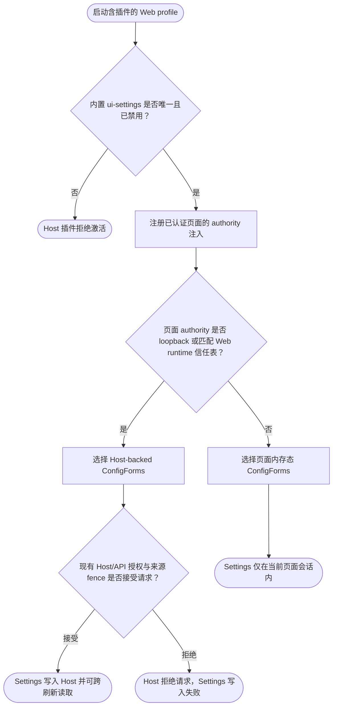

# 可信 Web authority 的 Settings provider 流程

本流程覆盖 DSH Web profile 装载替代 Settings provider 后的完整运行路径：先校验内置 provider 已被替换，再把 Host 已信任的 authority 送入已认证页面，最后按页面 authority 选择 Host 持久化或页面内存态，并由现有 Host 请求边界决定写入结果。

## 主流程

## START

本节点确认目标是已安装插件的 DSH Web profile；插件依赖 Web profile 提供的 `webRuntime` 与 `webServer` 服务，非 Web profile 不在支持范围内。

**输入**

- `WEB_PROFILE_STATE`：profile 与插件 bundle membership 已就绪；来源为部署配置。

**输出**

- `PLUGIN_LOAD`：Host 插件开始装载；去向为 `GUARD`。

## GUARD

Host 入口遍历 Loader entries，要求官方 Settings provider 恰好出现一次且其有效 `disabled` 状态为真；不满足时抛错，避免官方与替代 provider 同时提供 `configForms`。

该判据与 profile 组合的单一事实源分别是仓库的 [bundle patch](dsh-settings-trusted-authority/cordis.patch.yml) 和 [Host 入口](dsh-settings-trusted-authority/index.js)。

**输入**

- `PLUGIN_LOAD`：Host 插件装载请求；来源为 `START`。

**输出**

- `REPLACEMENT_READY`：替换条件成立；去向为 `INDEX`。
- `GUARD_FAILURE`：官方 provider 缺失、重复或仍启用；去向为 `GUARD_FAIL`。

## GUARD_FAIL

替换条件不成立时，Host plugin fiber 失败而不注册 index 注入；处置应修正 profile bundle layer，不应同时启用两个 Settings provider。

**输入**

- `GUARD_FAILURE`：替换检查失败；来源为 `GUARD`。

**输出**

- 无。

## INDEX

Host 插件从 Web runtime 提供的 `trustedHosts` 读取权威列表，并订阅 WebServer 的 `webserver/index-inject` 事件；它不维护第二份 authority 列表，也不新增 Settings API。

该注入随 WebServer 渲染 index 响应发生；index 授权仍由 DSH 的既有静态页面授权路径先行执行。注入内容仅影响 Settings 客户端的持久化选择，不授予 `/api` 访问权。

**输入**

- `REPLACEMENT_READY`：替换检查通过；来源为 `GUARD`。
- `WEB_RUNTIME_TRUST`：Web runtime 信任列表；来源为已启用的 Web profile。

**输出**

- `PAGE_AUTHORITY_LIST`：浏览器可读的 Host 信任列表；去向为 `MODE`。

## MODE

替代 client bundle 按其 [Settings provider 实现](dsh-settings-trusted-authority/client.js) 判断页面 authority；非 loopback 页面只有与 Host 注入列表匹配时才选择 Host 持久化，未匹配时保持原有页面内存态行为。

**输入**

- `PAGE_AUTHORITY_LIST`：Host 信任列表；来源为 `INDEX`。
- `PAGE_AUTHORITY`：当前浏览器页面 authority；来源为浏览器 URL。

**输出**

- `HOST_MODE`：Host 持久化模式；去向为 `HOST`。
- `MEMORY_MODE`：页面内存模式；去向为 `MEMORY`。

## HOST

Host 模式通过现有 `remote.settings` 与 ConfigForms mirror 读写 Settings；该模式扩大的是 Settings 的持久化选择，不改变 Connection 的 loopback 分类。

**输入**

- `HOST_MODE`：持久化模式为 Host；来源为 `MODE`。

**输出**

- `HOST_SETTINGS_REQUEST`：Settings 读写请求；去向为 `FENCE`。

## MEMORY

页面 authority 未匹配信任列表时，ConfigForms 继续使用页面内存态；此时 Settings 只在当前页面运行期间可用，刷新或重开页面后不保证保留。

**输入**

- `MEMORY_MODE`：持久化模式为页面内存；来源为 `MODE`。

**输出**

- `SESSION_SETTINGS`：页面本地 Settings 状态；去向为 `VOLATILE`。

## FENCE

Host 模式发起的请求仍由原有 Host/Origin fence 与浏览器会话认证判定；插件不能绕过或覆盖这些检查。

**输入**

- `HOST_SETTINGS_REQUEST`：Host Settings 请求；来源为 `HOST`。

**输出**

- `AUTHORIZED_WRITE`：请求通过现有授权；去向为 `SAVED`。
- `REJECTED_WRITE`：请求被拒绝；去向为 `REJECTED`。

## SAVED

Host 接受写入后，Settings 状态由 Host 保存并可在刷新后重新读取；Models 页的 provider 配置读写是该行为的浏览器验收面。

**输入**

- `AUTHORIZED_WRITE`：已授权的 Settings 写入；来源为 `FENCE`。

**输出**

- 无。

## REJECTED

Host fence 或浏览器会话认证拒绝请求时，Settings 操作失败；排查时应先核对标准 Web profile 的信任配置与自定义 Connection patch 是否一致，不得通过放宽 Host fence 补救。

**输入**

- `REJECTED_WRITE`：被 Host 拒绝的 Settings 请求；来源为 `FENCE`。

**输出**

- 无。

## VOLATILE

页面内存态结束于当前浏览器页面会话；刷新后状态不保留，这是非可信 authority 的安全边界，不是替代 provider 缺失的功能。

**输入**

- `SESSION_SETTINGS`：页面本地 Settings 状态；来源为 `MEMORY`。

**输出**

- 无。

## 未验证面

当前活体验收覆盖隔离 Web profile 中的 Models provider 新增、保存与刷新读取；其他 Settings schema、模型 provider 变体、第三方对原 module id 的运行时依赖及 DSH 后续版本仍未覆盖，须按[部署与使用说明](deploy.md)验收。