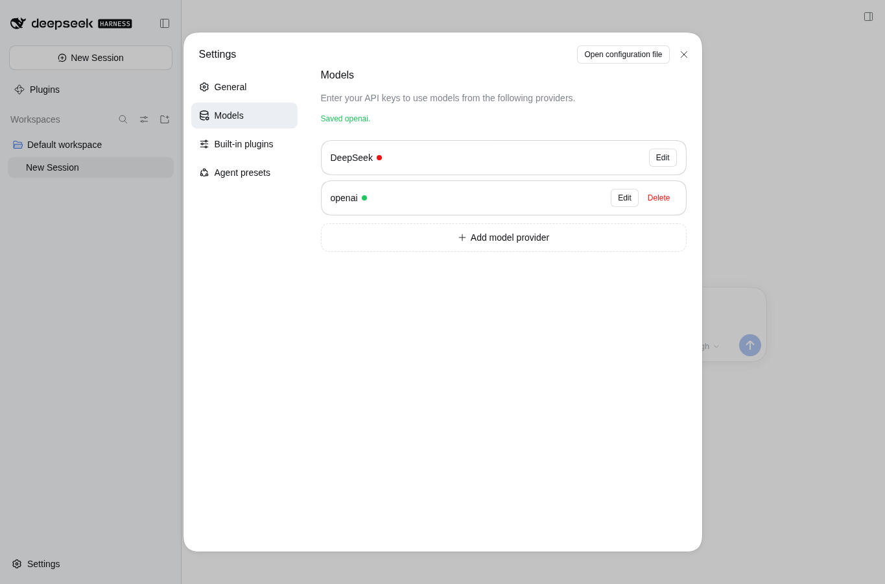
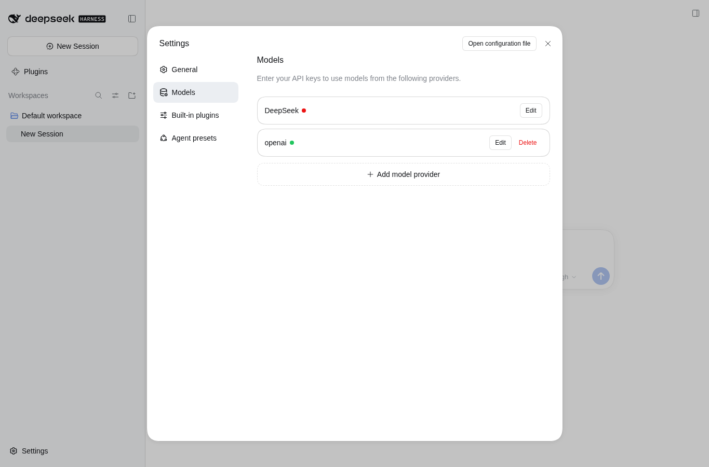

# 临时 Session PR 报告：Settings trusted-authority 试点

**结论状态：** 浏览器预览、项目静态测试、打包和文档归档通过；独立验收已通过；当前知识库全量 lint 因一份未纳入本次补丁的新增 Home Media Pilot 需求文档有 2 项失败，已披露且未改动该文件；明确等待需求方批准。当前没有提交、合并、持久 profile 部署或远端 push。

## 范围与审阅绑定

本报告是 session 内临时审阅关卡，不是 GitHub PR 或 GitHub CI。项目改动位于本地分支 `pilot/session-review-preview`，基线 `d4885c89c3d150c04d8109ea5f814b1daf6ff23d`，上游为 `origin/main`；分支与本地 `main` 仍停在基线，未产生提交。知识库文档补丁以外层 `main` 基线 `3b2ec384c449b38a5010cfa9de9900db3737513e` 为参照；两仓库分别审阅。

完整项目补丁：[`project.diff`](project.diff)，SHA-256：`d2e37e8b17ca9acf47a815a036972328b24098a951619139427baa95611aff05`。补丁仅含 `package.json`、`package-lock.json`、`scripts/session-preview.mjs`、`tests/workflow.test.js` 与项目 `tests/README.md`。

预览实际生成的插件 tarball：[`dsh-settings-trusted-authority-plugin-0.1.0.tgz`](dsh-settings-trusted-authority-plugin-0.1.0.tgz)，SHA-256：`ba31d6d75caed03fd25214a78b0ea7fe48e3a102a931a3fa36538f1a8712b052`。`npm pack --dry-run` 的清单符合 `package.json` 的 `files`；预览 runner 和测试文件不进入分发包。

另有知识库文档与本需求流程状态的定向补丁：[`knowledge-base.diff`](knowledge-base.diff)，SHA-256：`9b5edd4eaf687c7c64bb17fc638ae2c5da281a5491478ded73cd150277bc25bb`；外层知识库工作树包含其他既有改动，本补丁不含它们。

## 改动摘要

- 增加可复用的临时预览入口：要求显式绝对 `DSH_CLI`，在执行前检查 artifact 路径与受保护 `DSH_HOME`、项目仓库的重叠，并拒绝复用已存在的 artifact 目录。
- runner 使用随包提供的 `web` 模板创建临时 DSH home，清除 DSH 子进程继承的 profile 选择变量，在 loopback 临时端口启动真实 DSH Web，并安装由当前工作树生成的 tarball。
- Playwright/Chromium 浏览器固定 `en-US` 与 `1365×900` 视口；UI 自动化仅选 OpenAI provider 的 API-key 编辑区，保存后刷新并验证 provider 仍可读。
- runner 将截图、录屏、tarball 留在独立 artifact 目录；成功结束时关闭服务器与浏览器并删除临时 DSH home。
- 增加 runner 的路径守卫与 CLI 契约用例；更新项目测试和部署说明，区分临时预览与持久 profile 手动部署。

没有改动插件运行时代码 `index.js`、`client.js`、`cordis.patch.yml`，也没有改动产品 `feature-flow.md`。

## 可复算验证

| 检查 | 结果 |
| --- | --- |
| `node --check scripts/session-preview.mjs` | 通过 |
| `env -u DSH_HOME npm test` | 全绿，10/10 |
| `npm pack --dry-run` | 通过，分发清单符合 `package.json` |
| `git diff --check` | 通过 |
| 当前全量知识库 lint | FAIL：45 passed、2 failed、exit 1；失败均命中未纳入本补丁的 Home Media Pilot inbox 文档；之前一轮为 47/47，但不作为当前全量状态 |
| 隔离真实浏览器预览 | `PREVIEW_RESULT=PASS (Models provider saved and remained after refresh)` |

预览使用 `/usr/local/bin/dsh`（`dsh --version` 为 `0.2.0-rc.2`），profile `session-preview-21687-1791352171729`，origin `http://127.0.0.1:38379/`；runner 报告 `PROFILE_CLEANUP=removed`。输出目录为 `/tmp/dsh-pilot-report-20261007-auto-0155-pass/`，其中包含本报告、补丁、包、两张截图、录屏与验证日志。

项目命令原始输出与各自退出码见 [`project-verification.log`](project-verification.log)。此前完整知识库 lint 的成功 session 输出副本见 [`previous-kb-lint-session-output.txt`](previous-kb-lint-session-output.txt)；当前全量 lint 与定向文档检查输出见 [`knowledge-base-verification-final.log`](knowledge-base-verification-final.log)，其中两个全量失败均命中未纳入本补丁的新 Home Media Pilot inbox 文档，故当前全量结果不报告为通过。另有 [`verification.log`](verification.log) 保留一次在错误工作目录调用 lint 的记录及其 exit 4，已标注为 superseded。预览命令及 runner 输出的 session 转录见 [`preview-session-output.txt`](preview-session-output.txt)；runner 未自行持久化 stdout，因此该文本明确标注为从 session 工具结果复制，而不是 runner 原始日志文件。

## 验收锚点

| 锚点 | 状态 | 证据 |
| --- | --- | --- |
| A1 静态测试与包校验，绑定基线、diff 和包哈希 | PASS | 上表命令结果及两个补丁/包哈希 |
| A2 当前工作树包安装至隔离 Web profile | PASS | profile/origin、清理状态、真实 DSH CLI 版本与 `project.diff` |
| A3 真实浏览器保存/刷新读回、合成无效 key | PASS | 两张截图、录屏；不声称 key/模型可用 |
| A4 session 临时报告与 diff/文件行引用 | PASS_WITH_LIMITATION | 本报告、两个补丁和下方行引用；Workbench diff UI 未显示 |
| A5 批准后本地提交、fast-forward、隔离部署冒烟 | WAITING_FOR_USER | 尚未执行，明确等待报告批准 |
| A6 失败保留并回开发修复 | PASS | 失败回合记录与独立 artifact 目录 |
| A7 项目测试/部署说明落档 | PASS_WITH_DISCLOSED_EXTERNAL_LINT_FAILURE | 文档已更新；之前 47/47 通过，当前全量 lint 的 2 个失败均在未纳入本补丁的 Home Media Pilot inbox 文档，保留不改 |

## 文件行引用

- 包命令和分发范围：[package.json](/mnt/deepseek-harness/knowledge-base/assets/projects/dsh-settings-trusted-authority/dsh-settings-trusted-authority/package.json#L12-L25)；锁定 Playwright 依赖：[package-lock.json](/mnt/deepseek-harness/knowledge-base/assets/projects/dsh-settings-trusted-authority/dsh-settings-trusted-authority/package-lock.json)。
- 隔离路径守卫、DSH child 环境和预览启动：[session-preview.mjs](/mnt/deepseek-harness/knowledge-base/assets/projects/dsh-settings-trusted-authority/dsh-settings-trusted-authority/scripts/session-preview.mjs#L367-L437)。
- 首次提示处理与 idempotent Settings 导航：[session-preview.mjs](/mnt/deepseek-harness/knowledge-base/assets/projects/dsh-settings-trusted-authority/dsh-settings-trusted-authority/scripts/session-preview.mjs#L155-L260)。
- OpenAI 编辑器范围、保存与刷新读回：[session-preview.mjs](/mnt/deepseek-harness/knowledge-base/assets/projects/dsh-settings-trusted-authority/dsh-settings-trusted-authority/scripts/session-preview.mjs#L262-L293)。
- 视频路径核验与隔离 artifact 最终化：[session-preview.mjs](/mnt/deepseek-harness/knowledge-base/assets/projects/dsh-settings-trusted-authority/dsh-settings-trusted-authority/scripts/session-preview.mjs#L307-L338)。
- runner 守卫契约测试：[workflow.test.js](/mnt/deepseek-harness/knowledge-base/assets/projects/dsh-settings-trusted-authority/dsh-settings-trusted-authority/tests/workflow.test.js#L51-L118)。
- 自动化与手动测试边界：[tests/README.md](/mnt/deepseek-harness/knowledge-base/assets/projects/dsh-settings-trusted-authority/dsh-settings-trusted-authority/tests/README.md#L13-L43)。
- 自动化预览、持久 profile 部署和回滚说明：[deploy.md](/mnt/deepseek-harness/knowledge-base/assets/projects/dsh-settings-trusted-authority/deploy.md#L24-L88)。
- 项目需求锚点及当前流程状态：[req.dsh-settings-trusted-authority.automated-flow-pilot.20261006-224748.md](/mnt/deepseek-harness/knowledge-base/assets/inbox/req.dsh-settings-trusted-authority.automated-flow-pilot.20261006-224748.md#L32-L80)。

## 浏览器证据

保存后截图 [`models-saved.png`](models-saved.png) 显示 `Saved openai.` 与 OpenAI provider 已配置；刷新后截图 [`models-after-refresh.png`](models-after-refresh.png) 显示同一 provider 仍存在。录屏为 [`session-preview.webm`](session-preview.webm)，已验证为 WebM 文件。

## 限制与未验证面

- OpenAI 字段只填入无效合成 key；这证明临时 profile 中的本地 Settings 持久化，不证明 key 有效、模型可连通或 provider API 可用。runner 不提交聊天消息或触发模型调用。
- 官方 DeepSeek onboarding 选择 `Configure later`，因此没有输入 DeepSeek key；截图中 DeepSeek 仍显示未配置。
- 自动化不采集或断言浏览器控制台错误；持久 profile 部署仍按部署说明手动检查控制台。
- 兼容性证据只覆盖当前已测 DSH CLI `0.2.0-rc.2` 与本次 Web 模板，不外推到其他 DSH 版本或未测试的 Settings schema/provider 变体。
- 没有在 Workbench diff UI 中展示本地嵌套仓库差异；此处以完整补丁及文件路径引用供审阅。
- 本地临时 profile 与服务器已清理；artifact 目录特意保留供审阅。未访问或修改活跃 profile，未 push 远端。

## 失败回合与纠正

失败回合的独立 artifact 目录保留在 `/tmp`。实际观察到的阻断依次包括 DSH CLI 选择不明确、首次预览/官方 onboarding 对话框、DeepSeek 与 OpenAI 编辑器字段匹配歧义、刷新后 Settings 对话框的 toggle 状态，以及视频在浏览器关闭后的保存时序；每次均回开发修正后使用新目录重跑。代表性目录为 `auto-0130-pass`、`auto-0135-pass` 与 `auto-0140-pass`；`auto-0140-pass` 已完成保存与刷新验证，仅视频最终化失败。最终 `auto-0155-pass` 通过并保留截图/录屏。失败分支没有被当作通过证据。

## 事实、反题与裁决

**【事实】** 需求是把一个可复算的测试/包/真实浏览器预览与临时报告接入 session，并在用户明确批准前禁止本地合并和部署。真实 Chromium 已证明当前工作树生成的包可在临时 Web profile 的 Models 页面保存并在刷新后读回；项目静态测试与包检查通过。此前一轮知识库 lint 为 47/47，但当前全量 lint 因未纳入本补丁的新 Home Media Pilot inbox 文档而有 2 项失败，见验证表与日志。

**【反题】** 最强反对意见是 session 报告不会天然等同于托管平台的持久审计记录，且若审批对象没有绑定到精确 diff 与 tarball，报告可能在审批后过期，导致审阅了一个版本却合并另一个版本。可证伪条件是提交前的工作树补丁/包与本报告哈希不一致，或报告缺少任一改动文件/运行证据；届时必须停止合并并重建报告。弃用代价是移除本地 runner、测试和项目操作说明，并用另一种报告/审批机制替代；不会触及插件运行时代码，runner 的隔离和浏览器验证部分仍可复用。

**【裁决】** 以此试点支持“session 报告 + 精确 diff/package 绑定 + 明确人工批准 + 批准后本地继续”的通用流程关卡，而不把它命名或实现为 GitHub PR/CI。长期优势是审批前能复核真实浏览器行为且不会提前改变主线或 profile；短期代价是维护运行器并要求调用者明确 `DSH_CLI`、`DSH_HOME` 与 artifact 路径。下一步只在独立验收通过并收到明确批准后，才执行本地提交、fast-forward 与隔离部署冒烟。

## 等待的授权

独立验收已通过。需求方对本报告明确批准后，session 才继续提交本地审阅分支、fast-forward 合入本地 `main`，并从合并版本重建包，在指定隔离 profile 中部署与冒烟；不推送远端，也不访问活跃 profile。