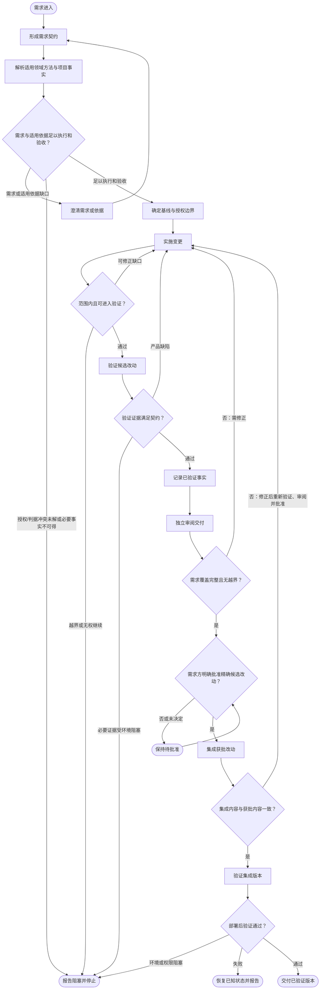

# 通用开发交付流程范式（可编辑草稿）

本范式描述从需求进入到获批改动完成集成、部署后验证的阶段级路径。主图只表达阶段、门禁和回退；各阶段只约定预期输入、输出及规则护栏，不规定命令、测试用例或项目实现方式。需求契约形成后，流程按产出物和决策点识别适用的领域方法与判据，再由通用阶段承接其结果。流程不依赖 GitHub PR/CI；集成前必须取得需求方对精确候选改动的明确批准。

## 主流程

## START

接收需求原文及其提出方提供的上下文；不替需求方推断未声明的目标或授权。

**输入**

- `REQUEST_MATERIAL`：需求原文及提出方提供的上下文；来源为需求方。

**输出**

- `REQUEST_MATERIAL`：需求材料；去向为 `DEFINE`。

## DEFINE

将需求整理为可执行、可核对的契约，明确预期结果、范围、约束、预期产出物及验收条件。此阶段确定要交付和判断什么，不自行决定具体领域方法。

**输入**

- `REQUEST_MATERIAL`：初始需求材料；来源为 `START`。
- `DATA_CLARIFIED`：更新后的需求材料与适用性裁决；来源为 `CLARIFY`。

**输出**

- `DATA_SPEC`：需求契约及预期产出物类型；去向为 `CONTEXT`。

## CONTEXT

依据需求契约中的产出物与决策点，识别适用的 skill、其权威判据和项目当前事实。本知识库已有的领域切分可作例：正文表述取[文档撰写 skill](../../../../.agents/skills/doc-writing/SKILL.md)，流程图与节点结构取[流程类文档撰写 skill](../../../../.agents/skills/process-doc-writing/SKILL.md)，单条规则卡片字段取[规则卡片撰写 skill](../../../../.agents/skills/rule-card-writing/SKILL.md)，规范册构成取[规范册撰写 skill](../../../../.agents/skills/spec-book-writing/SKILL.md)。这些 skill 按任务产出物划定职责，互相路由而非争夺同一职责；具体判据以各自指向的 reference 为准。一个需求同时涉及多种产出物时组合适用，不强行归入单一领域。

全局 agent 行为边界取自[AGENTS.md](../../../../AGENTS.md)及其指向的[Agent 行为约束](../../../../_meta/agent-constraints.md)；领域 skill 提供任务方法的路由与落笔工序，其 reference 提供对应判据；项目流程、部署说明或其他权威资料提供项目事实。项目材料只在适用范围内参与本次计划，不提升为通用规范。

**输入**

- `DATA_SPEC`：需求契约及预期产出物类型；来源为 `DEFINE`。

**输出**

- `DATA_CONTEXT`：适用 skill、权威判据与项目事实的取回依据，以及尚未解决的适用性缺口；去向为 `SPEC_GATE`。

## SPEC_GATE

判断需求契约与已识别的适用方法、判据及项目事实，是否足以确定变更范围并作出可复核的验收结论。缺口会改变实现或验收时，要求澄清；适用性不明、判据冲突或必要事实不可得时报告阻塞；不得把猜测当作要求或授权。

**输入**

- `DATA_SPEC`：需求契约；来源为 `DEFINE`。
- `DATA_CONTEXT`：适用方法、判据、项目事实及未决缺口；来源为 `CONTEXT`。

**输出**

- `DATA_SPEC_READY`：可执行契约及本次计划依据；去向为 `BASE`。
- `DATA_SPEC_GAPS`：需澄清的缺口；去向为 `CLARIFY`。
- `DATA_CONTEXT_BLOCK`：未解决的授权/判据冲突或必要事实不可得；去向为 `BLOCKED`。

## CLARIFY

由对应的授权方澄清影响目标、范围、约束、适用依据或验收的未决事项，并将裁决纳入需求材料；执行者不得自行消解权限或规范冲突。

**输入**

- `DATA_SPEC_GAPS`：需澄清的具体缺口；来源为 `SPEC_GATE`。

**输出**

- `DATA_CLARIFIED`：更新后的需求材料及适用性裁决；去向为 `DEFINE`，后续重新解析适用方法与判据。

## BASE

确定开始变更前的基线，以及获准修改的范围和交付边界。边界不足以安全覆盖必要工作时，先请求授权，不自行扩大范围。

**输入**

- `DATA_SPEC_READY`：通过门禁的需求契约；来源为 `SPEC_GATE`。
- `DATA_CONTEXT`：适用方法、判据和项目事实依据；来源为 `CONTEXT`。

**输出**

- `DATA_BASELINE`：可识别的变更基线；去向为 `DEVELOP`、`INTEGRATE` 与 `POST_VERIFY`。
- `DATA_SCOPE_RULES`：授权修改范围；去向为 `DEVELOP` 与 `DEV_GATE`。
- `DATA_DELIVERY_RULES`：适用交付边界及后续阶段所需的领域方法、判据与项目事实取回依据；去向为 `DEVELOP`、`VERIFY`、`REVIEW` 与 `POST_VERIFY`。

## DEVELOP

在授权边界内实施满足需求契约的变更，并保留可供后续核对的完整改动与说明。收到反馈后只在有效授权范围内修正。

**输入**

- `DATA_SPEC`：需求契约；来源为 `DEFINE`。
- `DATA_BASELINE`：变更基线；来源为 `BASE`。
- `DATA_SCOPE_RULES`：授权范围；来源为 `BASE`。
- `DATA_DELIVERY_RULES`：适用方法、判据和项目事实依据；来源为 `BASE`。
- `DATA_FEEDBACK`：返工时的具体修正反馈；来源为 `DEV_GATE`、`VERIFY_GATE`、`REVIEW_GATE` 或 `INTEGRATION_GATE`。

**输出**

- `DATA_DIFF`：完整候选改动；去向为 `DEV_GATE`、`VERIFY`、`RECORD` 与 `REVIEW`。
- `DATA_DEV_RESULT`：改动清单与开发说明；去向为 `DEV_GATE`。

## DEV_GATE

检查候选改动是否遵守授权范围，且交付信息足以进入验证。可在既有授权内修正的缺口反馈至实施；涉及扩权或无法继续的情况停止并报告。

**输入**

- `DATA_DIFF`：候选改动；来源为 `DEVELOP`。
- `DATA_DEV_RESULT`：改动清单与开发说明；来源为 `DEVELOP`。
- `DATA_SCOPE_RULES`：授权范围；来源为 `BASE`。

**输出**

- `DATA_DEV_PASS`：允许进入验证的结果；去向为 `VERIFY`。
- `DATA_FEEDBACK`：授权范围内可修正的缺口；去向为 `DEVELOP`。
- `DATA_SCOPE_CONFLICT`：越权或无法继续的阻塞；去向为 `BLOCKED`。

## VERIFY

依据需求契约取得适用的验证证据，并确认候选交付物及其已知限制。具体验证方法由项目和交付形态决定；必要证据未取得时不得宣称通过。

**输入**

- `DATA_DIFF`：候选改动；来源为 `DEVELOP`。
- `DATA_SPEC`：需求契约；来源为 `DEFINE`。
- `DATA_DELIVERY_RULES`：适用验证判据；来源为 `BASE`。
- `DATA_DEV_PASS`：开发阶段通过结果；来源为 `DEV_GATE`。

**输出**

- `DATA_VERIFY_EVIDENCE`：验证证据及未验证限制；去向为 `VERIFY_GATE`、`RECORD` 与 `REVIEW`。
- `DATA_VERIFY_FAILURE`：可定位的产品失败；去向为 `VERIFY_GATE`。
- `DATA_ENV_BLOCK`：验证环境阻塞；去向为 `VERIFY_GATE`。

## VERIFY_GATE

判断证据是否足以覆盖契约要求。产品缺陷回到实施修正；无法取得必要证据时停止并说明阻塞；不得通过跳过必要验证或降低验收条件取得通过。

**输入**

- `DATA_VERIFY_EVIDENCE`：验证证据及限制；来源为 `VERIFY`。
- `DATA_VERIFY_FAILURE`：产品失败信息；来源为 `VERIFY`。
- `DATA_ENV_BLOCK`：环境阻塞信息；来源为 `VERIFY`。
- `DATA_SPEC`：需求契约；来源为 `DEFINE`。

**输出**

- `DATA_VERIFY_PASS`：验证通过；去向为 `RECORD`。
- `DATA_FEEDBACK`：产品修正反馈；去向为 `DEVELOP`。
- `DATA_ENV_BLOCK`：未解决的环境阻塞；去向为 `BLOCKED`。

## RECORD

记录交付所需的已验证事实与仍未验证的限制。记录应与证据一致，不把推测、未执行的工作或未确认的行为写成事实。

**输入**

- `DATA_VERIFY_PASS`：验证通过；来源为 `VERIFY_GATE`。
- `DATA_VERIFY_EVIDENCE`：验证证据及限制；来源为 `VERIFY`。
- `DATA_DIFF`：候选改动；来源为 `DEVELOP`。

**输出**

- `DATA_RECORD_RESULT`：与本次交付相关的事实记录或无需新增记录的理由；去向为 `REVIEW`。

## REVIEW

由未参与候选改动实施的审阅者，独立核对需求覆盖、完整改动、验证证据及事实记录；审阅结论须能由所依据的材料复核。

**输入**

- `DATA_SPEC`：需求契约；来源为 `DEFINE`。
- `DATA_DELIVERY_RULES`：适用验收判据；来源为 `BASE`。
- `DATA_DIFF`：完整候选改动；来源为 `DEVELOP`。
- `DATA_VERIFY_EVIDENCE`：验证证据；来源为 `VERIFY`。
- `DATA_RECORD_RESULT`：事实记录；来源为 `RECORD`。

**输出**

- `DATA_REVIEW_MAP`：逐项核对结果及发现的问题；去向为 `REVIEW_GATE`。

## REVIEW_GATE

只有需求均有对应改动或证据、且不存在未经授权的需求外改动时才通过。否则将可修正问题退回实施；审阅者不以自行改写候选内容替代返工。

**输入**

- `DATA_REVIEW_MAP`：独立审阅结果；来源为 `REVIEW`。

**输出**

- `DATA_REVIEW_PASS`：通过审阅的候选交付；去向为 `APPROVAL`。
- `DATA_FEEDBACK`：具体修正反馈；去向为 `DEVELOP`。

## APPROVAL

向需求方呈现审阅结论、候选改动及其验证限制，要求其明确决定是否批准该精确候选。批准仅覆盖被呈现并可识别的候选，不隐含授权远端发布或其他未声明动作。

**输入**

- `DATA_REVIEW_PASS`：通过审阅的候选改动；来源为 `REVIEW_GATE`。
- `DATA_VERIFY_EVIDENCE`：验证证据与限制；来源为 `VERIFY`。
- `DATA_REVIEW_MAP`：审阅结论；来源为 `REVIEW`。
- `DATA_REQUESTER_DECISION`：需求方对候选的决定；来源为需求方或 `WAIT`。

**输出**

- `DATA_APPROVED`：对精确候选的明确批准；去向为 `INTEGRATE`。
- `DATA_WAITING`：尚待决定；去向为 `WAIT`。

## WAIT

在需求方尚未明确批准时保持候选内容不变，不集成、不部署，也不将沉默视为同意。

**输入**

- `DATA_WAITING`：尚未获明确批准的候选及审阅材料；来源为 `APPROVAL`。

**输出**

- `DATA_REQUESTER_DECISION`：需求方后续决定或继续等待；去向为 `APPROVAL`。

## INTEGRATE

仅集成需求方明确批准的候选改动。若候选在批准后发生变化，变化部分不得沿用原批准直接进入后续交付。

**输入**

- `DATA_APPROVED`：需求方对精确候选的明确批准；来源为 `APPROVAL`。
- `DATA_DIFF`：获批候选改动；来源为 `DEVELOP`。
- `DATA_BASELINE`：变更基线；来源为 `BASE`。

**输出**

- `DATA_COMMIT`：集成版本；去向为 `INTEGRATION_GATE` 与 `POST_VERIFY`。
- `DATA_INTEGRATED_CHANGE`：可核对的集成内容；去向为 `INTEGRATION_GATE`。

## INTEGRATION_GATE

核对集成内容是否仍与获批候选一致。若不一致，差异须重新验证、独立审阅并再次取得需求方明确批准后方可继续。

**输入**

- `DATA_COMMIT`：集成版本；来源为 `INTEGRATE`。
- `DATA_INTEGRATED_CHANGE`：集成内容；来源为 `INTEGRATE`。
- `DATA_APPROVED`：需求方批准的候选标识与内容；来源为 `APPROVAL`。

**输出**

- `DATA_APPROVAL_MATCH`：集成内容与获批内容一致；去向为 `POST_VERIFY`。
- `DATA_FEEDBACK`：不一致的差异，须回到实施后重新验证、审阅与批准；去向为 `DEVELOP`。

## POST_VERIFY

在授权的目标上验证集成版本及其交付结果。目标或权限不足以安全验证时，报告阻塞；出现失败时保留证据并交由恢复阶段处置。

**输入**

- `DATA_COMMIT`：内容一致的集成版本；来源为 `INTEGRATE`。
- `DATA_APPROVAL_MATCH`：集成内容与获批候选一致；来源为 `INTEGRATION_GATE`。
- `DATA_SPEC`：需求契约；来源为 `DEFINE`。
- `DATA_DELIVERY_RULES`：授权交付边界与适用验证判据；来源为 `BASE`。

**输出**

- `DATA_POST_EVIDENCE`：部署后验证证据；去向为 `POST_GATE`。
- `DATA_POST_FAILURE`：部署或验证失败信息；去向为 `POST_GATE`。
- `DATA_ENV_BLOCK`：环境或权限阻塞信息；去向为 `POST_GATE`。

## POST_GATE

根据部署目标、实际集成版本和验证证据判定是否满足交付契约。验证失败进入恢复处置；无法安全验证时报告阻塞，不将阻塞等同通过。

**输入**

- `DATA_COMMIT`：集成版本；来源为 `INTEGRATE`。
- `DATA_POST_EVIDENCE`：部署后验证证据；来源为 `POST_VERIFY`。
- `DATA_ENV_BLOCK`：环境或权限阻塞；来源为 `POST_VERIFY`。

**输出**

- `DATA_POST_PASS`：部署后验证通过；去向为 `DONE`。
- `DATA_POST_FAILURE`：部署或验证失败及其证据；去向为 `ROLLBACK`。
- `DATA_ENV_BLOCK`：无法安全部署或验证；去向为 `BLOCKED`。

## BLOCKED

说明无法继续的范围、适用性、环境或权限原因，指出已完成工作、当前状态、影响及需授权方或责任方作出的决定；不得把未执行阶段标为通过。

**输入**

- `DATA_CONTEXT_BLOCK`：适用性或必要事实阻塞；来源为 `SPEC_GATE`。
- `DATA_SCOPE_CONFLICT`：范围或授权阻塞；来源为 `DEV_GATE`。
- `DATA_ENV_BLOCK`：环境或权限阻塞；来源为 `VERIFY_GATE` 或 `POST_GATE`。

**输出**

- `DATA_BLOCKED_REPORT`：阻塞原因、现状、影响与待决事项；去向为需求方。

## ROLLBACK

对支持恢复的目标恢复到已知状态，并报告恢复结果。无法确认恢复状态时明确说明，不宣称系统已回到安全状态。

**输入**

- `DATA_POST_FAILURE`：部署后失败证据；来源为 `POST_GATE`。
- `DATA_TARGET_STATE`：受影响目标当前状态；来源为部署观察。

**输出**

- `DATA_ROLLBACK_REPORT`：恢复结果、残余风险与失败报告；去向为需求方。

## DONE

仅在集成内容与需求方批准一致且部署后门禁通过时报告交付完成，并一并说明验证证据与未验证限制。

**输入**

- `DATA_POST_PASS`：部署后门禁通过；来源为 `POST_GATE`。
- `DATA_COMMIT`：集成版本；来源为 `INTEGRATE`。
- `DATA_POST_EVIDENCE`：部署后验证证据及未验证面；来源为 `POST_VERIFY`。

**输出**

- `DATA_FINAL_REPORT`：最终版本、验证结果及未验证限制；去向为需求方。

## 分层与适用性约定

- 阶段层规定交付阶段、门禁、回退路径与交接契约；它不替代适用的通用行为规则或领域方法。
- 全局 agent 规则限定跨任务行为；skill 按任务产出物或职责边界路由工作方法；reference 承载对应判据。它们是不同职责，不构成按文件类型互斥的“规则类／领域类”两桶。
- 需求形成后，按产出物与决策点选择并组合适用 skill，再结合项目当前权威事实形成本次阶段计划。适用性不明、依据缺失、规则冲突或事实不足时，先澄清或阻断，不自行猜定。
- 本次计划、运行状态与执行证据属于请求实例，不自动升级为通用规则或领域判据；阶段交接保留后续门禁所需的产物、依据与限制。
- 命令、测试用例、测试矩阵、运行环境、领域方法的具体步骤及项目实现细节不在本范式展开；项目可按风险与交付形态细化方法和证据，但不得取消需求方在集成前对精确候选改动的明确批准关卡。

## 裁决与可修订条件

【事实】通用交付阶段不能代替领域方法；现有 skills 已按正文行文、流程图结构、单条卡片字段和规范册构成划分职责，并由各自 reference 承载判据。 【反题】新增适用性解析阶段可能误判或漏载适用 skill，也可能把职责不同的 skill 错当成冲突规则；这会令具体方法缺席或错误越过门禁。 【裁决】保留阶段级主流程，并在需求定义后显式解析适用 skill、判据与项目事实；多产出物需求组合适用，具体方法仍由对应 skill 承载，不复制进通用范式。流程继续要求集成前需求方批准精确候选改动。可观察的证伪条件是：某类交付物无法识别对应方法、应组合的 skill 被漏载，或适用依据缺失/冲突时流程仍越过门禁；届时修订适用性边界或解析阶段。弃用代价由采用方承担，需重新建立领域方法与通用阶段的交接关系，不改变项目实现本身。
