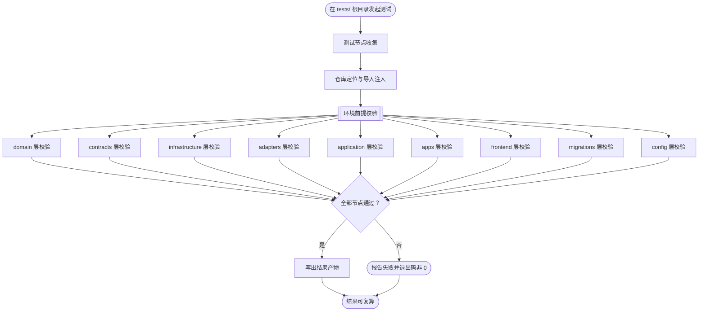
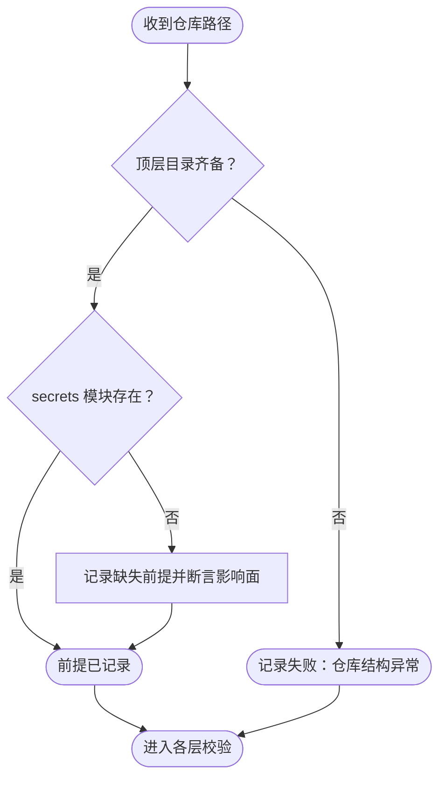

# Home Lab 测试流程

本文档描述 `tests/` 这套镜像测试套件如何从仓库结构推导出测试节点、每个节点验证什么、失败如何被归因，以及结果如何被复算。套件的组织原则是**镜像**：`src/Home-Media-Pilot` 下的每一类代码、配置与产物，在测试树中都有一处对应的节点，新增模块时其测试位置由它在仓库中的位置决定，而非另行约定。

## 主流程



## START

在 `tests/` 根目录发起一次完整测试。入口只有一处，不要求调用方了解树内结构。

- 输入参数：无
- 输出参数：
  - `suite_invocation`：测试启动信号；去向为 `HARVEST`

## HARVEST

按目录树收集测试节点。收集以 `tests/` 为根递归进行，节点在树中的位置决定它校验仓库的哪一部分，无需注册或清单。

- 输入参数：
  - `suite_invocation`：测试启动信号；来源为 `START`
- 输出参数：
  - `collected_nodes`：待执行节点集合；去向为 `RESOLVE_REPO`

## RESOLVE_REPO

定位被测仓库并把其根目录注入导入路径，使 `packages.*` 与 `apps.*` 可被导入。

定位由 `tests/_harness/paths.py` 承担：从该文件自身向上逐级查找 `src/Home-Media-Pilot`，以其中的 `pyproject.toml` 作为命中标志。所有节点经由同一个函数取得仓库路径，因此镜像树整体搬迁时断言无需改动。

- 输入参数：
  - `collected_nodes`：待执行节点集合；来源为 `HARVEST`
- 输出参数：
  - `repository_root`：被测仓库根路径；去向为 `PRECONDITION`
  - `import_path`：已注入的导入路径；去向为 `PRECONDITION`

## PRECONDITION

校验仓库的既成事实：哪些模块存在、哪些模块因缺失依赖无法导入。

本节点是**唯一**承载环境事实的地方。它记录的前提决定后续各层节点中有多少断言会失败——但失败只改变结论，不改变执行：套件不设跳过通道，无法导入即判失败。



### START_PRE

前提校验入口，接收仓库根路径。

- 输入参数：
  - `repository_root`：被测仓库根路径；来源为 `RESOLVE_REPO`
- 输出参数：
  - `checkout_facts`：待校验的仓库事实；去向为 `CHECK_DIRS`

### CHECK_DIRS

校验仓库顶层目录齐备，并校验各基础设施模块文件存在。

- 输入参数：
  - `checkout_facts`：仓库事实；来源为 `START_PRE`
- 输出参数：
  - `checkout_facts`：校验通过的仓库事实；去向为 `CHECK_SECRETS`
  - `structure_error`：缺失顶层目录或模块的错误；去向为 `PRE_FAIL`

### CHECK_SECRETS

校验 `packages/infrastructure/secrets.py` 的存在性，并在缺失时断言其影响面。

该模块被 `packages/application/libraries.py` 与 `apps/api/routes_phase4.py` 导入，因此缺失时凡是传递到达二者的模块都无法导入。本节点把"缺失"与"影响哪些模块"一并断言为可复算的事实。

- 输入参数：
  - `checkout_facts`：仓库事实；来源为 `CHECK_DIRS`
- 输出参数：
  - `absent_module`：已记录的缺失模块前提；去向为 `RECORD_ABSENT`
  - `checkout_facts`：模块存在时的仓库事实；去向为 `PRE_PASS`

### RECORD_ABSENT

记录缺失前提：断言模块确实不存在、断言导入方确实引用它、并断言受影响的模块确实无法导入。

- 输入参数：
  - `absent_module`：缺失模块前提；来源为 `CHECK_SECRETS`
- 输出参数：
  - `recorded_precondition`：已记录的前提；去向为 `PRE_PASS`

### PRE_FAIL

前提校验的失败出口，表示仓库结构本身不符合套件预期。

- 输入参数：
  - `structure_error`：结构错误；来源为 `CHECK_DIRS`
- 输出参数：
  - `failure`：失败结论；去向为 `DONE_PRE`

### PRE_PASS

前提校验的完成出口，各层校验据此进入执行。

- 输入参数：
  - `checkout_facts`：仓库事实；来源为 `CHECK_SECRETS`
  - `recorded_precondition`：已记录的前提；来源为 `RECORD_ABSENT`
- 输出参数：无

### DONE_PRE

前提校验流程的结束点。

- 输入参数：
  - `failure`：失败结论；来源为 `PRE_FAIL`
- 输出参数：无

## DOMAIN_LAYER

校验 `packages/domain`：下载生命周期状态机与错误分类枚举。

断言的是**状态机的可迁移集合**——哪些迁移被允许、哪些被拒绝——以及终态没有出边。这类不变量无法从调用点重建，是领域层相对其调用方的净增量。

- 输入参数：
  - `repository_root`：被测仓库根路径；来源为 `RESOLVE_REPO`
- 输出参数：
  - `layer_result`：该层通过或失败的结论；去向为 `VERDICT`

## CONTRACT_LAYER

校验 `packages/contracts`：API 边界的输入校验。

断言契约**拒绝什么**，而非接受什么：空路径列表、空名称、空来源标识必须被拒绝，可缺省字段必须有其文档化的默认值。契约的拒绝面是调用方无法从实现重建的约束。

- 输入参数：
  - `repository_root`：被测仓库根路径；来源为 `RESOLVE_REPO`
- 输出参数：
  - `layer_result`：该层结论；去向为 `VERDICT`

## INFRA_LAYER

校验 `packages/infrastructure`：配置读取、脱敏、数据库模式与任务生命周期、逻辑路径映射。

三条不变量在此固定：脱敏在任意嵌套深度对敏感键生效；任务状态迁移受固定允许集约束且已提交任务不重复创建；逻辑路径映射拒绝逃出根目录的相对路径。末者是只读安全的直接承载，无法从调用点重建。

- 输入参数：
  - `repository_root`：被测仓库根路径；来源为 `RESOLVE_REPO`
- 输出参数：
  - `layer_result`：该层结论；去向为 `VERDICT`

## ADAPTER_LAYER

校验 `packages/adapters`：错误契约、只读文件探测、只读边界本身。

除逐方法断言外，本层以**结构性断言**守住只读边界：遍历各只读适配器类的公开方法，断言其中不出现 `add`、`delete`、`remove`、`move`、`rename`、`refresh`、`scan` 一类变更入口。该断言不依赖对某个具体方法的记忆，新增变更方法即触发。

- 输入参数：
  - `repository_root`：被测仓库根路径；来源为 `RESOLVE_REPO`
- 输出参数：
  - `layer_result`：该层结论；去向为 `VERDICT`

## APPLICATION_LAYER

校验 `packages/application`：扫描与索引、元数据与字幕路由、重试边界、审批门、Agent 工具策略、自动化策略与调度表达式、后台任务运行。

本层承载流程文档所述各业务流的核心断言，其中三处判据不可从别处重建：

- **审批门**：未批准或变更能力未启用时，下载客户端**不得被触达**——断言点在假适配器是否收到调用，而非仅断言异常。
- **回读校验**：提交后回读的哈希与提交结果不符即判定提交无法验证，审批落到失败或部分完成。
- **冲突级别**：同一路径归属两个媒体库在路由构造时即被拒绝。

凡模块因缺失前提无法导入者，其断言直接判失败并在失败信息中写出根因，不使其伪装为通过，也不以跳过回避。

- 输入参数：
  - `repository_root`：被测仓库根路径；来源为 `RESOLVE_REPO`
- 输出参数：
  - `layer_result`：该层结论；去向为 `VERDICT`

## APPS_LAYER

校验 `apps/`：HTTP 路由面、CLI 命令面、两个常驻进程入口。

HTTP 侧断言健康与版本路由的契约、CORS 来源的解析，以及能力路由确实被挂载；CLI 侧断言命令组注册与根命令行为；进程侧以源码断言入口可被 `python -m` 调用、能响应中断退出、并写出启动与停止日志。

命令组与路由的断言取自源码结构，因此即使 CLI 因缺失前提无法导入，结构校验仍给出结论；行为校验则判失败。

- 输入参数：
  - `repository_root`：被测仓库根路径；来源为 `RESOLVE_REPO`
- 输出参数：
  - `layer_result`：该层结论；去向为 `VERDICT`

## FRONTEND_LAYER

校验 `frontend/`：入口与挂载点、构建产物路径、API 基址可配置性、类型严格性，以及前端不做服务端变更。

两条断言面向**跨文件一致性**：入口挂载的 DOM 标识必须存在于 `index.html`；分体部署所需的 API 基址必须可由环境变量覆盖。构建产物路径与 API 所服务目录之间当前未接通，该事实以断言形态固定，接通后该断言转为失败信号。

- 输入参数：
  - `repository_root`：被测仓库根路径；来源为 `RESOLVE_REPO`
- 输出参数：
  - `layer_result`：该层结论；去向为 `VERDICT`

## MIGRATION_LAYER

校验 `migrations/`：修订标识唯一、父引用可解析、链的连通性、每个修订定义升降级。

本层当前记录两处既成缺陷：`0010_provider_platform_catalog` 声明的父修订 `0009_provider_connection_status` 不在仓库中，故 `alembic upgrade head` 无法抵达该修订；`0007_jellyfin_library_identity` 不被任何修订引用。二者以集合相等断言钉住——修复或新增修订都会使断言失败，从而强制复核。

- 输入参数：
  - `repository_root`：被测仓库根路径；来源为 `RESOLVE_REPO`
- 输出参数：
  - `layer_result`：该层结论；去向为 `VERDICT`

## CONFIG_LAYER

校验部署与构建配置：compose 拓扑、Dockerfile、Makefile 目标、CI 作业、前端构建脚本，以及示例环境文件不含真实凭据。

安全相关断言在此集中：NAS 部署的媒体与下载挂载必须带只读标志；`.env.example` 中以密钥命名的键不得携带非占位值。这两条看的是部署产物本身，而非代码，因此只能在此层校验。

- 输入参数：
  - `repository_root`：被测仓库根路径；来源为 `RESOLVE_REPO`
- 输出参数：
  - `layer_result`：该层结论；去向为 `VERDICT`

## VERDICT

汇总各层结论。判据只有一条：失败的节点为零。

无法导入不构成豁免——它表示该处能力在仓库当前状态下确实不可达，其结论是失败；根因由 `PRECONDITION` 记录的前提承担。

- 输入参数：
  - `layer_result`：各层结论；来源为上述九个层节点
- 输出参数：
  - `failure_signal`：存在失败节点；去向为 `REPORT_FAIL`
  - `pass_signal`：无失败节点；去向为 `EMIT_REPORT`

## REPORT_FAIL

失败出口。输出失败节点清单并以非零退出码结束，使自动化流程可据退出码判定。

- 输入参数：
  - `failure_signal`：失败信号；来源为 `VERDICT`
- 输出参数：
  - `failure_report`：失败结论；去向为 `DONE`

## EMIT_REPORT

写出结果产物，使本次运行可被复算。

产物记录执行命令、退出码、起止时刻与输出尾部。产物是易失的，不应提交；其价值在于把某一次运行固定为可核对的记录。

- 输入参数：
  - `pass_signal`：通过信号；来源为 `VERDICT`
- 输出参数：
  - `result_artifact`：结果产物；去向为 `DONE`

## DONE

测试流程的完成出口。结论均可经产物复算。

- 输入参数：
  - `failure_report`：失败结论；来源为 `REPORT_FAIL`
  - `result_artifact`：结果产物；来源为 `EMIT_REPORT`
- 输出参数：无

## 目录镜像对照

测试树的位置与仓库位置的对应关系如下，新增仓库内容时按同一规则落位。

| 测试目录 | 对应的仓库位置 |
| --- | --- |
| `tests/repository/` | 仓库整体形状与其既成前提 |
| `tests/src/packages/domain/` | `packages/domain/` |
| `tests/src/packages/contracts/` | `packages/contracts/` |
| `tests/src/packages/infrastructure/` | `packages/infrastructure/` |
| `tests/src/packages/adapters/` | `packages/adapters/` |
| `tests/src/packages/application/` | `packages/application/` |
| `tests/src/apps/api/` | `apps/api/` |
| `tests/src/apps/cli/` | `apps/cli/` |
| `tests/src/apps/workers/` | `apps/worker.py`、`apps/scheduler.py` |
| `tests/src/migrations/` | `migrations/` |
| `tests/src/frontend/` | `frontend/` |
| `tests/config/compose/` | compose 文件与 Dockerfile |
| `tests/config/build/` | `Makefile`、`pyproject.toml`、`.github/workflows/` |

## 运行方式

在 `tests/` 根目录或其上级执行：

```bash
python3 -m pytest tests -q
```

判据是**全绿且退出码为 0**。套件不设跳过通道：无法导入的模块其断言判失败，因此红即代表真实缺口。要同时落一份可复算的产物：

```bash
python3 tests/run_tests.py
```

产物路径与字段见 `tests/run_tests.py` 的 `--report` 选项与 `DEFAULT_REPORT`。

## 覆盖边界

本套件覆盖的是**可从仓库静态与可导入面校验**的部分。以下不在其判据内，需由具备外部服务或运行环境的前置条件另行承担：

- 需要真实 qBittorrent、M-Team、Jellyfin、MetaTube 或 OpenSubtitles 的在线行为。
- 需要 PostgreSQL 或容器运行时的集成行为。
- 浏览器内的交互行为——前端未声明测试运行器，其 CI 只做类型检查与打包。
- 容器内前端产物是否可达——本套件只断言该接线当前未建立。
