# Home Media Pilot 媒体控制面流程

本文档描述 `home-media-pilot` 仓库克隆已实现的运行流程：Pilot 作为家庭媒体系统的可写控制面，从媒体库配置与只读扫描取得资源事实，经 Provider 路由产出元数据与字幕候选，并由独立审批门约束对外部系统的变更。文档覆盖这些流程的主干、各分支的触发条件与失败出口，以及每个环节的输入输出；不描述尚未接线的能力。

## 主流程

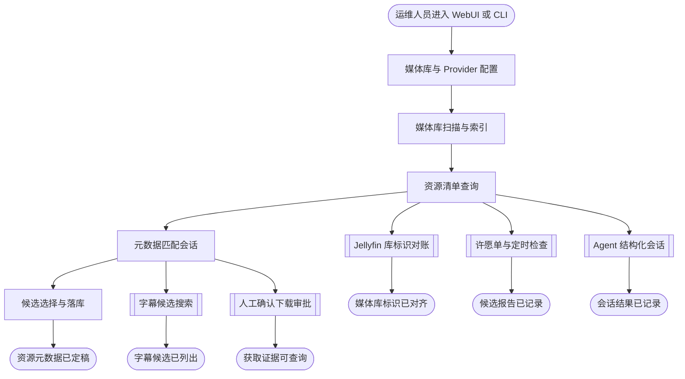

## BOOTSTRAP

容器启动时把数据库模式推进到迁移链的表头，然后才开始服务。这一步先于 `START`：它决定应用能否对外提供请求。

模式由迁移链作者，而非由模型推断。API 路由逐请求调用 `create_all`，若不在启动时先迁移，建表就会由模型完成，schema 与迁移链的分歧随之被掩盖；先迁移使分歧表现为一次启动失败，而不是逐请求失败。

库已有迁移标记时直接推进；库中有表但无标记（由更早的容器以模型建出）时，先记为已在表头再推进，避免重放迁移链与既有表冲突；库为空时正常推进整条链。

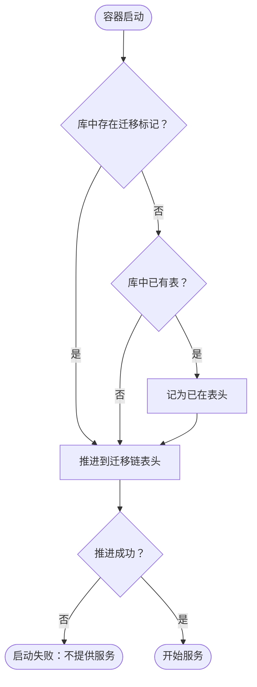

实现取回处为 `src/apps/api/migrate.py`，容器内的调用顺序见 `docker/api-entrypoint.sh`；模式与分支由 `tests/src/apps/api/test_migrate.py` 的用例钉住。

- 输入参数：
  - `database_url`：字符串；来源为运行环境，缺省时取工程内的默认库路径
- 输出参数：
  - `service_ready`：布尔；去向为流程之外（调用方），表示服务已可接受请求

### START_BOOT

容器入口触发，先于 HTTP 服务。输入是运行环境注入的数据库连接。

- 输入参数：
  - `database_url`：字符串；来源为运行环境，缺省时取工程内的默认库路径
- 输出参数：
  - `schema_target`：迁移链表头；去向为 `HAS_MARKER`

### HAS_MARKER

以库中是否存在迁移标记判断迁移链是否已接管该库。

- 输入参数：
  - `schema_target`：迁移链表头；来源为 `START_BOOT`
- 输出参数：
  - `needs_stamp`：布尔；去向为 `HAS_TABLES`，库中有表但无标记时为真
  - `recorded_at`：迁移链表头；去向为 `UPGRADE`，库中已有标记时直接推进

### HAS_TABLES

区分空库与"有表但无标记"的库。

- 输入参数：
  - `needs_stamp`：布尔；来源为 `HAS_MARKER`
- 输出参数：
  - `stamp_required`：布尔；去向为 `STAMP`

### STAMP

把无标记但已有表的库记为已在迁移链表头，使后续推进不重放既有迁移。

- 输入参数：
  - `stamp_required`：布尔；来源为 `HAS_TABLES`
- 输出参数：
  - `recorded_at`：迁移链表头；去向为 `UPGRADE`

### UPGRADE

把库推进到迁移链表头。这是模式唯一的作者。

- 输入参数：
  - `recorded_at`：迁移链表头；来源为 `STAMP`，或直接来自 `HAS_MARKER` 的已接管分支
- 输出参数：
  - `upgrade_result`：成败；去向为 `UP_OK`

### UP_OK

判定推进结果。失败即终止启动，不以未迁移的库对外服务。

- 输入参数：
  - `upgrade_result`：成败；来源为 `UPGRADE`
- 输出参数：
  - `boot_verdict`：枚举；去向为 `BOOT_DONE` 或 `BOOT_ERROR`

### BOOT_DONE

迁移完成，HTTP 服务开始接受请求，进入主流程的 `START`。

- 输入参数：
  - `boot_verdict`：枚举；来源为 `UP_OK`
- 输出参数：
  - `service_ready`：布尔；去向为流程之外（调用方），表示服务已可接受请求

### BOOT_ERROR

迁移失败的出口。进程不以未迁移的库对外服务。

- 输入参数：
  - `boot_verdict`：枚举；来源为 `UP_OK`
- 输出参数：无

## START

运维人员通过 WebUI 或 CLI 进入系统。两者都不直接访问外部服务，全部业务执行落在应用服务边界上。

- 输入参数：无
- 输出参数：
  - `entry_channel`：枚举；去向为流程之外（WebUI 或 CLI 请求方）

## CONFIG_LIBRARY

建立 Pilot 的媒体库模型并绑定 Provider。媒体库由名称、一个或多个逻辑根路径、元数据 Provider 与字幕 Provider 构成；逻辑根路径到物理路径的映射来自部署环境，媒体库本身存于应用数据库。

数据库为空时，部署设置只作一次性导入：已存在任何媒体库即不再导入，配置权威此后归数据库。Provider 的行由 Provider 注册表发现并补齐，端点、凭据与启用状态属于数据库中的可写配置，不随重新发现被覆盖。

校验在写入前完成：逻辑根路径必须存在于部署映射；同一逻辑根路径不得归属两个媒体库；绑定的 Provider 必须已注册且已启用。任一校验失败即拒绝写入并返回错误，不落库。

Provider 连接测试使用提交的凭据发起，且不持久化凭据本身——只记录状态、消息与检查时刻。

元数据与字幕 Provider 由按类型键控的工厂表构造：每类 Provider 各有一张"标识到实现"的映射，装配时按已配置行或部署环境求出端点，取不到端点的实现不注册。因此**未配置端点的 Provider 不会出现在路由中**，对该库的检索随即以路由错误失败，而不是以一个指向空端点的实例失败。新增一类实现只改映射表与实现所在模块。

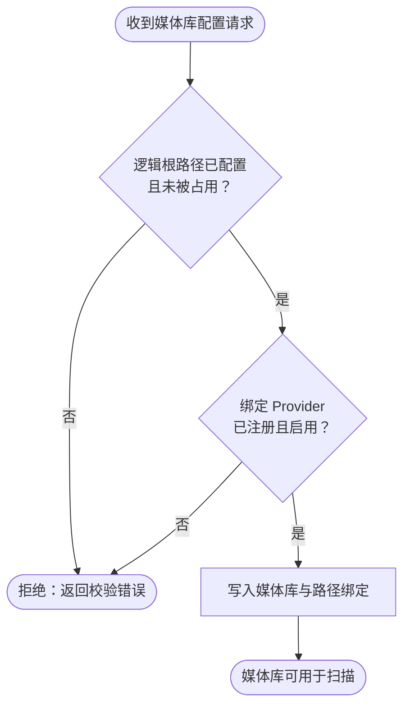

- 输入参数：
  - `library_name`：字符串；来源为工程部署位置（WebUI 或 CLI 的请求体）
  - `logical_paths`：字符串列表；来源为工程部署位置
  - `metadata_provider`：字符串，Provider 标识；来源为工程部署位置
  - `subtitle_provider`：字符串，Provider 标识；来源为工程部署位置
- 输出参数：
  - `library_record`：媒体库记录；去向为 `CFG_DONE`
  - `rejection`：错误响应；去向为流程之外（请求方）

### START_CFG

配置流程的入口，接收媒体库的名称、路径集合与 Provider 绑定。

- 输入参数：
  - `library_name`：字符串；来源为工程部署位置（WebUI 或 CLI 的请求体）
  - `logical_paths`：字符串列表；来源为工程部署位置
  - `metadata_provider`：字符串，Provider 标识；来源为工程部署位置
  - `subtitle_provider`：字符串，Provider 标识；来源为工程部署位置
- 输出参数：
  - `library_request`：媒体库创建或更新请求；去向为 `VALIDATE_ROOTS`

### VALIDATE_ROOTS

校验逻辑根路径。判据是每个逻辑根路径都能在部署映射中解析到物理路径，且当前没有其它媒体库占用它。

- 输入参数：
  - `library_request`：媒体库创建或更新请求；来源为 `START_CFG`
- 输出参数：
  - `library_request`：校验通过的请求；去向为 `VALIDATE_PROVIDERS`
  - `validation_error`：描述未配置或已被占用的逻辑根路径的错误；去向为 `REJECT_CFG`

### VALIDATE_PROVIDERS

校验元数据与字幕 Provider 绑定。判据是该 Provider 在配置表中存在且处于启用状态。

- 输入参数：
  - `library_request`：媒体库创建或更新请求；来源为 `VALIDATE_ROOTS`
- 输出参数：
  - `library_request`：校验通过的请求；去向为 `PERSIST_LIBRARY`
  - `validation_error`：描述未注册或已停用 Provider 的错误；去向为 `REJECT_CFG`

### PERSIST_LIBRARY

把媒体库、其逻辑路径与 Provider 绑定写入应用数据库，并按名称唯一性约束拒绝重名。

- 输入参数：
  - `library_request`：媒体库创建或更新请求；来源为 `VALIDATE_PROVIDERS`
- 输出参数：
  - `library_record`：含标识符、名称、路径与 Provider 绑定的媒体库记录；去向为 `CFG_DONE`

### REJECT_CFG

配置流程的失败出口。返回错误详情，不产生任何数据库写入。

- 输入参数：
  - `validation_error`：校验错误；来源为 `VALIDATE_ROOTS` 或 `VALIDATE_PROVIDERS`
- 输出参数：
  - `rejection`：错误响应；去向为流程之外（请求方）

### CFG_DONE

配置流程的完成出口。媒体库及其路径与 Provider 绑定可用于后续扫描。

- 输入参数：
  - `library_record`：媒体库记录；来源为 `PERSIST_LIBRARY`
- 输出参数：无

## SCAN_LIBRARY

按媒体库的逻辑根路径只读遍历文件系统，识别媒体与字幕文件，建立索引并持久化扫描报告。

遍历对每个根路径递归枚举文件，跳过相对路径中含点号前缀的目录与文件，仅收取媒体扩展名与字幕扩展名。媒体文件按时长识别为电影或剧集：文件名中匹配到季集标记的记为剧集并解析季号集号，否则记为电影并尝试解析年份；季号集号非正数时按无季集信息处理。字幕文件独立记为字幕类型。

媒体实体按标题、媒体类型与来源逻辑根路径三者联合去重——同名文件落在两个逻辑根路径下是两条记录，不合并；同一逻辑根路径下的同名同类型文件共享一个媒体实体。标题由文件名去掉发布组尾部（季集标记、年份、分辨率、编码、来源标签）后归一化得到。文件记录保存相对路径、字节数与指纹（字节数与修改时间纳秒组成），指纹变化即视为文件变更。

扫描报告记录状态与各类计数并在扫描后持久化；扫描失败时同样落一条失败报告，使失败可被后续查询读到。

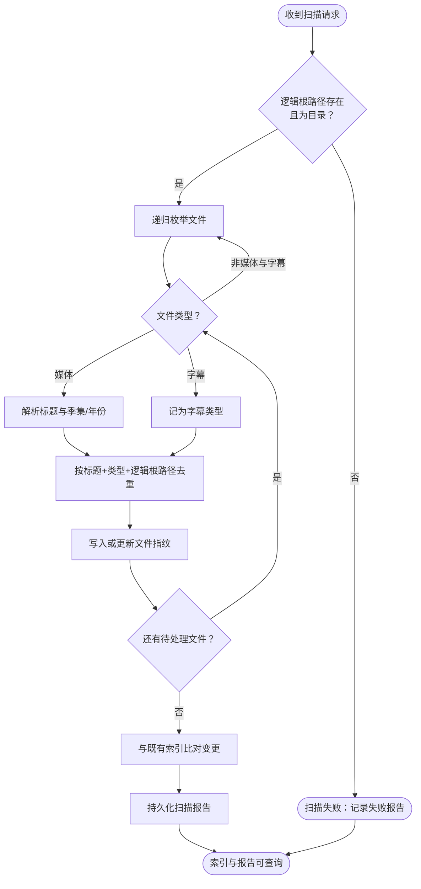

- 输入参数：
  - `logical_root`：字符串，逻辑根路径名；来源为工程部署位置（媒体库配置）
- 输出参数：
  - `scan_report`：扫描报告记录；去向为 `SCAN_DONE`

### START_SCAN

扫描流程入口，接收一个逻辑根路径。

- 输入参数：
  - `logical_root`：字符串，逻辑根路径名；来源为工程部署位置（媒体库配置）
- 输出参数：
  - `scan_target`：待扫描的逻辑根路径；去向为 `RESOLVE_ROOT`

### RESOLVE_ROOT

把逻辑根路径解析为物理路径并校验。判据是物理路径存在且为目录；越出根的相对路径由路径映射器拒绝。

- 输入参数：
  - `scan_target`：待扫描的逻辑根路径；来源为 `START_SCAN`
- 输出参数：
  - `physical_root`：已解析的物理根路径；去向为 `ENUMERATE`
  - `scan_error`：根路径不存在或不是目录的错误；去向为 `SCAN_FAILED`

### ENUMERATE

递归枚举根路径下的全部路径，跳过点号前缀的隐藏路径，并把每个候选文件交给分类环节。

- 输入参数：
  - `physical_root`：物理根路径；来源为 `RESOLVE_ROOT`
- 输出参数：
  - `candidate_path`：单个候选文件路径；去向为 `CLASSIFY_FILE`

### CLASSIFY_FILE

按扩展名判定文件类型。后缀属于媒体扩展名集合的进入 `DERIVE_TITLE`，属于字幕扩展名集合的进入 `INDEX_SUBTITLE`，两者都不属于则丢弃该文件。

- 输入参数：
  - `candidate_path`：候选文件路径；来源为 `ENUMERATE`
- 输出参数：
  - `media_file`：媒体文件的路径、字节数与修改时间；去向为 `DERIVE_TITLE`
  - `subtitle_file`：字幕文件的路径、字节数与修改时间；去向为 `INDEX_SUBTITLE`

### DERIVE_TITLE

从文件名推导可检索标题并识别季集与年份。标题取发布组尾部之前的部分并归一化分隔符；季集标记决定媒体类型为剧集，否则为电影。

- 输入参数：
  - `media_file`：媒体文件信息；来源为 `CLASSIFY_FILE`
- 输出参数：
  - `item_identity`：含标题、媒体类型、季号、集号、年份与文件指纹的标识；去向为 `UPSERT_MEDIA`

### INDEX_SUBTITLE

把字幕文件标记为字幕类型，不参与标题推导。

- 输入参数：
  - `subtitle_file`：字幕文件信息；来源为 `CLASSIFY_FILE`
- 输出参数：
  - `item_identity`：含标题（取文件名主干）、字幕类型与文件指纹的标识；去向为 `UPSERT_MEDIA`

### UPSERT_MEDIA

按标题、媒体类型与来源逻辑根路径联合查找媒体实体：不存在则新建，存在则补齐缺失的年份、季号与集号。同一逻辑根路径下重复出现的同一媒体不产生第二条实体。

- 输入参数：
  - `item_identity`：资源标识；来源为 `DERIVE_TITLE` 或 `INDEX_SUBTITLE`
- 输出参数：
  - `media_entity`：媒体实体标识；去向为 `UPSERT_FILE`

### UPSERT_FILE

按媒体实体与逻辑路径查找文件记录：不存在则新建并写入指纹，存在则更新字节数与指纹。

- 输入参数：
  - `media_entity`：媒体实体标识；来源为 `UPSERT_MEDIA`
  - `item_identity`：资源标识，提供路径与指纹；来源为 `DERIVE_TITLE` 或 `INDEX_SUBTITLE`
- 输出参数：
  - `file_record`：已写入的文件记录；去向为 `MORE_FILES`

### MORE_FILES

判定本次扫描是否还有待处理文件。有则回到分类环节，无则进入索引比对。

- 输入参数：
  - `file_record`：已写入的文件记录；来源为 `UPSERT_FILE`
- 输出参数：
  - `candidate_path`：下一个候选文件路径；去向为 `CLASSIFY_FILE`
  - `scan_complete`：本次扫描的文件集合已处理完毕；去向为 `DIFF_INDEX`

### DIFF_INDEX

把本次扫描结果与该逻辑根路径下的既有索引比对，统计未变更、已变更与已移除文件数。既有条目按路径取回，指纹一致计未变更，指纹不同计已变更，只存在于既有索引的计已移除。

- 输入参数：
  - `scan_complete`：扫描完成信号；来源为 `MORE_FILES`
- 输出参数：
  - `scan_summary`：含总数、未变更数、已变更数、已移除数与文件清单的扫描结果；去向为 `PERSIST_REPORT`

### PERSIST_REPORT

把扫描报告写入数据库并提交，使结果在进程重启后仍可查询。

- 输入参数：
  - `scan_summary`：扫描结果；来源为 `DIFF_INDEX`
- 输出参数：
  - `scan_report`：含状态与计数的扫描报告记录；去向为 `SCAN_DONE`

### SCAN_FAILED

扫描流程的失败出口。记录一条状态为失败、含错误信息的扫描报告，不使文件系统发生任何变更。

- 输入参数：
  - `scan_error`：扫描错误；来源为 `RESOLVE_ROOT`
- 输出参数：
  - `scan_report`：状态为失败的扫描报告记录；去向为 `SCAN_DONE`

### SCAN_DONE

扫描流程的完成出口。索引与扫描报告均已持久化，可经状态接口查询。

- 输入参数：
  - `scan_report`：扫描报告记录；来源为 `PERSIST_REPORT` 或 `SCAN_FAILED`
- 输出参数：无

## LIST_RESOURCES

按媒体库列出已索引的资源，默认只返回尚未匹配元数据的资源。

查询按媒体库的逻辑根路径前缀收集文件记录并联接其媒体实体，可切换是否只取未匹配项，并受返回条数上限约束。资源是后续元数据匹配、字幕搜索、下载审批与调度列举的共同入口——这些流程都以资源身份而非自由文本为起点。

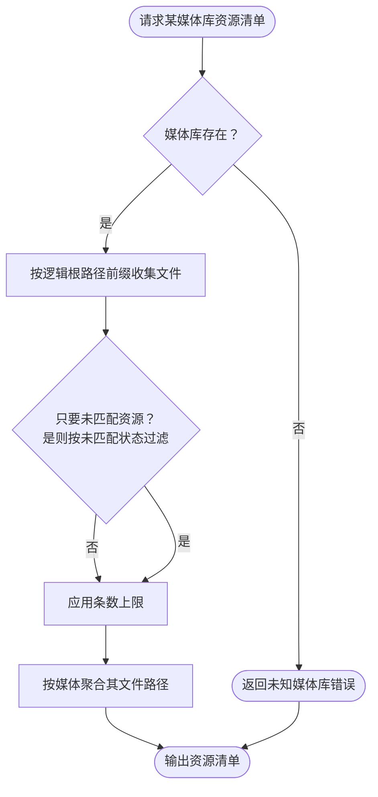

- 输入参数：
  - `library_id`：标识符；来源为工程部署位置（WebUI 或 CLI 的请求）
  - `unmatched_only`：布尔；来源为工程部署位置
  - `limit`：整数，条数上限；来源为工程部署位置
- 输出参数：
  - `resources`：资源清单；去向为 `RES_DONE`
  - `error_response`：错误响应；去向为 `RES_DONE`

### START_RES

资源清单流程入口，接收媒体库标识与查询条件。

- 输入参数：
  - `library_id`：标识符；来源为工程部署位置（WebUI 或 CLI 的请求）
  - `unmatched_only`：布尔；来源为工程部署位置
  - `limit`：整数，条数上限；来源为工程部署位置
- 输出参数：
  - `resource_query`：资源查询条件；去向为 `LOAD_LIBRARY`

### LOAD_LIBRARY

按标识符装载媒体库及其逻辑路径。判据是媒体库存在。

- 输入参数：
  - `resource_query`：资源查询条件；来源为 `START_RES`
- 输出参数：
  - `library_paths`：媒体库的逻辑根路径集合；去向为 `COLLECT_FILES`
  - `lookup_error`：未知媒体库错误；去向为 `RES_ERROR`

### COLLECT_FILES

按逻辑根路径前缀取得该媒体库下的全部文件记录并联接媒体实体，按标题排序。

- 输入参数：
  - `library_paths`：逻辑根路径集合；来源为 `LOAD_LIBRARY`
- 输出参数：
  - `file_rows`：文件记录与媒体实体的联接结果；去向为 `FILTER_UNMATCHED`

### FILTER_UNMATCHED

判定是否只保留未匹配资源。需要时按媒体的元数据状态等于未匹配过滤。

- 输入参数：
  - `file_rows`：联接结果；来源为 `COLLECT_FILES`
  - `resource_query`：查询条件，提供未匹配开关；来源为 `START_RES`
- 输出参数：
  - `file_rows`：过滤后的联接结果；去向为 `APPLY_LIMIT`

### APPLY_LIMIT

应用条数上限，并按媒体聚合其全部文件路径。

- 输入参数：
  - `file_rows`：过滤后的联接结果；来源为 `FILTER_UNMATCHED`
- 输出参数：
  - `resource_list`：含媒体标识、标题、媒体类型、年份、季集、元数据状态与文件路径的资源清单；去向为 `GROUP_PATHS`

### GROUP_PATHS

把同一媒体的多个文件路径归并到一条资源上，使一个媒体只出现一次。

- 输入参数：
  - `resource_list`：资源清单；来源为 `APPLY_LIMIT`
- 输出参数：
  - `resources`：按媒体去重后的资源清单；去向为 `RES_DONE`

### RES_ERROR

资源清单流程的失败出口，返回未知媒体库错误。

- 输入参数：
  - `lookup_error`：未知媒体库错误；来源为 `LOAD_LIBRARY`
- 输出参数：
  - `error_response`：错误响应；去向为 `RES_DONE`

### RES_DONE

资源清单流程的完成出口，输出可供后续流程消费的资源清单。

- 输入参数：
  - `resources`：资源清单；来源为 `GROUP_PATHS`
  - `error_response`：错误响应；来源为 `RES_ERROR`
- 输出参数：无

## MATCH_METADATA

由一个已索引资源生成元数据检索请求，向该资源所属媒体库绑定的元数据 Provider 搜索候选，并把候选集持久化为一次匹配会话。

流程以资源身份为起点：从资源取标题、媒体类型、年份与季集构造检索请求，剧集类型向上归为剧集检索。逻辑根路径经 Provider 路由解析到唯一媒体库，再取该库绑定的元数据 Provider——路由在构造时即拒绝同一路径归属两个媒体库、以及未注册的 Provider。

Provider 调用带有限次重试，仅对超时与不可用两类瞬时失败重试，业务错误、限流与认证失败立即上报。

会话以打开状态落库并保存检索请求与全部候选。**刮削只创建可复核候选，绝不代替用户选定**：批量刮削逐个资源生成会话，有候选计为已刮削，无候选计为未匹配，抛错的资源回滚后计为失败并继续处理其余资源，不中断整批。

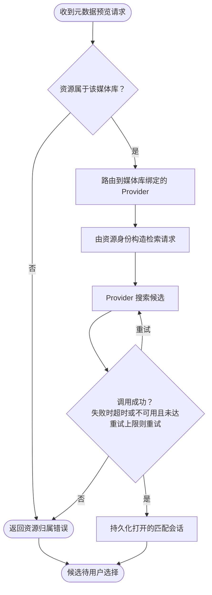

- 输入参数：
  - `library_id`：标识符；来源为工程部署位置
  - `media_id`：标识符；来源为工程部署位置
- 输出参数：
  - `match_session`：状态为已选择、含选定候选的会话；去向为 `METADATA_DONE`
  - `lookup_error`：装载错误；去向为 `MATCH_ERROR`
  - `routing_error`：路由错误；去向为 `MATCH_ERROR`
  - `provider_error`：Provider 错误；去向为 `MATCH_ERROR`

### START_MATCH

元数据匹配流程入口，接收媒体库标识与资源标识。

- 输入参数：
  - `library_id`：标识符；来源为工程部署位置
  - `media_id`：标识符；来源为工程部署位置
- 输出参数：
  - `match_request`：匹配请求；去向为 `LOAD_RESOURCE`

### LOAD_RESOURCE

装载媒体库与资源，并校验资源确属该媒体库。判据是资源的某个文件路径等于或位于该媒体库的某个逻辑根路径之下。

- 输入参数：
  - `match_request`：匹配请求；来源为 `START_MATCH`
- 输出参数：
  - `resource_identity`：资源的标题、媒体类型、年份、季集与逻辑路径；去向为 `RESOLVE_PROVIDER`
  - `lookup_error`：未知媒体库、未知资源或资源不属于该库的错误；去向为 `MATCH_ERROR`

### RESOLVE_PROVIDER

以资源的逻辑根路径经 Provider 路由取得该媒体库绑定的元数据 Provider，并确认其处于启用状态。

- 输入参数：
  - `resource_identity`：资源标识，提供逻辑根路径；来源为 `LOAD_RESOURCE`
- 输出参数：
  - `metadata_provider`：元数据 Provider 实例；去向为 `BUILD_REQUEST`
  - `routing_error`：路径未绑定媒体库或 Provider 未注册、已停用的错误；去向为 `MATCH_ERROR`

### BUILD_REQUEST

由资源身份构造元数据检索请求，剧集向上归为剧集检索。

- 输入参数：
  - `resource_identity`：资源标识；来源为 `LOAD_RESOURCE`
  - `metadata_provider`：元数据 Provider 实例；来源为 `RESOLVE_PROVIDER`
- 输出参数：
  - `search_request`：含检索词、媒体类型、年份与季集的元数据检索请求；去向为 `CALL_PROVIDER`

### CALL_PROVIDER

调用元数据 Provider 搜索候选，失败时按错误类别决定是否重试。

- 输入参数：
  - `search_request`：元数据检索请求；来源为 `BUILD_REQUEST`
  - `metadata_provider`：元数据 Provider 实例；来源为 `RESOLVE_PROVIDER`
  - `retry_signal`：重试信号；来源为 `PROVIDER_OK` 的可重试分支
- 输出参数：
  - `candidates`：候选列表；去向为 `PROVIDER_OK`
  - `provider_error`：带错误类别的 Provider 错误；去向为 `PROVIDER_OK`

### PROVIDER_OK

判定调用结果。成功产出候选；失败时仅超时与不可用可重试且未达上限时回到调用环节，其余类别直接失败。

- 输入参数：
  - `candidates`：候选列表；来源为 `CALL_PROVIDER`
  - `provider_error`：Provider 错误；来源为 `CALL_PROVIDER`
- 输出参数：
  - `retry_signal`：重试信号；去向为 `CALL_PROVIDER`
  - `candidates`：候选列表；去向为 `SAVE_SESSION`
  - `provider_error`：不再重试的错误；去向为 `MATCH_ERROR`

### SAVE_SESSION

把检索请求与候选集合持久化为一次状态为打开的匹配会话。

- 输入参数：
  - `candidates`：候选列表；来源为 `PROVIDER_OK`
- 输出参数：
  - `match_session`：含标识符、资源标识、Provider 标识、检索请求与候选的匹配会话；去向为 `MATCH_DONE`

### MATCH_ERROR

元数据匹配流程的失败出口，返回错误类别与说明。

- 输入参数：
  - `lookup_error`：装载错误；来源为 `LOAD_RESOURCE`
  - `routing_error`：路由错误；来源为 `RESOLVE_PROVIDER`
  - `provider_error`：Provider 错误；来源为 `PROVIDER_OK`
- 输出参数：
  - `error_response`：错误响应；去向为 `MATCH_DONE`

### MATCH_DONE

元数据匹配流程的完成出口。成功时产出待选择的候选会话，失败时产出错误响应。

- 输入参数：
  - `match_session`：匹配会话；来源为 `SAVE_SESSION`
  - `error_response`：错误响应；来源为 `MATCH_ERROR`
- 输出参数：无

## SELECT_CANDIDATE

由用户在打开的会话中选定一个候选，把匹配状态与外部标识写入应用数据库。

选择要求会话处于打开状态且候选下标在范围内。选定后会话转为已选择，资源标记为已匹配，并记录 Provider 标识、外部标识与完整候选内容。**写入只落在应用数据库，不写媒体目录、不写图片、不重命名文件。**

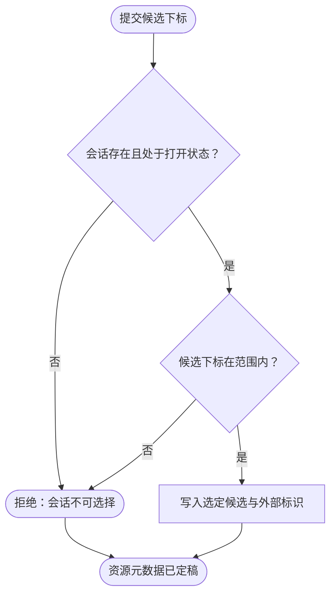

- 输入参数：
  - `session_id`：标识符；来源为工程部署位置
  - `candidate_index`：整数，候选下标；来源为工程部署位置
- 输出参数：
  - `match_session`：状态为已选择、含选定候选的会话；去向为 `METADATA_DONE`
  - `error_response`：错误响应；去向为 `SELECT_DONE`

### START_SELECT

候选选择流程入口，接收会话标识与候选下标。

- 输入参数：
  - `session_id`：标识符；来源为工程部署位置
  - `candidate_index`：整数，候选下标；来源为工程部署位置
- 输出参数：
  - `selection_request`：选择请求；去向为 `SESSION_OPEN`

### SESSION_OPEN

装载匹配会话并校验其处于打开状态。判据是会话存在且状态为打开——已选择的会话不可重复选择。

- 输入参数：
  - `selection_request`：选择请求；来源为 `START_SELECT`
- 输出参数：
  - `match_session`：打开的匹配会话；去向为 `INDEX_VALID`
  - `selection_error`：未知会话或会话非打开状态的错误；去向为 `SELECT_ERROR`

### INDEX_VALID

校验候选下标落在会话保存的候选列表范围内。

- 输入参数：
  - `match_session`：匹配会话，提供候选列表；来源为 `SESSION_OPEN`
  - `selection_request`：选择请求，提供候选下标；来源为 `START_SELECT`
- 输出参数：
  - `selected_candidate`：选定的候选；去向为 `PERSIST_SELECTION`
  - `selection_error`：候选下标越界的错误；去向为 `SELECT_ERROR`

### PERSIST_SELECTION

把选定候选、Provider 标识与外部标识写入会话与媒体实体，并把媒体状态置为已匹配。

- 输入参数：
  - `selected_candidate`：选定的候选；来源为 `INDEX_VALID`
  - `match_session`：匹配会话；来源为 `SESSION_OPEN`
- 输出参数：
  - `match_session`：状态为已选择、含选定候选的会话；去向为 `SELECT_DONE`

### SELECT_ERROR

候选选择流程的失败出口，返回会话不可选择或下标越界的错误，不产生写入。

- 输入参数：
  - `selection_error`：选择错误；来源为 `SESSION_OPEN` 或 `INDEX_VALID`
- 输出参数：
  - `error_response`：错误响应；去向为 `SELECT_DONE`

### SELECT_DONE

候选选择流程的完成出口。

- 输入参数：
  - `match_session`：已选择的会话；来源为 `PERSIST_SELECTION`
  - `error_response`：错误响应；来源为 `SELECT_ERROR`
- 输出参数：无

## METADATA_DONE

元数据分支在主流程图上的完成点。候选经用户选定并落库后到达此处，此后该资源的元数据不再处于未匹配状态。

- 输入参数：
  - `match_session`：状态为已选择、含选定候选的会话；来源为 `SELECT_CANDIDATE`
- 输出参数：无

## SEARCH_SUBTITLES

由一个已索引资源搜索字幕候选，只读不下载。

流程与元数据匹配共享同一套资源归属校验与 Provider 路由，差别在于取该媒体库绑定的字幕 Provider，并构造字幕检索请求。返回的候选仅供展示——**下载字幕不在此流程内**。

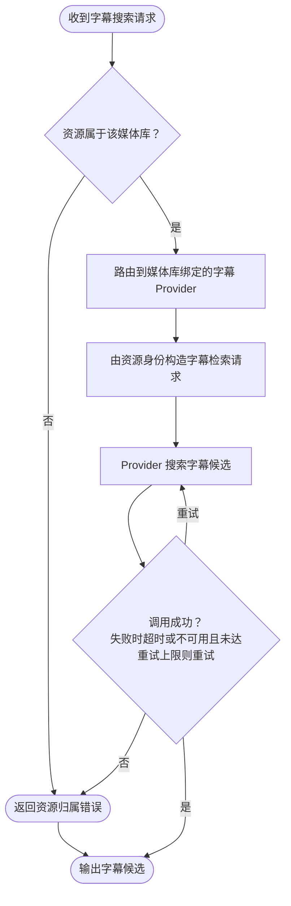

- 输入参数：
  - `library_id`：标识符；来源为工程部署位置
  - `media_id`：标识符；来源为工程部署位置
- 输出参数：
  - `subtitle_candidates`：字幕候选列表；去向为 `SUBTITLE_DONE`

### START_SUB

字幕搜索流程入口，接收媒体库标识与资源标识。

- 输入参数：
  - `library_id`：标识符；来源为工程部署位置
  - `media_id`：标识符；来源为工程部署位置
- 输出参数：
  - `subtitle_request`：字幕搜索请求；去向为 `LOAD_SUB_RESOURCE`

### LOAD_SUB_RESOURCE

装载媒体库与资源，并校验资源属于该媒体库，同时解析出资源所属的逻辑根路径。

- 输入参数：
  - `subtitle_request`：字幕搜索请求；来源为 `START_SUB`
- 输出参数：
  - `resource_identity`：资源的标题、年份、季集与逻辑路径；去向为 `RESOLVE_SUB_PROVIDER`
  - `lookup_error`：未知媒体库、未知资源或资源不属于该库的错误；去向为 `SUB_ERROR`

### RESOLVE_SUB_PROVIDER

以逻辑根路径经 Provider 路由取得该媒体库绑定的字幕 Provider，并确认其处于启用状态。

- 输入参数：
  - `resource_identity`：资源标识，提供逻辑根路径；来源为 `LOAD_SUB_RESOURCE`
- 输出参数：
  - `subtitle_provider`：字幕 Provider 实例；去向为 `BUILD_SUB_REQUEST`
  - `routing_error`：路径未绑定媒体库或 Provider 未注册、已停用的错误；去向为 `SUB_ERROR`

### BUILD_SUB_REQUEST

由资源身份构造字幕检索请求。

- 输入参数：
  - `resource_identity`：资源标识；来源为 `LOAD_SUB_RESOURCE`
  - `subtitle_provider`：字幕 Provider 实例；来源为 `RESOLVE_SUB_PROVIDER`
- 输出参数：
  - `subtitle_search_request`：含检索词、年份与季集的字幕检索请求；去向为 `CALL_SUB_PROVIDER`

### CALL_SUB_PROVIDER

调用字幕 Provider 搜索候选，失败时按错误类别决定是否重试。

- 输入参数：
  - `subtitle_search_request`：字幕检索请求；来源为 `BUILD_SUB_REQUEST`
  - `subtitle_provider`：字幕 Provider 实例；来源为 `RESOLVE_SUB_PROVIDER`
  - `retry_signal`：重试信号；来源为 `SUB_OK` 的可重试分支

- 输入参数：
  - `subtitle_search_request`：字幕检索请求；来源为 `BUILD_SUB_REQUEST`
  - `subtitle_provider`：字幕 Provider 实例；来源为 `RESOLVE_SUB_PROVIDER`
- 输出参数：
  - `subtitle_candidates`：字幕候选列表；去向为 `SUB_OK`
  - `provider_error`：带错误类别的 Provider 错误；去向为 `SUB_OK`

### SUB_OK

判定调用结果。成功产出候选；失败时仅超时与不可用可重试且未达上限时回到调用环节，其余类别直接失败。

- 输入参数：
  - `subtitle_candidates`：字幕候选列表；来源为 `CALL_SUB_PROVIDER`
  - `provider_error`：Provider 错误；来源为 `CALL_SUB_PROVIDER`
- 输出参数：
  - `retry_signal`：重试信号；去向为 `CALL_SUB_PROVIDER`
  - `subtitle_candidates`：字幕候选列表；去向为 `SUB_DONE`
  - `provider_error`：不再重试的错误；去向为 `SUB_ERROR`

### SUB_ERROR

字幕搜索流程的失败出口，返回错误响应，不产生下载或写入。

- 输入参数：
  - `lookup_error`：装载错误；来源为 `LOAD_SUB_RESOURCE`
  - `routing_error`：路由错误；来源为 `RESOLVE_SUB_PROVIDER`
  - `provider_error`：Provider 错误；来源为 `SUB_OK`
- 输出参数：
  - `error_response`：错误响应；去向为 `SUB_DONE`

### SUB_DONE

字幕搜索流程的完成出口，输出候选或错误。

- 输入参数：
  - `subtitle_candidates`：字幕候选列表；来源为 `SUB_OK`
  - `error_response`：错误响应；来源为 `SUB_ERROR`
- 输出参数：无

## SUBTITLE_DONE

字幕分支在主流程图上的完成点。候选已列出供用户查看，本流程不含下载。

- 输入参数：
  - `subtitle_candidates`：字幕候选列表；来源为 `SEARCH_SUBTITLES`
- 输出参数：无

## SYNC_JELLYFIN

从 Jellyfin 读取虚拟文件夹，向上游严格只读地把库标识对账进 Pilot 的媒体库模型。

对账以物理路径相等为唯一依据：Jellyfin 虚拟文件夹的位置逐一解析后与部署配置的物理根路径比较，取匹配上的逻辑根路径；无任何逻辑根路径匹配的文件夹记为跳过并给出原因，不创建媒体库。Jellyfin 返回重复库标识时判定为业务错误。

匹配上的文件夹按 Jellyfin 来源与外部标识查找既有媒体库，找不到再按名称回退到人工建立的同名库——**回退链接保留该库既有的 Provider 与启用设置**，只补齐来源与外部标识并同步路径，不覆盖 Provider、不改变启用状态。两者都找不到时才新建，默认 Provider 取当前已启用的同类 Provider。

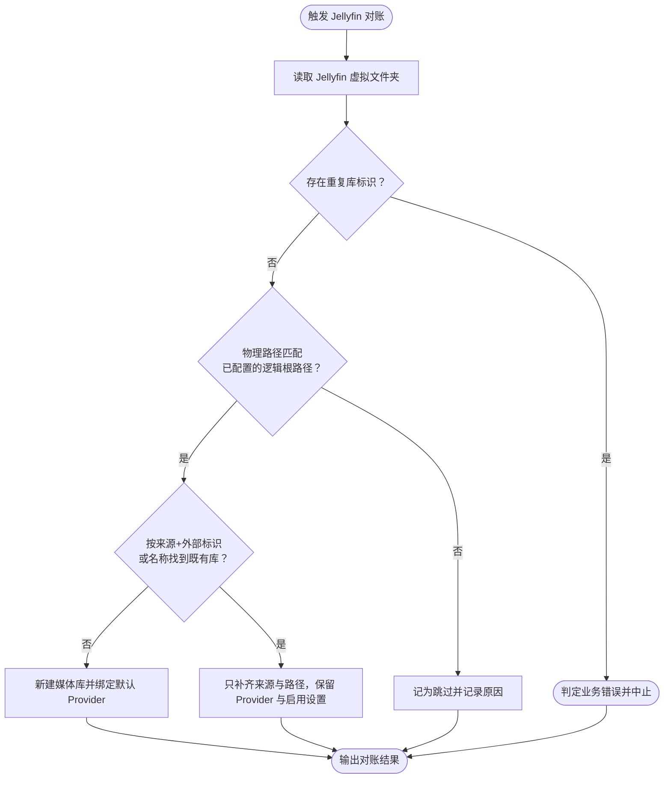

- 输入参数：
  - `library_id`：标识符；来源为工程部署位置
- 输出参数：
  - `sync_item`：对账条目；去向为 `JELLYFIN_DONE`

### START_SYNC

对账流程入口。触发时先补齐缺失的默认 Provider 行，再读取 Jellyfin 虚拟文件夹。

- 输入参数：无
- 输出参数：
  - `remote_libraries`：Jellyfin 返回的虚拟文件夹列表，含名称、集合类型、位置与标识；去向为 `DUP_CHECK`

### READ_REMOTE

向 Jellyfin 读取虚拟文件夹，并对响应结构做校验；认证失败、服务端错误、超时与不可达按错误类别上报。

- 输入参数：无
- 输出参数：
  - `remote_libraries`：虚拟文件夹列表；去向为 `DUP_CHECK`
  - `provider_error`：带错误类别的 Jellyfin 错误；去向为 `SYNC_ERROR`

### DUP_CHECK

校验 Jellyfin 返回的库标识在本次响应内不重复。

- 输入参数：
  - `remote_libraries`：虚拟文件夹列表；来源为 `READ_REMOTE`
- 输出参数：
  - `unique_libraries`：标识唯一的虚拟文件夹列表；去向为 `MATCH_PATH`
  - `duplicate_error`：重复库标识的业务错误；去向为 `SYNC_ERROR`

### MATCH_PATH

把虚拟文件夹的每个位置解析为绝对路径，与配置中各逻辑根路径解析后的物理根路径比较，收集匹配的逻辑根路径。

- 输入参数：
  - `unique_libraries`：虚拟文件夹列表；来源为 `DUP_CHECK`
- 输出参数：
  - `matched_roots`：匹配到的逻辑根路径与虚拟文件夹；去向为 `FIND_LIBRARY`
  - `unmatched_folder`：无逻辑根路径匹配的虚拟文件夹；去向为 `MARK_SKIPPED`

### FIND_LIBRARY

按来源与外部标识查找既有媒体库，找不到则按名称回退查找同名的人工库。

- 输入参数：
  - `matched_roots`：匹配结果；来源为 `MATCH_PATH`
- 输出参数：
  - `existing_library`：既有媒体库；去向为 `LINK_LIBRARY`
  - `no_library`：未找到任何既有库；去向为 `CREATE_LIBRARY`

### CREATE_LIBRARY

新建媒体库，写入 Jellyfin 来源与外部标识、匹配到的逻辑根路径，并绑定当前已启用的默认元数据与字幕 Provider。

- 输入参数：
  - `no_library`：未找到既有库的信号；来源为 `FIND_LIBRARY`
- 输出参数：
  - `sync_item`：动作记为创建的对账条目；去向为 `SYNC_DONE`

### LINK_LIBRARY

把既有库链接到 Jellyfin 来源：写入来源、外部标识与名称，替换其路径集合；Provider 绑定与启用状态保持不变。

- 输入参数：
  - `existing_library`：既有媒体库；来源为 `FIND_LIBRARY`
- 输出参数：
  - `sync_item`：动作记为链接或更新的对账条目；去向为 `SYNC_DONE`

### MARK_SKIPPED

把无逻辑根路径匹配的虚拟文件夹记为跳过，并记录原因。

- 输入参数：
  - `unmatched_folder`：未匹配的虚拟文件夹；来源为 `MATCH_PATH`
- 输出参数：
  - `sync_item`：动作记为跳过、含原因的对账条目；去向为 `SYNC_DONE`

### SYNC_ERROR

对账流程的失败出口。Jellyfin 错误与重复标识业务错误均在此终止流程。

- 输入参数：
  - `provider_error`：Jellyfin 错误；来源为 `READ_REMOTE`
  - `duplicate_error`：重复库标识错误；来源为 `DUP_CHECK`
- 输出参数：
  - `error_response`：错误响应；去向为 `SYNC_DONE`

### SYNC_DONE

对账流程的完成出口，输出每个虚拟文件夹的处置结果或错误。

- 输入参数：
  - `sync_item`：对账条目；来源为 `CREATE_LIBRARY`、`LINK_LIBRARY` 或 `MARK_SKIPPED`
  - `error_response`：错误响应；来源为 `SYNC_ERROR`
- 输出参数：无

## JELLYFIN_DONE

Jellyfin 对账分支在主流程图上的完成点。虚拟文件夹已逐个处置为创建、链接、更新或跳过，上游未被写入。

- 输入参数：
  - `sync_item`：对账条目；来源为 `SYNC_JELLYFIN`
- 输出参数：无

## ACQUIRE

把一次资源获取拆成预览、审批、执行三段，并在执行后再读取外部任务作为凭据。

预览由来源、外部标识、标题、分类、保存路径与媒体标识算出一个幂等键，并检查该键是否已有任务记录；预览本身不产生任何变更，只回报是否重名以及变更能力是否开启。

审批记录按幂等键去重后落库为待审批；审批通过把状态推进为已批准。

执行要求审批记录处于已批准且变更能力已显式开启，两条任一不满足即拒绝。执行先按幂等键创建任务，已成功的任务直接返回既有结果而不重复提交；随后取工件、向下载客户端提交，并**回读外部任务校验其哈希与提交结果一致**——回读不匹配即判定提交无法验证，任务标记失败、审批标记为失败或部分完成。执行成功后任务与审批均标记完成，并保存外部任务标识。

只读证据视图把获取拆成若干阶段事实分别呈现：来源站与审批状态取自本地记录，下载客户端状态取自任务回读，文件落地由只读文件系统适配器探测目录是否存在，Jellyfin 可见性保持未知。**下载客户端的进度从不被当作文件已落地或媒体库已可见的证据**，后两者在专用回读适配器接线前始终是各自独立的未知事实。

WebUI 上执行入口以阻断响应返回，直到显式启用的变更适配器与提交后回读被接线。

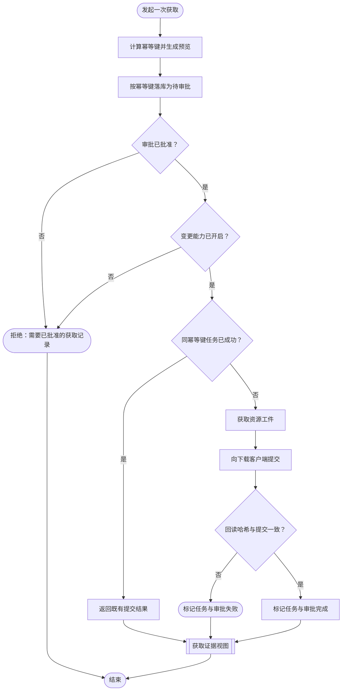

- 输入参数：
  - `source`：字符串，来源站标识；来源为工程部署位置
  - `external_id`：字符串，来源站资源标识；来源为工程部署位置
  - `title`：字符串；来源为工程部署位置
  - `category`：字符串，下载分类；来源为工程部署位置
  - `save_path`：字符串，保存路径；来源为工程部署位置
  - `media_id`：标识符，可空；来源为工程部署位置
- 输出参数：
  - `approval_state`：含来源站、审批、下载客户端、文件系统与媒体库可见性各阶段事实的证据视图；去向为 `ACQUIRE_DONE`

### START_ACQ

获取流程入口，接收来源、外部标识、标题、分类、保存路径与媒体标识。

- 输入参数：
  - `source`：字符串，来源站标识；来源为工程部署位置
  - `external_id`：字符串，来源站资源标识；来源为工程部署位置
  - `title`：字符串；来源为工程部署位置
  - `category`：字符串，下载分类；来源为工程部署位置
  - `save_path`：字符串，保存路径；来源为工程部署位置
  - `media_id`：标识符，可空；来源为工程部署位置
- 输出参数：
  - `acquisition_request`：获取请求；去向为 `PREVIEW_ACQ`

### PREVIEW_ACQ

计算幂等键并检查是否已有同键任务记录，产出预览；不产生任何变更。

- 输入参数：
  - `acquisition_request`：获取请求；来源为 `START_ACQ`
- 输出参数：
  - `acquisition_preview`：含幂等键、是否重名与变更能力开关的预览；去向为 `CREATE_APPROVAL`

### CREATE_APPROVAL

按幂等键查找既有审批记录，存在则直接返回，否则落库为待审批并写一条审计事件。

- 输入参数：
  - `acquisition_preview`：获取预览；来源为 `PREVIEW_ACQ`
- 输出参数：
  - `approval_record`：待审批记录；去向为 `APPROVE_GATE`

### APPROVE_GATE

校验审批记录已批准。判据是状态为已批准——待审批、失败或部分完成的记录一律拒绝执行。

- 输入参数：
  - `approval_record`：审批记录；来源为 `CREATE_APPROVAL`
- 输出参数：
  - `approved_record`：已批准的审批记录；去向为 `MUTATION_GATE`
  - `blocked_error`：需要已批准记录的错误；去向为 `BLOCK_ACQ`

### MUTATION_GATE

校验下载变更能力已显式开启。未开启时拒绝执行，与审批状态无关。

- 输入参数：
  - `approved_record`：已批准的审批记录；来源为 `APPROVE_GATE`
- 输出参数：
  - `approved_record`：已批准的审批记录；去向为 `CREATE_TASK`
  - `blocked_error`：变更能力已禁用的错误；去向为 `BLOCK_ACQ`

### CREATE_TASK

按审批的幂等键创建下载任务。同一幂等键已有成功任务时直接返回既有结果，不重复提交。

- 输入参数：
  - `approved_record`：已批准的审批记录；来源为 `MUTATION_GATE`
- 输出参数：
  - `submitted_result`：既有提交结果；去向为 `RETURN_RESULT`
  - `claimed_task`：已领取的任务；去向为 `FETCH_ARTIFACT`

### FETCH_ARTIFACT

向来源站适配器索取资源工件。

- 输入参数：
  - `claimed_task`：已领取的任务；来源为 `CREATE_TASK`
- 输出参数：
  - `artifact`：资源工件引用；去向为 `SUBMIT_DOWNLOAD`
  - `artifact_error`：取用工件失败的异常；去向为 `SUBMIT_FAILED`

### SUBMIT_DOWNLOAD

向下载客户端提交工件并回读外部任务。

- 输入参数：
  - `artifact`：资源工件引用；来源为 `FETCH_ARTIFACT`
- 输出参数：
  - `readback`：外部任务回读结果；去向为 `READBACK`
  - `submit_error`：提交或回读失败的异常；去向为 `SUBMIT_FAILED`

### READBACK

校验外部任务回读的哈希与提交返回的任务标识一致。

- 输入参数：
  - `readback`：外部任务回读结果；来源为 `SUBMIT_DOWNLOAD`
- 输出参数：
  - `verified_task`：校验通过的外部任务标识与回读内容；去向为 `MARK_COMPLETED`
  - `verification_error`：回读缺失或不匹配的错误；去向为 `SUBMIT_FAILED`

### MARK_COMPLETED

把任务标记为成功、审批标记为完成，并保存外部任务标识与回读内容。

- 输入参数：
  - `verified_task`：校验通过的外部任务；来源为 `READBACK`
- 输出参数：
  - `submitted_result`：含状态、审批标识、任务标识、外部任务标识与回读内容的提交结果；去向为 `STATE_VIEW`

### RETURN_RESULT

幂等重放出口。同幂等键任务已成功时，直接由任务记录重建提交结果，不再次提交。

- 输入参数：
  - `submitted_result`：既有提交结果；来源为 `CREATE_TASK`
- 输出参数：
  - `submitted_result`：提交结果；去向为 `STATE_VIEW`

### SUBMIT_FAILED

获取流程的失败出口。任务标记为不可重试的失败，审批标记为失败；若已取得外部任务标识则标记为部分完成，并记录错误信息。

- 输入参数：
  - `artifact_error`：取用工件的异常；来源为 `FETCH_ARTIFACT`
  - `submit_error`：提交或回读的异常；来源为 `SUBMIT_DOWNLOAD`
  - `verification_error`：回读不匹配的错误；来源为 `READBACK`
- 输出参数：
  - `failure_result`：无法由回读验证的失败错误；去向为 `STATE_VIEW`

### BLOCK_ACQ

获取流程的阻断出口。审批未批准或变更能力未开启时在此终止，不产生外部变更。

- 输入参数：
  - `blocked_error`：阻断原因；来源为 `APPROVE_GATE` 或 `MUTATION_GATE`
- 输出参数：
  - `blocked_error`：阻断错误；去向为 `ACQ_DONE`

### STATE_VIEW

获取证据视图。按阶段分别呈现来源站、审批、下载客户端、文件系统与媒体库可见性的事实；文件落地由只读探测得出，媒体库可见性保持未知。

- 输入参数：
  - `submitted_result`：含状态、审批标识、任务标识、外部任务标识与回读内容的提交结果；来源为 `MARK_COMPLETED`
  - `failure_result`：无法由回读验证的失败错误；来源为 `SUBMIT_FAILED`
- 输出参数：
  - `approval_state`：含来源站、审批、下载客户端、文件系统与媒体库可见性各阶段事实的证据视图；去向为 `ACQ_DONE`

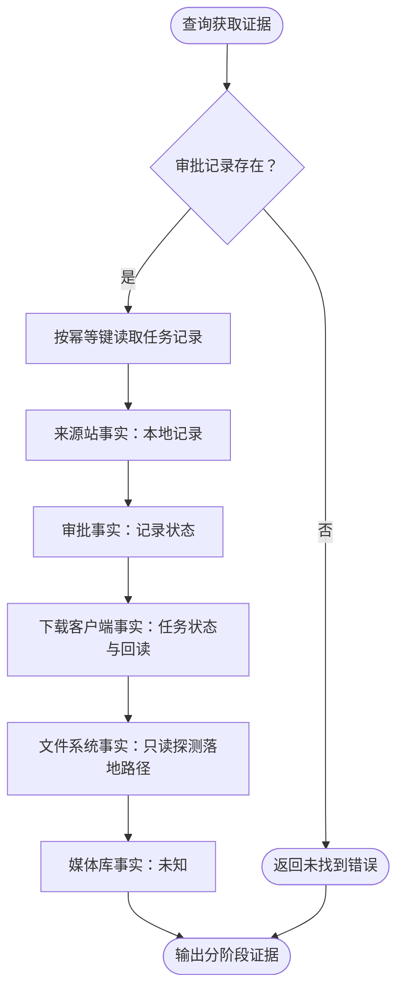

#### START_STATE

证据视图流程入口，接收审批标识。

- 输入参数：
  - `approval_id`：标识符；来源为工程部署位置
- 输出参数：
  - `state_query`：证据查询；去向为 `LOAD_APPROVAL`

#### LOAD_APPROVAL

装载审批记录。判据是记录存在。

- 输入参数：
  - `state_query`：证据查询；来源为 `START_STATE`
- 输出参数：
  - `approval_record`：审批记录；去向为 `READ_TASK`
  - `lookup_error`：未找到审批记录的错误；去向为 `STATE_ERROR`

#### READ_TASK

按审批的幂等键读取对应任务记录，为下载客户端事实提供依据。

- 输入参数：
  - `approval_record`：审批记录；来源为 `LOAD_APPROVAL`
- 输出参数：
  - `task_record`：任务记录，可为空；去向为 `TRACKER_FACT`

#### TRACKER_FACT

产出来源站阶段事实，依据是审批记录中的来源站与外部标识。

- 输入参数：
  - `approval_record`：审批记录；来源为 `LOAD_APPROVAL`
  - `task_record`：任务记录，可为空；来源为 `READ_TASK`
- 输出参数：
  - `tracker_fact`：状态为已验证的来源站事实；去向为 `APPROVAL_FACT`

#### APPROVAL_FACT

产出审批阶段事实，依据是审批记录自身状态。

- 输入参数：
  - `approval_record`：审批记录；来源为 `LOAD_APPROVAL`
  - `tracker_fact`：状态为已验证的来源站事实；来源为 `TRACKER_FACT`
- 输出参数：
  - `approval_fact`：含审批状态的审批事实；去向为 `QB_FACT`

#### QB_FACT

产出下载客户端阶段事实：有任务记录时取任务状态，成功即记为已验证，并从回读内容中剔除磁力链接与工件引用后作为证据。

- 输入参数：
  - `task_record`：任务记录，可为空；来源为 `READ_TASK`
  - `approval_record`：审批记录，提供状态；来源为 `LOAD_APPROVAL`
  - `approval_fact`：含审批状态的审批事实；来源为 `APPROVAL_FACT`
- 输出参数：
  - `qb_fact`：含状态与证据的下载客户端事实；去向为 `FS_FACT`

#### FS_FACT

产出文件系统阶段事实，由只读文件系统适配器探测保存路径是否存在，据此记为已观察到或缺失。

- 输入参数：
  - `approval_record`：审批记录，提供保存路径；来源为 `LOAD_APPROVAL`
  - `qb_fact`：含状态与证据的下载客户端事实；来源为 `QB_FACT`
- 输出参数：
  - `filesystem_fact`：含探测证据的文件系统事实；去向为 `PLAYER_FACT`

#### PLAYER_FACT

产出媒体库阶段事实，状态恒为未知，直到专用回读适配器接线。

- 输入参数：
  - `filesystem_fact`：文件系统事实；来源为 `FS_FACT`
- 输出参数：
  - `player_fact`：状态为未知的媒体库事实；去向为 `STATE_DONE`

#### STATE_ERROR

证据视图流程的失败出口，返回未找到审批记录的错误。

- 输入参数：
  - `lookup_error`：未找到错误；来源为 `LOAD_APPROVAL`
- 输出参数：
  - `error_response`：错误响应；去向为 `STATE_DONE`

#### STATE_DONE

证据视图流程的完成出口，输出按阶段划分的事实集合。

- 输入参数：
  - `player_fact`：媒体库事实；来源为 `PLAYER_FACT`
  - `error_response`：错误响应；来源为 `STATE_ERROR`
- 输出参数：无

### ACQ_DONE

获取流程的完成出口。

- 输入参数：
  - `blocked_error`：阻断错误；来源为 `BLOCK_ACQ`
  - `approval_state`：含来源站、审批、下载客户端、文件系统与媒体库可见性各阶段事实的证据视图；来源为 `ACQUIRE`
- 输出参数：无

## ACQUIRE_DONE

获取分支在主流程图上的完成点。分阶段证据已可查询，是否真正落地与是否对媒体库可见由各自事实独立表达。

- 输入参数：
  - `approval_state`：含来源站、审批、下载客户端、文件系统与媒体库可见性各阶段事实的证据视图；来源为 `ACQUIRE`
- 输出参数：无

## WISHLIST_SCHEDULE

维护许愿单条目与声明式定时作业，检查许愿单时只产出候选报告，不自动下载。

许愿单条目按检索词与媒体类型去重创建，状态迁移受固定允许集约束：进行中可转暂停、完成或取消，暂停可转回进行中或取消，完成与取消为终态。

定时作业当前只接受许愿单检查一种类型，创建时按名称去重并据表达式算出下次运行时刻；表达式支持每小时、每日与按分钟间隔三类，其余表达式在创建时即被拒绝。

检查要求许愿单处于进行中，随后向来源站搜索并写回一份检查报告：有结果记为有候选，无结果记为无结果，同时记录检查时刻。

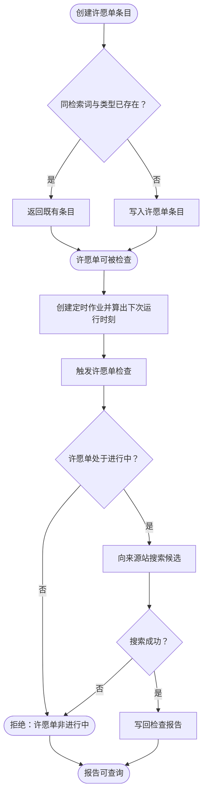

- 输入参数：
  - `query`：字符串，检索词；来源为工程部署位置
  - `media_type`：字符串，媒体类型；来源为工程部署位置
  - `status`：字符串，初始状态；来源为工程部署位置
- 输出参数：
  - `check_report`：候选检查报告；去向为 `WISHLIST_DONE`

### START_WISH

许愿单流程入口，接收检索词、媒体类型与初始状态。

- 输入参数：
  - `query`：字符串，检索词；来源为工程部署位置
  - `media_type`：字符串，媒体类型；来源为工程部署位置
  - `status`：字符串，初始状态；来源为工程部署位置
- 输出参数：
  - `wishlist_request`：许愿单创建请求；去向为 `WISH_DEDUPE`

### WISH_DEDUPE

按检索词与媒体类型查找既有条目，存在即直接返回而不新建。

- 输入参数：
  - `wishlist_request`：许愿单创建请求；来源为 `START_WISH`
- 输出参数：
  - `existing_wishlist`：既有许愿单条目；去向为 `RETURN_WISH`
  - `wishlist_request`：创建请求；去向为 `CREATE_WISH`

### CREATE_WISH

写入许愿单条目并持久化。

- 输入参数：
  - `wishlist_request`：许愿单创建请求；来源为 `WISH_DEDUPE`
- 输出参数：
  - `wishlist_item`：含标识符、检索词、媒体类型与状态的许愿单条目；去向为 `WISH_READY`

### RETURN_WISH

许愿单去重出口，返回既有条目。

- 输入参数：
  - `existing_wishlist`：既有许愿单条目；来源为 `WISH_DEDUPE`
- 输出参数：
  - `wishlist_item`：许愿单条目；去向为 `WISH_READY`

### WISH_READY

许愿单流程的中间完成点，条目已可用于检查。

- 输入参数：
  - `wishlist_item`：许愿单条目；来源为 `CREATE_WISH` 或 `RETURN_WISH`
- 输出参数：
  - `wishlist_item`：许愿单条目；去向为 `CHECK_WISH` 与 `WISH_ACTIVE`

### SCHEDULE_CREATE

创建定时作业。判据是作业类型为许愿单检查，且调度表达式属于支持集合；按名称去重，并据表达式与当前时刻算出下次运行时刻。

- 输入参数：
  - `schedule_request`：含名称、调度表达式、作业类型、并发策略与重试次数的作业创建请求；来源为工程部署位置
- 输出参数：
  - `scheduled_job`：含标识符、调度表达式、启用状态与下次运行时刻的定时作业；去向为 `CHECK_WISH`
  - `validation_error`：不支持的作业类型或调度表达式的错误；去向为 `WISH_DONE`

### CHECK_WISH

触发一次许愿单检查。判据是许愿单处于进行中。

- 输入参数：
  - `scheduled_job`：含标识符、调度表达式、启用状态与下次运行时刻的定时作业；来源为 `SCHEDULE_CREATE`
  - `wishlist_item`：许愿单条目；来源为 `WISH_READY`
- 输出参数：
  - `search_request`：由许愿单派生的来源站检索请求；去向为 `WISH_ACTIVE`
  - `validation_error`：许愿单非进行中的错误；去向为 `WISH_ERROR`

### WISH_ACTIVE

校验许愿单状态。仅进行中的条目可被检查。

- 输入参数：
  - `search_request`：检索请求；来源为 `CHECK_WISH`
  - `wishlist_item`：许愿单条目，提供状态；来源为 `WISH_READY`
- 输出参数：
  - `search_request`：检索请求；去向为 `SEARCH_TRACKER`
  - `validation_error`：许愿单非进行中的错误；去向为 `WISH_ERROR`

### SEARCH_TRACKER

向来源站适配器搜索候选。

- 输入参数：
  - `search_request`：检索请求；来源为 `WISH_ACTIVE`
- 输出参数：
  - `releases`：候选列表；去向为 `SEARCH_OK`
  - `provider_error`：带错误类别的来源站错误；去向为 `SEARCH_OK`

### SEARCH_OK

判定搜索结果。成功产出候选；失败则不再继续。

- 输入参数：
  - `releases`：候选列表；来源为 `SEARCH_TRACKER`
  - `provider_error`：来源站错误；来源为 `SEARCH_TRACKER`
- 输出参数：
  - `candidates`：候选列表；去向为 `RECORD_REPORT`
  - `provider_error`：来源站错误；去向为 `WISH_ERROR`

### RECORD_REPORT

写回检查报告：有候选记为有候选，无候选记为无结果，并记录检查时刻。

- 输入参数：
  - `candidates`：候选列表；来源为 `SEARCH_OK`
- 输出参数：
  - `check_report`：含许愿单标识、状态、候选与检查时刻的报告；去向为 `WISH_DONE`

### WISH_ERROR

许愿单流程的失败出口。状态不合法或搜索失败均在此终止，不产生下载。

- 输入参数：
  - `validation_error`：状态校验错误；来源为 `CHECK_WISH` 或 `WISH_ACTIVE`
  - `provider_error`：来源站错误；来源为 `SEARCH_OK`
- 输出参数：
  - `error_response`：错误响应；去向为 `WISH_DONE`

### WISH_DONE

许愿单与调度流程的完成出口，报告或错误均可查询。

- 输入参数：
  - `check_report`：检查报告；来源为 `RECORD_REPORT`
  - `error_response`：错误响应；来源为 `WISH_ERROR`
  - `validation_error`：作业创建校验错误；来源为 `SCHEDULE_CREATE`
- 输出参数：无

## WISHLIST_DONE

许愿单分支在主流程图上的完成点。检查报告已写回许愿单条目，本流程不触发下载。

- 输入参数：
  - `check_report`：检查报告；来源为 `WISHLIST_SCHEDULE`
- 输出参数：无

## AGENT_SESSION

通过一组注册工具把受限的结构化调用提供给会话，所有调用最终落在同一批应用服务上。

会话建立时写入一条系统消息，工具清单由服务端固定枚举，不随请求扩展。调用先过三道门：工具名必须在注册清单内，且不得含 shell、sql、凭据、密钥、令牌一类不安全词；参数按键名递归检查，命中敏感词即阻断；需要确认的工具必须以确认模式调用，预览类工具必须以预览模式调用。

需确认的获取类工具另有一道令牌门：预览时对规范化参数算出确认令牌，确认时必须回传同一令牌，不一致即阻断。通过后创建并批准审批记录，**Agent 不越过审批边界直接执行变更**。

返回值一律经脱敏后送出，会话消息与系统消息中的凭据形态文本同样被替换。

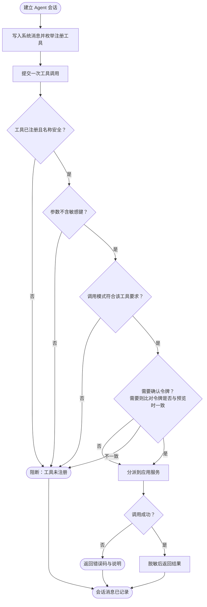

- 输入参数：
  - `title`：字符串，会话标题；来源为工程部署位置
- 输出参数：
  - `agent_message`：会话结果消息；去向为 `AGENT_DONE`

### START_AGENT

Agent 流程入口，建立一个会话。

- 输入参数：
  - `title`：字符串，会话标题；来源为工程部署位置
- 输出参数：
  - `agent_session`：含标识符、标题、状态与系统消息的会话；去向为 `TOOL_LIST`

### TOOL_LIST

写入一条系统消息，并枚举服务端固定注册的工具清单及其变更与确认属性。

- 输入参数：
  - `agent_session`：Agent 会话；来源为 `START_AGENT`
- 输出参数：
  - `tool_catalog`：含工具名与属性的注册清单；去向为 `INVOKE_TOOL`

### INVOKE_TOOL

接收一次工具调用，记录用户消息后进入校验。

- 输入参数：
  - `agent_session`：Agent 会话；来源为 `START_AGENT`
  - `tool_catalog`：含工具名与属性的注册清单；来源为 `TOOL_LIST`

- 输入参数：
  - `tool_name`：字符串，工具名；来源为工程部署位置
  - `mode`：字符串，调用模式；来源为工程部署位置
  - `arguments`：对象，工具参数；来源为工程部署位置
  - `confirmation_token`：字符串，可空；来源为工程部署位置
- 输出参数：
  - `tool_request`：工具调用请求；去向为 `TOOL_REGISTERED`

### TOOL_REGISTERED

校验工具名在注册清单内且不含不安全词。

- 输入参数：
  - `tool_request`：工具调用请求；来源为 `INVOKE_TOOL`
- 输出参数：
  - `tool_request`：校验通过的请求；去向为 `ARG_SAFE`
  - `blocked_code`：工具未注册的阻断码；去向为 `BLOCK_AGENT`

### ARG_SAFE

按键名递归检查参数，命中敏感词即阻断。

- 输入参数：
  - `tool_request`：工具调用请求；来源为 `TOOL_REGISTERED`
- 输出参数：
  - `tool_request`：参数安全的请求；去向为 `MODE_OK`
  - `blocked_code`：参数含敏感项的阻断码；去向为 `BLOCK_AGENT`

### MODE_OK

校验调用模式与工具属性相符：需确认的工具必须为确认模式，预览类工具必须为预览模式。

- 输入参数：
  - `tool_request`：工具调用请求；来源为 `ARG_SAFE`
- 输出参数：
  - `tool_request`：模式合规的请求；去向为 `NEEDS_TOKEN`
  - `blocked_code`：缺少确认或缺少预览的阻断码；去向为 `BLOCK_AGENT`

### NEEDS_TOKEN

判定该工具是否需要确认令牌。需要时比对调用回传的令牌与按规范化参数重算的令牌是否一致。

- 输入参数：
  - `tool_request`：工具调用请求；来源为 `MODE_OK`
- 输出参数：
  - `tool_request`：校验通过的请求；去向为 `DISPATCH_TOOL`
  - `blocked_code`：令牌不一致的阻断码；去向为 `BLOCK_AGENT`

### DISPATCH_TOOL

把调用分派到对应的应用服务：媒体库列举、资源列举、元数据预览、来源站搜索、下载客户端健康与任务、获取预览与获取确认各自绑定到同一批应用服务。

- 输入参数：
  - `tool_request`：工具调用请求；来源为 `NEEDS_TOKEN` 或 `MODE_OK`
- 输出参数：
  - `tool_result`：应用服务返回值；去向为 `CALL_OK`
  - `provider_error`：带错误类别的 Provider 错误；去向为 `CALL_OK`
  - `request_error`：键缺失、取值非法或类型不符的错误；去向为 `CALL_OK`

### CALL_OK

判定调用结果。成功进入脱敏返回，Provider 错误返回错误类别，参数错误返回无效请求码。

- 输入参数：
  - `tool_result`：应用服务返回值；来源为 `DISPATCH_TOOL`
  - `provider_error`：Provider 错误；来源为 `DISPATCH_TOOL`
  - `request_error`：请求解析错误；来源为 `DISPATCH_TOOL`
- 输出参数：
  - `tool_result`：应用服务返回值；去向为 `REDACT_RESULT`
  - `error_response`：含错误码与说明的响应；去向为 `AGENT_ERROR`

### REDACT_RESULT

对返回值脱敏后送出，并记录助手消息。

- 输入参数：
  - `tool_result`：应用服务返回值；来源为 `CALL_OK`
- 输出参数：
  - `agent_message`：含工具名、模式、状态与结果的助手消息；去向为 `AGENT_DONE`

### BLOCK_AGENT

Agent 流程的阻断出口。工具未注册、参数含敏感项、模式不符或令牌不一致时在此终止，不调用应用服务。

- 输入参数：
  - `blocked_code`：阻断码；来源为 `TOOL_REGISTERED`、`ARG_SAFE`、`MODE_OK` 或 `NEEDS_TOKEN`
- 输出参数：
  - `agent_message`：状态为阻断的助手消息；去向为 `AGENT_DONE`

### AGENT_ERROR

Agent 流程的失败出口，返回 Provider 错误类别或无效请求码与说明。

- 输入参数：
  - `error_response`：错误响应；来源为 `CALL_OK`
- 输出参数：
  - `agent_message`：状态为错误的助手消息；去向为 `AGENT_DONE`

### AGENT_DONE

Agent 流程的完成出口，会话消息均已记录，结果与阻断码可查询。

- 输入参数：
  - `agent_message`：助手消息；来源为 `REDACT_RESULT`、`BLOCK_AGENT` 或 `AGENT_ERROR`
- 输出参数：无

## 支撑流程

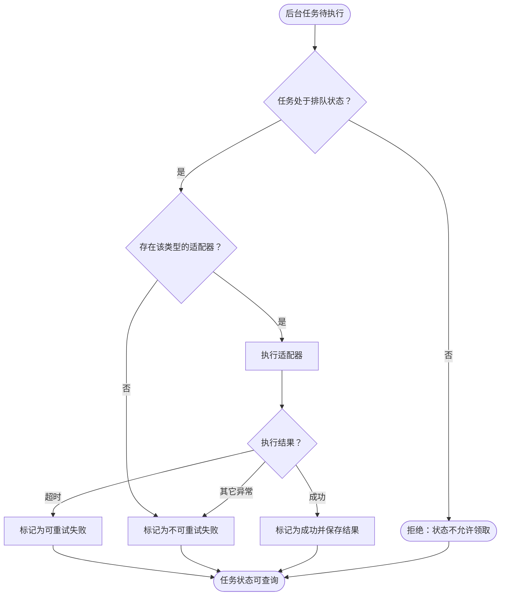

### START_SUPPORT

后台任务执行流程入口，接收一个任务标识。

- 输入参数：
  - `task_id`：标识符；来源为工程部署位置（任务存储）
- 输出参数：
  - `task_id`：任务标识；去向为 `CLAIM_TASK`

### CLAIM_TASK

领取任务并校验其处于排队状态，同时登记一次尝试。

- 输入参数：
  - `task_id`：任务标识；来源为 `START_SUPPORT`
- 输出参数：
  - `claimed_task`：已领取的任务，含类型与载荷；去向为 `LOOKUP_ADAPTER`
  - `claim_error`：状态不允许领取的错误；去向为 `SUPPORT_ERROR`

### LOOKUP_ADAPTER

按任务类型查找已注册的适配器。

- 输入参数：
  - `claimed_task`：已领取的任务；来源为 `CLAIM_TASK`
- 输出参数：
  - `adapter`：任务适配器；去向为 `RUN_ADAPTER`
  - `missing_adapter`：未注册该类型适配器的信号；去向为 `FAIL_TASK`

### RUN_ADAPTER

执行适配器并把异常按类别区分。

- 输入参数：
  - `adapter`：任务适配器；来源为 `LOOKUP_ADAPTER`
  - `claimed_task`：已领取的任务，提供载荷；来源为 `CLAIM_TASK`
- 输出参数：
  - `adapter_result`：适配器返回结果；去向为 `RUN_OK`
  - `timeout_error`：超时异常；去向为 `RUN_OK`
  - `adapter_error`：其它异常；去向为 `RUN_OK`

### RUN_OK

判定执行结果：超时记为可重试失败，其它异常记为不可重试失败，成功则保存结果。

- 输入参数：
  - `adapter_result`：适配器结果；来源为 `RUN_ADAPTER`
  - `timeout_error`：超时异常；来源为 `RUN_ADAPTER`
  - `adapter_error`：其它异常；来源为 `RUN_ADAPTER`
- 输出参数：
  - `retryable_failure`：可重试失败信号；去向为 `RETRY_TASK`
  - `terminal_failure`：不可重试失败信号；去向为 `FAIL_TASK`
  - `adapter_result`：适配器结果；去向为 `SUCCEED_TASK`

### RETRY_TASK

把任务标记为可重试的失败，保留恢复路径。

- 输入参数：
  - `retryable_failure`：可重试失败信号；来源为 `RUN_OK`
- 输出参数：
  - `task_record`：失败且可重试的任务记录；去向为 `SUPPORT_DONE`

### FAIL_TASK

把任务标记为不可重试的失败。适配器缺失与参数/逻辑类异常均归此出口。

- 输入参数：
  - `missing_adapter`：适配器缺失信号；来源为 `LOOKUP_ADAPTER`
  - `terminal_failure`：不可重试失败信号；来源为 `RUN_OK`
- 输出参数：
  - `task_record`：失败且不可重试的任务记录；去向为 `SUPPORT_DONE`

### SUCCEED_TASK

把任务标记为成功并保存执行结果。

- 输入参数：
  - `adapter_result`：适配器结果；来源为 `RUN_OK`
- 输出参数：
  - `task_record`：成功的任务记录；去向为 `SUPPORT_DONE`

### SUPPORT_ERROR

后台任务流程的失败出口，状态不允许领取时在此终止。

- 输入参数：
  - `claim_error`：领取错误；来源为 `CLAIM_TASK`
- 输出参数：
  - `error_response`：错误响应；去向为 `SUPPORT_DONE`

### SUPPORT_DONE

后台任务流程的完成出口，任务状态与结果可经接口查询。

- 输入参数：
  - `task_record`：任务记录；来源为 `RETRY_TASK`、`FAIL_TASK` 或 `SUCCEED_TASK`
  - `error_response`：错误响应；来源为 `SUPPORT_ERROR`
- 输出参数：无
