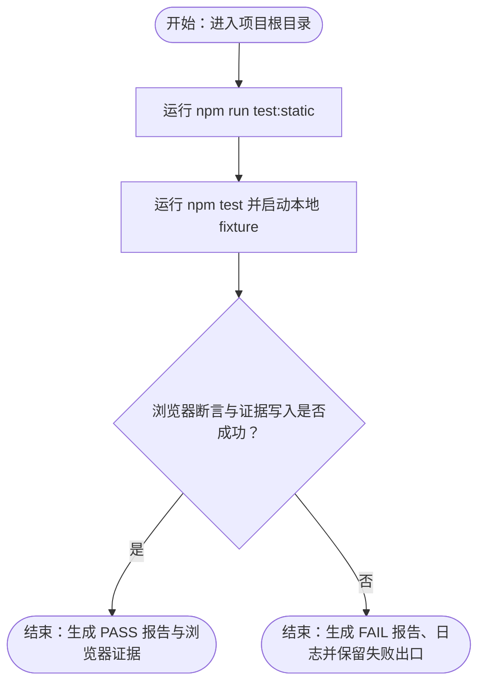

# testbench 从静态检查到浏览器证据的验证流程

本流程从项目根目录的静态约束检查开始，经本地 HTTP fixture 与真实 Chromium 页面交互，最终产出 PASS 报告或带日志的失败证据；Docker 运行当前不属于已验证路径。

## 主流程

## START

流程从 `assets/projects/testbench/testbench/` 开始；命令必须在该目录执行。项目入口、脚本和依赖以 `package.json` 为准。

**输入**

- `PROJECT_ROOT`：项目根目录；来源为调用者当前工作目录。

**输出**

- `PROJECT_ROOT_READY`：已定位到包含 `package.json`、`src/` 与 `tests/` 的项目根目录；去向为 STATIC。

## STATIC

执行 `npm run test:static`。该脚本读取 `package.json`、`src/index.html` 和 `src/server.js`，检查项目名、测试入口、页面标题与按钮、以及 HTTP server 创建；退出码为 0 才允许继续。此轮已验证该命令退出码 0；静态检查失败时流程在静态层终止，不应把浏览器层视为已验证。

**输入**

- `PROJECT_ROOT_READY`：项目根目录已就绪；来源为 START。
- `STATIC_SCRIPT`：`package.json` 中的 `test:static` 脚本；来源为 `package.json`。

**输出**

- `STATIC_PASS`：静态检查退出码 0；去向为 BROWSER。
- `STATIC_FAIL`：静态检查非 0 或断言失败；去向为失败出口。

## BROWSER

执行 `npm test`。`tests/e2e.js` 启动 `src/server.js` 的随机本地端口，等待监听日志，选择 `PLAYWRIGHT_CHROMIUM_EXECUTABLE_PATH` 或 `CHROMIUM_EXECUTABLE_PATH` 指定的浏览器（未指定时再查系统候选和 Playwright 缓存），并在 `tests/.artifacts/` 下为浏览器建立临时可写 `HOME/XDG` 环境。随后创建持久化上下文，访问 `/`，断言标题与初始状态，点击 `#run`，断言状态变为 `Check passed`，并写入截图、trace、服务端 stdout/stderr 与 HTML 报告。当前主机上的 `npm test` 退出码为 0。

**输入**

- `STATIC_PASS`：静态检查通过；来源为 STATIC。
- `BROWSER_EXECUTABLE`：由 `tests/e2e.js` 的环境变量、系统候选路径或 Playwright 缓存发现逻辑选定；来源为测试脚本。
- `WRITABLE_RUNTIME`：由 `tests/e2e.js` 在 `tests/.artifacts/` 下创建的隔离 `HOME/XDG` 环境；来源为测试脚本。

**输出**

- `E2E_RESULT`：浏览器断言、截图和 trace 阶段的结果；去向为 RESULT。
- `SERVER_LOGS`：`tests/.artifacts/server.stdout.log` 与 `server.stderr.log`；去向为 PASS 或 FAIL 证据。

## RESULT

检查 `npm test` 的退出码、`tests/.artifacts/report.html` 的结果字段以及浏览器证据是否存在。结果为通过的判定条件是退出码 0 且报告显示 `PASS`；任一启动、导航、断言、截图、trace 或报告写入错误都属于失败，不得以部分产物替代通过结论。

**输入**

- `E2E_RESULT`：`npm test` 的运行结果；来源为 BROWSER。
- `REPORT`：`tests/.artifacts/report.html`；来源为 BROWSER。
- `SERVER_LOGS`：服务端 stdout/stderr；来源为 BROWSER。

**输出**

- `VERIFIED_PASS`：退出码 0、报告为 PASS 且证据可取回；去向为 PASS。
- `VERIFIED_FAIL`：出现任一失败条件；去向为 FAIL。

## PASS

本轮已验证浏览器路径通过：`npm test` 退出码 0，`tests/.artifacts/report.html` 显示 `PASS`，并生成 `tests/.artifacts/testbench.png`、`trace.zip` 及服务端日志。报告正文为“Browser rendered the page and completed the interactive check.”。这些文件是运行时证据，目录按项目说明被忽略，不是源码。

**输入**

- `VERIFIED_PASS`：通过判据成立；来源为 RESULT。
- `ARTIFACT_SET`：截图、trace、HTML 报告和服务端日志；来源为 `tests/.artifacts/`。

**输出**

- `ARCHIVED_EVIDENCE`：可复核的 PASS 报告与运行产物；去向为流程结束。

## FAIL

失败出口保留 `tests/.artifacts/report.html`、`server.stdout.log`、`server.stderr.log` 及已生成的截图或 trace；先查看报告和两份服务端日志，再核对浏览器可执行文件与运行时环境。本机没有 `docker` 命令，因此 Docker 路径尚未验证。

**输入**

- `VERIFIED_FAIL`：启动、导航、断言或证据写入失败；来源为 RESULT。
- `FAILURE_ARTIFACTS`：失败报告与日志；来源为 BROWSER。

**输出**

- `DIAGNOSTIC_RECORD`：带退出码、报告、日志和运行环境的失败记录；去向为流程结束。
